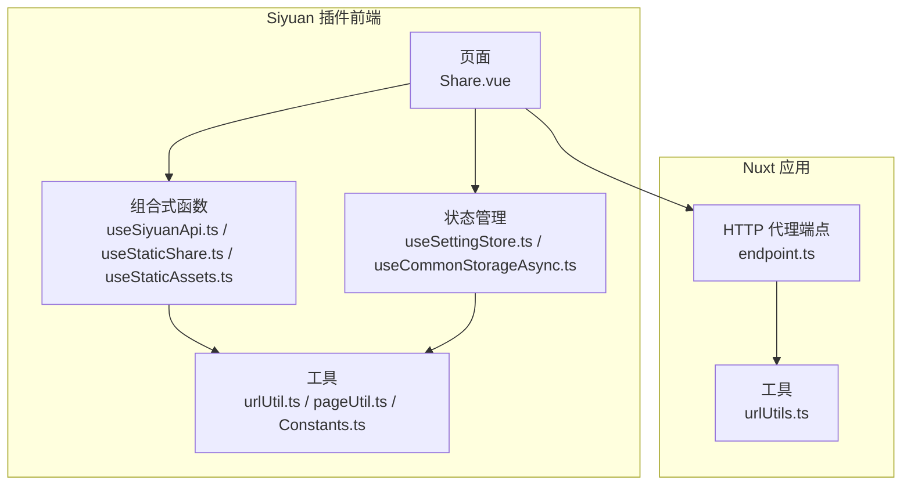
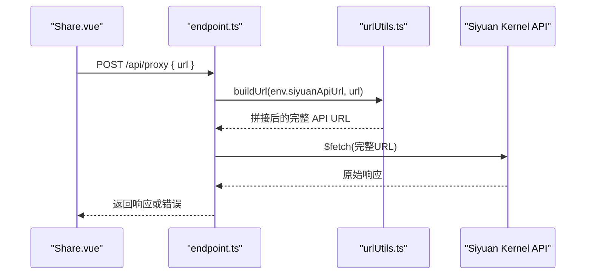
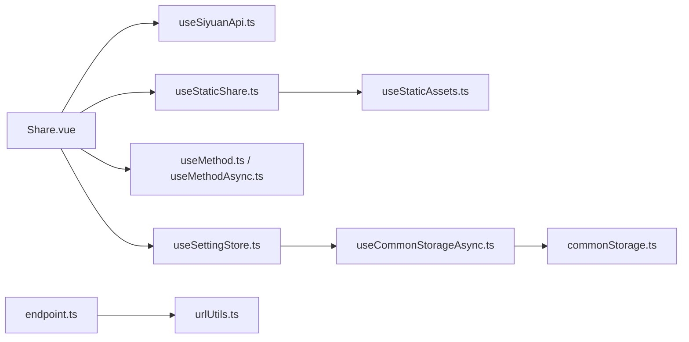

# API 参考

<cite>
**本文引用的文件**
- [plugin.json](file://plugin.json)
- [endpoint.ts](file://apps/app/server/api/endpoint.ts)
- [urlUtils.ts](file://apps/app/server/utils/urlUtils.ts)
- [useSiyuanApi.ts](file://apps/siyuan/src/composables/useSiyuanApi.ts)
- [useMethod.ts](file://apps/siyuan/src/composables/useMethod.ts)
- [useMethodAsync.ts](file://apps/siyuan/src/composables/useMethodAsync.ts)
- [useStaticShare.ts](file://apps/siyuan/src/composables/useStaticShare.ts)
- [useStaticAssets.ts](file://apps/siyuan/src/composables/useStaticAssets.ts)
- [useSettingStore.ts](file://apps/siyuan/src/stores/useSettingStore.ts)
- [commonStorage.ts](file://apps/siyuan/src/stores/common/commonStorage.ts)
- [useCommonStorageAsync.ts](file://apps/siyuan/src/stores/common/useCommonStorageAsync.ts)
- [Share.vue](file://apps/siyuan/src/pages/Share.vue)
- [app.config.ts](file://apps/siyuan/src/app.config.ts)
- [Constants.ts](file://apps/siyuan/src/Constants.ts)
- [urlUtil.ts](file://apps/siyuan/src/utils/urlUtil.ts)
- [pageUtil.ts](file://apps/siyuan/src/utils/pageUtil.ts)
- [bootstrap.ts](file://apps/siyuan/src/bootstrap.ts)
</cite>

## 目录
1. [简介](#简介)
2. [项目结构](#项目结构)
3. [核心组件](#核心组件)
4. [架构总览](#架构总览)
5. [详细组件分析](#详细组件分析)
6. [依赖关系分析](#依赖关系分析)
7. [性能考量](#性能考量)
8. [故障排查指南](#故障排查指南)
9. [结论](#结论)
10. [附录](#附录)

## 简介
本文件为 Siyuan Plugin Blog 的完整 API 参考，覆盖以下方面：
- HTTP API：代理端点、请求方法、参数格式、响应行为与错误码
- Vue 组合式函数：参数类型、返回值、典型用法与调用流程
- SiYuan API 集成：数据获取、状态管理、事件与消息提示
- TypeScript 类型定义与接口文档
- 错误码说明、异常处理与重试建议
- 实际调用示例与集成指南
- 版本控制策略与废弃接口迁移路径

## 项目结构
该项目采用多应用分层组织：
- apps/siyuan：Siyuan 插件前端（Vue 组合式函数、页面、状态管理、工具）
- apps/app：Nuxt 应用（服务端代理、静态资源、构建产物）
- packages：共享包（如 ESLint 配置、UI 组件等）
- 根目录：插件元数据、脚本与工作流

图表来源
- [Share.vue:10-34](file://apps/siyuan/src/pages/Share.vue#L10-L34)
- [useSiyuanApi.ts:17-28](file://apps/siyuan/src/composables/useSiyuanApi.ts#L17-L28)
- [useStaticShare.ts:17-95](file://apps/siyuan/src/composables/useStaticShare.ts#L17-L95)
- [useStaticAssets.ts:14-96](file://apps/siyuan/src/composables/useStaticAssets.ts#L14-L96)
- [useSettingStore.ts:20-78](file://apps/siyuan/src/stores/useSettingStore.ts#L20-L78)
- [useCommonStorageAsync.ts:21-62](file://apps/siyuan/src/stores/common/useCommonStorageAsync.ts#L21-L62)
- [endpoint.ts:12-39](file://apps/app/server/api/endpoint.ts#L12-L39)
- [urlUtils.ts](file://apps/app/server/utils/urlUtils.ts)

章节来源
- [plugin.json:1-43](file://plugin.json#L1-L43)

## 核心组件
- HTTP 代理端点：接收 POST 请求，转发至配置的 SiYuan API 地址，统一错误处理
- Vue 组合式函数：封装 SiYuan Kernel API、静态分享、静态资源下载、方法异常处理
- 状态管理：基于本地存储的配置读写与缓存
- 页面：分享开关、复制链接、设置首页、过期时间、批量清理等

章节来源
- [endpoint.ts:12-39](file://apps/app/server/api/endpoint.ts#L12-L39)
- [useSiyuanApi.ts:17-28](file://apps/siyuan/src/composables/useSiyuanApi.ts#L17-L28)
- [useStaticShare.ts:17-95](file://apps/siyuan/src/composables/useStaticShare.ts#L17-L95)
- [useStaticAssets.ts:14-96](file://apps/siyuan/src/composables/useStaticAssets.ts#L14-L96)
- [useSettingStore.ts:20-78](file://apps/siyuan/src/stores/useSettingStore.ts#L20-L78)
- [useCommonStorageAsync.ts:21-62](file://apps/siyuan/src/stores/common/useCommonStorageAsync.ts#L21-L62)
- [Share.vue:23-244](file://apps/siyuan/src/pages/Share.vue#L23-L244)

## 架构总览
Siyuan 插件前端通过组合式函数访问 SiYuan Kernel API；当需要跨域或统一代理时，页面请求经由 Nuxt 代理端点转发至 SiYuan API。

图表来源
- [endpoint.ts:12-39](file://apps/app/server/api/endpoint.ts#L12-L39)
- [urlUtils.ts](file://apps/app/server/utils/urlUtils)

## 详细组件分析

### HTTP API：代理端点
- 端点：/api/proxy
- 方法：POST
- 请求头：Content-Type: application/json
- 请求体字段
  - url: string，相对或绝对的 SiYuan API 路径（例如 /api/filetree/getDoc）
- 成功响应
  - 直接透传目标 API 的响应体与状态码
- 错误处理
  - Method not allowed：405
  - Resource not found：404
  - 其他异常：500，携带原始错误消息
- 示例
  - 请求：POST /api/proxy，Body: {"url":"/api/snippet/getSnippet"}
  - 响应：200 + 原始 JSON 响应

章节来源
- [endpoint.ts:12-39](file://apps/app/server/api/endpoint.ts#L12-L39)

### Vue 组合式函数

#### useSiyuanApi
- 作用：初始化并返回 SiYuan API 适配器与内核 API 实例
- 返回
  - blogApi: SiYuan API 适配器实例
  - kernelApi: SiYuan Kernel API 实例
- 适用场景：读取文档、设置属性、保存文本、上传文件等

章节来源
- [useSiyuanApi.ts:17-28](file://apps/siyuan/src/composables/useSiyuanApi.ts#L17-L28)

#### useMethod / useMethodAsync
- 作用：统一封装同步/异步方法的异常处理与用户提示
- 参数
  - pluginInstance: 插件实例（用于国际化文案）
- 返回
  - handleMethod(fn): 同步执行并提示成功/失败
  - handleMethodAsync(fn, errorHandler?): 异步执行，支持前置校验回调
- 行为
  - 成功：显示“操作成功”提示
  - 失败：记录日志并显示“操作失败 + 错误信息”

章节来源
- [useMethod.ts:16-30](file://apps/siyuan/src/composables/useMethod.ts#L16-L30)
- [useMethodAsync.ts:16-36](file://apps/siyuan/src/composables/useMethodAsync.ts#L16-L36)

#### useStaticShare
- 作用：静态分享的开启/更新/关闭与清理
- 方法
  - openStaticShare(pageId, post): 生成并保存静态分享 JSON 与资源
  - updateStaticShare(pageId): 重新拉取文章并更新静态分享
  - closeStaticShare(pageId): 删除静态分享 JSON 与资源
  - clearSharePages(): 清理全部静态分享数据
- 关键行为
  - 仅暴露必要字段到分享 JSON
  - 下载并保存图片资源到 /data/public/siyuan-blog/{pageId}/...

章节来源
- [useStaticShare.ts:17-95](file://apps/siyuan/src/composables/useStaticShare.ts#L17-L95)

#### useStaticAssets
- 作用：从 HTML 中提取并下载图片资源到公共目录
- 方法
  - downloadAssetsToPublic(html, saveFolder): 解析 HTML，下载非网络图片，保存到目标路径
- 校验规则
  - 跳过非法 Windows 文件名与以点结尾的文件名
  - 跳过 http 开头的外链图片
- 异常处理
  - 下载失败会记录错误，不影响整体流程

章节来源
- [useStaticAssets.ts:14-96](file://apps/siyuan/src/composables/useStaticAssets.ts#L14-L96)

### 状态管理与存储

#### useSettingStore
- 作用：读取/更新站点配置（含主题、首页、分享模板等），并从本地存储加载/持久化
- 关键方法
  - getSetting(): Promise<AppConfig>
  - updateSetting(setting: Partial<AppConfig>): Promise<void>
- 行为
  - 首次访问时从本地存储加载初始值
  - 支持附加获取自定义 CSS 片段
  - 写入时合并并持久化

章节来源
- [useSettingStore.ts:20-78](file://apps/siyuan/src/stores/useSettingStore.ts#L20-L78)
- [app.config.ts:12-58](file://apps/siyuan/src/app.config.ts#L12-L58)

#### useCommonStorageAsync 与 CommonStorage
- 作用：基于 SiYuan Kernel API 的异步存储适配器，模拟 StorageLikeAsync
- 关键方法
  - get(): Promise<T>（首次为空则写入初始值）
  - set(value: T): Promise<void>
- 序列化：自动推断类型并使用对应序列化器

章节来源
- [useCommonStorageAsync.ts:21-62](file://apps/siyuan/src/stores/common/useCommonStorageAsync.ts#L21-L62)
- [commonStorage.ts:25-84](file://apps/siyuan/src/stores/common/commonStorage.ts#L25-L84)

### 页面：Share.vue
- 功能概览
  - 分享开关：设置/清除 custom-publish-status 与 custom-publish-time
  - 复制分享链接：支持模板替换 [title]、[url]、[expired]
  - IP 切换：根据站点域名动态调整分享链接主机名
  - 过期时间：设置 custom-expires 并更新静态分享
  - 设为首页：更新 homePageId
  - 清理全部分享：删除 /data/public/siyuan-blog 下全部数据
- 依赖
  - useSiyuanApi、useSettingStore、useMethod、useMethodAsync、useStaticShare

章节来源
- [Share.vue:23-244](file://apps/siyuan/src/pages/Share.vue#L23-L244)

### 工具与常量

#### urlUtil.ts
- getAllIps(): 获取可用 IPv4 列表（含系统网卡与配置）
- getAvailableOrigin(): 将 127.0.0.1/localhost 替换为可用本地 IP

章节来源
- [urlUtil.ts:47-77](file://apps/siyuan/src/utils/urlUtil.ts#L47-L77)

#### pageUtil.ts
- getPageId(): 从页面 DOM 中提取当前文档 ID

章节来源
- [pageUtil.ts:13-21](file://apps/siyuan/src/utils/pageUtil.ts#L13-L21)

#### Constants.ts
- DEFAULT_SIYUAN_LANG、isDev、SH_BUILD_TIME、DEFAULT_SIYUAN_API_URL

章节来源
- [Constants.ts:10-16](file://apps/siyuan/src/Constants.ts#L10-L16)

## 依赖关系分析

图表来源
- [Share.vue:10-34](file://apps/siyuan/src/pages/Share.vue#L10-L34)
- [useSiyuanApi.ts:17-28](file://apps/siyuan/src/composables/useSiyuanApi.ts#L17-L28)
- [useSettingStore.ts:20-78](file://apps/siyuan/src/stores/useSettingStore.ts#L20-L78)
- [useMethod.ts:16-30](file://apps/siyuan/src/composables/useMethod.ts#L16-L30)
- [useMethodAsync.ts:16-36](file://apps/siyuan/src/composables/useMethodAsync.ts#L16-L36)
- [useStaticShare.ts:17-95](file://apps/siyuan/src/composables/useStaticShare.ts#L17-L95)
- [useStaticAssets.ts:14-96](file://apps/siyuan/src/composables/useStaticAssets.ts#L14-L96)
- [useCommonStorageAsync.ts:21-62](file://apps/siyuan/src/stores/common/useCommonStorageAsync.ts#L21-L62)
- [commonStorage.ts:25-84](file://apps/siyuan/src/stores/common/commonStorage.ts#L25-L84)
- [endpoint.ts:12-39](file://apps/app/server/api/endpoint.ts#L12-L39)
- [urlUtils.ts](file://apps/app/server/utils/urlUtils)

## 性能考量
- 静态资源下载
  - 使用 Cheerio 解析 HTML，逐张图片下载，循环内等待可能带来延迟
  - 建议：对大文档进行分批处理或在后台任务中执行
- 代理转发
  - 直接透传响应，避免额外编解码开销
  - 建议：在客户端缓存常用 API 结果，减少重复请求
- 存储读写
  - 首次访问若无数据会写入初始值，避免空值分支
  - 建议：对频繁更新的配置进行节流/防抖

## 故障排查指南
- HTTP 代理错误
  - 405：仅允许 POST 方法
  - 404：目标资源不存在
  - 500：其他异常，查看日志定位具体原因
- 分享失败
  - 检查页面属性 custom-publish-status 是否正确设置
  - 确认 /data/public/siyuan-blog 下的 JSON 与资源是否存在
- IP 切换无效
  - 确认 getAllIps() 返回的可用 IP 列表
  - 检查 getAvailableOrigin() 是否正确替换主机名
- 存储异常
  - 若本地存储为空，系统会写入初始值；检查 Kernel API 的文件读写权限

章节来源
- [endpoint.ts:22-37](file://apps/app/server/api/endpoint.ts#L22-L37)
- [Share.vue:66-118](file://apps/siyuan/src/pages/Share.vue#L66-L118)
- [urlUtil.ts:47-77](file://apps/siyuan/src/utils/urlUtil.ts#L47-L77)
- [commonStorage.ts:43-61](file://apps/siyuan/src/stores/common/commonStorage.ts#L43-L61)

## 结论
本参考文档梳理了 Siyuan Plugin Blog 的 HTTP 代理端点、Vue 组合式函数、状态管理与页面交互的完整 API 规范。通过统一的异常处理与存储适配，系统在保证易用性的同时提供了清晰的扩展点。建议在生产环境中结合缓存与后台任务优化性能，并完善日志与监控以便快速定位问题。

## 附录

### TypeScript 类型定义与接口文档

- AppConfig
  - 字段
    - lang?: string
    - siteUrl?: string
    - siteTitle?: string
    - siteSlogan?: string
    - siteDescription?: string
    - homePageId?: string
    - header?: string
    - footer?: string
    - shareTemplate?: string
    - theme?: { mode?: "system"|"dark"|"light"; lightTheme?: string; darkTheme?: string; themeVersion?: string }
    - customCss: Array<{ name: string; content: string }>
    - [key: string]: any
  - 默认值：见 AppConfig 常量

章节来源
- [app.config.ts:12-58](file://apps/siyuan/src/app.config.ts#L12-L58)

- 页面与属性
  - 页面 ID：通过 pageUtil.getPageId() 或 Share.vue 的 props.id 获取
  - 文档属性（示例）：custom-publish-status、custom-publish-time、custom-expires、homePageId

章节来源
- [pageUtil.ts:13-21](file://apps/siyuan/src/utils/pageUtil.ts#L13-L21)
- [Share.vue:73-86](file://apps/siyuan/src/pages/Share.vue#L73-L86)

### 错误码说明
- 405 Method Not Allowed：仅允许 POST
- 404 Resource Not Found：目标资源不存在
- 500 Internal Server Error：其他异常，包含原始错误消息

章节来源
- [endpoint.ts:33-37](file://apps/app/server/api/endpoint.ts#L33-L37)

### 异常处理与重试机制
- 统一异常处理
  - useMethod / useMethodAsync：捕获异常并提示，随后抛出
  - proxy：按状态码映射错误，404 明确提示资源不存在
- 重试建议
  - 对于临时网络波动，可在客户端增加指数退避重试
  - 对于 404，建议先校验目标 API 路径与参数

章节来源
- [useMethod.ts:19-27](file://apps/siyuan/src/composables/useMethod.ts#L19-L27)
- [useMethodAsync.ts:19-33](file://apps/siyuan/src/composables/useMethodAsync.ts#L19-L33)
- [endpoint.ts:21-31](file://apps/app/server/api/endpoint.ts#L21-L31)

### 实际调用示例与集成指南

- 通过代理端点访问 SiYuan API
  - 步骤
    - 发送 POST 请求到 /api/proxy，Body 包含 url
    - 例如：{"url":"/api/snippet/getSnippet"}
  - 响应：透传目标 API 的 JSON 响应
- 在页面中集成分享功能
  - 通过 Share.vue 的交互完成分享开关、复制链接、设置首页、过期时间与清理
  - 依赖组合式函数：useSiyuanApi、useSettingStore、useMethod、useMethodAsync、useStaticShare
- 静态资源处理
  - 使用 useStaticAssets.downloadAssetsToPublic 解析 HTML 并下载图片
  - 注意：跳过外链与非法文件名

章节来源
- [endpoint.ts:12-39](file://apps/app/server/api/endpoint.ts#L12-L39)
- [Share.vue:66-217](file://apps/siyuan/src/pages/Share.vue#L66-L217)
- [useStaticAssets.ts:18-51](file://apps/siyuan/src/composables/useStaticAssets.ts#L18-L51)

### 版本控制策略与废弃接口迁移路径
- 版本来源
  - 插件版本：见 plugin.json 的 version 字段
- 迁移建议
  - 当 API 名称或参数变更时，优先提供兼容层并在新版本中逐步弃用旧接口
  - 通过日志与用户提示引导升级
- 当前仓库未发现明确的废弃接口清单，建议在发布变更时更新 README 与变更日志

章节来源
- [plugin.json:5-5](file://plugin.json#L5-L5)