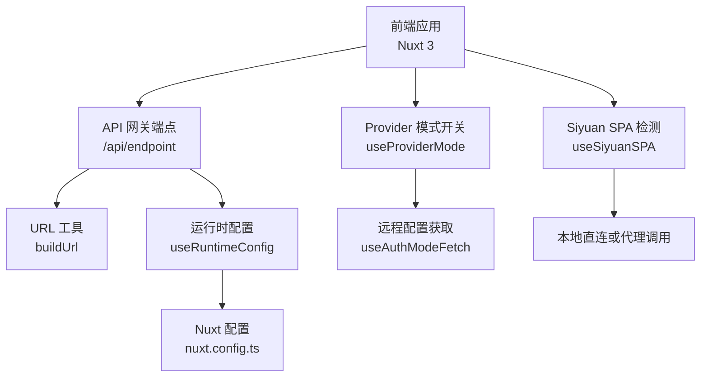
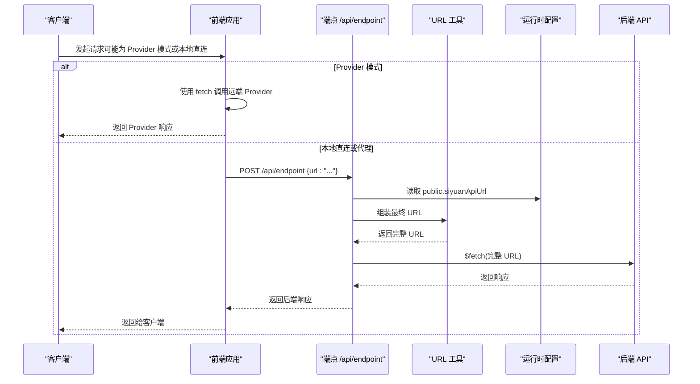
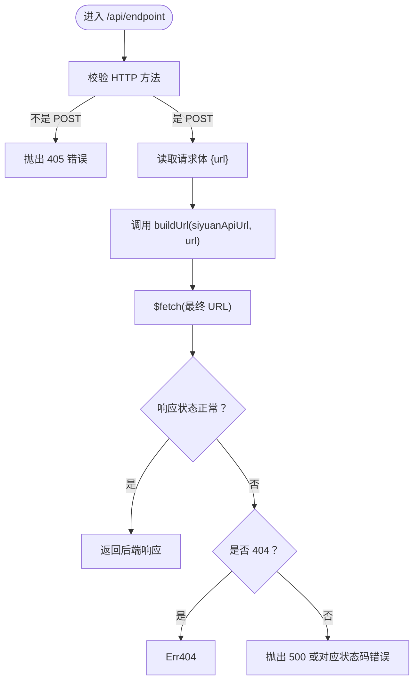
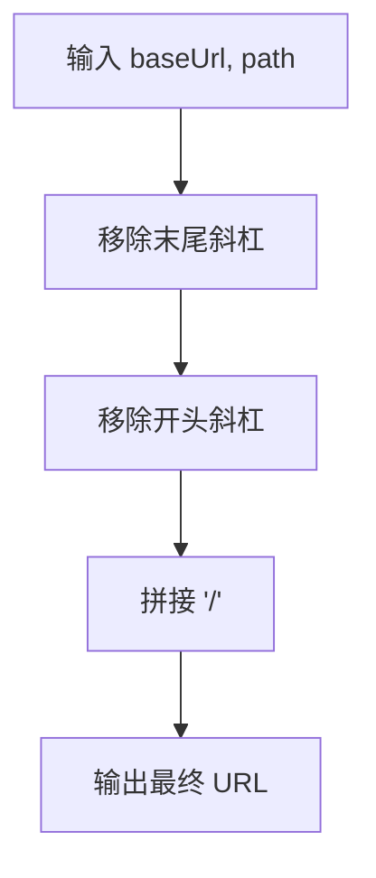
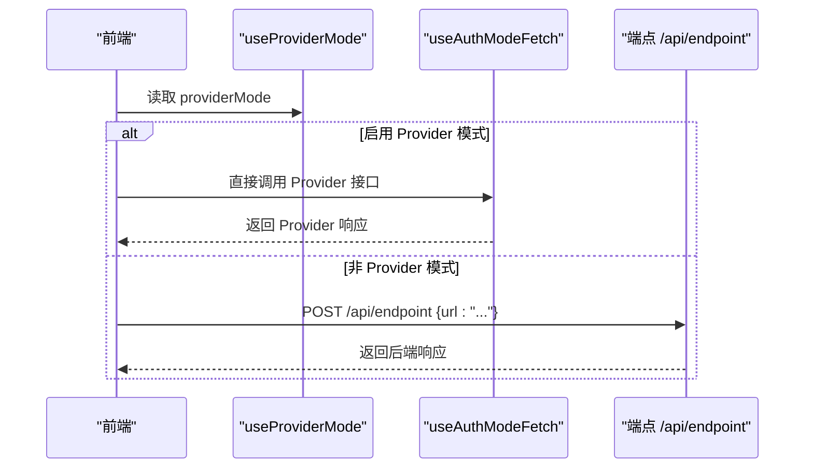
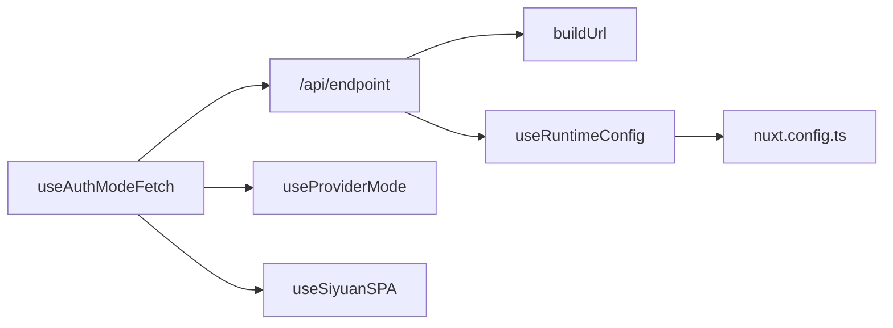

# HTTP API

<cite>
**本文引用的文件**
- [apps/app/server/api/endpoint.ts](file://apps/app/server/api/endpoint.ts)
- [apps/app/server/utils/urlUtils.ts](file://apps/app/server/utils/urlUtils.ts)
- [apps/app/nuxt.config.ts](file://apps/app/nuxt.config.ts)
- [apps/app/nuxt.siyuan.config.ts](file://apps/app/nuxt.siyuan.config.ts)
- [apps/app/composables/useAuthModeFetch.ts](file://apps/app/composables/useAuthModeFetch.ts)
- [apps/app/composables/useProviderMode.ts](file://apps/app/composables/useProviderMode.ts)
- [apps/app/composables/useSiyuanSPA.ts](file://apps/app/composables/useSiyuanSPA.ts)
- [apps/app/utils/Constants.ts](file://apps/app/utils/Constants.ts)
- [apps/siyuan/plugin.json](file://apps/siyuan/plugin.json)
</cite>

## 目录
1. [引言](#引言)
2. [项目结构](#项目结构)
3. [核心组件](#核心组件)
4. [架构总览](#架构总览)
5. [详细组件分析](#详细组件分析)
6. [依赖关系分析](#依赖关系分析)
7. [性能考量](#性能考量)
8. [故障排查指南](#故障排查指南)
9. [结论](#结论)
10. [附录](#附录)

## 引言
本文件面向服务器端与前端集成开发者，系统化说明 HTTP API 的使用方式、请求与响应规范、错误处理机制、API 网关工作原理（URL 构建、请求转发、状态码处理）、运行时配置与环境变量、版本控制策略与向后兼容性建议。重点围绕统一的“代理转发”端点与相关工具函数展开，帮助在不同运行模式（如 Siyuan SPA、Provider 模式）下正确调用。

## 项目结构
本项目采用 Nuxt 3 应用作为前端与服务端网关，核心 API 位于服务器端事件处理器中，并通过工具函数完成 URL 组装与运行时配置读取。关键目录与文件如下：
- 服务器端 API：apps/app/server/api/endpoint.ts
- URL 工具：apps/app/server/utils/urlUtils.ts
- Nuxt 配置（通用）：apps/app/nuxt.config.ts
- Nuxt 配置（Siyuan 模式）：apps/app/nuxt.siyuan.config.ts
- 前端组合式工具（含 Provider 模式与代理调用）：apps/app/composables/useAuthModeFetch.ts
- 运行时配置读取封装：apps/app/composables/useProviderMode.ts、apps/app/composables/useSiyuanSPA.ts
- 常量与版本信息：apps/app/utils/Constants.ts
- 插件元信息（版本号等）：apps/siyuan/plugin.json

图表来源
- [apps/app/server/api/endpoint.ts:12-39](file://apps/app/server/api/endpoint.ts#L12-L39)
- [apps/app/server/utils/urlUtils.ts:10-14](file://apps/app/server/utils/urlUtils.ts#L10-L14)
- [apps/app/nuxt.config.ts:114-121](file://apps/app/nuxt.config.ts#L114-L121)
- [apps/app/composables/useAuthModeFetch.ts:15-56](file://apps/app/composables/useAuthModeFetch.ts#L15-L56)
- [apps/app/composables/useProviderMode.ts:16-22](file://apps/app/composables/useProviderMode.ts#L16-L22)
- [apps/app/composables/useSiyuanSPA.ts:10-15](file://apps/app/composables/useSiyuanSPA.ts#L10-L15)

章节来源
- [apps/app/server/api/endpoint.ts:12-39](file://apps/app/server/api/endpoint.ts#L12-L39)
- [apps/app/server/utils/urlUtils.ts:10-14](file://apps/app/server/utils/urlUtils.ts#L10-L14)
- [apps/app/nuxt.config.ts:114-121](file://apps/app/nuxt.config.ts#L114-L121)
- [apps/app/nuxt.siyuan.config.ts:16,121-129](file://apps/app/nuxt.siyuan.config.ts#L16,L121-L129)
- [apps/app/composables/useAuthModeFetch.ts:15-56](file://apps/app/composables/useAuthModeFetch.ts#L15-L56)
- [apps/app/composables/useProviderMode.ts:16-22](file://apps/app/composables/useProviderMode.ts#L16-L22)
- [apps/app/composables/useSiyuanSPA.ts:10-15](file://apps/app/composables/useSiyuanSPA.ts#L10-L15)

## 核心组件
- 代理端点 /api/endpoint
  - 方法：仅接受 POST
  - 请求体：JSON，包含字段 url（相对路径）
  - 行为：将运行时配置中的 siyuanApiUrl 与请求体 url 拼接，发起后端请求并返回结果；对 404 与非 404 错误进行差异化处理
- URL 工具 buildUrl
  - 功能：清理基础地址尾部斜杠与路径起始斜杠，拼接生成最终 URL
- 运行时配置
  - 关键项：public.siyuanApiUrl、public.providerMode、public.providerUrl、public.defaultType
  - 默认值来源于 Nuxt 配置与环境变量
- Provider 模式与 Siyuan SPA 检测
  - 通过 useProviderMode 与 useSiyuanSPA 读取运行时配置，决定调用路径与行为

章节来源
- [apps/app/server/api/endpoint.ts:12-39](file://apps/app/server/api/endpoint.ts#L12-L39)
- [apps/app/server/utils/urlUtils.ts:10-14](file://apps/app/server/utils/urlUtils.ts#L10-L14)
- [apps/app/nuxt.config.ts:114-121](file://apps/app/nuxt.config.ts#L114-L121)
- [apps/app/composables/useProviderMode.ts:16-22](file://apps/app/composables/useProviderMode.ts#L16-L22)
- [apps/app/composables/useSiyuanSPA.ts:10-15](file://apps/app/composables/useSiyuanSPA.ts#L10-L15)

## 架构总览
下图展示从浏览器到后端 API 的典型调用链路，以及在不同模式下的分支逻辑。

图表来源
- [apps/app/server/api/endpoint.ts:12-39](file://apps/app/server/api/endpoint.ts#L12-L39)
- [apps/app/server/utils/urlUtils.ts:10-14](file://apps/app/server/utils/urlUtils.ts#L10-L14)
- [apps/app/nuxt.config.ts:114-121](file://apps/app/nuxt.config.ts#L114-L121)
- [apps/app/composables/useAuthModeFetch.ts:15-56](file://apps/app/composables/useAuthModeFetch.ts#L15-L56)

## 详细组件分析

### 组件一：统一代理端点 /api/endpoint
- 端点地址：/api/endpoint
- 方法：POST
- 请求参数（JSON）
  - url：字符串，表示目标资源的相对路径
- 响应数据结构
  - 成功：直接透传后端 API 的响应内容与状态
  - 失败：根据异常类型返回错误对象（包含 message 与 statusCode）
- 错误处理机制
  - 当后端返回 404：抛出 404 错误
  - 其他异常：抛出 500 或对应状态码的错误
  - 非 POST 方法：抛出 405 错误
- URL 构建规则
  - 基于运行时配置 public.siyuanApiUrl 与请求体 url 拼接
  - 自动去除尾部多余斜杠与起始斜杠，避免重复或遗漏

图表来源
- [apps/app/server/api/endpoint.ts:12-39](file://apps/app/server/api/endpoint.ts#L12-L39)
- [apps/app/server/utils/urlUtils.ts:10-14](file://apps/app/server/utils/urlUtils.ts#L10-L14)

章节来源
- [apps/app/server/api/endpoint.ts:12-39](file://apps/app/server/api/endpoint.ts#L12-L39)
- [apps/app/server/utils/urlUtils.ts:10-14](file://apps/app/server/utils/urlUtils.ts#L10-L14)

### 组件二：URL 工具 buildUrl
- 输入：基础地址（baseUrl）、路径（path）
- 规则：移除 baseUrl 尾斜杠，移除 path 的首斜杠，再拼接
- 输出：规范化后的完整 URL 字符串

图表来源
- [apps/app/server/utils/urlUtils.ts:10-14](file://apps/app/server/utils/urlUtils.ts#L10-L14)

章节来源
- [apps/app/server/utils/urlUtils.ts:10-14](file://apps/app/server/utils/urlUtils.ts#L10-L14)

### 组件三：运行时配置与环境变量
- 关键配置项（public.*）
  - defaultType：默认类型（如 siyuan）
  - siyuanApiUrl：后端 API 基础地址
  - providerMode：是否启用 Provider 模式
  - providerUrl：Provider 服务地址
- 默认值来源
  - Nuxt 配置文件中 runtimeConfig.public.* 提供默认值
  - 可通过环境变量覆盖（例如 NUXT_PUBLIC_SIYUAN_API_URL）

章节来源
- [apps/app/nuxt.config.ts:114-121](file://apps/app/nuxt.config.ts#L114-L121)
- [apps/app/nuxt.siyuan.config.ts:121-129](file://apps/app/nuxt.siyuan.config.ts#L121-L129)

### 组件四：Provider 模式与前端调用
- Provider 模式
  - 通过 useProviderMode 判断是否启用
  - 在该模式下，前端直接调用远端 Provider 的接口，无需经由 /api/endpoint
- 本地直连或代理
  - 在非 Provider 模式下，前端可直接访问后端 API，或通过 /api/endpoint 代理转发
  - useAuthModeFetch 中包含多种远程配置与文档元数据获取的示例

图表来源
- [apps/app/composables/useProviderMode.ts:16-22](file://apps/app/composables/useProviderMode.ts#L16-L22)
- [apps/app/composables/useAuthModeFetch.ts:15-56](file://apps/app/composables/useAuthModeFetch.ts#L15-L56)
- [apps/app/server/api/endpoint.ts:12-39](file://apps/app/server/api/endpoint.ts#L12-L39)

章节来源
- [apps/app/composables/useProviderMode.ts:16-22](file://apps/app/composables/useProviderMode.ts#L16-L22)
- [apps/app/composables/useAuthModeFetch.ts:15-56](file://apps/app/composables/useAuthModeFetch.ts#L15-L56)

## 依赖关系分析
- 端点 /api/endpoint 依赖
  - 运行时配置：public.siyuanApiUrl
  - URL 工具：buildUrl
- 前端组合式函数依赖
  - useProviderMode：读取 providerMode
  - useSiyuanSPA：判断是否为 Siyuan SPA
  - useAuthModeFetch：封装 Provider 与本地调用逻辑
- 配置来源
  - Nuxt 配置文件提供默认值与环境变量覆盖能力

图表来源
- [apps/app/server/api/endpoint.ts:12-39](file://apps/app/server/api/endpoint.ts#L12-L39)
- [apps/app/server/utils/urlUtils.ts:10-14](file://apps/app/server/utils/urlUtils.ts#L10-L14)
- [apps/app/nuxt.config.ts:114-121](file://apps/app/nuxt.config.ts#L114-L121)
- [apps/app/composables/useAuthModeFetch.ts:15-56](file://apps/app/composables/useAuthModeFetch.ts#L15-L56)
- [apps/app/composables/useProviderMode.ts:16-22](file://apps/app/composables/useProviderMode.ts#L16-L22)
- [apps/app/composables/useSiyuanSPA.ts:10-15](file://apps/app/composables/useSiyuanSPA.ts#L10-L15)

章节来源
- [apps/app/server/api/endpoint.ts:12-39](file://apps/app/server/api/endpoint.ts#L12-L39)
- [apps/app/server/utils/urlUtils.ts:10-14](file://apps/app/server/utils/urlUtils.ts#L10-L14)
- [apps/app/nuxt.config.ts:114-121](file://apps/app/nuxt.config.ts#L114-L121)
- [apps/app/composables/useAuthModeFetch.ts:15-56](file://apps/app/composables/useAuthModeFetch.ts#L15-L56)
- [apps/app/composables/useProviderMode.ts:16-22](file://apps/app/composables/useProviderMode.ts#L16-L22)
- [apps/app/composables/useSiyuanSPA.ts:10-15](file://apps/app/composables/useSiyuanSPA.ts#L10-L15)

## 性能考量
- 代理转发的延迟取决于后端 API 的可用性与网络状况，建议在前端缓存稳定不变的数据（如配置文件），减少重复请求。
- Provider 模式下，直接调用远端服务可降低本地代理开销，但需考虑跨域与网络稳定性。
- URL 工具为纯字符串拼接，开销极低，无需额外优化。
- 对频繁调用的端点，建议在上游增加缓存层或 CDN，以降低后端压力。

## 故障排查指南
- 405 Method Not Allowed
  - 现象：仅允许 POST，其他方法会触发此错误
  - 处理：确保使用 POST 方法调用 /api/endpoint
- 404 Resource Not Found
  - 现象：当后端返回 404 时，端点会抛出 404 错误
  - 处理：检查请求体 url 是否正确，确认目标资源是否存在
- 500 Internal Server Error 或其他状态码
  - 现象：其他异常会被捕获并按状态码抛错
  - 处理：检查 siyuanApiUrl 配置、网络连通性与后端服务状态
- Provider 模式未生效
  - 现象：未走 Provider 接口
  - 处理：确认 providerMode 为 true，且 providerUrl 正确；同时检查前端调用是否命中 Provider 分支
- 环境变量未生效
  - 现象：运行时配置未按预期覆盖
  - 处理：确认环境变量命名与 Nuxt 配置一致（如 NUXT_PUBLIC_SIYUAN_API_URL）

章节来源
- [apps/app/server/api/endpoint.ts:22-32](file://apps/app/server/api/endpoint.ts#L22-L32)
- [apps/app/nuxt.config.ts:114-121](file://apps/app/nuxt.config.ts#L114-L121)
- [apps/app/composables/useProviderMode.ts:16-22](file://apps/app/composables/useProviderMode.ts#L16-L22)

## 结论
本项目通过统一的 /api/endpoint 实现了灵活的 API 网关能力，结合运行时配置与前端组合式工具，可在不同部署形态（本地直连、代理转发、Provider 模式）之间无缝切换。遵循本文的请求参数、响应结构与错误处理约定，可稳定地集成到各类前端与后端系统中。

## 附录

### API 定义与调用示例

- 端点：/api/endpoint
- 方法：POST
- 请求头：Content-Type: application/json
- 请求体（JSON）
  - url：目标资源的相对路径（例如 /api/system/getWorkspaces）
- 成功响应
  - 状态码：与后端一致
  - 内容：后端返回的原始数据
- 错误响应
  - 405 Method Not Allowed：非 POST 请求
  - 404 Resource Not Found：后端返回 404
  - 500 Internal Server Error 或其他状态码：其他异常

调用示例（伪代码）
- 成功示例
  - POST /api/endpoint
  - Body: {"url":"/api/system/getWorkspaces"}
  - 返回：200 + 原始 JSON
- 错误示例
  - POST /api/endpoint
  - Body: {"url":"/nonexistent"}
  - 返回：404 或 500（取决于后端实际状态）

章节来源
- [apps/app/server/api/endpoint.ts:12-39](file://apps/app/server/api/endpoint.ts#L12-L39)

### 运行时配置与环境变量
- 配置项（public.*）
  - defaultType：默认类型（如 siyuan）
  - siyuanApiUrl：后端 API 基础地址（默认 http://127.0.0.1:6806）
  - providerMode：是否启用 Provider 模式（默认 false）
  - providerUrl：Provider 服务地址（默认 http://127.0.0.1:8086）
- 环境变量
  - NUXT_PUBLIC_DEFAULT_TYPE
  - NUXT_PUBLIC_SIYUAN_API_URL
  - NUXT_PUBLIC_PROVIDER_MODE
  - NUXT_PUBLIC_PROVIDER_URL

章节来源
- [apps/app/nuxt.config.ts:114-121](file://apps/app/nuxt.config.ts#L114-L121)
- [apps/app/nuxt.siyuan.config.ts:121-129](file://apps/app/nuxt.siyuan.config.ts#L121-L129)

### 版本控制策略与向后兼容性
- 版本号来源
  - 应用版本：见插件元信息
- 版本控制建议
  - 保持 /api/endpoint 的请求体结构稳定（当前为 {url}）
  - 对新增字段采用可选策略，并在错误处理中明确提示
  - 对响应结构变更，优先在上游服务端进行兼容处理，或通过版本前缀区分
- 向后兼容性
  - 保持默认端点与默认字段不变
  - 对新增功能提供可选开关（如 providerMode）

章节来源
- [apps/siyuan/plugin.json:5](file://apps/siyuan/plugin.json#L5)
- [apps/app/utils/Constants.ts:15-17](file://apps/app/utils/Constants.ts#L15-L17)