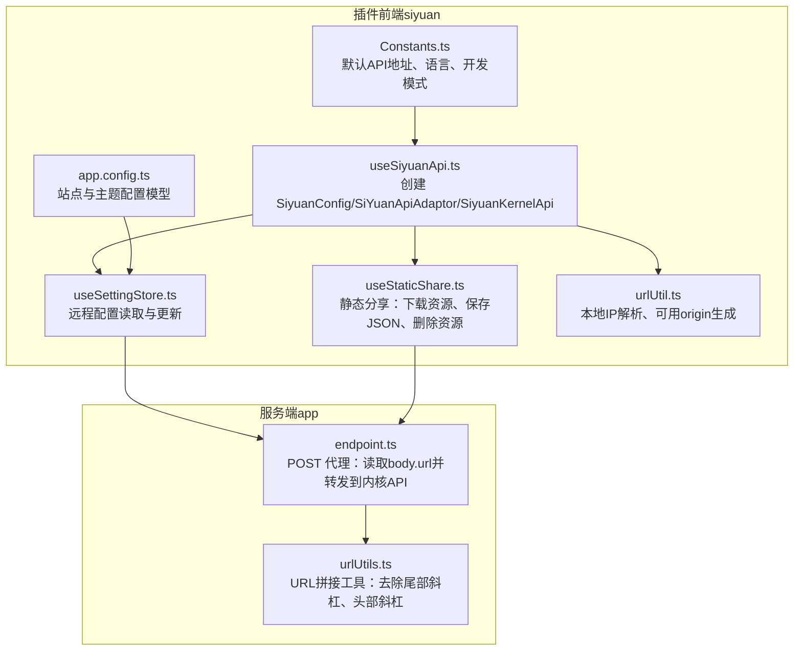
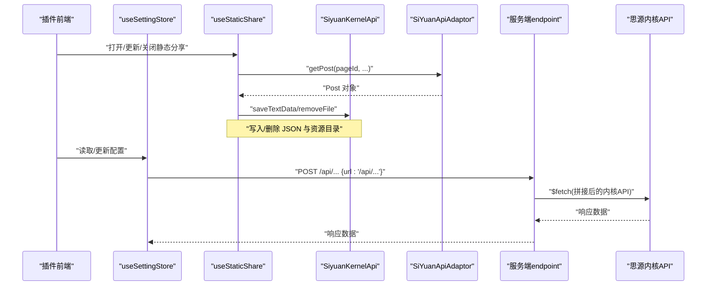
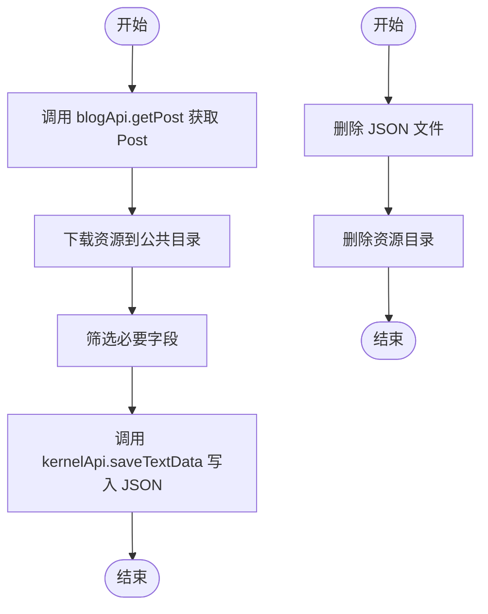
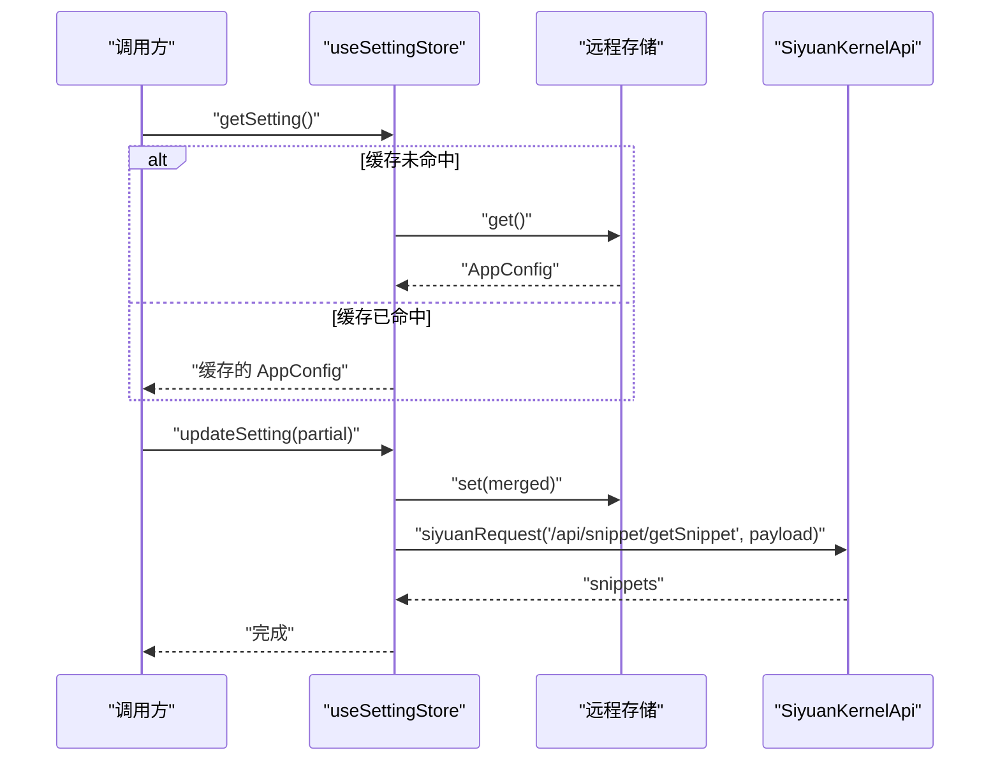
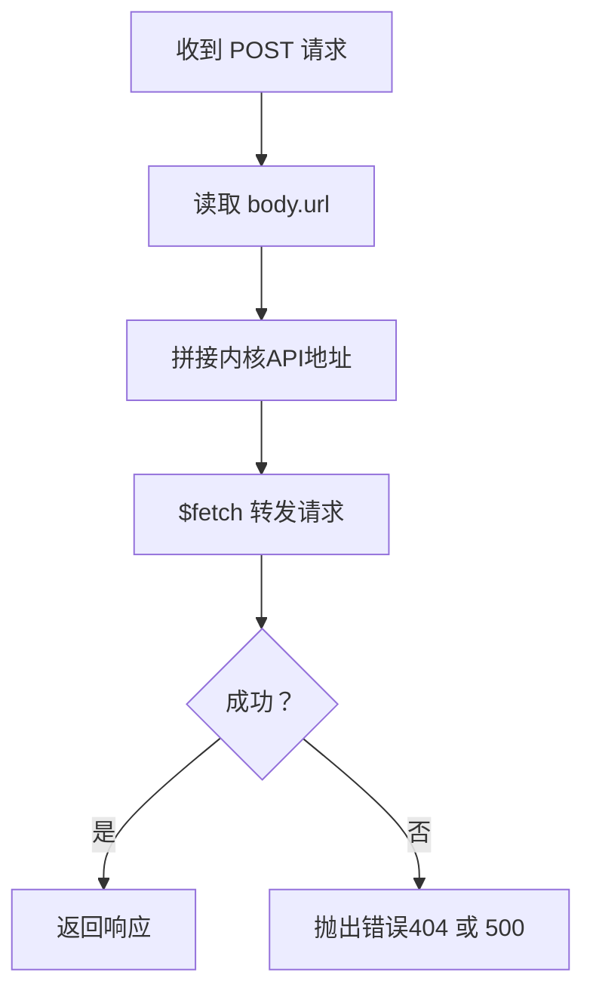
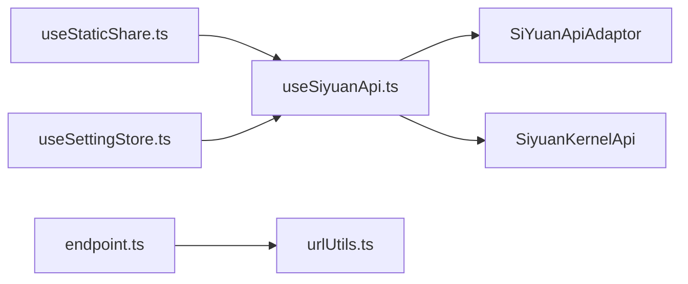

# Siyuan API

<cite>
**本文引用的文件**
- [apps/siyuan/src/composables/useSiyuanApi.ts](file://apps/siyuan/src/composables/useSiyuanApi.ts)
- [apps/siyuan/src/composables/useMethod.ts](file://apps/siyuan/src/composables/useMethod.ts)
- [apps/siyuan/src/composables/useMethodAsync.ts](file://apps/siyuan/src/composables/useMethodAsync.ts)
- [apps/siyuan/src/composables/useStaticShare.ts](file://apps/siyuan/src/composables/useStaticShare.ts)
- [apps/siyuan/src/stores/useSettingStore.ts](file://apps/siyuan/src/stores/useSettingStore.ts)
- [apps/siyuan/src/utils/urlUtil.ts](file://apps/siyuan/src/utils/urlUtil.ts)
- [apps/siyuan/src/app.config.ts](file://apps/siyuan/src/app.config.ts)
- [apps/siyuan/src/Constants.ts](file://apps/siyuan/src/Constants.ts)
- [apps/siyuan/plugin.json](file://apps/siyuan/plugin.json)
- [apps/app/server/api/endpoint.ts](file://apps/app/server/api/endpoint.ts)
- [apps/app/server/utils/urlUtils.ts](file://apps/app/server/utils/urlUtils.ts)
- [apps/siyuan/src/main.ts](file://apps/siyuan/src/main.ts)
- [apps/siyuan/src/bootstrap.ts](file://apps/siyuan/src/bootstrap.ts)
</cite>

## 目录
1. [简介](#简介)
2. [项目结构](#项目结构)
3. [核心组件](#核心组件)
4. [架构总览](#架构总览)
5. [详细组件分析](#详细组件分析)
6. [依赖分析](#依赖分析)
7. [性能考量](#性能考量)
8. [故障排查指南](#故障排查指南)
9. [结论](#结论)
10. [附录](#附录)

## 简介
本文件为“Siyuan API 集成文档”，聚焦于与思源笔记内核通信的接口规范与实现细节。内容涵盖：
- API 方法与参数格式、返回值类型
- 数据获取流程、状态管理与事件处理机制
- 请求响应示例与错误处理策略
- 认证机制、权限控制与安全考虑
- 最佳实践与性能优化建议
- 版本兼容性与升级指南

## 项目结构
该仓库包含两个主要应用：
- siyuan 插件前端：封装与内核交互的 API，负责读取/写入内核数据、管理静态分享等。
- app 服务端：作为代理层转发前端对内核 API 的请求，统一构建目标地址并进行基础错误处理。



图表来源
- [apps/siyuan/src/composables/useSiyuanApi.ts:1-29](file://apps/siyuan/src/composables/useSiyuanApi.ts#L1-L29)
- [apps/siyuan/src/composables/useStaticShare.ts:1-97](file://apps/siyuan/src/composables/useStaticShare.ts#L1-L97)
- [apps/siyuan/src/stores/useSettingStore.ts:1-80](file://apps/siyuan/src/stores/useSettingStore.ts#L1-L80)
- [apps/siyuan/src/utils/urlUtil.ts:1-78](file://apps/siyuan/src/utils/urlUtil.ts#L1-L78)
- [apps/siyuan/src/app.config.ts:1-59](file://apps/siyuan/src/app.config.ts#L1-L59)
- [apps/siyuan/src/Constants.ts:1-16](file://apps/siyuan/src/Constants.ts#L1-L16)
- [apps/app/server/api/endpoint.ts:1-40](file://apps/app/server/api/endpoint.ts#L1-L40)
- [apps/app/server/utils/urlUtils.ts:1-15](file://apps/app/server/utils/urlUtils.ts#L1-L15)

章节来源
- [apps/siyuan/src/composables/useSiyuanApi.ts:1-29](file://apps/siyuan/src/composables/useSiyuanApi.ts#L1-L29)
- [apps/siyuan/src/composables/useStaticShare.ts:1-97](file://apps/siyuan/src/composables/useStaticShare.ts#L1-L97)
- [apps/siyuan/src/stores/useSettingStore.ts:1-80](file://apps/siyuan/src/stores/useSettingStore.ts#L1-L80)
- [apps/siyuan/src/utils/urlUtil.ts:1-78](file://apps/siyuan/src/utils/urlUtil.ts#L1-L78)
- [apps/siyuan/src/app.config.ts:1-59](file://apps/siyuan/src/app.config.ts#L1-L59)
- [apps/siyuan/src/Constants.ts:1-16](file://apps/siyuan/src/Constants.ts#L1-L16)
- [apps/app/server/api/endpoint.ts:1-40](file://apps/app/server/api/endpoint.ts#L1-L40)
- [apps/app/server/utils/urlUtils.ts:1-15](file://apps/app/server/utils/urlUtils.ts#L1-L15)

## 核心组件
- useSiyuanApi：统一创建配置与内核适配器实例，暴露 blogApi 与 kernelApi。
- useStaticShare：围绕静态分享的完整生命周期操作（打开/更新/关闭/清理），内部通过 kernelApi 写入/删除文件，并通过 blogApi 获取文章数据。
- useSettingStore：基于远程存储的配置读取与更新，支持从内核拉取自定义CSS片段。
- urlUtil：在桌面环境下解析可用本地IP，动态替换 origin，确保内核访问可达。
- endpoint（服务端）：接收前端请求，读取 body.url，拼接内核API地址并转发，统一错误处理。
- app.config：定义站点与主题配置的数据模型及默认值。

章节来源
- [apps/siyuan/src/composables/useSiyuanApi.ts:1-29](file://apps/siyuan/src/composables/useSiyuanApi.ts#L1-L29)
- [apps/siyuan/src/composables/useStaticShare.ts:1-97](file://apps/siyuan/src/composables/useStaticShare.ts#L1-L97)
- [apps/siyuan/src/stores/useSettingStore.ts:1-80](file://apps/siyuan/src/stores/useSettingStore.ts#L1-L80)
- [apps/siyuan/src/utils/urlUtil.ts:1-78](file://apps/siyuan/src/utils/urlUtil.ts#L1-L78)
- [apps/app/server/api/endpoint.ts:1-40](file://apps/app/server/api/endpoint.ts#L1-L40)
- [apps/siyuan/src/app.config.ts:1-59](file://apps/siyuan/src/app.config.ts#L1-L59)

## 架构总览
下图展示从前端到内核的典型调用路径，以及服务端代理的作用。



图表来源
- [apps/siyuan/src/composables/useStaticShare.ts:62-74](file://apps/siyuan/src/composables/useStaticShare.ts#L62-L74)
- [apps/siyuan/src/stores/useSettingStore.ts:38-76](file://apps/siyuan/src/stores/useSettingStore.ts#L38-L76)
- [apps/app/server/api/endpoint.ts:12-32](file://apps/app/server/api/endpoint.ts#L12-L32)

## 详细组件分析

### 组件一：useSiyuanApi（API封装）
- 功能概述
  - 创建 SiyuanConfig 并基于当前页面 origin 初始化。
  - 实例化 SiYuanApiAdaptor（blogApi）与 SiyuanKernelApi（kernelApi），统一对外暴露。
- 关键点
  - 使用 window.location.origin 作为基础地址，确保在不同运行环境（桌面/浏览器）下正确解析。
  - 返回对象包含 blogApi 与 kernelApi，便于后续调用。

```mermaid
classDiagram
class useSiyuanApi {
+调用 : useSiyuanApi()
+返回 : { blogApi, kernelApi }
}
class SiyuanConfig {
+构造 : (origin, token)
}
class SiYuanApiAdaptor {
+方法 : getPost(...)
}
class SiyuanKernelApi {
+方法 : saveTextData(...)
+方法 : removeFile(...)
+方法 : siyuanRequest(...)
}
useSiyuanApi --> SiyuanConfig : "创建"
useSiyuanApi --> SiYuanApiAdaptor : "创建"
useSiyuanApi --> SiyuanKernelApi : "创建"
```

图表来源
- [apps/siyuan/src/composables/useSiyuanApi.ts:17-28](file://apps/siyuan/src/composables/useSiyuanApi.ts#L17-L28)

章节来源
- [apps/siyuan/src/composables/useSiyuanApi.ts:1-29](file://apps/siyuan/src/composables/useSiyuanApi.ts#L1-L29)

### 组件二：useStaticShare（静态分享）
- 功能概述
  - 打开/更新静态分享：下载资源到公共目录、仅保留必要字段、写入 JSON 文件。
  - 关闭/清理静态分享：删除 JSON 与对应资源目录；或清空整个公共目录。
- 关键调用
  - 通过 blogApi.getPost 获取文章对象。
  - 通过 kernelApi.saveTextData 写入 JSON；通过 removeFile 删除文件/目录。
- 参数与返回
  - 参数：pageId（字符串）、post（对象）。
  - 返回：Promise<void>，内部完成文件写入/删除。



图表来源
- [apps/siyuan/src/composables/useStaticShare.ts:22-38](file://apps/siyuan/src/composables/useStaticShare.ts#L22-L38)
- [apps/siyuan/src/composables/useStaticShare.ts:40-53](file://apps/siyuan/src/composables/useStaticShare.ts#L40-L53)

章节来源
- [apps/siyuan/src/composables/useStaticShare.ts:1-97](file://apps/siyuan/src/composables/useStaticShare.ts#L1-L97)

### 组件三：useSettingStore（配置读取与更新）
- 功能概述
  - 通过远程存储加载/更新站点配置（如主题、自定义CSS等）。
  - 支持从内核拉取自定义CSS片段并合并到配置中。
- 关键调用
  - 读取：commonStore.get()。
  - 更新：commonStore.set(setting)。
  - 拉取自定义CSS：kernelApi.siyuanRequest("/api/snippet/getSnippet", {type: "css", enabled: 2})。
- 参数与返回
  - getSetting(): Promise<AppConfig>
  - updateSetting(setting: Partial<AppConfig>): Promise<void>



图表来源
- [apps/siyuan/src/stores/useSettingStore.ts:28-76](file://apps/siyuan/src/stores/useSettingStore.ts#L28-L76)

章节来源
- [apps/siyuan/src/stores/useSettingStore.ts:1-80](file://apps/siyuan/src/stores/useSettingStore.ts#L1-L80)

### 组件四：服务端代理 endpoint（POST 代理）
- 功能概述
  - 接收前端 POST 请求，读取 body.url，拼接内核API地址后转发。
  - 统一错误处理：404 映射为 Resource not found；其他错误映射为内部错误。
- 关键逻辑
  - 读取运行时配置 public.siyuanApiUrl。
  - 使用服务端工具函数拼接 URL。
  - 使用 $fetch 发起请求并返回结果。



图表来源
- [apps/app/server/api/endpoint.ts:12-32](file://apps/app/server/api/endpoint.ts#L12-L32)
- [apps/app/server/utils/urlUtils.ts:10-14](file://apps/app/server/utils/urlUtils.ts#L10-L14)

章节来源
- [apps/app/server/api/endpoint.ts:1-40](file://apps/app/server/api/endpoint.ts#L1-L40)
- [apps/app/server/utils/urlUtils.ts:1-15](file://apps/app/server/utils/urlUtils.ts#L1-L15)

### 组件五：urlUtil（本地IP与可用origin）
- 功能概述
  - 在桌面/窗口环境中枚举 IPv4 地址，优先使用非回环地址。
  - 将 origin 中的 127.0.0.1/localhost 替换为可用本地IP，保证内核访问可达。
- 关键逻辑
  - 读取 window 上的本地IP列表与设备类型判断。
  - 过滤唯一可用IP并替换 origin。

章节来源
- [apps/siyuan/src/utils/urlUtil.ts:15-77](file://apps/siyuan/src/utils/urlUtil.ts#L15-L77)

### 组件六：app.config（站点与主题配置模型）
- 功能概述
  - 定义 AppConfig 接口与默认值，包括语言、站点信息、首页ID、主题配置、自定义CSS等。
  - 支持扩展字段以兼容输入约束。

章节来源
- [apps/siyuan/src/app.config.ts:12-58](file://apps/siyuan/src/app.config.ts#L12-L58)

### 组件七：Constants（常量）
- 功能概述
  - 提供默认语言、开发模式标志、构建时间、默认API地址等常量。

章节来源
- [apps/siyuan/src/Constants.ts:10-16](file://apps/siyuan/src/Constants.ts#L10-L16)

### 组件八：入口与引导（main/bootstrap）
- 功能概述
  - 通过 bootstrap.ts 创建并挂载 Vue 应用，main.ts 作为入口文件。

章节来源
- [apps/siyuan/src/main.ts:10-13](file://apps/siyuan/src/main.ts#L10-L13)
- [apps/siyuan/src/bootstrap.ts:12-14](file://apps/siyuan/src/bootstrap.ts#L12-L14)

## 依赖分析
- 外部依赖
  - zhi-siyuan-api：提供 SiyuanConfig、SiYuanApiAdaptor、SiyuanKernelApi。
  - zhi-device：设备检测与本地IP解析。
  - nuxt：服务端代理与运行时配置。
- 内部耦合
  - useStaticShare 依赖 useSiyuanApi 与 useStaticAssets（未在本节展开）。
  - useSettingStore 依赖 useSiyuanApi 与远程存储。
  - 服务端 endpoint 依赖运行时配置 public.siyuanApiUrl 与 URL 工具。



图表来源
- [apps/siyuan/src/composables/useSiyuanApi.ts:10-22](file://apps/siyuan/src/composables/useSiyuanApi.ts#L10-L22)
- [apps/siyuan/src/composables/useStaticShare.ts:11-19](file://apps/siyuan/src/composables/useStaticShare.ts#L11-L19)
- [apps/siyuan/src/stores/useSettingStore.ts:11-24](file://apps/siyuan/src/stores/useSettingStore.ts#L11-L24)
- [apps/app/server/api/endpoint.ts:10](file://apps/app/server/api/endpoint.ts#L10)

章节来源
- [apps/siyuan/src/composables/useSiyuanApi.ts:10-22](file://apps/siyuan/src/composables/useSiyuanApi.ts#L10-L22)
- [apps/siyuan/src/composables/useStaticShare.ts:11-19](file://apps/siyuan/src/composables/useStaticShare.ts#L11-L19)
- [apps/siyuan/src/stores/useSettingStore.ts:11-24](file://apps/siyuan/src/stores/useSettingStore.ts#L11-L24)
- [apps/app/server/api/endpoint.ts:10](file://apps/app/server/api/endpoint.ts#L10)

## 性能考量
- 减少不必要的内核请求
  - 使用缓存策略：先从本地/远程存储读取配置，避免重复拉取。
  - 批量操作：静态分享时一次性下载资源并写入 JSON，减少多次往返。
- 网络与代理
  - 服务端代理统一拼接 URL，避免跨域与路径问题，降低前端复杂度。
- 资源管理
  - 仅写入必要字段，减小 JSON 体积；清理时按需删除单个页面或整站数据。

## 故障排查指南
- 常见错误与处理
  - Method not allowed：仅允许 POST，检查前端请求方法。
  - Resource not found：内核API返回404，确认 url 是否正确。
  - Internal error：其他异常，查看服务端日志与网络连通性。
- 日志与提示
  - 统一使用应用日志器输出错误与成功信息，便于定位问题。
  - UI 层通过消息提示反馈操作结果。

章节来源
- [apps/app/server/api/endpoint.ts:12-38](file://apps/app/server/api/endpoint.ts#L12-L38)
- [apps/siyuan/src/composables/useMethod.ts:19-30](file://apps/siyuan/src/composables/useMethod.ts#L19-L30)
- [apps/siyuan/src/composables/useMethodAsync.ts:19-34](file://apps/siyuan/src/composables/useMethodAsync.ts#L19-L34)

## 结论
本文档梳理了与思源内核通信的关键组件与调用路径，明确了静态分享与配置管理的实现方式，并提供了服务端代理、错误处理与最佳实践建议。通过统一的 API 封装与清晰的职责划分，系统在易用性与可维护性方面具备良好基础。

## 附录

### API 方法与参数规范（基于现有实现）
- blogApi.getPost(pageId, includeContent, includeChildren)
  - 用途：获取文章对象。
  - 参数：pageId（字符串）、includeContent（布尔）、includeChildren（布尔）。
  - 返回：Promise<Post>。
  - 调用位置参考：[apps/siyuan/src/composables/useStaticShare.ts:72](file://apps/siyuan/src/composables/useStaticShare.ts#L72)、[apps/siyuan/src/stores/useSettingStore.ts:67](file://apps/siyuan/src/stores/useSettingStore.ts#L67)

- kernelApi.saveTextData(path, data)
  - 用途：向内核写入文本数据（如 JSON）。
  - 参数：path（字符串）、data（字符串）。
  - 返回：Promise<void>。
  - 调用位置参考：[apps/siyuan/src/composables/useStaticShare.ts:36](file://apps/siyuan/src/composables/useStaticShare.ts#L36)

- kernelApi.removeFile(path)
  - 用途：删除文件或目录。
  - 参数：path（字符串）。
  - 返回：Promise<void>。
  - 调用位置参考：[apps/siyuan/src/composables/useStaticShare.ts:45](file://apps/siyuan/src/composables/useStaticShare.ts#L45)、[apps/siyuan/src/composables/useStaticShare.ts:49](file://apps/siyuan/src/composables/useStaticShare.ts#L49)、[apps/siyuan/src/composables/useStaticShare.ts:91](file://apps/siyuan/src/composables/useStaticShare.ts#L91)

- kernelApi.siyuanRequest(url, payload)
  - 用途：向内核发起请求（示例：获取自定义CSS片段）。
  - 参数：url（字符串）、payload（对象）。
  - 返回：Promise<any>。
  - 调用位置参考：[apps/siyuan/src/stores/useSettingStore.ts:67](file://apps/siyuan/src/stores/useSettingStore.ts#L67)

- 服务端代理 endpoint（POST）
  - 请求体：{ url: "/api/..." }
  - 返回：内核API响应。
  - 错误：404/405/500。
  - 调用位置参考：[apps/app/server/api/endpoint.ts:14-32](file://apps/app/server/api/endpoint.ts#L14-L32)

### 数据获取流程与状态管理
- 配置读取
  - 通过 useSettingStore.getSetting 从远程存储加载 AppConfig；若未初始化则触发加载。
  - 更新时通过 commonStore.set 合并并持久化。
- 静态分享
  - 通过 blogApi.getPost 获取文章，过滤必要字段后写入 JSON；资源下载与清理同理。

章节来源
- [apps/siyuan/src/stores/useSettingStore.ts:28-76](file://apps/siyuan/src/stores/useSettingStore.ts#L28-L76)
- [apps/siyuan/src/composables/useStaticShare.ts:22-38](file://apps/siyuan/src/composables/useStaticShare.ts#L22-L38)

### 事件处理机制
- UI 层通过 useMethod/useMethodAsync 包裹操作，捕获异常并显示消息提示。
- 服务端通过 createError 抛出标准化错误，便于前端识别与处理。

章节来源
- [apps/siyuan/src/composables/useMethod.ts:19-30](file://apps/siyuan/src/composables/useMethod.ts#L19-L30)
- [apps/siyuan/src/composables/useMethodAsync.ts:19-34](file://apps/siyuan/src/composables/useMethodAsync.ts#L19-L34)
- [apps/app/server/api/endpoint.ts:21-32](file://apps/app/server/api/endpoint.ts#L21-L32)

### 认证机制、权限控制与安全考虑
- 认证与权限
  - 当前实现未显式注入 token；API 默认基于当前 origin 初始化。
  - 若需跨域或受限访问，应在服务端代理层统一校验与转发。
- 安全建议
  - 限制服务端代理的可访问路径，仅允许必要的内核API。
  - 对外暴露的 URL 拼接应严格校验与白名单化。
  - 在桌面/移动环境中注意 origin 与本地IP的替换逻辑，避免泄露内网地址。

章节来源
- [apps/siyuan/src/composables/useSiyuanApi.ts:20](file://apps/siyuan/src/composables/useSiyuanApi.ts#L20)
- [apps/siyuan/src/utils/urlUtil.ts:68-77](file://apps/siyuan/src/utils/urlUtil.ts#L68-L77)
- [apps/app/server/api/endpoint.ts:17-18](file://apps/app/server/api/endpoint.ts#L17-L18)

### 版本兼容性与升级指南
- 插件元信息
  - 最低应用版本：2.9.0。
  - 支持平台：Windows、Linux、macOS、Docker、Android、iOS。
  - 前端运行环境：desktop、desktop-window、mobile、browser-desktop、browser-mobile。
- 升级建议
  - 升级前检查最低版本要求与平台兼容性。
  - 如需调整内核API路径或行为，请同步更新服务端代理与前端调用。

章节来源
- [apps/siyuan/plugin.json:6](file://apps/siyuan/plugin.json#L6)
- [apps/siyuan/plugin.json:7-21](file://apps/siyuan/plugin.json#L7-L21)