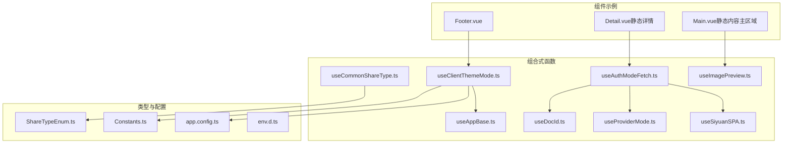
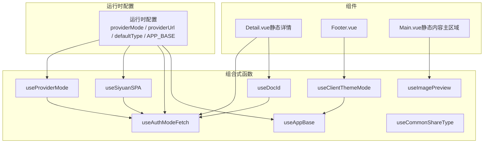
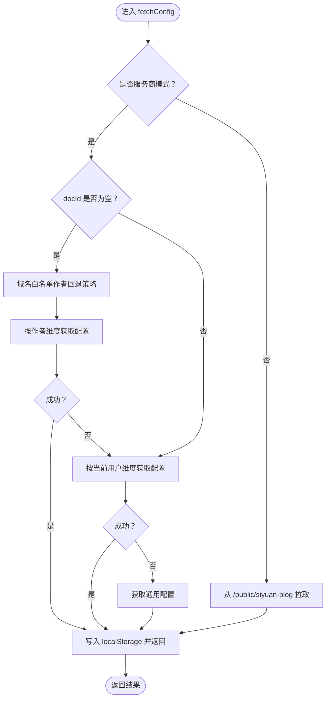
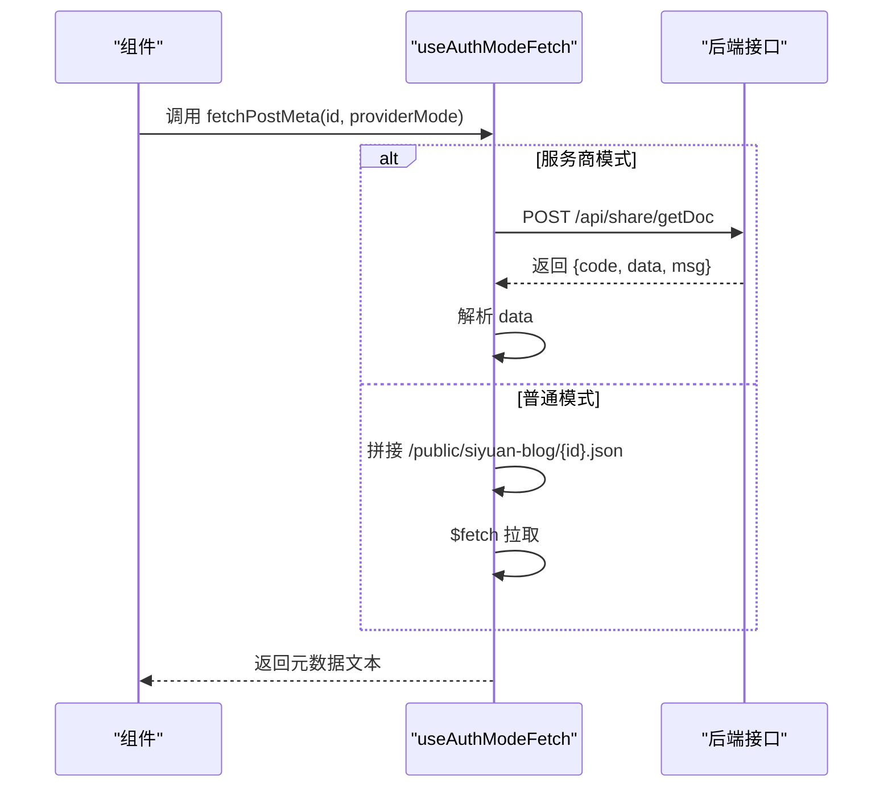
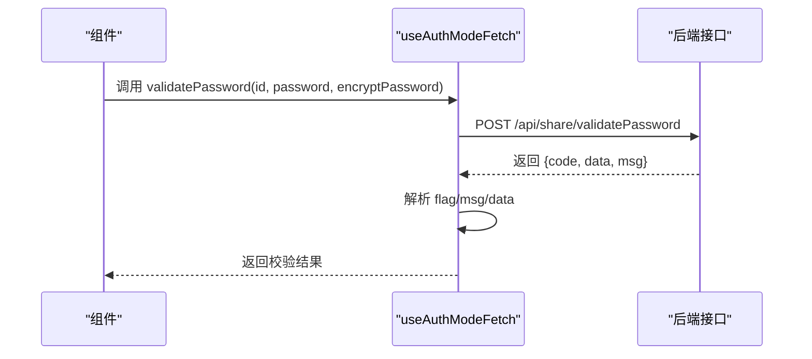
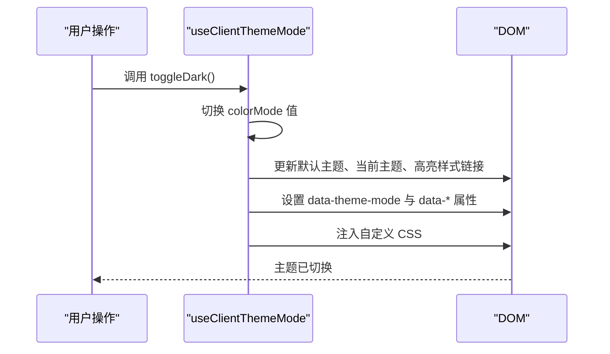
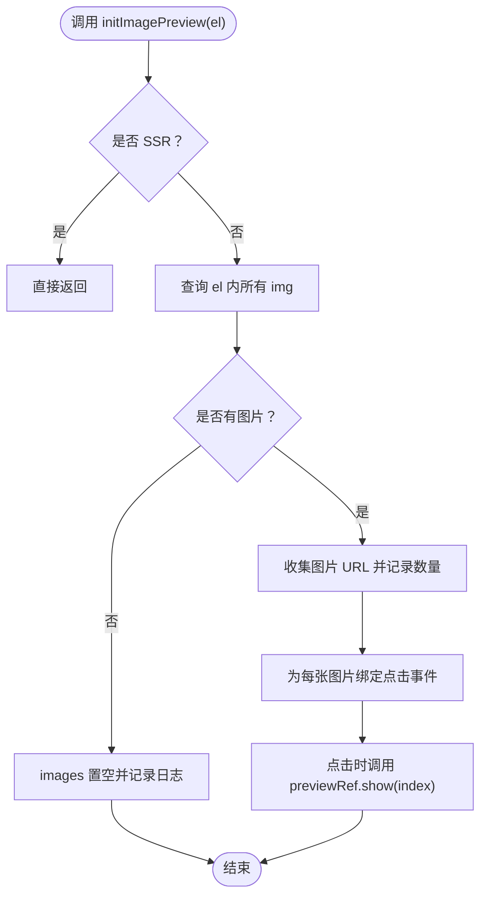
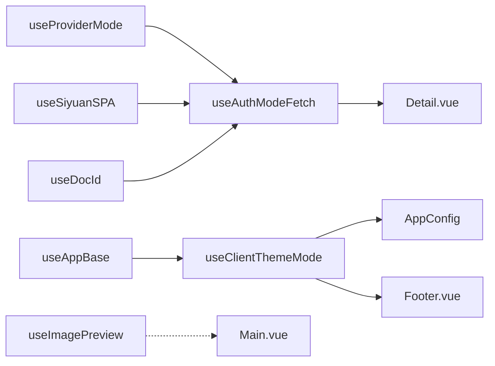

# Vue 组合式函数

<cite>
**本文引用的文件**
- [useAppBase.ts](file://apps/app/composables/useAppBase.ts)
- [useAuthModeFetch.ts](file://apps/app/composables/useAuthModeFetch.ts)
- [useClientThemeMode.ts](file://apps/app/composables/useClientThemeMode.ts)
- [useCommonShareType.ts](file://apps/app/composables/useCommonShareType.ts)
- [useDocId.ts](file://apps/app/composables/useDocId.ts)
- [useImagePreview.ts](file://apps/app/composables/useImagePreview.ts)
- [useProviderMode.ts](file://apps/app/composables/useProviderMode.ts)
- [useSiyuanSPA.ts](file://apps/app/composables/useSiyuanSPA.ts)
- [ShareTypeEnum.ts](file://apps/app/enums/ShareTypeEnum.ts)
- [Constants.ts](file://apps/app/utils/Constants.ts)
- [app.config.ts](file://apps/app/app.config.ts)
- [env.d.ts](file://apps/app/env.d.ts)
- [Detail.vue（静态详情）](file://apps/app/components/static/Detail.vue)
- [Footer.vue](file://apps/app/components/static/Footer.vue)
- [Main.vue（静态内容主区域）](file://apps/app/components/static/content/Main.vue)
</cite>

## 目录
1. [简介](#简介)
2. [项目结构](#项目结构)
3. [核心组件](#核心组件)
4. [架构总览](#架构总览)
5. [详细组件分析](#详细组件分析)
6. [依赖分析](#依赖分析)
7. [性能考虑](#性能考虑)
8. [故障排查指南](#故障排查指南)
9. [结论](#结论)
10. [附录](#附录)

## 简介
本文件系统性梳理了项目中的 Vue 组合式函数（Composables），覆盖可复用逻辑函数的用途、参数与返回值、内部实现原理、依赖关系、生命周期与状态管理、性能优化策略以及与组件的集成方式。目标是帮助开发者快速理解并正确使用这些组合式函数，确保在不同运行环境（如 Nuxt SPA、Nuxt SSR、SiYuan 插件容器）下稳定工作。

## 项目结构
- 组合式函数集中位于 apps/app/composables 下，按职责划分，涵盖应用基础能力、认证/服务商模式数据获取、主题与外观、图片预览、文档 ID 解析等。
- 类型与枚举位于 apps/app/enums 与 apps/app/utils，应用配置位于 apps/app/app.config.ts。
- 组件示例展示了如何在具体页面中调用这些组合式函数。

图表来源
- [useAppBase.ts:16-21](file://apps/app/composables/useAppBase.ts#L16-L21)
- [useAuthModeFetch.ts:15-318](file://apps/app/composables/useAuthModeFetch.ts#L15-L318)
- [useClientThemeMode.ts:23-157](file://apps/app/composables/useClientThemeMode.ts#L23-L157)
- [useCommonShareType.ts:12-53](file://apps/app/composables/useCommonShareType.ts#L12-L53)
- [useDocId.ts:13-28](file://apps/app/composables/useDocId.ts#L13-L28)
- [useImagePreview.ts:66-71](file://apps/app/composables/useImagePreview.ts#L66-L71)
- [useProviderMode.ts:16-22](file://apps/app/composables/useProviderMode.ts#L16-L22)
- [useSiyuanSPA.ts:10-15](file://apps/app/composables/useSiyuanSPA.ts#L10-L15)
- [ShareTypeEnum.ts:13-25](file://apps/app/enums/ShareTypeEnum.ts#L13-L25)
- [Constants.ts:10-17](file://apps/app/utils/Constants.ts#L10-L17)
- [app.config.ts:28-91](file://apps/app/app.config.ts#L28-L91)
- [env.d.ts:10-10](file://apps/app/env.d.ts#L10-L10)
- [Detail.vue（静态详情）:18-21](file://apps/app/components/static/Detail.vue#L18-L21)
- [Footer.vue:24-24](file://apps/app/components/static/Footer.vue#L24-L24)
- [Main.vue（静态内容主区域）:10-18](file://apps/app/components/static/content/Main.vue#L10-L18)

章节来源
- [useAppBase.ts:16-21](file://apps/app/composables/useAppBase.ts#L16-L21)
- [useAuthModeFetch.ts:15-318](file://apps/app/composables/useAuthModeFetch.ts#L15-L318)
- [useClientThemeMode.ts:23-157](file://apps/app/composables/useClientThemeMode.ts#L23-L157)
- [useCommonShareType.ts:12-53](file://apps/app/composables/useCommonShareType.ts#L12-L53)
- [useDocId.ts:13-28](file://apps/app/composables/useDocId.ts#L13-L28)
- [useImagePreview.ts:66-71](file://apps/app/composables/useImagePreview.ts#L66-L71)
- [useProviderMode.ts:16-22](file://apps/app/composables/useProviderMode.ts#L16-L22)
- [useSiyuanSPA.ts:10-15](file://apps/app/composables/useSiyuanSPA.ts#L10-L15)
- [ShareTypeEnum.ts:13-25](file://apps/app/enums/ShareTypeEnum.ts#L13-L25)
- [Constants.ts:10-17](file://apps/app/utils/Constants.ts#L10-L17)
- [app.config.ts:28-91](file://apps/app/app.config.ts#L28-L91)
- [env.d.ts:10-10](file://apps/app/env.d.ts#L10-L10)

## 核心组件
本节对每个组合式函数进行深入解析，包括用途、参数、返回值、内部实现要点、依赖关系、生命周期与状态管理、性能与最佳实践。

- useAppBase
  - 用途：获取应用的基础路径（APP_BASE），用于拼接静态资源 URL。
  - 参数：无。
  - 返回值：对象，包含 appBase 字符串。
  - 内部实现要点：读取运行时配置中的 APP_BASE，记录日志。
  - 依赖关系：运行时配置、日志工具。
  - 生命周期与状态管理：纯计算，无响应式状态。
  - 性能与最佳实践：避免重复读取，可在组件挂载前缓存；仅在客户端使用时注意 SSR 安全。
  
  章节来源
  - [useAppBase.ts:16-21](file://apps/app/composables/useAppBase.ts#L16-L21)

- useDocId
  - 用途：统一从路由参数中提取文档 ID，并去除 HTML 后缀。
  - 参数：无。
  - 返回值：对象，包含 docId 字符串。
  - 内部实现要点：读取路由参数，处理 .html/.htm 后缀。
  - 依赖关系：路由。
  - 生命周期与状态管理：纯计算，无响应式状态。
  - 性能与最佳实践：在组件初始化阶段调用一次即可复用。
  
  章节来源
  - [useDocId.ts:13-28](file://apps/app/composables/useDocId.ts#L13-L28)

- useProviderMode
  - 用途：判断当前是否处于“服务商模式”（由运行时配置决定）。
  - 参数：无。
  - 返回值：对象，包含 providerMode 布尔值。
  - 内部实现要点：读取运行时配置 public.providerMode。
  - 依赖关系：运行时配置。
  - 生命周期与状态管理：纯计算，无响应式状态。
  - 性能与最佳实践：在入口处读取一次，避免重复读取。
  
  章节来源
  - [useProviderMode.ts:16-22](file://apps/app/composables/useProviderMode.ts#L16-L22)

- useSiyuanSPA
  - 用途：判断当前是否为 SiYuan 插件容器模式（defaultType === "siyuan"）。
  - 参数：无。
  - 返回值：对象，包含 isSiyuanSPA 布尔值。
  - 内部实现要点：读取运行时配置 public.defaultType。
  - 依赖关系：运行时配置。
  - 生命周期与状态管理：纯计算，无响应式状态。
  - 性能与最佳实践：在入口处读取一次，避免重复读取。
  
  章节来源
  - [useSiyuanSPA.ts:10-15](file://apps/app/composables/useSiyuanSPA.ts#L10-L15)

- useAuthModeFetch
  - 用途：在“服务商模式”与“普通模式”之间切换，提供远程配置获取、文档元数据获取、密码校验等功能。
  - 参数：
    - fetchConfig(filename, providerMode, requestURL)：文件名、是否服务商模式、请求 URL。
    - fetchPostMeta(id, providerMode)：文档 ID、是否服务商模式。
    - validatePassword(id, password, encryptPassword)：文档 ID、明文密码、加密密码。
  - 返回值：
    - fetchConfig：Promise<string>，返回配置文本。
    - fetchPostMeta：Promise<string>，返回文档元数据文本。
    - validatePassword：Promise<{flag, msg, data}>，返回校验结果。
  - 内部实现要点：
    - 服务商模式：通过 providerUrl 调用后端接口；首页优先根据域名白名单作者回退策略选择作者维度的配置。
    - 普通模式：通过 /public/siyuan-blog 目录拉取本地公开文件。
    - 文档元数据：调用 /api/share/getDoc 接口，支持可选的 key 参数。
    - 密码校验：调用 /api/share/validatePassword 接口。
    - 结果缓存：在非 SSR 环境将结果写入 localStorage，便于后续使用。
  - 依赖关系：运行时配置（providerUrl）、路由查询参数、URL 构建工具、日志工具。
  - 生命周期与状态管理：内部使用 $fetch 或原生 fetch，返回 Promise；结果缓存于客户端。
  - 性能与最佳实践：
    - 首页配置优先尝试域名白名单作者维度，失败再降级到默认用户维度或通用配置。
    - 避免重复请求相同文件名；利用 localStorage 缓存。
    - 在 SiYuan SPA 模式下直接使用 window.origin 构建 URL，减少中间层转发。
  
  章节来源
  - [useAuthModeFetch.ts:15-318](file://apps/app/composables/useAuthModeFetch.ts#L15-L318)

- useClientThemeMode
  - 用途：客户端主题模式控制与样式注入，支持浅色/深色主题切换、默认主题与高亮样式适配。
  - 参数：setting（AppConfig）。
  - 返回值：对象，包含 colorMode（可双向绑定的布尔值，true 表示深色）、toggleDark（切换主题模式的方法）。
  - 内部实现要点：
    - 使用 useColorMode 维护颜色模式状态。
    - 通过 useHead 注入默认主题、当前主题、代码高亮样式以及自定义 CSS。
    - 在浏览器端动态更新样式链接与 data-* 属性。
    - 支持从路由查询参数或配置中覆盖主题名称与版本。
  - 依赖关系：@vueuse/core 的 useColorMode、vue-router 的 useRoute、useHead、useAppBase、Constants。
  - 生命周期与状态管理：在 onBeforeMount 生命周期中初始化；toggleDark 触发后立即更新 DOM。
  - 性能与最佳实践：
    - 主题切换时只更新必要的 link/style 节点，避免全量重绘。
    - 自定义 CSS 以 style 节点形式注入，注意去重与清理。
  
  章节来源
  - [useClientThemeMode.ts:23-157](file://apps/app/composables/useClientThemeMode.ts#L23-L157)

- useCommonShareType
  - 用途：获取当前分享类型（当前版本固定为静态分享类型）。
  - 参数：无。
  - 返回值：对象，包含 isPrivateShare（Promise<boolean>）。
  - 内部实现要点：当前版本直接返回静态分享类型，不再从配置文件拉取。
  - 依赖关系：ShareTypeEnum。
  - 生命周期与状态管理：纯计算，无响应式状态。
  - 性能与最佳实践：直接返回常量，无需网络请求。
  
  章节来源
  - [useCommonShareType.ts:12-53](file://apps/app/composables/useCommonShareType.ts#L12-L53)

- useImagePreview
  - 用途：为页面中的图片启用点击预览功能，支持全局单例实例。
  - 参数：initImagePreview(el: HTMLElement)。
  - 返回值：对象，包含 images（图片 URL 数组）、previewRef（预览组件引用）、initImagePreview（初始化方法）。
  - 内部实现要点：
    - 全局单例：首次调用创建实例，后续复用。
    - 客户端执行：SSR 环境直接返回。
    - 事件绑定：为每个图片元素添加点击事件，触发预览组件显示对应索引。
  - 依赖关系：Vue 的 ref、日志工具。
  - 生命周期与状态管理：在 initImagePreview 中收集图片并绑定事件；images 作为响应式数组保存。
  - 性能与最佳实践：
    - 避免重复初始化；确保在 DOM 更新后再调用 initImagePreview。
    - 预览组件需在模板中声明并赋值给 previewRef。
  
  章节来源
  - [useImagePreview.ts:66-71](file://apps/app/composables/useImagePreview.ts#L66-L71)

## 架构总览
下图展示组合式函数之间的依赖关系与典型调用流程：

图表来源
- [useAuthModeFetch.ts:15-318](file://apps/app/composables/useAuthModeFetch.ts#L15-L318)
- [useProviderMode.ts:16-22](file://apps/app/composables/useProviderMode.ts#L16-L22)
- [useSiyuanSPA.ts:10-15](file://apps/app/composables/useSiyuanSPA.ts#L10-L15)
- [useDocId.ts:13-28](file://apps/app/composables/useDocId.ts#L13-L28)
- [useClientThemeMode.ts:23-157](file://apps/app/composables/useClientThemeMode.ts#L23-L157)
- [useAppBase.ts:16-21](file://apps/app/composables/useAppBase.ts#L16-L21)
- [useCommonShareType.ts:12-53](file://apps/app/composables/useCommonShareType.ts#L12-L53)
- [useImagePreview.ts:66-71](file://apps/app/composables/useImagePreview.ts#L66-L71)
- [Detail.vue（静态详情）:18-21](file://apps/app/components/static/Detail.vue#L18-L21)
- [Footer.vue:24-24](file://apps/app/components/static/Footer.vue#L24-L24)
- [Main.vue（静态内容主区域）:10-18](file://apps/app/components/static/content/Main.vue#L10-L18)

## 详细组件分析

### useAuthModeFetch 详细分析
- 功能概览
  - 提供两种模式：
    - 服务商模式：通过 providerUrl 调用后端接口获取配置与文档元数据，支持域名白名单作者回退策略。
    - 普通模式：从 /public/siyuan-blog 目录拉取公开文件。
  - 支持密码校验，返回 flag/msg/data。
- 关键流程（获取配置）

图表来源
- [useAuthModeFetch.ts:181-215](file://apps/app/composables/useAuthModeFetch.ts#L181-L215)

- 关键流程（文档元数据）

图表来源
- [useAuthModeFetch.ts:300-311](file://apps/app/composables/useAuthModeFetch.ts#L300-L311)

- 关键流程（密码校验）

图表来源
- [useAuthModeFetch.ts:260-298](file://apps/app/composables/useAuthModeFetch.ts#L260-L298)

- 最佳实践
  - 首页优先尝试作者维度配置，失败再降级到默认用户维度或通用配置。
  - 在 SiYuan SPA 模式下直接使用 window.origin 构建 URL，减少中间层转发。
  - 对相同文件名的结果进行 localStorage 缓存，避免重复请求。

章节来源
- [useAuthModeFetch.ts:15-318](file://apps/app/composables/useAuthModeFetch.ts#L15-L318)

### useClientThemeMode 详细分析
- 功能概览
  - 维护颜色模式（浅色/深色），注入默认主题、当前主题、代码高亮样式以及自定义 CSS。
  - 支持从路由查询参数或配置覆盖主题名称与版本。
- 关键流程（主题切换）

图表来源
- [useClientThemeMode.ts:46-141](file://apps/app/composables/useClientThemeMode.ts#L46-L141)

- 最佳实践
  - 在 onBeforeMount 生命周期中初始化，避免首屏闪烁。
  - 仅在浏览器端执行，避免 SSR 报错。
  - 自定义 CSS 以 style 节点注入，注意去重与清理。

章节来源
- [useClientThemeMode.ts:23-157](file://apps/app/composables/useClientThemeMode.ts#L23-L157)

### useImagePreview 详细分析
- 功能概览
  - 为页面中的图片启用点击预览，支持全局单例实例。
- 关键流程（初始化）

图表来源
- [useImagePreview.ts:28-57](file://apps/app/composables/useImagePreview.ts#L28-L57)

- 最佳实践
  - 在 DOM 更新后再调用 initImagePreview，避免查询不到图片。
  - 预览组件需在模板中声明并赋值给 previewRef。
  - 避免重复初始化，使用全局单例。

章节来源
- [useImagePreview.ts:66-71](file://apps/app/composables/useImagePreview.ts#L66-L71)

### 组件集成示例
- Detail.vue（静态详情）
  - 调用 useDocId 获取文档 ID。
  - 调用 useAuthModeFetch 获取文档元数据与进行密码校验。
- Footer.vue
  - 调用 useClientThemeMode 控制主题模式。
- Main.vue（静态内容主区域）
  - 导入并调用 useImagePreview 初始化图片预览。

章节来源
- [Detail.vue（静态详情）:18-21](file://apps/app/components/static/Detail.vue#L18-L21)
- [Footer.vue:24-24](file://apps/app/components/static/Footer.vue#L24-L24)
- [Main.vue（静态内容主区域）:10-18](file://apps/app/components/static/content/Main.vue#L10-L18)

## 依赖分析
- 组合式函数之间的耦合度低，主要通过运行时配置与路由进行解耦。
- useAuthModeFetch 依赖 useProviderMode、useSiyuanSPA、useDocId；useClientThemeMode 依赖 useAppBase 与 AppConfig；useImagePreview 为独立工具类。
- 枚举与常量通过 ShareTypeEnum 与 Constants 提供统一语义与版本号。

图表来源
- [useAuthModeFetch.ts:15-318](file://apps/app/composables/useAuthModeFetch.ts#L15-L318)
- [useProviderMode.ts:16-22](file://apps/app/composables/useProviderMode.ts#L16-L22)
- [useSiyuanSPA.ts:10-15](file://apps/app/composables/useSiyuanSPA.ts#L10-L15)
- [useDocId.ts:13-28](file://apps/app/composables/useDocId.ts#L13-L28)
- [useClientThemeMode.ts:23-157](file://apps/app/composables/useClientThemeMode.ts#L23-L157)
- [useAppBase.ts:16-21](file://apps/app/composables/useAppBase.ts#L16-L21)
- [useImagePreview.ts:66-71](file://apps/app/composables/useImagePreview.ts#L66-L71)
- [Detail.vue（静态详情）:18-21](file://apps/app/components/static/Detail.vue#L18-L21)
- [Footer.vue:24-24](file://apps/app/components/static/Footer.vue#L24-L24)
- [Main.vue（静态内容主区域）:10-18](file://apps/app/components/static/content/Main.vue#L10-L18)

## 性能考虑
- 缓存策略
  - useAuthModeFetch：在非 SSR 环境将配置结果写入 localStorage，避免重复请求。
  - useClientThemeMode：仅在浏览器端更新样式链接，避免 SSR 报错。
- 请求降级
  - useAuthModeFetch：首页优先作者维度，失败再降级到默认用户维度或通用配置。
- DOM 操作最小化
  - useClientThemeMode：仅更新必要的 link/style 节点。
  - useImagePreview：避免重复初始化与事件绑定。
- 资源版本控制
  - useClientThemeMode：通过版本号参数控制主题与高亮样式缓存失效。

## 故障排查指南
- 服务商模式无法获取配置
  - 检查运行时配置 public.providerMode 与 public.providerUrl 是否正确。
  - 首页域名白名单作者回退策略是否生效。
- 普通模式拉取失败
  - 确认 /public/siyuan-blog 下是否存在目标文件。
- 主题切换无效
  - 确认在浏览器端执行，且 DOM 中存在对应 link/style 节点。
- 图片预览不生效
  - 确认 initImagePreview 在 DOM 更新后调用，且预览组件已赋值给 previewRef。
- 密码校验失败
  - 检查后端接口返回的 code 与 msg，确认参数传入正确。

章节来源
- [useAuthModeFetch.ts:181-215](file://apps/app/composables/useAuthModeFetch.ts#L181-L215)
- [useClientThemeMode.ts:103-141](file://apps/app/composables/useClientThemeMode.ts#L103-L141)
- [useImagePreview.ts:28-57](file://apps/app/composables/useImagePreview.ts#L28-L57)

## 结论
本项目通过一组职责清晰的组合式函数实现了跨模式的数据获取、主题控制与交互增强。建议在组件中按需组合使用这些函数，并遵循缓存、降级与最小 DOM 更新等最佳实践，以获得更稳定的用户体验与更好的性能表现。

## 附录
- TypeScript 类型与接口
  - AppConfig：站点与主题相关配置的接口定义，包含语言、站点信息、主题模式与版本、自定义 CSS 等字段。
  - ShareTypeEnum：分享类型枚举，当前版本固定为静态分享类型。
  - Constants：开发环境标识与版本号常量。
  - env.d.ts：模块声明，用于类型提示与打包兼容。

章节来源
- [app.config.ts:28-91](file://apps/app/app.config.ts#L28-L91)
- [ShareTypeEnum.ts:13-25](file://apps/app/enums/ShareTypeEnum.ts#L13-L25)
- [Constants.ts:10-17](file://apps/app/utils/Constants.ts#L10-L17)
- [env.d.ts:10-10](file://apps/app/env.d.ts#L10-L10)