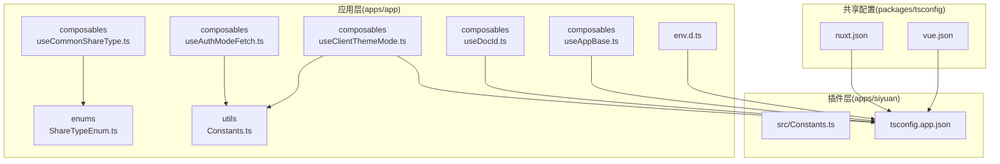
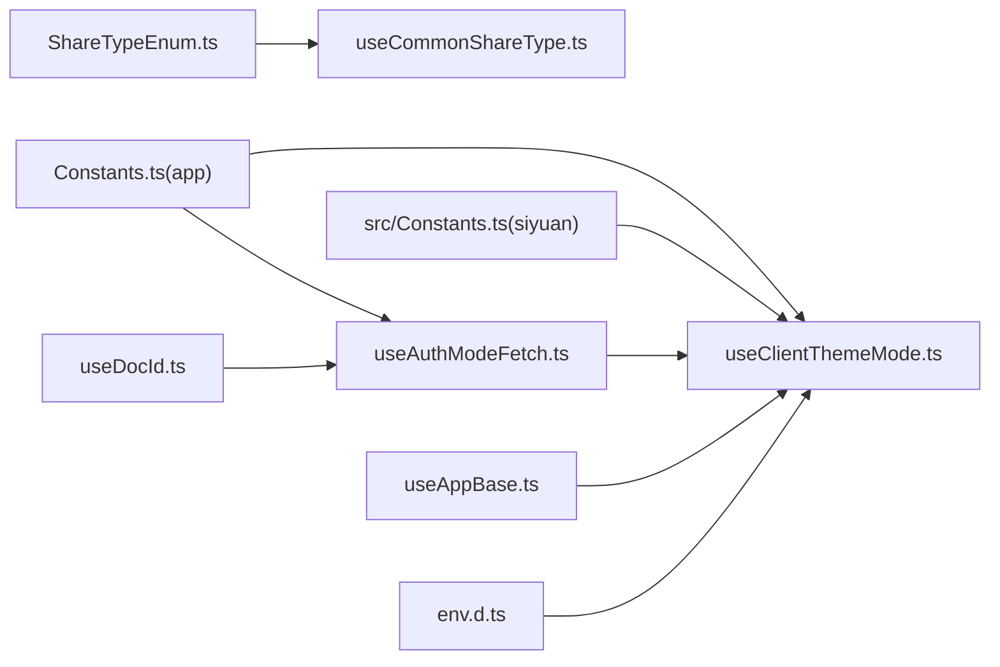
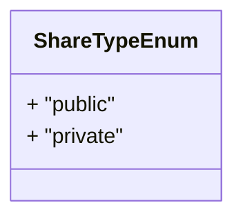
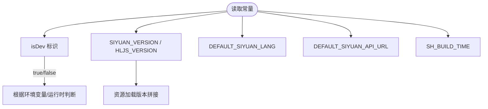
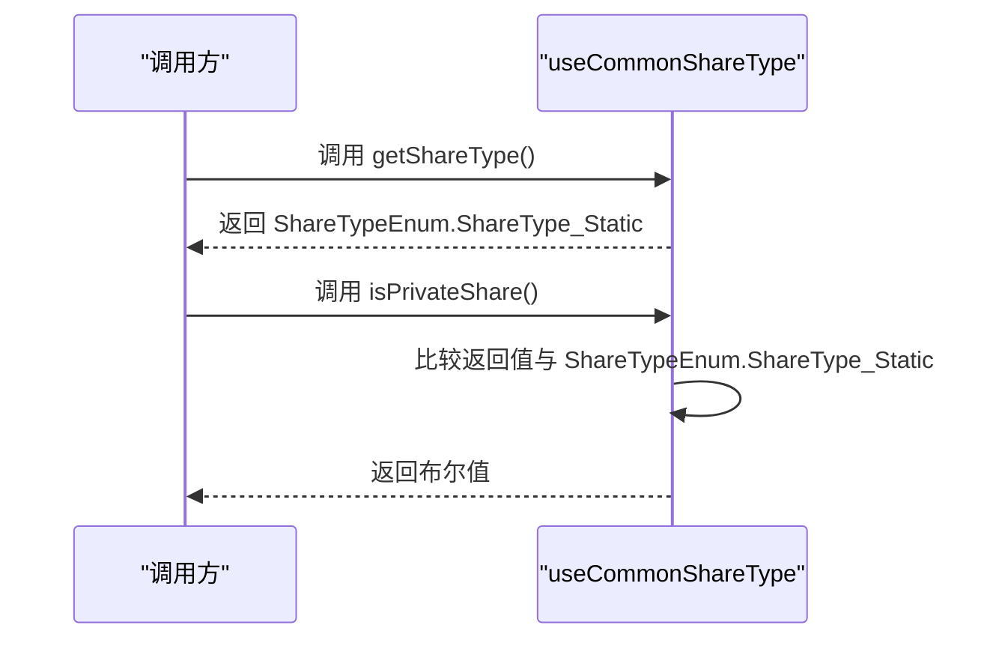
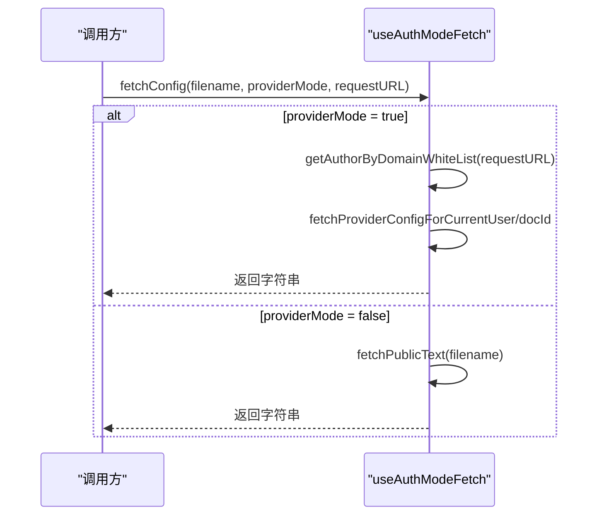
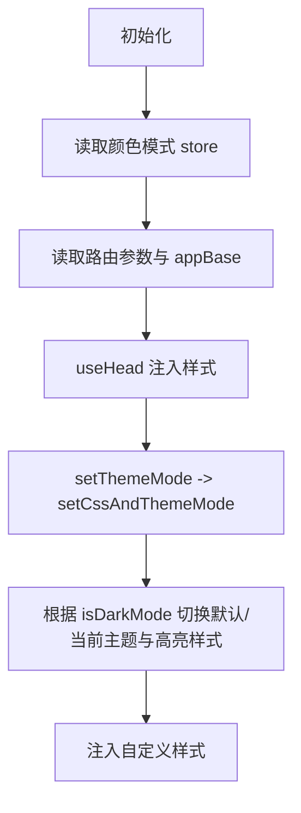
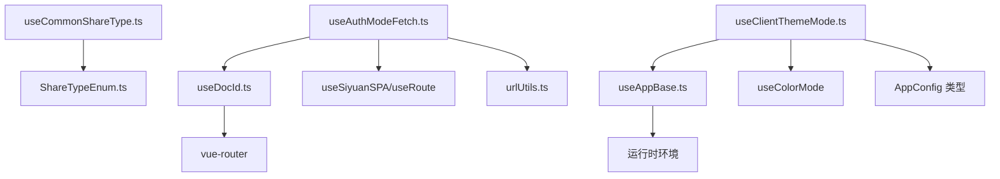

# 类型定义

<cite>
**本文引用的文件**   
- [apps/app/enums/ShareTypeEnum.ts](file://apps/app/enums/ShareTypeEnum.ts)
- [apps/app/utils/Constants.ts](file://apps/app/utils/Constants.ts)
- [apps/siyuan/src/Constants.ts](file://apps/siyuan/src/Constants.ts)
- [apps/app/composables/useCommonShareType.ts](file://apps/app/composables/useCommonShareType.ts)
- [apps/app/composables/useAuthModeFetch.ts](file://apps/app/composables/useAuthModeFetch.ts)
- [apps/app/composables/useClientThemeMode.ts](file://apps/app/composables/useClientThemeMode.ts)
- [apps/app/composables/useDocId.ts](file://apps/app/composables/useDocId.ts)
- [apps/app/composables/useAppBase.ts](file://apps/app/composables/useAppBase.ts)
- [apps/app/env.d.ts](file://apps/app/env.d.ts)
- [apps/siyuan/tsconfig.app.json](file://apps/siyuan/tsconfig.app.json)
- [packages/tsconfig/nuxt.json](file://packages/tsconfig/nuxt.json)
- [packages/tsconfig/vue.json](file://packages/tsconfig/vue.json)
</cite>

## 目录
1. [引言](#引言)
2. [项目结构](#项目结构)
3. [核心组件与类型总览](#核心组件与类型总览)
4. [架构概览](#架构概览)
5. [详细组件分析](#详细组件分析)
6. [依赖分析](#依赖分析)
7. [性能考虑](#性能考虑)
8. [故障排查指南](#故障排查指南)
9. [结论](#结论)
10. [附录](#附录)

## 引言
本文件为该项目的 TypeScript 类型定义参考文档，聚焦于应用层与插件层中使用的接口、类型、枚举、常量与配置项的类型规范。内容涵盖：
- 枚举与常量的用途、取值范围与约束
- 组合式函数返回值与参数的类型语义
- 泛型与类型推断的使用场景与最佳实践
- 类型安全性检查与验证规则
- 类型扩展与自定义的指导原则

## 项目结构
本项目采用多包/多应用结构，前端应用位于 apps/app，插件应用位于 apps/siyuan。类型定义主要分布在以下位置：
- 枚举：apps/app/enums
- 常量：apps/app/utils 与 apps/siyuan/src
- 组合式函数（含返回值类型）：apps/app/composables
- 环境声明：apps/app/env.d.ts
- TypeScript 配置：apps/siyuan/tsconfig.app.json；共享配置在 packages/tsconfig

图表来源
- [apps/app/composables/useCommonShareType.ts:10-53](file://apps/app/composables/useCommonShareType.ts#L10-L53)
- [apps/app/composables/useAuthModeFetch.ts:15-318](file://apps/app/composables/useAuthModeFetch.ts#L15-L318)
- [apps/app/composables/useClientThemeMode.ts:23-157](file://apps/app/composables/useClientThemeMode.ts#L23-L157)
- [apps/app/composables/useDocId.ts:13-28](file://apps/app/composables/useDocId.ts#L13-L28)
- [apps/app/composables/useAppBase.ts:16-21](file://apps/app/composables/useAppBase.ts#L16-L21)
- [apps/app/enums/ShareTypeEnum.ts:13-25](file://apps/app/enums/ShareTypeEnum.ts#L13-L25)
- [apps/app/utils/Constants.ts:10-16](file://apps/app/utils/Constants.ts#L10-L16)
- [apps/siyuan/src/Constants.ts:10-15](file://apps/siyuan/src/Constants.ts#L10-L15)
- [apps/app/env.d.ts:10-10](file://apps/app/env.d.ts#L10-L10)
- [apps/siyuan/tsconfig.app.json:1-34](file://apps/siyuan/tsconfig.app.json#L1-L34)
- [packages/tsconfig/nuxt.json:1-4](file://packages/tsconfig/nuxt.json#L1-L4)
- [packages/tsconfig/vue.json:1-4](file://packages/tsconfig/vue.json#L1-L4)

章节来源
- [apps/app/enums/ShareTypeEnum.ts:13-25](file://apps/app/enums/ShareTypeEnum.ts#L13-L25)
- [apps/app/utils/Constants.ts:10-16](file://apps/app/utils/Constants.ts#L10-L16)
- [apps/siyuan/src/Constants.ts:10-15](file://apps/siyuan/src/Constants.ts#L10-L15)
- [apps/app/composables/useCommonShareType.ts:10-53](file://apps/app/composables/useCommonShareType.ts#L10-L53)
- [apps/app/composables/useAuthModeFetch.ts:15-318](file://apps/app/composables/useAuthModeFetch.ts#L15-L318)
- [apps/app/composables/useClientThemeMode.ts:23-157](file://apps/app/composables/useClientThemeMode.ts#L23-L157)
- [apps/app/composables/useDocId.ts:13-28](file://apps/app/composables/useDocId.ts#L13-L28)
- [apps/app/composables/useAppBase.ts:16-21](file://apps/app/composables/useAppBase.ts#L16-L21)
- [apps/app/env.d.ts:10-10](file://apps/app/env.d.ts#L10-L10)
- [apps/siyuan/tsconfig.app.json:1-34](file://apps/siyuan/tsconfig.app.json#L1-L34)
- [packages/tsconfig/nuxt.json:1-4](file://packages/tsconfig/nuxt.json#L1-L4)
- [packages/tsconfig/vue.json:1-4](file://packages/tsconfig/vue.json#L1-L4)

## 核心组件与类型总览
本节对项目中涉及的类型进行分类汇总，便于快速查阅。

- 枚举
  - ShareTypeEnum：分享类型枚举，包含公开与静态两种取值，其中“公开”已标记为弃用。
- 常量
  - 开发环境标识、版本号等常量，用于运行时判断与资源加载。
- 组合式函数返回值与参数
  - useCommonShareType：返回布尔值（私有分享判断），内部依赖枚举。
  - useAuthModeFetch：返回配置获取、文档元数据获取、密码校验等方法，参数与返回值均为字符串或对象结构。
  - useClientThemeMode：返回颜色模式状态与切换方法，依赖配置与运行时环境。
  - useDocId：返回文档 ID 字符串，包含后缀清理逻辑。
  - useAppBase：返回应用基础路径字符串。
- 环境声明
  - 模块声明用于第三方库的类型提示。
- TypeScript 配置
  - 应用层 tsconfig 控制编译目标、模块解析、严格性等；共享配置由 packages/tsconfig 提供扩展。

章节来源
- [apps/app/enums/ShareTypeEnum.ts:13-25](file://apps/app/enums/ShareTypeEnum.ts#L13-L25)
- [apps/app/utils/Constants.ts:10-16](file://apps/app/utils/Constants.ts#L10-L16)
- [apps/siyuan/src/Constants.ts:10-15](file://apps/siyuan/src/Constants.ts#L10-L15)
- [apps/app/composables/useCommonShareType.ts:10-53](file://apps/app/composables/useCommonShareType.ts#L10-L53)
- [apps/app/composables/useAuthModeFetch.ts:15-318](file://apps/app/composables/useAuthModeFetch.ts#L15-L318)
- [apps/app/composables/useClientThemeMode.ts:23-157](file://apps/app/composables/useClientThemeMode.ts#L23-L157)
- [apps/app/composables/useDocId.ts:13-28](file://apps/app/composables/useDocId.ts#L13-L28)
- [apps/app/composables/useAppBase.ts:16-21](file://apps/app/composables/useAppBase.ts#L16-L21)
- [apps/app/env.d.ts:10-10](file://apps/app/env.d.ts#L10-L10)
- [apps/siyuan/tsconfig.app.json:1-34](file://apps/siyuan/tsconfig.app.json#L1-L34)

## 架构概览
下图展示类型与组合式函数之间的关系，以及它们如何被其他模块消费。

图表来源
- [apps/app/enums/ShareTypeEnum.ts:13-25](file://apps/app/enums/ShareTypeEnum.ts#L13-L25)
- [apps/app/composables/useCommonShareType.ts:10-53](file://apps/app/composables/useCommonShareType.ts#L10-L53)
- [apps/app/utils/Constants.ts:10-16](file://apps/app/utils/Constants.ts#L10-L16)
- [apps/siyuan/src/Constants.ts:10-15](file://apps/siyuan/src/Constants.ts#L10-L15)
- [apps/app/composables/useAuthModeFetch.ts:15-318](file://apps/app/composables/useAuthModeFetch.ts#L15-L318)
- [apps/app/composables/useClientThemeMode.ts:23-157](file://apps/app/composables/useClientThemeMode.ts#L23-L157)
- [apps/app/composables/useDocId.ts:13-28](file://apps/app/composables/useDocId.ts#L13-L28)
- [apps/app/composables/useAppBase.ts:16-21](file://apps/app/composables/useAppBase.ts#L16-L21)
- [apps/app/env.d.ts:10-10](file://apps/app/env.d.ts#L10-L10)

## 详细组件分析

### 枚举：ShareTypeEnum
- 定义：分享类型枚举，包含公开与静态两种取值。
- 约束与语义：
  - 公开分享已标记为弃用，仅保留静态分享。
  - 返回值类型为字符串字面量，建议在分支判断中使用严格相等比较。
- 使用示例路径：
  - [获取分享类型:22-45](file://apps/app/composables/useCommonShareType.ts#L22-L45)
  - [私有分享判断:47-50](file://apps/app/composables/useCommonShareType.ts#L47-L50)

图表来源
- [apps/app/enums/ShareTypeEnum.ts:13-25](file://apps/app/enums/ShareTypeEnum.ts#L13-L25)

章节来源
- [apps/app/enums/ShareTypeEnum.ts:13-25](file://apps/app/enums/ShareTypeEnum.ts#L13-L25)
- [apps/app/composables/useCommonShareType.ts:10-53](file://apps/app/composables/useCommonShareType.ts#L10-L53)

### 常量：开发与版本常量
- apps/app/utils/Constants.ts
  - isDev：开发环境标识，用于控制构建与运行时行为。
  - SIYUAN_VERSION：思源版本号，用于资源缓存与兼容性判断。
  - HLJS_VERSION：高亮库版本号，用于样式资源版本控制。
- apps/siyuan/src/Constants.ts
  - DEFAULT_SIYUAN_LANG：默认语言，从窗口对象读取。
  - isDev：开发模式标志，支持环境变量注入。
  - SH_BUILD_TIME：构建时间戳，用于缓存与调试。
  - DEFAULT_SIYUAN_API_URL：默认 API 基础地址。

图表来源
- [apps/app/utils/Constants.ts:10-16](file://apps/app/utils/Constants.ts#L10-L16)
- [apps/siyuan/src/Constants.ts:10-15](file://apps/siyuan/src/Constants.ts#L10-L15)

章节来源
- [apps/app/utils/Constants.ts:10-16](file://apps/app/utils/Constants.ts#L10-L16)
- [apps/siyuan/src/Constants.ts:10-15](file://apps/siyuan/src/Constants.ts#L10-L15)

### 组合式函数：useCommonShareType
- 功能：统一获取分享类型并判断是否为私有分享。
- 返回值类型：布尔值（私有分享判断）。
- 关键点：
  - 内部直接返回静态分享类型，体现当前版本不再支持公开分享。
  - 建议在调用处以严格相等进行比较，避免类型不一致导致的错误。

图表来源
- [apps/app/composables/useCommonShareType.ts:22-50](file://apps/app/composables/useCommonShareType.ts#L22-L50)
- [apps/app/enums/ShareTypeEnum.ts:13-25](file://apps/app/enums/ShareTypeEnum.ts#L13-L25)

章节来源
- [apps/app/composables/useCommonShareType.ts:10-53](file://apps/app/composables/useCommonShareType.ts#L10-L53)
- [apps/app/enums/ShareTypeEnum.ts:13-25](file://apps/app/enums/ShareTypeEnum.ts#L13-L25)

### 组合式函数：useAuthModeFetch
- 功能：在认证模式与普通模式之间切换，提供配置获取、文档元数据获取与密码校验能力。
- 参数与返回值类型：
  - fetchPublicText(filename: string): Promise<string>
  - fetchProviderConfigByResource(filename: string): Promise<string>
  - fetchProviderConfigByAuthorForCurrentUser(author: string, filename: string): Promise<string>
  - fetchProviderConfigForCurrentUser(docId: string, filename: string): Promise<string>
  - fetchProviderConfig(filename: string): Promise<string>
  - fetchConfig(filename: string, providerMode: boolean, requestURL: URL): Promise<string>
  - fetchProviderPostMeta(id: string): Promise<string>
  - validatePassword(id: string, password: string, encryptPassword: string): Promise<{ flag: boolean; msg: string; data: string }>
  - fetchPostMeta(id: string, providerMode: boolean): Promise<string>
- 约束与规则：
  - providerMode 为 true 时走远程配置获取流程，否则走本地 public 资源获取。
  - 所有网络请求均需处理响应状态与异常，确保返回文本可被后续解析。
  - 密码校验返回结构包含 flag、msg、data 字段，调用方应按结构读取。

图表来源
- [apps/app/composables/useAuthModeFetch.ts:181-215](file://apps/app/composables/useAuthModeFetch.ts#L181-L215)

章节来源
- [apps/app/composables/useAuthModeFetch.ts:15-318](file://apps/app/composables/useAuthModeFetch.ts#L15-L318)

### 组合式函数：useClientThemeMode
- 功能：根据颜色模式与路由参数动态设置主题样式与高亮样式。
- 参数与返回值类型：
  - 参数：setting: typeof AppConfig（来自 app.config.ts 的类型）
  - 返回：{ colorMode: boolean; toggleDark(): void }
- 约束与规则：
  - 颜色模式通过 computed 包装，set 时写入存储。
  - 主题样式与高亮样式通过 useHead 注入 link/style，需确保 appBase 正确。
  - 自定义样式通过 setting.customCss 注入，注意样式名称唯一性。

图表来源
- [apps/app/composables/useClientThemeMode.ts:23-157](file://apps/app/composables/useClientThemeMode.ts#L23-L157)

章节来源
- [apps/app/composables/useClientThemeMode.ts:23-157](file://apps/app/composables/useClientThemeMode.ts#L23-L157)

### 组合式函数：useDocId
- 功能：统一从路由参数中提取文档 ID，并去除常见 HTML 后缀。
- 返回值类型：{ docId: string }
- 约束与规则：
  - 支持 .html 与 .htm 后缀清理，若无后缀则原样返回。
  - 建议在上游调用处对空字符串进行兜底处理。

章节来源
- [apps/app/composables/useDocId.ts:13-28](file://apps/app/composables/useDocId.ts#L13-L28)

### 组合式函数：useAppBase
- 功能：读取运行时环境中的 APP_BASE 并返回。
- 返回值类型：{ appBase: string }
- 约束与规则：
  - 该值用于拼接静态资源 URL，需保证末尾不带多余斜杠。

章节来源
- [apps/app/composables/useAppBase.ts:16-21](file://apps/app/composables/useAppBase.ts#L16-L21)

### 环境声明：env.d.ts
- 功能：为第三方模块提供类型声明，确保打包与类型检查通过。
- 示例：模块声明用于高亮库相关模块。

章节来源
- [apps/app/env.d.ts:10-10](file://apps/app/env.d.ts#L10-L10)

### TypeScript 配置：tsconfig
- apps/siyuan/tsconfig.app.json
  - 编译目标、模块解析策略、严格性开关、类型声明等。
- packages/tsconfig
  - Nuxt 与 Vue 的共享 tsconfig 扩展，确保多项目一致性。

章节来源
- [apps/siyuan/tsconfig.app.json:1-34](file://apps/siyuan/tsconfig.app.json#L1-L34)
- [packages/tsconfig/nuxt.json:1-4](file://packages/tsconfig/nuxt.json#L1-L4)
- [packages/tsconfig/vue.json:1-4](file://packages/tsconfig/vue.json#L1-L4)

## 依赖分析
- 组件耦合关系
  - useCommonShareType 依赖 ShareTypeEnum。
  - useAuthModeFetch 依赖 useDocId、useSiyuanSPA、useRoute、urlUtils、runtime config 等。
  - useClientThemeMode 依赖 useAppBase、useRoute、useColorMode、BrowserUtil、AppConfig 类型。
  - useDocId 依赖 vue-router 的 useRoute。
  - useAppBase 依赖运行时环境变量。
- 外部依赖
  - 第三方库通过 env.d.ts 声明类型，确保类型安全。
- 配置依赖
  - tsconfig 控制编译与类型检查行为，影响各组合式函数的类型推断与严格性。

图表来源
- [apps/app/composables/useCommonShareType.ts:10-53](file://apps/app/composables/useCommonShareType.ts#L10-L53)
- [apps/app/enums/ShareTypeEnum.ts:13-25](file://apps/app/enums/ShareTypeEnum.ts#L13-L25)
- [apps/app/composables/useAuthModeFetch.ts:15-318](file://apps/app/composables/useAuthModeFetch.ts#L15-L318)
- [apps/app/composables/useDocId.ts:13-28](file://apps/app/composables/useDocId.ts#L13-L28)
- [apps/app/composables/useClientThemeMode.ts:23-157](file://apps/app/composables/useClientThemeMode.ts#L23-L157)
- [apps/app/composables/useAppBase.ts:16-21](file://apps/app/composables/useAppBase.ts#L16-L21)

章节来源
- [apps/app/composables/useCommonShareType.ts:10-53](file://apps/app/composables/useCommonShareType.ts#L10-L53)
- [apps/app/composables/useAuthModeFetch.ts:15-318](file://apps/app/composables/useAuthModeFetch.ts#L15-L318)
- [apps/app/composables/useClientThemeMode.ts:23-157](file://apps/app/composables/useClientThemeMode.ts#L23-L157)
- [apps/app/composables/useDocId.ts:13-28](file://apps/app/composables/useDocId.ts#L13-L28)
- [apps/app/composables/useAppBase.ts:16-21](file://apps/app/composables/useAppBase.ts#L16-L21)

## 性能考虑
- 资源版本控制
  - 通过版本号常量拼接到资源 URL，避免浏览器缓存导致的样式/脚本不更新问题。
- 网络请求优化
  - 在 providerMode 下优先使用作者白名单匹配，减少不必要的远程请求。
  - 对远程配置与文档元数据请求进行状态校验，失败时回退至默认配置。
- DOM 操作最小化
  - 主题切换通过批量替换 link href 与注入 style，避免频繁重排。

## 故障排查指南
- 分享类型判断异常
  - 确认返回值与枚举严格相等比较，避免类型不一致。
  - 参考路径：[分享类型判断:47-50](file://apps/app/composables/useCommonShareType.ts#L47-L50)
- 配置获取失败
  - 检查 providerMode 与请求 URL 拼接，确认响应状态与返回文本可解析。
  - 参考路径：[配置获取主流程:181-215](file://apps/app/composables/useAuthModeFetch.ts#L181-L215)
- 主题样式未生效
  - 确认 appBase 正确且末尾无多余斜杠；检查 useHead 注入的 link/style 是否存在。
  - 参考路径：[主题样式注入:57-97](file://apps/app/composables/useClientThemeMode.ts#L57-L97)
- 文档 ID 解析异常
  - 确保路由参数正确传入，必要时对空字符串进行兜底。
  - 参考路径：[文档 ID 解析:16-25](file://apps/app/composables/useDocId.ts#L16-L25)

章节来源
- [apps/app/composables/useCommonShareType.ts:47-50](file://apps/app/composables/useCommonShareType.ts#L47-L50)
- [apps/app/composables/useAuthModeFetch.ts:181-215](file://apps/app/composables/useAuthModeFetch.ts#L181-L215)
- [apps/app/composables/useClientThemeMode.ts:57-97](file://apps/app/composables/useClientThemeMode.ts#L57-L97)
- [apps/app/composables/useDocId.ts:16-25](file://apps/app/composables/useDocId.ts#L16-L25)

## 结论
本文件梳理了项目中与类型相关的核心元素：枚举、常量、组合式函数的返回值与参数类型、环境声明与 tsconfig 配置。遵循本文的类型规范与最佳实践，可有效提升代码的可维护性与类型安全性。

## 附录
- 泛型与类型推断
  - 在组合式函数中，尽量使用明确的参数与返回值类型，避免 any 或 unknown 的滥用。
  - 对外部 API 返回结构，建议定义接口或类型别名，配合 JSON 解析工具进行安全解析。
- 类型扩展与自定义
  - 新增配置项时，优先在 app.config.ts 中定义类型，并通过 useClientThemeMode 等组合式函数进行消费。
  - 对第三方库，通过 env.d.ts 提供模块声明，确保类型检查通过。
- 安全性检查与验证规则
  - 对网络请求结果进行状态校验与异常捕获，返回结构使用明确的对象类型。
  - 对用户输入与路由参数进行清洗与校验，避免注入与解析错误。