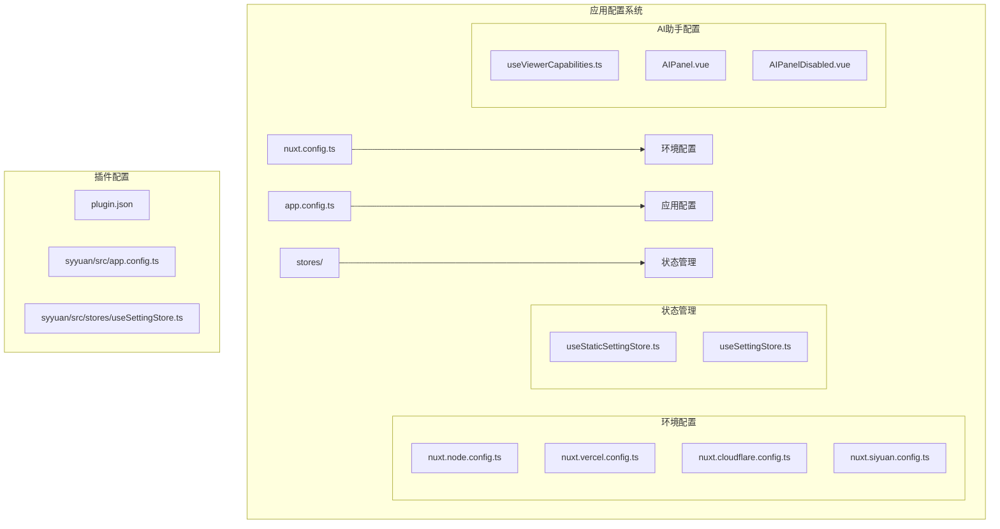
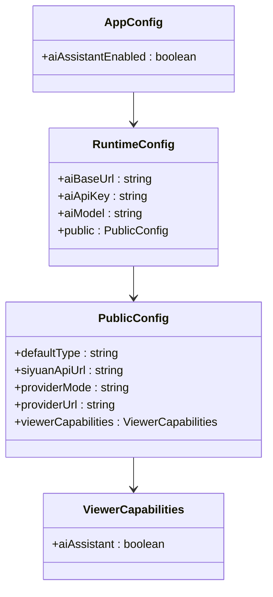
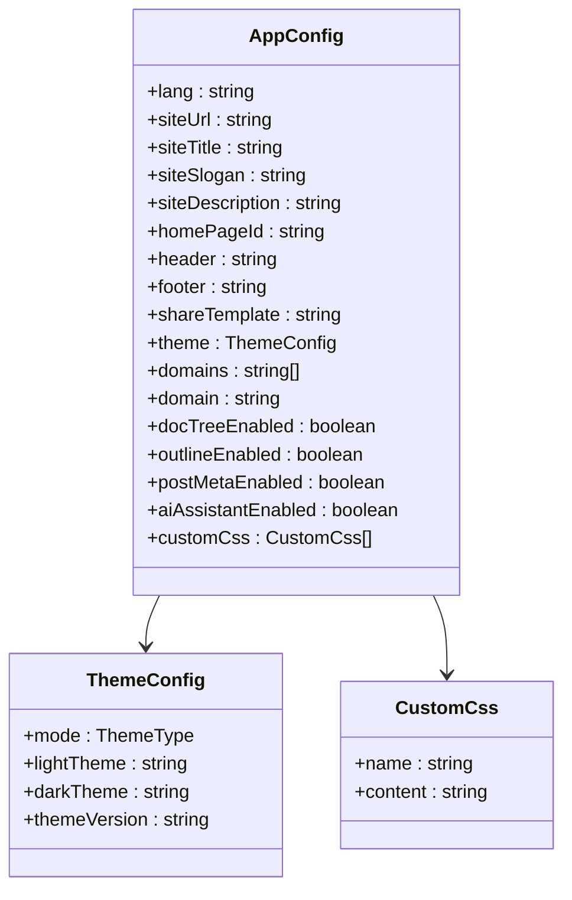
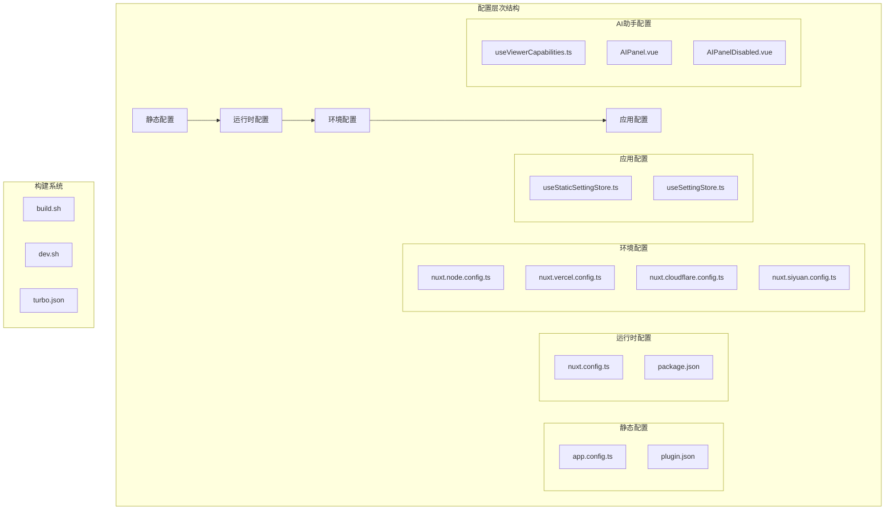
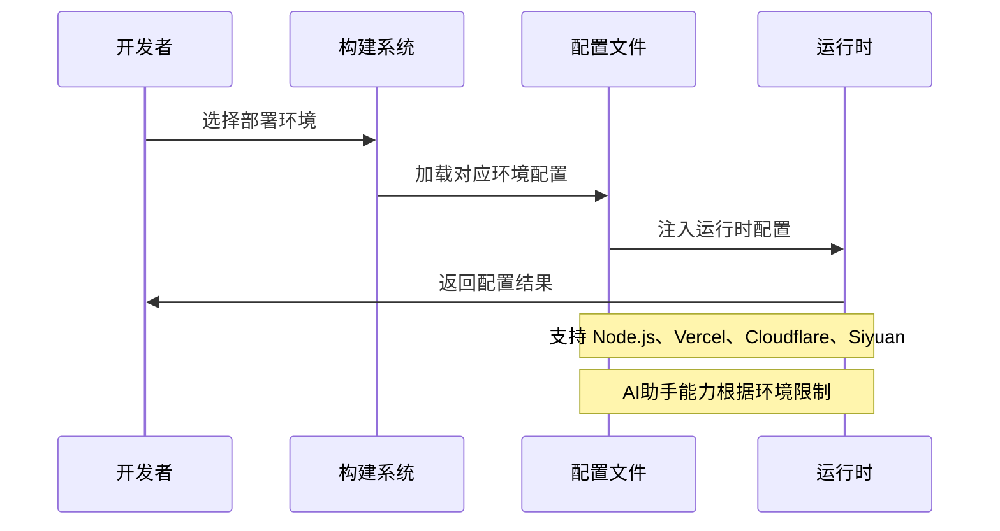
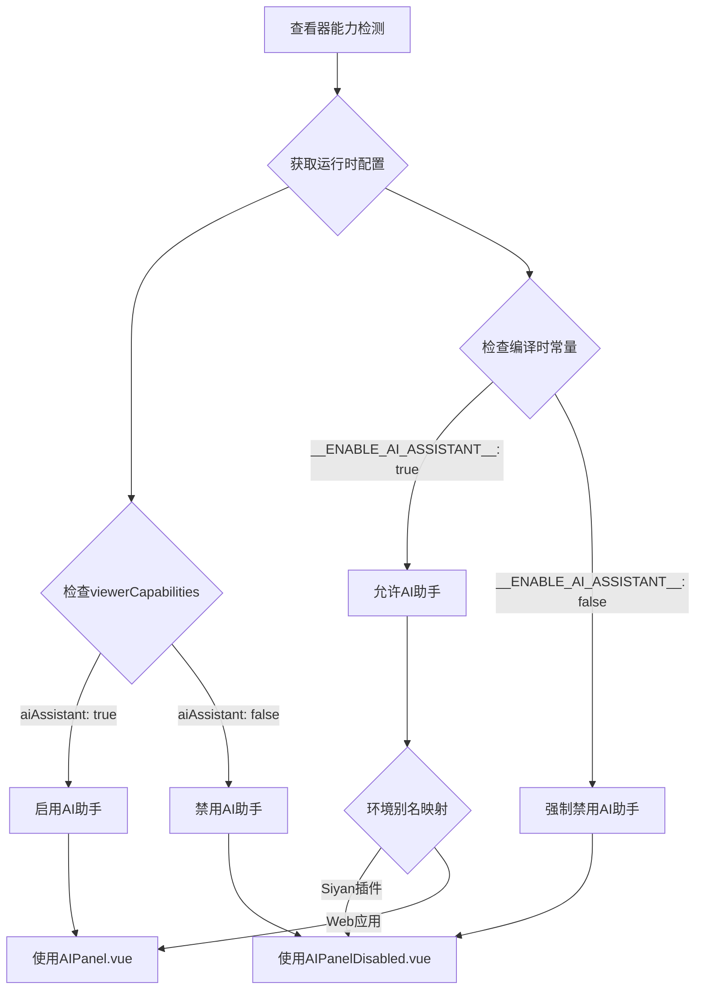
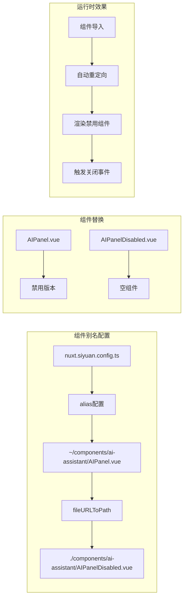
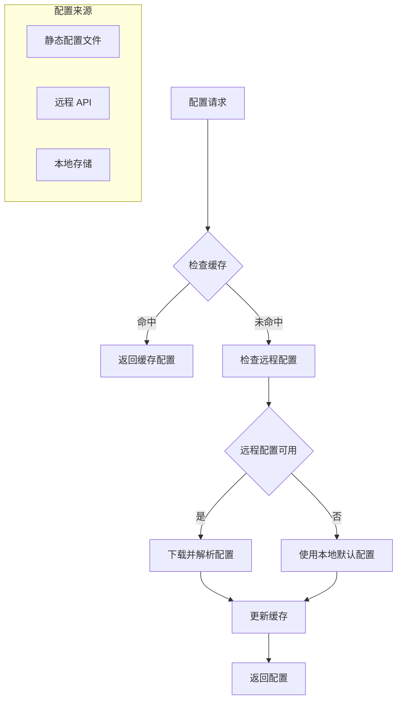
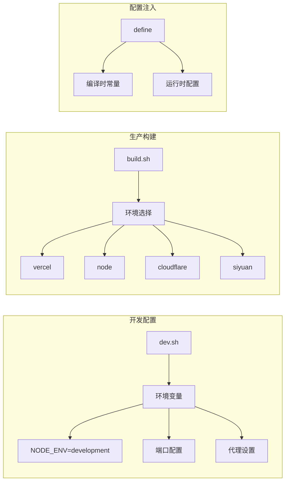
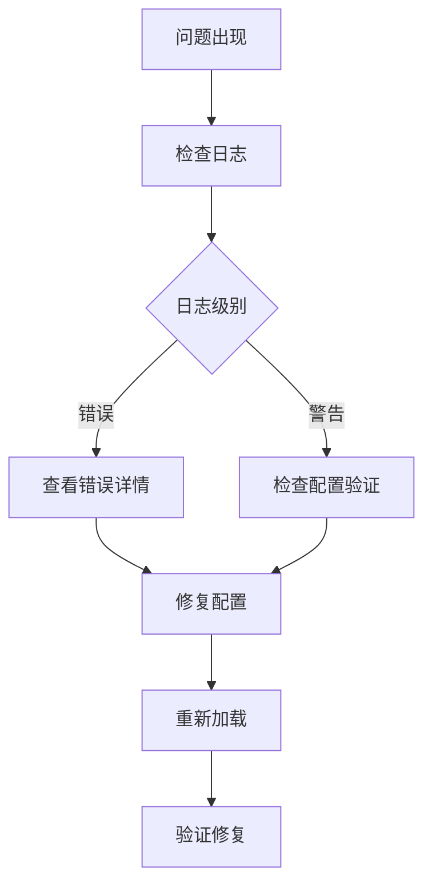

# 应用配置

<cite>
**本文档引用的文件**
- [apps/app/nuxt.config.ts](file://apps/app/nuxt.config.ts)
- [apps/app/app.config.ts](file://apps/app/app.config.ts)
- [apps/app/nuxt.siyuan.config.ts](file://apps/app/nuxt.siyuan.config.ts)
- [apps/app/nuxt.vercel.config.ts](file://apps/app/nuxt.vercel.config.ts)
- [apps/app/nuxt.cloudflare.config.ts](file://apps/app/nuxt.cloudflare.config.ts)
- [apps/app/nuxt.node.config.ts](file://apps/app/nuxt.node.config.ts)
- [apps/siyuan/src/app.config.ts](file://apps/siyuan/src/app.config.ts)
- [apps/app/stores/useStaticSettingStore.ts](file://apps/app/stores/useStaticSettingStore.ts)
- [apps/siyuan/src/stores/useSettingStore.ts](file://apps/siyuan/src/stores/useSettingStore.ts)
- [apps/app/package.json](file://apps/app/package.json)
- [apps/siyuan/package.json](file://apps/siyuan/package.json)
- [package.json](file://package.json)
- [apps/app/script/build.sh](file://apps/app/script/build.sh)
- [apps/app/script/dev.sh](file://apps/app/script/dev.sh)
- [apps/app/utils/Constants.ts](file://apps/app/utils/Constants.ts)
- [apps/siyuan/plugin.json](file://apps/siyuan/plugin.json)
- [apps/app/composables/useViewerCapabilities.ts](file://apps/app/composables/useViewerCapabilities.ts)
- [apps/app/components/ai-assistant/AIPanel.vue](file://apps/app/components/ai-assistant/AIPanel.vue)
- [apps/app/components/ai-assistant/AIPanelDisabled.vue](file://apps/app/components/ai-assistant/AIPanelDisabled.vue)
</cite>

## 更新摘要
**变更内容**
- 新增AI助手全局配置支持，包括`aiAssistantEnabled`字段
- 添加`viewerCapabilities`配置字段，用于控制查看器功能能力
- 实现自动组件别名机制，支持不同环境下的组件替换
- 增加查看器能力限制功能，根据不同部署环境调整功能可用性

## 目录
1. [简介](#简介)
2. [项目结构](#项目结构)
3. [核心配置组件](#核心配置组件)
4. [架构概览](#架构概览)
5. [详细组件分析](#详细组件分析)
6. [依赖关系分析](#依赖关系分析)
7. [性能考虑](#性能考虑)
8. [故障排除指南](#故障排除指南)
9. [结论](#结论)

## 简介

这是一个基于 Nuxt.js 的多平台应用配置系统，支持多种部署环境和运行模式。该系统提供了灵活的配置管理机制，包括静态配置、动态配置、环境特定配置以及运行时配置。最新版本增强了AI助手全局配置支持、查看器能力限制和自动组件别名功能。

## 项目结构

应用采用多包架构，包含 Web 应用和 Siyuan 笔记插件两个主要部分：



**图表来源**
- [apps/app/nuxt.config.ts:1-154](file://apps/app/nuxt.config.ts#L1-L154)
- [apps/app/app.config.ts:1-105](file://apps/app/app.config.ts#L1-L105)
- [apps/app/nuxt.siyuan.config.ts:1-175](file://apps/app/nuxt.siyuan.config.ts#L1-L175)

**章节来源**
- [apps/app/nuxt.config.ts:1-154](file://apps/app/nuxt.config.ts#L1-L154)
- [apps/app/app.config.ts:1-105](file://apps/app/app.config.ts#L1-L105)
- [apps/siyuan/src/app.config.ts:1-71](file://apps/siyuan/src/app.config.ts#L1-L71)

## 核心配置组件

### 运行时配置系统

应用使用 Nuxt.js 的运行时配置系统，支持私有配置和公共配置，并新增了查看器能力控制：



**图表来源**
- [apps/app/nuxt.config.ts:135-150](file://apps/app/nuxt.config.ts#L135-L150)
- [apps/app/nuxt.node.config.ts:135-150](file://apps/app/nuxt.node.config.ts#L135-L150)
- [apps/app/app.config.ts:63-68](file://apps/app/app.config.ts#L63-L68)

### 应用配置模型

应用配置采用 TypeScript 接口定义，支持主题、域名、大纲等配置选项，并新增AI助手全局配置：



**图表来源**
- [apps/app/app.config.ts:28-83](file://apps/app/app.config.ts#L28-L83)
- [apps/siyuan/src/app.config.ts:12-47](file://apps/siyuan/src/app.config.ts#L12-L47)

**章节来源**
- [apps/app/nuxt.config.ts:135-150](file://apps/app/nuxt.config.ts#L135-L150)
- [apps/app/app.config.ts:28-104](file://apps/app/app.config.ts#L28-L104)
- [apps/siyuan/src/app.config.ts:12-71](file://apps/siyuan/src/app.config.ts#L12-L71)

## 架构概览

应用配置系统采用分层架构，支持多环境部署和动态配置管理，并集成了AI助手能力和查看器能力控制：



**图表来源**
- [apps/app/nuxt.config.ts:1-154](file://apps/app/nuxt.config.ts#L1-L154)
- [apps/app/app.config.ts:1-105](file://apps/app/app.config.ts#L1-L105)
- [apps/app/script/build.sh:1-63](file://apps/app/script/build.sh#L1-L63)

## 详细组件分析

### 多环境配置管理

应用支持四种主要部署环境，每种环境都有特定的配置和AI助手能力控制：



**图表来源**
- [apps/app/nuxt.node.config.ts:1-154](file://apps/app/nuxt.node.config.ts#L1-L154)
- [apps/app/nuxt.vercel.config.ts:1-164](file://apps/app/nuxt.vercel.config.ts#L1-L164)
- [apps/app/nuxt.cloudflare.config.ts:1-155](file://apps/app/nuxt.cloudflare.config.ts#L1-L155)
- [apps/app/nuxt.siyuan.config.ts:1-175](file://apps/app/nuxt.siyuan.config.ts#L1-L175)

### 查看器能力控制系统

新增的查看器能力控制系统允许根据部署环境动态控制功能可用性：



**图表来源**
- [apps/app/composables/useViewerCapabilities.ts:1-15](file://apps/app/composables/useViewerCapabilities.ts#L1-L15)
- [apps/app/nuxt.siyuan.config.ts:24-26](file://apps/app/nuxt.siyuan.config.ts#L24-L26)

**章节来源**
- [apps/app/composables/useViewerCapabilities.ts:1-15](file://apps/app/composables/useViewerCapabilities.ts#L1-L15)
- [apps/app/nuxt.siyuan.config.ts:24-26](file://apps/app/nuxt.siyuan.config.ts#L24-L26)

### 自动组件别名机制

Siyan插件环境实现了自动组件别名机制，将AI面板组件替换为禁用版本：



**图表来源**
- [apps/app/nuxt.siyuan.config.ts:24-26](file://apps/app/nuxt.siyuan.config.ts#L24-L26)
- [apps/app/components/ai-assistant/AIPanelDisabled.vue:1-14](file://apps/app/components/ai-assistant/AIPanelDisabled.vue#L1-L14)

**章节来源**
- [apps/app/nuxt.siyuan.config.ts:24-26](file://apps/app/nuxt.siyuan.config.ts#L24-L26)
- [apps/app/components/ai-assistant/AIPanelDisabled.vue:1-14](file://apps/app/components/ai-assistant/AIPanelDisabled.vue#L1-L14)

### 配置存储系统

应用实现了两级配置存储机制：



**图表来源**
- [apps/app/stores/useStaticSettingStore.ts:10-27](file://apps/app/stores/useStaticSettingStore.ts#L10-L27)
- [apps/siyuan/src/stores/useSettingStore.ts:20-80](file://apps/siyuan/src/stores/useSettingStore.ts#L20-L80)

**章节来源**
- [apps/app/stores/useStaticSettingStore.ts:1-28](file://apps/app/stores/useStaticSettingStore.ts#L1-L28)
- [apps/siyuan/src/stores/useSettingStore.ts:1-80](file://apps/siyuan/src/stores/useSettingStore.ts#L1-L80)

### 构建和开发配置

应用提供了灵活的构建和开发配置选项：



**图表来源**
- [apps/app/script/dev.sh:25-38](file://apps/app/script/dev.sh#L25-L38)
- [apps/app/script/build.sh:46-63](file://apps/app/script/build.sh#L46-L63)
- [apps/app/nuxt.config.ts:109-125](file://apps/app/nuxt.config.ts#L109-L125)

**章节来源**
- [apps/app/script/dev.sh:1-38](file://apps/app/script/dev.sh#L1-L38)
- [apps/app/script/build.sh:1-63](file://apps/app/script/build.sh#L1-L63)

## 依赖关系分析

应用配置系统依赖于多个核心库和工具：

```mermaid
graph TB
subgraph "核心框架"
A[Nuxt.js 3.16.0]
B[Vue 3.5.17]
C[Pinia 3.0.3]
end
subgraph "UI 组件库"
D[Element Plus]
E[Auto Import]
F[Components Resolver]
end
subgraph "国际化"
G[@nuxtjs/i18n 10.0.1]
end
subgraph "构建工具"
H[Vite 5.4.19]
I[Turbo 2.5.5]
end
subgraph "辅助库"
J[dayjs 1.11.13]
K[lodash-unified 1.0.3]
L[zhi-* 系列库]
end
A --> D
A --> G
A --> C
D --> E
D --> F
H --> I
A --> J
A --> K
A --> L
```

**图表来源**
- [apps/app/package.json:13-34](file://apps/app/package.json#L13-L34)
- [apps/app/package.json:35-42](file://apps/app/package.json#L35-L42)
- [apps/siyuan/package.json:14-23](file://apps/siyuan/package.json#L14-L23)
- [apps/siyuan/package.json:24-42](file://apps/siyuan/package.json#L24-L42)

**章节来源**
- [apps/app/package.json:1-42](file://apps/app/package.json#L1-L42)
- [apps/siyuan/package.json:1-43](file://apps/siyuan/package.json#L1-L43)
- [package.json:1-30](file://package.json#L1-L30)

## 性能考虑

应用配置系统在性能方面采用了多项优化策略：

### 缓存策略
- 静态资源版本控制（动态生成版本号）
- 预连接和预加载优化
- 条件脚本加载（开发/生产环境分离）

### 配置优化
- 分环境配置分离
- 运行时配置延迟加载
- 配置缓存机制

### 资源优化
- 字体文件 CDN 优化
- 样式文件按需加载
- 脚本文件异步加载

### AI助手性能优化
- **条件加载**：根据环境配置动态决定AI助手组件是否加载
- **组件替换**：在不支持的环境中使用轻量级禁用组件
- **能力检测**：运行时检测查看器能力，避免不必要的功能初始化

## 故障排除指南

### 常见配置问题

1. **环境变量未生效**
   - 检查环境变量命名格式
   - 确认运行时配置正确注入
   - 验证构建时 define 常量

2. **配置加载失败**
   - 检查静态配置文件格式
   - 验证远程配置 API 可访问性
   - 确认网络连接状态

3. **主题配置异常**
   - 检查主题文件是否存在
   - 验证主题名称拼写
   - 确认主题文件权限

4. **AI助手功能异常**
   - **检查viewerCapabilities配置**：确认`aiAssistant`字段设置正确
   - **验证组件别名**：确认Siyan插件环境的组件替换正常工作
   - **检查编译时常量**：确认`__ENABLE_AI_ASSISTANT__`值符合预期
   - **调试查看器能力**：使用`useViewerCapabilities`组合式函数检查能力检测结果

### 调试方法



**章节来源**
- [apps/app/utils/Constants.ts:1-29](file://apps/app/utils/Constants.ts#L1-L29)

## 结论

该应用配置系统提供了完整的多环境支持和灵活的配置管理机制。最新版本增强了AI助手全局配置支持、查看器能力限制和自动组件别名功能，使得系统能够更好地适应不同的部署需求和运行环境。

系统的主要优势包括：
- 支持多种部署环境的统一配置管理
- 灵活的运行时配置注入机制
- 完善的配置缓存和优化策略
- 丰富的开发和调试工具支持
- **新增的AI助手能力控制机制**
- **智能的组件别名和替换功能**
- **完善的查看器能力限制系统**

这些增强功能使得应用配置系统更加完善，能够更好地支持多平台部署和差异化功能需求。