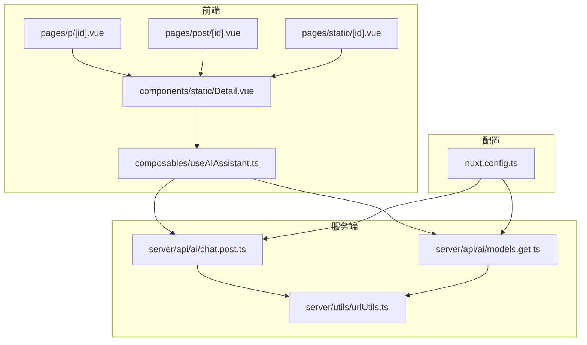
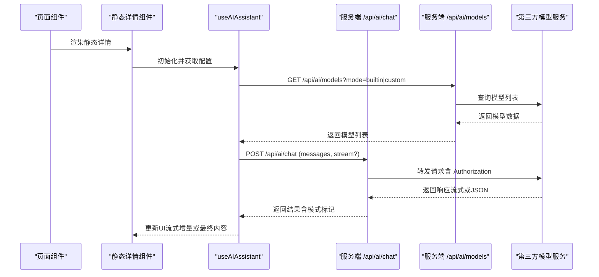
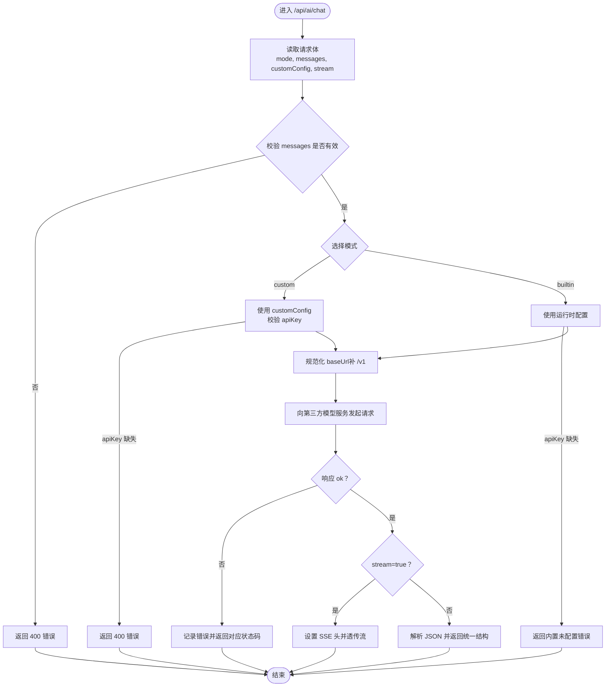
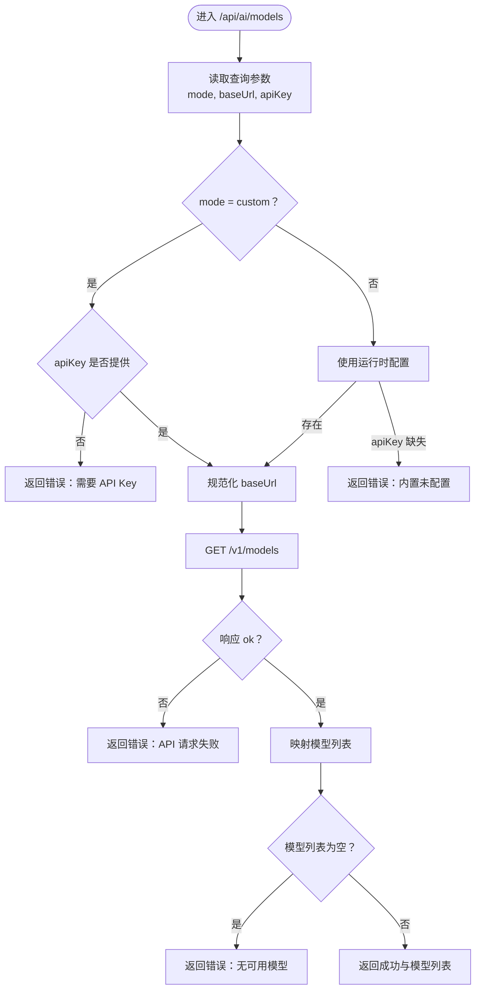
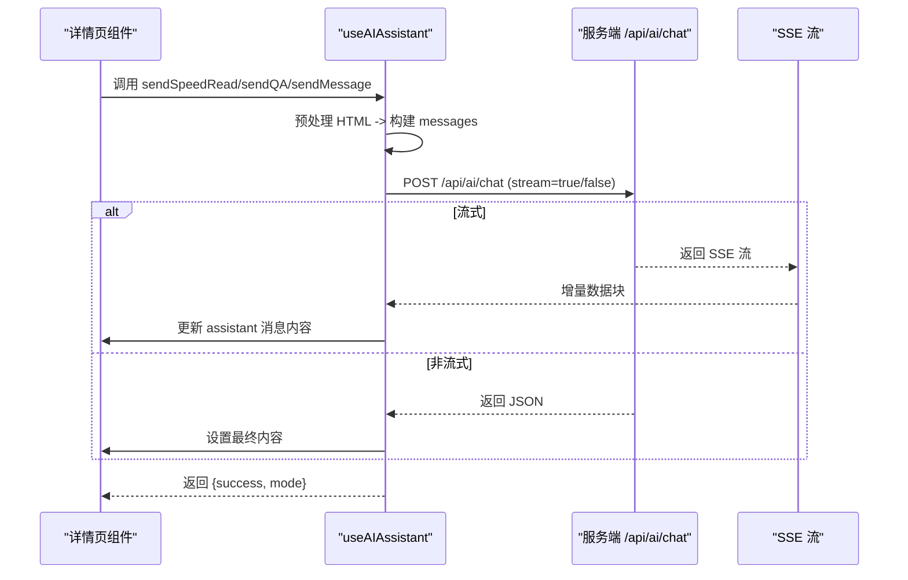
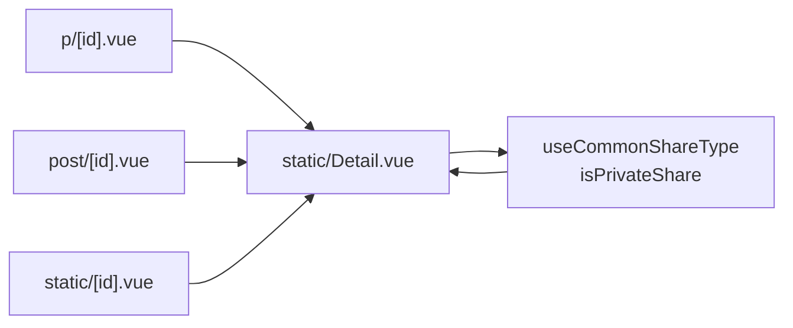
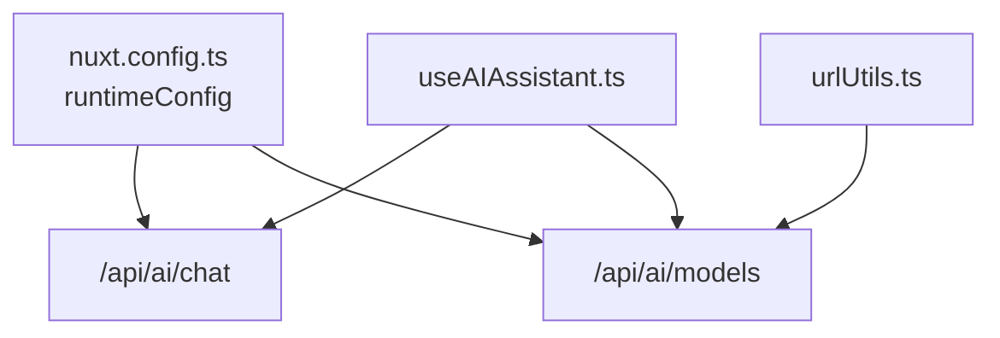

# Endpoint Api

<cite>
**本文引用的文件**
- [apps/app/server/api/ai/chat.post.ts](file://apps/app/server/api/ai/chat.post.ts)
- [apps/app/server/api/ai/models.get.ts](file://apps/app/server/api/ai/models.get.ts)
- [apps/app/server/utils/urlUtils.ts](file://apps/app/server/utils/urlUtils.ts)
- [apps/app/composables/useAIAssistant.ts](file://apps/app/composables/useAIAssistant.ts)
- [apps/app/nuxt.config.ts](file://apps/app/nuxt.config.ts)
- [apps/app/pages/p/[id].vue](file://apps/app/pages/p/[id].vue)
- [apps/app/pages/post/[id].vue](file://apps/app/pages/post/[id].vue)
- [apps/app/pages/static/[id].vue](file://apps/app/pages/static/[id].vue)
- [apps/app/components/static/Detail.vue](file://apps/app/components/static/Detail.vue)
- [apps/app/enums/ShareTypeEnum.ts](file://apps/app/enums/ShareTypeEnum.ts)
- [apps/app/composables/useCommonShareType.ts](file://apps/app/composables/useCommonShareType.ts)
</cite>

## 更新摘要
**变更内容**
- 服务器端API结构重构：从单一endpoint.ts拆分为专门的AI API端点
- 新增独立的chat.post.ts和models.get.ts文件，提升架构清晰度
- 保持前后端接口兼容性和功能完整性

## 目录
1. [简介](#简介)
2. [项目结构](#项目结构)
3. [核心组件](#核心组件)
4. [架构总览](#架构总览)
5. [详细组件分析](#详细组件分析)
6. [依赖关系分析](#依赖关系分析)
7. [性能考虑](#性能考虑)
8. [故障排除指南](#故障排除指南)
9. [结论](#结论)

## 简介
本文件聚焦于该项目的"Endpoint API"能力，特别是服务端 AI 对话代理与模型列表查询接口，以及前端如何通过统一的 AI 助手组合式函数调用这些接口。文档涵盖：
- 服务端 API 端点的设计与行为
- 前端调用流程与错误处理
- 配置与环境变量的作用
- 静态分享页面与路由映射
- 安全与性能相关的实现细节

**更新** 服务器端API结构已从单一endpoint.ts重构为专门的AI API端点，包括chat.post.ts和models.get.ts，提升了架构清晰度和职责分离。

## 项目结构
该应用采用 Nuxt 服务器端渲染（SSR）架构，API 端点位于服务端目录，前端通过组合式函数进行调用，并在页面路由中根据分享类型切换展示组件。

**图表来源**
- [apps/app/pages/p/[id].vue](file://apps/app/pages/p/[id].vue#L1-L27)
- [apps/app/pages/post/[id].vue](file://apps/app/pages/post/[id].vue#L1-L27)
- [apps/app/pages/static/[id].vue](file://apps/app/pages/static/[id].vue#L1-L27)
- [apps/app/components/static/Detail.vue:1-173](file://apps/app/components/static/Detail.vue#L1-L173)
- [apps/app/composables/useAIAssistant.ts:1-488](file://apps/app/composables/useAIAssistant.ts#L1-L488)
- [apps/app/server/api/ai/chat.post.ts:1-153](file://apps/app/server/api/ai/chat.post.ts#L1-L153)
- [apps/app/server/api/ai/models.get.ts:1-102](file://apps/app/server/api/ai/models.get.ts#L1-L102)
- [apps/app/server/utils/urlUtils.ts:1-15](file://apps/app/server/utils/urlUtils.ts#L1-L15)
- [apps/app/nuxt.config.ts:132-145](file://apps/app/nuxt.config.ts#L132-L145)

**章节来源**
- [apps/app/pages/p/[id].vue](file://apps/app/pages/p/[id].vue#L1-L27)
- [apps/app/pages/post/[id].vue](file://apps/app/pages/post/[id].vue#L1-L27)
- [apps/app/pages/static/[id].vue](file://apps/app/pages/static/[id].vue#L1-L27)
- [apps/app/components/static/Detail.vue:1-173](file://apps/app/components/static/Detail.vue#L1-L173)
- [apps/app/composables/useAIAssistant.ts:1-488](file://apps/app/composables/useAIAssistant.ts#L1-L488)
- [apps/app/server/api/ai/chat.post.ts:1-153](file://apps/app/server/api/ai/chat.post.ts#L1-L153)
- [apps/app/server/api/ai/models.get.ts:1-102](file://apps/app/server/api/ai/models.get.ts#L1-L102)
- [apps/app/server/utils/urlUtils.ts:1-15](file://apps/app/server/utils/urlUtils.ts#L1-L15)
- [apps/app/nuxt.config.ts:132-145](file://apps/app/nuxt.config.ts#L132-L145)

## 核心组件
- 服务端 AI 对话代理端点：接收消息数组与配置，转发至第三方模型服务，支持流式与非流式响应。
- 服务端模型列表端点：按模式返回可用模型列表，内置或自定义配置均可。
- 前端 AI 助手组合式函数：封装调用、流式处理、消息构建与错误处理。
- 页面与静态详情组件：根据分享类型决定展示私有或公开详情页。
- 配置与环境变量：运行时配置（如 AI 基础地址、密钥、模型），以及公共配置（如 Provider 模式、API 地址等）。

**更新** 服务器端API结构已重构为专门的端点文件，chat.post.ts和models.get.ts分别处理对话和模型查询功能，提升架构清晰度。

**章节来源**
- [apps/app/server/api/ai/chat.post.ts:1-153](file://apps/app/server/api/ai/chat.post.ts#L1-L153)
- [apps/app/server/api/ai/models.get.ts:1-102](file://apps/app/server/api/ai/models.get.ts#L1-L102)
- [apps/app/composables/useAIAssistant.ts:1-488](file://apps/app/composables/useAIAssistant.ts#L1-L488)
- [apps/app/pages/p/[id].vue](file://apps/app/pages/p/[id].vue#L1-L27)
- [apps/app/pages/post/[id].vue](file://apps/app/pages/post/[id].vue#L1-L27)
- [apps/app/pages/static/[id].vue](file://apps/app/pages/static/[id].vue#L1-L27)
- [apps/app/components/static/Detail.vue:1-173](file://apps/app/components/static/Detail.vue#L1-L173)
- [apps/app/nuxt.config.ts:132-145](file://apps/app/nuxt.config.ts#L132-L145)

## 架构总览
前端通过统一的 AI 助手组合式函数发起请求，服务端端点负责安全地转发到第三方模型服务，并将响应返回给前端。页面层根据分享类型选择不同的展示组件。

**图表来源**
- [apps/app/components/static/Detail.vue:1-173](file://apps/app/components/static/Detail.vue#L1-L173)
- [apps/app/composables/useAIAssistant.ts:1-488](file://apps/app/composables/useAIAssistant.ts#L1-L488)
- [apps/app/server/api/ai/chat.post.ts:1-153](file://apps/app/server/api/ai/chat.post.ts#L1-L153)
- [apps/app/server/api/ai/models.get.ts:1-102](file://apps/app/server/api/ai/models.get.ts#L1-L102)

## 详细组件分析

### 服务端 AI 对话代理端点（/api/ai/chat）
- 功能概述
  - 接收前端传入的消息数组与配置（内置或自定义模式），标准化基础 URL，转发到第三方模型服务。
  - 支持流式与非流式响应；流式场景下设置 SSE 头并直接透传响应流。
  - 返回统一结构，包含成功标志、模式标记与数据（choices、usage）。
- 关键行为
  - 参数校验：messages 必填且为数组。
  - 模式选择：自定义模式需提供 API Key；内置模式从运行时配置读取。
  - URL 规范化：自动处理末尾斜杠与 /v1 后缀。
  - 错误处理：对第三方错误与网络错误进行分类与返回。
- 性能与安全
  - 通过服务端代理隐藏 API Key，避免泄露。
  - 流式传输降低前端等待时间，提升交互体验。

**图表来源**
- [apps/app/server/api/ai/chat.post.ts:1-153](file://apps/app/server/api/ai/chat.post.ts#L1-L153)

**章节来源**
- [apps/app/server/api/ai/chat.post.ts:1-153](file://apps/app/server/api/ai/chat.post.ts#L1-L153)

### 服务端模型列表端点（/api/ai/models）
- 功能概述
  - 支持内置与自定义两种模式，分别从服务端配置或用户提供的 API 端点获取模型列表。
  - 返回统一结构，包含成功标志与模型数组（id/name/provider）。
- 关键行为
  - 模式选择与校验：自定义模式要求提供 API Key；内置模式要求服务端配置存在。
  - URL 规范化：移除末尾 /v1，避免重复。
  - 错误处理：对空列表与网络错误进行降级处理。

**图表来源**
- [apps/app/server/api/ai/models.get.ts:1-102](file://apps/app/server/api/ai/models.get.ts#L1-L102)

**章节来源**
- [apps/app/server/api/ai/models.get.ts:1-102](file://apps/app/server/api/ai/models.get.ts#L1-L102)

### 前端 AI 助手组合式函数（useAIAssistant）
- 功能概述
  - 统一封装 AI 调用，支持速读摘要、问答生成与自由聊天三种场景。
  - 提供流式与非流式两种响应处理，自动清理思维链标记，保证输出整洁。
  - 统一消息结构（system/user/assistant），支持上下文连续性。
- 关键行为
  - HTML 内容预处理：标题、列表、加粗等标签转换为 Markdown，长度控制在合理范围。
  - 调用服务端代理：POST /api/ai/chat，携带 mode、messages、stream 与 customConfig。
  - 流式处理：解析 SSE 数据流，增量更新 UI。
  - 错误处理：区分网络错误、API 错误与空响应，提供明确的错误标识。
- 与页面的协作
  - 页面根据分享类型判断是否私有，进而选择静态详情页或公开详情页。
  - 静态详情组件负责获取文章元数据与设置，AI 助手在详情页内被调用。

**图表来源**
- [apps/app/composables/useAIAssistant.ts:1-488](file://apps/app/composables/useAIAssistant.ts#L1-L488)
- [apps/app/server/api/ai/chat.post.ts:1-153](file://apps/app/server/api/ai/chat.post.ts#L1-L153)

**章节来源**
- [apps/app/composables/useAIAssistant.ts:1-488](file://apps/app/composables/useAIAssistant.ts#L1-L488)

### 页面与静态详情组件
- 路由与页面
  - p/[id].vue、post/[id].vue、static/[id].vue：根据分享类型决定展示私有或公开详情页。
- 静态详情组件
  - 获取文章元数据与设置，处理密码验证与过期检查，最终渲染头部、内容与底部。
  - 与 AI 助手组合式函数配合，在详情页内提供 AI 辅助功能。

**图表来源**
- [apps/app/pages/p/[id].vue](file://apps/app/pages/p/[id].vue#L1-L27)
- [apps/app/pages/post/[id].vue](file://apps/app/pages/post/[id].vue#L1-L27)
- [apps/app/pages/static/[id].vue](file://apps/app/pages/static/[id].vue#L1-L27)
- [apps/app/components/static/Detail.vue:1-173](file://apps/app/components/static/Detail.vue#L1-L173)
- [apps/app/composables/useCommonShareType.ts:1-54](file://apps/app/composables/useCommonShareType.ts#L1-L54)
- [apps/app/enums/ShareTypeEnum.ts:1-26](file://apps/app/enums/ShareTypeEnum.ts#L1-L26)

**章节来源**
- [apps/app/pages/p/[id].vue](file://apps/app/pages/p/[id].vue#L1-L27)
- [apps/app/pages/post/[id].vue](file://apps/app/pages/post/[id].vue#L1-L27)
- [apps/app/pages/static/[id].vue](file://apps/app/pages/static/[id].vue#L1-L27)
- [apps/app/components/static/Detail.vue:1-173](file://apps/app/components/static/Detail.vue#L1-L173)
- [apps/app/composables/useCommonShareType.ts:1-54](file://apps/app/composables/useCommonShareType.ts#L1-L54)
- [apps/app/enums/ShareTypeEnum.ts:1-26](file://apps/app/enums/ShareTypeEnum.ts#L1-L26)

## 依赖关系分析
- 运行时配置
  - 服务端代理与模型端点均依赖运行时配置（aiBaseUrl、aiApiKey、aiModel），并通过 nuxt.config.ts 注入。
- URL 工具
  - 服务端模型端点与 URL 工具共同保证第三方 API 调用的 URL 正确性（规范化与后缀处理）。
- 前后端耦合
  - 前端通过固定路径 /api/ai/chat 与 /api/ai/models 调用服务端端点，约定统一的请求与响应结构。

**图表来源**
- [apps/app/nuxt.config.ts:132-145](file://apps/app/nuxt.config.ts#L132-L145)
- [apps/app/server/api/ai/models.get.ts:1-102](file://apps/app/server/api/ai/models.get.ts#L1-L102)
- [apps/app/server/utils/urlUtils.ts:1-15](file://apps/app/server/utils/urlUtils.ts#L1-L15)
- [apps/app/composables/useAIAssistant.ts:1-488](file://apps/app/composables/useAIAssistant.ts#L1-L488)

**章节来源**
- [apps/app/nuxt.config.ts:132-145](file://apps/app/nuxt.config.ts#L132-L145)
- [apps/app/server/api/ai/models.get.ts:1-102](file://apps/app/server/api/ai/models.get.ts#L1-L102)
- [apps/app/server/utils/urlUtils.ts:1-15](file://apps/app/server/utils/urlUtils.ts#L1-L15)
- [apps/app/composables/useAIAssistant.ts:1-488](file://apps/app/composables/useAIAssistant.ts#L1-L488)

## 性能考虑
- 流式响应
  - 服务端与前端均支持流式传输，减少首字节延迟，提升交互体验。
- 内容预处理
  - 前端对 HTML 内容进行预处理与长度控制，避免超长内容导致 Token 超限。
- URL 规范化
  - 服务端对第三方 API 的基础 URL 进行规范化，避免重复拼接与额外往返。
- 配置缓存
  - 静态设置通过存储获取，避免重复请求，提高页面渲染效率。

## 故障排除指南
- 内置 AI 未配置
  - 现象：调用 /api/ai/chat 返回内置未配置错误。
  - 处理：设置运行时配置（NUXT_AI_API_KEY、NUXT_AI_BASE_URL、NUXT_AI_MODEL）。
- 自定义模型缺少 API Key
  - 现象：自定义模式调用 /api/ai/chat 返回 400。
  - 处理：在请求体中提供 customConfig.apiKey。
- 第三方 API 错误
  - 现象：响应非 ok，返回对应状态码与错误信息。
  - 处理：检查第三方服务状态、配额与网络连通性。
- 空响应或模型列表为空
  - 现象：/api/ai/models 返回空列表或错误。
  - 处理：确认 API Key 有效、模型服务正常、URL 规范化正确。
- 流式传输异常
  - 现象：前端无法接收 SSE 数据。
  - 处理：检查服务端是否正确设置 SSE 头、网络代理是否支持长连接。

**章节来源**
- [apps/app/server/api/ai/chat.post.ts:1-153](file://apps/app/server/api/ai/chat.post.ts#L1-L153)
- [apps/app/server/api/ai/models.get.ts:1-102](file://apps/app/server/api/ai/models.get.ts#L1-L102)

## 结论
该项目通过服务端代理实现了安全、稳定的 AI 对话能力，前端以统一的组合式函数进行调用，具备良好的扩展性与可维护性。结合静态分享页面与路由映射，整体形成从页面渲染到 AI 辅助的完整闭环。

**更新** 服务器端API结构的重构显著提升了架构清晰度，chat.post.ts和models.get.ts的职责分离使得代码更易维护和扩展。新的架构保持了前后端接口的完全兼容性，同时为未来的功能扩展奠定了更好的基础。

建议在生产环境中：
- 明确区分内置与自定义模式的配置与计费策略
- 对流式传输与错误处理进行更细粒度的日志与监控
- 在第三方服务不稳定时提供降级策略（如本地缓存或离线提示）
- 利用新的端点结构进行模块化测试和部署