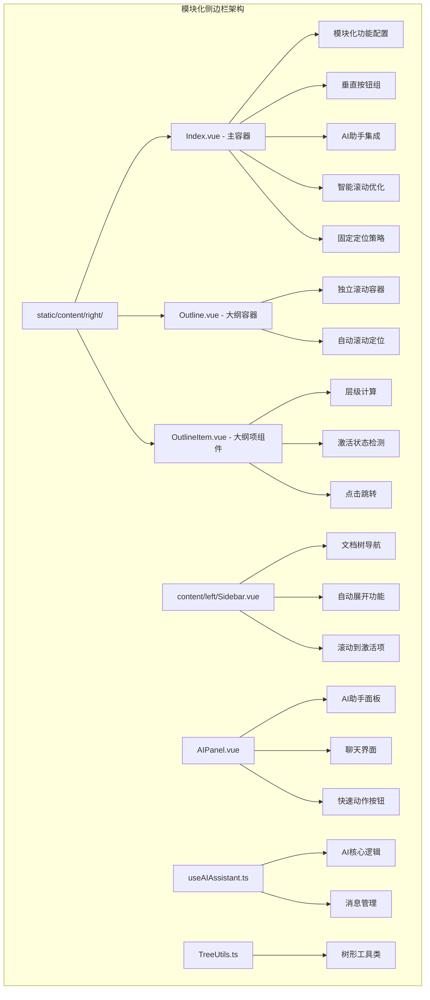
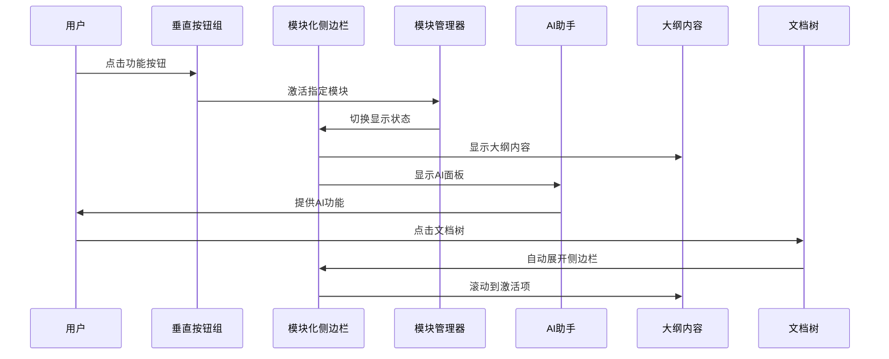
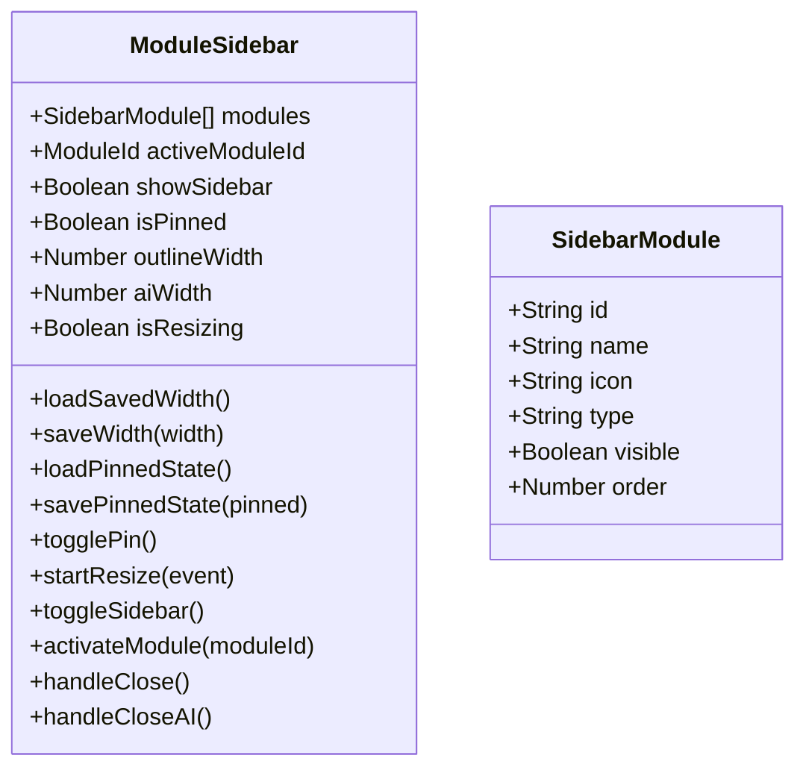
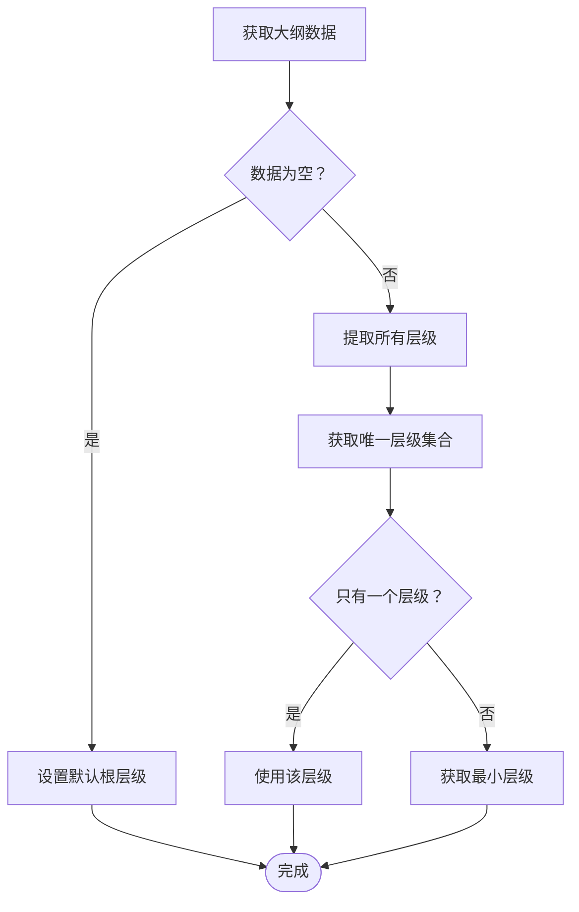
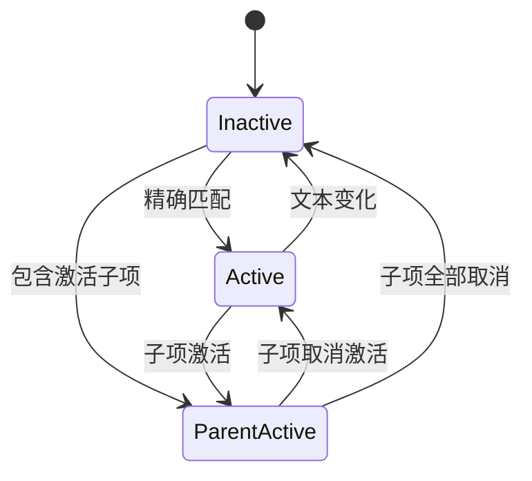
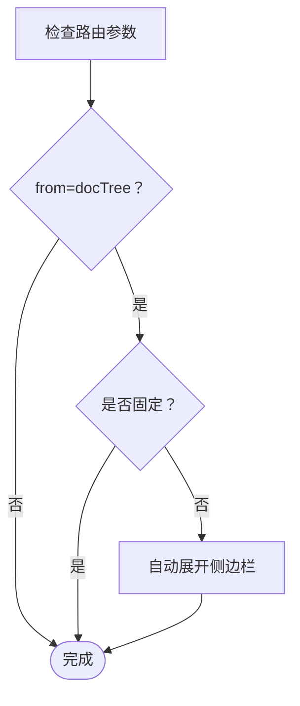
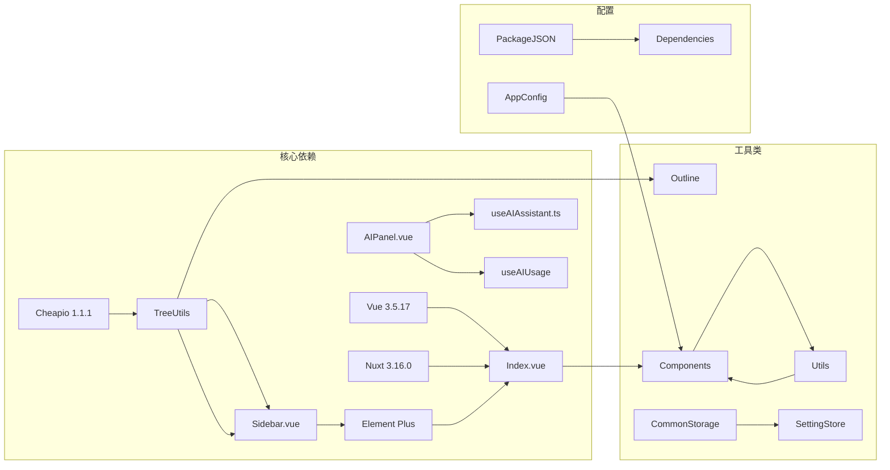

# 大纲系统

<cite>
**本文档引用的文件**
- [apps/app/components/static/content/right/Index.vue](file://apps/app/components/static/content/right/Index.vue)
- [apps/app/components/static/content/right/Outline.vue](file://apps/app/components/static/content/right/Outline.vue)
- [apps/app/components/static/content/right/OutlineItem.vue](file://apps/app/components/static/content/right/OutlineItem.vue)
- [apps/app/components/static/content/left/Sidebar.vue](file://apps/app/components/static/content/left/Sidebar.vue)
- [apps/app/components/ai-assistant/AIPanel.vue](file://apps/app/components/ai-assistant/AIPanel.vue)
- [apps/app/composables/useAIAssistant.ts](file://apps/app/composables/useAIAssistant.ts)
- [apps/app/utils/TreeUtils.ts](file://apps/app/utils/TreeUtils.ts)
- [apps/app/app.config.ts](file://apps/app/app.config.ts)
</cite>

## 更新摘要
**变更内容**
- 大纲系统已完全重构为模块化侧边栏架构
- 移除了悬停展开功能，采用垂直按钮组设计
- 新增模块化功能模块配置系统
- 集成AI助手面板，实现智能内容辅助功能
- 优化智能滚动行为，增强大纲与正文的同步体验
- 改进导航增强功能，支持从文档树跳转的自动展开
- 完善固定定位策略和视口处理机制

## 目录
1. [简介](#简介)
2. [项目结构](#项目结构)
3. [核心组件](#核心组件)
4. [架构概览](#架构概览)
5. [详细组件分析](#详细组件分析)
6. [模块化侧边栏系统](#模块化侧边栏系统)
7. [AI助手集成](#ai助手集成)
8. [智能滚动优化](#智能滚动优化)
9. [导航增强功能](#导航增强功能)
10. [布局系统优化](#布局系统优化)
11. [依赖关系分析](#依赖关系分析)
12. [性能考虑](#性能考虑)
13. [故障排除指南](#故障排除指南)
14. [结论](#结论)

## 简介

大纲系统是 Siyuan 笔记博客插件中的核心功能模块，负责为静态文章页面提供交互式的大纲导航。该系统能够自动生成文档的层次结构，提供智能的滚动同步、可定制的显示范围和灵活的用户交互体验。

**更新** 系统已全面升级为模块化侧边栏架构，采用垂直按钮组设计和模块化功能配置。新增功能包括AI助手集成、智能滚动优化、导航增强和响应式布局等。

系统主要特点包括：
- 自动生成文档大纲结构
- 实时滚动同步和激活状态管理
- 可调整的大纲宽度和固定显示功能
- 支持多级标题的层级展示
- 响应式设计和主题适配
- **新增**：模块化侧边栏架构
- **新增**：垂直按钮组设计
- **新增**：AI助手集成（速读、问答、聊天）
- **新增**：智能滚动优化和导航增强
- **新增**：从文档树跳转的自动展开功能

## 项目结构

大纲系统位于应用的静态内容组件目录中，现已升级为模块化侧边栏架构：

**图表来源**
- [apps/app/components/static/content/right/Index.vue:10-447](file://apps/app/components/static/content/right/Index.vue#L10-L447)
- [apps/app/components/static/content/right/Outline.vue:10-157](file://apps/app/components/static/content/right/Outline.vue#L10-L157)
- [apps/app/components/static/content/right/OutlineItem.vue:10-275](file://apps/app/components/static/content/right/OutlineItem.vue#L10-L275)
- [apps/app/components/static/content/left/Sidebar.vue:10-289](file://apps/app/components/static/content/left/Sidebar.vue#L10-L289)
- [apps/app/components/ai-assistant/AIPanel.vue:11-800](file://apps/app/components/ai-assistant/AIPanel.vue#L11-L800)
- [apps/app/composables/useAIAssistant.ts:1-665](file://apps/app/composables/useAIAssistant.ts#L1-665)

**章节来源**
- [apps/app/components/static/content/right/Index.vue:1-762](file://apps/app/components/static/content/right/Index.vue#L1-L762)
- [apps/app/components/static/content/right/Outline.vue:1-157](file://apps/app/components/static/content/right/Outline.vue#L1-L157)
- [apps/app/components/static/content/right/OutlineItem.vue:1-275](file://apps/app/components/static/content/right/OutlineItem.vue#L1-L275)
- [apps/app/components/static/content/left/Sidebar.vue:1-289](file://apps/app/components/static/content/left/Sidebar.vue#L1-L289)

## 核心组件

大纲系统由六个核心组件协同工作，其中右侧大纲容器已升级为模块化侧边栏架构：

### 1. 大纲主容器 (Index.vue) - **已全面重构**
负责整个大纲系统的协调和状态管理，现采用模块化侧边栏架构和垂直按钮组设计，包括滚动监听、激活状态跟踪、用户交互控制和模块化功能管理。

### 2. 大纲容器 (Outline.vue)
提供大纲的整体布局和样式，包含独立滚动区域和自动滚动功能。

### 3. 大纲项组件 (OutlineItem.vue)
处理单个大纲项的渲染、层级计算和交互逻辑。

### 4. 左侧文档树 (Sidebar.vue) - **新增**
提供文档树导航功能，支持自动展开和滚动到激活项。

### 5. AI助手面板 (AIPanel.vue) - **新增**
提供统一的AI助手界面，支持速读、问答生成和自由聊天功能。

### 6. AI助手组合式函数 (useAIAssistant.ts) - **新增**
封装AI助手的核心逻辑，包括消息管理、API调用和内容处理。

**章节来源**
- [apps/app/components/static/content/right/Index.vue:1-762](file://apps/app/components/static/content/right/Index.vue#L1-L762)
- [apps/app/components/static/content/right/Outline.vue:1-157](file://apps/app/components/static/content/right/Outline.vue#L1-L157)
- [apps/app/components/static/content/right/OutlineItem.vue:1-275](file://apps/app/components/static/content/right/OutlineItem.vue#L1-L275)
- [apps/app/components/static/content/left/Sidebar.vue:1-289](file://apps/app/components/static/content/left/Sidebar.vue#L1-L289)
- [apps/app/components/ai-assistant/AIPanel.vue:1-800](file://apps/app/components/ai-assistant/AIPanel.vue#L1-L800)
- [apps/app/composables/useAIAssistant.ts:1-665](file://apps/app/composables/useAIAssistant.ts#L1-L665)

## 架构概览

大纲系统采用模块化的侧边栏架构设计，现已升级为集成AI助手的完整解决方案：

**图表来源**
- [apps/app/components/static/content/right/Index.vue:427-445](file://apps/app/components/static/content/right/Index.vue#L427-L445)
- [apps/app/components/static/content/right/Index.vue:292-329](file://apps/app/components/static/content/right/Index.vue#L292-L329)
- [apps/app/components/static/content/left/Sidebar.vue:24-114](file://apps/app/components/static/content/left/Sidebar.vue#L24-L114)

系统的核心流程包括：
1. **初始化阶段**：加载模块配置和功能状态，建立模块化侧边栏
2. **渲染阶段**：构建垂直按钮组和模块化侧边栏，应用固定定位
3. **交互阶段**：处理用户操作、模块切换和状态更新
4. **同步阶段**：维护滚动位置、激活状态和模块状态

## 详细组件分析

### 大纲主容器 (Index.vue) - **已全面重构**

#### 模块化侧边栏架构
组件现在采用模块化侧边栏架构，提供更灵活的功能组织：

**图表来源**
- [apps/app/components/static/content/right/Index.vue:18-45](file://apps/app/components/static/content/right/Index.vue#L18-L45)
- [apps/app/components/static/content/right/Index.vue:292-330](file://apps/app/components/static/content/right/Index.vue#L292-L330)

#### 垂直按钮组设计
新增的垂直按钮组提供了一键访问所有功能模块：

- **功能模块按钮**：动态渲染，支持大纲和AI助手模块
- **收起按钮**：仅在侧边栏展开时显示，使用右箭头表示收起
- **统一风格**：所有按钮采用相同的32px尺寸和圆角设计
- **激活状态**：使用主题色突出显示当前激活的模块

#### 模块化功能配置
系统支持动态配置功能模块：

- **模块类型**：支持outline、ai、graph等模块类型
- **可见性控制**：每个模块都有独立的可见性开关
- **排序机制**：通过order属性控制模块显示顺序
- **扩展性**：新增模块只需在配置中添加

#### 固定定位策略
系统采用固定定位策略而非内容流定位：

- **outline-container**：使用 `position: fixed` 确保不随正文滚动
- **视窗高度**：`height: calc(100vh - 120px)` 占满视窗高度
- **独立 z-index**：`z-index: 100` 确保大纲始终在最前面显示
- **圆角设计**：顶部和底部圆角提升视觉质感

#### 用户交互功能增强
- **拖拽调整宽度**：支持鼠标拖拽调整大纲和AI面板宽度
- **固定显示**：支持固定显示侧边栏，避免频繁展开/收起
- **模块切换**：支持大纲和AI助手模块间的无缝切换
- **本地存储**：持久化用户的偏好设置

**章节来源**
- [apps/app/components/static/content/right/Index.vue:1-762](file://apps/app/components/static/content/right/Index.vue#L1-L762)

### 大纲容器 (Outline.vue)

#### 独立滚动容器
容器现在提供完全独立的滚动环境：

**图表来源**
- [apps/app/components/static/content/right/Outline.vue:35-48](file://apps/app/components/static/content/right/Outline.vue#L35-L48)

#### 自动滚动功能优化
实现了智能的滚动定位功能：

- **激活项定位**：自动滚动到当前激活的大纲项
- **居中显示**：确保激活项在视窗中央位置
- **平滑滚动**：提供流畅的滚动体验
- **防滚动传播**：使用 `overscroll-behavior: contain` 防止滚动传播到父元素

**章节来源**
- [apps/app/components/static/content/right/Outline.vue:1-157](file://apps/app/components/static/content/right/Outline.vue#L1-L157)

### 大纲项组件 (OutlineItem.vue)

#### 层级计算算法
组件实现了复杂的层级计算逻辑：

**图表来源**
- [apps/app/components/static/content/right/OutlineItem.vue:40-48](file://apps/app/components/static/content/right/OutlineItem.vue#L40-L48)

#### 激活状态管理
实现了多层次的激活状态检测：

**图表来源**
- [apps/app/components/static/content/right/OutlineItem.vue:104-153](file://apps/app/components/static/content/right/OutlineItem.vue#L104-L153)

#### 文本处理机制
提供了完整的文本清理和格式化功能：

- **HTML 实体解码**：处理 `&nbsp;`, `&amp;`, `&lt;` 等实体
- **特殊字符过滤**：移除冒号、逗号等标点符号
- **HTML 标签剥离**：提取纯文本内容
- **空白字符标准化**：统一处理换行和空格

**章节来源**
- [apps/app/components/static/content/right/OutlineItem.vue:1-275](file://apps/app/components/static/content/right/OutlineItem.vue#L1-L275)

### 左侧文档树 (Sidebar.vue) - **新增**

#### 自动展开功能
提供了智能的文档树导航：

**图表来源**
- [apps/app/components/static/content/left/Sidebar.vue:120-142](file://apps/app/components/static/content/left/Sidebar.vue#L120-L142)

#### 滚动到激活项
实现了智能的滚动定位功能：

- **递增重试**：最多重试10次确保元素可见
- **居中显示**：使激活元素在滚动条中央显示
- **边界检查**：确保滚动位置在有效范围内
- **平滑滚动**：使用Element Plus的滚动API

#### 元素查找优化
- **优先级查找**：优先查找`el-menu-item.is-active`
- **降级方案**：找不到时查找任何`is-active`元素
- **重试机制**：等待菜单展开后再进行查找
- **日志记录**：记录查找过程和结果

**章节来源**
- [apps/app/components/static/content/left/Sidebar.vue:1-289](file://apps/app/components/static/content/left/Sidebar.vue#L1-L289)

## 模块化侧边栏系统

### 侧边栏架构设计

**更新** 大纲系统现已完全重构为模块化侧边栏架构：

#### 模块化功能配置
- **模块类型**：支持outline、ai、graph等模块类型
- **可见性控制**：每个模块都有独立的可见性开关
- **排序机制**：通过order属性控制模块显示顺序
- **扩展性**：新增模块只需在配置中添加

#### 垂直按钮组设计
- **统一风格**：所有按钮采用相同的32px尺寸和圆角设计
- **激活状态**：使用主题色突出显示当前激活的模块
- **收起按钮**：仅在侧边栏展开时显示，使用右箭头表示收起
- **垂直排列**：按钮组垂直排列，节省水平空间

#### 固定定位实现
- **outline-container**：使用 `position: fixed` 确保不随正文滚动
- **视窗高度**：`height: calc(100vh - 120px)` 占满视窗高度
- **独立 z-index**：`z-index: 100` 确保大纲始终在最前面显示
- **圆角设计**：顶部和底部圆角提升视觉质感

#### 宽度管理机制
- **独立宽度控制**：大纲和AI面板有不同的宽度设置
- **拖拽调整**：支持鼠标拖拽调整宽度
- **范围限制**：200-500px的有效调整范围
- **本地存储**：持久化用户的宽度偏好设置

**章节来源**
- [apps/app/components/static/content/right/Index.vue:18-45](file://apps/app/components/static/content/right/Index.vue#L18-L45)
- [apps/app/components/static/content/right/Index.vue:427-445](file://apps/app/components/static/content/right/Index.vue#L427-L445)
- [apps/app/components/static/content/right/Index.vue:471-487](file://apps/app/components/static/content/right/Index.vue#L471-L487)

### 模块激活机制

#### 模块按钮样式
- **统一基础样式**：所有模块按钮使用相同的圆角和阴影设计
- **激活状态样式**：使用主题色突出显示当前激活的模块
- **悬停效果**：提供平滑的过渡动画和阴影变化
- **图标设计**：使用统一的图标系统，保持视觉一致性

#### 模块切换逻辑
- **状态同步**：模块激活状态与侧边栏显示状态保持同步
- **自动展开**：激活模块时自动展开侧边栏
- **固定管理**：AI面板激活时不会强制固定侧边栏
- **宽度切换**：根据激活模块动态调整宽度

**章节来源**
- [apps/app/components/static/content/right/Index.vue:283-299](file://apps/app/components/static/content/right/Index.vue#L283-L299)
- [apps/app/components/static/content/right/Index.vue:306-314](file://apps/app/components/static/content/right/Index.vue#L306-L314)

## AI助手集成

### AI助手架构设计

**更新** 大纲系统现已完全集成AI助手功能，提供智能化的内容辅助能力：

#### 统一AI交互
- **聊天气泡设计**：所有AI交互都以对话气泡的形式呈现
- **连续上下文**：保持完整的对话历史和上下文
- **统一使用计数**：内置模型和自定义模型共享使用次数

#### 快速动作功能
- **速读模式**：自动生成文档摘要、关键要点和思考问题
- **问答生成**：基于文档内容生成5个有价值的问答对
- **自由聊天**：支持用户自定义问题和讨论

#### 消息管理系统
- **消息类型分类**：区分摘要、问答和普通聊天消息
- **富文本支持**：支持HTML格式的内容展示
- **自动滚动**：新消息自动滚动到底部
- **时间戳管理**：每条消息显示精确的时间

**章节来源**
- [apps/app/components/ai-assistant/AIPanel.vue:1-800](file://apps/app/components/ai-assistant/AIPanel.vue#L1-L800)
- [apps/app/composables/useAIAssistant.ts:1-665](file://apps/app/composables/useAIAssistant.ts#L1-L665)

### AI使用计数系统

#### 使用限制管理
- **剩余次数显示**：实时显示可用的AI使用次数
- **使用限制**：防止过度使用AI功能
- **消费机制**：每次使用后自动扣减剩余次数

#### 配置管理
- **自定义配置**：支持用户自定义AI服务提供商
- **配置存储**：持久化AI配置信息
- **模式切换**：支持内置模型和自定义模型切换

**章节来源**
- [apps/app/components/ai-assistant/AIPanel.vue:50-51](file://apps/app/components/ai-assistant/AIPanel.vue#L50-L51)
- [apps/app/composables/useAIAssistant.ts:296-301](file://apps/app/composables/useAIAssistant.ts#L296-L301)

## 智能滚动优化

### 滚动同步机制

**更新** 大纲系统实现了智能的滚动同步功能，提供更流畅的用户体验：

#### 滚动监听优化
- **精确计算**：基于到视口顶部的距离找到最近节点
- **偏移量处理**：考虑大纲位置的80px偏移量
- **性能优化**：避免频繁的DOM查询和计算
- **防抖处理**：使用防抖技术减少滚动事件频率

#### 激活状态管理
- **文本清理一致性**：与大纲项组件保持一致的文本清理逻辑
- **HTML实体处理**：统一处理各种HTML实体
- **特殊字符过滤**：移除标点符号和特殊字符
- **正则表达式清理**：使用正则表达式确保一致性

#### 自动滚动定位
- **激活项居中**：自动滚动到激活项并居中显示
- **视口偏移**：考虑大纲位置的80px偏移量
- **距离计算**：基于到视口顶部的距离找到最近节点

**章节来源**
- [apps/app/components/static/content/right/Index.vue:194-224](file://apps/app/components/static/content/right/Index.vue#L194-L224)
- [apps/app/components/static/content/right/Index.vue:174-192](file://apps/app/components/static/content/right/Index.vue#L174-L192)

### 滚动性能优化

#### 独立滚动容器
- **独立滚动**：大纲容器内部独立滚动
- **防滚动传播**：使用 `overscroll-behavior: contain`
- **iOS 优化**：启用 `-webkit-overflow-scrolling: touch`
- **平滑滚动**：全局启用 `scroll-behavior: smooth`

#### 滚动条自定义
- **细滚动条**：宽度仅为 3px
- **透明轨道**：滚动条轨道透明
- **淡色主题**：滚动条颜色根据主题调整
- **悬停效果**：悬停时增加透明度

**章节来源**
- [apps/app/components/static/content/right/Outline.vue:55-90](file://apps/app/components/static/content/right/Outline.vue#L55-L90)
- [apps/app/components/static/content/right/Outline.vue:122-152](file://apps/app/components/static/content/right/Outline.vue#L122-L152)

## 导航增强功能

### 文档树集成

**更新** 大纲系统增强了与文档树的集成，提供更好的导航体验：

#### 自动展开功能
- **来源检测**：检测是否从文档树跳转
- **条件展开**：在满足条件时自动展开侧边栏
- **优先级管理**：固定显示优先于自动展开
- **状态同步**：确保展开状态与URL参数保持一致

#### 固定显示增强
- **状态持久化**：使用`useState`确保SSR和客户端状态一致
- **避免闪烁**：通过状态同步避免界面闪烁
- **用户偏好**：支持用户手动固定显示侧边栏

#### AI面板联动
- **自动激活**：AI面板激活时自动切换模块
- **展开控制**：AI面板激活时自动展开侧边栏
- **固定管理**：AI面板激活时不会强制固定
- **状态同步**：确保AI面板和侧边栏状态同步

**章节来源**
- [apps/app/components/static/content/right/Index.vue:28-30](file://apps/app/components/static/content/right/Index.vue#L28-L30)
- [apps/app/components/static/content/right/Index.vue:229-240](file://apps/app/components/static/content/right/Index.vue#L229-L240)

### 左侧导航优化

#### 滚动到激活项
- **递增重试**：最多重试10次确保元素可见
- **居中显示**：使激活元素在滚动条中央显示
- **边界检查**：确保滚动位置在有效范围内
- **平滑滚动**：使用Element Plus的滚动API

#### 元素查找优化
- **优先级查找**：优先查找`el-menu-item.is-active`
- **降级方案**：找不到时查找任何`is-active`元素
- **重试机制**：等待菜单展开后再进行查找
- **日志记录**：记录查找过程和结果

**章节来源**
- [apps/app/components/static/content/left/Sidebar.vue:24-109](file://apps/app/components/static/content/left/Sidebar.vue#L24-L109)

## 布局系统优化

### 固定定位架构

**更新** 大纲系统已完全迁移到基于固定定位策略的架构：

#### 固定定位实现
- **outline-container**：使用 `position: fixed` 确保不随正文滚动
- **100vh 高度**：占满整个视窗高度
- **独立 z-index**：`z-index: 100` 确保大纲始终在最前面显示
- **圆角设计**：顶部和底部圆角提升视觉质感

#### 视口相对定位
- **固定定位**：确保大纲容器不随正文滚动
- **视窗高度**：`calc(100vh - 120px)` 占满视窗高度
- **独立滚动**：大纲容器内部独立滚动，不影响正文

#### 初始化跟踪机制
- **isInitialized 状态**：标记是否已完成初始加载
- **延迟初始化**：100ms 延迟避免初始过渡动画
- **状态同步**：确保大纲展开/收起的平滑过渡

#### 精细化宽度管理
- **startResize**：开始拖拽调整宽度
- **范围限制**：200-500px 的有效范围
- **实时预览**：拖拽时实时显示新宽度
- **自动保存**：松开鼠标时自动保存设置

**章节来源**
- [apps/app/components/static/content/right/Index.vue:230-317](file://apps/app/components/static/content/right/Index.vue#L230-L317)
- [apps/app/components/static/content/right/Index.vue:320-533](file://apps/app/components/static/content/right/Index.vue#L320-L533)

### 视觉增强优化

#### 圆角设计
- **顶部圆角**：`border-top-left-radius: 8px`
- **底部圆角**：`border-bottom-left-radius: 8px`
- **更柔和的边框**：`rgba(0, 0, 0, 0.06)`

#### 阴影效果
- **柔和阴影**：`box-shadow: -2px 2px 8px rgba(0, 0, 0, 0.06)`
- **更淡的阴影值**：相比之前版本更加柔和
- **适度的投影**：提升视觉层次感

#### 自定义滚动条
- **细滚动条**：宽度仅为 3px
- **透明轨道**：滚动条轨道透明
- **淡色主题**：滚动条颜色根据主题调整
- **悬停效果**：悬停时增加透明度

**章节来源**
- [apps/app/components/static/content/right/Index.vue:94-123](file://apps/app/components/static/content/right/Index.vue#L94-L123)
- [apps/app/components/static/content/right/Index.vue:355-358](file://apps/app/components/static/content/right/Index.vue#L355-L358)

## 依赖关系分析

大纲系统依赖于多个核心库和工具：

**图表来源**
- [apps/app/app.config.ts:28-72](file://apps/app/app.config.ts#L28-L72)

### 外部依赖

系统使用了以下关键外部依赖：

- **Vue 生态系统**：Vue 3.5.17 + Nuxt 3.16.0 提供基础框架
- **UI 组件库**：Element Plus 2.x 提供现代化的用户界面
- **DOM 操作**：Cheerio 1.1.1 用于服务器端的 DOM 解析
- **工具库**：zhi-common 提供通用的工具函数
- **颜色模式**：@vueuse/core 提供颜色模式切换功能

**章节来源**
- [apps/app/app.config.ts:1-97](file://apps/app/app.config.ts#L1-L97)

## 性能考虑

### 优化策略

**更新** 新的模块化侧边栏系统和AI集成带来了多项性能优化：

1. **固定定位优化**：使用 CSS fixed 定位替代 JavaScript 布局计算
2. **viewport 定位**：固定定位避免布局重排
3. **模块化加载**：按需加载AI助手模块
4. **初始化跟踪**：避免初始过渡动画的性能开销
5. **拖拽时禁用过渡**：避免拖拽过程中的动画开销
6. **独立滚动容器**：减少滚动事件对整个页面的影响
7. **自定义滚动条**：使用 CSS 滚动条替代复杂组件
8. **状态持久化**：使用本地存储减少重复计算

### 内存优化

- **组件卸载**：在组件销毁时清理所有事件监听器
- **状态清理**：避免在组件生命周期外保留状态引用
- **资源释放**：及时释放 DOM 引用和定时器
- **本地存储优化**：只在必要时访问 localStorage

### 布局性能

- **固定定位**：现代浏览器优化的定位算法
- **fixed 定位**：避免文档流中的重排
- **圆角设计**：硬件加速的 CSS 属性
- **阴影效果**：适度的 GPU 加速

**章节来源**
- [apps/app/components/static/content/right/Index.vue:207-227](file://apps/app/components/static/content/right/Index.vue#L207-L227)

## 故障排除指南

### 常见问题

#### 大纲不显示
1. **检查数据源**：确认 `outlineData` 是否正确传入
2. **验证配置**：检查 `outlineLevel` 设置是否合理
3. **查看控制台**：检查是否有 JavaScript 错误
4. **固定定位检查**：确认大纲容器使用正确的固定定位

#### 模块按钮不响应
1. **检查模块配置**：确认模块配置是否正确
2. **验证激活状态**：检查 `activeModuleId` 是否正确
3. **查看控制台**：检查是否有事件监听器错误
4. **状态同步检查**：确认模块状态与UI状态保持一致

#### 滚动不同步
1. **检查选择器**：确认 `[data-subtype^="h"]` 选择器是否正确
2. **验证元素**：确保文档中存在有效的标题元素
3. **调试日志**：查看滚动监听器的日志输出
4. **初始化状态**：确认 `isInitialized` 状态是否正确设置

#### 激活状态异常
1. **文本清理**：确认 `cleanNodeText` 和 `adjustItemName` 方法的一致性
2. **编码问题**：检查特殊字符的处理是否正确
3. **边界情况**：验证空文本和特殊格式的处理
4. **固定定位**：确认大纲容器使用正确的固定定位

#### AI助手问题
1. **检查API配置**：确认AI服务提供商配置是否正确
2. **验证使用计数**：检查剩余使用次数是否正常
3. **查看错误日志**：检查AI调用过程中的错误信息
4. **网络连接**：确认网络连接是否正常

#### 布局问题
1. **固定定位**：检查父容器的定位属性设置
2. **视口高度**：确认 `calc(100vh - 120px)` 计算是否正确
3. **圆角设计**：验证圆角样式的正确应用
4. **阴影效果**：检查阴影样式的兼容性

**章节来源**
- [apps/app/components/static/content/right/Index.vue:172-219](file://apps/app/components/static/content/right/Index.vue#L172-L219)
- [apps/app/components/static/content/right/OutlineItem.vue:104-153](file://apps/app/components/static/content/right/OutlineItem.vue#L104-L153)

## 结论

大纲系统作为 Siyuan 笔记博客插件的核心功能，经过重大升级后展现了更加优秀的架构设计和用户体验。系统通过采用模块化侧边栏架构和固定定位策略，实现了高度的模块化、可维护性和性能优化。

### 主要优势

1. **架构升级**：从简单容器升级为模块化侧边栏架构
2. **AI集成**：新增AI助手功能，提供智能化的内容辅助
3. **布局优化**：采用固定定位确保稳定显示和更好的性能表现
4. **用户体验**：垂直按钮组设计提供更直观的操作体验
5. **交互增强**：精细化宽度管理和拖拽调整功能
6. **视觉增强**：圆角、阴影、自定义滚动条等现代化设计
7. **导航增强**：支持从文档树跳转的自动展开功能
8. **智能滚动**：优化的滚动同步和激活状态管理

### 技术亮点

- **模块化侧边栏**：支持动态配置和扩展的功能模块
- **垂直按钮组**：统一风格的快捷操作界面
- **固定定位策略**：现代化的布局解决方案
- **viewport 定位**：固定定位确保稳定显示
- **AI助手集成**：统一的聊天界面设计
- **智能滚动优化**：精确的滚动同步机制
- **导航增强**：与文档树的深度集成

### 未来展望

系统将继续演进，计划包括：
- 虚拟滚动支持大型文档
- 更多主题适配选项
- 移动端优化改进
- AI功能扩展和增强
- 性能监控和分析

该系统为用户提供了专业级的文档导航体验，是 Siyuan 笔记本生态系统的重要组成部分，代表了现代前端开发的最佳实践。