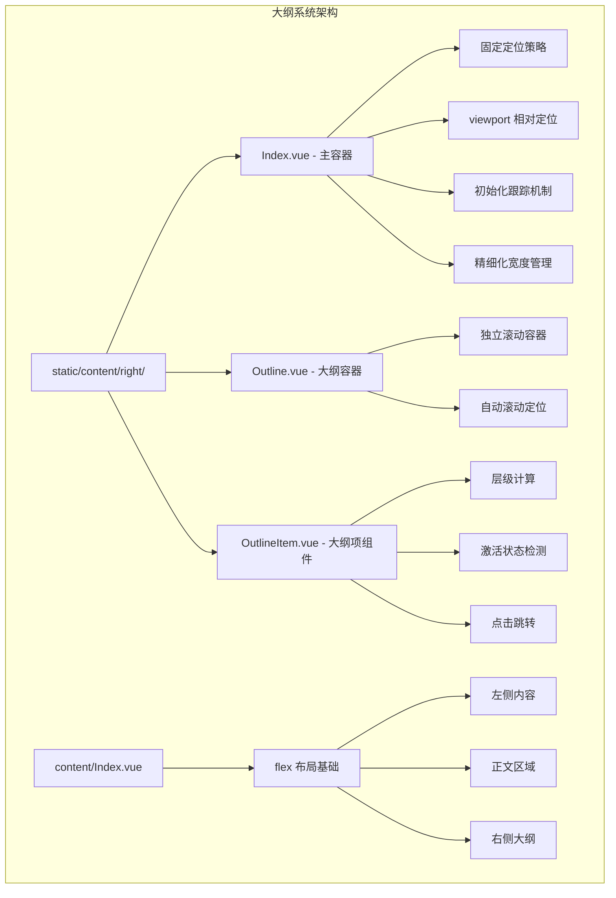
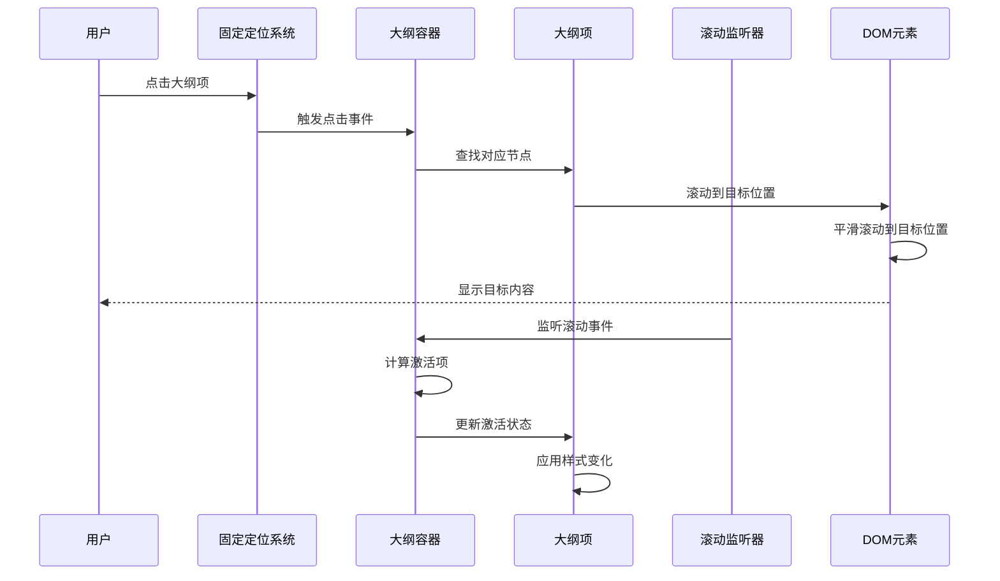
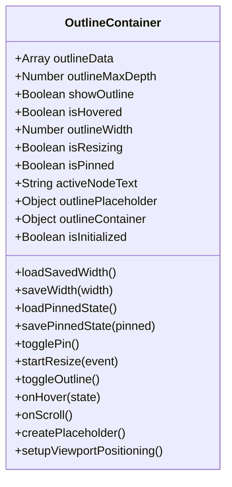
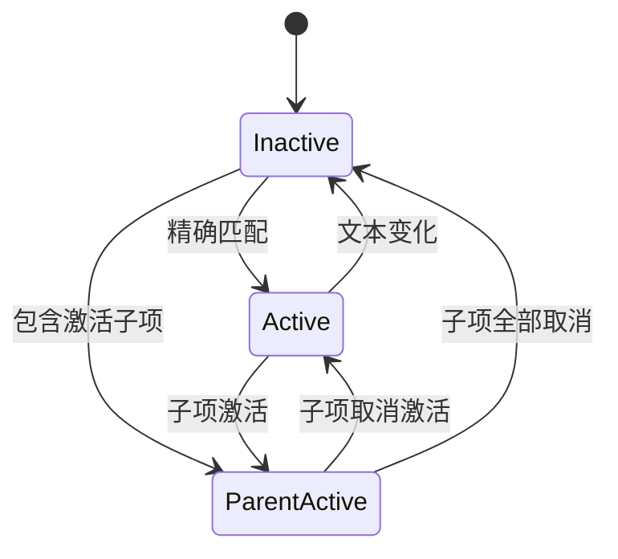
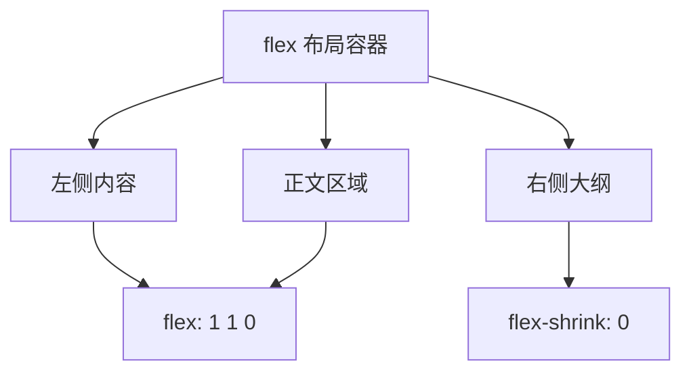
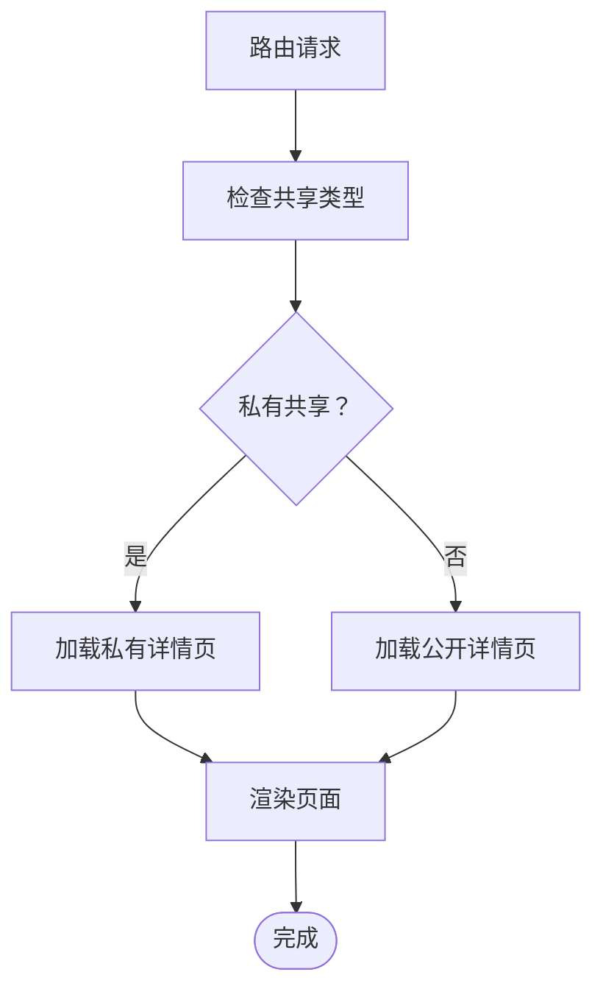
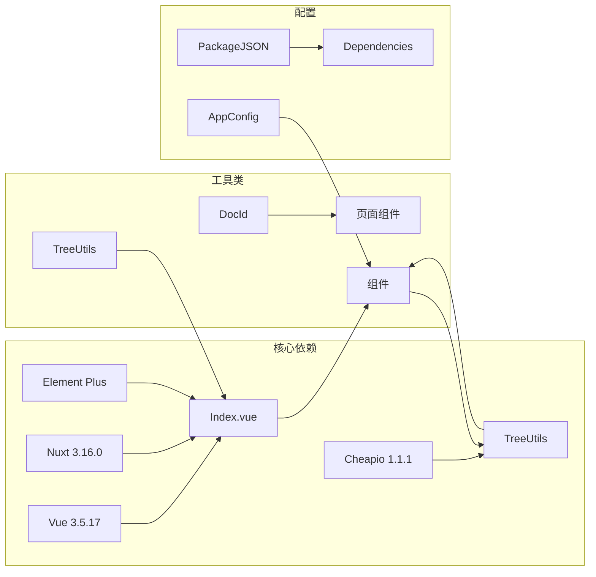

# 大纲系统

<cite>
**本文档引用的文件**
- [apps/app/components/static/content/right/Index.vue](file://apps/app/components/static/content/right/Index.vue)
- [apps/app/components/static/content/right/Outline.vue](file://apps/app/components/static/content/right/Outline.vue)
- [apps/app/components/static/content/right/OutlineItem.vue](file://apps/app/components/static/content/right/OutlineItem.vue)
- [apps/app/components/static/content/Index.vue](file://apps/app/components/static/content/Index.vue)
- [apps/app/components/static/DetailPage.vue](file://apps/app/components/static/DetailPage.vue)
- [apps/app/pages/static/[id].vue](file://apps/app/pages/static/[id].vue)
- [apps/app/composables/useDocId.ts](file://apps/app/composables/useDocId.ts)
- [apps/app/utils/TreeUtils.ts](file://apps/app/utils/TreeUtils.ts)
- [apps/app/app.config.ts](file://apps/app/app.config.ts)
- [apps/app/package.json](file://apps/app/package.json)
</cite>

## 更新摘要
**变更内容**
- 大纲系统从 flex 布局转换为固定定位策略，采用 viewport 相对定位
- 改进视口处理和视觉展示，引入新的初始化跟踪机制
- 精细化宽度管理，支持 200-500px 的精确调整范围
- 视觉增强：圆角、阴影、自定义滚动条等现代化设计
- 优化滚动行为和用户交互体验

## 目录
1. [简介](#简介)
2. [项目结构](#项目结构)
3. [核心组件](#核心组件)
4. [架构概览](#架构概览)
5. [详细组件分析](#详细组件分析)
6. [布局系统优化](#布局系统优化)
7. [滚动行为增强](#滚动行为增强)
8. [依赖关系分析](#依赖关系分析)
9. [性能考虑](#性能考虑)
10. [故障排除指南](#故障排除指南)
11. [结论](#结论)

## 简介

大纲系统是 Siyuan 笔记博客插件中的核心功能模块，负责为静态文章页面提供交互式的大纲导航。该系统能够自动生成文档的层次结构，提供智能的滚动同步、可定制的显示范围和灵活的用户交互体验。

**更新** 系统已升级为基于固定定位策略的完整解决方案，采用 viewport 相对定位，提供更流畅的用户体验和更好的性能表现。

系统主要特点包括：
- 自动生成文档大纲结构
- 实时滚动同步和激活状态管理
- 可调整的大纲宽度和固定显示功能
- 支持多级标题的层级展示
- 响应式设计和主题适配
- **新增**：固定定位策略和 viewport 定位
- **新增**：精细化宽度管理和初始化跟踪
- **新增**：视觉增强（圆角、阴影、自定义滚动条）

## 项目结构

大纲系统位于应用的静态内容组件目录中，采用分层架构设计，现已升级为基于固定定位策略的完整解决方案：

**图表来源**
- [apps/app/components/static/content/right/Index.vue:1-533](file://apps/app/components/static/content/right/Index.vue#L1-L533)
- [apps/app/components/static/content/right/Outline.vue:1-156](file://apps/app/components/static/content/right/Outline.vue#L1-L156)
- [apps/app/components/static/content/right/OutlineItem.vue:1-275](file://apps/app/components/static/content/right/OutlineItem.vue#L1-L275)
- [apps/app/components/static/content/Index.vue:1-51](file://apps/app/components/static/content/Index.vue#L1-L51)

**章节来源**
- [apps/app/components/static/content/right/Index.vue:1-533](file://apps/app/components/static/content/right/Index.vue#L1-L533)
- [apps/app/components/static/content/right/Outline.vue:1-156](file://apps/app/components/static/content/right/Outline.vue#L1-L156)
- [apps/app/components/static/content/right/OutlineItem.vue:1-275](file://apps/app/components/static/content/right/OutlineItem.vue#L1-L275)
- [apps/app/components/static/content/Index.vue:1-51](file://apps/app/components/static/content/Index.vue#L1-L51)

## 核心组件

大纲系统由四个核心组件协同工作，其中右侧大纲容器已升级为基于固定定位策略的完整解决方案：

### 1. 大纲主容器 (Index.vue) - **已升级**
负责整个大纲系统的协调和状态管理，现采用固定定位策略和 viewport 定位，包括滚动监听、激活状态跟踪和用户交互控制。

### 2. 大纲容器 (Outline.vue)
提供大纲的整体布局和样式，包含独立滚动区域和自动滚动功能。

### 3. 大纲项组件 (OutlineItem.vue)
处理单个大纲项的渲染、层级计算和交互逻辑。

### 4. 主布局容器 (content/Index.vue) - **新增**
提供 flex 布局的基础结构，确保大纲、正文和侧边栏的正确排列。

**章节来源**
- [apps/app/components/static/content/right/Index.vue:1-533](file://apps/app/components/static/content/right/Index.vue#L1-L533)
- [apps/app/components/static/content/right/Outline.vue:1-156](file://apps/app/components/static/content/right/Outline.vue#L1-L156)
- [apps/app/components/static/content/right/OutlineItem.vue:1-275](file://apps/app/components/static/content/right/OutlineItem.vue#L1-L275)
- [apps/app/components/static/content/Index.vue:1-51](file://apps/app/components/static/content/Index.vue#L1-L51)

## 架构概览

大纲系统采用组件化的架构设计，现已升级为基于固定定位策略的完整解决方案：

**图表来源**
- [apps/app/components/static/content/right/Index.vue:155-161](file://apps/app/components/static/content/right/Index.vue#L155-L161)
- [apps/app/components/static/content/right/OutlineItem.vue:155-161](file://apps/app/components/static/content/right/OutlineItem.vue#L155-L161)

系统的核心流程包括：
1. **初始化阶段**：加载大纲数据和配置，建立固定定位
2. **渲染阶段**：构建大纲树形结构，应用 viewport 定位
3. **交互阶段**：处理用户操作和状态更新
4. **同步阶段**：维护滚动位置和激活状态

## 详细组件分析

### 大纲主容器 (Index.vue) - **已全面升级**

#### 固定定位策略
组件现在采用完整的固定定位策略，提供更高效的布局和更好的性能：

**图表来源**
- [apps/app/components/static/content/right/Index.vue:10-227](file://apps/app/components/static/content/right/Index.vue#L10-L227)

#### 初始化跟踪机制
新增的初始化跟踪机制确保更好的用户体验：

- **isInitialized 状态**：标记是否已完成初始加载
- **延迟初始化**：100ms 延迟避免初始过渡动画
- **状态同步**：确保大纲展开/收起的平滑过渡

#### 精细化宽度管理
实现了精确的宽度控制机制：

- **宽度范围**：200-500px 的有效调整范围
- **动态宽度控制**：根据大纲展开/收起状态实时调整
- **本地存储**：持久化用户的宽度偏好设置
- **拖拽时禁用过渡**：避免拖拽过程中的动画干扰

#### 固定定位实现
系统采用固定定位策略而非内容流定位：

- **固定定位**：`.outline-container` 使用 `position: fixed` 确保不随正文滚动
- **视窗高度**：`height: calc(100vh - 120px)` 占满视窗高度
- **独立 z-index**：`z-index: 10` 确保大纲始终在最前面显示
- **圆角设计**：顶部和底部圆角提升视觉质感

#### 用户交互功能增强
- **拖拽调整宽度**：支持鼠标拖拽调整大纲宽度
- **固定显示**：支持固定显示大纲，避免频繁展开/收起
- **悬停展开**：鼠标悬停时自动展开大纲
- **本地存储**：持久化用户的偏好设置

**章节来源**
- [apps/app/components/static/content/right/Index.vue:1-533](file://apps/app/components/static/content/right/Index.vue#L1-L533)

### 大纲容器 (Outline.vue)

#### 独立滚动容器
容器现在提供完全独立的滚动环境：

**图表来源**
- [apps/app/components/static/content/right/Outline.vue:35-48](file://apps/app/components/static/content/right/Outline.vue#L35-L48)

#### 自动滚动功能优化
实现了智能的滚动定位功能：

- **激活项定位**：自动滚动到当前激活的大纲项
- **居中显示**：确保激活项在视窗中央位置
- **平滑滚动**：提供流畅的滚动体验
- **防滚动传播**：使用 `overscroll-behavior: contain` 防止滚动传播到父元素

**章节来源**
- [apps/app/components/static/content/right/Outline.vue:1-156](file://apps/app/components/static/content/right/Outline.vue#L1-L156)

### 大纲项组件 (OutlineItem.vue)

#### 层级计算算法
组件实现了复杂的层级计算逻辑：

**图表来源**
- [apps/app/components/static/content/right/OutlineItem.vue:40-48](file://apps/app/components/static/content/right/OutlineItem.vue#L40-L48)

#### 激活状态管理
实现了多层次的激活状态检测：

**图表来源**
- [apps/app/components/static/content/right/OutlineItem.vue:104-153](file://apps/app/components/static/content/right/OutlineItem.vue#L104-L153)

#### 文本处理机制
提供了完整的文本清理和格式化功能：

- **HTML 实体解码**：处理 `&nbsp;`, `&amp;`, `&lt;` 等实体
- **特殊字符过滤**：移除冒号、逗号等标点符号
- **HTML 标签剥离**：提取纯文本内容
- **空白字符标准化**：统一处理换行和空格

**章节来源**
- [apps/app/components/static/content/right/OutlineItem.vue:1-275](file://apps/app/components/static/content/right/OutlineItem.vue#L1-L275)

### 主布局容器 (content/Index.vue) - **新增**

#### flex 布局系统
提供基础的 flex 布局结构，确保各组件正确排列：

**图表来源**
- [apps/app/components/static/content/Index.vue:16-28](file://apps/app/components/static/content/Index.vue#L16-L28)

#### 布局特性
- **flex-direction: row**：水平布局
- **align-items: flex-start**：顶部对齐
- **min-height: calc(100vh - 40px)**：占满视窗高度
- **flex 1**：正文区域占据剩余空间

**章节来源**
- [apps/app/components/static/content/Index.vue:1-51](file://apps/app/components/static/content/Index.vue#L1-L51)

### 页面集成

#### 动态页面路由
系统支持动态页面路由，根据共享类型自动选择合适的页面组件：

**图表来源**
- [apps/app/pages/static/[id].vue:10-L26](file://apps/app/pages/static/[id].vue#L10-L26)

#### 文档 ID 处理
提供了统一的文档 ID 获取机制：

- **文件扩展名处理**：自动移除 `.html` 和 `.htm` 扩展名
- **参数解析**：从路由参数中提取文档 ID
- **格式标准化**：确保返回标准的文档 ID 格式

**章节来源**
- [apps/app/pages/static/[id].vue:1-L27](file://apps/app/pages/static/[id].vue#L1-L27)
- [apps/app/composables/useDocId.ts:1-29](file://apps/app/composables/useDocId.ts#L1-L29)

## 布局系统优化

### 固定定位架构

**更新** 大纲系统已完全迁移到基于固定定位策略的架构：

#### 固定定位实现
- **outline-container**：使用 `position: fixed` 确保不随正文滚动
- **100vh 高度**：占满整个视窗高度
- **独立 z-index**：`z-index: 10` 确保大纲始终在最前面显示
- **圆角设计**：顶部和底部圆角提升视觉质感

#### 视口相对定位
- **固定定位**：确保大纲容器不随正文滚动
- **视窗高度**：`calc(100vh - 120px)` 占满视窗高度
- **独立滚动**：大纲容器内部独立滚动，不影响正文

#### 初始化跟踪机制
- **isInitialized 状态**：标记是否已完成初始加载
- **延迟初始化**：100ms 延迟避免初始过渡动画
- **状态同步**：确保大纲展开/收起的平滑过渡

#### 精细化宽度管理
- **startResize**：开始拖拽调整宽度
- **范围限制**：200-500px 的有效范围
- **实时预览**：拖拽时实时显示新宽度
- **自动保存**：松开鼠标时自动保存设置

**章节来源**
- [apps/app/components/static/content/right/Index.vue:230-317](file://apps/app/components/static/content/right/Index.vue#L230-L317)
- [apps/app/components/static/content/right/Index.vue:320-533](file://apps/app/components/static/content/right/Index.vue#L320-L533)

### 视觉增强优化

#### 圆角设计
- **顶部圆角**：`border-top-left-radius: 8px`
- **底部圆角**：`border-bottom-left-radius: 8px`
- **更柔和的边框**：`rgba(0, 0, 0, 0.06)`

#### 阴影效果
- **柔和阴影**：`box-shadow: -2px 2px 8px rgba(0, 0, 0, 0.06)`
- **更淡的阴影值**：相比之前版本更加柔和
- **适度的投影**：提升视觉层次感

#### 自定义滚动条
- **细滚动条**：宽度仅为 3px
- **透明轨道**：滚动条轨道透明
- **淡色主题**：滚动条颜色根据主题调整
- **悬停效果**：悬停时增加透明度

**章节来源**
- [apps/app/components/static/content/right/Index.vue:94-123](file://apps/app/components/static/content/right/Index.vue#L94-L123)
- [apps/app/components/static/content/right/Index.vue:355-358](file://apps/app/components/static/content/right/Index.vue#L355-L358)

## 滚动行为增强

### 独立滚动容器

**更新** 大纲容器现在提供完全独立的滚动环境：

#### 滚动优化特性
- **独立滚动**：大纲容器内部独立滚动
- **防滚动传播**：使用 `overscroll-behavior: contain`
- **iOS 优化**：启用 `-webkit-overflow-scrolling: touch`
- **平滑滚动**：全局启用 `scroll-behavior: smooth`

#### 自动滚动定位
- **激活项居中**：自动滚动到激活项并居中显示
- **视口偏移**：考虑大纲位置的 80px 偏移量
- **距离计算**：基于到视口顶部的距离找到最近节点

#### 滚动条自定义
- **细滚动条**：宽度仅为 3px
- **透明轨道**：滚动条轨道透明
- **淡色主题**：滚动条颜色根据主题调整
- **悬停效果**：悬停时增加透明度

**章节来源**
- [apps/app/components/static/content/right/Outline.vue:55-90](file://apps/app/components/static/content/right/Outline.vue#L55-L90)
- [apps/app/components/static/content/right/Outline.vue:122-152](file://apps/app/components/static/content/right/Outline.vue#L122-L152)
- [apps/app/components/static/content/right/Index.vue:172-202](file://apps/app/components/static/content/right/Index.vue#L172-L202)

### 激活状态管理

#### 滚动同步机制

**图表来源**
- [apps/app/components/static/content/right/Index.vue:172-202](file://apps/app/components/static/content/right/Index.vue#L172-L202)

#### 文本清理一致性
- **cleanNodeText**：与 OutlineItem.vue 的 adjustItemName 保持一致
- **HTML 实体处理**：统一处理各种 HTML 实体
- **特殊字符过滤**：移除标点符号和特殊字符
- **正则表达式清理**：使用正则表达式确保一致性

**章节来源**
- [apps/app/components/static/content/right/Index.vue:152-170](file://apps/app/components/static/content/right/Index.vue#L152-L170)

## 依赖关系分析

大纲系统依赖于多个核心库和工具：

**图表来源**
- [apps/app/package.json:12-32](file://apps/app/package.json#L12-L32)
- [apps/app/app.config.ts:28-72](file://apps/app/app.config.ts#L28-L72)

### 外部依赖

系统使用了以下关键外部依赖：

- **Vue 生态系统**：Vue 3.5.17 + Nuxt 3.16.0 提供基础框架
- **UI 组件库**：Element Plus 2.x 提供现代化的用户界面
- **DOM 操作**：Cheerio 1.1.1 用于服务器端的 DOM 解析
- **工具库**：zhi-common 提供通用的工具函数

**章节来源**
- [apps/app/package.json:1-41](file://apps/app/package.json#L1-L41)
- [apps/app/app.config.ts:1-92](file://apps/app/app.config.ts#L1-L92)

## 性能考虑

### 优化策略

**更新** 新的固定定位系统带来了多项性能优化：

1. **固定定位优化**：使用 CSS fixed 定位替代 JavaScript 布局计算
2. **viewport 定位**：固定定位避免布局重排
3. **初始化跟踪**：避免初始过渡动画的性能开销
4. **拖拽时禁用过渡**：避免拖拽过程中的动画开销
5. **独立滚动容器**：减少滚动事件对整个页面的影响
6. **自定义滚动条**：使用 CSS 滚动条替代复杂组件

### 内存优化

- **组件卸载**：在组件销毁时清理所有事件监听器
- **状态清理**：避免在组件生命周期外保留状态引用
- **资源释放**：及时释放 DOM 引用和定时器
- **本地存储优化**：只在必要时访问 localStorage

### 布局性能

- **固定定位**：现代浏览器优化的定位算法
- **fixed 定位**：避免文档流中的重排
- **圆角设计**：硬件加速的 CSS 属性
- **阴影效果**：适度的 GPU 加速

**章节来源**
- [apps/app/components/static/content/right/Index.vue:207-227](file://apps/app/components/static/content/right/Index.vue#L207-L227)

## 故障排除指南

### 常见问题

#### 大纲不显示
1. **检查数据源**：确认 `outlineData` 是否正确传入
2. **验证配置**：检查 `outlineLevel` 设置是否合理
3. **查看控制台**：检查是否有 JavaScript 错误
4. **固定定位检查**：确认大纲容器使用正确的固定定位

#### 滚动不同步
1. **检查选择器**：确认 `[data-subtype^="h"]` 选择器是否正确
2. **验证元素**：确保文档中存在有效的标题元素
3. **调试日志**：查看滚动监听器的日志输出
4. **初始化状态**：确认 `isInitialized` 状态是否正确设置

#### 激活状态异常
1. **文本清理**：确认 `cleanNodeText` 和 `adjustItemName` 方法的一致性
2. **编码问题**：检查特殊字符的处理是否正确
3. **边界情况**：验证空文本和特殊格式的处理
4. **固定定位**：确认大纲容器使用正确的固定定位

#### 布局问题
1. **固定定位**：检查父容器的定位属性设置
2. **视口高度**：确认 `calc(100vh - 120px)` 计算是否正确
3. **圆角设计**：验证圆角样式的正确应用
4. **阴影效果**：检查阴影样式的兼容性

**章节来源**
- [apps/app/components/static/content/right/Index.vue:172-219](file://apps/app/components/static/content/right/Index.vue#L172-L219)
- [apps/app/components/static/content/right/OutlineItem.vue:104-153](file://apps/app/components/static/content/right/OutlineItem.vue#L104-L153)

## 结论

大纲系统作为 Siyuan 笔记博客插件的核心功能，经过重大升级后展现了更加优秀的架构设计和用户体验。系统通过采用固定定位策略和 viewport 定位，实现了高度的模块化、可维护性和性能优化。

### 主要优势

1. **架构升级**：从简单容器升级为基于固定定位策略的完整系统
2. **布局优化**：采用固定定位确保稳定显示和更好的性能表现
3. **用户体验**：初始化跟踪机制避免布局抖动
4. **交互增强**：精细化宽度管理和拖拽调整功能
5. **视觉增强**：圆角、阴影、自定义滚动条等现代化设计
6. **性能提升**：固定定位避免布局重排和重绘

### 技术亮点

- **固定定位策略**：现代化的布局解决方案
- **viewport 定位**：固定定位确保稳定显示
- **初始化跟踪**：智能的加载状态管理
- **精细化宽度管理**：精确的用户偏好控制
- **视觉增强**：圆角、阴影、自定义滚动条
- **拖拽调整系统**：直观的用户交互

### 未来展望

系统将继续演进，计划包括：
- 虚拟滚动支持大型文档
- 更多主题适配选项
- 移动端优化改进
- 性能监控和分析

该系统为用户提供了专业级的文档导航体验，是 Siyuan 笔记本生态系统的重要组成部分，代表了现代前端开发的最佳实践。