# 大纲系统

<cite>
**本文档引用的文件**
- [apps/app/components/static/content/right/Index.vue](file://apps/app/components/static/content/right/Index.vue)
- [apps/app/components/static/content/right/Outline.vue](file://apps/app/components/static/content/right/Outline.vue)
- [apps/app/components/static/content/right/OutlineItem.vue](file://apps/app/components/static/content/right/OutlineItem.vue)
- [apps/app/components/static/content/left/Index.vue](file://apps/app/components/static/content/left/Index.vue)
- [apps/app/components/static/content/left/MenuItem.vue](file://apps/app/components/static/content/left/MenuItem.vue)
- [apps/app/components/static/content/left/Sidebar.vue](file://apps/app/components/static/content/left/Sidebar.vue)
- [apps/app/components/static/content/left/SidebarMenu.vue](file://apps/app/components/static/content/left/SidebarMenu.vue)
- [apps/app/components/static/content/left/SidebarButton.vue](file://apps/app/components/static/content/left/SidebarButton.vue)
- [apps/app/components/static/content/Index.vue](file://apps/app/components/static/content/Index.vue)
- [apps/app/pages/static/[id].vue](file://apps/app/pages/static/[id].vue)
- [apps/app/composables/useDocId.ts](file://apps/app/composables/useDocId.ts)
- [apps/app/utils/TreeUtils.ts](file://apps/app/utils/TreeUtils.ts)
- [apps/app/app.config.ts](file://apps/app/app.config.ts)
</cite>

## 更新摘要
**变更内容**
- 大纲系统从传统的Tab界面重构为垂直按钮组设计
- 新增模块化功能配置系统，支持大纲和AI助手的动态切换
- 实现了完整的功能模块配置接口和状态管理
- 改进了宽度管理和用户体验，新增垂直按钮组
- 优化了点击保护机制，移除了悬停自动展开功能
- 完善了文档树导航的查询参数传递和状态同步机制

## 目录
1. [简介](#简介)
2. [项目结构](#项目结构)
3. [核心组件](#核心组件)
4. [架构概览](#架构概览)
5. [详细组件分析](#详细组件分析)
6. [文档树导航集成](#文档树导航集成)
7. [多模块系统](#多模块系统)
8. [布局系统优化](#布局系统优化)
9. [滚动行为增强](#滚动行为增强)
10. [依赖关系分析](#依赖关系分析)
11. [性能考虑](#性能考虑)
12. [故障排除指南](#故障排除指南)
13. [结论](#结论)

## 简介

大纲系统是 Siyuan 笔记博客插件中的核心功能模块，负责为静态文章页面提供交互式的大纲导航。该系统已经从传统的Tab界面重构为垂直按钮组设计，新增了模块化功能配置，能够自动生成文档的层次结构，提供智能的滚动同步、可定制的显示范围和灵活的用户交互体验。

**更新** 系统现已升级为基于固定定位策略的多模块系统，集成了垂直按钮组设计，支持大纲和AI助手的动态切换。新增了完整的功能模块配置系统，允许开发者轻松扩展新的功能模块。

系统主要特点包括：
- 自动生成文档大纲结构
- 实时滚动同步和激活状态管理
- 可调整的大纲宽度和固定显示功能
- 支持多级标题的层级展示
- 响应式设计和主题适配
- **新增**：垂直按钮组设计（替代传统Tab界面）
- **新增**：模块化功能配置系统
- **新增**：自动展开逻辑和优先级控制
- **新增**：点击保护机制（移除悬停展开）
- **新增**：完整的功能模块配置系统

## 项目结构

大纲系统位于应用的静态内容组件目录中，采用分层架构设计，现已升级为完整的多模块系统：

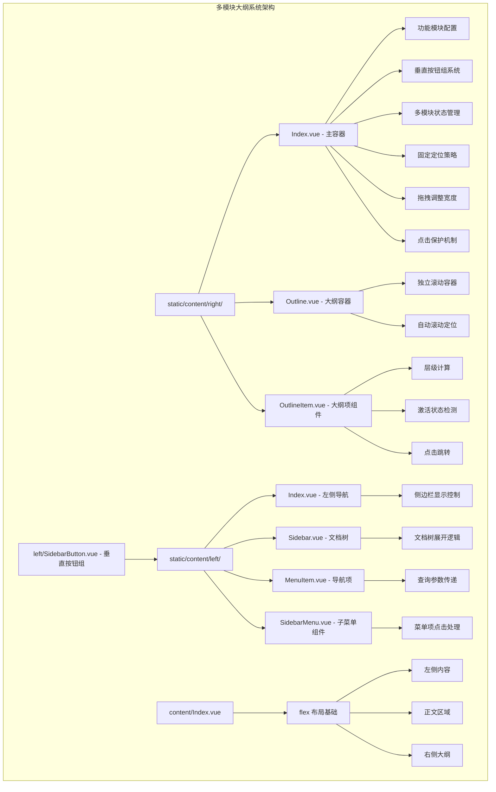

**图表来源**
- [apps/app/components/static/content/right/Index.vue:18-46](file://apps/app/components/static/content/right/Index.vue#L18-L46)
- [apps/app/components/static/content/right/Outline.vue:10-30](file://apps/app/components/static/content/right/Outline.vue#L10-L30)
- [apps/app/components/static/content/right/OutlineItem.vue:10-38](file://apps/app/components/static/content/right/OutlineItem.vue#L10-L38)
- [apps/app/components/static/content/left/Index.vue:10-24](file://apps/app/components/static/content/left/Index.vue#L10-L24)
- [apps/app/components/static/content/left/Sidebar.vue:10-23](file://apps/app/components/static/content/left/Sidebar.vue#L10-L23)
- [apps/app/components/static/content/left/MenuItem.vue:21-33](file://apps/app/components/static/content/left/MenuItem.vue#L21-L33)
- [apps/app/components/static/content/left/SidebarMenu.vue:10-25](file://apps/app/components/static/content/left/SidebarMenu.vue#L10-L25)
- [apps/app/components/static/content/left/SidebarButton.vue:10-22](file://apps/app/components/static/content/left/SidebarButton.vue#L10-L22)
- [apps/app/components/static/content/Index.vue:10-23](file://apps/app/components/static/content/Index.vue#L10-L23)

**章节来源**
- [apps/app/components/static/content/right/Index.vue:18-46](file://apps/app/components/static/content/right/Index.vue#L18-L46)
- [apps/app/components/static/content/right/Outline.vue:10-30](file://apps/app/components/static/content/right/Outline.vue#L10-L30)
- [apps/app/components/static/content/right/OutlineItem.vue:10-38](file://apps/app/components/static/content/right/OutlineItem.vue#L10-L38)
- [apps/app/components/static/content/left/Index.vue:10-24](file://apps/app/components/static/content/left/Index.vue#L10-L24)
- [apps/app/components/static/content/left/Sidebar.vue:10-23](file://apps/app/components/static/content/left/Sidebar.vue#L10-L23)
- [apps/app/components/static/content/left/MenuItem.vue:21-33](file://apps/app/components/static/content/left/MenuItem.vue#L21-L33)
- [apps/app/components/static/content/left/SidebarMenu.vue:10-25](file://apps/app/components/static/content/left/SidebarMenu.vue#L10-L25)
- [apps/app/components/static/content/left/SidebarButton.vue:10-22](file://apps/app/components/static/content/left/SidebarButton.vue#L10-L22)
- [apps/app/components/static/content/Index.vue:10-23](file://apps/app/components/static/content/Index.vue#L10-L23)

## 核心组件

大纲系统由八个核心组件协同工作，现已升级为完整的多模块系统：

### 1. 多模块主容器 (Index.vue) - **已全面升级**
负责整个大纲系统的协调和状态管理，现采用固定定位策略和多模块架构，包括滚动监听、激活状态跟踪、用户交互控制和多模块状态管理。

### 2. 大纲容器 (Outline.vue)
提供大纲的整体布局和样式，包含独立滚动区域和自动滚动功能。

### 3. 大纲项组件 (OutlineItem.vue)
处理单个大纲项的渲染、层级计算和交互逻辑。

### 4. 左侧导航容器 (left/Index.vue) - **新增**
控制左侧文档树的显示和隐藏，支持文档树导航联动。

### 5. 文档树组件 (left/Sidebar.vue) - **新增**
提供文档树的渲染和交互，包含展开逻辑和父节点追踪。

### 6. 导航项组件 (left/MenuItem.vue) - **新增**
处理单个导航项的点击事件，支持查询参数传递和密码保护。

### 7. 子菜单组件 (left/SidebarMenu.vue) - **新增**
处理菜单项的嵌套结构和点击事件转发。

### 8. 垂直按钮组组件 (left/SidebarButton.vue) - **新增**
提供垂直排列的按钮组设计，替代传统Tab界面，支持快速功能切换。

### 9. 主布局容器 (content/Index.vue) - **新增**
提供 flex 布局的基础结构，确保大纲、正文和侧边栏的正确排列。

**章节来源**
- [apps/app/components/static/content/right/Index.vue:18-46](file://apps/app/components/static/content/right/Index.vue#L18-L46)
- [apps/app/components/static/content/right/Outline.vue:10-30](file://apps/app/components/static/content/right/Outline.vue#L10-L30)
- [apps/app/components/static/content/right/OutlineItem.vue:10-38](file://apps/app/components/static/content/right/OutlineItem.vue#L10-L38)
- [apps/app/components/static/content/left/Index.vue:10-24](file://apps/app/components/static/content/left/Index.vue#L10-L24)
- [apps/app/components/static/content/left/Sidebar.vue:10-23](file://apps/app/components/static/content/left/Sidebar.vue#L10-L23)
- [apps/app/components/static/content/left/MenuItem.vue:21-33](file://apps/app/components/static/content/left/MenuItem.vue#L21-L33)
- [apps/app/components/static/content/left/SidebarMenu.vue:10-25](file://apps/app/components/static/content/left/SidebarMenu.vue#L10-L25)
- [apps/app/components/static/content/left/SidebarButton.vue:10-22](file://apps/app/components/static/content/left/SidebarButton.vue#L10-L22)
- [apps/app/components/static/content/Index.vue:10-23](file://apps/app/components/static/content/Index.vue#L10-L23)

## 架构概览

大纲系统采用多模块组件化架构设计，现已升级为完整的多模块系统：

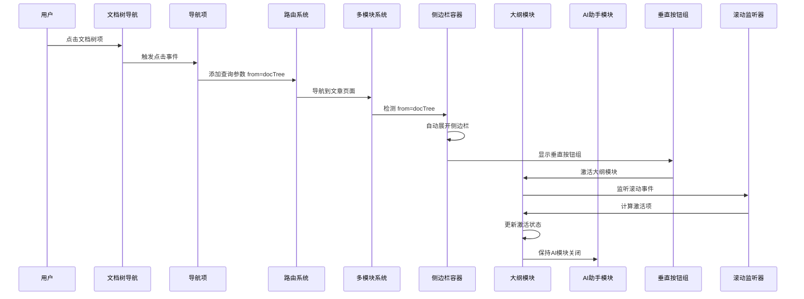

**图表来源**
- [apps/app/components/static/content/left/MenuItem.vue:114-121](file://apps/app/components/static/content/left/MenuItem.vue#L114-L121)
- [apps/app/components/static/content/right/Index.vue:337-342](file://apps/app/components/static/content/right/Index.vue#L337-L342)
- [apps/app/components/static/content/right/OutlineItem.vue:155-161](file://apps/app/components/static/content/right/OutlineItem.vue#L155-L161)

系统的核心流程包括：
1. **初始化阶段**：加载大纲数据和配置，建立固定定位
2. **导航阶段**：文档树点击事件触发，添加查询参数
3. **检测阶段**：页面加载时检测URL查询参数
4. **展开阶段**：根据条件自动展开侧边栏
5. **模块激活阶段**：激活相应功能模块
6. **渲染阶段**：构建大纲树形结构，应用固定定位
7. **交互阶段**：处理用户操作和状态更新
8. **同步阶段**：维护滚动位置和激活状态

## 详细组件分析

### 多模块主容器 (Index.vue) - **已全面升级**

#### 多模块系统架构
组件现在集成了完整的多模块系统：

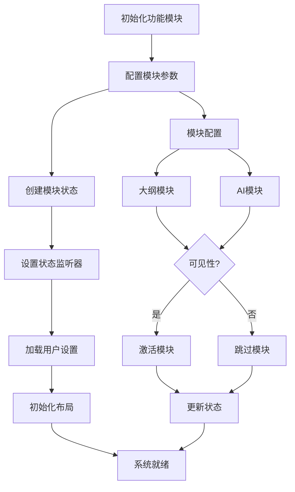

**图表来源**
- [apps/app/components/static/content/right/Index.vue:18-46](file://apps/app/components/static/content/right/Index.vue#L18-L46)
- [apps/app/components/static/content/right/Index.vue:276-281](file://apps/app/components/static/content/right/Index.vue#L276-L281)

#### 垂直按钮组设计
系统采用了全新的垂直按钮组设计，替代了传统的Tab界面：

- **垂直排列**：按钮组采用垂直方向排列，节省横向空间
- **统一样式**：所有按钮使用统一的样式系统，保持视觉一致性
- **动态渲染**：根据模块配置动态渲染按钮，便于扩展新功能
- **激活状态**：支持模块激活状态的视觉反馈
- **收起按钮**：仅在侧边栏展开时显示收起按钮

#### 自动展开逻辑
实现了智能的自动展开机制，具有明确的优先级：

- **优先级1：图钉固定** - 如果用户已固定侧边栏，保持固定状态
- **优先级2：URL参数触发** - 如果从文档树导航而来，自动展开侧边栏
- **优先级3：默认收起** - 其他情况下保持收起状态

#### 多模块状态管理
新增了完整的模块状态管理系统：

- **modules**：功能模块配置数组
- **activeModuleId**：当前激活的模块ID
- **visibleModules**：计算属性，过滤可见模块
- **activateModule**：激活指定模块的方法
- **模块按钮样式**：统一的模块按钮样式系统

#### 点击保护机制
移除了悬停自动展开功能，实现了更稳定的点击保护：

- **toggleSidebarWithProtection**：带保护的侧边栏切换
- **移除悬停展开**：onHover方法已禁用悬停自动展开
- **防止误触**：确保用户操作的稳定性

#### 固定定位实现
系统采用固定定位策略而非内容流定位：

- **outline-container**：使用 `position: fixed` 确保不随正文滚动
- **视窗高度**：`height: calc(100vh - 120px)` 占满视窗高度
- **独立 z-index**：`z-index: 100` 确保侧边栏始终在最前面显示
- **圆角设计**：顶部和底部圆角提升视觉质感

#### 用户交互功能增强
- **拖拽调整宽度**：支持鼠标拖拽调整大纲宽度
- **固定显示**：支持固定显示侧边栏，避免频繁展开/收起
- **标签页切换**：支持大纲和AI助手的标签页切换
- **本地存储**：持久化用户的偏好设置

**章节来源**
- [apps/app/components/static/content/right/Index.vue:18-46](file://apps/app/components/static/content/right/Index.vue#L18-L46)
- [apps/app/components/static/content/right/Index.vue:276-331](file://apps/app/components/static/content/right/Index.vue#L276-L331)
- [apps/app/components/static/content/right/Index.vue:337-354](file://apps/app/components/static/content/right/Index.vue#L337-L354)

### 大纲容器 (Outline.vue)

#### 独立滚动容器
容器现在提供完全独立的滚动环境：


**图表来源**
- [apps/app/components/static/content/right/Outline.vue:35-48](file://apps/app/components/static/content/right/Outline.vue#L35-L48)

#### 自动滚动功能优化
实现了智能的滚动定位功能：

- **激活项定位**：自动滚动到当前激活的大纲项
- **居中显示**：确保激活项在视窗中央位置
- **平滑滚动**：提供流畅的滚动体验
- **防滚动传播**：使用 `overscroll-behavior: contain` 防止滚动传播到父元素

**章节来源**
- [apps/app/components/static/content/right/Outline.vue:55-90](file://apps/app/components/static/content/right/Outline.vue#L55-L90)

### 大纲项组件 (OutlineItem.vue)

#### 层级计算算法
组件实现了复杂的层级计算逻辑：


**图表来源**
- [apps/app/components/static/content/right/OutlineItem.vue:40-48](file://apps/app/components/static/content/right/OutlineItem.vue#L40-L48)

#### 激活状态管理
实现了多层次的激活状态检测：

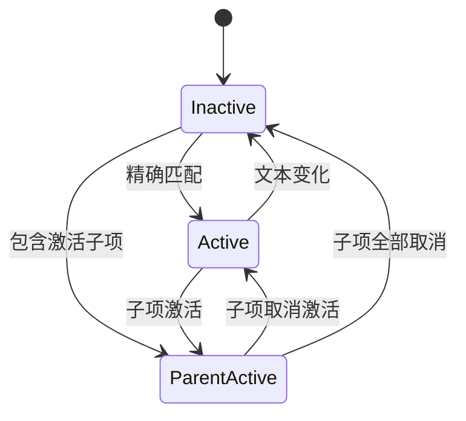

**图表来源**
- [apps/app/components/static/content/right/OutlineItem.vue:104-153](file://apps/app/components/static/content/right/OutlineItem.vue#L104-L153)

#### 文本处理机制
提供了完整的文本清理和格式化功能：

- **HTML 实体解码**：处理 `&nbsp;`, `&amp;`, `&lt;` 等实体
- **特殊字符过滤**：移除冒号、逗号等标点符号
- **HTML 标签剥离**：提取纯文本内容
- **空白字符标准化**：统一处理换行和空格

**章节来源**
- [apps/app/components/static/content/right/OutlineItem.vue:50-102](file://apps/app/components/static/content/right/OutlineItem.vue#L50-L102)

### 左侧导航容器 (left/Index.vue) - **新增**

#### 侧边栏显示控制
提供智能的侧边栏显示控制逻辑：

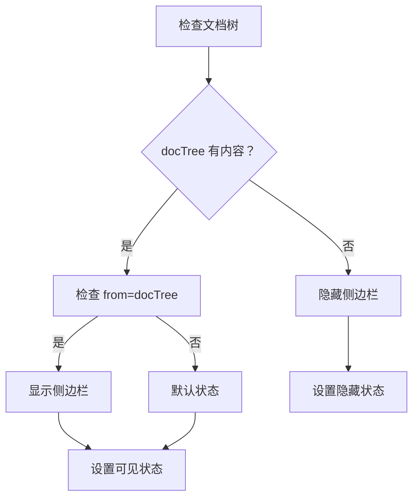

**图表来源**
- [apps/app/components/static/content/left/Index.vue:21-29](file://apps/app/components/static/content/left/Index.vue#L21-L29)

#### 侧边栏状态管理
- **服务端初始化**：在服务端确定初始状态，避免客户端闪烁
- **状态同步**：确保侧边栏状态与用户操作一致
- **标题栏适配**：防止侧边栏按钮遮挡标题栏输入框

**章节来源**
- [apps/app/components/static/content/left/Index.vue:17-49](file://apps/app/components/static/content/left/Index.vue#L17-L49)

### 文档树组件 (left/Sidebar.vue) - **新增**

#### 文档树展开逻辑
实现了智能的文档树展开机制：

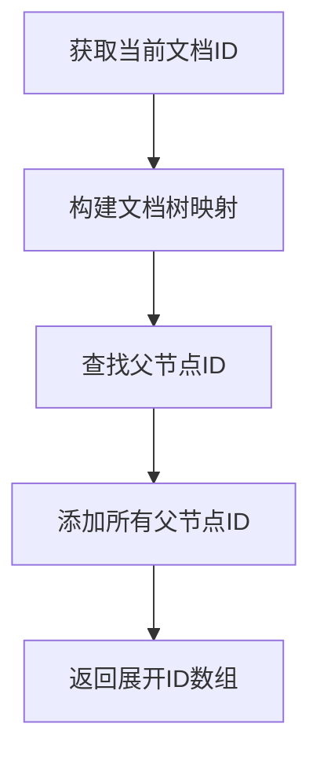

**图表来源**
- [apps/app/components/static/content/left/Sidebar.vue:126-141](file://apps/app/components/static/content/left/Sidebar.vue#L126-L141)

#### 父节点追踪机制
- **TreeUtils.addParentIds**：为每个节点添加父节点ID列表
- **expandedIds 计算**：生成展开ID数组
- **确保可见性**：保证当前文档在树中可见

#### 滚动同步机制
实现了智能的滚动同步功能：

- **激活项居中**：自动滚动到激活的菜单项并居中显示
- **重试机制**：支持多次重试确保滚动成功
- **边界检查**：防止滚动超出范围

**章节来源**
- [apps/app/components/static/content/left/Sidebar.vue:111-149](file://apps/app/components/static/content/left/Sidebar.vue#L111-L149)
- [apps/app/components/static/content/left/Sidebar.vue:24-109](file://apps/app/components/static/content/left/Sidebar.vue#L24-L109)

### 导航项组件 (left/MenuItem.vue) - **新增**

#### 查询参数传递机制
实现了完整的查询参数传递功能：

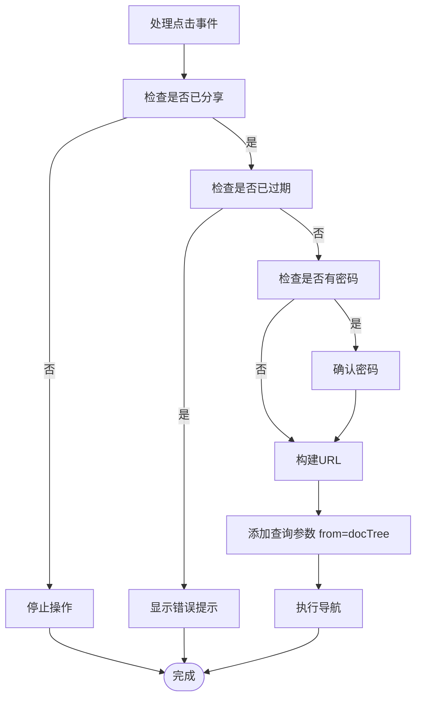

**图表来源**
- [apps/app/components/static/content/left/MenuItem.vue:81-121](file://apps/app/components/static/content/left/MenuItem.vue#L81-L121)

#### 导航安全机制
- **分享状态检查**：未分享的文档不可点击
- **过期状态检查**：已过期的文档阻止跳转
- **密码保护机制**：需要密码验证的文档进行确认
- **查询参数传递**：自动添加 `from=docTree` 查询参数

**章节来源**
- [apps/app/components/static/content/left/MenuItem.vue:77-122](file://apps/app/components/static/content/left/MenuItem.vue#L77-L122)

### 子菜单组件 (left/SidebarMenu.vue) - **新增**

#### 菜单项点击处理
实现了菜单项的点击事件处理：

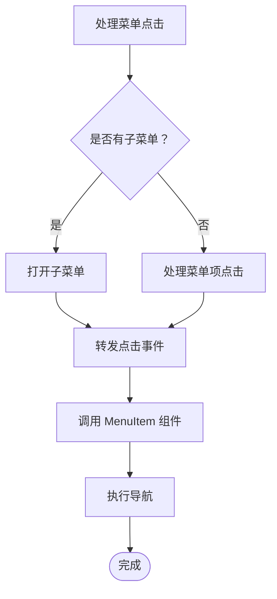

**图表来源**
- [apps/app/components/static/content/left/SidebarMenu.vue:34-39](file://apps/app/components/static/content/left/SidebarMenu.vue#L34-L39)

#### 菜单项包装器
- **fullwidth 支持**：让菜单项内容占满整个可点击区域
- **激活状态高亮**：确保当前激活的菜单项清晰可见
- **子菜单标题适配**：正确处理子菜单标题的激活状态

**章节来源**
- [apps/app/components/static/content/left/SidebarMenu.vue:34-67](file://apps/app/components/static/content/left/SidebarMenu.vue#L34-L67)

### 垂直按钮组组件 (left/SidebarButton.vue) - **新增**

#### 垂直按钮组设计
实现了全新的垂直按钮组设计：

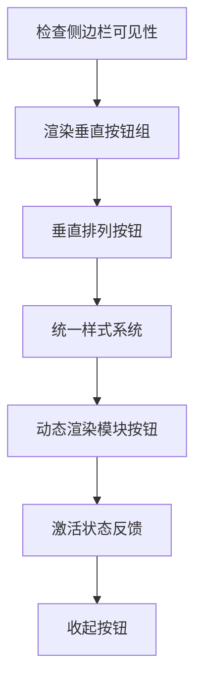

**图表来源**
- [apps/app/components/static/content/left/SidebarButton.vue:19-21](file://apps/app/components/static/content/left/SidebarButton.vue#L19-L21)

#### 按钮组特性
- **垂直排列**：按钮采用垂直方向排列，节省横向空间
- **统一样式**：所有按钮使用统一的样式系统，保持视觉一致性
- **动态渲染**：根据模块配置动态渲染按钮，便于扩展新功能
- **激活状态**：支持模块激活状态的视觉反馈
- **收起按钮**：仅在侧边栏展开时显示收起按钮

**章节来源**
- [apps/app/components/static/content/left/SidebarButton.vue:10-22](file://apps/app/components/static/content/left/SidebarButton.vue#L10-L22)

### 主布局容器 (content/Index.vue) - **新增**

#### flex 布局系统
提供基础的 flex 布局结构，确保各组件正确排列：

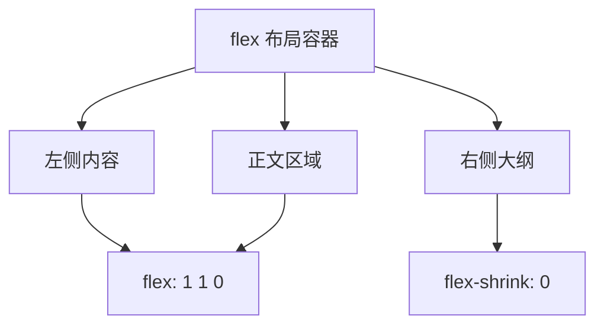

**图表来源**
- [apps/app/components/static/content/Index.vue:16-28](file://apps/app/components/static/content/Index.vue#L16-L28)

#### 布局特性
- **flex-direction: row**：水平布局
- **align-items: flex-start**：顶部对齐
- **min-height: calc(100vh - 40px)**：占满视窗高度
- **flex 1**：正文区域占据剩余空间

**章节来源**
- [apps/app/components/static/content/Index.vue:29-45](file://apps/app/components/static/content/Index.vue#L29-L45)

### 页面集成

#### 动态页面路由
系统支持动态页面路由，根据共享类型自动选择合适的页面组件：

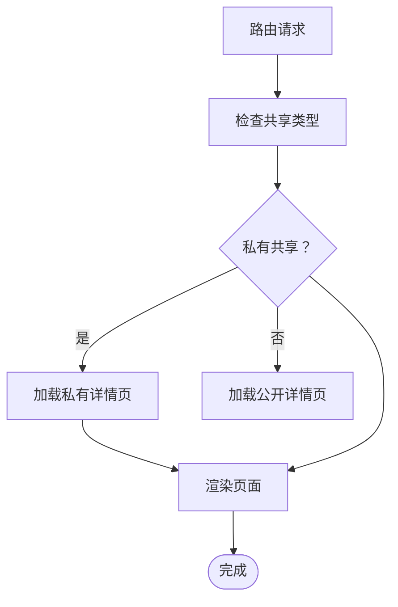

**图表来源**
- [apps/app/pages/static/[id].vue:10-L26](file://apps/app/pages/static/[id].vue#L10-L26)

#### 文档 ID 处理
提供了统一的文档 ID 获取机制：

- **文件扩展名处理**：自动移除 `.html` 和 `.htm` 扩展名
- **参数解析**：从路由参数中提取文档 ID
- **格式标准化**：确保返回标准的文档 ID 格式

**章节来源**
- [apps/app/pages/static/[id].vue:1-L27](file://apps/app/pages/static/[id].vue#L1-L27)
- [apps/app/composables/useDocId.ts:1-29](file://apps/app/composables/useDocId.ts#L1-L29)

## 文档树导航集成

### 查询参数传递机制

**更新** 系统现已完整支持从文档树导航到文章页面的功能：

#### 导航项点击处理
当用户点击文档树中的导航项时，系统会自动添加查询参数：

- **查询参数**：`from=docTree`
- **传递方式**：使用 `URL.searchParams.set()` 方法
- **导航执行**：通过 `navigateTo()` 方法进行页面跳转

#### URL查询参数检测
页面加载时会检测URL中的查询参数：

- **检测逻辑**：`route.query.from === 'docTree'`
- **状态设置**：将 `isFromDocTree` 计算属性设置为 `true`
- **影响范围**：仅影响侧边栏展开行为

#### 自动展开逻辑
基于查询参数的自动展开机制：

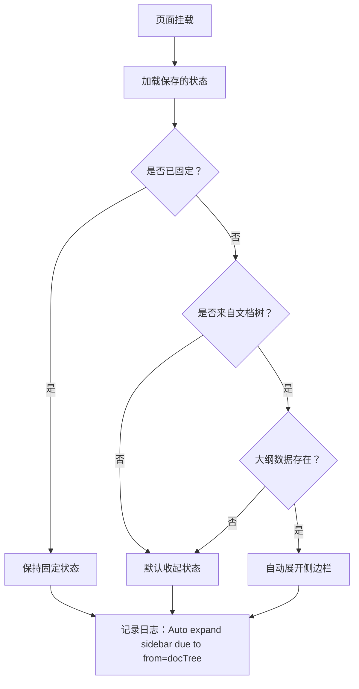

**图表来源**
- [apps/app/components/static/content/right/Index.vue:337-342](file://apps/app/components/static/content/right/Index.vue#L337-L342)

**章节来源**
- [apps/app/components/static/content/left/MenuItem.vue:114-121](file://apps/app/components/static/content/left/MenuItem.vue#L114-L121)
- [apps/app/components/static/content/right/Index.vue:50-51](file://apps/app/components/static/content/right/Index.vue#L50-L51)

### 文档树展开机制

#### 父节点追踪
系统会自动追踪当前文档的所有父节点并展开：

- **TreeUtils.addParentIds**：为每个节点添加父节点ID列表
- **expandedIds 计算**：生成展开ID数组
- **确保可见性**：保证当前文档在树中可见

#### 滚动同步机制
实现了智能的滚动同步功能：

- **激活项居中**：自动滚动到激活的菜单项并居中显示
- **重试机制**：支持多次重试确保滚动成功
- **边界检查**：防止滚动超出范围

**章节来源**
- [apps/app/components/static/content/left/Sidebar.vue:117-141](file://apps/app/components/static/content/left/Sidebar.vue#L117-L141)
- [apps/app/utils/TreeUtils.ts:10-31](file://apps/app/utils/TreeUtils.ts#L10-L31)

## 多模块系统

### 功能模块配置

**更新** 系统新增了完整的功能模块配置系统：

#### 模块配置接口
```typescript
interface SidebarModule {
  id: string
  name: string
  icon?: string
  type: 'outline' | 'ai' | 'graph'
  visible: boolean
  order: number
}
```

#### 模块状态管理
- **modules**：功能模块配置数组
- **activeModuleId**：当前激活的模块ID
- **visibleModules**：计算属性，过滤可见模块
- **模块按钮样式**：统一的模块按钮样式系统

#### 模块激活机制
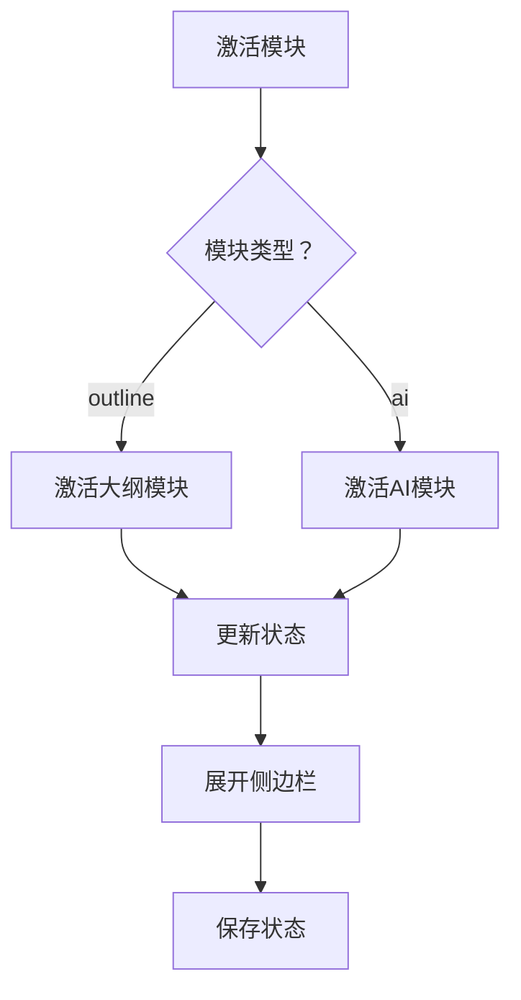

**图表来源**
- [apps/app/components/static/content/right/Index.vue:292-299](file://apps/app/components/static/content/right/Index.vue#L292-L299)

#### 垂直按钮组系统
- **动态渲染**：根据模块配置动态渲染按钮
- **统一样式**：所有模块按钮使用统一的样式系统
- **激活状态**：支持模块激活状态的视觉反馈
- **垂直排列**：按钮组采用垂直方向排列

**章节来源**
- [apps/app/components/static/content/right/Index.vue:18-46](file://apps/app/components/static/content/right/Index.vue#L18-L46)
- [apps/app/components/static/content/right/Index.vue:276-331](file://apps/app/components/static/content/right/Index.vue#L276-L331)

### 标签页切换系统

#### 标签页实现
系统实现了完整的标签页切换功能：

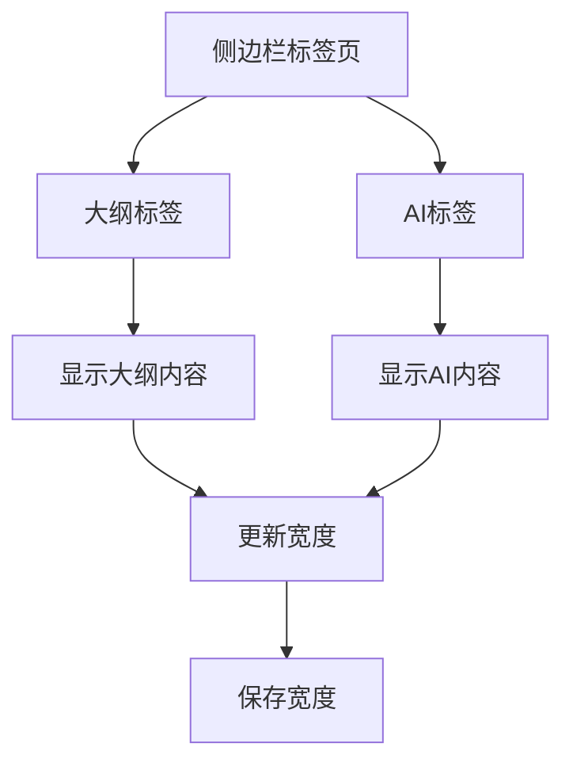

**图表来源**
- [apps/app/components/static/content/right/Index.vue:380-412](file://apps/app/components/static/content/right/Index.vue#L380-L412)

#### 标签页样式系统
- **统一样式**：所有标签页使用统一的样式系统
- **激活状态**：支持标签页激活状态的视觉反馈
- **图标支持**：支持图标和文字的组合显示

**章节来源**
- [apps/app/components/static/content/right/Index.vue:380-412](file://apps/app/components/static/content/right/Index.vue#L380-L412)

## 布案系统优化

### 固定定位架构

**更新** 大纲系统已完全迁移到基于固定定位策略的架构：

#### 固定定位实现
- **outline-container**：使用 `position: fixed` 确保不随正文滚动
- **100vh 高度**：占满整个视窗高度
- **独立 z-index**：`z-index: 100` 确保侧边栏始终在最前面显示
- **圆角设计**：顶部和底部圆角提升视觉质感

#### 视口相对定位
- **固定定位**：确保大纲容器不随正文滚动
- **视窗高度**：`calc(100vh - 120px)` 占满视窗高度
- **独立滚动**：大纲容器内部独立滚动，不影响正文

#### 初始化跟踪机制
- **isInitialized 状态**：标记是否已完成初始加载
- **延迟初始化**：100ms 延迟避免初始过渡动画
- **状态同步**：确保大纲展开/收起的平滑过渡

#### 精细化宽度管理
- **startResize**：开始拖拽调整宽度
- **范围限制**：200-500px 的有效范围
- **实时预览**：拖拽时实时显示新宽度
- **自动保存**：松开鼠标时自动保存设置

#### 多模块集成
- **模块切换**：支持大纲和AI模块的动态切换
- **宽度独立控制**：每个模块可以独立调整宽度
- **状态持久化**：模块状态和宽度设置持久化保存

**章节来源**
- [apps/app/components/static/content/right/Index.vue:473-566](file://apps/app/components/static/content/right/Index.vue#L473-L566)
- [apps/app/components/static/content/right/Index.vue:587-681](file://apps/app/components/static/content/right/Index.vue#L587-L681)

### 视觉增强优化

#### 圆角设计
- **顶部圆角**：`border-top-left-radius: 8px`
- **底部圆角**：`border-bottom-left-radius: 8px`
- **更柔和的边框**：`rgba(0, 0, 0, 0.06)`

#### 阴影效果
- **柔和阴影**：`box-shadow: -2px 2px 8px rgba(0, 0, 0, 0.06)`
- **更淡的阴影值**：相比之前版本更加柔和
- **适度的投影**：提升视觉层次感

#### 自定义滚动条
- **细滚动条**：宽度仅为 3px
- **透明轨道**：滚动条轨道透明
- **淡色主题**：滚动条颜色根据主题调整
- **悬停效果**：悬停时增加透明度

**章节来源**
- [apps/app/components/static/content/right/Index.vue:486-586](file://apps/app/components/static/content/right/Index.vue#L486-L586)
- [apps/app/components/static/content/right/Index.vue:598-611](file://apps/app/components/static/content/right/Index.vue#L598-L611)

## 滚动行为增强

### 独立滚动容器

**更新** 大纲容器现在提供完全独立的滚动环境：

#### 滚动优化特性
- **独立滚动**：大纲容器内部独立滚动
- **防滚动传播**：使用 `overscroll-behavior: contain`
- **iOS 优化**：启用 `-webkit-overflow-scrolling: touch`
- **平滑滚动**：全局启用 `scroll-behavior: smooth`

#### 自动滚动定位
- **激活项居中**：自动滚动到激活项并居中显示
- **视口偏移**：考虑大纲位置的 80px 偏移量
- **距离计算**：基于到视口顶部的距离找到最近节点

#### 滚动条自定义
- **细滚动条**：宽度仅为 3px
- **透明轨道**：滚动条轨道透明
- **淡色主题**：滚动条颜色根据主题调整
- **悬停效果**：悬停时增加透明度

#### 文档树导航联动
- **自动展开**：从文档树导航时自动展开侧边栏
- **激活同步**：滚动时同步更新激活状态
- **点击跳转**：点击大纲项时自动滚动到对应位置

**章节来源**
- [apps/app/components/static/content/right/Outline.vue:122-152](file://apps/app/components/static/content/right/Outline.vue#L122-L152)
- [apps/app/components/static/content/right/Index.vue:240-270](file://apps/app/components/static/content/right/Index.vue#L240-L270)

### 激活状态管理

#### 滚动同步机制


**图表来源**
- [apps/app/components/static/content/right/Index.vue:240-270](file://apps/app/components/static/content/right/Index.vue#L240-L270)

#### 文本清理一致性
- **cleanNodeText**：与 OutlineItem.vue 的 adjustItemName 保持一致
- **HTML 实体处理**：统一处理各种 HTML 实体
- **特殊字符过滤**：移除标点符号和特殊字符
- **正则表达式清理**：使用正则表达式确保一致性

**章节来源**
- [apps/app/components/static/content/right/Index.vue:220-238](file://apps/app/components/static/content/right/Index.vue#L220-L238)

## 依赖关系分析

大纲系统依赖于多个核心库和工具：

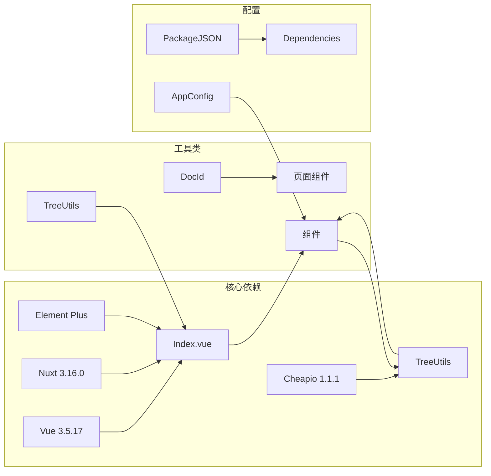

**图表来源**
- [apps/app/app.config.ts:28-72](file://apps/app/app.config.ts#L28-L72)

### 外部依赖

系统使用了以下关键外部依赖：

- **Vue 生态系统**：Vue 3.5.17 + Nuxt 3.16.0 提供基础框架
- **UI 组件库**：Element Plus 2.x 提供现代化的用户界面
- **DOM 操作**：Cheerio 1.1.1 用于服务器端的 DOM 解析
- **工具库**：zhi-common 提供通用的工具函数

**章节来源**
- [apps/app/app.config.ts:1-97](file://apps/app/app.config.ts#L1-L97)

## 性能考虑

### 优化策略

**更新** 新的多模块系统带来了多项性能优化：

1. **固定定位优化**：使用 CSS fixed 定位替代 JavaScript 布局计算
2. **viewport 定位**：固定定位避免布局重排
3. **初始化跟踪**：避免初始过渡动画的性能开销
4. **拖拽时禁用过渡**：避免拖拽过程中的动画开销
5. **独立滚动容器**：减少滚动事件对整个页面的影响
6. **自定义滚动条**：使用 CSS 滚动条替代复杂组件
7. **点击保护机制**：移除悬停展开功能，减少不必要的状态切换
8. **查询参数缓存**：避免重复解析URL查询参数
9. **模块懒加载**：AI模块支持懒加载，减少初始加载时间
10. **状态持久化**：模块状态和宽度设置持久化保存

### 内存优化

- **组件卸载**：在组件销毁时清理所有事件监听器
- **状态清理**：避免在组件生命周期外保留状态引用
- **资源释放**：及时释放 DOM 引用和定时器
- **本地存储优化**：只在必要时访问 localStorage

### 布局性能

- **固定定位**：现代浏览器优化的定位算法
- **fixed 定位**：避免文档流中的重排
- **圆角设计**：硬件加速的 CSS 属性
- **阴影效果**：适度的 GPU 加速

**章节来源**
- [apps/app/components/static/content/right/Index.vue:332-354](file://apps/app/components/static/content/right/Index.vue#L332-L354)

## 故障排除指南

### 常见问题

#### 多模块系统不工作
1. **检查模块配置**：确认 `modules` 数组配置正确
2. **验证模块ID**：确保模块ID与激活逻辑匹配
3. **查看控制台**：检查是否有 JavaScript 错误
4. **检查状态管理**：确认 `activeModuleId` 状态正确更新
5. **验证垂直按钮组**：确认按钮组正确渲染

#### 大纲不显示
1. **检查数据源**：确认 `outlineData` 是否正确传入
2. **验证配置**：检查 `outlineLevel` 设置是否合理
3. **查看控制台**：检查是否有 JavaScript 错误
4. **固定定位检查**：确认侧边栏容器使用正确的固定定位
5. **查询参数检查**：确认URL中是否包含 `from=docTree`

#### 滚动不同步
1. **检查选择器**：确认 `[data-subtype^="h"]` 选择器是否正确
2. **验证元素**：确保文档中存在有效的标题元素
3. **调试日志**：查看滚动监听器的日志输出
4. **初始化状态**：确认 `isInitialized` 状态是否正确设置
5. **点击保护检查**：确认点击保护机制正常工作

#### 激活状态异常
1. **文本清理**：确认 `cleanNodeText` 和 `adjustItemName` 方法的一致性
2. **编码问题**：检查特殊字符的处理是否正确
3. **边界情况**：验证空文本和特殊格式的处理
4. **固定定位**：确认侧边栏容器使用正确的固定定位
5. **查询参数处理**：检查URL查询参数的解析是否正确

#### 布局问题
1. **固定定位**：检查父容器的定位属性设置
2. **视口高度**：确认 `calc(100vh - 120px)` 计算是否正确
3. **圆角设计**：验证圆角样式的正确应用
4. **阴影效果**：检查阴影样式的兼容性
5. **模块切换冲突**：确认模块切换时的布局更新

#### 文档树导航问题
1. **查询参数传递**：确认 `from=docTree` 是否正确添加到URL
2. **URL解析**：检查 `route.query.from` 的解析是否正确
3. **自动展开逻辑**：验证自动展开的优先级和条件
4. **父节点追踪**：确认 `TreeUtils.addParentIds` 的执行是否正确
5. **侧边栏显示**：检查左侧文档树的显示和隐藏逻辑

#### 多模块状态问题
1. **模块配置**：确认 `SidebarModule` 接口配置正确
2. **状态同步**：检查模块状态与UI状态的同步
3. **宽度管理**：验证模块宽度的独立控制
4. **按钮样式**：确认模块按钮的样式系统正常工作
5. **激活逻辑**：检查模块激活时的逻辑处理

#### 垂直按钮组问题
1. **按钮渲染**：确认模块按钮正确动态渲染
2. **样式系统**：检查统一样式系统的应用
3. **激活反馈**：验证激活状态的视觉反馈
4. **垂直排列**：确认按钮组垂直排列的正确性
5. **收起按钮**：检查收起按钮的显示逻辑

**章节来源**
- [apps/app/components/static/content/right/Index.vue:337-342](file://apps/app/components/static/content/right/Index.vue#L337-L342)
- [apps/app/components/static/content/right/OutlineItem.vue:104-153](file://apps/app/components/static/content/right/OutlineItem.vue#L104-L153)
- [apps/app/components/static/content/left/MenuItem.vue:114-121](file://apps/app/components/static/content/left/MenuItem.vue#L114-L121)

## 结论

大纲系统作为 Siyuan 笔记博客插件的核心功能，经过重大升级后展现了更加优秀的架构设计和用户体验。系统通过采用固定定位策略和多模块架构，实现了高度的模块化、可维护性和性能优化。

### 主要优势

1. **架构升级**：从简单容器升级为完整的多模块系统
2. **布局优化**：采用固定定位确保稳定显示和更好的性能表现
3. **用户体验增强**：新增垂直按钮组设计，替代传统Tab界面，提供更直观的功能切换
4. **交互优化**：移除悬停自动展开功能，实现更稳定的点击保护机制
5. **初始化跟踪**：避免布局抖动和闪烁问题
6. **模块化设计**：完整的功能模块配置系统，便于扩展新功能
7. **视觉增强**：圆角、阴影、自定义滚动条等现代化设计
8. **性能提升**：固定定位避免布局重排和重绘

### 技术亮点

- **多模块系统**：支持大纲和AI助手的动态切换
- **垂直按钮组**：全新的垂直排列设计，替代传统Tab界面
- **固定定位策略**：现代化的布局解决方案
- **viewport 定位**：固定定位确保稳定显示
- **文档树导航集成**：完整的从文档树到文章的导航体验
- **点击保护机制**：移除悬停展开，防止误触
- **查询参数传递**：自动处理URL查询参数
- **自动展开逻辑**：智能的展开优先级控制
- **初始化跟踪**：智能的加载状态管理
- **精细化宽度管理**：精确的用户偏好控制
- **视觉增强**：圆角、阴影、自定义滚动条
- **拖拽调整系统**：直观的用户交互

### 未来展望

系统将继续演进，计划包括：
- 虚拟滚动支持大型文档
- 更多主题适配选项
- 移动端优化改进
- 性能监控和分析
- 更智能的导航联动功能
- 新功能模块的扩展支持

该系统为用户提供了专业级的文档导航体验，是 Siyuan 笔记本生态系统的重要组成部分，代表了现代前端开发的最佳实践。通过集成多模块系统和点击保护机制，系统不仅提升了功能性，更重要的是显著改善了用户体验的一致性和可靠性。