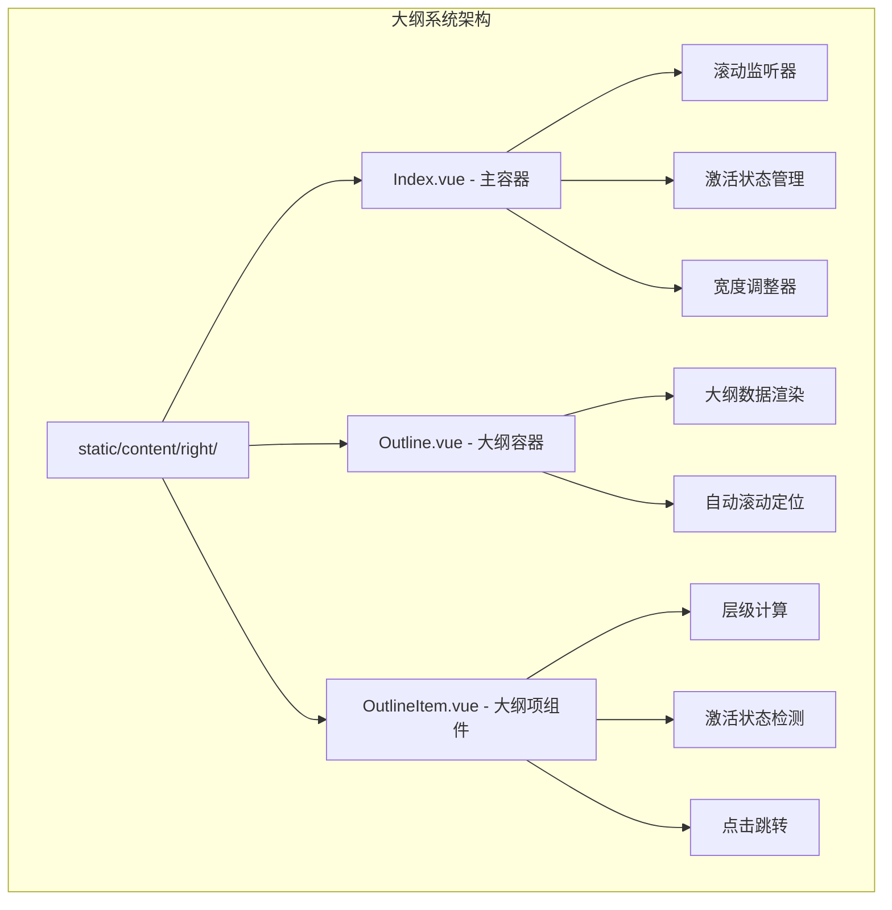
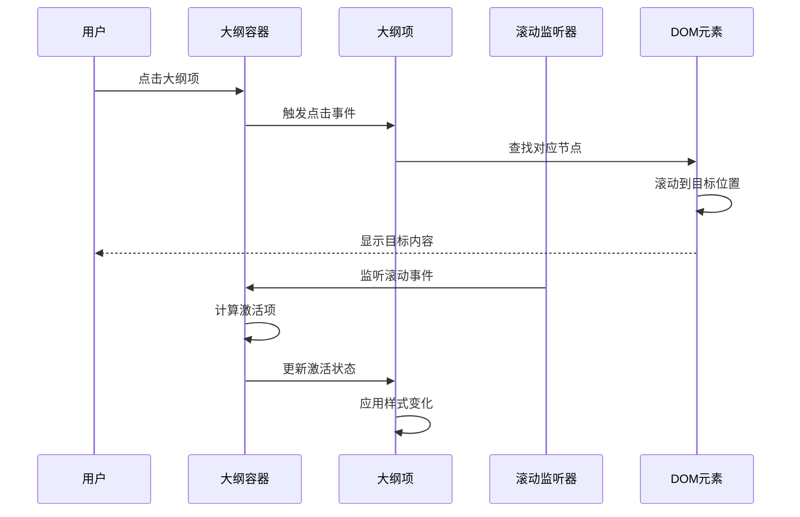
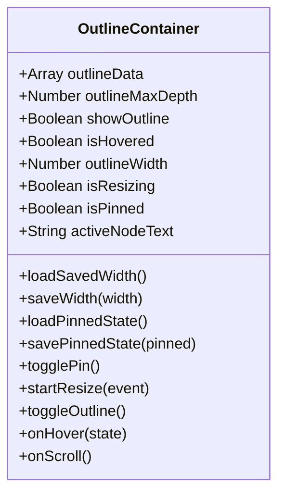
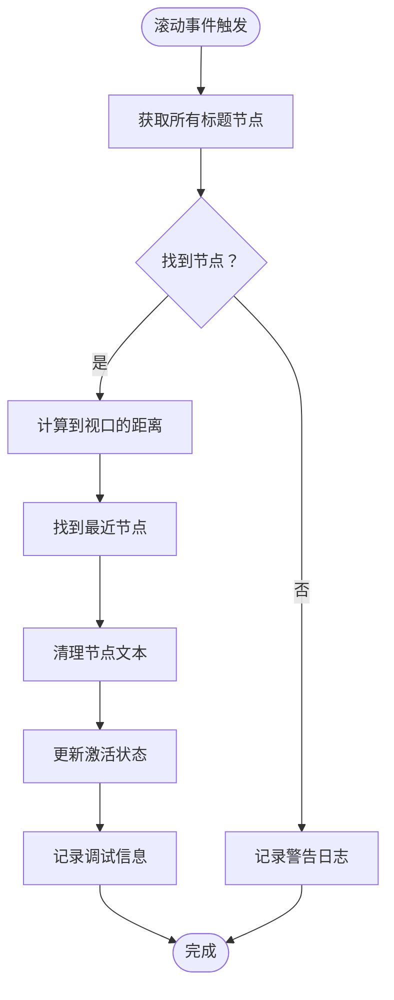
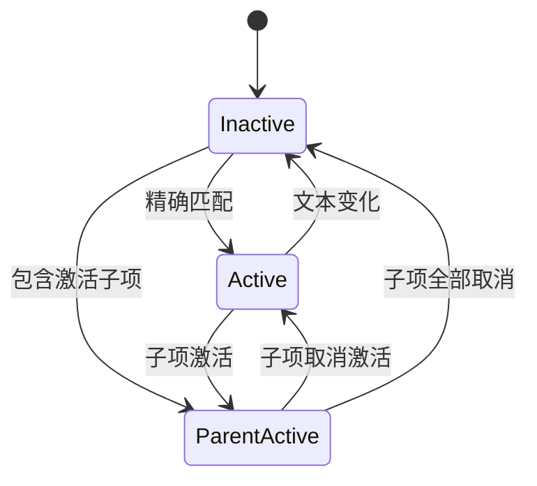
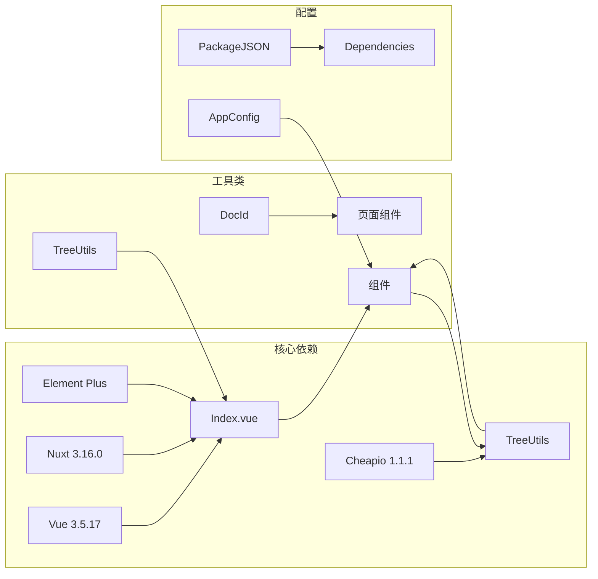

# 大纲系统

<cite>
**本文档引用的文件**
- [apps/app/components/static/content/right/Index.vue](file://apps/app/components/static/content/right/Index.vue)
- [apps/app/components/static/content/right/Outline.vue](file://apps/app/components/static/content/right/Outline.vue)
- [apps/app/components/static/content/right/OutlineItem.vue](file://apps/app/components/static/content/right/OutlineItem.vue)
- [apps/app/components/static/DetailPage.vue](file://apps/app/components/static/DetailPage.vue)
- [apps/app/pages/static/[id].vue](file://apps/app/pages/static/[id].vue)
- [apps/app/composables/useDocId.ts](file://apps/app/composables/useDocId.ts)
- [apps/app/utils/TreeUtils.ts](file://apps/app/utils/TreeUtils.ts)
- [apps/app/app.config.ts](file://apps/app/app.config.ts)
- [apps/app/package.json](file://apps/app/package.json)
</cite>

## 目录
1. [简介](#简介)
2. [项目结构](#项目结构)
3. [核心组件](#核心组件)
4. [架构概览](#架构概览)
5. [详细组件分析](#详细组件分析)
6. [依赖关系分析](#依赖关系分析)
7. [性能考虑](#性能考虑)
8. [故障排除指南](#故障排除指南)
9. [结论](#结论)

## 简介

大纲系统是 Siyuan 笔记博客插件中的核心功能模块，负责为静态文章页面提供交互式的大纲导航。该系统能够自动生成文档的层次结构，提供智能的滚动同步、可定制的显示范围和灵活的用户交互体验。

系统主要特点包括：
- 自动生成文档大纲结构
- 实时滚动同步和激活状态管理
- 可调整的大纲宽度和固定显示功能
- 支持多级标题的层级展示
- 响应式设计和主题适配

## 项目结构

大纲系统位于应用的静态内容组件目录中，采用分层架构设计：

**图表来源**
- [apps/app/components/static/content/right/Index.vue:1-491](file://apps/app/components/static/content/right/Index.vue#L1-L491)
- [apps/app/components/static/content/right/Outline.vue:1-154](file://apps/app/components/static/content/right/Outline.vue#L1-L154)
- [apps/app/components/static/content/right/OutlineItem.vue:1-275](file://apps/app/components/static/content/right/OutlineItem.vue#L1-L275)

**章节来源**
- [apps/app/components/static/content/right/Index.vue:1-491](file://apps/app/components/static/content/right/Index.vue#L1-L491)
- [apps/app/components/static/content/right/Outline.vue:1-154](file://apps/app/components/static/content/right/Outline.vue#L1-L154)
- [apps/app/components/static/content/right/OutlineItem.vue:1-275](file://apps/app/components/static/content/right/OutlineItem.vue#L1-L275)

## 核心组件

大纲系统由三个核心组件协同工作：

### 1. 大纲主容器 (Index.vue)
负责整个大纲系统的协调和状态管理，包括滚动监听、激活状态跟踪和用户交互控制。

### 2. 大纲容器 (Outline.vue)
提供大纲的整体布局和样式，包含滚动区域和自动滚动功能。

### 3. 大纲项组件 (OutlineItem.vue)
处理单个大纲项的渲染、层级计算和交互逻辑。

**章节来源**
- [apps/app/components/static/content/right/Index.vue:1-491](file://apps/app/components/static/content/right/Index.vue#L1-L491)
- [apps/app/components/static/content/right/Outline.vue:1-154](file://apps/app/components/static/content/right/Outline.vue#L1-L154)
- [apps/app/components/static/content/right/OutlineItem.vue:1-275](file://apps/app/components/static/content/right/OutlineItem.vue#L1-L275)

## 架构概览

大纲系统采用组件化的架构设计，实现了清晰的职责分离和良好的扩展性：

**图表来源**
- [apps/app/components/static/content/right/Index.vue:172-202](file://apps/app/components/static/content/right/Index.vue#L172-L202)
- [apps/app/components/static/content/right/OutlineItem.vue:155-161](file://apps/app/components/static/content/right/OutlineItem.vue#L155-L161)

系统的核心流程包括：
1. **初始化阶段**：加载大纲数据和配置
2. **渲染阶段**：构建大纲树形结构
3. **交互阶段**：处理用户操作和状态更新
4. **同步阶段**：维护滚动位置和激活状态

## 详细组件分析

### 大纲主容器 (Index.vue)

#### 状态管理
组件使用 Vue 3 的响应式系统管理多个状态：

**图表来源**
- [apps/app/components/static/content/right/Index.vue:10-220](file://apps/app/components/static/content/right/Index.vue#L10-L220)

#### 滚动同步机制
系统实现了智能的滚动同步功能：

**图表来源**
- [apps/app/components/static/content/right/Index.vue:172-202](file://apps/app/components/static/content/right/Index.vue#L172-L202)

#### 用户交互功能
- **宽度调整**：支持鼠标拖拽调整大纲宽度（200-500px范围）
- **固定显示**：支持固定显示大纲，避免频繁展开/收起
- **悬停展开**：鼠标悬停时自动展开大纲
- **本地存储**：持久化用户的偏好设置

**章节来源**
- [apps/app/components/static/content/right/Index.vue:1-491](file://apps/app/components/static/content/right/Index.vue#L1-L491)

### 大纲容器 (Outline.vue)

#### 根层级计算
组件能够智能识别大纲的根层级：

**图表来源**
- [apps/app/components/static/content/right/Outline.vue:35-48](file://apps/app/components/static/content/right/Outline.vue#L35-L48)

#### 自动滚动功能
实现了智能的滚动定位功能：

- **激活项定位**：自动滚动到当前激活的大纲项
- **居中显示**：确保激活项在视窗中央位置
- **平滑滚动**：提供流畅的滚动体验

**章节来源**
- [apps/app/components/static/content/right/Outline.vue:1-154](file://apps/app/components/static/content/right/Outline.vue#L1-L154)

### 大纲项组件 (OutlineItem.vue)

#### 层级计算算法
组件实现了复杂的层级计算逻辑：

**图表来源**
- [apps/app/components/static/content/right/OutlineItem.vue:40-48](file://apps/app/components/static/content/right/OutlineItem.vue#L40-L48)

#### 激活状态管理
实现了多层次的激活状态检测：

**图表来源**
- [apps/app/components/static/content/right/OutlineItem.vue:104-153](file://apps/app/components/static/content/right/OutlineItem.vue#L104-L153)

#### 文本处理机制
提供了完整的文本清理和格式化功能：

- **HTML实体解码**：处理 `&nbsp;`, `&amp;`, `&lt;` 等实体
- **特殊字符过滤**：移除冒号、逗号等标点符号
- **HTML标签剥离**：提取纯文本内容
- **空白字符标准化**：统一处理换行和空格

**章节来源**
- [apps/app/components/static/content/right/OutlineItem.vue:1-275](file://apps/app/components/static/content/right/OutlineItem.vue#L1-L275)

### 页面集成

#### 动态页面路由
系统支持动态页面路由，根据共享类型自动选择合适的页面组件：

**图表来源**
- [apps/app/pages/static/[id].vue](file://apps/app/pages/static/[id].vue#L10-L26)

#### 文档 ID 处理
提供了统一的文档 ID 获取机制：

- **文件扩展名处理**：自动移除 `.html` 和 `.htm` 扩展名
- **参数解析**：从路由参数中提取文档 ID
- **格式标准化**：确保返回标准的文档 ID 格式

**章节来源**
- [apps/app/pages/static/[id].vue](file://apps/app/pages/static/[id].vue#L1-L27)
- [apps/app/composables/useDocId.ts:1-29](file://apps/app/composables/useDocId.ts#L1-L29)

## 依赖关系分析

大纲系统依赖于多个核心库和工具：

**图表来源**
- [apps/app/package.json:12-32](file://apps/app/package.json#L12-L32)
- [apps/app/app.config.ts:28-72](file://apps/app/app.config.ts#L28-L72)

### 外部依赖

系统使用了以下关键外部依赖：

- **Vue 生态系统**：Vue 3.5.17 + Nuxt 3.16.0 提供基础框架
- **UI 组件库**：Element Plus 2.x 提供现代化的用户界面
- **DOM 操作**：Cheerio 1.1.1 用于服务器端的 DOM 解析
- **工具库**：zhi-common 提供通用的工具函数

**章节来源**
- [apps/app/package.json:1-41](file://apps/app/package.json#L1-L41)
- [apps/app/app.config.ts:1-92](file://apps/app/app.config.ts#L1-L92)

## 性能考虑

### 优化策略

1. **懒加载机制**：大纲组件仅在需要时加载和渲染
2. **虚拟滚动**：对于大型文档，考虑实现虚拟滚动以提升性能
3. **防抖处理**：滚动事件使用防抖技术减少重绘频率
4. **内存管理**：及时清理事件监听器和定时器

### 内存优化

- **组件卸载**：在组件销毁时清理所有事件监听器
- **状态清理**：避免在组件生命周期外保留状态引用
- **资源释放**：及时释放 DOM 引用和定时器

## 故障排除指南

### 常见问题

#### 大纲不显示
1. **检查数据源**：确认 `outlineData` 是否正确传入
2. **验证配置**：检查 `outlineLevel` 设置是否合理
3. **查看控制台**：检查是否有 JavaScript 错误

#### 滚动不同步
1. **检查选择器**：确认 `[data-subtype^="h"]` 选择器是否正确
2. **验证元素**：确保文档中存在有效的标题元素
3. **调试日志**：查看滚动监听器的日志输出

#### 激活状态异常
1. **文本清理**：确认 `cleanNodeText` 和 `adjustItemName` 方法的一致性
2. **编码问题**：检查特殊字符的处理是否正确
3. **边界情况**：验证空文本和特殊格式的处理

**章节来源**
- [apps/app/components/static/content/right/Index.vue:172-219](file://apps/app/components/static/content/right/Index.vue#L172-L219)
- [apps/app/components/static/content/right/OutlineItem.vue:104-153](file://apps/app/components/static/content/right/OutlineItem.vue#L104-L153)

## 结论

大纲系统作为 Siyuan 笔记博客插件的核心功能，展现了优秀的架构设计和用户体验。系统通过组件化的开发方式，实现了高度的模块化和可维护性。

### 主要优势

1. **架构清晰**：三层组件设计实现了良好的职责分离
2. **用户体验优秀**：提供流畅的滚动同步和交互体验
3. **扩展性强**：支持自定义配置和主题适配
4. **性能优化**：采用多种优化策略确保系统性能

### 技术亮点

- 智能的层级计算和激活状态管理
- 响应式的用户交互设计
- 完善的状态持久化机制
- 良好的错误处理和调试支持

该系统为用户提供了专业级的文档导航体验，是 Siyuan 笔记本生态系统的重要组成部分。