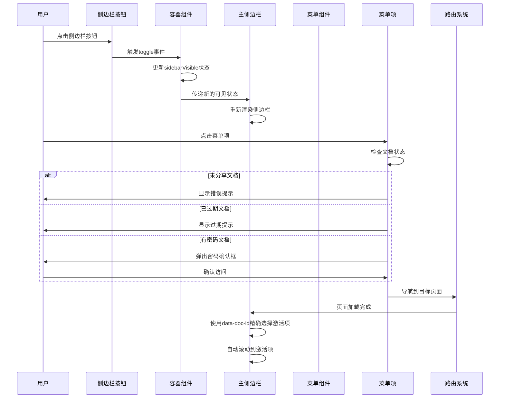
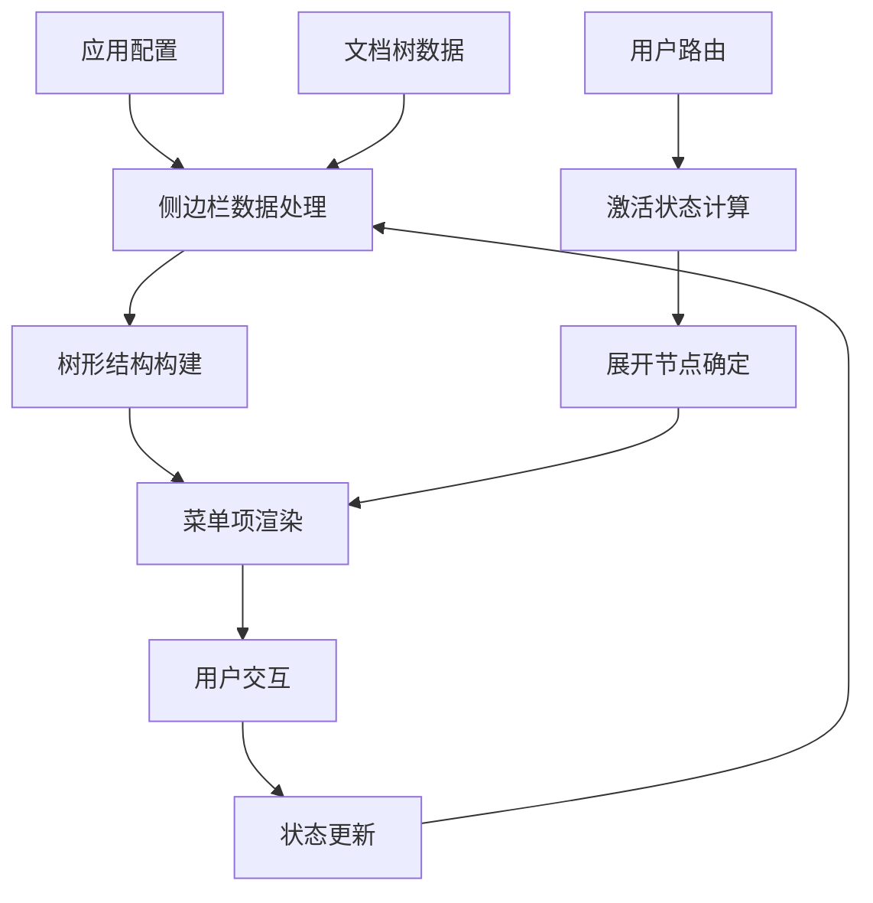
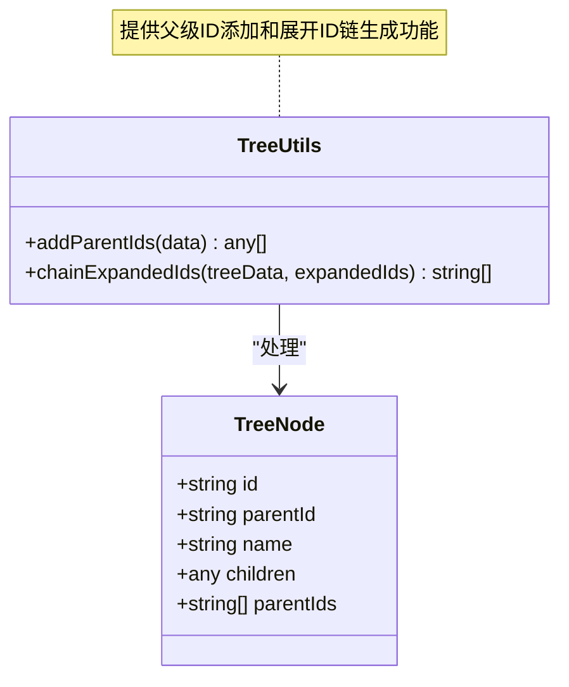
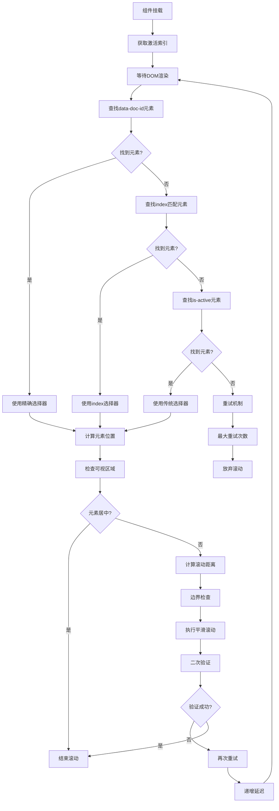
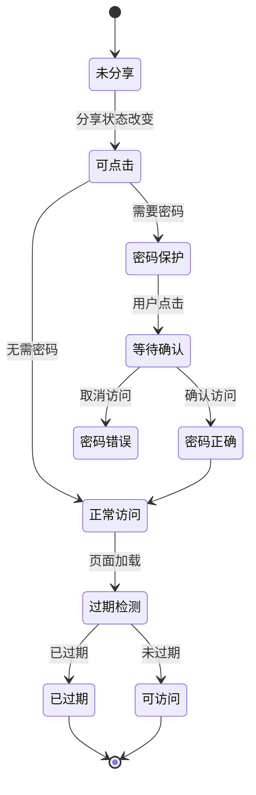
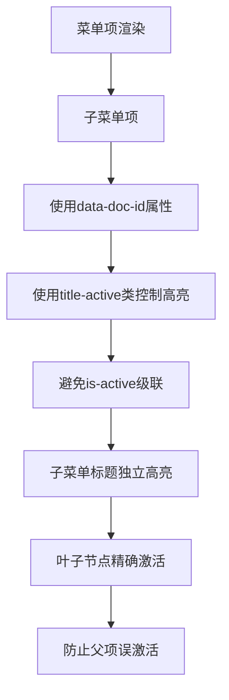
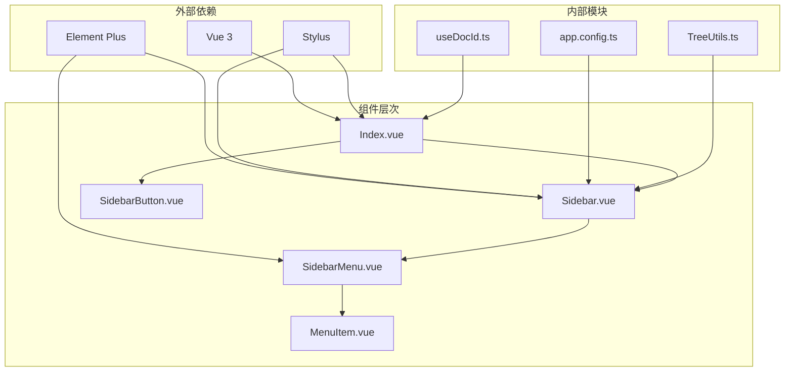

# 侧边栏系统

<cite>
**本文档引用的文件**
- [apps/app/components/static/content/left/Sidebar.vue](file://apps/app/components/static/content/left/Sidebar.vue)
- [apps/app/components/static/content/left/Index.vue](file://apps/app/components/static/content/left/Index.vue)
- [apps/app/components/static/content/left/MenuItem.vue](file://apps/app/components/static/content/left/MenuItem.vue)
- [apps/app/components/static/content/left/SidebarButton.vue](file://apps/app/components/static/content/left/SidebarButton.vue)
- [apps/app/components/static/content/left/SidebarMenu.vue](file://apps/app/components/static/content/left/SidebarMenu.vue)
- [apps/app/utils/TreeUtils.ts](file://apps/app/utils/TreeUtils.ts)
- [apps/app/app.config.ts](file://apps/app/app.config.ts)
- [apps/app/composables/useDocId.ts](file://apps/app/composables/useDocId.ts)
- [apps/app/components/static/content/Main.vue](file://apps/app/components/static/content/Main.vue)
- [apps/app/components/static/DetailPage.vue](file://apps/app/components/static/DetailPage.vue)
- [apps/app/pages/post/[id].vue](file://apps/app/pages/post/[id].vue)
</cite>

## 更新摘要
**变更内容**
- 更新了精确文档ID选择机制，新增data-doc-id属性使用
- 优化了CSS选择器以防止父菜单项继承活动状态
- 改进了滚动定位算法，支持多种选择器回退机制
- 增强了菜单项状态管理和激活项定位

## 目录
1. [简介](#简介)
2. [项目结构](#项目结构)
3. [核心组件](#核心组件)
4. [架构概览](#架构概览)
5. [详细组件分析](#详细组件分析)
6. [依赖关系分析](#依赖关系分析)
7. [性能考虑](#性能考虑)
8. [故障排除指南](#故障排除指南)
9. [结论](#结论)

## 简介

侧边栏系统是思源笔记博客插件中的核心导航组件，负责提供文档树导航、目录浏览和内容组织功能。该系统采用Vue 3 Composition API构建，集成了Element Plus UI组件库，提供了响应式的侧边栏导航体验。

系统主要功能包括：
- 文档树结构展示
- 动态菜单项渲染
- 精确文档ID选择和激活状态管理
- 自动滚动定位到当前文档
- 密码保护和过期文档处理
- 响应式布局适配
- 主题兼容性支持

## 项目结构

侧边栏系统位于应用的静态内容组件目录中，采用模块化的组件设计：

```mermaid
graph TB
subgraph "侧边栏系统结构"
Index[Index.vue<br/>侧边栏容器]
Sidebar[Sidebar.vue<br/>主侧边栏组件]
Button[SidebarButton.vue<br/>侧边栏开关按钮]
Menu[SidebarMenu.vue<br/>菜单渲染组件]
Item[MenuItem.vue<br/>菜单项组件]
Utils[TreeUtils.ts<br/>树形工具类]
end
subgraph "配置系统"
Config[app.config.ts<br/>应用配置]
DocId[useDocId.ts<br/>文档ID处理]
end
subgraph "页面集成"
Main[Main.vue<br/>主要内容区域]
Detail[DetailPage.vue<br/>详情页面]
Post[post/[id].vue<br/>文章路由]
end
Index --> Sidebar
Index --> Button
Sidebar --> Menu
Menu --> Item
Sidebar --> Utils
Sidebar --> Config
Main --> Index
Detail --> Main
Post --> Detail
```

**图表来源**
- [apps/app/components/static/content/left/Index.vue:1-91](file://apps/app/components/static/content/left/Index.vue#L1-L91)
- [apps/app/components/static/content/left/Sidebar.vue:1-302](file://apps/app/components/static/content/left/Sidebar.vue#L1-L302)

**章节来源**
- [apps/app/components/static/content/left/Index.vue:1-91](file://apps/app/components/static/content/left/Index.vue#L1-L91)
- [apps/app/components/static/content/left/Sidebar.vue:1-302](file://apps/app/components/static/content/left/Sidebar.vue#L1-L302)

## 核心组件

### 侧边栏容器组件

Index.vue作为侧边栏的容器组件，负责整体布局和状态管理：

- **显示条件控制**：根据文档树是否存在动态决定侧边栏显示
- **响应式宽度管理**：支持展开/收起两种状态，宽度分别为280px和60px
- **浏览器兼容性**：处理标题栏样式调整，防止侧边栏遮挡输入框
- **初始状态优化**：服务端预渲染避免客户端闪烁

### 主要侧边栏组件

Sidebar.vue是核心导航组件，实现以下关键功能：

- **精确文档ID选择**：使用data-doc-id属性进行精确的菜单项定位
- **多级选择器回退机制**：支持data-doc-id、index属性和is-active类的多重选择
- **智能滚动定位**：确保当前激活的菜单项始终可见
- **树形数据处理**：支持复杂的嵌套文档结构
- **激活状态管理**：确保当前文档始终可见
- **滚动条优化**：自定义滚动条样式，提升用户体验

### 菜单项组件

MenuItem.vue处理具体的菜单项交互：

- **data-doc-id属性**：每个菜单项都带有唯一的data-doc-id属性用于精确定位
- **文本截断算法**：智能计算中英文字符长度，支持中文字符计为1，英文字符计为0.5
- **状态徽章显示**：密码保护和过期状态的视觉提示
- **安全访问控制**：未分享文档不可点击，过期文档禁止访问
- **密码验证流程**：通过ElMessageBox进行密码确认

**章节来源**
- [apps/app/components/static/content/left/Index.vue:10-91](file://apps/app/components/static/content/left/Index.vue#L10-L91)
- [apps/app/components/static/content/left/Sidebar.vue:10-302](file://apps/app/components/static/content/left/Sidebar.vue#L10-L302)
- [apps/app/components/static/content/left/MenuItem.vue:10-176](file://apps/app/components/static/content/left/MenuItem.vue#L10-L176)

## 架构概览

侧边栏系统的整体架构采用分层设计，各组件职责明确：



**图表来源**
- [apps/app/components/static/content/left/SidebarButton.vue:10-98](file://apps/app/components/static/content/left/SidebarButton.vue#L10-L98)
- [apps/app/components/static/content/left/Index.vue:39-49](file://apps/app/components/static/content/left/Index.vue#L39-L49)
- [apps/app/components/static/content/left/MenuItem.vue:82-123](file://apps/app/components/static/content/left/MenuItem.vue#L82-L123)

### 数据流架构



**图表来源**
- [apps/app/app.config.ts:28-83](file://apps/app/app.config.ts#L28-L83)
- [apps/app/utils/TreeUtils.ts:4-59](file://apps/app/utils/TreeUtils.ts#L4-L59)

## 详细组件分析

### 树形数据处理机制

TreeUtils.ts提供了完整的树形数据处理能力：



**图表来源**
- [apps/app/utils/TreeUtils.ts:4-59](file://apps/app/utils/TreeUtils.ts#L4-L59)

### 精确文档ID选择算法

Sidebar.vue实现了精确的文档ID选择算法，支持多种选择器回退机制：



**图表来源**
- [apps/app/components/static/content/left/Sidebar.vue:25-127](file://apps/app/components/static/content/left/Sidebar.vue#L25-L127)

### 菜单项状态管理系统

MenuItem.vue的状态管理采用组合式设计：



**图表来源**
- [apps/app/components/static/content/left/MenuItem.vue:82-123](file://apps/app/components/static/content/left/MenuItem.vue#L82-L123)

### CSS选择器优化机制

SidebarMenu.vue实现了CSS选择器优化，防止父菜单项继承活动状态：



**图表来源**
- [apps/app/components/static/content/left/SidebarMenu.vue:42-95](file://apps/app/components/static/content/left/SidebarMenu.vue#L42-L95)

**章节来源**
- [apps/app/utils/TreeUtils.ts:1-59](file://apps/app/utils/TreeUtils.ts#L1-L59)
- [apps/app/components/static/content/left/Sidebar.vue:25-127](file://apps/app/components/static/content/left/Sidebar.vue#L25-L127)
- [apps/app/components/static/content/left/MenuItem.vue:82-123](file://apps/app/components/static/content/left/MenuItem.vue#L82-L123)
- [apps/app/components/static/content/left/SidebarMenu.vue:42-95](file://apps/app/components/static/content/left/SidebarMenu.vue#L42-L95)

### 响应式布局实现

Index.vue实现了灵活的响应式布局：

| 状态 | 宽度 | 透明度 | 交互状态 |
|------|------|--------|----------|
| 展开 | 280px | 100% | 可交互 |
| 收起 | 60px | 0% | 无交互 |

移动端适配采用媒体查询，确保在不同设备上的良好体验。

**章节来源**
- [apps/app/components/static/content/left/Index.vue:63-90](file://apps/app/components/static/content/left/Index.vue#L63-L90)

## 依赖关系分析

侧边栏系统的主要依赖关系如下：



**图表来源**
- [apps/app/app.config.ts:28-83](file://apps/app/app.config.ts#L28-L83)
- [apps/app/utils/TreeUtils.ts:4-59](file://apps/app/utils/TreeUtils.ts#L4-L59)
- [apps/app/composables/useDocId.ts:13-29](file://apps/app/composables/useDocId.ts#L13-L29)

### 组件间通信机制

组件间的通信采用Vue的标准模式：

1. **Props传递**：父组件向子组件传递数据和配置
2. **事件发射**：子组件向父组件发送用户交互事件
3. **状态提升**：共享状态在最近的共同祖先中管理
4. **组合式API**：使用provide/inject处理深层组件通信

**章节来源**
- [apps/app/components/static/content/left/Index.vue:39-49](file://apps/app/components/static/content/left/Index.vue#L39-L49)
- [apps/app/components/static/content/left/Sidebar.vue:15-22](file://apps/app/components/static/content/left/Sidebar.vue#L15-L22)

## 性能考虑

### 渲染优化

1. **虚拟滚动**：对于大型文档树，考虑实现虚拟滚动以减少DOM节点数量
2. **懒加载**：菜单项采用懒加载策略，只渲染可见区域
3. **防抖处理**：滚动事件使用防抖技术，避免频繁重排
4. **精确选择器**：使用data-doc-id属性减少DOM查询范围

### 内存管理

1. **组件卸载**：确保组件销毁时清理定时器和事件监听器
2. **缓存策略**：合理使用computed和watch的缓存机制
3. **引用释放**：及时释放大对象的引用，避免内存泄漏

### 网络优化

1. **数据预加载**：在页面加载前预获取必要的文档树数据
2. **增量更新**：只更新发生变化的部分，避免全量重渲染
3. **选择器回退**：提供多种选择器回退机制，提高稳定性

## 故障排除指南

### 常见问题及解决方案

**问题1：侧边栏不显示**
- 检查文档树数据是否为空
- 确认shouldShowSidebar计算属性的返回值
- 验证路由参数from=docTree的传递

**问题2：激活项定位不准确**
- 检查DOM元素的data-doc-id属性是否正确设置
- 确认scrollToActiveItem函数的多级选择器回退机制
- 验证Element Plus滚动API的兼容性
- 检查CSS选择器是否正确防止父菜单项继承活动状态

**问题3：菜单项点击无效**
- 检查文档的分享状态
- 验证密码保护和过期状态的逻辑
- 确认navigateTo函数的正确性
- 验证data-doc-id属性是否正确传递

**问题4：样式显示异常**
- 检查CSS变量的定义
- 验证主题配置的兼容性
- 确认媒体查询的正确性
- 检查title-active类的使用是否正确

**问题5：父菜单项误激活**
- 检查SidebarMenu组件中title-active类的使用
- 确认CSS选择器是否正确避免is-active级联
- 验证子菜单标题的独立高亮机制

**章节来源**
- [apps/app/components/static/content/left/Sidebar.vue:32-121](file://apps/app/components/static/content/left/Sidebar.vue#L32-L121)
- [apps/app/components/static/content/left/MenuItem.vue:82-123](file://apps/app/components/static/content/left/MenuItem.vue#L82-L123)
- [apps/app/components/static/content/left/SidebarMenu.vue:90-95](file://apps/app/components/static/content/left/SidebarMenu.vue#L90-L95)

## 结论

侧边栏系统通过精心设计的组件架构和完善的交互逻辑，为用户提供了流畅的文档导航体验。系统的主要优势包括：

1. **模块化设计**：清晰的组件职责分离，便于维护和扩展
2. **精确选择机制**：使用data-doc-id属性实现精确的文档ID选择
3. **响应式支持**：全面的移动端适配，确保多设备兼容性
4. **用户体验优化**：智能的滚动定位和状态管理
5. **安全性保障**：完善的文档访问控制机制
6. **CSS选择器优化**：防止父菜单项继承活动状态，提升导航准确性
7. **性能优化**：合理的渲染策略和内存管理

未来可以考虑的功能增强：
- 添加搜索功能集成
- 实现书签管理
- 增加自定义主题支持
- 优化大数据量场景下的性能表现
- 进一步优化选择器回退机制