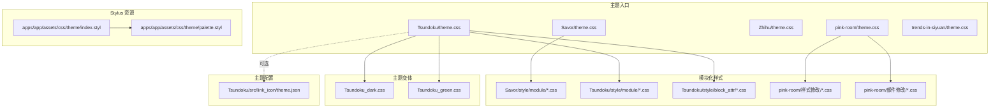
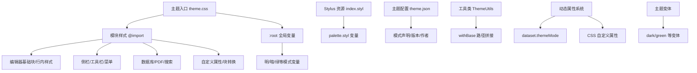
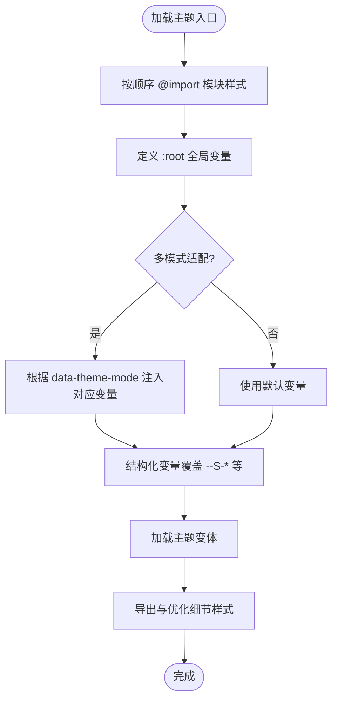
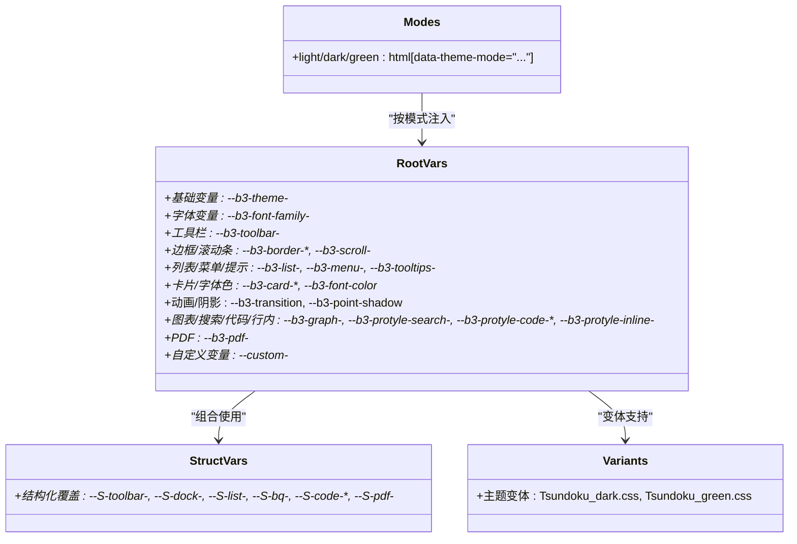
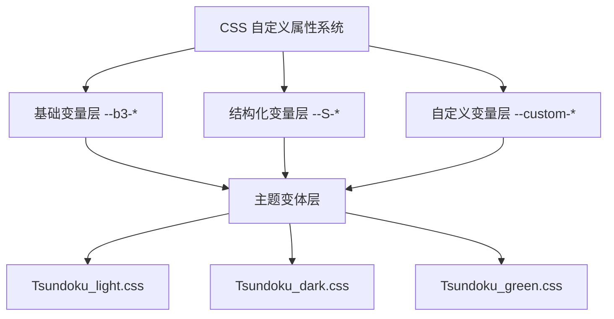
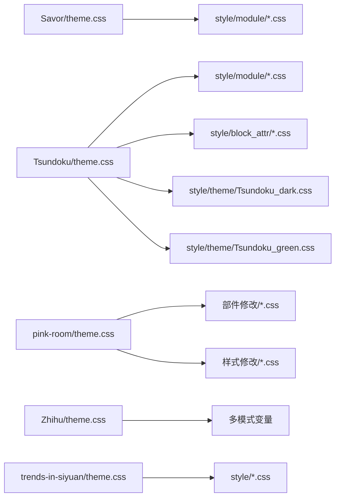

# 主题开发

<cite>
**本文引用的文件**   
- [apps/app/public/resources/appearance/themes/Savor/theme.css](file://apps/app/public/resources/appearance/themes/Savor/theme.css)
- [apps/app/public/resources/appearance/themes/Tsundoku/theme.css](file://apps/app/public/resources/appearance/themes/Tsundoku/theme.css)
- [apps/app/public/resources/appearance/themes/Tsundoku/src/link_icon/theme.json](file://apps/app/public/resources/appearance/themes/Tsundoku/src/link_icon/theme.json)
- [apps/app/public/resources/appearance/themes/Tsundoku/style/theme/Tsundoku_dark.css](file://apps/app/public/resources/appearance/themes/Tsundoku/style/theme/Tsundoku_dark.css)
- [apps/app/public/resources/appearance/themes/Tsundoku/style/theme/Tsundoku_green.css](file://apps/app/public/resources/appearance/themes/Tsundoku/style/theme/Tsundoku_green.css)
- [apps/app/public/resources/appearance/themes/Zhihu/theme.css](file://apps/app/public/resources/appearance/themes/Zhihu/theme.css)
- [apps/app/public/resources/appearance/themes/pink-room/theme.css](file://apps/app/public/resources/appearance/themes/pink-room/theme.css)
- [apps/app/public/resources/appearance/themes/pink-room/root/修改root.css中变量.css](file://apps/app/public/resources/appearance/themes/pink-room/root/修改root.css中变量.css)
- [apps/app/public/resources/appearance/themes/pink-room/样式修改/超级块边框.css](file://apps/app/public/resources/appearance/themes/pink-room/样式修改/超级块边框.css)
- [apps/app/public/resources/appearance/themes/trends-in-siyuan/theme.css](file://apps/app/public/resources/appearance/themes/trends-in-siyuan/theme.css)
- [apps/app/assets/css/theme/index.styl](file://apps/app/assets/css/theme/index.styl)
- [apps/app/assets/css/theme/palette.styl](file://apps/app/assets/css/theme/palette.styl)
- [apps/app/utils/ThemeUtils.ts](file://apps/app/utils/ThemeUtils.ts)
- [apps/app/composables/useClientThemeMode.ts](file://apps/app/composables/useClientThemeMode.ts)
</cite>

## 更新摘要
**变更内容**   
- 新增 CSS 自定义属性支持章节，详细说明 Tsundoku 主题的动态主题能力
- 更新主题变量体系，包含 `--b3-*` 和 `--custom-*` 变量的使用方法
- 新增主题切换与动态属性更新机制说明
- 更新实战案例，重点介绍 Tsundoku 主题的扩展特性

## 目录
1. [简介](#简介)
2. [项目结构](#项目结构)
3. [核心组件](#核心组件)
4. [架构总览](#架构总览)
5. [详细组件分析](#详细组件分析)
6. [CSS 自定义属性支持](#css-自定义属性支持)
7. [依赖分析](#依赖分析)
8. [性能考量](#性能考量)
9. [故障排查指南](#故障排查指南)
10. [结论](#结论)
11. [附录](#附录)

## 简介
本指南面向希望在 Siyuan 生态中创建与定制主题的开发者，系统讲解主题系统的架构设计、加载机制、样式覆盖规则与主题切换逻辑；提供从目录结构搭建到样式编写的全流程实践；详解 Stylus 预处理器与 CSS 变量体系；给出主题配置文件格式与参数说明；并通过多个真实主题案例展示不同风格的实现方式；最后总结主题打包、发布与测试的最佳实践，并讨论兼容性与向后兼容保障。

**更新** 本版本特别关注 Tsundoku 主题新增的 CSS 自定义属性支持，展示了现代主题开发的动态主题能力。

## 项目结构
主题资源集中于应用前端资源目录下的外观主题集合，每个主题由一个独立的 theme.css 入口文件与若干模块化样式文件组成，配合可选的配置文件（如 theme.json）描述主题元信息。同时，项目还包含 Stylus 资源与工具类，用于主题变量与样式组织。



**图表来源**
- [apps/app/public/resources/appearance/themes/Savor/theme.css:1-791](file://apps/app/public/resources/appearance/themes/Savor/theme.css#L1-L791)
- [apps/app/public/resources/appearance/themes/Tsundoku/theme.css:1-1159](file://apps/app/public/resources/appearance/themes/Tsundoku/theme.css#L1-L1159)
- [apps/app/public/resources/appearance/themes/Tsundoku/style/theme/Tsundoku_dark.css:1-834](file://apps/app/public/resources/appearance/themes/Tsundoku/style/theme/Tsundoku_dark.css#L1-L834)
- [apps/app/public/resources/appearance/themes/Tsundoku/style/theme/Tsundoku_green.css:1-983](file://apps/app/public/resources/appearance/themes/Tsundoku/style/theme/Tsundoku_green.css#L1-L983)
- [apps/app/assets/css/theme/index.styl:1-4](file://apps/app/assets/css/theme/index.styl#L1-L4)
- [apps/app/public/resources/appearance/themes/Tsundoku/src/link_icon/theme.json:1-9](file://apps/app/public/resources/appearance/themes/Tsundoku/src/link_icon/theme.json#L1-L9)

**章节来源**
- [apps/app/public/resources/appearance/themes/Savor/theme.css:1-791](file://apps/app/public/resources/appearance/themes/Savor/theme.css#L1-L791)
- [apps/app/public/resources/appearance/themes/Tsundoku/theme.css:1-1159](file://apps/app/public/resources/appearance/themes/Tsundoku/theme.css#L1-L1159)
- [apps/app/public/resources/appearance/themes/pink-room/theme.css:1-100](file://apps/app/public/resources/appearance/themes/pink-room/theme.css#L1-L100)
- [apps/app/assets/css/theme/index.styl:1-4](file://apps/app/assets/css/theme/index.styl#L1-L4)

## 核心组件
- 主题入口样式（theme.css）
  - 统一聚合模块化样式与字体、图标资源，通过 @import 组织加载顺序与作用域。
  - 定义全局 CSS 变量（:root），作为主题色彩、排版、阴影、交互等的统一来源。
- 模块化样式
  - 将编辑器基础块、行内样式、侧栏、工具栏、菜单、数据库、PDF 等拆分为独立文件，便于维护与按需覆盖。
- 主题变体
  - 支持多种主题变体（如 Tsundoku 的 dark、green 变体），通过独立的 CSS 文件实现不同的视觉风格。
- Stylus 资源
  - 通过 Stylus 组织主题变量与通用样式（如模糊滤镜），提升复用性与一致性。
- 主题配置
  - 通过 JSON 描述主题名称、作者、版本、支持模式等元信息，辅助主题管理与发布。

**章节来源**
- [apps/app/public/resources/appearance/themes/Savor/theme.css:1-791](file://apps/app/public/resources/appearance/themes/Savor/theme.css#L1-L791)
- [apps/app/public/resources/appearance/themes/Tsundoku/theme.css:1-1159](file://apps/app/public/resources/appearance/themes/Tsundoku/theme.css#L1-L1159)
- [apps/app/public/resources/appearance/themes/Zhihu/theme.css:1-319](file://apps/app/public/resources/appearance/themes/Zhihu/theme.css#L1-L319)
- [apps/app/public/resources/appearance/themes/pink-room/theme.css:1-100](file://apps/app/public/resources/appearance/themes/pink-room/theme.css#L1-L100)
- [apps/app/assets/css/theme/index.styl:1-4](file://apps/app/assets/css/theme/index.styl#L1-L4)

## 架构总览
主题系统采用"入口聚合 + 模块化拆分 + 变量驱动 + 动态属性"的架构：
- 入口文件负责加载模块与注入全局变量；
- 模块文件按功能域划分，彼此解耦；
- CSS 变量统一管理视觉语言，支持明暗/多模式适配；
- 可选配置文件提供主题元信息与模式声明；
- 动态属性系统支持实时主题切换与属性更新；
- 工具类提供路径拼接等辅助能力。



**图表来源**
- [apps/app/public/resources/appearance/themes/Tsundoku/theme.css:1-32](file://apps/app/public/resources/appearance/themes/Tsundoku/theme.css#L1-L32)
- [apps/app/public/resources/appearance/themes/Zhihu/theme.css:46-70](file://apps/app/public/resources/appearance/themes/Zhihu/theme.css#L46-L70)
- [apps/app/assets/css/theme/index.styl:1-4](file://apps/app/assets/css/theme/index.styl#L1-L4)
- [apps/app/public/resources/appearance/themes/Tsundoku/src/link_icon/theme.json:1-9](file://apps/app/public/resources/appearance/themes/Tsundoku/src/link_icon/theme.json#L1-L9)
- [apps/app/utils/ThemeUtils.ts:18-38](file://apps/app/utils/ThemeUtils.ts#L18-L38)
- [apps/app/composables/useClientThemeMode.ts:175-186](file://apps/app/composables/useClientThemeMode.ts#L175-L186)

## 详细组件分析

### 组件一：主题入口与模块化加载
- Savor 主题
  - 通过 @import 串联模块样式与字体资源，随后在 :root 中集中定义主题变量与自定义变量，覆盖工具栏、侧栏、列表、菜单、提示、卡片、图表、编辑器搜索、代码块、PDF 等。
  - 提供大量自定义变量（如 --S-*），用于结构化覆盖与主题增强。
- Tsundoku 主题
  - 入口文件聚合编辑器、标题提示、代码块、列表、折叠、链接图标、数据库、文档属性、Admonition、块自定义属性、列表转换等模块。
  - :root 定义主色、文字色、字体族、工具栏、边框、滚动条、列表、页签、菜单、提示、卡片、PDF、动画、阴影、diff、图表、编辑器搜索、代码片段、行内元素、表格背景、高亮、标题颜色等。
  - 末尾补充导出样式与外观优化细节。
  - **新增** 支持多种主题变体，通过独立的 CSS 文件实现不同的视觉风格。
- Zhihu 主题
  - 通过 html[data-theme-mode="light|dark|green"] 切换不同模式下的变量，实现多模式适配。
  - 重点覆盖代码块、行内代码、块引用、标签、闪卡等元素的样式。
- pink-room 主题
  - 通过 @import 分层组织"部件修改""样式修改""自定义属性"，形成模块化覆盖策略。
  - 提供 root 层变量覆盖与超级块边框等具体样式示例。
- trends-in-siyuan 主题
  - 以模块化方式导入引用、标题、备忘、停靠、嵌入、标题、图例、内联、表格、代码、自定义、插件、布局、集市等样式。
  - :root 定义主色、次色、背景、表面、错误、文字色、工具栏、边框、滚动条、列表、菜单、提示、AV、遮罩、卡片、字体、动画、下拉菜单、阴影、图表、编辑器搜索、代码片段、行内元素、PDF 等变量。



**图表来源**
- [apps/app/public/resources/appearance/themes/Savor/theme.css:1-791](file://apps/app/public/resources/appearance/themes/Savor/theme.css#L1-L791)
- [apps/app/public/resources/appearance/themes/Tsundoku/theme.css:1-226](file://apps/app/public/resources/appearance/themes/Tsundoku/theme.css#L1-L226)
- [apps/app/public/resources/appearance/themes/Zhihu/theme.css:46-70](file://apps/app/public/resources/appearance/themes/Zhihu/theme.css#L46-L70)
- [apps/app/public/resources/appearance/themes/pink-room/theme.css:1-100](file://apps/app/public/resources/appearance/themes/pink-room/theme.css#L1-L100)
- [apps/app/public/resources/appearance/themes/trends-in-siyuan/theme.css:1-193](file://apps/app/public/resources/appearance/themes/trends-in-siyuan/theme.css#L1-L193)

**章节来源**
- [apps/app/public/resources/appearance/themes/Savor/theme.css:1-791](file://apps/app/public/resources/appearance/themes/Savor/theme.css#L1-L791)
- [apps/app/public/resources/appearance/themes/Tsundoku/theme.css:1-1159](file://apps/app/public/resources/appearance/themes/Tsundoku/theme.css#L1-L1159)
- [apps/app/public/resources/appearance/themes/Zhihu/theme.css:1-319](file://apps/app/public/resources/appearance/themes/Zhihu/theme.css#L1-L319)
- [apps/app/public/resources/appearance/themes/pink-room/theme.css:1-100](file://apps/app/public/resources/appearance/themes/pink-room/theme.css#L1-L100)
- [apps/app/public/resources/appearance/themes/trends-in-siyuan/theme.css:1-200](file://apps/app/public/resources/appearance/themes/trends-in-siyuan/theme.css#L1-L200)

### 组件二：CSS 变量体系与多模式适配
- 变量命名规范
  - 基础变量：--b3-theme-*、--b3-font-family-*、--b3-toolbar-*、--b3-border-*、--b3-scroll-*、--b3-list-*、--b3-menu-*、--b3-tooltips-*、--b3-empty-*、--b3-mask-*、--b3-card-*、--b3-font-color*、--b3-font-background*、--b3-transition、--b3-point-shadow、--b3-dialog-shadow、--b3-graph-*、--b3-protyle-search-*、--b3-protyle-code-*、--b3-protyle-inline-*、--b3-pdf-*。
  - 结构化变量：--S-* 用于覆盖具体 UI 结构（如工具栏、侧栏、列表、面包屑、代码块、PDF 等）。
  - **新增** 自定义变量：--custom-* 用于特定主题的增强功能（如标题颜色、标签颜色、链接颜色等）。
- 多模式适配
  - Zhihu 主题通过 html[data-theme-mode="light|dark|green"] 切换变量，实现三模式一致的视觉语言。
  - Tsundoku 主题在 :root 中定义主色、文字色、字体族、工具栏、边框、滚动条、列表、页签、菜单、提示、卡片、PDF、动画、阴影、diff、图表、编辑器搜索、代码片段、行内元素、表格背景、高亮、标题颜色等，结合模块样式实现统一风格。
  - **新增** 主题变体支持，通过独立的 CSS 文件实现不同的视觉风格。



**图表来源**
- [apps/app/public/resources/appearance/themes/Zhihu/theme.css:46-70](file://apps/app/public/resources/appearance/themes/Zhihu/theme.css#L46-L70)
- [apps/app/public/resources/appearance/themes/Tsundoku/theme.css:32-226](file://apps/app/public/resources/appearance/themes/Tsundoku/theme.css#L32-L226)
- [apps/app/public/resources/appearance/themes/Savor/theme.css:73-438](file://apps/app/public/resources/appearance/themes/Savor/theme.css#L73-L438)
- [apps/app/public/resources/appearance/themes/Tsundoku/style/theme/Tsundoku_dark.css:4-180](file://apps/app/public/resources/appearance/themes/Tsundoku/style/theme/Tsundoku_dark.css#L4-L180)
- [apps/app/public/resources/appearance/themes/Tsundoku/style/theme/Tsundoku_green.css:1-195](file://apps/app/public/resources/appearance/themes/Tsundoku/style/theme/Tsundoku_green.css#L1-L195)

**章节来源**
- [apps/app/public/resources/appearance/themes/Zhihu/theme.css:46-70](file://apps/app/public/resources/appearance/themes/Zhihu/theme.css#L46-L70)
- [apps/app/public/resources/appearance/themes/Tsundoku/theme.css:32-226](file://apps/app/public/resources/appearance/themes/Tsundoku/theme.css#L32-L226)
- [apps/app/public/resources/appearance/themes/Savor/theme.css:73-438](file://apps/app/public/resources/appearance/themes/Savor/theme.css#L73-L438)

### 组件三：Stylus 预处理器与变量组织
- apps/app/assets/css/theme/index.styl
  - 引入 palette.styl 并定义通用样式（如模糊滤镜）。
- Stylus 的优势
  - 变量复用、函数与混合（mixin）组织，便于跨主题共享与维护。
  - 与 CSS 变量协同，既可利用 Stylus 的编译期能力，又可与运行时变量联动。

**章节来源**
- [apps/app/assets/css/theme/index.styl:1-4](file://apps/app/assets/css/theme/index.styl#L1-L4)

### 组件四：主题配置文件（theme.json）
- 示例：Tsundoku/src/link_icon/theme.json
  - 字段：name、author、url、version、modes（支持的模式数组）。
  - 用途：主题元信息与模式声明，辅助主题管理与发布。

**章节来源**
- [apps/app/public/resources/appearance/themes/Tsundoku/src/link_icon/theme.json:1-9](file://apps/app/public/resources/appearance/themes/Tsundoku/src/link_icon/theme.json#L1-L9)

### 组件五：主题切换与路径处理
- 工具类 ThemeUtils
  - withBase(path, setting)：基于站点基础路径拼接静态资源路径，确保主题资源在不同部署环境下正确加载。
- 主题切换建议
  - 通过 data-theme-mode 或自定义属性切换主题变量，避免全量重载样式。
  - 优先使用 CSS 变量与模块化样式，减少选择器特异性冲突。

**章节来源**
- [apps/app/utils/ThemeUtils.ts:18-38](file://apps/app/utils/ThemeUtils.ts#L18-L38)

## CSS 自定义属性支持

**新增** 现代主题开发的核心特性是 CSS 自定义属性（CSS Custom Properties）的支持，Tsundoku 主题在这方面表现尤为突出。

### 自定义属性系统架构

Tsundoku 主题实现了完整的 CSS 自定义属性系统，通过以下层次结构实现动态主题能力：



**图表来源**
- [apps/app/public/resources/appearance/themes/Tsundoku/theme.css:32-226](file://apps/app/public/resources/appearance/themes/Tsundoku/theme.css#L32-L226)
- [apps/app/public/resources/appearance/themes/Tsundoku/style/theme/Tsundoku_dark.css:4-180](file://apps/app/public/resources/appearance/themes/Tsundoku/style/theme/Tsundoku_dark.css#L4-L180)
- [apps/app/public/resources/appearance/themes/Tsundoku/style/theme/Tsundoku_green.css:1-195](file://apps/app/public/resources/appearance/themes/Tsundoku/style/theme/Tsundoku_green.css#L1-L195)

### 基础变量层（--b3-*）

基础变量是整个主题系统的核心，涵盖了所有视觉元素的基本属性：

- **主题色彩变量**：--b3-theme-primary、--b3-theme-background、--b3-theme-surface 等
- **文字颜色变量**：--b3-theme-on-primary、--b3-theme-on-background 等
- **字体变量**：--b3-font-family、--b3-font-family-code 等
- **工具栏变量**：--b3-toolbar-background、--b3-toolbar-color 等
- **边框和滚动条变量**：--b3-border-color、--b3-scroll-color 等
- **列表和菜单变量**：--b3-list-hover、--b3-menu-background 等
- **卡片和提示变量**：--b3-card-error-background、--b3-tooltips-color 等
- **PDF 变量**：--b3-pdf-sidebar-width、--b3-pdf-background1 等
- **动画和阴影变量**：--b3-transition、--b3-point-shadow 等
- **图表和搜索变量**：--b3-graph-p-point、--b3-protyle-search-background 等
- **行内元素变量**：--b3-protyle-inline-code-color、--b3-protyle-inline-link-color 等

### 结构化变量层（--S-*）

结构化变量用于覆盖具体的 UI 结构元素：

- **工具栏结构**：--S-toolbar-background、--S-toolbar-hover
- **侧栏结构**：--S-dock-background、--S-dock-hover
- **列表结构**：--S-list-hover、--S-list-focus
- **面包屑结构**：--S-breadcrumb-color、--S-breadcrumb-background
- **代码块结构**：--S-code-background、--S-code-color
- **PDF 结构**：--S-pdf-sidebar-width、--S-pdf-background1

### 自定义变量层（--custom-*）

自定义变量用于主题特有的增强功能：

- **标题颜色**：--custom-h1-color、--custom-h2-color、--custom-h3-color 等
- **标签颜色**：--custom-tag-hover-color、--custom-link-bottom-color
- **块引用颜色**：--custom-blockquote-border-color、--custom-blockquote-background-color
- **页签颜色**：--custom-tab-background、--custom-tab-hover-background 等

### 主题变体实现

Tsundoku 主题支持三种主要变体，每种变体都针对不同的使用场景：

#### Tsundoku_light.css
- 适用于明亮环境和日常使用
- 采用清新的蓝色主色调
- 适合长时间阅读和写作

#### Tsundoku_dark.css
- 适用于夜间使用和低光环境
- 采用深色背景和浅色文字
- 减少眼部疲劳，保护视力

#### Tsundoku_green.css
- 适用于护眼模式和特殊需求
- 采用绿色调的柔和色彩
- 减少蓝光影响，保护眼睛健康

### 动态属性更新机制

主题系统通过 JavaScript 实现动态属性更新：

```typescript
// 设置主题模式并更新 CSS 属性
const setCssAndThemeMode = (isDarkMode: boolean) => {
  // 更新主题样式文件
  const themeStyle = document.querySelector("#themeStyle")
  if (themeStyle) {
    themeStyle.href = `${appBase}resources/appearance/themes/${
      isDarkMode ? siyuanDarkTheme : siyuanLightTheme
    }/theme.css?v=${siyuanThemeV}`
  }
  
  // 设置数据属性以支持 CSS 自定义属性
  const actualMode = isDarkMode ? "dark" : "light"
  document.documentElement.dataset.themeMode = actualMode
  
  // 同步 HTML 类名
  if (isDarkMode) {
    document.documentElement.classList.add("dark")
    document.documentElement.classList.remove("light")
  } else {
    document.documentElement.classList.add("light")
    document.documentElement.classList.remove("dark")
  }
}
```

**章节来源**
- [apps/app/public/resources/appearance/themes/Tsundoku/theme.css:32-226](file://apps/app/public/resources/appearance/themes/Tsundoku/theme.css#L32-L226)
- [apps/app/public/resources/appearance/themes/Tsundoku/style/theme/Tsundoku_dark.css:4-180](file://apps/app/public/resources/appearance/themes/Tsundoku/style/theme/Tsundoku_dark.css#L4-L180)
- [apps/app/public/resources/appearance/themes/Tsundoku/style/theme/Tsundoku_green.css:1-195](file://apps/app/public/resources/appearance/themes/Tsundoku/style/theme/Tsundoku_green.css#L1-L195)
- [apps/app/composables/useClientThemeMode.ts:152-190](file://apps/app/composables/useClientThemeMode.ts#L152-L190)

## 依赖分析
- 主题入口对模块样式的依赖
  - Savor：模块化工具栏、Dock、侧栏、页签、底栏、面包屑、编辑器、列表、菜单、自定义特性等。
  - Tsundoku：编辑器基础块/行内、代码块、有序/无序列表、折叠、链接图标、数据库、文档属性、Admonition、块自定义属性、列表转换、导出、搜索等。
  - pink-room：部件修改（页签栏、设置面板、面包屑、文档树列表、弹出框、文档编辑区、反链面板、侧栏、搜索面板、PDF、整体圆润、工作空间设置按钮、滚动条、尺寸调节滑杠、数据历史面板、右上角信息气泡、闪卡、面板边框、面板外阴影、工具条、斜杠唤出菜单、行内样式选择面板、钉住的页签、分离窗口、加载界面）与样式修改（多级标题、文档标题、行内代码、按键kbd、超链接、块引用、标签、嵌入块、斜体镂空投影、虚拟引用、引述块、代码块、块图标、列表块、加载动画、滑块、闪卡）。
- 变量依赖
  - 各主题入口均依赖 :root 中的变量定义，部分主题通过 --S-* 结构化变量覆盖具体 UI 结构。
  - **新增** Tsundoku 主题依赖完整的 CSS 自定义属性系统，包括基础变量、结构化变量和自定义变量。
- 配置依赖
  - 可选 theme.json 描述模式与版本，辅助主题管理。
- **新增** 主题变体依赖
  - 不同主题变体通过独立的 CSS 文件实现，共享基础变量但具有特定的视觉风格。



**图表来源**
- [apps/app/public/resources/appearance/themes/Savor/theme.css:1-791](file://apps/app/public/resources/appearance/themes/Savor/theme.css#L1-L791)
- [apps/app/public/resources/appearance/themes/Tsundoku/theme.css:1-1159](file://apps/app/public/resources/appearance/themes/Tsundoku/theme.css#L1-L1159)
- [apps/app/public/resources/appearance/themes/pink-room/theme.css:1-100](file://apps/app/public/resources/appearance/themes/pink-room/theme.css#L1-L100)
- [apps/app/public/resources/appearance/themes/Zhihu/theme.css:1-319](file://apps/app/public/resources/appearance/themes/Zhihu/theme.css#L1-L319)
- [apps/app/public/resources/appearance/themes/trends-in-siyuan/theme.css:1-16](file://apps/app/public/resources/appearance/themes/trends-in-siyuan/theme.css#L1-L16)

**章节来源**
- [apps/app/public/resources/appearance/themes/Savor/theme.css:1-791](file://apps/app/public/resources/appearance/themes/Savor/theme.css#L1-L791)
- [apps/app/public/resources/appearance/themes/Tsundoku/theme.css:1-1159](file://apps/app/public/resources/appearance/themes/Tsundoku/theme.css#L1-L1159)
- [apps/app/public/resources/appearance/themes/pink-room/theme.css:1-100](file://apps/app/public/resources/appearance/themes/pink-room/theme.css#L1-L100)
- [apps/app/public/resources/appearance/themes/Zhihu/theme.css:1-319](file://apps/app/public/resources/appearance/themes/Zhihu/theme.css#L1-L319)
- [apps/app/public/resources/appearance/themes/trends-in-siyuan/theme.css:1-16](file://apps/app/public/resources/appearance/themes/trends-in-siyuan/theme.css#L1-L16)

## 性能考量
- 模块化加载
  - 将样式拆分为小而专的模块，按需引入，降低单文件体积与解析成本。
- CSS 变量优先
  - 使用变量统一管理颜色、阴影、动画等，减少重复计算与冗余规则。
- 选择器特异性控制
  - 避免过深的选择器层级，减少渲染回流与重绘。
- 资源路径处理
  - 使用 ThemeUtils.withBase 统一拼接基础路径，避免重复判断与字符串拼接开销。
- **新增** 动态属性优化
  - CSS 自定义属性支持浏览器缓存，减少重绘和重排。
  - 主题变体通过独立文件实现，避免不必要的样式冲突。

## 故障排查指南
- 样式未生效
  - 检查主题入口是否正确 @import 模块样式；确认 :root 变量未被后续规则覆盖。
  - 若存在多主题共存，检查结构化变量（--S-*）是否与当前主题匹配。
  - **新增** 检查 CSS 自定义属性是否正确加载，确认主题变体文件路径正确。
- 多模式适配异常
  - 确认 html[data-theme-mode="..."] 是否正确设置；检查对应模式下的变量是否完整。
  - **新增** 验证 dataset.themeMode 属性是否正确更新，确保动态属性系统正常工作。
- 资源路径错误
  - 使用 ThemeUtils.withBase 处理静态资源路径，确保在不同部署环境（含子路径）下均可访问。
- 模块冲突
  - 检查模块间是否存在重复覆盖或相互抵消的规则；必要时通过更精确的选择器或变量隔离。
- **新增** 主题变体问题
  - 确认主题变体文件是否正确加载，检查变体文件中的变量定义是否完整。
  - 验证主题切换逻辑是否正确更新 CSS 自定义属性。

**章节来源**
- [apps/app/utils/ThemeUtils.ts:18-38](file://apps/app/utils/ThemeUtils.ts#L18-L38)
- [apps/app/composables/useClientThemeMode.ts:175-186](file://apps/app/composables/useClientThemeMode.ts#L175-L186)

## 结论
本指南从架构、模块、变量、配置与工具五个维度构建了主题开发的完整知识框架。通过模块化样式与 CSS 变量体系，开发者可在保证可维护性的前提下快速实现风格化定制；借助多模式适配与工具类，进一步提升兼容性与部署灵活性。

**更新** 本次更新特别强调了 CSS 自定义属性系统的重要性，Tsundoku 主题展示了现代主题开发的动态主题能力。通过基础变量、结构化变量和自定义变量的分层设计，以及主题变体的支持，开发者可以创建更加灵活和强大的主题系统。

建议在实践中遵循"入口聚合、模块拆分、变量驱动、配置声明、路径统一、动态属性"的原则，持续迭代主题质量与用户体验。

## 附录

### A. 新主题开发流程（从零到一）
- 目录结构
  - 在主题根目录创建 theme.css 作为入口，并按功能域建立 style/module、style/custom、style/block_attr 等子目录。
  - **新增** 考虑创建主题变体目录，如 style/theme/，用于存放不同模式的变体文件。
- 初始化入口
  - 在 theme.css 中通过 @import 引入模块样式与字体/图标资源；在 :root 中定义基础变量与结构化变量。
  - **新增** 定义完整的 CSS 自定义属性系统，包括基础变量、结构化变量和自定义变量。
- 变量与模式
  - 设计主色、文字色、字体族、工具栏、边框、滚动条、列表、菜单、提示、卡片、PDF、动画、阴影、图表、编辑器搜索、代码片段、行内元素、表格背景、高亮、标题颜色等变量；如需多模式，使用 data-theme-mode 切换。
  - **新增** 实现主题变体支持，为不同使用场景提供专门的视觉风格。
- 模块化实现
  - 将编辑器基础块、行内样式、侧栏、工具栏、菜单、数据库、PDF、搜索、自定义属性、块转换等拆分为独立文件，按需引入。
- 配置文件
  - 如需发布，提供 theme.json，包含 name、author、url、version、modes 等字段。
- 测试与验证
  - 在本地与不同模式下验证样式一致性；检查资源路径在不同部署环境下的可用性。
  - **新增** 验证 CSS 自定义属性系统的工作情况，确保动态主题切换正常。

**章节来源**
- [apps/app/public/resources/appearance/themes/Savor/theme.css:1-791](file://apps/app/public/resources/appearance/themes/Savor/theme.css#L1-L791)
- [apps/app/public/resources/appearance/themes/Tsundoku/theme.css:1-1159](file://apps/app/public/resources/appearance/themes/Tsundoku/theme.css#L1-L1159)
- [apps/app/public/resources/appearance/themes/pink-room/theme.css:1-100](file://apps/app/public/resources/appearance/themes/pink-room/theme.css#L1-L100)
- [apps/app/public/resources/appearance/themes/Tsundoku/src/link_icon/theme.json:1-9](file://apps/app/public/resources/appearance/themes/Tsundoku/src/link_icon/theme.json#L1-L9)

### B. 实战案例要点
- Savor 主题
  - 特点：模块化齐全、结构化变量丰富、字体与图标资源丰富；适合追求细节与结构化的风格。
  - 关键点：关注 --S-* 结构化变量与模块导入顺序。
- Tsundoku 主题
  - 特点：模块化覆盖全面、多模式变量清晰、导出与外观优化完善、**支持 CSS 自定义属性系统**、**提供多种主题变体**；适合现代简洁风格。
  - 关键点：理解 :root 变量与模块样式的协作关系，掌握 CSS 自定义属性的使用方法。
  - **新增** 重点关注主题变体的实现方式，学习如何通过独立文件实现不同的视觉风格。
- Zhihu 主题
  - 特点：多模式适配明确、代码块与行内元素样式突出；适合知识型内容展示。
  - 关键点：通过 data-theme-mode 切换变量，保持一致性。
- pink-room 主题
  - 特点：分层组织"部件修改/样式修改/自定义属性"，便于按需启用；超级块边框示例清晰。
  - 关键点：合理使用 root 层变量覆盖与自定义属性开关。
- trends-in-siyuan 主题
  - 特点：模块化导入广泛、变量覆盖细致；适合追求细节与一致性的风格。
  - 关键点：关注图表、阴影、动画等变量的统一管理。

**章节来源**
- [apps/app/public/resources/appearance/themes/Savor/theme.css:1-791](file://apps/app/public/resources/appearance/themes/Savor/theme.css#L1-L791)
- [apps/app/public/resources/appearance/themes/Tsundoku/theme.css:1-1159](file://apps/app/public/resources/appearance/themes/Tsundoku/theme.css#L1-L1159)
- [apps/app/public/resources/appearance/themes/Zhihu/theme.css:1-319](file://apps/app/public/resources/appearance/themes/Zhihu/theme.css#L1-L319)
- [apps/app/public/resources/appearance/themes/pink-room/theme.css:1-100](file://apps/app/public/resources/appearance/themes/pink-room/theme.css#L1-L100)
- [apps/app/public/resources/appearance/themes/trends-in-siyuan/theme.css:1-200](file://apps/app/public/resources/appearance/themes/trends-in-siyuan/theme.css#L1-L200)

### C. 打包、发布与测试最佳实践
- 打包
  - 保留模块化结构，确保 @import 顺序正确；压缩与合并 CSS（如需）。
  - **新增** 确保主题变体文件正确打包，验证 CSS 自定义属性的完整性。
- 发布
  - 提供 theme.json，明确 name、author、url、version、modes；在 README 中说明支持的 Siyuan 版本与模式。
  - **新增** 详细说明 CSS 自定义属性系统和主题变体的使用方法。
- 测试
  - 在本地与 CI 环境验证多模式、多分辨率、多浏览器下的样式一致性；使用 ThemeUtils.withBase 确保路径正确。
  - **新增** 验证动态属性系统的兼容性，测试主题切换时 CSS 自定义属性的更新情况。

**章节来源**
- [apps/app/public/resources/appearance/themes/Tsundoku/src/link_icon/theme.json:1-9](file://apps/app/public/resources/appearance/themes/Tsundoku/src/link_icon/theme.json#L1-L9)
- [apps/app/utils/ThemeUtils.ts:18-38](file://apps/app/utils/ThemeUtils.ts#L18-L38)

### D. 兼容性与向后兼容
- 变量命名与结构化覆盖
  - 优先使用 --b3-* 基础变量与 --S-* 结构化变量，避免直接覆盖第三方模块的内部选择器。
  - **新增** 保持 CSS 自定义属性命名的一致性，确保向后兼容。
- 模块化与增量更新
  - 通过 @import 逐步引入模块，避免一次性大改造成破坏性变更。
- 多模式适配
  - 为 light/dark/green 等常见模式预留变量，确保升级后仍可平滑过渡。
- 版本与模式声明
  - 在 theme.json 中声明支持的模式与版本，便于用户与工具链识别。
- **新增** 动态属性系统兼容性
  - 确保 CSS 自定义属性在目标浏览器中的兼容性。
  - 提供降级方案，保证在不支持动态属性的环境中仍能正常显示。

**章节来源**
- [apps/app/public/resources/appearance/themes/Zhihu/theme.css:46-70](file://apps/app/public/resources/appearance/themes/Zhihu/theme.css#L46-L70)
- [apps/app/public/resources/appearance/themes/Tsundoku/theme.css:1-32](file://apps/app/public/resources/appearance/themes/Tsundoku/theme.css#L1-L32)
- [apps/app/public/resources/appearance/themes/Tsundoku/src/link_icon/theme.json:1-9](file://apps/app/public/resources/appearance/themes/Tsundoku/src/link_icon/theme.json#L1-L9)