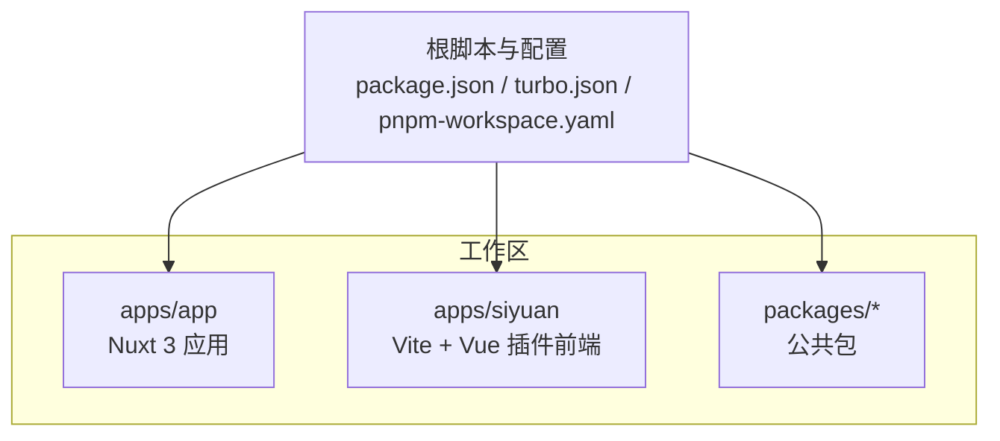
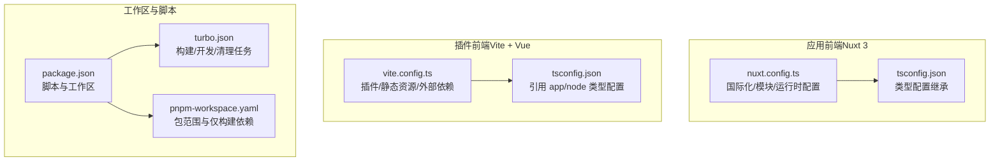
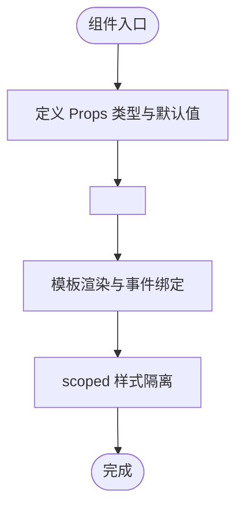
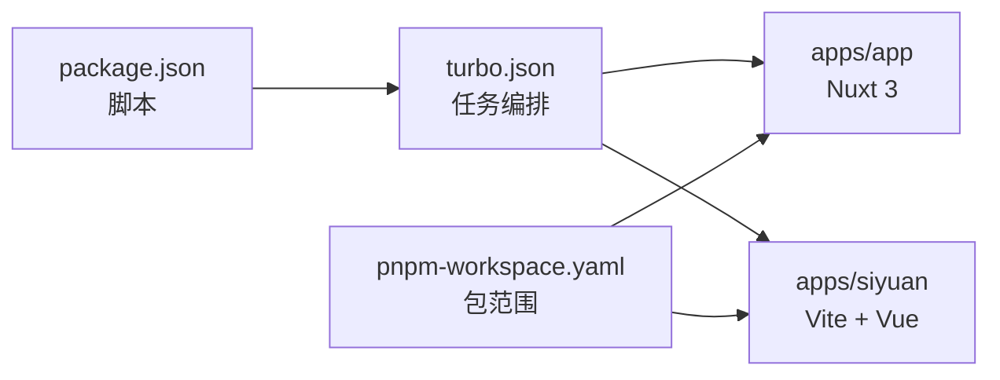

# 代码规范与质量

<cite>
**本文引用的文件**
- [apps/app/.eslintrc.cjs](file://apps/app/.eslintrc.cjs)
- [apps/siyuan/.eslintrc.cjs](file://apps/siyuan/.eslintrc.cjs)
- [apps/app/nuxt.config.ts](file://apps/app/nuxt.config.ts)
- [apps/siyuan/vite.config.ts](file://apps/siyuan/vite.config.ts)
- [apps/app/tsconfig.json](file://apps/app/tsconfig.json)
- [apps/siyuan/tsconfig.json](file://apps/siyuan/tsconfig.json)
- [package.json](file://package.json)
- [pnpm-workspace.yaml](file://pnpm-workspace.yaml)
- [turbo.json](file://turbo.json)
- [DEVELOPMENT.md](file://DEVELOPMENT.md)
- [README.md](file://README.md)
- [apps/app/components/public/Home.vue](file://apps/app/components/public/Home.vue)
- [apps/app/composables/useAppBase.ts](file://apps/app/composables/useAppBase.ts)
- [apps/app/utils/appLogger.ts](file://apps/app/utils/appLogger.ts)
- [apps/siyuan/src/main.ts](file://apps/siyuan/src/main.ts)
- [apps/siyuan/src/bootstrap.ts](file://apps/siyuan/src/bootstrap.ts)
- [apps/app/app.config.ts](file://apps/app/app.config.ts)
</cite>

## 目录
1. [引言](#引言)
2. [项目结构](#项目结构)
3. [核心组件](#核心组件)
4. [架构总览](#架构总览)
5. [详细组件分析](#详细组件分析)
6. [依赖分析](#依赖分析)
7. [性能考虑](#性能考虑)
8. [故障排查指南](#故障排查指南)
9. [结论](#结论)
10. [附录](#附录)

## 引言
本文件旨在为本项目建立一套系统化的代码规范与质量保证体系，覆盖以下方面：
- TypeScript 编码标准与类型安全实践
- Vue 组件开发规范（含 Composition API 使用、Props/Emits 规范、模板结构）
- 文件命名约定与目录结构原则
- ESLint 规则与 Prettier 格式化标准
- Git 提交信息规范
- 代码审查流程与质量门禁
- 错误处理模式、日志记录规范与性能监控要求
- 自动化代码检查工具的配置与使用
- 代码重构指导与遗留代码处理策略

本规范以现有仓库配置与代码实现为基础，结合最佳实践进行提炼与扩展，确保团队协作一致性与长期可维护性。

## 项目结构
本项目采用多包工作区（pnpm workspace）组织，核心模块包括：
- 应用前端（Nuxt 3）：apps/app
- Siyuan 插件前端（Vite + Vue）：apps/siyuan
- 公共包：packages/*
- 脚本与构建：根目录脚本与 Turbo 管道

**图表来源**
- [pnpm-workspace.yaml:1-9](file://pnpm-workspace.yaml#L1-L9)
- [package.json:1-27](file://package.json#L1-L27)
- [turbo.json:1-17](file://turbo.json#L1-L17)

**章节来源**
- [pnpm-workspace.yaml:1-9](file://pnpm-workspace.yaml#L1-L9)
- [package.json:1-27](file://package.json#L1-L27)
- [turbo.json:1-17](file://turbo.json#L1-L17)

## 核心组件
- Nuxt 3 应用配置与运行时环境
  - 国际化、UI 模块、Pinia 状态管理、Element Plus 集成
  - 运行时环境变量（默认类型、SiYuan API 地址、Provider 模式与地址）
- Vite + Vue 插件前端
  - 插件入口、引导挂载、静态资源复制与外部依赖声明
- 日志与工具
  - 轻量日志记录器封装、应用基础路径获取
- 配置与类型
  - 应用配置接口与默认值、TS 配置引用关系

**章节来源**
- [apps/app/nuxt.config.ts:1-125](file://apps/app/nuxt.config.ts#L1-L125)
- [apps/siyuan/vite.config.ts:1-136](file://apps/siyuan/vite.config.ts#L1-L136)
- [apps/app/utils/appLogger.ts:1-23](file://apps/app/utils/appLogger.ts#L1-L23)
- [apps/app/composables/useAppBase.ts:1-22](file://apps/app/composables/useAppBase.ts#L1-L22)
- [apps/app/app.config.ts:1-92](file://apps/app/app.config.ts#L1-L92)
- [apps/app/tsconfig.json:1-5](file://apps/app/tsconfig.json#L1-L5)
- [apps/siyuan/tsconfig.json:1-8](file://apps/siyuan/tsconfig.json#L1-L8)

## 架构总览
下图展示了前端应用与插件前端的构建与运行关系，以及关键配置对运行期行为的影响。

**图表来源**
- [apps/app/nuxt.config.ts:1-125](file://apps/app/nuxt.config.ts#L1-L125)
- [apps/siyuan/vite.config.ts:1-136](file://apps/siyuan/vite.config.ts#L1-L136)
- [apps/app/tsconfig.json:1-5](file://apps/app/tsconfig.json#L1-L5)
- [apps/siyuan/tsconfig.json:1-8](file://apps/siyuan/tsconfig.json#L1-L8)
- [package.json:1-27](file://package.json#L1-L27)
- [turbo.json:1-17](file://turbo.json#L1-L17)
- [pnpm-workspace.yaml:1-9](file://pnpm-workspace.yaml#L1-L9)

## 详细组件分析

### TypeScript 编码标准
- 类型安全
  - 使用严格类型配置，建议在项目中启用严格模式与合理约束，避免 any 的滥用。
  - 对外暴露的配置接口应明确字段含义与默认值，便于调用方理解与维护。
- 命名与导出
  - 常量与枚举使用大写与下划线风格；函数与类遵循驼峰命名；接口以 I 前缀或抽象语义命名。
- 模块化
  - 将通用逻辑抽取为 Composables 或 Utils，保持组件职责单一。
- 环境变量
  - 通过运行时配置集中管理公开变量，避免硬编码在业务代码中。

**章节来源**
- [apps/app/app.config.ts:26-92](file://apps/app/app.config.ts#L26-L92)
- [apps/app/nuxt.config.ts:114-121](file://apps/app/nuxt.config.ts#L114-L121)
- [apps/app/tsconfig.json:1-5](file://apps/app/tsconfig.json#L1-L5)
- [apps/siyuan/tsconfig.json:1-8](file://apps/siyuan/tsconfig.json#L1-L8)

### Vue 组件开发规范
- 组件结构
  - 使用 <script setup> 与组合式 API，Props 明确类型与默认值；事件使用 emits 并统一命名。
  - 模板结构清晰，避免复杂表达式，将逻辑移至 Composables。
- 组合式函数
  - 将可复用逻辑封装为 Composables，如 useAppBase、useSiyuanApi 等，提升可测试性与复用率。
- 样式与作用域
  - 优先使用 scoped 样式，必要时通过深度选择器控制第三方组件样式。
- 示例参考
  - 公共首页组件通过组合式函数注入参数并复用详情组件，体现“低耦合、高内聚”。

**图表来源**
- [apps/app/components/public/Home.vue:10-19](file://apps/app/components/public/Home.vue#L10-L19)

**章节来源**
- [apps/app/components/public/Home.vue:1-20](file://apps/app/components/public/Home.vue#L1-L20)
- [apps/app/composables/useAppBase.ts:1-22](file://apps/app/composables/useAppBase.ts#L1-L22)

### ESLint 配置与规则
- 应用前端（Nuxt 3）
  - 继承自自定义配置集，根目录开启规则，确保项目统一风格。
- 插件前端（Vue）
  - 启用 Vue 3 基础规则集，支持 *.vue 文件的特定规则覆盖。
- 规则建议
  - 保持导入顺序一致、禁止未使用变量、强制使用单引号或模板字符串、限制行长度与缩进。
  - 对 Vue 组件，建议启用属性排序、事件命名一致性与指令简写规范。

**章节来源**
- [apps/app/.eslintrc.cjs:1-8](file://apps/app/.eslintrc.cjs#L1-L8)
- [apps/siyuan/.eslintrc.cjs:1-15](file://apps/siyuan/.eslintrc.cjs#L1-L15)

### Prettier 格式化标准
- 统一格式化工具与规则，建议与 ESLint 冲突规则自动修复。
- 推荐配置项：单引号、尾逗号、行末分号、缩进宽度、最大列宽、尾随换行符。
- 在 CI 中执行格式化检查，失败即阻断合并。

### Git 提交信息规范
- 规范格式：type(scope): subject
  - type：feat/fix/docs/style/refactor/perf/test/build/ci/chore/revert
  - scope：影响范围（如 app、siyuan、eslint-config-custom）
  - subject：简短描述，首字母小写，不以句号结尾
- 示例：feat(app): 添加日志工具类；fix(siyuan): 修复外部依赖声明

### 代码审查流程与质量门禁
- 门禁清单
  - 通过 ESLint/Prettier 检查；无新增未使用变量/未处理 Promise；无 console.warn/log；无敏感信息泄露。
  - 单元测试覆盖率达标；关键路径有测试覆盖。
  - CI 通过：构建、打包、测试、安全扫描。
- 审查要点
  - 设计一致性：是否遵循现有组件/组合式函数模式；是否引入新反模式。
  - 性能与安全：是否存在潜在内存泄漏、未捕获异常、敏感数据明文存储。
  - 文档与注释：变更是否同步更新 README/变更日志；注释是否清晰。

### 错误处理模式与日志记录规范
- 错误处理
  - 统一使用 try/catch 包裹异步操作；对外抛出明确错误类型与上下文信息。
  - 对网络请求与外部 API 调用，区分重试策略与降级方案。
- 日志记录
  - 使用轻量日志器封装，按模块/功能划分命名空间；开发环境输出更详细日志。
  - 避免在日志中打印敏感信息；生产环境避免输出堆栈细节。
- 性能监控
  - 关键路径埋点（首屏、路由切换、API 响应时间）；上报采样与聚合统计。

**章节来源**
- [apps/app/utils/appLogger.ts:1-23](file://apps/app/utils/appLogger.ts#L1-L23)

### 性能监控与优化
- 构建优化
  - 生产环境关闭 sourcemap；按需加载第三方库；拆分代码与懒加载页面。
- 运行时优化
  - 合理使用 keep-alive；避免不必要的响应式数据；组件拆分与计算属性缓存。
- 监控指标
  - 首屏时间、交互延迟、内存占用、错误率；结合浏览器开发者工具与性能面板。

### 自动化代码检查工具配置与使用
- 本地检查
  - 安装依赖后，执行 lint 脚本；修复可自动修复的问题；剩余问题需人工处理。
- CI 集成
  - 在流水线中加入安装、构建、lint、test 步骤；失败即中断。
- 脚本与任务
  - 根脚本提供统一入口；Turbo 管理跨包任务依赖与缓存。

**章节来源**
- [package.json:4-20](file://package.json#L4-L20)
- [turbo.json:1-17](file://turbo.json#L1-L17)

### 代码重构指导与遗留代码处理策略
- 重构原则
  - 小步快跑，先加测试再改代码；保持对外 API 稳定；逐步替换旧实现。
- 遗留代码处理
  - 识别高风险区域（未测试、复杂分支、重复逻辑）；优先处理阻塞迭代的缺陷。
  - 为遗留代码添加注释与边界条件说明；逐步迁移至新架构。

## 依赖分析
- 工作区与包范围
  - 通过 pnpm-workspace.yaml 约束包范围，确保构建与发布一致性。
- 任务编排
  - Turbo 定义 build/dev/lint/clean 等任务，支持依赖拓扑与缓存。
- 开发与运行
  - Nuxt 3 提供开发工具与运行时配置；Vite 插件前端负责构建与外部依赖声明。

**图表来源**
- [package.json:1-27](file://package.json#L1-L27)
- [turbo.json:1-17](file://turbo.json#L1-L17)
- [pnpm-workspace.yaml:1-9](file://pnpm-workspace.yaml#L1-L9)

**章节来源**
- [pnpm-workspace.yaml:1-9](file://pnpm-workspace.yaml#L1-L9)
- [turbo.json:1-17](file://turbo.json#L1-L17)
- [package.json:1-27](file://package.json#L1-L27)

## 性能考虑
- 构建阶段
  - 生产构建关闭 sourcemap，按需最小化；拆分第三方库与业务代码。
- 运行阶段
  - 合理使用响应式与计算属性；避免在模板中执行复杂逻辑；组件懒加载。
- 监控与度量
  - 记录关键指标并定期回顾；结合浏览器性能面板定位瓶颈。

## 故障排查指南
- 开发启动
  - 使用根脚本提供的命令启动应用与插件前端；确认环境变量与端口占用。
- 构建产物
  - 查看构建输出目录结构；确认静态资源复制与外部依赖声明正确。
- 日志定位
  - 通过日志器命名空间快速定位模块；开发环境开启详细日志以便调试。

**章节来源**
- [DEVELOPMENT.md:19-43](file://DEVELOPMENT.md#L19-L43)
- [apps/siyuan/vite.config.ts:75-134](file://apps/siyuan/vite.config.ts#L75-L134)
- [apps/app/utils/appLogger.ts:20-22](file://apps/app/utils/appLogger.ts#L20-L22)

## 结论
本规范以现有配置与代码实现为基础，从 TypeScript、Vue 组件、ESLint/Prettier、Git 提交、CI 门禁、错误处理与日志、性能监控等方面给出系统化建议。建议团队在日常开发中严格执行，并持续通过代码审查与自动化工具保障质量与一致性。

## 附录
- 快速参考
  - 启动应用前端：参见开发文档中的命令与访问地址
  - 启动插件前端：参见开发文档中的命令与访问地址
  - 构建与打包：参见开发文档中的构建步骤与产物说明
  - 运行时配置：参见 Nuxt 3 与 Vite 配置文件中的运行时变量与模块集成

**章节来源**
- [DEVELOPMENT.md:19-84](file://DEVELOPMENT.md#L19-L84)
- [README.md:7-28](file://README.md#L7-L28)
- [apps/app/nuxt.config.ts:20-124](file://apps/app/nuxt.config.ts#L20-L124)
- [apps/siyuan/vite.config.ts:16-136](file://apps/siyuan/vite.config.ts#L16-L136)