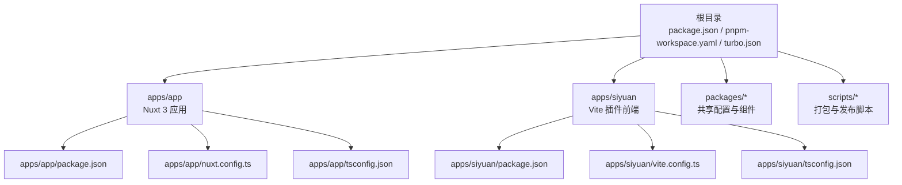
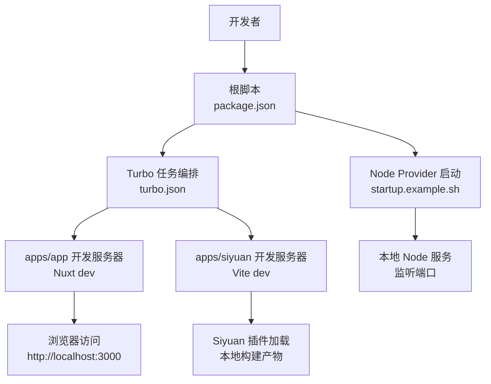
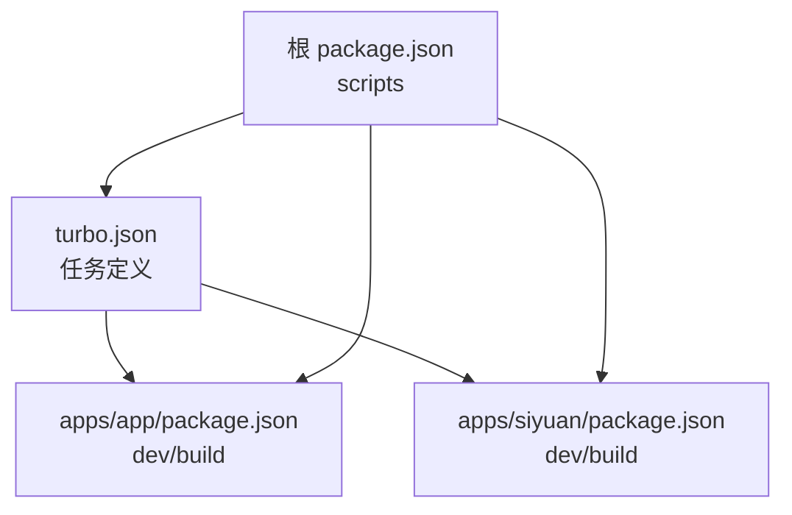

# 开发环境搭建

<cite>
**本文引用的文件**
- [package.json](file://package.json)
- [pnpm-workspace.yaml](file://pnpm-workspace.yaml)
- [turbo.json](file://turbo.json)
- [DEVELOPMENT.md](file://DEVELOPMENT.md)
- [apps/app/package.json](file://apps/app/package.json)
- [apps/siyuan/package.json](file://apps/siyuan/package.json)
- [apps/app/nuxt.config.ts](file://apps/app/nuxt.config.ts)
- [apps/siyuan/vite.config.ts](file://apps/siyuan/vite.config.ts)
- [apps/app/tsconfig.json](file://apps/app/tsconfig.json)
- [apps/siyuan/tsconfig.json](file://apps/siyuan/tsconfig.json)
- [apps/app/.gitignore](file://apps/app/.gitignore)
- [apps/siyuan/.gitignore](file://apps/siyuan/.gitignore)
- [startup.example.sh](file://startup.example.sh)
- [plugin.json](file://plugin.json)
- [apps/app/nuxt.node.config.ts](file://apps/app/nuxt.node.config.ts)
- [apps/app/nuxt.cloudflare.config.ts](file://apps/app/nuxt.cloudflare.config.ts)
- [apps/app/nuxt.vercel.config.ts](file://apps/app/nuxt.vercel.config.ts)
- [apps/app/nuxt.siyuan.config.ts](file://apps/app/nuxt.siyuan.config.ts)
- [apps/app/script/dev.sh](file://apps/app/script/dev.sh)
- [startup.sh](file://startup.sh)
- [apps/app/composables/useAuthModeFetch.ts](file://apps/app/composables/useAuthModeFetch.ts)
- [apps/app/stores/useStaticSettingStore.ts](file://apps/app/stores/useStaticSettingStore.ts)
</cite>

## 更新摘要
**所做更改**
- 新增 Node provider 模式的环境变量配置说明
- 更新开发服务器启动章节，包含 NUXT_PUBLIC_DEFAULT_TYPE、NUXT_PUBLIC_PROVIDER_MODE 和 NUXT_PUBLIC_PROVIDER_URL 环境变量
- 新增环境变量验证与调试方法
- 更新故障排除指南，增加环境变量相关问题排查

## 目录
1. [简介](#简介)
2. [项目结构](#项目结构)
3. [核心组件](#核心组件)
4. [架构总览](#架构总览)
5. [详细组件分析](#详细组件分析)
6. [依赖关系分析](#依赖关系分析)
7. [性能考虑](#性能考虑)
8. [故障排除指南](#故障排除指南)
9. [结论](#结论)
10. [附录](#附录)

## 简介
本指南面向首次参与本项目的开发者，提供从零开始搭建开发环境的完整流程。内容覆盖 Node.js 版本要求、包管理器选择（推荐 pnpm）、IDE 配置建议（VS Code 插件推荐）、项目克隆与依赖安装、monorepo 工作区配置、开发服务器启动与热重载、调试工具设置、跨平台（Windows、macOS、Linux）特殊配置、常见问题排查与解决方案，以及开发环境验证方法。

**更新** 新增 Node provider 模式的环境变量配置，包括 NUXT_PUBLIC_DEFAULT_TYPE、NUXT_PUBLIC_PROVIDER_MODE 和 NUXT_PUBLIC_PROVIDER_URL 的详细说明和使用方法。

## 项目结构
该项目采用 pnpm monorepo 结构，根目录通过工作区配置声明子包范围，并使用 Turbo 管理多包构建与开发任务。前端应用位于 apps/app（基于 Nuxt 3 的 Web 应用），Siyuan 插件应用位于 apps/siyuan（基于 Vite 的插件前端），并通过统一的脚本与配置实现开发与构建。

**图表来源**
- [pnpm-workspace.yaml:1-9](file://pnpm-workspace.yaml#L1-L9)
- [turbo.json:1-17](file://turbo.json#L1-L17)
- [apps/app/package.json:1-41](file://apps/app/package.json#L1-L41)
- [apps/siyuan/package.json:1-43](file://apps/siyuan/package.json#L1-L43)

**章节来源**
- [pnpm-workspace.yaml:1-9](file://pnpm-workspace.yaml#L1-L9)
- [turbo.json:1-17](file://turbo.json#L1-L17)
- [package.json:1-27](file://package.json#L1-L27)

## 核心组件
- 包管理器与版本
  - 推荐使用 pnpm，版本在根目录的 packageManager 字段中声明，确保团队一致性。
- Monorepo 工作区
  - 通过 pnpm-workspace.yaml 声明 apps/* 与 packages/* 子包范围；仅构建依赖项在该文件中声明，避免不必要的二进制安装。
- 顶层脚本与任务编排
  - 根 package.json 提供统一的开发、构建、打包、清理等脚本；turbo.json 定义构建缓存、持久化任务与输入输出。
- 前端应用
  - apps/app：Nuxt 3 应用，负责 Web 端展示与国际化；配置了模块、国际化策略、静态资源注入与运行时环境变量。
  - apps/siyuan：Vite 应用，负责 Siyuan 插件前端，支持热重载与静态资源复制。
- 启动与运行
  - startup.example.sh 展示了 Node Provider 模式的本地启动方式，可作为本地服务启动参考。

**更新** 新增 Node provider 模式的核心配置，包括默认类型设置、Provider 模式开关和 Provider 服务地址配置。

**章节来源**
- [package.json:22-26](file://package.json#L22-L26)
- [pnpm-workspace.yaml:1-9](file://pnpm-workspace.yaml#L1-L9)
- [turbo.json:3-14](file://turbo.json#L3-L14)
- [apps/app/nuxt.config.ts:20-124](file://apps/app/nuxt.config.ts#L20-L124)
- [apps/siyuan/vite.config.ts:16-136](file://apps/siyuan/vite.config.ts#L16-L136)
- [startup.example.sh:1-7](file://startup.example.sh#L1-L7)

## 架构总览
下图展示了开发阶段的典型交互：开发者通过根脚本触发任务，Turbo 并行调度各子包任务；前端应用分别启动开发服务器，插件前端在 Siyuan 中加载；Node Provider 模式下，本地 Node 服务提供数据与渲染能力。

**图表来源**
- [package.json:4-21](file://package.json#L4-L21)
- [turbo.json:3-14](file://turbo.json#L3-L14)
- [apps/app/nuxt.config.ts:15-23](file://apps/app/nuxt.config.ts#L15-L23)
- [apps/siyuan/vite.config.ts:10-11](file://apps/siyuan/vite.config.ts#L10-L11)
- [startup.example.sh:3-7](file://startup.example.sh#L3-L7)

## 详细组件分析

### Node.js 与包管理器
- Node.js 版本
  - 项目未在根配置中显式声明 Node 版本，但 apps/siyuan 的 TypeScript 版本与 Vite 版本对 Node 18+ 兼容性良好。建议使用 Node 18 或更高版本，以确保与依赖生态一致。
- 包管理器
  - 推荐使用 pnpm，根 package.json 显式声明了 packageManager 字段，保证团队使用统一版本的 pnpm，减少锁文件差异带来的问题。

**章节来源**
- [package.json:25](file://package.json#L25)
- [apps/siyuan/package.json:28](file://apps/siyuan/package.json#L28)
- [apps/siyuan/package.json:39](file://apps/siyuan/package.json#L39)

### IDE 配置建议（VS Code）
- 推荐插件
  - Vue Language Features (Volar)：提供 Vue 3 语法高亮与类型支持。
  - ESLint：统一代码风格与质量检查。
  - Prettier：格式化代码，配合 .editorconfig 使用更佳。
  - TypeScript Importer：自动导入 TypeScript 模块。
  - Path Intellisense：智能路径补全。
  - Bracket Pair Colorizer：括号配对着色，提升可读性。
- VS Code 工作区设置
  - 建议在项目根目录放置 .vscode/settings.json，设置默认 formatter、启用 ESLint、关闭自动保存等，确保团队一致的编辑体验。

**章节来源**
- [apps/app/.gitignore:16-25](file://apps/app/.gitignore#L16-L25)
- [apps/siyuan/.gitignore:15-24](file://apps/siyuan/.gitignore#L15-L24)

### 项目克隆与依赖安装
- 步骤
  1) 克隆仓库到本地。
  2) 进入项目根目录，执行 pnpm install 安装所有依赖。
  3) 等待 pnpm 完成安装后，工作区中的子包即可直接使用 pnpm 命令进行开发与构建。
- Monorepo 工作区配置
  - pnpm-workspace.yaml 声明了 apps/* 与 packages/*，确保 pnpm 将这些目录识别为工作区成员。
  - 仅构建依赖项在该文件中声明，避免重复安装大型二进制包。

**章节来源**
- [pnpm-workspace.yaml:1-9](file://pnpm-workspace.yaml#L1-L9)
- [DEVELOPMENT.md:5-7](file://DEVELOPMENT.md#L5-L7)

### 开发服务器启动与热重载
- Web 应用（apps/app）
  - 开发模式：通过根脚本启动 Nuxt 开发服务器，支持 --host 参数对外网访问。
  - 热重载：Nuxt 内置热更新机制，修改源码后浏览器自动刷新。
  - 国际化与静态资源：Nuxt 配置了多语言与静态资源注入，开发时自动加载本地资源。
- Siyuan 插件前端（apps/siyuan）
  - 开发模式：通过 Vite 启动，支持 watch 模式与热重载。
  - 热重载：Vite 与 Rollup 插件组合实现快速刷新；静态资源通过 vite-static-copy 复制。
  - 构建产物：输出到根目录下的 dist/siyuan，便于在 Siyuan 中加载。
- Node Provider 模式
  - 通过 startup.example.sh 启动本地 Node 服务，支持自定义端口与基础路径。
  - 环境变量配置：NUXT_PUBLIC_DEFAULT_TYPE=node、NUXT_PUBLIC_PROVIDER_MODE=true、NUXT_PUBLIC_PROVIDER_URL=http://localhost:8086

**更新** 新增 Node provider 模式的环境变量配置说明，包括默认类型设置、Provider 模式开关和 Provider 服务地址配置。

**章节来源**
- [DEVELOPMENT.md:21-43](file://DEVELOPMENT.md#L21-L43)
- [apps/app/nuxt.config.ts:90-104](file://apps/app/nuxt.config.ts#L90-L104)
- [apps/siyuan/vite.config.ts:17-57](file://apps/siyuan/vite.config.ts#L17-L57)
- [apps/siyuan/vite.config.ts:102-121](file://apps/siyuan/vite.config.ts#L102-L121)
- [startup.example.sh:3-7](file://startup.example.sh#L3-L7)
- [apps/app/script/dev.sh:12-15](file://apps/app/script/dev.sh#L12-L15)

### 调试工具设置
- 浏览器端
  - Nuxt 在开发模式下自动注入 Eruda 调试工具，便于移动端调试。
- Node Provider 服务
  - 可通过环境变量控制默认类型、Provider 模式与 Provider 地址，便于切换不同后端或本地服务。
- 插件前端
  - Vite 配置了开发时的 define 变量，便于在代码中区分开发/生产模式。

**更新** 新增环境变量调试方法，包括如何验证 NUXT_PUBLIC_DEFAULT_TYPE、NUXT_PUBLIC_PROVIDER_MODE 和 NUXT_PUBLIC_PROVIDER_URL 的配置。

**章节来源**
- [apps/app/nuxt.config.ts:60-86](file://apps/app/nuxt.config.ts#L60-L86)
- [apps/app/nuxt.config.ts:114-121](file://apps/app/nuxt.config.ts#L114-L121)
- [apps/siyuan/vite.config.ts:65-69](file://apps/siyuan/vite.config.ts#L65-L69)

### 跨平台特殊配置
- Windows
  - 使用 WSL2 可获得更好的 Unix 工具链与文件系统性能；若使用原生 Windows，请确保 pnpm 与 Node 的版本兼容。
  - Git 忽略文件已包含 .DS_Store 与常见 IDE 临时文件，避免误提交。
- macOS
  - 默认使用 BSD 系统工具，建议安装 gnu 工具链以保持与 Linux 一致的行为。
- Linux
  - 建议使用发行版自带的包管理器安装 Node 与 pnpm；注意权限问题，优先使用非 root 用户并配置好 npm/pnpm 缓存目录。

**章节来源**
- [apps/app/.gitignore:17](file://apps/app/.gitignore#L17)
- [apps/siyuan/.gitignore:19](file://apps/siyuan/.gitignore#L19)

### 环境变量配置详解
- NUXT_PUBLIC_DEFAULT_TYPE
  - 作用：设置默认运行模式，支持 "node"、"siyuan"、"cloudflare"、"vercel" 等模式
  - 默认值：node
  - 使用场景：开发时设置为 node，生产环境根据部署平台设置相应值
- NUXT_PUBLIC_PROVIDER_MODE
  - 作用：启用 Provider 模式，使应用通过外部服务获取配置和数据
  - 默认值：false
  - 使用场景：需要连接远程 Node 服务时启用
- NUXT_PUBLIC_PROVIDER_URL
  - 作用：指定 Provider 服务的地址
  - 默认值：http://127.0.0.1:8086
  - 使用场景：开发时指向本地 Node 服务，生产环境指向实际的服务地址

**新增** 详细介绍三个关键环境变量的作用、默认值和使用场景。

**章节来源**
- [apps/app/nuxt.config.ts:114-121](file://apps/app/nuxt.config.ts#L114-L121)
- [apps/app/nuxt.node.config.ts:114-121](file://apps/app/nuxt.node.config.ts#L114-L121)
- [apps/app/nuxt.cloudflare.config.ts:115-122](file://apps/app/nuxt.cloudflare.config.ts#L115-L122)
- [apps/app/nuxt.vercel.config.ts:122-130](file://apps/app/nuxt.vercel.config.ts#L122-L130)
- [apps/app/nuxt.siyuan.config.ts:121-129](file://apps/app/nuxt.siyuan.config.ts#L121-L129)

### 开发环境验证
- 依赖安装验证
  - 执行 pnpm install 后，确认 apps/app 与 apps/siyuan 的 node_modules 均成功创建。
- 开发服务器验证
  - 启动 apps/app 开发服务器后，访问 http://localhost:3000 验证页面加载。
  - 启动 apps/siyuan 开发服务器后，确认热重载生效且静态资源复制正常。
- Node Provider 验证
  - 按 startup.example.sh 启动本地 Node 服务，访问对应端口与路径，确认接口可用。
- 环境变量验证
  - 在 apps/app 的 nuxt.config.ts 中配置的运行时变量可在开发时通过环境变量覆盖，验证其生效。
  - 通过浏览器控制台检查环境变量是否正确传递到客户端。

**更新** 新增环境变量验证方法，包括如何检查 NUXT_PUBLIC_DEFAULT_TYPE、NUXT_PUBLIC_PROVIDER_MODE 和 NUXT_PUBLIC_PROVIDER_URL 的配置。

**章节来源**
- [DEVELOPMENT.md:21-43](file://DEVELOPMENT.md#L21-L43)
- [startup.example.sh:3-7](file://startup.example.sh#L3-L7)
- [apps/app/nuxt.config.ts:114-121](file://apps/app/nuxt.config.ts#L114-L121)

## 依赖关系分析
下图展示了根脚本、Turbo 与子包之间的依赖关系，以及开发任务的执行顺序。

**图表来源**
- [package.json:4-21](file://package.json#L4-L21)
- [turbo.json:3-14](file://turbo.json#L3-L14)
- [apps/app/package.json:5-11](file://apps/app/package.json#L5-L11)
- [apps/siyuan/package.json:6-12](file://apps/siyuan/package.json#L6-L12)

**章节来源**
- [package.json:4-21](file://package.json#L4-L21)
- [turbo.json:3-14](file://turbo.json#L3-L14)

## 性能考虑
- 使用 pnpm 的硬链接与符号链接特性，减少磁盘占用与安装时间。
- Turbo 的并行任务与缓存机制可显著缩短构建时间，建议在 CI/CD 中开启缓存。
- apps/app 的 Nuxt 配置启用了开发工具与按需加载，减少首屏负担。
- apps/siyuan 的 Vite 构建在开发模式下禁用压缩与最小化，提升构建速度。

## 故障排除指南
- 端口冲突
  - apps/app 默认端口为 3000，apps/siyuan 默认端口为 6808；如冲突，可在启动命令中添加 --port 参数或通过环境变量调整。
  - Node Provider 服务可通过 PORT 环境变量更改监听端口。
- 权限问题
  - 在 Linux/macOS 上，避免使用 sudo 安装全局依赖；若出现权限错误，检查用户目录的 pnpm 缓存与全局 bin 目录权限。
- 热重载不生效
  - 确认 apps/siyuan 的 watch 模式已启用；检查 vite.config.ts 中的 rollup 插件与静态资源复制配置。
- 环境变量未生效
  - apps/app 的运行时变量需通过环境变量传入；确认 .env 文件与 nuxt.config.ts 中的 runtimeConfig 配置一致。
  - 检查 NUXT_PUBLIC_DEFAULT_TYPE、NUXT_PUBLIC_PROVIDER_MODE 和 NUXT_PUBLIC_PROVIDER_URL 是否正确设置。
- 插件加载失败
  - 确认 apps/siyuan 的构建产物已生成至 dist/siyuan；在 Siyuan 中加载插件时，确保路径与文件名正确。
- Provider 模式连接失败
  - 检查 NUXT_PUBLIC_PROVIDER_URL 是否指向正确的 Node 服务地址。
  - 确认 Node 服务已启动且端口开放。
  - 验证网络连接和防火墙设置。

**更新** 新增环境变量相关问题的排查方法，包括 Provider 模式连接失败的诊断步骤。

**章节来源**
- [DEVELOPMENT.md:21-43](file://DEVELOPMENT.md#L21-L43)
- [apps/siyuan/vite.config.ts:102-121](file://apps/siyuan/vite.config.ts#L102-L121)
- [apps/app/nuxt.config.ts:114-121](file://apps/app/nuxt.config.ts#L114-L121)
- [startup.example.sh:5](file://startup.example.sh#L5)

## 结论
通过本指南，您可以在本地快速搭建并运行本项目的开发环境。建议优先使用 pnpm 与 Node 18+，遵循 monorepo 工作区配置，利用根脚本与 Turbo 实现高效开发与构建。遇到问题时，可依据故障排除指南逐项排查，确保开发流程顺畅。

**更新** 新增 Node provider 模式的环境变量配置指导，帮助开发者更好地理解和使用 Provider 模式。

## 附录
- 快速启动命令
  - 安装依赖：pnpm install
  - 启动 Web 应用：pnpm dev -F @terwer/share-pro-app -- --host
  - 启动 Siyuan 插件前端：pnpm dev -F siyuan-blog
  - 启动 Node Provider：pnpm start
  - 开发模式启动（含环境变量）：NUXT_PUBLIC_DEFAULT_TYPE=node NUXT_PUBLIC_PROVIDER_MODE=true NUXT_PUBLIC_PROVIDER_URL=http://localhost:8086 pnpm dev -F @terwer/share-pro-app -- --host
- 关键配置文件
  - apps/app/nuxt.config.ts：Nuxt 开发配置与运行时变量
  - apps/siyuan/vite.config.ts：Vite 开发配置与热重载
  - pnpm-workspace.yaml：工作区与仅构建依赖声明
  - turbo.json：任务编排与缓存策略
- 环境变量参考
  - NUXT_PUBLIC_DEFAULT_TYPE：默认运行模式（node/siyuan/cloudflare/vercel）
  - NUXT_PUBLIC_PROVIDER_MODE：Provider 模式开关（true/false）
  - NUXT_PUBLIC_PROVIDER_URL：Provider 服务地址（http://localhost:8086）

**更新** 新增环境变量参考和开发模式启动命令示例。