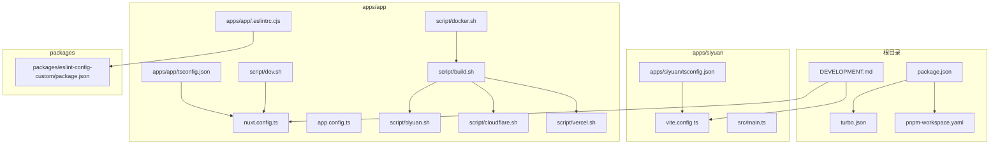
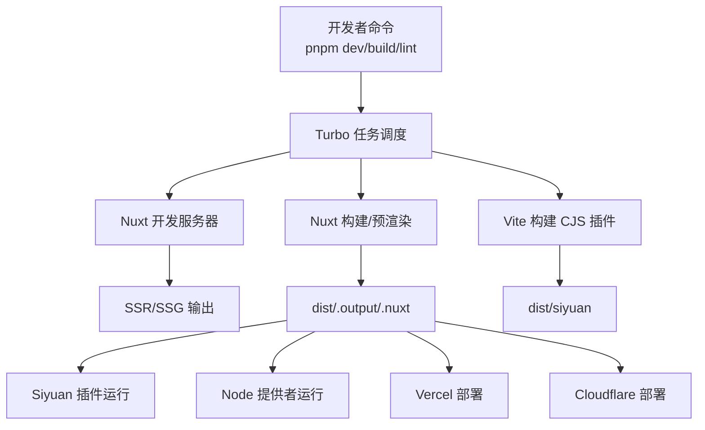
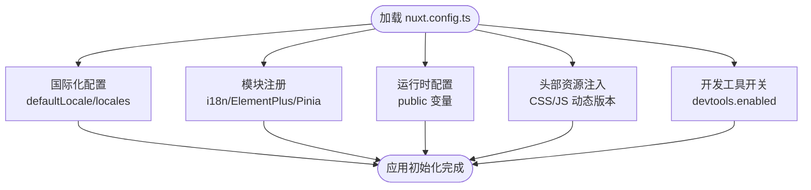
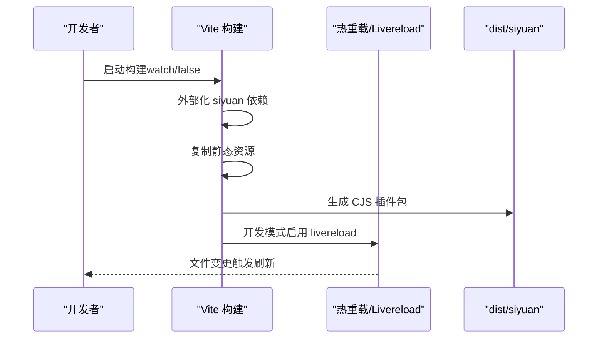
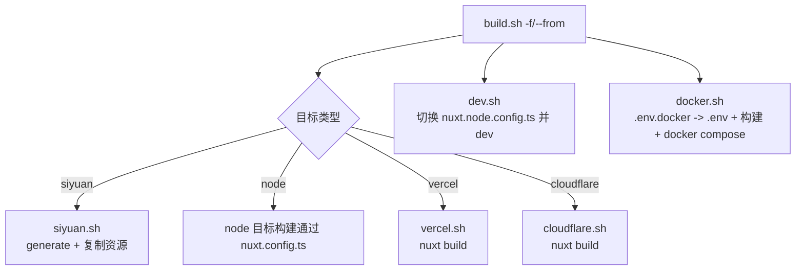
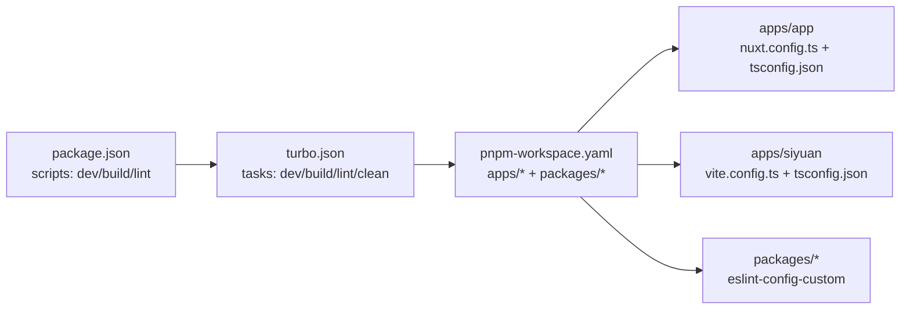
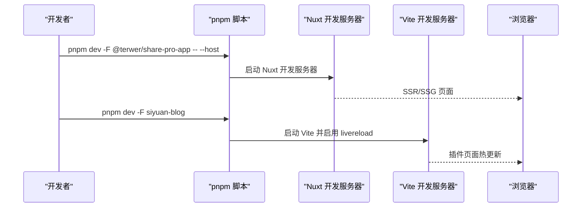

# 开发者指南

<cite>
**本文引用的文件**
- [package.json](file://package.json)
- [turbo.json](file://turbo.json)
- [pnpm-workspace.yaml](file://pnpm-workspace.yaml)
- [DEVELOPMENT.md](file://DEVELOPMENT.md)
- [apps/app/nuxt.config.ts](file://apps/app/nuxt.config.ts)
- [apps/app/app.config.ts](file://apps/app/app.config.ts)
- [apps/app/.eslintrc.cjs](file://apps/app/.eslintrc.cjs)
- [packages/eslint-config-custom/package.json](file://packages/eslint-config-custom/package.json)
- [apps/app/tsconfig.json](file://apps/app/tsconfig.json)
- [apps/siyuan/vite.config.ts](file://apps/siyuan/vite.config.ts)
- [apps/siyuan/tsconfig.json](file://apps/siyuan/tsconfig.json)
- [apps/siyuan/src/main.ts](file://apps/siyuan/src/main.ts)
- [apps/app/script/dev.sh](file://apps/app/script/dev.sh)
- [apps/app/script/build.sh](file://apps/app/script/build.sh)
- [apps/app/script/siyuan.sh](file://apps/app/script/siyuan.sh)
- [apps/app/script/cloudflare.sh](file://apps/app/script/cloudflare.sh)
- [apps/app/script/vercel.sh](file://apps/app/script/vercel.sh)
- [apps/app/script/docker.sh](file://apps/app/script/docker.sh)
</cite>

## 目录
1. [简介](#简介)
2. [项目结构](#项目结构)
3. [核心组件](#核心组件)
4. [架构总览](#架构总览)
5. [详细组件分析](#详细组件分析)
6. [依赖关系分析](#依赖关系分析)
7. [性能与内存优化](#性能与内存优化)
8. [测试与持续集成](#测试与持续集成)
9. [代码规范与质量保障](#代码规范与质量保障)
10. [开发环境搭建与调试](#开发环境搭建与调试)
11. [故障排查指南](#故障排查指南)
12. [结论](#结论)
13. [附录](#附录)

## 简介
本指南面向参与 Siyuan 插件博客项目的开发者，覆盖从开发环境搭建、代码组织与命名约定、构建系统与多项目策略、测试与 CI 流程、性能优化到团队协作与版本控制的最佳实践。项目采用 pnpm monorepo + Turbo 的多项目工作流，前端基于 Nuxt 3（SSR/SSG），插件端基于 Vite，支持多部署目标（Siyuan 插件、Node 提供者、Vercel、Cloudflare）。

## 项目结构
项目采用 pnpm workspace + Turbo 管理多包，核心目录与职责如下：
- apps/app：Nuxt 3 前端应用，支持 SSR/SSG，适配多部署目标
- apps/siyuan：Siyuan 插件打包与运行入口，使用 Vite 构建 CJS 插件包
- packages/*：共享配置与 UI 组件库（如 eslint-config-custom）
- scripts/*：构建与发布辅助脚本
- 根级配置：package.json、turbo.json、pnpm-workspace.yaml、DEVELOPMENT.md 等

**图表来源**
- [package.json:1-27](file://package.json#L1-L27)
- [turbo.json:1-17](file://turbo.json#L1-L17)
- [pnpm-workspace.yaml:1-9](file://pnpm-workspace.yaml#L1-L9)
- [DEVELOPMENT.md:1-114](file://DEVELOPMENT.md#L1-L114)
- [apps/app/nuxt.config.ts:1-125](file://apps/app/nuxt.config.ts#L1-L125)
- [apps/app/app.config.ts:1-92](file://apps/app/app.config.ts#L1-L92)
- [apps/app/.eslintrc.cjs:1-8](file://apps/app/.eslintrc.cjs#L1-L8)
- [packages/eslint-config-custom/package.json:1-17](file://packages/eslint-config-custom/package.json#L1-L17)
- [apps/app/tsconfig.json:1-5](file://apps/app/tsconfig.json#L1-L5)
- [apps/siyuan/vite.config.ts:1-136](file://apps/siyuan/vite.config.ts#L1-L136)
- [apps/siyuan/tsconfig.json:1-8](file://apps/siyuan/tsconfig.json#L1-L8)
- [apps/siyuan/src/main.ts:1-13](file://apps/siyuan/src/main.ts#L1-L13)
- [apps/app/script/dev.sh:1-15](file://apps/app/script/dev.sh#L1-L15)
- [apps/app/script/build.sh:1-63](file://apps/app/script/build.sh#L1-L63)
- [apps/app/script/siyuan.sh:1-31](file://apps/app/script/siyuan.sh#L1-L31)
- [apps/app/script/cloudflare.sh:1-16](file://apps/app/script/cloudflare.sh#L1-L16)
- [apps/app/script/vercel.sh:1-16](file://apps/app/script/vercel.sh#L1-L16)
- [apps/app/script/docker.sh:1-18](file://apps/app/script/docker.sh#L1-L18)

**章节来源**
- [package.json:1-27](file://package.json#L1-L27)
- [turbo.json:1-17](file://turbo.json#L1-L17)
- [pnpm-workspace.yaml:1-9](file://pnpm-workspace.yaml#L1-L9)
- [DEVELOPMENT.md:1-114](file://DEVELOPMENT.md#L1-L114)

## 核心组件
- Nuxt 3 前端应用（apps/app）
  - 配置国际化、UI 组件自动导入、运行时环境变量、开发工具开关等
  - 支持多部署目标配置（Siyuan、Node、Vercel、Cloudflare）
- Siyuan 插件（apps/siyuan）
  - Vite 构建 CJS 插件包，支持热重载与静态资源复制
- 共享 ESLint 配置（packages/eslint-config-custom）
  - 统一前端代码风格与 TypeScript 规则
- 构建与发布脚本（apps/app/script/*）
  - 提供多目标构建、开发启动、Docker 集成等

**章节来源**
- [apps/app/nuxt.config.ts:1-125](file://apps/app/nuxt.config.ts#L1-L125)
- [apps/siyuan/vite.config.ts:1-136](file://apps/siyuan/vite.config.ts#L1-L136)
- [packages/eslint-config-custom/package.json:1-17](file://packages/eslint-config-custom/package.json#L1-L17)
- [apps/app/script/dev.sh:1-15](file://apps/app/script/dev.sh#L1-L15)
- [apps/app/script/build.sh:1-63](file://apps/app/script/build.sh#L1-L63)

## 架构总览
整体架构由“多包工作流 + 多部署目标”构成。Turbo 管理任务依赖与缓存；Nuxt 3 负责前端渲染与静态生成；Vite 负责 Siyuan 插件构建；脚本负责多目标编排与打包。

**图表来源**
- [package.json:4-21](file://package.json#L4-L21)
- [turbo.json:3-14](file://turbo.json#L3-L14)
- [apps/app/nuxt.config.ts:1-125](file://apps/app/nuxt.config.ts#L1-L125)
- [apps/siyuan/vite.config.ts:75-134](file://apps/siyuan/vite.config.ts#L75-L134)

## 详细组件分析

### Nuxt 3 前端应用
- 功能要点
  - 国际化：默认 zh_CN，支持 en_US；禁用浏览器语言检测
  - UI 自动导入：Element Plus 解析器自动注册
  - 运行时配置：公开环境变量（默认类型、API 地址、提供者模式与地址）
  - 开发体验：开发模式启用 devtools；Eruda 调试脚本按需注入
  - 头部资源：字体、主题样式、KaTeX、ECharts 等资源动态版本号
- 关键配置参考
  - [apps/app/nuxt.config.ts:25-33](file://apps/app/nuxt.config.ts#L25-L33)
  - [apps/app/nuxt.config.ts:90-104](file://apps/app/nuxt.config.ts#L90-L104)
  - [apps/app/nuxt.config.ts:114-121](file://apps/app/nuxt.config.ts#L114-L121)

**图表来源**
- [apps/app/nuxt.config.ts:25-33](file://apps/app/nuxt.config.ts#L25-L33)
- [apps/app/nuxt.config.ts:90-104](file://apps/app/nuxt.config.ts#L90-L104)
- [apps/app/nuxt.config.ts:114-121](file://apps/app/nuxt.config.ts#L114-L121)

**章节来源**
- [apps/app/nuxt.config.ts:1-125](file://apps/app/nuxt.config.ts#L1-L125)

### Siyuan 插件构建（Vite）
- 功能要点
  - 构建输出为 CJS，入口为 src/index.ts
  - 外部化 siyuan 依赖，避免打包进插件
  - 开发模式启用 livereload 与静态资源监听
  - 定义构建时间常量与开发/生产模式切换
  - 静态资源复制：README、LICENSE、icon、preview、plugin.json、i18n
- 关键配置参考
  - [apps/siyuan/vite.config.ts:75-134](file://apps/siyuan/vite.config.ts#L75-L134)
  - [apps/siyuan/vite.config.ts:29-56](file://apps/siyuan/vite.config.ts#L29-L56)
  - [apps/siyuan/src/main.ts:10-13](file://apps/siyuan/src/main.ts#L10-L13)

**图表来源**
- [apps/siyuan/vite.config.ts:75-134](file://apps/siyuan/vite.config.ts#L75-L134)
- [apps/siyuan/src/main.ts:10-13](file://apps/siyuan/src/main.ts#L10-L13)

**章节来源**
- [apps/siyuan/vite.config.ts:1-136](file://apps/siyuan/vite.config.ts#L1-L136)
- [apps/siyuan/src/main.ts:1-13](file://apps/siyuan/src/main.ts#L1-L13)

### 多目标构建脚本
- apps/app/script/build.sh：根据 -f|--from 参数分派到 siyuan、node、vercel、cloudflare
- apps/app/script/siyuan.sh：拷贝 nuxt.siyuan.config.ts 并执行 nuxt generate，再复制 .output/public 到 dist/siyuan/app
- apps/app/script/cloudflare.sh：拷贝 nuxt.cloudflare.config.ts 并执行 nuxt build
- apps/app/script/vercel.sh：拷贝 nuxt.vercel.config.ts 并执行 nuxt build
- apps/app/script/dev.sh：在开发时切换到 nuxt.node.config.ts 并启动 nuxt dev
- apps/app/script/docker.sh：复制 .env.docker 为 .env，调用 node 目标构建并启动 docker compose

**图表来源**
- [apps/app/script/build.sh:22-63](file://apps/app/script/build.sh#L22-L63)
- [apps/app/script/siyuan.sh:12-31](file://apps/app/script/siyuan.sh#L12-L31)
- [apps/app/script/cloudflare.sh:12-16](file://apps/app/script/cloudflare.sh#L12-L16)
- [apps/app/script/vercel.sh:12-16](file://apps/app/script/vercel.sh#L12-L16)
- [apps/app/script/dev.sh:12-15](file://apps/app/script/dev.sh#L12-L15)
- [apps/app/script/docker.sh:12-18](file://apps/app/script/docker.sh#L12-L18)

**章节来源**
- [apps/app/script/build.sh:1-63](file://apps/app/script/build.sh#L1-L63)
- [apps/app/script/siyuan.sh:1-31](file://apps/app/script/siyuan.sh#L1-L31)
- [apps/app/script/cloudflare.sh:1-16](file://apps/app/script/cloudflare.sh#L1-L16)
- [apps/app/script/vercel.sh:1-16](file://apps/app/script/vercel.sh#L1-L16)
- [apps/app/script/dev.sh:1-15](file://apps/app/script/dev.sh#L1-L15)
- [apps/app/script/docker.sh:1-18](file://apps/app/script/docker.sh#L1-L18)

## 依赖关系分析
- 包管理与工作区
  - pnpm workspace 定义 apps/* 与 packages/* 为工作区包
  - onlyBuiltDependencies 限制仅对特定二进制依赖进行预构建
- 任务编排
  - Turbo 任务定义 build、dev、lint、clean；dev 任务持久化且不缓存
  - 根 package.json 脚本统一调用 turbo run <task>
- 类型与配置
  - apps/app/tsconfig.json 继承 Nuxt 生成的 .nuxt/tsconfig.json
  - apps/siyuan/tsconfig.json 使用 references 指向 app 与 node 配置

**图表来源**
- [package.json:4-21](file://package.json#L4-L21)
- [turbo.json:3-14](file://turbo.json#L3-L14)
- [pnpm-workspace.yaml:1-9](file://pnpm-workspace.yaml#L1-L9)
- [apps/app/tsconfig.json:1-5](file://apps/app/tsconfig.json#L1-L5)
- [apps/siyuan/tsconfig.json:1-8](file://apps/siyuan/tsconfig.json#L1-L8)

**章节来源**
- [pnpm-workspace.yaml:1-9](file://pnpm-workspace.yaml#L1-L9)
- [turbo.json:1-17](file://turbo.json#L1-L17)
- [apps/app/tsconfig.json:1-5](file://apps/app/tsconfig.json#L1-L5)
- [apps/siyuan/tsconfig.json:1-8](file://apps/siyuan/tsconfig.json#L1-L8)

## 性能与内存优化
- 构建与缓存
  - 使用 Turbo 管理任务依赖与缓存，避免重复构建
  - dev 任务持久化且不缓存，确保热更新稳定
- 资源与体积
  - Nuxt 头部资源按需注入，开发模式注入 Eruda 便于调试
  - Vite 生产构建关闭内联 source map，禁用压缩以便定位问题
- 运行时配置
  - 通过运行时 public 配置控制默认类型、API 地址与提供者模式，减少硬编码
- 内存与并发
  - pnpm workspace + Turbo 减少重复安装与构建开销
  - Siyuan 插件外部化 siyuan 依赖，避免打包导致体积膨胀

**章节来源**
- [turbo.json:11-14](file://turbo.json#L11-L14)
- [apps/app/nuxt.config.ts:60-86](file://apps/app/nuxt.config.ts#L60-L86)
- [apps/siyuan/vite.config.ts:80-87](file://apps/siyuan/vite.config.ts#L80-L87)

## 测试与持续集成
- 代码检查
  - apps/app/.eslintrc.cjs 继承自 packages/eslint-config-custom
  - packages/eslint-config-custom 依赖 @nuxtjs/eslint-config-typescript、@vue/eslint-config-typescript、@vercel/style-guide 等
- 测试策略
  - 当前仓库未发现显式的单元/集成测试配置文件；建议在各包中新增 vitest/jest 配置与覆盖率规则
- 持续集成
  - .github/workflows 目录存在工作流文件（未展开），建议结合 Turbo 缓存与 pnpm workspace 实现增量构建与并行任务

**章节来源**
- [apps/app/.eslintrc.cjs:1-8](file://apps/app/.eslintrc.cjs#L1-L8)
- [packages/eslint-config-custom/package.json:1-17](file://packages/eslint-config-custom/package.json#L1-L17)

## 代码规范与质量保障
- 代码风格
  - 统一使用 ESLint + TypeScript 规则，继承 @nuxtjs/eslint-config-typescript、@vue/eslint-config-typescript、@vercel/style-guide
  - 根 package.json 中提供 lint 脚本，交由 Turbo 执行
- 命名约定
  - 目录与文件遵循功能域划分（components、pages、composables、stores、utils、plugins 等）
  - Vue 组件使用 .vue 结尾，TS 模块使用 .ts 结尾
- 质量门禁
  - 建议在 CI 中强制执行 lint、类型检查与最小覆盖率阈值
  - 对于 Nuxt 与 Vite 配置变更，建议增加变更评审与回归测试

**章节来源**
- [apps/app/.eslintrc.cjs:1-8](file://apps/app/.eslintrc.cjs#L1-L8)
- [packages/eslint-config-custom/package.json:1-17](file://packages/eslint-config-custom/package.json#L1-L17)
- [package.json:11-11](file://package.json#L11-L11)

## 开发环境搭建与调试
- 环境准备
  - 安装 pnpm（版本在根 package.json 中声明）
  - 初始化工作区：pnpm install
- 开发模式
  - Nuxt 前端开发：pnpm dev -F @terwer/share-pro-app -- --host
  - Siyuan 插件开发：pnpm dev -F siyuan-blog（Vite 热重载）
  - 开发脚本：apps/app/script/dev.sh 会切换到 Node 构建配置并启动 dev
- 调试工具
  - Nuxt 开发模式启用 devtools
  - 开发模式注入 Eruda 脚本，便于移动端调试
- 热重载
  - Vite 开发模式启用 livereload 与静态资源监听
  - Nuxt 开发模式持久化任务，提升热更新稳定性

**图表来源**
- [package.json:5-6](file://package.json#L5-L6)
- [apps/app/script/dev.sh:12-15](file://apps/app/script/dev.sh#L12-L15)
- [apps/siyuan/vite.config.ts:102-121](file://apps/siyuan/vite.config.ts#L102-L121)

**章节来源**
- [DEVELOPMENT.md:19-43](file://DEVELOPMENT.md#L19-L43)
- [apps/app/script/dev.sh:1-15](file://apps/app/script/dev.sh#L1-L15)
- [apps/siyuan/vite.config.ts:102-121](file://apps/siyuan/vite.config.ts#L102-L121)

## 故障排查指南
- 构建失败
  - 检查 -f|--from 参数是否正确传递给 build.sh
  - 确认目标配置文件（nuxt.siyuan/cloudflare/vercel.config.ts）已存在
- 热重载无效
  - 确认 Vite watch 模式开启，livereload 插件已加载
  - 检查静态资源监听列表（i18n、README、plugin.json 等）
- 开发工具不可用
  - 确认 Nuxt devtools.enabled 与开发模式一致
  - 检查 Eruda 注入逻辑（开发模式下自动注入）
- 插件无法加载
  - 确认 dist/siyuan 输出路径与 Siyuan 插件加载路径一致
  - 检查 siyuan 依赖是否被外部化

**章节来源**
- [apps/app/script/build.sh:22-63](file://apps/app/script/build.sh#L22-L63)
- [apps/app/script/siyuan.sh:12-31](file://apps/app/script/siyuan.sh#L12-L31)
- [apps/siyuan/vite.config.ts:102-121](file://apps/siyuan/vite.config.ts#L102-L121)
- [apps/app/nuxt.config.ts:21-21](file://apps/app/nuxt.config.ts#L21-L21)

## 结论
本指南总结了项目的多包工作流、多目标构建策略、开发调试流程与质量保障建议。建议团队在现有基础上完善测试与 CI、细化代码规范与审查标准，并持续优化构建与部署流程以提升开发效率与产物质量。

## 附录
- 常用命令速查
  - 开发：pnpm dev -F @terwer/share-pro-app -- --host；pnpm dev -F siyuan-blog
  - 构建：pnpm build -F @terwer/share-pro-app -- --from siyuan；pnpm build -F siyuan-blog
  - 打包：pnpm package
  - Node 提供者：pnpm buildNodeProvider；pnpm packageNodeProvider；pnpm start
  - Docker：pnpm docker.sh