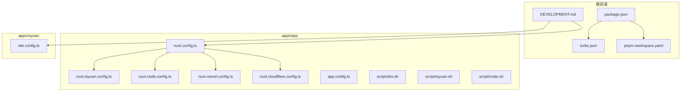
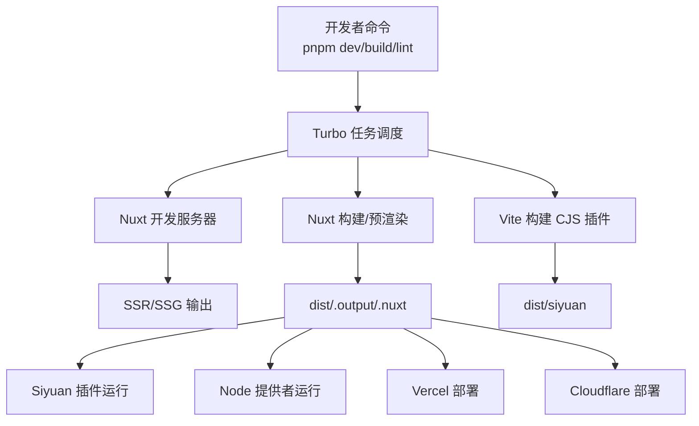
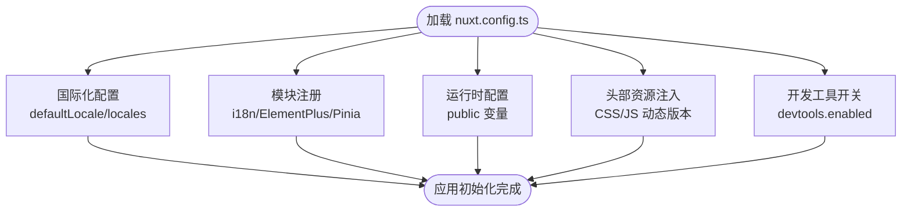
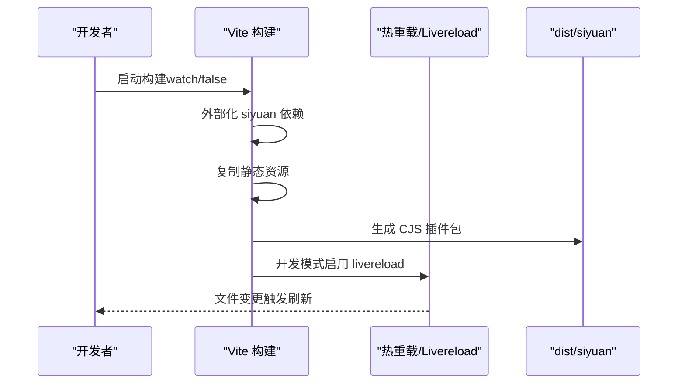
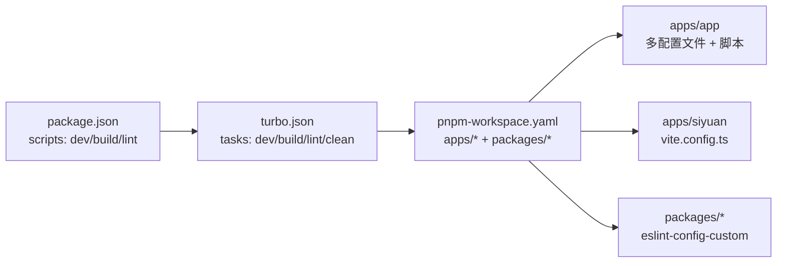
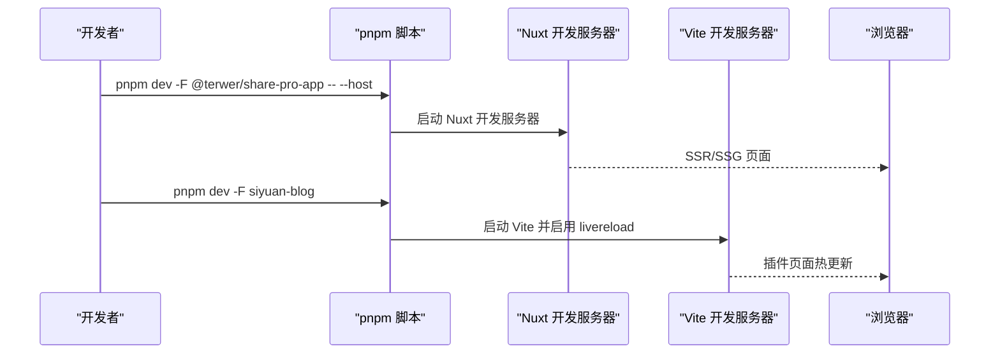
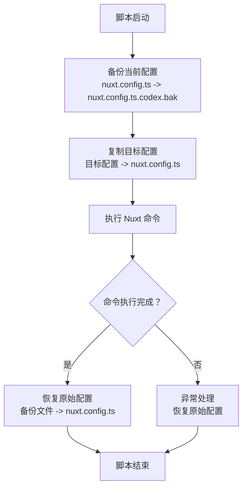
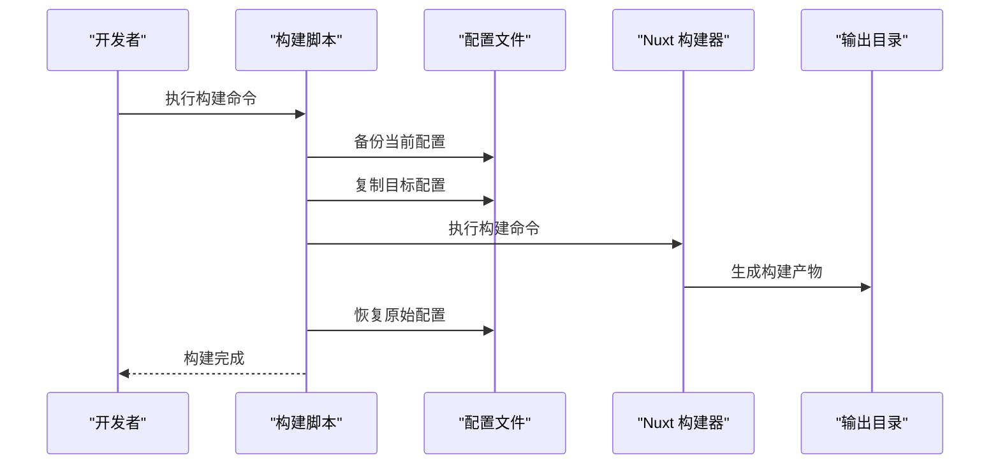

# 开发者指南

<cite>
**本文引用的文件**
- [package.json](file://package.json)
- [turbo.json](file://turbo.json)
- [pnpm-workspace.yaml](file://pnpm-workspace.yaml)
- [DEVELOPMENT.md](file://DEVELOPMENT.md)
- [apps/app/nuxt.config.ts](file://apps/app/nuxt.config.ts)
- [apps/app/app.config.ts](file://apps/app/app.config.ts)
- [apps/app/nuxt.siyuan.config.ts](file://apps/app/nuxt.siyuan.config.ts)
- [apps/app/nuxt.node.config.ts](file://apps/app/nuxt.node.config.ts)
- [apps/app/nuxt.vercel.config.ts](file://apps/app/nuxt.vercel.config.ts)
- [apps/app/nuxt.cloudflare.config.ts](file://apps/app/nuxt.cloudflare.config.ts)
- [apps/siyuan/vite.config.ts](file://apps/siyuan/vite.config.ts)
- [apps/app/script/dev.sh](file://apps/app/script/dev.sh)
- [apps/app/script/siyuan.sh](file://apps/app/script/siyuan.sh)
- [apps/app/script/node.sh](file://apps/app/script/node.sh)
- [startup.sh](file://startup.sh)
</cite>

## 更新摘要
**所做更改**
- 新增开发快捷方式章节，详细介绍 pnpm dev:app、pnpm dev:siyuan、pnpm dev:all 三个新命令
- 更新自动配置备份恢复功能说明，展示脚本如何安全地临时切换配置文件
- 增强开发工作流程优化部分，涵盖脚本自动化和多项目开发体验
- 完善构建系统增强说明，包括多目标构建策略和配置管理

## 目录
1. [简介](#简介)
2. [项目结构](#项目结构)
3. [核心组件](#核心组件)
4. [架构总览](#架构总览)
5. [详细组件分析](#详细组件分析)
6. [依赖关系分析](#依赖关系分析)
7. [性能与内存优化](#性能与内存优化)
8. [测试与持续集成](#测试与持续集成)
9. [代码规范与质量保障](#代码规范与质量保障)
10. [开发环境搭建与调试](#开发环境搭建与调试)
11. [开发工作流程优化](#开发工作流程优化)
12. [故障排查指南](#故障排查指南)
13. [结论](#结论)
14. [附录](#附录)

## 简介
本指南面向参与 Siyuan 插件博客项目的开发者，覆盖从开发环境搭建、代码组织与命名约定、构建系统与多项目策略、测试与 CI 流程、性能优化到团队协作与版本控制的最佳实践。项目采用 pnpm monorepo + Turbo 的多项目工作流，前端基于 Nuxt 3（SSR/SSG），插件端基于 Vite，支持多部署目标（Siyuan 插件、Node 提供者、Vercel、Cloudflare）。

## 项目结构
项目采用 pnpm workspace + Turbo 管理多包，核心目录与职责如下：
- apps/app：Nuxt 3 前端应用，支持 SSR/SSG，适配多部署目标
- apps/siyuan：Siyuan 插件打包与运行入口，使用 Vite 构建 CJS 插件包
- packages/*：共享配置与 UI 组件库（如 eslint-config-custom）
- scripts/*：构建与发布辅助脚本
- 根级配置：package.json、turbo.json、pnpm-workspace.yaml、DEVELOPMENT.md 等

**图表来源**
- [package.json:1-30](file://package.json#L1-L30)
- [turbo.json:1-17](file://turbo.json#L1-L17)
- [pnpm-workspace.yaml:1-9](file://pnpm-workspace.yaml#L1-L9)
- [DEVELOPMENT.md:1-206](file://DEVELOPMENT.md#L1-L206)
- [apps/app/nuxt.config.ts:1-154](file://apps/app/nuxt.config.ts#L1-L154)
- [apps/app/nuxt.siyuan.config.ts:1-175](file://apps/app/nuxt.siyuan.config.ts#L1-L175)
- [apps/app/nuxt.node.config.ts:1-154](file://apps/app/nuxt.node.config.ts#L1-L154)
- [apps/app/nuxt.vercel.config.ts:1-164](file://apps/app/nuxt.vercel.config.ts#L1-L164)
- [apps/app/nuxt.cloudflare.config.ts:1-155](file://apps/app/nuxt.cloudflare.config.ts#L1-L155)

**章节来源**
- [package.json:1-30](file://package.json#L1-L30)
- [turbo.json:1-17](file://turbo.json#L1-L17)
- [pnpm-workspace.yaml:1-9](file://pnpm-workspace.yaml#L1-L9)
- [DEVELOPMENT.md:1-206](file://DEVELOPMENT.md#L1-L206)

## 核心组件
- Nuxt 3 前端应用（apps/app）
  - 配置国际化、UI 组件自动导入、运行时环境变量、开发工具开关等
  - 支持多部署目标配置（Siyuan、Node、Vercel、Cloudflare）
  - 自动配置备份恢复机制，确保开发过程中的配置安全
- Siyuan 插件（apps/siyuan）
  - Vite 构建 CJS 插件包，支持热重载与静态资源复制
- 共享 ESLint 配置（packages/eslint-config-custom）
  - 统一前端代码风格与 TypeScript 规则
- 构建与发布脚本（apps/app/script/*）
  - 提供多目标构建、开发启动、Docker 集成等

**章节来源**
- [apps/app/nuxt.config.ts:1-154](file://apps/app/nuxt.config.ts#L1-L154)
- [apps/app/nuxt.siyuan.config.ts:1-175](file://apps/app/nuxt.siyuan.config.ts#L1-L175)
- [apps/app/nuxt.node.config.ts:1-154](file://apps/app/nuxt.node.config.ts#L1-L154)
- [apps/siyuan/vite.config.ts:1-136](file://apps/siyuan/vite.config.ts#L1-L136)

## 架构总览
整体架构由"多包工作流 + 多部署目标"构成。Turbo 管理任务依赖与缓存；Nuxt 3 负责前端渲染与静态生成；Vite 负责 Siyuan 插件构建；脚本负责多目标编排与打包。

**图表来源**
- [package.json:4-21](file://package.json#L4-L21)
- [turbo.json:3-14](file://turbo.json#L3-L14)
- [apps/app/nuxt.config.ts:1-154](file://apps/app/nuxt.config.ts#L1-L154)
- [apps/siyuan/vite.config.ts:75-134](file://apps/siyuan/vite.config.ts#L75-L134)

## 详细组件分析

### Nuxt 3 前端应用
- 功能要点
  - 国际化：默认 zh_CN，支持 en_US；禁用浏览器语言检测
  - UI 自动导入：Element Plus 解析器自动注册
  - 运行时配置：公开环境变量（默认类型、API 地址、提供者模式与地址）
  - 开发体验：开发模式启用 devtools；Eruda 调试脚本按需注入
  - 头部资源：字体、主题样式、KaTeX、ECharts 等资源动态版本号
- 关键配置参考
  - [apps/app/nuxt.config.ts:25-33](file://apps/app/nuxt.config.ts#L25-L33)
  - [apps/app/nuxt.config.ts:90-104](file://apps/app/nuxt.config.ts#L90-L104)
  - [apps/app/nuxt.config.ts:114-121](file://apps/app/nuxt.config.ts#L114-L121)

**图表来源**
- [apps/app/nuxt.config.ts:25-33](file://apps/app/nuxt.config.ts#L25-L33)
- [apps/app/nuxt.config.ts:90-104](file://apps/app/nuxt.config.ts#L90-L104)
- [apps/app/nuxt.config.ts:114-121](file://apps/app/nuxt.config.ts#L114-L121)

**章节来源**
- [apps/app/nuxt.config.ts:1-154](file://apps/app/nuxt.config.ts#L1-L154)

### Siyuan 插件构建（Vite）
- 功能要点
  - 构建输出为 CJS，入口为 src/index.ts
  - 外部化 siyuan 依赖，避免打包进插件
  - 开发模式启用 livereload 与静态资源监听
  - 定义构建时间常量与开发/生产模式切换
  - 静态资源复制：README、LICENSE、icon、preview、plugin.json、i18n
- 关键配置参考
  - [apps/siyuan/vite.config.ts:75-134](file://apps/siyuan/vite.config.ts#L75-L134)
  - [apps/siyuan/vite.config.ts:29-56](file://apps/siyuan/vite.config.ts#L29-L56)

**图表来源**
- [apps/siyuan/vite.config.ts:75-134](file://apps/siyuan/vite.config.ts#L75-L134)

**章节来源**
- [apps/siyuan/vite.config.ts:1-136](file://apps/siyuan/vite.config.ts#L1-L136)

### 多目标构建配置
项目提供四种不同的 Nuxt 配置文件，分别针对不同部署目标：

- **nuxt.siyuan.config.ts**：免费 SPA 查看器配置，禁用 AI 助手，使用哈希路由模式
- **nuxt.node.config.ts**：Node 提供者配置，启用完整 SSR 功能和 AI 助手
- **nuxt.vercel.config.ts**：Vercel 部署配置，使用 Vercel Nitro 预设
- **nuxt.cloudflare.config.ts**：Cloudflare Pages 部署配置，使用 Cloudflare Pages 预设

**章节来源**
- [apps/app/nuxt.siyuan.config.ts:1-175](file://apps/app/nuxt.siyuan.config.ts#L1-L175)
- [apps/app/nuxt.node.config.ts:1-154](file://apps/app/nuxt.node.config.ts#L1-L154)
- [apps/app/nuxt.vercel.config.ts:1-164](file://apps/app/nuxt.vercel.config.ts#L1-L164)
- [apps/app/nuxt.cloudflare.config.ts:1-155](file://apps/app/nuxt.cloudflare.config.ts#L1-L155)

## 依赖关系分析
- 包管理与工作区
  - pnpm workspace 定义 apps/* 与 packages/* 为工作区包
  - onlyBuiltDependencies 限制仅对特定二进制依赖进行预构建
- 任务编排
  - Turbo 任务定义 build、dev、lint、clean；dev 任务持久化且不缓存
  - 根 package.json 脚本统一调用 turbo run <task>
- 类型与配置
  - 各应用配置文件相互独立，通过脚本实现安全切换

**图表来源**
- [package.json:4-21](file://package.json#L4-L21)
- [turbo.json:3-14](file://turbo.json#L3-L14)
- [pnpm-workspace.yaml:1-9](file://pnpm-workspace.yaml#L1-L9)

**章节来源**
- [pnpm-workspace.yaml:1-9](file://pnpm-workspace.yaml#L1-L9)
- [turbo.json:1-17](file://turbo.json#L1-L17)

## 性能与内存优化
- 构建与缓存
  - 使用 Turbo 管理任务依赖与缓存，避免重复构建
  - dev 任务持久化且不缓存，确保热更新稳定
- 资源与体积
  - Nuxt 头部资源按需注入，开发模式注入 Eruda 便于调试
  - Vite 生产构建关闭内联 source map，禁用压缩以便定位问题
- 运行时配置
  - 通过运行时 public 配置控制默认类型、API 地址与提供者模式，减少硬编码
- 内存与并发
  - pnpm workspace + Turbo 减少重复安装与构建开销
  - Siyuan 插件外部化 siyuan 依赖，避免打包导致体积膨胀

**章节来源**
- [turbo.json:11-14](file://turbo.json#L11-L14)
- [apps/app/nuxt.config.ts:60-86](file://apps/app/nuxt.config.ts#L60-L86)
- [apps/siyuan/vite.config.ts:80-87](file://apps/siyuan/vite.config.ts#L80-L87)

## 测试与持续集成
- 代码检查
  - apps/app/.eslintrc.cjs 继承自 packages/eslint-config-custom
  - packages/eslint-config-custom 依赖 @nuxtjs/eslint-config-typescript、@vue/eslint-config-typescript、@vercel/style-guide 等
- 测试策略
  - 当前仓库未发现显式的单元/集成测试配置文件；建议在各包中新增 vitest/jest 配置与覆盖率规则
- 持续集成
  - .github/workflows 目录存在工作流文件（未展开），建议结合 Turbo 缓存与 pnpm workspace 实现增量构建与并行任务

**章节来源**
- [apps/app/.eslintrc.cjs:1-8](file://apps/app/.eslintrc.cjs#L1-L8)
- [packages/eslint-config-custom/package.json:1-17](file://packages/eslint-config-custom/package.json#L1-L17)

## 代码规范与质量保障
- 代码风格
  - 统一使用 ESLint + TypeScript 规则，继承 @nuxtjs/eslint-config-typescript、@vue/eslint-config-typescript、@vercel/style-guide
  - 根 package.json 中提供 lint 脚本，交由 Turbo 执行
- 命名约定
  - 目录与文件遵循功能域划分（components、pages、composables、stores、utils、plugins 等）
  - Vue 组件使用 .vue 结尾，TS 模块使用 .ts 结尾
- 质量门禁
  - 建议在 CI 中强制执行 lint、类型检查与最小覆盖率阈值
  - 对于 Nuxt 与 Vite 配置变更，建议增加变更评审与回归测试

**章节来源**
- [apps/app/.eslintrc.cjs:1-8](file://apps/app/.eslintrc.cjs#L1-L8)
- [packages/eslint-config-custom/package.json:1-17](file://packages/eslint-config-custom/package.json#L1-L17)
- [package.json:11-11](file://package.json#L11-L11)

## 开发环境搭建与调试
- 环境准备
  - 安装 pnpm（版本在根 package.json 中声明）
  - 初始化工作区：pnpm install
- 开发模式
  - Nuxt 前端开发：pnpm dev -F @terwer/share-pro-app -- --host
  - Siyuan 插件开发：pnpm dev -F siyuan-blog（Vite 热重载）
  - 开发脚本：apps/app/script/dev.sh 会切换到 Node 构建配置并启动 dev
- 调试工具
  - Nuxt 开发模式启用 devtools
  - 开发模式注入 Eruda 脚本，便于移动端调试
- 热重载
  - Vite 开发模式启用 livereload 与静态资源监听
  - Nuxt 开发模式持久化任务，提升热更新稳定性

**图表来源**
- [package.json:5-6](file://package.json#L5-L6)
- [apps/app/script/dev.sh:12-15](file://apps/app/script/dev.sh#L12-L15)
- [apps/siyuan/vite.config.ts:102-121](file://apps/siyuan/vite.config.ts#L102-L121)

**章节来源**
- [DEVELOPMENT.md:65-80](file://DEVELOPMENT.md#L65-L80)
- [apps/app/script/dev.sh:1-38](file://apps/app/script/dev.sh#L1-L38)
- [apps/siyuan/vite.config.ts:102-121](file://apps/siyuan/vite.config.ts#L102-L121)

## 开发工作流程优化

### 开发快捷方式
项目新增了三个便捷的开发命令，简化多项目开发流程：

- **pnpm dev:app**：专门启动 Nuxt 前端应用，等同于 pnpm dev
- **pnpm dev:siyuan**：专门启动 Siyuan 插件开发
- **pnpm dev:all**：同时启动所有工作区项目的开发服务器

这些快捷方式通过根 package.json 中的脚本别名实现，提供更直观的开发体验。

**章节来源**
- [package.json:4-10](file://package.json#L4-L10)
- [DEVELOPMENT.md:105-115](file://DEVELOPMENT.md#L105-L115)

### 自动配置备份恢复功能
为了确保开发过程中的配置安全，所有构建脚本都实现了自动配置备份恢复机制：

#### 备份恢复机制工作原理
1. **配置备份**：脚本执行前自动备份当前 nuxt.config.ts
2. **临时切换**：将目标配置文件复制为 nuxt.config.ts
3. **执行命令**：运行相应的 Nuxt 命令（dev/build/generate）
4. **自动恢复**：命令执行完毕后自动恢复原始配置文件

#### 脚本实现细节
- **备份文件命名**：使用 `.codex.bak` 后缀标识备份文件
- **清理机制**：通过 trap 信号确保即使异常退出也能恢复配置
- **安全检查**：只在备份文件存在时才执行恢复操作

**图表来源**
- [apps/app/script/dev.sh:15-38](file://apps/app/script/dev.sh#L15-L38)
- [apps/app/script/siyuan.sh:15-38](file://apps/app/script/siyuan.sh#L15-L38)
- [apps/app/script/node.sh:15-41](file://apps/app/script/node.sh#L15-L41)

**章节来源**
- [apps/app/script/dev.sh:1-38](file://apps/app/script/dev.sh#L1-L38)
- [apps/app/script/siyuan.sh:1-38](file://apps/app/script/siyuan.sh#L1-L38)
- [apps/app/script/node.sh:1-41](file://apps/app/script/node.sh#L1-L41)

### 构建系统增强
项目构建系统经过优化，提供了更强大的多目标构建能力：

#### 多目标构建策略
- **Siyuan 目标**：免费 SPA 查看器，AI 助手禁用，使用哈希路由
- **Node 目标**：完整 SSR 功能，支持 AI 助手和提供者模式
- **Vercel 目标**：云端部署优化，使用 Vercel Nitro 预设
- **Cloudflare 目标**：边缘计算优化，使用 Cloudflare Pages 预设

#### 自动化构建流程
每个目标都有对应的构建脚本，自动处理配置切换、构建执行和资源复制：

**图表来源**
- [apps/app/script/siyuan.sh:25-38](file://apps/app/script/siyuan.sh#L25-L38)
- [apps/app/script/node.sh:25-41](file://apps/app/script/node.sh#L25-L41)

**章节来源**
- [DEVELOPMENT.md:97-104](file://DEVELOPMENT.md#L97-L104)
- [DEVELOPMENT.md:152-169](file://DEVELOPMENT.md#L152-L169)

## 故障排查指南
- 构建失败
  - 检查 -f|--from 参数是否正确传递给 build.sh
  - 确认目标配置文件（nuxt.siyuan/cloudflare/vercel.config.ts）已存在
  - 验证自动备份恢复机制是否正常工作
- 热重载无效
  - 确认 Vite watch 模式开启，livereload 插件已加载
  - 检查静态资源监听列表（i18n、README、plugin.json 等）
- 开发工具不可用
  - 确认 Nuxt devtools.enabled 与开发模式一致
  - 检查 Eruda 注入逻辑（开发模式下自动注入）
- 插件无法加载
  - 确认 dist/siyuan 输出路径与 Siyuan 插件加载路径一致
  - 检查 siyuan 依赖是否被外部化
- 配置文件损坏
  - 检查 `.codex.bak` 备份文件是否存在
  - 手动恢复配置文件或重新初始化项目

**章节来源**
- [apps/app/script/build.sh:22-63](file://apps/app/script/build.sh#L22-L63)
- [apps/app/script/siyuan.sh:12-38](file://apps/app/script/siyuan.sh#L12-L38)
- [apps/app/script/dev.sh:17-38](file://apps/app/script/dev.sh#L17-L38)
- [apps/siyuan/vite.config.ts:102-121](file://apps/siyuan/vite.config.ts#L102-L121)

## 结论
本指南总结了项目的多包工作流、多目标构建策略、开发调试流程与质量保障建议。最新的开发工作流程优化包括新的开发快捷方式、自动配置备份恢复功能和增强的构建系统，显著提升了开发效率和安全性。建议团队在现有基础上完善测试与 CI、细化代码规范与审查标准，并持续优化构建与部署流程以提升开发效率与产物质量。

## 附录
- 常用命令速查
  - 开发：pnpm dev -F @terwer/share-pro-app -- --host；pnpm dev -F siyuan-blog
  - 开发快捷方式：pnpm dev:app；pnpm dev:siyuan；pnpm dev:all
  - 构建：pnpm build -F @terwer/share-pro-app -- --from siyuan；pnpm build -F siyuan-blog
  - 打包：pnpm package
  - Node 提供者：pnpm buildNodeProvider；pnpm packageNodeProvider；pnpm start
  - Docker：pnpm docker.sh
  - 启动本地服务：./startup.sh