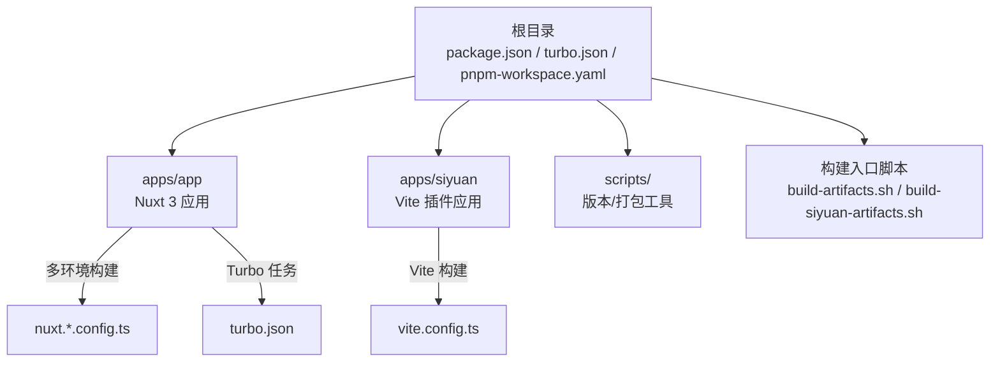
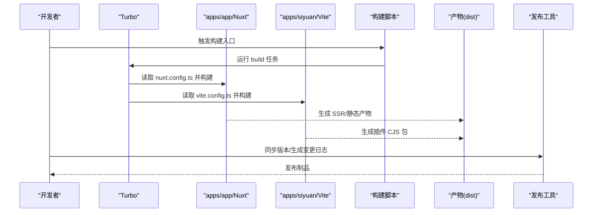
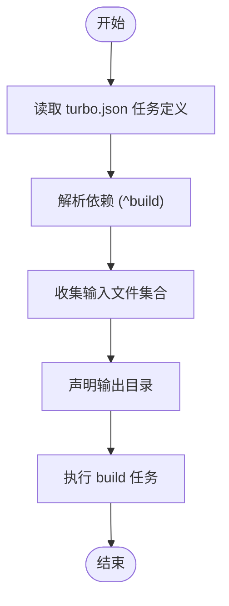
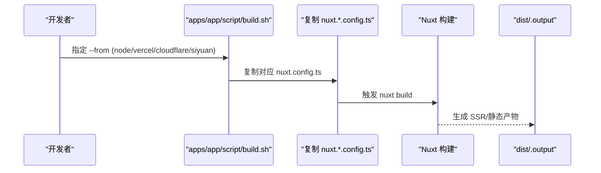
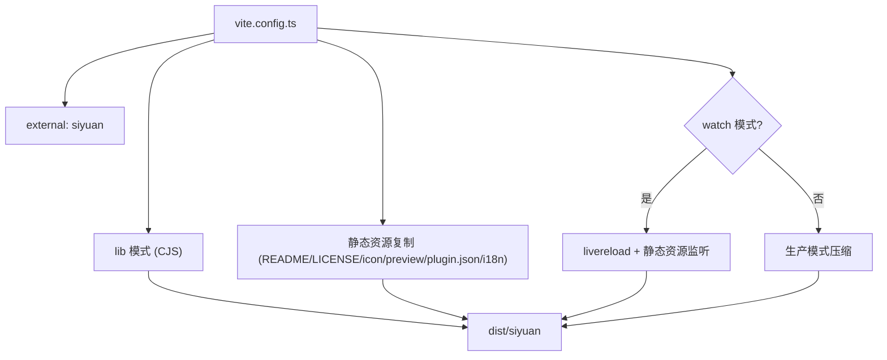
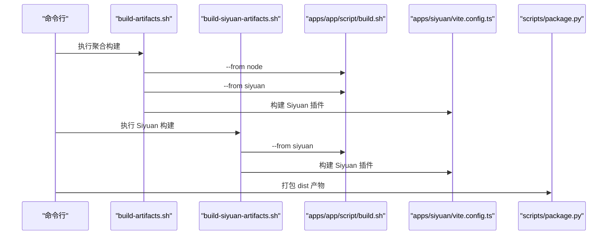
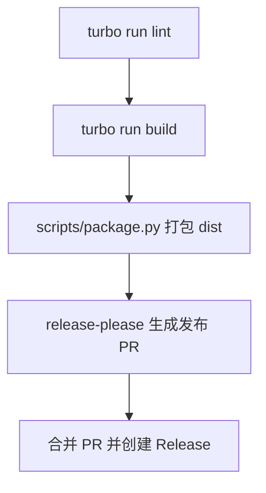
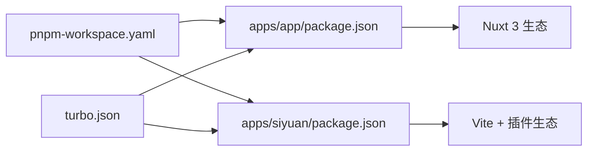

# 构建与部署

<cite>
**本文引用的文件**
- [turbo.json](file://turbo.json)
- [package.json](file://package.json)
- [pnpm-workspace.yaml](file://pnpm-workspace.yaml)
- [apps/app/nuxt.config.ts](file://apps/app/nuxt.config.ts)
- [apps/app/package.json](file://apps/app/package.json)
- [apps/app/script/build.sh](file://apps/app/script/build.sh)
- [apps/app/script/dev.sh](file://apps/app/script/dev.sh)
- [apps/app/script/cloudflare.sh](file://apps/app/script/cloudflare.sh)
- [apps/app/script/vercel.sh](file://apps/app/script/vercel.sh)
- [apps/siyuan/vite.config.ts](file://apps/siyuan/vite.config.ts)
- [apps/siyuan/package.json](file://apps/siyuan/package.json)
- [build-artifacts.sh](file://build-artifacts.sh)
- [build-siyuan-artifacts.sh](file://build-siyuan-artifacts.sh)
- [scripts/package.py](file://scripts/package.py)
- [scripts/version.py](file://scripts/version.py)
- [release-please-config.json](file://release-please-config.json)
</cite>

## 目录
1. [引言](#引言)
2. [项目结构](#项目结构)
3. [核心组件](#核心组件)
4. [架构总览](#架构总览)
5. [详细组件分析](#详细组件分析)
6. [依赖分析](#依赖分析)
7. [性能考虑](#性能考虑)
8. [故障排查指南](#故障排查指南)
9. [结论](#结论)
10. [附录](#附录)

## 引言
本文件系统性阐述该 Siyuan 插件博客项目的构建系统与部署流程，覆盖以下方面：
- Turbo monorepo 构建配置与任务编排
- 多环境构建策略（Web 应用、Node SSR、Cloudflare、Vercel、Siyuan 插件）
- 自动化构建与打包脚本的工作原理（资源打包、代码分割、优化策略）
- 生产环境部署指南（静态资源托管、CDN 与缓存策略）
- CI/CD 流程配置（自动化测试、代码检查、发布流程）
- 版本管理与发布策略（语义化版本、变更日志维护）
- 部署故障排查与回滚策略

## 项目结构
该项目采用 pnpm workspace + Turbo 的 monorepo 结构，包含两个主要应用：
- Web 应用（Nuxt 3）：位于 apps/app，支持 Node SSR、Cloudflare、Vercel 等多种部署形态
- Siyuan 插件（Vite）：位于 apps/siyuan，输出 CJS 插件包供桌面客户端使用

图表来源
- [turbo.json:1-17](file://turbo.json#L1-L17)
- [pnpm-workspace.yaml:1-9](file://pnpm-workspace.yaml#L1-L9)
- [apps/app/nuxt.config.ts:1-125](file://apps/app/nuxt.config.ts#L1-L125)
- [apps/siyuan/vite.config.ts:1-136](file://apps/siyuan/vite.config.ts#L1-L136)
- [build-artifacts.sh:1-6](file://build-artifacts.sh#L1-L6)
- [build-siyuan-artifacts.sh:1-5](file://build-siyuan-artifacts.sh#L1-L5)

章节来源
- [pnpm-workspace.yaml:1-9](file://pnpm-workspace.yaml#L1-L9)
- [turbo.json:1-17](file://turbo.json#L1-L17)

## 核心组件
- Turbo 任务编排：统一定义 build、dev、lint 等任务，支持跨包依赖与缓存
- Nuxt 3 应用（apps/app）：通过多份 nuxt.*.config.ts 支持不同部署后端；内置国际化、UI 组件库、运行时环境变量注入
- Vite 插件应用（apps/siyuan）：以 lib 模式输出 CJS，外部化 siyuan 依赖，支持开发热更新与静态资源复制
- 构建脚本：集中于 apps/app/script 下，按目标平台切换配置并触发 Nuxt 构建；根目录脚本负责聚合构建与打包
- 版本与发布：Python 脚本同步版本号；release-please 配置驱动变更日志与发布 PR

章节来源
- [turbo.json:1-17](file://turbo.json#L1-L17)
- [apps/app/nuxt.config.ts:1-125](file://apps/app/nuxt.config.ts#L1-L125)
- [apps/siyuan/vite.config.ts:1-136](file://apps/siyuan/vite.config.ts#L1-L136)
- [apps/app/script/build.sh:1-63](file://apps/app/script/build.sh#L1-L63)
- [build-artifacts.sh:1-6](file://build-artifacts.sh#L1-L6)
- [scripts/version.py:1-74](file://scripts/version.py#L1-L74)
- [release-please-config.json:1-37](file://release-please-config.json#L1-L37)

## 架构总览
下图展示从本地开发到多平台部署的整体流程，以及各组件之间的交互关系。

图表来源
- [turbo.json:1-17](file://turbo.json#L1-L17)
- [apps/app/script/build.sh:1-63](file://apps/app/script/build.sh#L1-L63)
- [apps/app/script/cloudflare.sh:1-16](file://apps/app/script/cloudflare.sh#L1-L16)
- [apps/app/script/vercel.sh:1-16](file://apps/app/script/vercel.sh#L1-L16)
- [apps/siyuan/vite.config.ts:1-136](file://apps/siyuan/vite.config.ts#L1-L136)
- [build-artifacts.sh:1-6](file://build-artifacts.sh#L1-L6)
- [scripts/package.py:1-52](file://scripts/package.py#L1-L52)
- [scripts/version.py:1-74](file://scripts/version.py#L1-L74)
- [release-please-config.json:1-37](file://release-please-config.json#L1-L37)

## 详细组件分析

### Turbo 与 Monorepo 任务编排
- 任务定义：build 任务声明依赖上游包（^build），输入包含默认文件集与 .env*，输出目录覆盖 .nuxt、.output、dist 等
- 开发模式：dev 任务不缓存且持久化，适合本地联调
- 顶层脚本：根 package.json 通过 npm scripts 调用 turbo run，统一入口

图表来源
- [turbo.json:1-17](file://turbo.json#L1-L17)
- [package.json:1-27](file://package.json#L1-L27)

章节来源
- [turbo.json:1-17](file://turbo.json#L1-L17)
- [package.json:1-27](file://package.json#L1-L27)

### Web 应用（Nuxt 3）多环境构建
- 配置切换：通过 apps/app/script 下的脚本在 nuxt.*.config.ts 之间切换，实现 Node SSR、Cloudflare、Vercel 等部署形态
- 国际化与主题：内置 i18n、Element Plus 主题注入、动态 head 注入（开发期自动注入 eruda）
- 运行时配置：通过 runtimeConfig.public 注入默认类型、API 地址、Provider 模式等
- 动态版本戳：生成分钟级静态资源版本戳，便于缓存失效

图表来源
- [apps/app/script/build.sh:1-63](file://apps/app/script/build.sh#L1-L63)
- [apps/app/script/dev.sh:1-15](file://apps/app/script/dev.sh#L1-L15)
- [apps/app/script/cloudflare.sh:1-16](file://apps/app/script/cloudflare.sh#L1-L16)
- [apps/app/script/vercel.sh:1-16](file://apps/app/script/vercel.sh#L1-L16)
- [apps/app/nuxt.config.ts:1-125](file://apps/app/nuxt.config.ts#L1-L125)

章节来源
- [apps/app/script/build.sh:1-63](file://apps/app/script/build.sh#L1-L63)
- [apps/app/script/dev.sh:1-15](file://apps/app/script/dev.sh#L1-L15)
- [apps/app/script/cloudflare.sh:1-16](file://apps/app/script/cloudflare.sh#L1-L16)
- [apps/app/script/vercel.sh:1-16](file://apps/app/script/vercel.sh#L1-L16)
- [apps/app/nuxt.config.ts:1-125](file://apps/app/nuxt.config.ts#L1-L125)

### Siyuan 插件（Vite）构建
- 构建目标：lib 模式输出 CJS，外部化 siyuan，避免打包客户端原生模块
- 开发体验：watch 模式启用内联 sourcemap、livereload 与静态资源监听
- 静态资源复制：使用 vite-plugin-static-copy 将 README、LICENSE、icon、preview、plugin.json、i18n 等复制到输出目录
- 输出命名：入口文件名与样式文件名可定制，便于客户端加载

图表来源
- [apps/siyuan/vite.config.ts:1-136](file://apps/siyuan/vite.config.ts#L1-L136)
- [apps/siyuan/package.json:1-43](file://apps/siyuan/package.json#L1-L43)

章节来源
- [apps/siyuan/vite.config.ts:1-136](file://apps/siyuan/vite.config.ts#L1-L136)
- [apps/siyuan/package.json:1-43](file://apps/siyuan/package.json#L1-L43)

### 构建脚本与打包流程
- apps/app/script/build.sh：根据 --from 参数切换 nuxt.*.config.ts 并执行 nuxt build
- apps/app/script/dev.sh：复制 nuxt.node.config.ts 并启动开发服务器
- apps/app/script/cloudflare.sh / vercel.sh：分别切换至 Cloudflare/Vercel 配置并构建
- 根脚本：
  - build-artifacts.sh：聚合构建 Web 应用（Node/Siyuan）与 Siyuan 插件
  - build-siyuan-artifacts.sh：仅构建 Siyuan 插件相关产物
- 打包脚本（scripts/package.py）：将 dist/siyuan 与 dist/node 分别压缩为 zip，供发布使用
- 版本同步（scripts/version.py）：批量更新根与子包的版本号

图表来源
- [build-artifacts.sh:1-6](file://build-artifacts.sh#L1-L6)
- [build-siyuan-artifacts.sh:1-5](file://build-siyuan-artifacts.sh#L1-L5)
- [apps/app/script/build.sh:1-63](file://apps/app/script/build.sh#L1-L63)
- [apps/siyuan/vite.config.ts:1-136](file://apps/siyuan/vite.config.ts#L1-L136)
- [scripts/package.py:1-52](file://scripts/package.py#L1-L52)

章节来源
- [apps/app/script/build.sh:1-63](file://apps/app/script/build.sh#L1-L63)
- [apps/app/script/cloudflare.sh:1-16](file://apps/app/script/cloudflare.sh#L1-L16)
- [apps/app/script/vercel.sh:1-16](file://apps/app/script/vercel.sh#L1-L16)
- [build-artifacts.sh:1-6](file://build-artifacts.sh#L1-L6)
- [build-siyuan-artifacts.sh:1-5](file://build-siyuan-artifacts.sh#L1-L5)
- [scripts/package.py:1-52](file://scripts/package.py#L1-L52)
- [scripts/version.py:1-74](file://scripts/version.py#L1-L74)

### 多环境构建差异与配置要点
- Node SSR（nuxt.node.config.ts → nuxt.config.ts）：适用于传统服务器渲染部署，开发期复制该配置并启动 dev
- Cloudflare（nuxt.cloudflare.config.ts → nuxt.config.ts）：适配 Cloudflare Workers/Routes 环境，需确保 nuxt 配置兼容
- Vercel（nuxt.vercel.config.ts → nuxt.config.ts）：适配 Vercel 平台，注意静态资源与 API 路由映射
- Siyuan 插件（Vite lib cjs）：外部化 siyuan，复制 i18n 与元数据文件，输出 dist/siyuan

章节来源
- [apps/app/script/dev.sh:1-15](file://apps/app/script/dev.sh#L1-L15)
- [apps/app/script/cloudflare.sh:1-16](file://apps/app/script/cloudflare.sh#L1-L16)
- [apps/app/script/vercel.sh:1-16](file://apps/app/script/vercel.sh#L1-L16)
- [apps/siyuan/vite.config.ts:1-136](file://apps/siyuan/vite.config.ts#L1-L136)

### 资源打包、代码分割与优化策略
- Web 应用（Nuxt 3）：
  - 动态版本戳：生成分钟级静态资源版本戳，结合 CDN 缓存策略提升刷新效率
  - 开发期注入：开发模式自动注入 eruda 与第三方脚本，生产模式关闭
  - UI 自动导入：AutoImport 与 Components 插件配合 ElementPlus Resolver，减少样板代码
- Siyuan 插件（Vite）：
  - 外部化依赖：将 siyuan 设为 external，避免打包客户端原生模块
  - 压缩与 sourcemap：生产模式启用压缩，开发模式使用内联 sourcemap 提升调试体验
  - 静态资源复制：统一复制 README/License/icon/preview/plugin.json/i18n，保证插件完整性

章节来源
- [apps/app/nuxt.config.ts:1-125](file://apps/app/nuxt.config.ts#L1-L125)
- [apps/siyuan/vite.config.ts:1-136](file://apps/siyuan/vite.config.ts#L1-L136)

### 生产环境部署指南
- 静态资源托管与 CDN：
  - 将 dist/.output 作为静态站点根目录部署
  - 使用动态版本戳（分钟级）作为查询参数，结合 CDN 缓存策略实现精准失效
- Node SSR 部署：
  - 以 nuxt.node.config.ts 对应的构建产物为基础，部署至 Node 可运行环境
- Cloudflare/Vercel：
  - 以对应 nuxt.*.config.ts 构建产物部署，遵循平台路由与 API 映射规则
- Siyuan 插件：
  - 将 dist/siyuan 作为插件包分发，确保 README、plugin.json、icon、preview、i18n 等齐全

章节来源
- [apps/app/nuxt.config.ts:1-125](file://apps/app/nuxt.config.ts#L1-L125)
- [apps/app/script/cloudflare.sh:1-16](file://apps/app/script/cloudflare.sh#L1-L16)
- [apps/app/script/vercel.sh:1-16](file://apps/app/script/vercel.sh#L1-L16)
- [apps/siyuan/vite.config.ts:1-136](file://apps/siyuan/vite.config.ts#L1-L136)

### CI/CD 流程配置
- 自动化测试与代码检查：通过 turbo run lint 统一在各包执行 ESLint 等检查
- 构建与打包：使用根脚本聚合构建，随后调用 Python 打包脚本生成 zip
- 发布流程：通过 release-please 自动生成变更日志与发布 PR，支持按类型分类（feat/fix/perf/refactor/chore）

图表来源
- [package.json:1-27](file://package.json#L1-L27)
- [turbo.json:1-17](file://turbo.json#L1-L17)
- [scripts/package.py:1-52](file://scripts/package.py#L1-L52)
- [release-please-config.json:1-37](file://release-please-config.json#L1-L37)

章节来源
- [package.json:1-27](file://package.json#L1-L27)
- [turbo.json:1-17](file://turbo.json#L1-L17)
- [release-please-config.json:1-37](file://release-please-config.json#L1-L37)

### 版本管理与发布策略
- 语义化版本：通过 release-please-config.json 配置，按 feat/fix/perf/refactor/chore 分类生成变更日志
- 版本同步：scripts/version.py 批量更新根与子包的版本号，确保一致性
- 发布准备：prepareRelease 脚本先同步版本再解析变更日志，便于自动化发布

章节来源
- [scripts/version.py:1-74](file://scripts/version.py#L1-L74)
- [release-please-config.json:1-37](file://release-please-config.json#L1-L37)
- [package.json:1-27](file://package.json#L1-L27)

## 依赖分析
- Workspace 与包管理：pnpm-workspace.yaml 声明 apps 与 packages 为工作区；onlyBuiltDependencies 控制特定二进制依赖的构建行为
- 应用间耦合：apps/app 与 apps/siyuan 通过各自独立的构建配置与输出目录解耦
- 外部依赖：Siyuan 插件外部化 siyuan，避免打包冲突；Web 应用通过 Nuxt 模块与插件扩展功能

图表来源
- [pnpm-workspace.yaml:1-9](file://pnpm-workspace.yaml#L1-L9)
- [apps/app/package.json:1-41](file://apps/app/package.json#L1-L41)
- [apps/siyuan/package.json:1-43](file://apps/siyuan/package.json#L1-L43)
- [turbo.json:1-17](file://turbo.json#L1-L17)

章节来源
- [pnpm-workspace.yaml:1-9](file://pnpm-workspace.yaml#L1-L9)
- [apps/app/package.json:1-41](file://apps/app/package.json#L1-L41)
- [apps/siyuan/package.json:1-43](file://apps/siyuan/package.json#L1-L43)
- [turbo.json:1-17](file://turbo.json#L1-L17)

## 性能考虑
- 资源缓存：Web 应用使用分钟级版本戳，结合 CDN 缓存策略，平衡新鲜度与性能
- 构建缓存：Turbo 任务缓存与增量构建，减少重复工作
- 代码分割：Nuxt 3 默认按路由拆分，配合动态导入进一步优化首屏
- 生产优化：Vite 生产模式压缩、移除 sourcemap；Nuxt 关闭 devtools 与开发期注入

## 故障排查指南
- 构建失败（Siyuan 插件）：
  - 检查 siyuan 是否被正确 external，避免打包冲突
  - 确认静态资源复制任务已包含 README、plugin.json、icon、preview、i18n
- 构建失败（Web 应用）：
  - 确认 nuxt.*.config.ts 切换正确，尤其是 Node/Cloudflare/Vercel 配置
  - 检查 runtimeConfig.public 的环境变量是否完整
- 开发调试：
  - 开发模式自动注入 eruda，若异常可检查 head 注入逻辑与网络加载
- 打包问题：
  - 确认 dist 目录存在且内容完整，随后使用 scripts/package.py 生成 zip
- 回滚策略：
  - 保留最近一次稳定构建产物与版本标签，必要时回退至前一版本发布包
  - 若为 CDN 缓存导致问题，可临时降低缓存时间或清理缓存

章节来源
- [apps/siyuan/vite.config.ts:1-136](file://apps/siyuan/vite.config.ts#L1-L136)
- [apps/app/nuxt.config.ts:1-125](file://apps/app/nuxt.config.ts#L1-L125)
- [scripts/package.py:1-52](file://scripts/package.py#L1-L52)

## 结论
本项目通过 Turbo 与 pnpm workspace 实现高效的 monorepo 构建与任务编排，结合多套 nuxt.*.config.ts 与 Vite lib 模式，覆盖 Web 应用（Node/Cloudflare/Vercel）与 Siyuan 插件两大构建目标。借助动态版本戳、生产压缩与 CDN 缓存策略，兼顾性能与可维护性；release-please 与 Python 脚本共同保障版本与发布流程的自动化与一致性。

## 附录
- 快速命令参考：
  - 本地开发：根脚本 dev 或分别进入 apps/app 与 apps/siyuan 执行 dev
  - 聚合构建：根脚本 build 或执行 build-artifacts.sh
  - Siyuan 专项构建：build-siyuan-artifacts.sh
  - 打包发布：python scripts/package.py
  - 同步版本：python scripts/version.py --version <新版本号>
  - 准备发布：pnpm prepareRelease