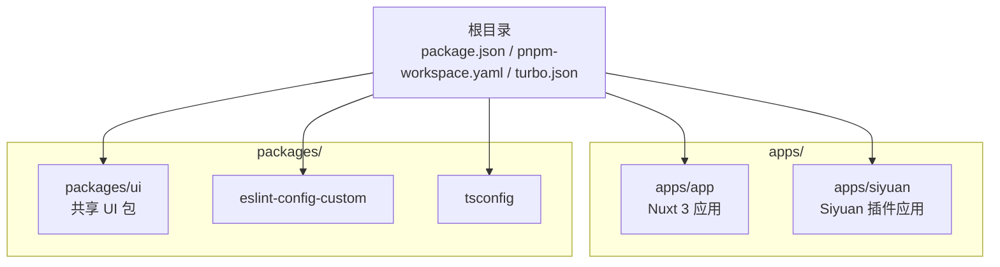
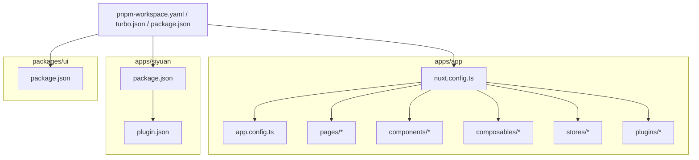
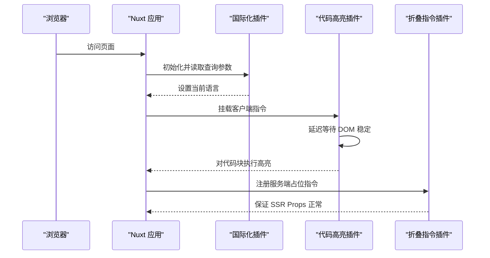
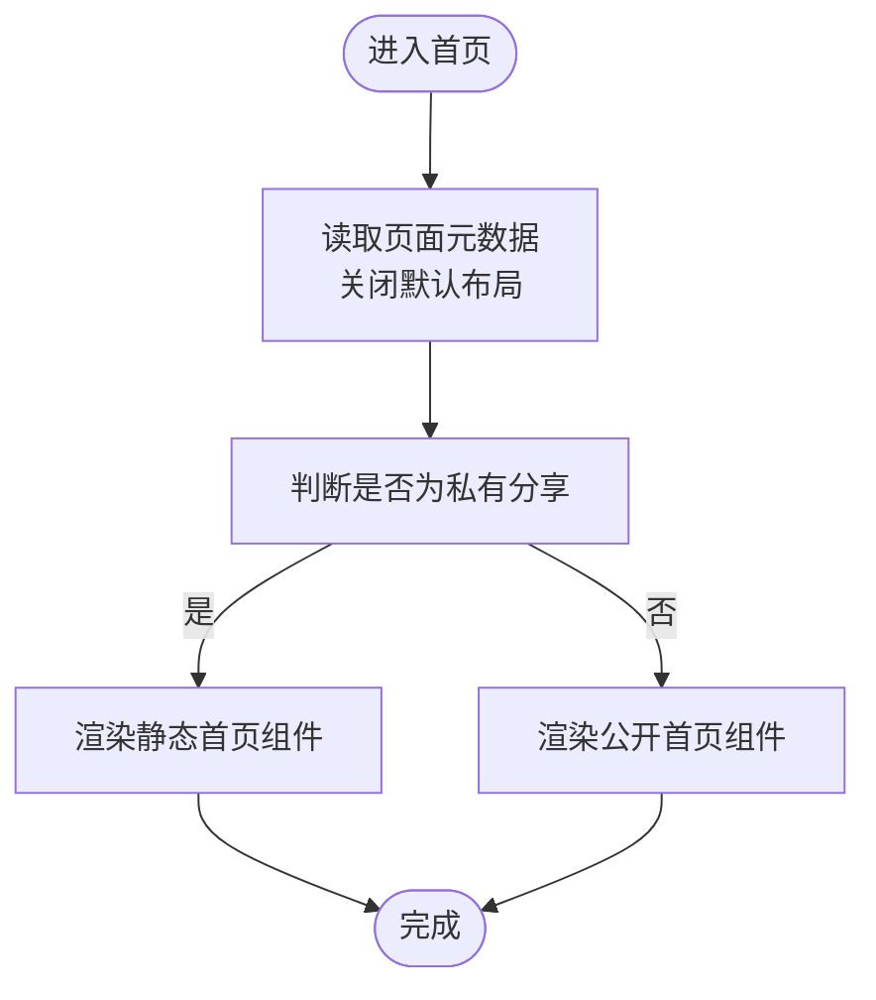
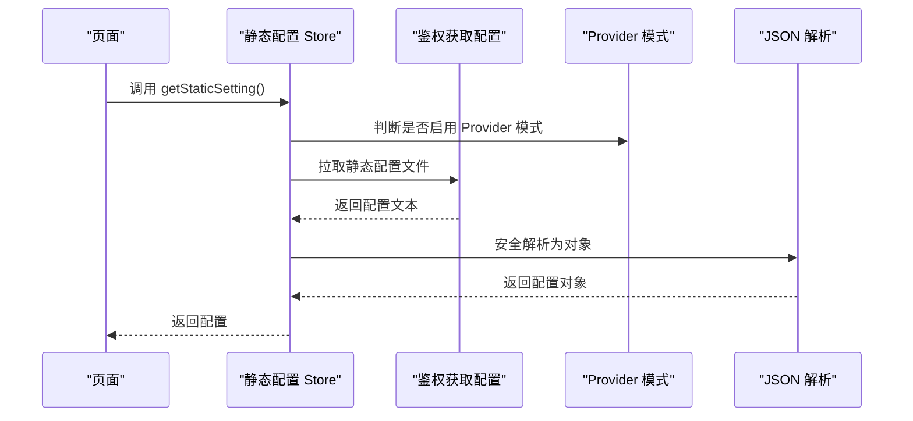
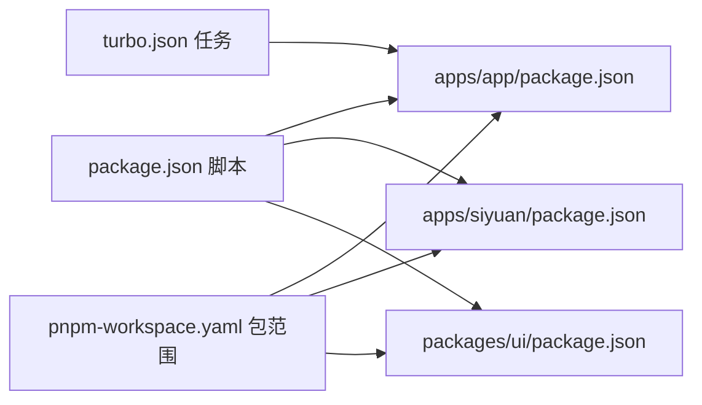

# 架构设计原理

<cite>
**本文引用的文件**
- [package.json](file://package.json)
- [pnpm-workspace.yaml](file://pnpm-workspace.yaml)
- [turbo.json](file://turbo.json)
- [apps/app/nuxt.config.ts](file://apps/app/nuxt.config.ts)
- [apps/app/package.json](file://apps/app/package.json)
- [apps/app/app.config.ts](file://apps/app/app.config.ts)
- [apps/app/composables/useAppBase.ts](file://apps/app/composables/useAppBase.ts)
- [apps/app/stores/useStaticSettingStore.ts](file://apps/app/stores/useStaticSettingStore.ts)
- [apps/app/pages/index.vue](file://apps/app/pages/index.vue)
- [apps/app/plugins/00.i18n.ts](file://apps/app/plugins/00.i18n.ts)
- [apps/app/plugins/01.hljs.client.ts](file://apps/app/plugins/01.hljs.client.ts)
- [apps/app/plugins/012.fold.server.ts](file://apps/app/plugins/012.fold.server.ts)
- [apps/siyuan/package.json](file://apps/siyuan/package.json)
- [apps/siyuan/plugin.json](file://apps/siyuan/plugin.json)
- [packages/ui/package.json](file://packages/ui/package.json)
</cite>

## 目录
1. [引言](#引言)
2. [项目结构](#项目结构)
3. [核心组件](#核心组件)
4. [架构总览](#架构总览)
5. [详细组件分析](#详细组件分析)
6. [依赖分析](#依赖分析)
7. [性能考量](#性能考量)
8. [故障排查指南](#故障排查指南)
9. [结论](#结论)
10. [附录](#附录)

## 引言
本项目是一个基于 Monorepo 的多应用架构工程，围绕“思源笔记在线分享”场景构建，采用 Vue 3 + Nuxt.js 技术栈，支持 SSR/CSR 双态运行与多平台部署（Web、Cloudflare、Vercel、Siyuan 插件）。通过 apps/ 与 packages/ 的清晰职责划分，结合 Pinia 状态管理、i18n 国际化、插件化渲染管线与可配置的主题体系，形成高内聚、低耦合且具备良好扩展性的前端架构。

## 项目结构
- Monorepo 管理：使用 pnpm workspace + Turbo 管道，统一管理多应用与共享包。
- apps/：包含 Web 应用（Nuxt 3）、Siyuan 插件应用等。
- packages/：包含共享 UI 组件库与公共配置（如 ESLint、TS 配置）。
- 核心脚本：顶层 package.json 提供统一开发、构建、打包命令；Turbo 定义构建缓存与任务依赖。

**图表来源**
- [pnpm-workspace.yaml:1-9](file://pnpm-workspace.yaml#L1-L9)
- [turbo.json:1-17](file://turbo.json#L1-L17)
- [apps/app/package.json:1-41](file://apps/app/package.json#L1-L41)
- [apps/siyuan/package.json:1-43](file://apps/siyuan/package.json#L1-L43)
- [packages/ui/package.json:1-17](file://packages/ui/package.json#L1-L17)

**章节来源**
- [pnpm-workspace.yaml:1-9](file://pnpm-workspace.yaml#L1-L9)
- [turbo.json:1-17](file://turbo.json#L1-L17)
- [package.json:1-27](file://package.json#L1-L27)

## 核心组件
- 分层架构与模块化
  - 表现层：Nuxt 页面与组件（pages/components），组合式函数（composables）封装业务逻辑。
  - 插件层：按功能拆分的 Nuxt 插件（如国际化、代码高亮、折叠指令等），区分客户端/服务端执行。
  - 状态层：Pinia Store（如静态配置 Store），在 SSR 场景下安全初始化。
  - 配置层：Nuxt 配置、应用配置、运行时环境变量。
- 组件化开发策略
  - 页面路由与布局解耦，通过动态导入与条件渲染实现私有/公开两种首页形态。
  - 主题与资源通过 app.config.ts 与运行时配置统一管理，支持多主题切换与版本控制。
- SSR 与 CSR 并行
  - Nuxt 3 默认启用 SSR，同时通过插件加载策略与客户端指令避免 SSR 渲染异常。
  - 运行时环境变量控制默认类型、Provider 模式与 Provider 地址，适配不同部署形态。

**章节来源**
- [apps/app/nuxt.config.ts:15-124](file://apps/app/nuxt.config.ts#L15-L124)
- [apps/app/app.config.ts:26-91](file://apps/app/app.config.ts#L26-L91)
- [apps/app/stores/useStaticSettingStore.ts:1-28](file://apps/app/stores/useStaticSettingStore.ts#L1-L28)
- [apps/app/pages/index.vue:10-29](file://apps/app/pages/index.vue#L10-L29)

## 架构总览
整体架构以 Nuxt 3 为核心，围绕 SSR/CSR 双态运行与多部署目标（Web、Cloudflare、Vercel、Siyuan 插件）组织。apps/app 作为 Web 应用主体，apps/siyuan 作为桌面端插件入口，packages/ui 提供共享 UI 能力。Monorepo 通过 pnpm workspace 与 Turbo 实现统一构建与缓存。

**图表来源**
- [apps/app/nuxt.config.ts:15-124](file://apps/app/nuxt.config.ts#L15-L124)
- [apps/app/app.config.ts:26-91](file://apps/app/app.config.ts#L26-L91)
- [apps/siyuan/package.json:1-43](file://apps/siyuan/package.json#L1-L43)
- [apps/siyuan/plugin.json:1-43](file://apps/siyuan/plugin.json#L1-L43)
- [packages/ui/package.json:1-17](file://packages/ui/package.json#L1-L17)
- [pnpm-workspace.yaml:1-9](file://pnpm-workspace.yaml#L1-L9)
- [turbo.json:1-17](file://turbo.json#L1-L17)
- [package.json:1-27](file://package.json#L1-L27)

## 详细组件分析

### Nuxt 配置与运行时环境
- 模块集成：i18n、Element Plus、Pinia 等模块按需启用，提升开发体验与组件复用。
- 头部与资源：统一注入字体、KaTeX、ECharts 等外部资源，支持开发期 Eruda 调试脚本。
- 运行时配置：通过 runtimeConfig.public 注入默认类型、Provider 模式与地址，便于多环境切换。
- 开发工具：devtools 在开发模式开启，便于调试。

**章节来源**
- [apps/app/nuxt.config.ts:23-124](file://apps/app/nuxt.config.ts#L23-L124)

### 应用配置与主题体系
- 应用配置：站点语言、标题、描述、首页文档 ID、主题模式与主题名称等集中管理。
- 主题版本：通过 themeVersion 控制主题升级策略，避免不兼容更新。
- 扩展字段：支持导航栏 Logo、域名与路径等扩展能力，满足多站点部署需求。

**章节来源**
- [apps/app/app.config.ts:26-91](file://apps/app/app.config.ts#L26-L91)

### 插件系统与渲染管线
- 国际化插件：根据查询参数动态切换语言，确保 SSR 与 CSR 一致的语言状态。
- 代码高亮插件：客户端指令实现代码块高亮，延迟等待 DOM 稳定后再执行，避免 SSR 渲染差异。
- 折叠指令插件：服务端占位插件避免 SSR 获取 props 报错，保证服务端渲染稳定性。

**图表来源**
- [apps/app/plugins/00.i18n.ts:16-27](file://apps/app/plugins/00.i18n.ts#L16-L27)
- [apps/app/plugins/01.hljs.client.ts:37-79](file://apps/app/plugins/01.hljs.client.ts#L37-L79)
- [apps/app/plugins/012.fold.server.ts:10-13](file://apps/app/plugins/012.fold.server.ts#L10-L13)

**章节来源**
- [apps/app/plugins/00.i18n.ts:16-27](file://apps/app/plugins/00.i18n.ts#L16-L27)
- [apps/app/plugins/01.hljs.client.ts:37-79](file://apps/app/plugins/01.hljs.client.ts#L37-L79)
- [apps/app/plugins/012.fold.server.ts:10-13](file://apps/app/plugins/012.fold.server.ts#L10-L13)

### 首页路由与条件渲染
- 动态页面元数据：关闭默认布局，允许自定义首页结构。
- 私有/公开首页：通过组合式函数判断分享模式，动态渲染静态首页或公开首页组件。

**图表来源**
- [apps/app/pages/index.vue:13-28](file://apps/app/pages/index.vue#L13-L28)

**章节来源**
- [apps/app/pages/index.vue:10-29](file://apps/app/pages/index.vue#L10-L29)

### 状态管理与静态配置
- 静态配置 Store：在 SSR 场景下安全获取静态配置文件，结合鉴权与 Provider 模式拉取配置。
- JSON 解析与日志：对配置文本进行安全解析并记录调试日志，便于问题定位。

**图表来源**
- [apps/app/stores/useStaticSettingStore.ts:10-27](file://apps/app/stores/useStaticSettingStore.ts#L10-L27)

**章节来源**
- [apps/app/stores/useStaticSettingStore.ts:1-28](file://apps/app/stores/useStaticSettingStore.ts#L1-28)

### 环境变量与运行基座
- 环境变量：通过运行时配置注入默认类型、SiYuan API 地址、Provider 模式与地址。
- 应用基座：组合式函数提供 APP_BASE，用于资源路径计算与 SSR/CSR 一致性。

**章节来源**
- [apps/app/nuxt.config.ts:114-121](file://apps/app/nuxt.config.ts#L114-L121)
- [apps/app/composables/useAppBase.ts:16-21](file://apps/app/composables/useAppBase.ts#L16-L21)

### Siyuan 插件应用
- 插件清单：定义跨平台支持、显示名、描述、国际化与资金支持链接。
- 依赖与脚本：Vue 3、VueUse、zhi-* 生态与 Vite 构建链路。

**章节来源**
- [apps/siyuan/plugin.json:1-43](file://apps/siyuan/plugin.json#L1-L43)
- [apps/siyuan/package.json:1-43](file://apps/siyuan/package.json#L1-L43)

## 依赖分析
- Monorepo 依赖
  - apps/app 与 apps/siyuan 通过 workspace 依赖共享配置与工具链。
  - packages/ui 作为共享 UI 包，被 apps/app 间接消费。
- 外部依赖
  - Nuxt 3、Vue 3、Pinia、Element Plus、i18n 等构成前端技术栈核心。
  - Turbo 管理构建任务与缓存，提升迭代效率。
- 任务与脚本
  - 顶层脚本统一入口，分别驱动 Web 应用与 Siyuan 插件的开发与构建流程。

**图表来源**
- [package.json:4-20](file://package.json#L4-L20)
- [turbo.json:3-14](file://turbo.json#L3-L14)
- [pnpm-workspace.yaml:1-9](file://pnpm-workspace.yaml#L1-L9)

**章节来源**
- [package.json:1-27](file://package.json#L1-L27)
- [turbo.json:1-17](file://turbo.json#L1-L17)
- [pnpm-workspace.yaml:1-9](file://pnpm-workspace.yaml#L1-L9)

## 性能考量
- SSR 与 CSR 并行
  - 合理拆分插件执行时机（客户端/服务端），避免 SSR 渲染异常与重复高亮。
  - 使用延迟策略与 DOM 稳定检测，减少首屏阻塞。
- 资源加载
  - 头部统一注入字体与 KaTeX/ECharts 资源，配合 defer 加载，降低主线程压力。
  - 动态版本号（分钟级）用于缓存失效控制。
- 状态与配置
  - 静态配置按需拉取与缓存，避免频繁网络请求。
  - JSON 安全解析与日志记录，便于性能与错误诊断。

**章节来源**
- [apps/app/nuxt.config.ts:46-86](file://apps/app/nuxt.config.ts#L46-L86)
- [apps/app/plugins/01.hljs.client.ts:43-78](file://apps/app/plugins/01.hljs.client.ts#L43-L78)
- [apps/app/stores/useStaticSettingStore.ts:18-24](file://apps/app/stores/useStaticSettingStore.ts#L18-L24)

## 故障排查指南
- SSR 报错（如获取 props 失败）
  - 使用服务端占位插件注册指令，避免 SSR 渲染阶段访问客户端专属 API。
- 代码高亮无效
  - 检查客户端指令是否在 DOM 稳定后执行；确认延迟时间与资源加载顺序。
- 语言切换不生效
  - 确认查询参数与 i18n locale 列表匹配；检查 SSR 与 CSR 语言状态同步。
- 静态配置拉取失败
  - 核对鉴权获取配置流程与 Provider 模式开关；查看日志输出定位问题。

**章节来源**
- [apps/app/plugins/012.fold.server.ts:10-13](file://apps/app/plugins/012.fold.server.ts#L10-L13)
- [apps/app/plugins/01.hljs.client.ts:37-79](file://apps/app/plugins/01.hljs.client.ts#L37-L79)
- [apps/app/plugins/00.i18n.ts:16-27](file://apps/app/plugins/00.i18n.ts#L16-L27)
- [apps/app/stores/useStaticSettingStore.ts:10-27](file://apps/app/stores/useStaticSettingStore.ts#L10-L27)

## 结论
该架构以 Nuxt 3 为核心，结合 Monorepo 管理与插件化渲染管线，实现了 SSR/CSR 双态运行与多平台部署的统一方案。通过清晰的分层与模块化设计，以及 Pinia、i18n、Element Plus 等生态工具的合理运用，项目在可维护性、可扩展性与性能之间取得了良好平衡。未来可在以下方向演进：
- 更细粒度的插件拆分与按需加载，进一步降低首屏体积。
- 引入更完善的缓存策略与预取机制，优化 SSR 首屏性能。
- 增强多租户与多站点配置抽象，提升部署灵活性。

## 附录
- 技术栈选择与优势
  - Vue 3：响应式与 Composition API 提升开发效率与可测试性。
  - Nuxt 3：开箱即用的 SSR、路由、模块化与构建优化，降低工程复杂度。
  - Pinia：轻量、TypeScript 友好、SSR 支持完善的状态管理。
  - Element Plus：组件丰富、主题可定制，适配多主题体系。
  - Turbo + pnpm：Monorepo 构建加速与依赖管理。
- 架构决策对比与权衡
  - SSR vs CSR：优先 SSR 以提升 SEO 与首屏性能，通过插件与指令规避差异。
  - 多平台部署：通过运行时配置与构建脚本适配 Web、Cloudflare、Vercel、Siyuan 插件。
  - 插件化渲染：将高亮、折叠、国际化等功能拆分为独立插件，提升可维护性与可测试性。