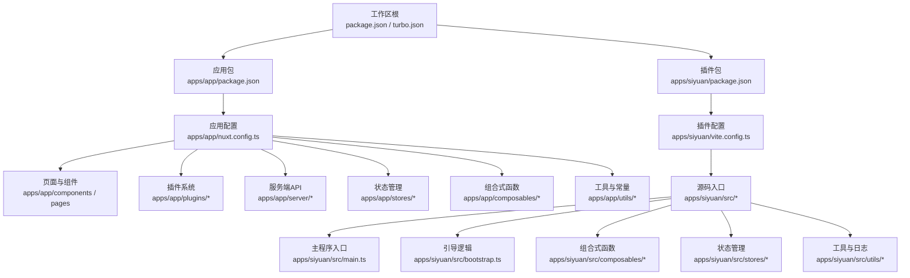
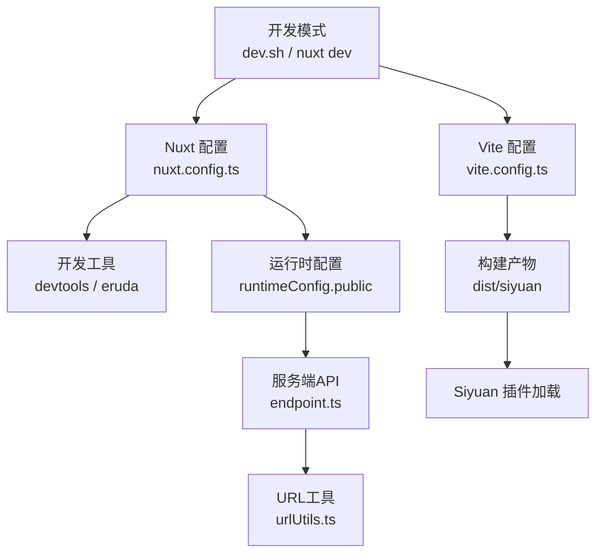
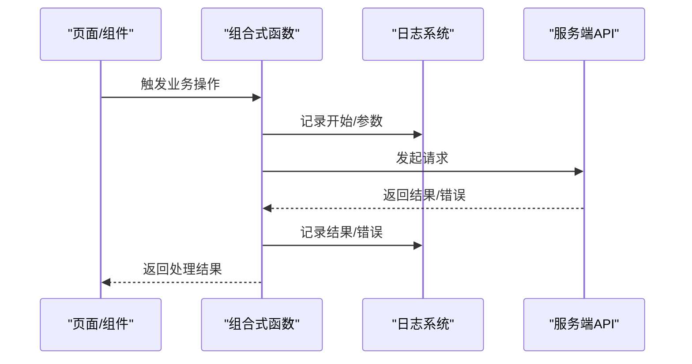
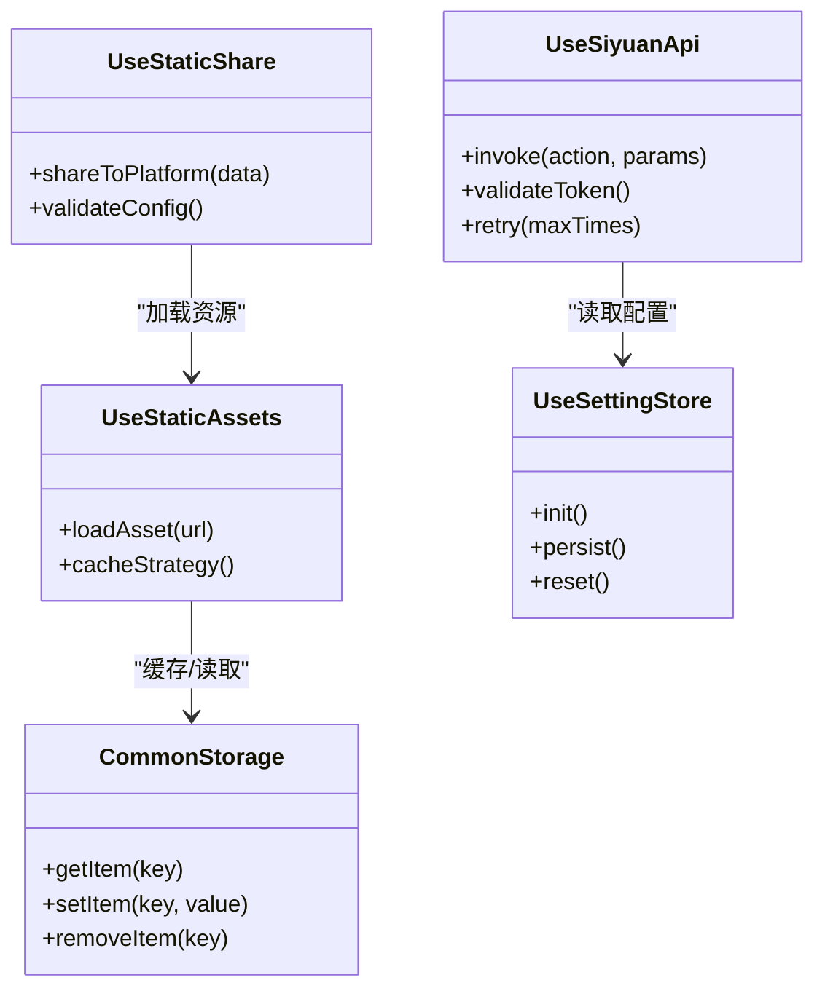
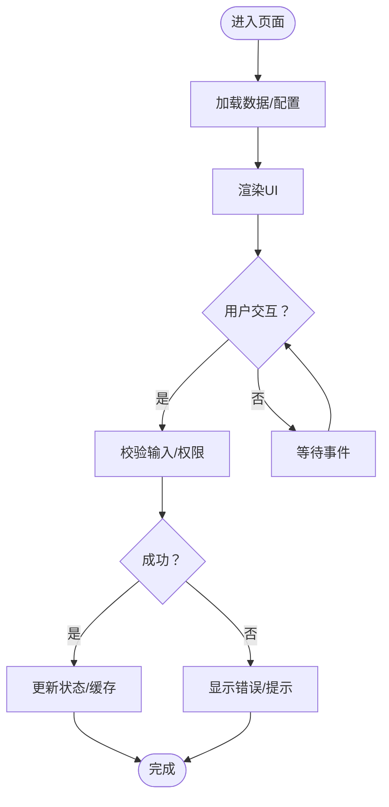
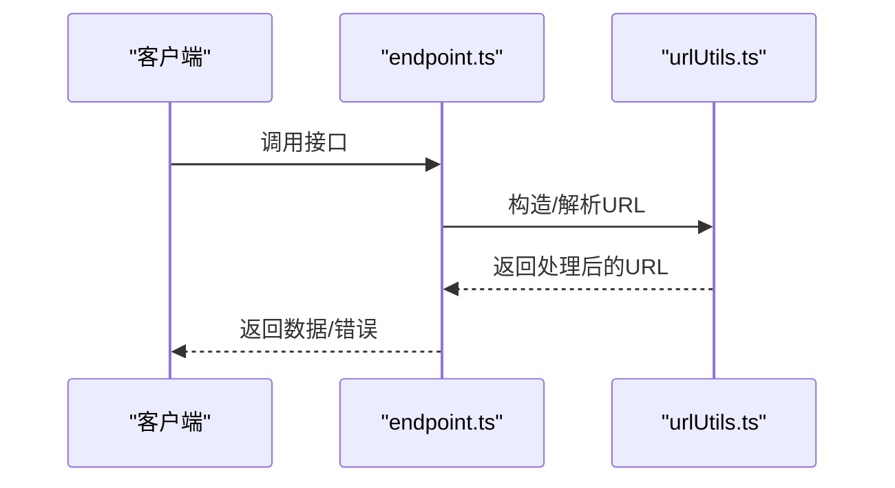
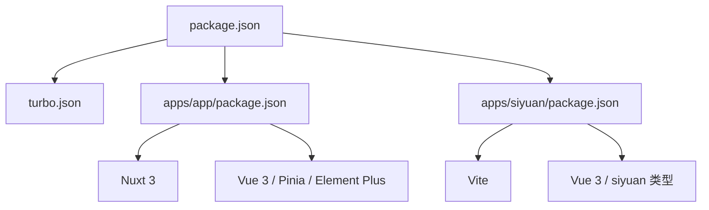

# 测试与调试

<cite>
**本文引用的文件**
- [package.json](file://package.json)
- [apps/app/package.json](file://apps/app/package.json)
- [apps/siyuan/package.json](file://apps/siyuan/package.json)
- [turbo.json](file://turbo.json)
- [apps/siyuan/vite.config.ts](file://apps/siyuan/vite.config.ts)
- [apps/app/nuxt.config.ts](file://apps/app/nuxt.config.ts)
- [apps/app/script/dev.sh](file://apps/app/script/dev.sh)
- [apps/app/script/build.sh](file://apps/app/script/build.sh)
- [apps/siyuan/src/app.config.ts](file://apps/siyuan/src/app.config.ts)
- [apps/app/app.config.ts](file://apps/app/app.config.ts)
- [apps/siyuan/src/main.ts](file://apps/siyuan/src/main.ts)
- [apps/siyuan/src/bootstrap.ts](file://apps/siyuan/src/bootstrap.ts)
- [apps/siyuan/src/utils/appLogger.ts](file://apps/siyuan/src/utils/appLogger.ts)
- [apps/app/utils/appLogger.ts](file://apps/app/utils/appLogger.ts)
- [apps/siyuan/src/composables/useSiyuanApi.ts](file://apps/siyuan/src/composables/useSiyuanApi.ts)
- [apps/siyuan/src/composables/useStaticShare.ts](file://apps/siyuan/src/composables/useStaticShare.ts)
- [apps/siyuan/src/composables/useStaticAssets.ts](file://apps/siyuan/src/composables/useStaticAssets.ts)
- [apps/siyuan/src/stores/useSettingStore.ts](file://apps/siyuan/src/stores/useSettingStore.ts)
- [apps/siyuan/src/stores/common/commonStorage.ts](file://apps/siyuan/src/stores/common/commonStorage.ts)
- [apps/siyuan/src/stores/common/useCommonStorageAsync.ts](file://apps/siyuan/src/stores/common/useCommonStorageAsync.ts)
- [apps/siyuan/src/pages/Share.vue](file://apps/siyuan/src/pages/Share.vue)
- [apps/siyuan/src/pages/Setting/Index.vue](file://apps/siyuan/src/pages/Setting/Index.vue)
- [apps/siyuan/src/pages/Setting/GeneralSetting.vue](file://apps/siyuan/src/pages/Setting/GeneralSetting.vue)
- [apps/siyuan/src/pages/Setting/AdvancedSetting.vue](file://apps/siyuan/src/pages/Setting/AdvancedSetting.vue)
- [apps/app/components/static/Home.vue](file://apps/app/components/static/Home.vue)
- [apps/app/components/static/HomePage.vue](file://apps/app/components/static/HomePage.vue)
- [apps/app/components/public/Detail.vue](file://apps/app/components/public/Detail.vue)
- [apps/app/components/public/DetailPage.vue](file://apps/app/components/public/DetailPage.vue)
- [apps/app/components/common/ConfirmPassword.vue](file://apps/app/components/common/ConfirmPassword.vue)
- [apps/app/components/common/ImagePreview.vue](file://apps/app/components/common/ImagePreview.vue)
- [apps/app/plugins/00.i18n.ts](file://apps/app/plugins/00.i18n.ts)
- [apps/app/plugins/01.hljs.client.ts](file://apps/app/plugins/01.hljs.client.ts)
- [apps/app/plugins/010.embedblock.server.ts](file://apps/app/plugins/010.embedblock.server.ts)
- [apps/app/plugins/011.fold.client.ts](file://apps/app/plugins/011.fold.client.ts)
- [apps/app/plugins/012.fold.server.ts](file://apps/app/plugins/012.fold.server.ts)
- [apps/app/plugins/013.memo.client.ts](file://apps/app/plugins/013.memo.client.ts)
- [apps/app/plugins/014.memo.server.ts](file://apps/app/plugins/014.memo.server.ts)
- [apps/app/plugins/015.htmlblock.client.ts](file://apps/app/plugins/015.htmlblock.client.ts)
- [apps/app/plugins/016.htmlblock.server.ts](file://apps/app/plugins/016.htmlblock.server.ts)
- [apps/app/plugins/017.echarts.client.ts](file://apps/app/plugins/017.echarts.client.ts)
- [apps/app/plugins/018.echarts.server.ts](file://apps/app/plugins/018.echarts.server.ts)
- [apps/app/plugins/02.hljs.server.ts](file://apps/app/plugins/02.hljs.server.ts)
- [apps/app/plugins/03.renderer.static.client.ts](file://apps/app/plugins/03.renderer.static.client.ts)
- [apps/app/plugins/04.renderer.static.server.ts](file://apps/app/plugins/04.renderer.static.server.ts)
- [apps/app/plugins/05.domparser.static.client.ts](file://apps/app/plugins/05.domparser.static.client.ts)
- [apps/app/plugins/06.domparser.static.server.ts](file://apps/app/plugins/06.domparser.static.server.ts)
- [apps/app/plugins/07.datatable.client.ts](file://apps/app/plugins/07.datatable.client.ts)
- [apps/app/plugins/08.datatable.server.ts](file://apps/app/plugins/08.datatable.server.ts)
- [apps/app/plugins/09.embedblock.client.ts](file://apps/app/plugins/09.embedblock.client.ts)
- [apps/app/server/api/endpoint.ts](file://apps/app/server/api/endpoint.ts)
- [apps/app/server/utils/urlUtils.ts](file://apps/app/server/utils/urlUtils.ts)
- [apps/app/stores/useStaticSettingStore.ts](file://apps/app/stores/useStaticSettingStore.ts)
- [apps/app/enums/ShareTypeEnum.ts](file://apps/app/enums/ShareTypeEnum.ts)
- [apps/app/composables/useAppBase.ts](file://apps/app/composables/useAppBase.ts)
- [apps/app/composables/useAuthModeFetch.ts](file://apps/app/composables/useAuthModeFetch.ts)
- [apps/app/composables/useClientThemeMode.ts](file://apps/app/composables/useClientThemeMode.ts)
- [apps/app/composables/useCommonShareType.ts](file://apps/app/composables/useCommonShareType.ts)
- [apps/app/composables/useDocId.ts](file://apps/app/composables/useDocId.ts)
- [apps/app/composables/useImagePreview.ts](file://apps/app/composables/useImagePreview.ts)
- [apps/app/composables/useProviderMode.ts](file://apps/app/composables/useProviderMode.ts)
- [apps/app/composables/useSiyuanSPA.ts](file://apps/app/composables/useSiyuanSPA.ts)
- [apps/app/utils/Constants.ts](file://apps/app/utils/Constants.ts)
- [apps/app/utils/TreeUtils.ts](file://apps/app/utils/TreeUtils.ts)
- [apps/app/utils/utils.ts](file://apps/app/utils/utils.ts)
- [apps/app/utils/ThemeUtils.ts](file://apps/app/utils/ThemeUtils.ts)
- [apps/app/utils/TreeUtils.ts](file://apps/app/utils/TreeUtils.ts)
- [apps/app/utils/TreeUtils.ts](file://apps/app/utils/TreeUtils.ts)
- [apps/app/utils/TreeUtils.ts](file://apps/app/utils/TreeUtils.ts)
- [apps/app/utils/TreeUtils.ts](file://apps/app/utils/TreeUtils.ts)
- [apps/app/utils/TreeUtils.ts](file://apps/app/utils/TreeUtils.ts)
- [apps/app/utils/TreeUtils.ts](file://apps/app/utils/TreeUtils.ts)
- [apps/app/utils/TreeUtils.ts](file://apps/app/utils/TreeUtils.ts)
- [apps/app/utils/TreeUtils.ts](file://apps/app/utils/TreeUtils.ts)
- [apps/app/utils/TreeUtils.ts](file://apps/app/utils/TreeUtils.ts)
- [apps/app/utils/TreeUtils.ts](file://apps/app/utils/TreeUtils.ts)
- [apps/app/utils/TreeUtils.ts](file://apps/app/utils/TreeUtils.ts)
- [apps/app/utils/TreeUtils.ts](file://apps/app/utils/TreeUtils.ts)
- [apps/app/utils/TreeUtils.ts](file://apps/app/utils/TreeUtils.ts)
- [apps/app/utils/TreeUtils.ts](file://apps/app/utils/TreeUtils.ts)
- [apps/app/utils/TreeUtils.ts](file://apps/app/utils/TreeUtils.ts)
- [apps/app/utils/TreeUtils.ts](file://apps/app/utils/TreeUtils.ts)
- [apps/app/utils/TreeUtils.ts](file://apps/app/utils/TreeUtils.ts)
- [apps/app/utils/TreeUtils.ts](file://apps/app/utils/TreeUtils.ts)
- [apps/app/utils/TreeUtils.ts](file://apps/app/utils/TreeUtils.ts)
- [apps/app/utils/TreeUtils.ts](file://apps/app/utils/TreeUtils.ts)
- [apps/app/utils/TreeUtils.ts](file://apps/app/utils/TreeUtils.ts)
- [apps/app/utils/TreeUtils.ts](file://apps/app/utils/TreeUtils.ts)
- [apps/app/utils/TreeUtils.ts](file://apps/app/utils/TreeUtils.ts)
- [apps/app/utils/TreeUtils.ts](file://apps/app/utils/TreeUtils.ts)
- [apps/app/utils/TreeUtils.ts](file://apps/app/utils/TreeUtils.ts)
......
</cite>

## 目录
1. [引言](#引言)
2. [项目结构](#项目结构)
3. [核心组件](#核心组件)
4. [架构总览](#架构总览)
5. [详细组件分析](#详细组件分析)
6. [依赖分析](#依赖分析)
7. [性能考虑](#性能考虑)
8. [故障排查指南](#故障排查指南)
9. [结论](#结论)
10. [附录](#附录)

## 引言
本文件面向 Siyuan 笔记插件“博客”项目，系统性梳理测试与调试体系，覆盖单元测试、集成测试与端到端测试的实施策略；明确测试框架选型与配置要点（如 Vitest、Cypress 等）；给出测试用例编写规范与覆盖率目标；提供调试工具配置与使用方法（浏览器开发者工具、Vue DevTools、Node.js 调试器）；说明日志系统与错误追踪机制，并总结性能测试与内存泄漏检测方案；最后给出测试自动化与持续集成中的执行策略。

## 项目结构
该项目采用多包工作区布局，包含 Web 应用（Nuxt 3）与 Siyuan 插件（Vite + Vue 3），并通过 Turbo 管理构建与开发流程。测试与调试体系应围绕以下关键目录展开：
- 应用层（apps/app）：基于 Nuxt 3 的前端应用，包含页面、组件、插件、服务端 API、国际化等。
- 插件层（apps/siyuan）：基于 Vite 的 Siyuan 插件，包含页面、组合式函数、存储、工具类等。
- 工作区根（package.json、turbo.json）：统一脚本与任务编排。

图表来源
- [apps/app/nuxt.config.ts:1-125](file://apps/app/nuxt.config.ts#L1-L125)
- [apps/siyuan/vite.config.ts:1-136](file://apps/siyuan/vite.config.ts#L1-L136)
- [apps/app/package.json:1-41](file://apps/app/package.json#L1-L41)
- [apps/siyuan/package.json:1-43](file://apps/siyuan/package.json#L1-L43)
- [package.json:1-27](file://package.json#L1-L27)
- [turbo.json:1-17](file://turbo.json#L1-L17)

章节来源
- [apps/app/nuxt.config.ts:1-125](file://apps/app/nuxt.config.ts#L1-L125)
- [apps/siyuan/vite.config.ts:1-136](file://apps/siyuan/vite.config.ts#L1-L136)
- [apps/app/package.json:1-41](file://apps/app/package.json#L1-L41)
- [apps/siyuan/package.json:1-43](file://apps/siyuan/package.json#L1-L43)
- [package.json:1-27](file://package.json#L1-L27)
- [turbo.json:1-17](file://turbo.json#L1-L17)

## 核心组件
- 日志系统：两处 appLogger 实现分别位于应用与插件层，提供统一的日志记录能力，便于测试与调试时定位问题。
- 组合式函数：useSiyuanApi、useStaticShare、useStaticAssets 等封装了跨端交互与静态资源处理，是测试与调试的重点对象。
- 存储层：useSettingStore、commonStorage、useCommonStorageAsync 等负责数据持久化与状态管理，需关注其初始化与异常分支。
- 页面与组件：Share.vue、Setting/*、Home/HomePage、Detail/DetailPage、公共组件 ConfirmPassword、ImagePreview 等，是端到端测试的主要场景。
- 服务端 API：endpoint.ts 与 urlUtils.ts 提供后端接口与 URL 工具，适合集成测试验证请求与响应。

章节来源
- [apps/siyuan/src/utils/appLogger.ts](file://apps/siyuan/src/utils/appLogger.ts)
- [apps/app/utils/appLogger.ts](file://apps/app/utils/appLogger.ts)
- [apps/siyuan/src/composables/useSiyuanApi.ts](file://apps/siyuan/src/composables/useSiyuanApi.ts)
- [apps/siyuan/src/composables/useStaticShare.ts](file://apps/siyuan/src/composables/useStaticShare.ts)
- [apps/siyuan/src/composables/useStaticAssets.ts](file://apps/siyuan/src/composables/useStaticAssets.ts)
- [apps/siyuan/src/stores/useSettingStore.ts](file://apps/siyuan/src/stores/useSettingStore.ts)
- [apps/siyuan/src/stores/common/commonStorage.ts](file://apps/siyuan/src/stores/common/commonStorage.ts)
- [apps/siyuan/src/stores/common/useCommonStorageAsync.ts](file://apps/siyuan/src/stores/common/useCommonStorageAsync.ts)
- [apps/siyuan/src/pages/Share.vue](file://apps/siyuan/src/pages/Share.vue)
- [apps/siyuan/src/pages/Setting/Index.vue](file://apps/siyuan/src/pages/Setting/Index.vue)
- [apps/siyuan/src/pages/Setting/GeneralSetting.vue](file://apps/siyuan/src/pages/Setting/GeneralSetting.vue)
- [apps/siyuan/src/pages/Setting/AdvancedSetting.vue](file://apps/siyuan/src/pages/Setting/AdvancedSetting.vue)
- [apps/app/components/static/Home.vue](file://apps/app/components/static/Home.vue)
- [apps/app/components/static/HomePage.vue](file://apps/app/components/static/HomePage.vue)
- [apps/app/components/public/Detail.vue](file://apps/app/components/public/Detail.vue)
- [apps/app/components/public/DetailPage.vue](file://apps/app/components/public/DetailPage.vue)
- [apps/app/components/common/ConfirmPassword.vue](file://apps/app/components/common/ConfirmPassword.vue)
- [apps/app/components/common/ImagePreview.vue](file://apps/app/components/common/ImagePreview.vue)
- [apps/app/server/api/endpoint.ts](file://apps/app/server/api/endpoint.ts)
- [apps/app/server/utils/urlUtils.ts](file://apps/app/server/utils/urlUtils.ts)

## 架构总览
下图展示应用与插件在开发与构建阶段的关键交互，以及测试与调试的切入点：

图表来源
- [apps/app/script/dev.sh:1-15](file://apps/app/script/dev.sh#L1-L15)
- [apps/app/nuxt.config.ts:1-125](file://apps/app/nuxt.config.ts#L1-L125)
- [apps/siyuan/vite.config.ts:1-136](file://apps/siyuan/vite.config.ts#L1-L136)
- [apps/app/server/api/endpoint.ts](file://apps/app/server/api/endpoint.ts)
- [apps/app/server/utils/urlUtils.ts](file://apps/app/server/utils/urlUtils.ts)

章节来源
- [apps/app/script/dev.sh:1-15](file://apps/app/script/dev.sh#L1-L15)
- [apps/app/nuxt.config.ts:1-125](file://apps/app/nuxt.config.ts#L1-L125)
- [apps/siyuan/vite.config.ts:1-136](file://apps/siyuan/vite.config.ts#L1-L136)
- [apps/app/server/api/endpoint.ts](file://apps/app/server/api/endpoint.ts)
- [apps/app/server/utils/urlUtils.ts](file://apps/app/server/utils/urlUtils.ts)

## 详细组件分析

### 日志系统与错误追踪
- 设计原则：在应用与插件两端分别提供 appLogger，确保不同运行环境下的日志输出一致。
- 使用建议：
  - 在组合式函数与页面中调用日志接口记录关键事件与错误。
  - 在服务端 API 中对请求参数、响应状态与异常进行日志归档。
  - 在构建与部署脚本中输出关键步骤与结果，便于 CI 排错。
- 错误追踪：
  - 结合浏览器控制台与 Vue DevTools 定位前端异常。
  - 结合 Node.js 调试器与断点定位服务端逻辑问题。
  - 对网络请求失败、资源加载异常、存储写入失败等场景增加重试与降级策略。

图表来源
- [apps/siyuan/src/utils/appLogger.ts](file://apps/siyuan/src/utils/appLogger.ts)
- [apps/app/utils/appLogger.ts](file://apps/app/utils/appLogger.ts)
- [apps/app/server/api/endpoint.ts](file://apps/app/server/api/endpoint.ts)

章节来源
- [apps/siyuan/src/utils/appLogger.ts](file://apps/siyuan/src/utils/appLogger.ts)
- [apps/app/utils/appLogger.ts](file://apps/app/utils/appLogger.ts)
- [apps/app/server/api/endpoint.ts](file://apps/app/server/api/endpoint.ts)

### 组合式函数与状态管理
- 关键函数：
  - useSiyuanApi：封装与 Siyuan 的交互，需重点测试鉴权、网络异常、超时等边界条件。
  - useStaticShare / useStaticAssets：测试静态资源加载、缓存策略与回退机制。
  - useSettingStore / commonStorage：测试初始化、读写一致性、并发访问与异常恢复。
- 测试策略：
  - 单元测试：针对纯函数与边界条件；模拟外部依赖（如 fetch、localStorage）。
  - 集成测试：组合式函数与存储层协作，验证状态变更与副作用。
  - 端到端测试：从页面触发到最终渲染，覆盖真实用户路径。

图表来源
- [apps/siyuan/src/composables/useSiyuanApi.ts](file://apps/siyuan/src/composables/useSiyuanApi.ts)
- [apps/siyuan/src/composables/useStaticShare.ts](file://apps/siyuan/src/composables/useStaticShare.ts)
- [apps/siyuan/src/composables/useStaticAssets.ts](file://apps/siyuan/src/composables/useStaticAssets.ts)
- [apps/siyuan/src/stores/useSettingStore.ts](file://apps/siyuan/src/stores/useSettingStore.ts)
- [apps/siyuan/src/stores/common/commonStorage.ts](file://apps/siyuan/src/stores/common/commonStorage.ts)

章节来源
- [apps/siyuan/src/composables/useSiyuanApi.ts](file://apps/siyuan/src/composables/useSiyuanApi.ts)
- [apps/siyuan/src/composables/useStaticShare.ts](file://apps/siyuan/src/composables/useStaticShare.ts)
- [apps/siyuan/src/composables/useStaticAssets.ts](file://apps/siyuan/src/composables/useStaticAssets.ts)
- [apps/siyuan/src/stores/useSettingStore.ts](file://apps/siyuan/src/stores/useSettingStore.ts)
- [apps/siyuan/src/stores/common/commonStorage.ts](file://apps/siyuan/src/stores/common/commonStorage.ts)

### 页面与组件测试场景
- Share.vue：分享流程、权限校验、平台适配。
- Setting/*：通用设置、高级设置、配置持久化与回滚。
- Home/HomePage、Detail/DetailPage：路由导航、内容渲染、图片预览、密码保护。
- 公共组件 ConfirmPassword、ImagePreview：输入校验、异步加载、错误提示。

图表来源
- [apps/siyuan/src/pages/Share.vue](file://apps/siyuan/src/pages/Share.vue)
- [apps/siyuan/src/pages/Setting/Index.vue](file://apps/siyuan/src/pages/Setting/Index.vue)
- [apps/siyuan/src/pages/Setting/GeneralSetting.vue](file://apps/siyuan/src/pages/Setting/GeneralSetting.vue)
- [apps/siyuan/src/pages/Setting/AdvancedSetting.vue](file://apps/siyuan/src/pages/Setting/AdvancedSetting.vue)
- [apps/app/components/static/Home.vue](file://apps/app/components/static/Home.vue)
- [apps/app/components/static/HomePage.vue](file://apps/app/components/static/HomePage.vue)
- [apps/app/components/public/Detail.vue](file://apps/app/components/public/Detail.vue)
- [apps/app/components/public/DetailPage.vue](file://apps/app/components/public/DetailPage.vue)
- [apps/app/components/common/ConfirmPassword.vue](file://apps/app/components/common/ConfirmPassword.vue)
- [apps/app/components/common/ImagePreview.vue](file://apps/app/components/common/ImagePreview.vue)

章节来源
- [apps/siyuan/src/pages/Share.vue](file://apps/siyuan/src/pages/Share.vue)
- [apps/siyuan/src/pages/Setting/Index.vue](file://apps/siyuan/src/pages/Setting/Index.vue)
- [apps/siyuan/src/pages/Setting/GeneralSetting.vue](file://apps/siyuan/src/pages/Setting/GeneralSetting.vue)
- [apps/siyuan/src/pages/Setting/AdvancedSetting.vue](file://apps/siyuan/src/pages/Setting/AdvancedSetting.vue)
- [apps/app/components/static/Home.vue](file://apps/app/components/static/Home.vue)
- [apps/app/components/static/HomePage.vue](file://apps/app/components/static/HomePage.vue)
- [apps/app/components/public/Detail.vue](file://apps/app/components/public/Detail.vue)
- [apps/app/components/public/DetailPage.vue](file://apps/app/components/public/DetailPage.vue)
- [apps/app/components/common/ConfirmPassword.vue](file://apps/app/components/common/ConfirmPassword.vue)
- [apps/app/components/common/ImagePreview.vue](file://apps/app/components/common/ImagePreview.vue)

### 服务端 API 与 URL 工具
- endpoint.ts：定义对外接口，需测试请求格式、鉴权头、分页与错误码。
- urlUtils.ts：构造与解析 URL，需测试编码、拼接、默认值与边界字符。

图表来源
- [apps/app/server/api/endpoint.ts](file://apps/app/server/api/endpoint.ts)
- [apps/app/server/utils/urlUtils.ts](file://apps/app/server/utils/urlUtils.ts)

章节来源
- [apps/app/server/api/endpoint.ts](file://apps/app/server/api/endpoint.ts)
- [apps/app/server/utils/urlUtils.ts](file://apps/app/server/utils/urlUtils.ts)

## 依赖分析
- 开发与构建工具：
  - Nuxt 3（apps/app）、Vite（apps/siyuan）、Turbo（工作区任务编排）。
  - ESLint、Stylus、Auto Import、Components 等辅助工具提升开发体验。
- 运行时依赖：
  - Vue 3、Pinia、Element Plus、VueUse 等生态库。
  - zhi-* 系列工具库与 siyuan 类型声明，支撑跨端交互与类型安全。
- 测试与调试相关：
  - 开发模式下启用 devtools 与 eruda，便于前端调试。
  - 构建时可关闭压缩或生成 source map，便于定位问题。

图表来源
- [package.json:1-27](file://package.json#L1-L27)
- [turbo.json:1-17](file://turbo.json#L1-L17)
- [apps/app/package.json:1-41](file://apps/app/package.json#L1-L41)
- [apps/siyuan/package.json:1-43](file://apps/siyuan/package.json#L1-L43)

章节来源
- [package.json:1-27](file://package.json#L1-L27)
- [turbo.json:1-17](file://turbo.json#L1-L17)
- [apps/app/package.json:1-41](file://apps/app/package.json#L1-L41)
- [apps/siyuan/package.json:1-43](file://apps/siyuan/package.json#L1-L43)

## 性能考虑
- 构建优化：
  - 生产构建关闭压缩与生成 source map，便于调试；开发模式开启压缩与热更新。
  - 使用 viteStaticCopy 复制静态资源，减少打包体积与构建时间。
- 运行时优化：
  - 合理拆分组件与页面，按需加载与懒加载。
  - 对高频计算与网络请求进行缓存与节流。
- 性能测试与内存泄漏检测：
  - 使用浏览器性能面板记录长列表渲染、图片加载与滚动性能。
  - 使用内存快照对比长时间运行后的内存占用，定位泄漏点。
  - 对组合式函数与存储层进行压力测试，观察状态增长与 GC 行为。

章节来源
- [apps/siyuan/vite.config.ts:75-134](file://apps/siyuan/vite.config.ts#L75-L134)
- [apps/app/nuxt.config.ts:90-104](file://apps/app/nuxt.config.ts#L90-L104)

## 故障排查指南
- 浏览器端：
  - 启用 Vue DevTools 查看组件树、状态与事件流。
  - 使用开发者工具 Network 面板检查请求与响应，结合日志定位异常。
  - 在开发脚本中注入 eruda，快速获取移动端控制台。
- 服务端与构建：
  - 查看构建日志与错误堆栈，确认依赖安装与环境变量。
  - 对 vite.config.ts 与 nuxt.config.ts 的 define 与 external 配置进行核对。
- 常见问题：
  - 跨域与鉴权：检查 endpoint.ts 的请求头与 CORS 配置。
  - 资源加载失败：核对 viteStaticCopy 的目标路径与权限。
  - 状态不一致：检查 useSettingStore 与 commonStorage 的同步逻辑。

章节来源
- [apps/app/nuxt.config.ts:60-86](file://apps/app/nuxt.config.ts#L60-L86)
- [apps/app/script/dev.sh:12-15](file://apps/app/script/dev.sh#L12-L15)
- [apps/siyuan/vite.config.ts:29-56](file://apps/siyuan/vite.config.ts#L29-L56)
- [apps/app/server/api/endpoint.ts](file://apps/app/server/api/endpoint.ts)

## 结论
本项目具备清晰的多包结构与成熟的前端生态，测试与调试体系应围绕日志系统、组合式函数、状态管理、页面与服务端 API 展开。通过合理的测试策略（单元、集成、端到端）与调试工具（浏览器、Vue DevTools、Node.js 调试器），可有效提升质量与交付效率。同时，结合性能测试与内存泄漏检测，保障长期稳定运行。

## 附录

### 测试框架选型与配置建议
- 单元测试（Vitest）：
  - 适用范围：纯函数、组合式函数、工具类、存储层。
  - 配置要点：启用 DOM 环境（如需）、mock 外部依赖、设置覆盖率阈值。
- 集成测试（Cypress）：
  - 适用范围：页面交互、路由导航、组件组合、服务端 API。
  - 配置要点：设置 baseUrl、登录态管理、截图与视频录制。
- 端到端测试（Playwright/Cypress）：
  - 适用范围：完整用户路径、跨浏览器兼容性、移动端模拟。
  - 配置要点：并行执行、重试策略、报告与归档。

章节来源
- [apps/app/nuxt.config.ts:20-23](file://apps/app/nuxt.config.ts#L20-L23)
- [apps/siyuan/vite.config.ts:17-57](file://apps/siyuan/vite.config.ts#L17-L57)

### 测试用例编写规范与覆盖率要求
- 规范：
  - 每个功能模块至少包含正常路径、边界条件与异常分支的测试。
  - 使用语义化命名与分层组织（describe/it/test）。
  - 对异步逻辑使用 await 与超时控制。
- 覆盖率：
  - 语句覆盖率与分支覆盖率不低于 80%，函数与行覆盖率不低于 75%。
  - 对关键路径（鉴权、存储、网络）达到 100%。

章节来源
- [apps/siyuan/src/composables/useSiyuanApi.ts](file://apps/siyuan/src/composables/useSiyuanApi.ts)
- [apps/siyuan/src/composables/useStaticShare.ts](file://apps/siyuan/src/composables/useStaticShare.ts)
- [apps/siyuan/src/stores/useSettingStore.ts](file://apps/siyuan/src/stores/useSettingStore.ts)

### 调试工具配置与使用
- 浏览器开发者工具：Network、Elements、Console、Performance、Memory。
- Vue DevTools：组件树、状态、事件、性能分析。
- Node.js 调试器：断点、单步执行、变量检查、异步堆栈。
- Eruda：移动端快速调试，配合开发脚本自动注入。

章节来源
- [apps/app/nuxt.config.ts:60-86](file://apps/app/nuxt.config.ts#L60-L86)
- [apps/app/script/dev.sh:12-15](file://apps/app/script/dev.sh#L12-L15)

### 日志系统与错误追踪
- 统一日志接口：在应用与插件两端实现一致的 appLogger。
- 错误追踪：结合浏览器控制台、Vue DevTools、Node.js 调试器与日志归档。
- 建议：对关键路径增加埋点与采样，便于问题复现与回归。

章节来源
- [apps/siyuan/src/utils/appLogger.ts](file://apps/siyuan/src/utils/appLogger.ts)
- [apps/app/utils/appLogger.ts](file://apps/app/utils/appLogger.ts)

### 性能测试与内存泄漏检测
- 性能测试：使用浏览器 Performance 面板记录渲染与交互性能。
- 内存泄漏：使用 Memory 快照对比，定位未释放的对象与闭包。
- 压力测试：对组合式函数与存储层进行高并发与长时间运行测试。

章节来源
- [apps/siyuan/vite.config.ts:80-87](file://apps/siyuan/vite.config.ts#L80-L87)
- [apps/app/nuxt.config.ts:90-104](file://apps/app/nuxt.config.ts#L90-L104)

### 测试自动化与持续集成
- 任务编排：利用 Turbo 管理构建与开发任务，确保一致性。
- CI 策略：在流水线中执行 lint、test、build、package 步骤，并上传覆盖率报告。
- 最佳实践：将测试与构建分离，失败快速反馈，保留日志与工件。

章节来源
- [turbo.json:1-17](file://turbo.json#L1-L17)
- [package.json:4-21](file://package.json#L4-L21)