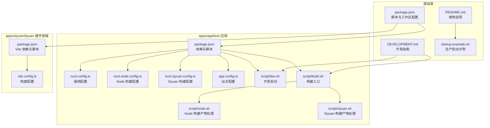
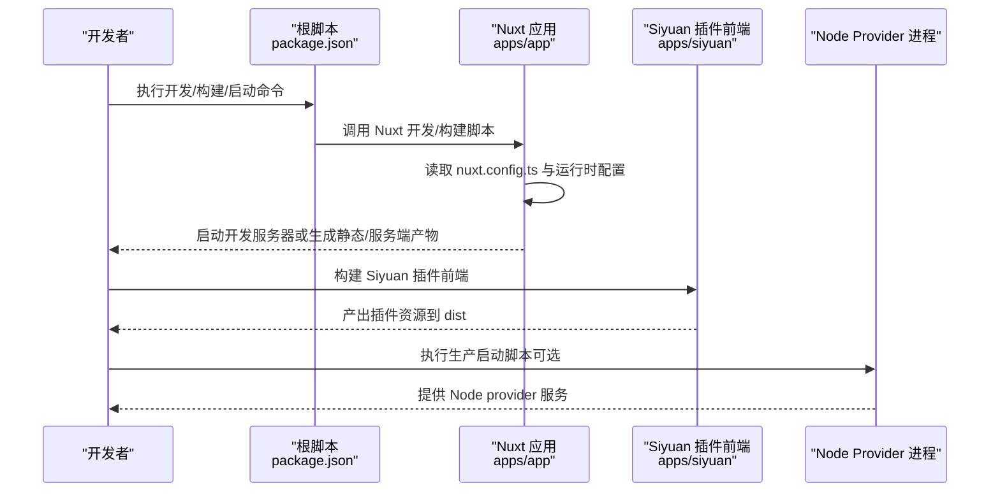
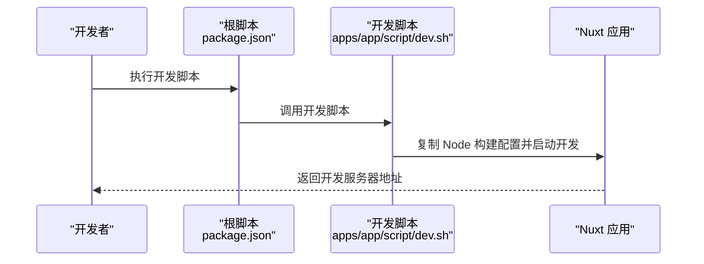
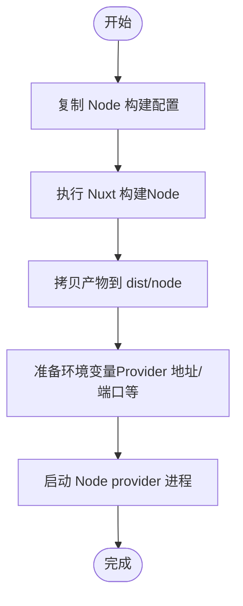
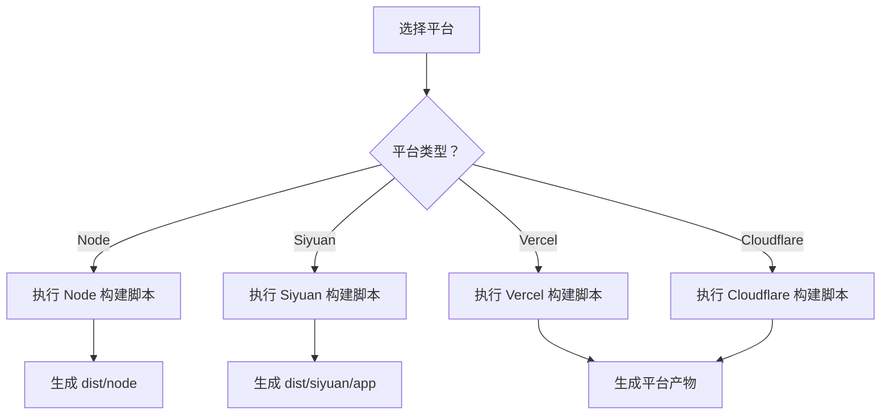
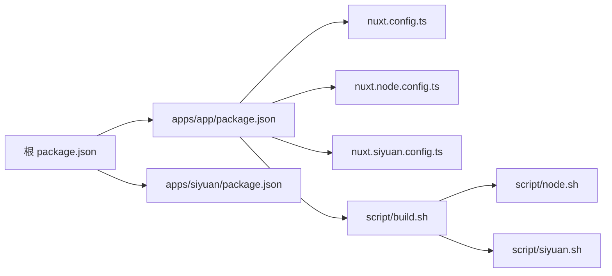

# 快速开始

<cite>
**本文引用的文件**
- [package.json](file://package.json)
- [README.md](file://README.md)
- [DEVELOPMENT.md](file://DEVELOPMENT.md)
- [startup.example.sh](file://startup.example.sh)
- [apps/app/package.json](file://apps/app/package.json)
- [apps/app/nuxt.config.ts](file://apps/app/nuxt.config.ts)
- [apps/app/nuxt.node.config.ts](file://apps/app/nuxt.node.config.ts)
- [apps/app/nuxt.siyuan.config.ts](file://apps/app/nuxt.siyuan.config.ts)
- [apps/app/app.config.ts](file://apps/app/app.config.ts)
- [apps/app/script/dev.sh](file://apps/app/script/dev.sh)
- [apps/app/script/build.sh](file://apps/app/script/build.sh)
- [apps/app/script/node.sh](file://apps/app/script/node.sh)
- [apps/app/script/siyuan.sh](file://apps/app/script/siyuan.sh)
- [apps/siyuan/package.json](file://apps/siyuan/package.json)
- [apps/siyuan/vite.config.ts](file://apps/siyuan/vite.config.ts)
- [plugin.json](file://plugin.json)
</cite>

## 目录
1. [简介](#简介)
2. [项目结构](#项目结构)
3. [核心组件](#核心组件)
4. [架构总览](#架构总览)
5. [详细组件分析](#详细组件分析)
6. [依赖分析](#依赖分析)
7. [性能考虑](#性能考虑)
8. [故障排除指南](#故障排除指南)
9. [结论](#结论)
10. [附录](#附录)

## 简介
本指南面向新手开发者，帮助你在本地快速搭建并运行 Siyuan Plugin Blog 项目。你将学到：
- 环境要求与安装步骤
- 基础配置方法
- 三种启动方式：Node provider 调试启动、Node provider 生产启动、构建打包
- 常见问题排查与最佳实践

## 项目结构
该项目采用多包工作区（pnpm workspace）组织，核心模块包括：
- apps/app：基于 Nuxt 3 的前端应用，支持 SSR/SPA、多平台构建（Node、Vercel、Cloudflare、Siyuan）
- apps/siyuan：Siyuan 插件前端，负责在桌面端渲染与交互
- packages：共享配置与工具（如 ESLint、TS 配置）
- 根目录脚本：统一的开发、构建、打包与发布流程

图表来源
- [package.json:1-27](file://package.json#L1-L27)
- [apps/app/package.json:1-41](file://apps/app/package.json#L1-L41)
- [apps/app/nuxt.config.ts:1-125](file://apps/app/nuxt.config.ts#L1-L125)
- [apps/app/nuxt.node.config.ts:1-125](file://apps/app/nuxt.node.config.ts#L1-L125)
- [apps/app/nuxt.siyuan.config.ts:1-133](file://apps/app/nuxt.siyuan.config.ts#L1-L133)
- [apps/app/app.config.ts:1-92](file://apps/app/app.config.ts#L1-L92)
- [apps/app/script/dev.sh:1-15](file://apps/app/script/dev.sh#L1-L15)
- [apps/app/script/build.sh:1-63](file://apps/app/script/build.sh#L1-L63)
- [apps/app/script/node.sh:1-31](file://apps/app/script/node.sh#L1-L31)
- [apps/app/script/siyuan.sh:1-31](file://apps/app/script/siyuan.sh#L1-L31)
- [apps/siyuan/package.json:1-43](file://apps/siyuan/package.json#L1-L43)
- [apps/siyuan/vite.config.ts:1-136](file://apps/siyuan/vite.config.ts#L1-L136)
- [startup.example.sh:1-7](file://startup.example.sh#L1-L7)

章节来源
- [package.json:1-27](file://package.json#L1-L27)
- [apps/app/package.json:1-41](file://apps/app/package.json#L1-L41)
- [apps/siyuan/package.json:1-43](file://apps/siyuan/package.json#L1-L43)

## 核心组件
- Nuxt 应用（apps/app）：提供 Web 端博客展示能力，支持多平台构建与运行模式（SSR/SPA），并通过环境变量控制默认类型、Provider 模式与 Provider 地址。
- Siyuan 插件前端（apps/siyuan）：在 Siyuan 桌面端内渲染插件界面，使用 Vite 构建并输出到共享的 dist 目录。
- 根脚本与配置：统一管理开发、构建、打包与发布流程；提供 Node provider 生产启动示例。

章节来源
- [apps/app/nuxt.config.ts:113-121](file://apps/app/nuxt.config.ts#L113-L121)
- [apps/app/nuxt.node.config.ts:113-121](file://apps/app/nuxt.node.config.ts#L113-L121)
- [apps/app/nuxt.siyuan.config.ts:121-129](file://apps/app/nuxt.siyuan.config.ts#L121-L129)
- [apps/siyuan/vite.config.ts:75-134](file://apps/siyuan/vite.config.ts#L75-L134)

## 架构总览
下图展示了三种启动方式的总体流程与关键节点：

图表来源
- [package.json:4-21](file://package.json#L4-L21)
- [apps/app/script/dev.sh:12-15](file://apps/app/script/dev.sh#L12-L15)
- [apps/app/script/build.sh:46-63](file://apps/app/script/build.sh#L46-L63)
- [apps/siyuan/vite.config.ts:75-134](file://apps/siyuan/vite.config.ts#L75-L134)
- [startup.example.sh:3-7](file://startup.example.sh#L3-L7)

## 详细组件分析

### 环境要求与安装
- Node.js 版本：建议使用 LTS 版本（参考 Vite/Nuxt 依赖与 Docker 示例中的 Node 18 镜像）
- 包管理器：pnpm（版本在根 package.json 中声明）
- 安装步骤：
  - 克隆仓库后，在根目录执行安装命令以初始化工作区依赖
  - 如需使用私有镜像加速，可参考开发文档中的 Docker 镜像操作

章节来源
- [package.json:25](file://package.json#L25)
- [DEVELOPMENT.md:9-17](file://DEVELOPMENT.md#L9-L17)

### 基础配置
- 默认运行时配置（Nuxt）：
  - defaultType：默认类型（例如 node）
  - siyuanApiUrl：Siyuan API 地址
  - providerMode：是否启用 Provider 模式
  - providerUrl：Provider 服务地址
- 站点配置（app.config.ts）：
  - 支持站点语言、标题、描述、首页 ID、主题模式与主题名称等
- 构建配置差异：
  - Node 构建：使用 nuxt.node.config.ts，生成服务端产物
  - Siyuan 构建：使用 nuxt.siyuan.config.ts，生成 SPA 并放置于插件目录

章节来源
- [apps/app/nuxt.config.ts:113-121](file://apps/app/nuxt.config.ts#L113-L121)
- [apps/app/nuxt.node.config.ts:113-121](file://apps/app/nuxt.node.config.ts#L113-L121)
- [apps/app/nuxt.siyuan.config.ts:121-129](file://apps/app/nuxt.siyuan.config.ts#L121-L129)
- [apps/app/app.config.ts:74-91](file://apps/app/app.config.ts#L74-L91)

### 启动方式一：通过 Node provider 调试启动
- 适用场景：本地联调，快速预览 Web 端效果
- 步骤：
  - 在根目录执行开发脚本，自动切换到 Node 构建配置并启动开发服务器
  - 访问开发服务器提供的地址进行调试
- 关键命令与文件：
  - 根脚本：package.json 中的开发脚本
  - 切换配置：脚本会复制 Node 构建配置覆盖当前 Nuxt 配置
  - 启动参数：可传入 host 参数以允许外网访问

图表来源
- [package.json:5](file://package.json#L5)
- [apps/app/script/dev.sh:12-15](file://apps/app/script/dev.sh#L12-L15)

章节来源
- [package.json:5](file://package.json#L5)
- [apps/app/script/dev.sh:12-15](file://apps/app/script/dev.sh#L12-L15)

### 启动方式二：Node provider 生产启动
- 适用场景：将应用作为 Node provider 部署到服务器
- 步骤：
  - 构建 Node 产物（生成服务端产物）
  - 准备启动脚本（复制示例脚本为实际启动脚本）
  - 设置环境变量（如 Provider 地址、端口等）
  - 启动 Node provider 进程
- 关键命令与文件：
  - 构建脚本：apps/app/script/build.sh 与 apps/app/script/node.sh
  - 启动脚本：startup.example.sh（复制为 startup.sh 后使用）

图表来源
- [apps/app/script/build.sh:46-63](file://apps/app/script/build.sh#L46-L63)
- [apps/app/script/node.sh:12-31](file://apps/app/script/node.sh#L12-L31)
- [startup.example.sh:3-7](file://startup.example.sh#L3-L7)

章节来源
- [apps/app/script/build.sh:46-63](file://apps/app/script/build.sh#L46-L63)
- [apps/app/script/node.sh:12-31](file://apps/app/script/node.sh#L12-L31)
- [startup.example.sh:3-7](file://startup.example.sh#L3-L7)

### 启动方式三：构建打包
- 适用场景：生成可在不同平台运行的产物（Node、Vercel、Cloudflare、Siyuan）
- 步骤：
  - 选择目标平台（通过构建入口脚本传参）
  - 执行对应平台的构建脚本
  - 产物输出至 dist 目录（Node 产物位于 dist/node，Siyuan 产物位于 dist/siyuan/app）
- 关键命令与文件：
  - 构建入口：apps/app/script/build.sh
  - Node 平台：apps/app/script/node.sh
  - Siyuan 平台：apps/app/script/siyuan.sh
  - Vercel/Cloudflare：在 Nuxt 层面分别提供构建脚本

图表来源
- [apps/app/script/build.sh:46-63](file://apps/app/script/build.sh#L46-L63)
- [apps/app/script/node.sh:12-31](file://apps/app/script/node.sh#L12-L31)
- [apps/app/script/siyuan.sh:12-31](file://apps/app/script/siyuan.sh#L12-L31)

章节来源
- [apps/app/script/build.sh:46-63](file://apps/app/script/build.sh#L46-L63)
- [apps/app/script/node.sh:12-31](file://apps/app/script/node.sh#L12-L31)
- [apps/app/script/siyuan.sh:12-31](file://apps/app/script/siyuan.sh#L12-L31)

### Siyuan 插件前端（桌面端）
- 作用：在 Siyuan 桌面端内渲染插件界面，构建产物输出到共享的 dist 目录
- 关键点：
  - Vite 构建配置中设置了外部依赖（如 siyuan），避免被打包进插件
  - 构建输出路径指向根目录的 dist/siyuan
  - 支持热重载与静态资源复制

章节来源
- [apps/siyuan/vite.config.ts:75-134](file://apps/siyuan/vite.config.ts#L75-L134)
- [apps/siyuan/package.json:6-13](file://apps/siyuan/package.json#L6-L13)

### 插件元数据（plugin.json）
- 描述了插件的基本信息、支持平台、国际化文件与说明文档等
- 便于在 Siyuan 中识别与加载插件

章节来源
- [plugin.json:1-43](file://plugin.json#L1-L43)

## 依赖分析
- 根脚本依赖关系：
  - package.json 中的脚本统一调度各子包的构建与开发任务
  - apps/app 与 apps/siyuan 分别维护各自的依赖与构建脚本
- Nuxt 配置依赖关系：
  - 通用配置与平台特定配置相互独立，通过脚本切换
  - 运行时配置通过环境变量注入，便于在不同环境间切换

图表来源
- [package.json:4-21](file://package.json#L4-L21)
- [apps/app/package.json:1-41](file://apps/app/package.json#L1-L41)
- [apps/app/script/build.sh:46-63](file://apps/app/script/build.sh#L46-L63)
- [apps/app/script/node.sh:12-31](file://apps/app/script/node.sh#L12-L31)
- [apps/app/script/siyuan.sh:12-31](file://apps/app/script/siyuan.sh#L12-L31)

章节来源
- [package.json:4-21](file://package.json#L4-L21)
- [apps/app/package.json:1-41](file://apps/app/package.json#L1-L41)

## 性能考虑
- 构建内存限制：Node 构建脚本中设置了较大的堆内存上限，以避免打包过程中的内存不足
- 按需加载与插件：Nuxt 配置中启用了自动导入与组件解析插件，有助于减少样板代码并提升开发效率
- 产物优化：根据构建目标（Node/Siyuan/Vercel/Cloudflare）选择合适的配置，避免不必要的资源打包

章节来源
- [apps/app/script/node.sh:15](file://apps/app/script/node.sh#L15)
- [apps/app/nuxt.config.ts:96-104](file://apps/app/nuxt.config.ts#L96-L104)

## 故障排除指南
- 端口占用
  - 现象：启动失败或端口被占用
  - 处理：修改启动脚本中的端口或关闭占用进程
- Provider 地址错误
  - 现象：Web 端无法加载内容或报错
  - 处理：检查运行时配置中的 Provider 地址，确保与实际服务一致
- 构建失败（Node）
  - 现象：打包过程中内存溢出或依赖解析异常
  - 处理：确认已设置较大的堆内存；检查依赖版本与 Node 版本匹配情况
- Siyuan 插件未显示
  - 现象：在 Siyuan 中找不到插件
  - 处理：确认构建产物已输出到 dist/siyuan，并检查插件元数据与路径配置

章节来源
- [startup.example.sh:5](file://startup.example.sh#L5)
- [apps/app/nuxt.config.ts:113-121](file://apps/app/nuxt.config.ts#L113-L121)
- [apps/app/script/node.sh:15](file://apps/app/script/node.sh#L15)
- [apps/siyuan/vite.config.ts:75-134](file://apps/siyuan/vite.config.ts#L75-L134)

## 结论
通过本指南，你可以：
- 在本地快速完成环境准备与安装
- 掌握三种启动方式与对应的构建流程
- 正确配置运行时参数与 Provider 地址
- 遇到常见问题时快速定位与解决

## 附录
- 快速命令清单（不展示具体代码，仅列命令）
  - 安装依赖：在根目录执行安装命令
  - 调试启动（Node provider）：在根目录执行开发脚本
  - 生产启动（Node provider）：复制示例启动脚本为实际脚本，按需修改环境变量后执行
  - 构建打包（Node）：执行构建入口脚本并选择 Node 平台
  - 构建打包（Siyuan）：执行构建入口脚本并选择 Siyuan 平台
  - 构建打包（Vercel/Cloudflare）：在 Nuxt 层面分别执行对应平台的构建脚本

章节来源
- [package.json:5-21](file://package.json#L5-L21)
- [apps/app/script/build.sh:46-63](file://apps/app/script/build.sh#L46-L63)
- [startup.example.sh:3-7](file://startup.example.sh#L3-L7)