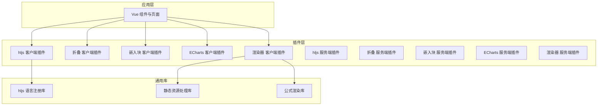
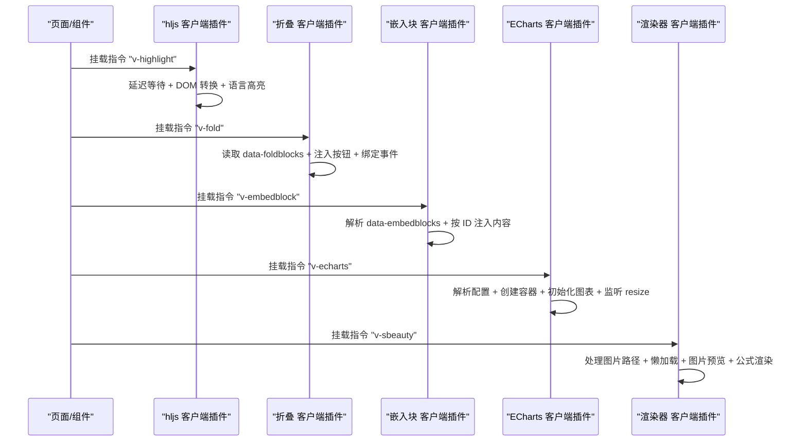
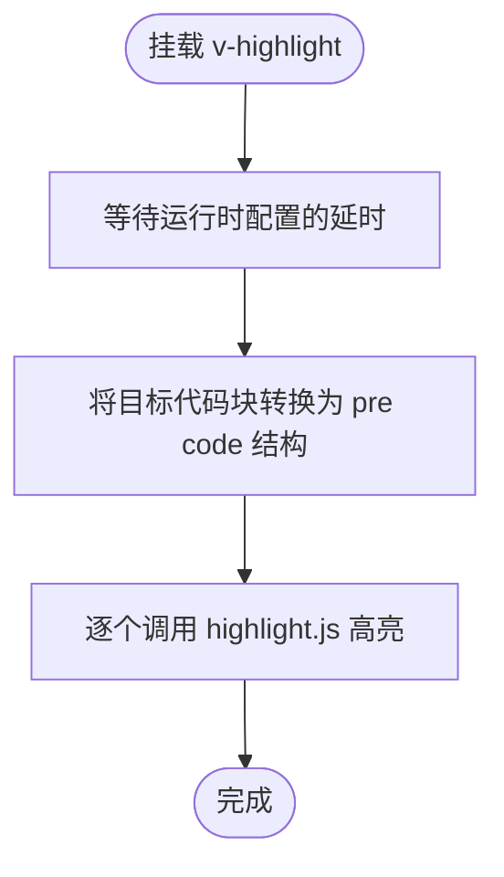
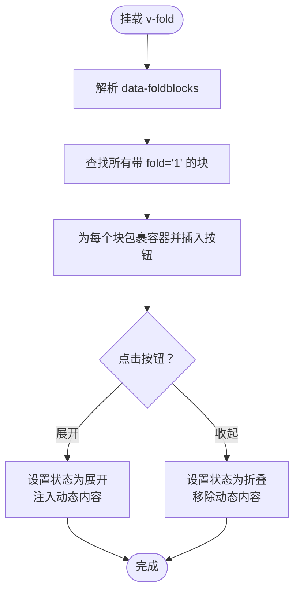
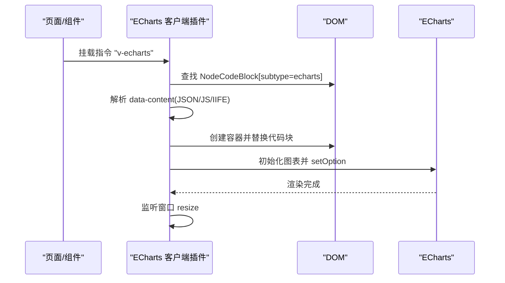
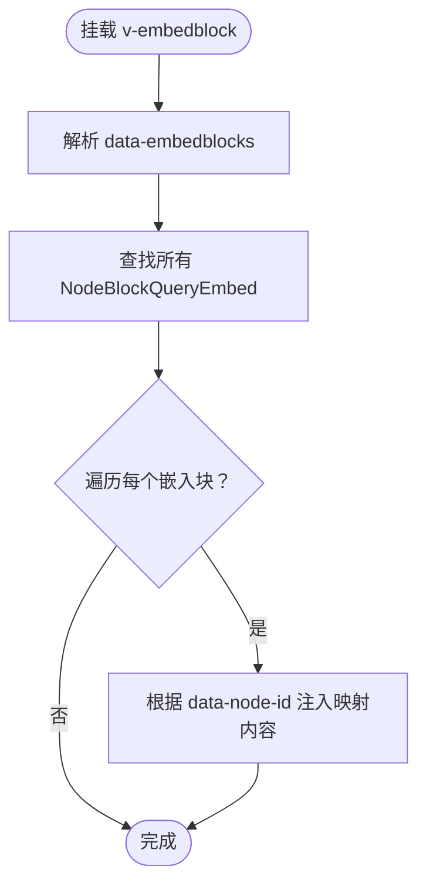
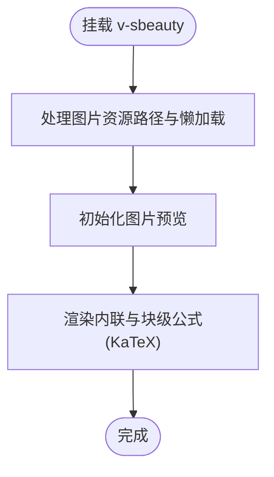
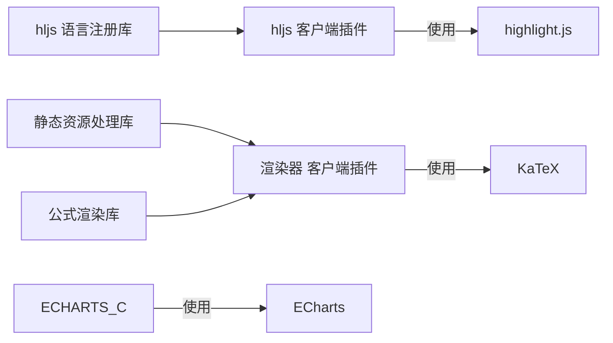

# 内置插件详解

<cite>
**本文引用的文件**
- [apps/app/plugins/01.hljs.client.ts](file://apps/app/plugins/01.hljs.client.ts)
- [apps/app/plugins/02.hljs.server.ts](file://apps/app/plugins/02.hljs.server.ts)
- [apps/app/plugins/libs/hljs/useHljs.ts](file://apps/app/plugins/libs/hljs/useHljs.ts)
- [apps/app/plugins/011.fold.client.ts](file://apps/app/plugins/011.fold.client.ts)
- [apps/app/plugins/012.fold.server.ts](file://apps/app/plugins/012.fold.server.ts)
- [apps/app/plugins/09.embedblock.client.ts](file://apps/app/plugins/09.embedblock.client.ts)
- [apps/app/plugins/010.embedblock.server.ts](file://apps/app/plugins/010.embedblock.server.ts)
- [apps/app/plugins/017.echarts.client.ts](file://apps/app/plugins/017.echarts.client.ts)
- [apps/app/plugins/018.echarts.server.ts](file://apps/app/plugins/018.echarts.server.ts)
- [apps/app/plugins/03.renderer.static.client.ts](file://apps/app/plugins/03.renderer.static.client.ts)
- [apps/app/plugins/04.renderer.static.server.ts](file://apps/app/plugins/04.renderer.static.server.ts)
- [apps/app/plugins/libs/renderer/useStaticClientAssets.ts](file://apps/app/plugins/libs/renderer/useStaticClientAssets.ts)
- [apps/app/plugins/libs/renderer/useClientFormulate.ts](file://apps/app/plugins/libs/renderer/useClientFormulate.ts)
</cite>

## 目录
1. [引言](#引言)
2. [项目结构](#项目结构)
3. [核心组件](#核心组件)
4. [架构总览](#架构总览)
5. [详细组件分析](#详细组件分析)
6. [依赖分析](#依赖分析)
7. [性能考虑](#性能考虑)
8. [故障排查指南](#故障排查指南)
9. [结论](#结论)
10. [附录](#附录)

## 引言
本文件对 Siyuan 笔记内置插件体系进行系统化技术剖析，重点覆盖以下插件：语法高亮（hljs）、折叠功能（fold）、图表（echarts）、嵌入块（embedblock）、渲染器（renderer）。文档从架构与控制流入手，逐项解析各插件的实现机制、配置参数、API 扩展点以及插件间的协作关系，帮助读者在理解原理的基础上高效使用与扩展。

## 项目结构
插件位于 Nuxt 应用的 plugins 目录下，采用“按功能分层 + 按平台区分”的组织方式：
- 客户端插件（client）：仅浏览器运行，负责 DOM 操作、第三方库初始化与交互增强。
- 服务端插件（server）：仅服务端运行，通常以“桩”形式占位，避免 SSR 场景下的运行时错误。
- 通用库（libs）：封装可复用能力，如 hljs 语言注册、静态资源与公式渲染工具。

**图表来源**
- [apps/app/plugins/01.hljs.client.ts:37-79](file://apps/app/plugins/01.hljs.client.ts#L37-L79)
- [apps/app/plugins/02.hljs.server.ts:27-29](file://apps/app/plugins/02.hljs.server.ts#L27-L29)
- [apps/app/plugins/011.fold.client.ts:113-121](file://apps/app/plugins/011.fold.client.ts#L113-L121)
- [apps/app/plugins/012.fold.server.ts:11-13](file://apps/app/plugins/012.fold.server.ts#L11-L13)
- [apps/app/plugins/09.embedblock.client.ts:21-47](file://apps/app/plugins/09.embedblock.client.ts#L21-L47)
- [apps/app/plugins/010.embedblock.server.ts:11-13](file://apps/app/plugins/010.embedblock.server.ts#L11-L13)
- [apps/app/plugins/017.echarts.client.ts:19-95](file://apps/app/plugins/017.echarts.client.ts#L19-L95)
- [apps/app/plugins/018.echarts.server.ts:17-19](file://apps/app/plugins/018.echarts.server.ts#L17-L19)
- [apps/app/plugins/03.renderer.static.client.ts:38-57](file://apps/app/plugins/03.renderer.static.client.ts#L38-L57)
- [apps/app/plugins/04.renderer.static.server.ts:27-29](file://apps/app/plugins/04.renderer.static.server.ts#L27-L29)
- [apps/app/plugins/libs/hljs/useHljs.ts:29-57](file://apps/app/plugins/libs/hljs/useHljs.ts#L29-L57)
- [apps/app/plugins/libs/renderer/useStaticClientAssets.ts:19-69](file://apps/app/plugins/libs/renderer/useStaticClientAssets.ts#L19-L69)
- [apps/app/plugins/libs/renderer/useClientFormulate.ts:13-45](file://apps/app/plugins/libs/renderer/useClientFormulate.ts#L13-L45)

**章节来源**
- [apps/app/plugins/01.hljs.client.ts:37-79](file://apps/app/plugins/01.hljs.client.ts#L37-L79)
- [apps/app/plugins/011.fold.client.ts:113-121](file://apps/app/plugins/011.fold.client.ts#L113-L121)
- [apps/app/plugins/09.embedblock.client.ts:21-47](file://apps/app/plugins/09.embedblock.client.ts#L21-L47)
- [apps/app/plugins/017.echarts.client.ts:19-95](file://apps/app/plugins/017.echarts.client.ts#L19-L95)
- [apps/app/plugins/03.renderer.static.client.ts:38-57](file://apps/app/plugins/03.renderer.static.client.ts#L38-L57)

## 核心组件
- 语法高亮插件（hljs）
  - 功能：在客户端将代码块进行语法高亮；服务端提供占位指令以避免 SSR 报错。
  - 关键点：延迟等待、DOM 结构转换（div.hljs → pre code）、按需注册语言。
- 折叠功能插件（fold）
  - 功能：为指定块添加“展开/收起”按钮，支持动态注入内容与状态切换。
  - 关键点：基于 data-* 属性识别目标块、事件绑定、DOM 包裹策略。
- 图表插件（echarts）
  - 功能：解析代码块中的配置，初始化并渲染 ECharts 图表。
  - 关键点：配置解析（JSON/JS 对象/IIFE）、容器替换、响应式尺寸。
- 嵌入块插件（embedblock）
  - 功能：将数据库查询结果注入到对应嵌入块中。
  - 关键点：通过 data-embedblocks 提供映射数据，按节点 ID 注入 HTML。
- 渲染器插件（renderer）
  - 功能：处理静态页面中的图片路径、懒加载、图片预览与 KaTeX 公式渲染。
  - 关键点：资源前缀拼接、Provider 模式适配、图片域名兼容、公式渲染。

**章节来源**
- [apps/app/plugins/01.hljs.client.ts:37-79](file://apps/app/plugins/01.hljs.client.ts#L37-L79)
- [apps/app/plugins/011.fold.client.ts:113-121](file://apps/app/plugins/011.fold.client.ts#L113-L121)
- [apps/app/plugins/09.embedblock.client.ts:21-47](file://apps/app/plugins/09.embedblock.client.ts#L21-L47)
- [apps/app/plugins/017.echarts.client.ts:19-95](file://apps/app/plugins/017.echarts.client.ts#L19-L95)
- [apps/app/plugins/03.renderer.static.client.ts:38-57](file://apps/app/plugins/03.renderer.static.client.ts#L38-L57)

## 架构总览
插件遵循“客户端/服务端双份插件 + 通用库”的模式：
- 客户端插件在 mounted 生命周期中读取宿主元素内的数据属性，完成 DOM 改写或第三方库初始化。
- 服务端插件以空指令占位，确保 SSR 不报错。
- 通用库封装跨插件的公共逻辑，降低重复实现。

**图表来源**
- [apps/app/plugins/01.hljs.client.ts:43-78](file://apps/app/plugins/01.hljs.client.ts#L43-L78)
- [apps/app/plugins/011.fold.client.ts:116-120](file://apps/app/plugins/011.fold.client.ts#L116-L120)
- [apps/app/plugins/09.embedblock.client.ts:24-46](file://apps/app/plugins/09.embedblock.client.ts#L24-L46)
- [apps/app/plugins/017.echarts.client.ts:63-94](file://apps/app/plugins/017.echarts.client.ts#L63-L94)
- [apps/app/plugins/03.renderer.static.client.ts:43-56](file://apps/app/plugins/03.renderer.static.client.ts#L43-L56)

## 详细组件分析

### 语法高亮插件（hljs）
- 工作原理
  - 客户端插件在挂载后延迟执行，先将特定结构的代码块转换为标准的 pre code 结构，再调用 highlight.js 进行高亮。
  - 通过运行时配置读取等待时间，避免异步渲染导致的 DOM 不一致。
  - 语言注册由通用库集中管理，按需引入多种语言与第三方语言，减小打包体积。
- 配置参数
  - 等待时间：通过运行时配置的公共字段控制高亮触发的延时。
  - 语言集：通用库集中注册多种语言，满足多语言代码块高亮需求。
- API 与扩展点
  - 指令名称：v-highlight
  - 扩展点：可在通用库中新增语言或调整注册策略。
- 用户体验优化
  - 延迟触发避免首屏抖动；转换 DOM 结构提升兼容性。

**图表来源**
- [apps/app/plugins/01.hljs.client.ts:43-78](file://apps/app/plugins/01.hljs.client.ts#L43-L78)
- [apps/app/plugins/libs/hljs/useHljs.ts:29-57](file://apps/app/plugins/libs/hljs/useHljs.ts#L29-L57)

**章节来源**
- [apps/app/plugins/01.hljs.client.ts:37-79](file://apps/app/plugins/01.hljs.client.ts#L37-L79)
- [apps/app/plugins/02.hljs.server.ts:27-29](file://apps/app/plugins/02.hljs.server.ts#L27-L29)
- [apps/app/plugins/libs/hljs/useHljs.ts:29-57](file://apps/app/plugins/libs/hljs/useHljs.ts#L29-L57)

### 折叠功能插件（fold）
- 实现机制
  - 通过 data-foldblocks 获取映射数据，定位带有特定属性的目标块。
  - 为每个目标块包裹容器并插入“展开/收起”按钮，点击切换状态并在展开时动态注入内容。
  - 标题块采用特殊布局策略，避免影响标题显示。
- 配置参数
  - data-foldblocks：包含折叠块映射的 JSON 字符串。
  - data-node-id：目标块的唯一标识。
  - fold 属性：标记当前折叠状态（1=折叠，0=展开）。
- API 与扩展点
  - 指令名称：v-fold
  - 扩展点：可扩展注入内容的来源与格式。
- 用户体验优化
  - 按钮文案随状态切换；动态内容仅在展开时加载，减少初始渲染压力。

**图表来源**
- [apps/app/plugins/011.fold.client.ts:12-102](file://apps/app/plugins/011.fold.client.ts#L12-L102)

**章节来源**
- [apps/app/plugins/011.fold.client.ts:113-121](file://apps/app/plugins/011.fold.client.ts#L113-L121)
- [apps/app/plugins/012.fold.server.ts:11-13](file://apps/app/plugins/012.fold.server.ts#L11-L13)

### 图表插件（echarts）
- 数据处理与渲染流程
  - 通过 data-type 与 data-subtype 定位代码块，读取 data-content 作为配置源。
  - 配置解析优先尝试 JSON，其次尝试 JavaScript 对象或 IIFE，失败则记录错误。
  - 创建独立容器替换原代码块，初始化 ECharts 并设置选项；监听窗口 resize 自适应。
- 配置参数
  - data-content：图表配置字符串（支持 JSON 或 JS 对象）。
  - data-type/data-subtype：用于识别代码块类型（NodeCodeBlock/echarts）。
- API 与扩展点
  - 指令名称：v-echarts
  - 扩展点：可扩展配置解析策略或默认容器样式。
- 性能与兼容性
  - 容器尺寸固定，建议外部通过 CSS 控制；resize 事件保证响应式。

**图表来源**
- [apps/app/plugins/017.echarts.client.ts:63-94](file://apps/app/plugins/017.echarts.client.ts#L63-L94)

**章节来源**
- [apps/app/plugins/017.echarts.client.ts:19-95](file://apps/app/plugins/017.echarts.client.ts#L19-L95)
- [apps/app/plugins/018.echarts.server.ts:17-19](file://apps/app/plugins/018.echarts.server.ts#L17-L19)

### 嵌入块插件（embedblock）
- 功能特性与使用场景
  - 将数据库查询嵌入块（NodeBlockQueryEmbed）渲染为实际内容，适合动态展示查询结果。
  - 通过 data-embedblocks 提供映射数据，按节点 ID 快速注入 HTML。
- 配置参数
  - data-embedblocks：包含嵌入块映射的 JSON 字符串。
  - data-node-id：目标嵌入块的唯一标识。
- API 与扩展点
  - 指令名称：v-embedblock
  - 扩展点：可扩展注入内容的来源（如远程接口）与缓存策略。
- 用户体验优化
  - 仅在存在映射时注入，避免空内容闪烁。

**图表来源**
- [apps/app/plugins/09.embedblock.client.ts:24-46](file://apps/app/plugins/09.embedblock.client.ts#L24-L46)

**章节来源**
- [apps/app/plugins/09.embedblock.client.ts:21-47](file://apps/app/plugins/09.embedblock.client.ts#L21-L47)
- [apps/app/plugins/010.embedblock.server.ts:11-13](file://apps/app/plugins/010.embedblock.server.ts#L11-L13)

### 渲染器插件（renderer）
- 静态内容处理机制
  - 图片处理：为 img 添加懒加载与异步属性；根据 Provider 模式拼接资源路径；兼容旧域名。
  - 公式渲染：使用 KaTeX 渲染内联与块级数学公式。
  - 图片预览：初始化图片预览功能，提升浏览体验。
- 配置参数
  - data-page-id：页面 ID，用于拼接本地资源路径。
  - Provider 模式：通过运行时配置决定资源访问方式。
- API 与扩展点
  - 指令名称：v-sbeauty
  - 扩展点：可扩展更多静态资源处理（如视频、音频）与渲染器（如 MathJax）。
- 用户体验优化
  - 懒加载与异步加载减少首屏压力；统一的资源前缀与域名兼容提升稳定性。

**图表来源**
- [apps/app/plugins/03.renderer.static.client.ts:43-56](file://apps/app/plugins/03.renderer.static.client.ts#L43-L56)
- [apps/app/plugins/libs/renderer/useStaticClientAssets.ts:24-66](file://apps/app/plugins/libs/renderer/useStaticClientAssets.ts#L24-L66)
- [apps/app/plugins/libs/renderer/useClientFormulate.ts:17-42](file://apps/app/plugins/libs/renderer/useClientFormulate.ts#L17-L42)

**章节来源**
- [apps/app/plugins/03.renderer.static.client.ts:38-57](file://apps/app/plugins/03.renderer.static.client.ts#L38-L57)
- [apps/app/plugins/04.renderer.static.server.ts:27-29](file://apps/app/plugins/04.renderer.static.server.ts#L27-L29)
- [apps/app/plugins/libs/renderer/useStaticClientAssets.ts:19-69](file://apps/app/plugins/libs/renderer/useStaticClientAssets.ts#L19-L69)
- [apps/app/plugins/libs/renderer/useClientFormulate.ts:13-45](file://apps/app/plugins/libs/renderer/useClientFormulate.ts#L13-L45)

## 依赖分析
- 插件耦合与内聚
  - 各插件相对独立，职责清晰；渲染器插件依赖两个通用库，具备较高内聚性。
- 直接与间接依赖
  - hljs 客户端插件依赖通用库的语言注册；渲染器插件依赖资源与公式渲染库。
- 外部依赖与集成点
  - highlight.js：代码高亮。
  - ECharts：图表渲染。
  - KaTeX：公式渲染。
  - zhi-common：JSON/字符串工具。
- 接口契约
  - 指令约定：v-highlight、v-fold、v-embedblock、v-echarts、v-sbeauty。
  - 数据属性约定：data-content、data-type、data-subtype、data-node-id、data-foldblocks、data-embedblocks、data-page-id。

**图表来源**
- [apps/app/plugins/libs/hljs/useHljs.ts:10-27](file://apps/app/plugins/libs/hljs/useHljs.ts#L10-L27)
- [apps/app/plugins/017.echarts.client.ts:83-84](file://apps/app/plugins/017.echarts.client.ts#L83-L84)
- [apps/app/plugins/libs/renderer/useClientFormulate.ts:15-41](file://apps/app/plugins/libs/renderer/useClientFormulate.ts#L15-L41)
- [apps/app/plugins/03.renderer.static.client.ts:40-41](file://apps/app/plugins/03.renderer.static.client.ts#L40-L41)

**章节来源**
- [apps/app/plugins/libs/hljs/useHljs.ts:10-27](file://apps/app/plugins/libs/hljs/useHljs.ts#L10-L27)
- [apps/app/plugins/libs/renderer/useStaticClientAssets.ts:10-14](file://apps/app/plugins/libs/renderer/useStaticClientAssets.ts#L10-L14)
- [apps/app/plugins/libs/renderer/useClientFormulate.ts:15-41](file://apps/app/plugins/libs/renderer/useClientFormulate.ts#L15-L41)

## 性能考虑
- 延迟与批处理
  - hljs 客户端插件通过延时等待避免首屏抖动；建议在大量代码块场景下批量处理。
- 懒加载与资源优化
  - 渲染器插件对图片启用懒加载与异步属性，减少初始渲染压力。
- 语言按需注册
  - hljs 语言注册集中在通用库，避免打包冗余语言导致体积膨胀。
- 图表响应式
  - ECharts 监听窗口 resize，建议在复杂页面中节流处理以降低重绘频率。

## 故障排查指南
- hljs 未生效
  - 检查是否正确挂载 v-highlight；确认等待时间配置合理；核对目标代码块结构是否符合预期。
- 折叠按钮不出现
  - 确认 data-foldblocks 是否存在且可解析；检查目标块是否带有 fold='1' 属性；查看控制台是否有异常日志。
- 嵌入块内容为空
  - 核对 data-embedblocks 的映射是否包含对应节点 ID；确认 data-node-id 与映射键一致。
- ECharts 渲染失败
  - 检查 data-content 是否为合法 JSON/JS 对象；确认容器创建与初始化是否成功；查看浏览器控制台错误。
- 图片路径异常或无法显示
  - 在 Provider 模式下确认资源 API 地址；检查旧域名替换逻辑；验证懒加载与异步属性是否正确设置。
- 公式未渲染
  - 确认 KaTeX 已正确加载；检查内联与块级公式的 data-* 属性是否完整。

**章节来源**
- [apps/app/plugins/01.hljs.client.ts:45-70](file://apps/app/plugins/01.hljs.client.ts#L45-L70)
- [apps/app/plugins/011.fold.client.ts:30-101](file://apps/app/plugins/011.fold.client.ts#L30-L101)
- [apps/app/plugins/09.embedblock.client.ts:27-44](file://apps/app/plugins/09.embedblock.client.ts#L27-L44)
- [apps/app/plugins/017.echarts.client.ts:68-93](file://apps/app/plugins/017.echarts.client.ts#L68-L93)
- [apps/app/plugins/03.renderer.static.client.ts:49-56](file://apps/app/plugins/03.renderer.static.client.ts#L49-L56)

## 结论
该插件体系通过“客户端/服务端双份插件 + 通用库”的设计，在保证 SSR 兼容的同时，提供了强大的前端渲染与交互能力。语法高亮、折叠、图表、嵌入块与渲染器五大插件各司其职，配合通用库实现高内聚、低耦合的架构。建议在生产环境中结合业务场景对配置参数与扩展点进行定制化优化，以获得更佳的性能与用户体验。

## 附录
- 指令清单
  - v-highlight：语法高亮
  - v-fold：折叠功能
  - v-embedblock：嵌入块
  - v-echarts：图表渲染
  - v-sbeauty：静态内容渲染（图片、公式等）