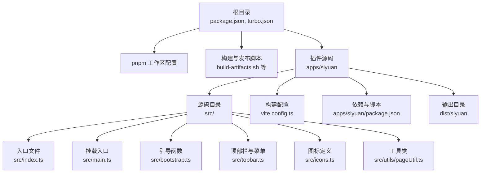
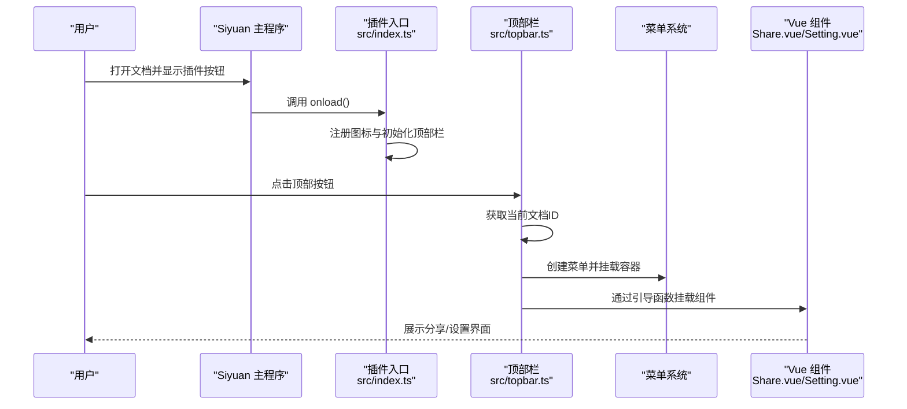
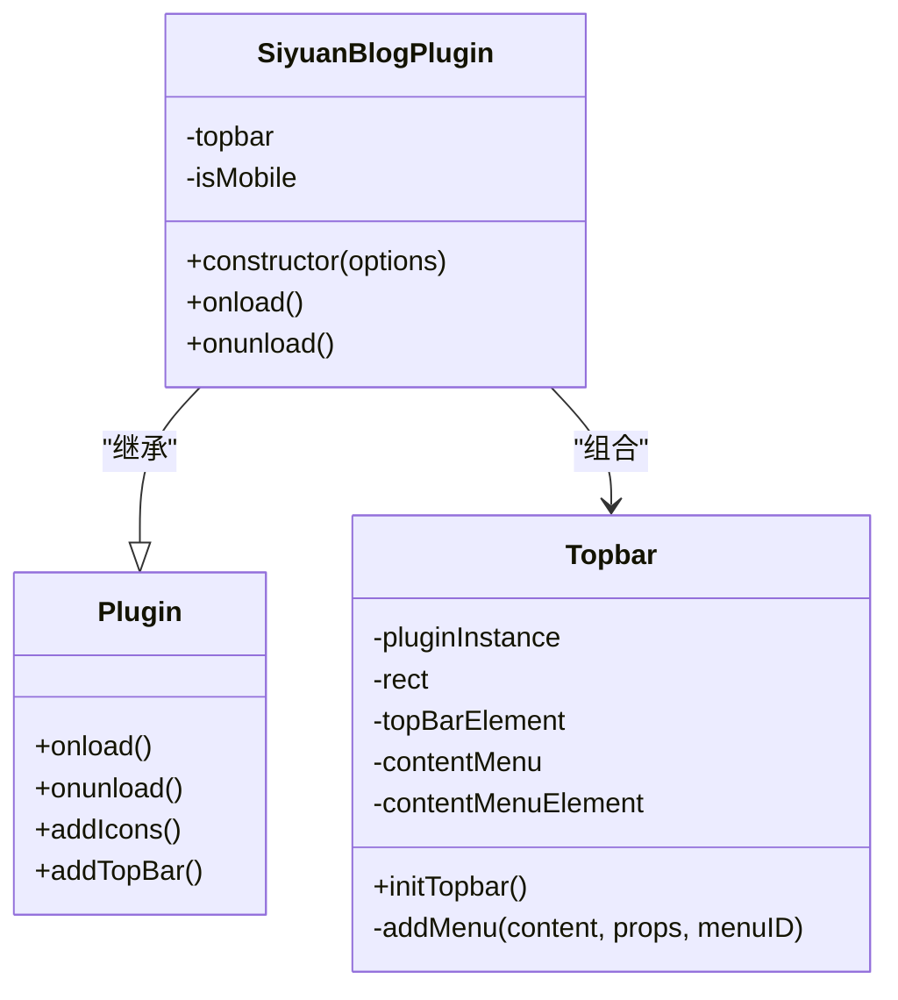
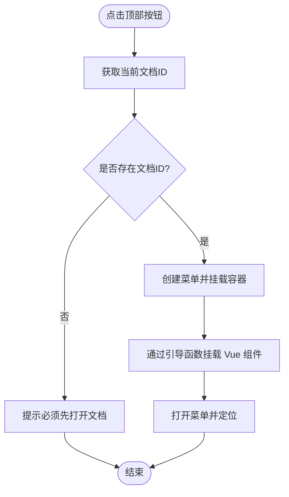
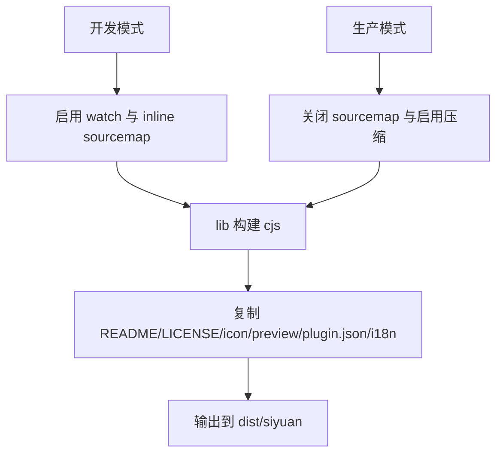
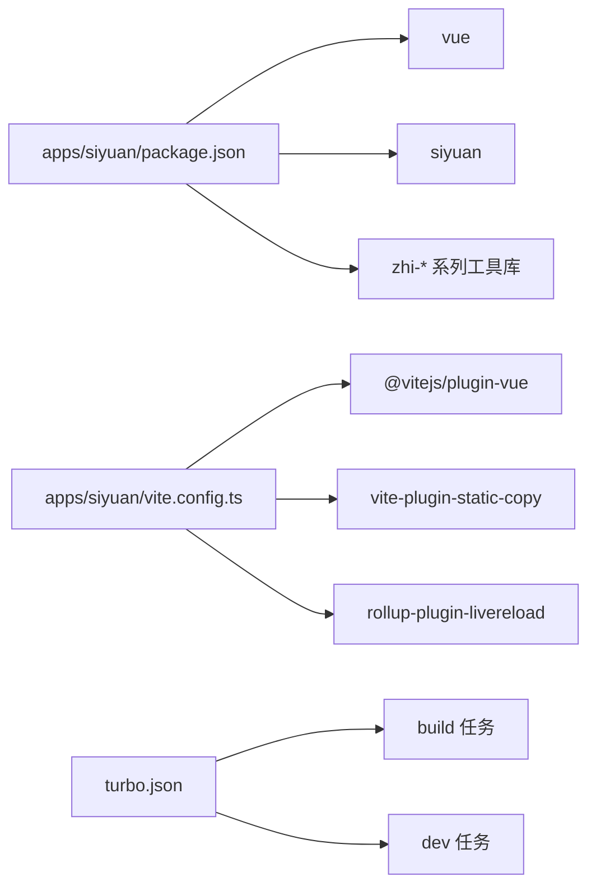

# 插件开发指南

<cite>
**本文档引用的文件**
- [plugin.json](file://plugin.json)
- [apps/siyuan/plugin.json](file://apps/siyuan/plugin.json)
- [DEVELOPMENT.md](file://DEVELOPMENT.md)
- [package.json](file://package.json)
- [apps/siyuan/package.json](file://apps/siyuan/package.json)
- [apps/siyuan/src/index.ts](file://apps/siyuan/src/index.ts)
- [apps/siyuan/src/main.ts](file://apps/siyuan/src/main.ts)
- [apps/siyuan/src/bootstrap.ts](file://apps/siyuan/src/bootstrap.ts)
- [apps/siyuan/src/topbar.ts](file://apps/siyuan/src/topbar.ts)
- [apps/siyuan/src/icons.ts](file://apps/siyuan/src/icons.ts)
- [apps/siyuan/src/utils/pageUtil.ts](file://apps/siyuan/src/utils/pageUtil.ts)
- [apps/siyuan/vite.config.ts](file://apps/siyuan/vite.config.ts)
- [turbo.json](file://turbo.json)
- [apps/siyuan/tsconfig.json](file://apps/siyuan/tsconfig.json)
</cite>

## 目录
1. [简介](#简介)
2. [项目结构](#项目结构)
3. [核心组件](#核心组件)
4. [架构总览](#架构总览)
5. [详细组件分析](#详细组件分析)
6. [依赖关系分析](#依赖关系分析)
7. [性能考虑](#性能考虑)
8. [故障排查指南](#故障排查指南)
9. [结论](#结论)
10. [附录](#附录)

## 简介
本指南面向从零开始开发 Siyuan 笔记本插件的开发者，基于真实仓库中的插件实现，系统讲解插件项目的目录结构、文件组织规范、基本结构（入口文件、配置文件、依赖声明）、生命周期钩子与事件处理机制，并提供调试技巧、测试方法、性能优化建议以及打包、发布与版本管理的最佳实践。

## 项目结构
该仓库采用多包工作区（pnpm workspaces）组织，核心插件位于 apps/siyuan 目录，顶层 package.json 提供统一脚本与版本管理，turbo.json 定义构建任务流。插件配置文件 plugin.json 同时存在于根目录与插件源码目录，确保在不同环境下的可用性。

图表来源
- [package.json:1-27](file://package.json#L1-L27)
- [turbo.json:1-17](file://turbo.json#L1-L17)
- [apps/siyuan/package.json:1-43](file://apps/siyuan/package.json#L1-L43)
- [apps/siyuan/vite.config.ts:1-136](file://apps/siyuan/vite.config.ts#L1-L136)
- [apps/siyuan/src/index.ts:1-49](file://apps/siyuan/src/index.ts#L1-L49)
- [apps/siyuan/src/main.ts:1-13](file://apps/siyuan/src/main.ts#L1-L13)
- [apps/siyuan/src/bootstrap.ts:1-16](file://apps/siyuan/src/bootstrap.ts#L1-L16)
- [apps/siyuan/src/topbar.ts:1-92](file://apps/siyuan/src/topbar.ts#L1-L92)
- [apps/siyuan/src/icons.ts:1-16](file://apps/siyuan/src/icons.ts#L1-L16)
- [apps/siyuan/src/utils/pageUtil.ts:1-25](file://apps/siyuan/src/utils/pageUtil.ts#L1-L25)

章节来源
- [package.json:1-27](file://package.json#L1-L27)
- [turbo.json:1-17](file://turbo.json#L1-L17)
- [apps/siyuan/package.json:1-43](file://apps/siyuan/package.json#L1-L43)
- [apps/siyuan/vite.config.ts:1-136](file://apps/siyuan/vite.config.ts#L1-L136)

## 核心组件
- 插件入口类：负责加载与卸载生命周期、注册图标与顶部栏按钮等。
- 顶部栏与菜单：封装顶部按钮点击与右键菜单，动态挂载 Vue 组件。
- 引导与挂载：通过统一的引导函数将 Vue 组件挂载到指定容器。
- 图标定义：集中管理插件使用的 SVG 图标。
- 工具类：提供页面 ID 获取等通用能力。
- 构建配置：Vite 配置定义输出目录、静态资源复制、外部依赖与开发热更新。

章节来源
- [apps/siyuan/src/index.ts:1-49](file://apps/siyuan/src/index.ts#L1-L49)
- [apps/siyuan/src/topbar.ts:1-92](file://apps/siyuan/src/topbar.ts#L1-L92)
- [apps/siyuan/src/bootstrap.ts:1-16](file://apps/siyuan/src/bootstrap.ts#L1-L16)
- [apps/siyuan/src/icons.ts:1-16](file://apps/siyuan/src/icons.ts#L1-L16)
- [apps/siyuan/src/utils/pageUtil.ts:1-25](file://apps/siyuan/src/utils/pageUtil.ts#L1-L25)
- [apps/siyuan/vite.config.ts:1-136](file://apps/siyuan/vite.config.ts#L1-L136)

## 架构总览
插件运行时由 Siyuan 主程序加载，插件入口类初始化后注册图标与顶部按钮；用户点击后通过菜单挂载 Vue 组件，实现分享与设置等功能。构建阶段使用 Vite 输出到 dist/siyuan，静态资源通过 vite-static-copy 复制到输出目录。

图表来源
- [apps/siyuan/src/index.ts:35-43](file://apps/siyuan/src/index.ts#L35-L43)
- [apps/siyuan/src/topbar.ts:32-91](file://apps/siyuan/src/topbar.ts#L32-L91)
- [apps/siyuan/src/bootstrap.ts:12-14](file://apps/siyuan/src/bootstrap.ts#L12-L14)

## 详细组件分析

### 插件入口类（SiyuanBlogPlugin）
- 职责：继承插件基类，完成图标注册、顶部栏初始化、生命周期回调。
- 关键点：构造函数中识别前端类型（桌面/移动端），onload 中注册图标与初始化顶部栏，onunload 留空以便扩展。

图表来源
- [apps/siyuan/src/index.ts:22-48](file://apps/siyuan/src/index.ts#L22-L48)
- [apps/siyuan/src/topbar.ts:21-91](file://apps/siyuan/src/topbar.ts#L21-L91)

章节来源
- [apps/siyuan/src/index.ts:1-49](file://apps/siyuan/src/index.ts#L1-L49)

### 顶部栏与菜单（Topbar）
- 职责：创建顶部按钮，绑定点击与右键菜单事件；根据当前文档 ID 决定是否允许操作；通过菜单容器挂载 Vue 组件。
- 关键点：点击事件获取文档 ID 并校验；右键菜单用于打开设置；菜单容器复用并清理旧节点；定位使用按钮边界框。

图表来源
- [apps/siyuan/src/topbar.ts:41-91](file://apps/siyuan/src/topbar.ts#L41-L91)
- [apps/siyuan/src/utils/pageUtil.ts:14-21](file://apps/siyuan/src/utils/pageUtil.ts#L14-L21)

章节来源
- [apps/siyuan/src/topbar.ts:1-92](file://apps/siyuan/src/topbar.ts#L1-L92)
- [apps/siyuan/src/utils/pageUtil.ts:1-25](file://apps/siyuan/src/utils/pageUtil.ts#L1-L25)

### 引导与挂载（createBootStrap）
- 职责：统一创建并挂载 Vue 应用实例到指定容器，简化组件挂载流程。
- 关键点：接收内容组件、props 与容器标识，调用 mount 完成挂载。

章节来源
- [apps/siyuan/src/bootstrap.ts:1-16](file://apps/siyuan/src/bootstrap.ts#L1-L16)

### 图标定义（icons）
- 职责：集中管理插件使用的 SVG 图标，便于在顶部栏与菜单中复用。
- 关键点：导出图标符号或 SVG 字符串，供插件注册与渲染。

章节来源
- [apps/siyuan/src/icons.ts:1-16](file://apps/siyuan/src/icons.ts#L1-L16)

### 构建配置（Vite）
- 职责：定义插件构建行为，包括入口、输出目录、静态资源复制、外部依赖与开发模式下的热更新。
- 关键点：输出目录指向 dist/siyuan；lib 构建格式为 cjs；静态资源复制 README、LICENSE、icon.png、preview.png、plugin.json 与 i18n；开发模式启用 livereload 与额外监听文件。

图表来源
- [apps/siyuan/vite.config.ts:75-133](file://apps/siyuan/vite.config.ts#L75-L133)

章节来源
- [apps/siyuan/vite.config.ts:1-136](file://apps/siyuan/vite.config.ts#L1-L136)

### 配置文件与依赖声明
- 插件配置：plugin.json 定义插件元数据、支持平台、显示名、描述、国际化与资金支持链接。
- 顶层脚本：package.json 提供统一的开发、构建、打包、版本同步与链接命令。
- 插件依赖：apps/siyuan/package.json 声明 Vue 生态、Siyuan SDK、工具库与开发工具。

章节来源
- [plugin.json:1-43](file://plugin.json#L1-L43)
- [apps/siyuan/plugin.json:1-43](file://apps/siyuan/plugin.json#L1-L43)
- [package.json:1-27](file://package.json#L1-L27)
- [apps/siyuan/package.json:1-43](file://apps/siyuan/package.json#L1-L43)

## 依赖关系分析
- 插件对 Siyuan SDK 外部化，避免重复打包主程序依赖。
- 构建任务通过 turbo 管理，确保多包构建顺序与缓存策略。
- Vite 插件链路：Vue 插件、静态资源复制、可选的外部化与热更新插件。

图表来源
- [apps/siyuan/package.json:14-42](file://apps/siyuan/package.json#L14-L42)
- [apps/siyuan/vite.config.ts:17-57](file://apps/siyuan/vite.config.ts#L17-L57)
- [turbo.json:3-14](file://turbo.json#L3-L14)

章节来源
- [apps/siyuan/package.json:1-43](file://apps/siyuan/package.json#L1-L43)
- [apps/siyuan/vite.config.ts:1-136](file://apps/siyuan/vite.config.ts#L1-L136)
- [turbo.json:1-17](file://turbo.json#L1-L17)

## 性能考虑
- 开发模式启用 inline sourcemap 便于调试，生产模式关闭 sourcemap 与启用压缩，减少体积与提升加载速度。
- 使用外部化策略排除 Siyuan SDK，避免重复打包与减小体积。
- 静态资源复制仅包含必要文件，避免冗余资源进入输出目录。
- 开发时启用 livereload 与额外监听文件，提升迭代效率。

章节来源
- [apps/siyuan/vite.config.ts:80-133](file://apps/siyuan/vite.config.ts#L80-L133)

## 故障排查指南
- 构建失败：检查 Vite 配置中的入口、输出目录与静态资源复制规则，确认 dist/siyuan 权限与磁盘空间。
- 插件未显示：确认 plugin.json 是否正确复制到输出目录，且名称与版本一致；检查浏览器控制台是否有模块加载错误。
- 热更新无效：确认开发模式参数与监听文件配置，检查 vite.config.ts 中的 watch 逻辑与额外监听文件列表。
- 文档 ID 获取失败：确认页面结构中包含 protyle 容器与 protyle-title 元素，且存在 data-node-id 属性。

章节来源
- [apps/siyuan/vite.config.ts:108-118](file://apps/siyuan/vite.config.ts#L108-L118)
- [apps/siyuan/src/utils/pageUtil.ts:14-21](file://apps/siyuan/src/utils/pageUtil.ts#L14-L21)

## 结论
本指南基于真实仓库展示了 Siyuan 插件的完整开发流程：从项目结构、入口与生命周期、UI 挂载与菜单集成，到构建配置与多包工作区管理。遵循本文档的规范与最佳实践，可以高效地开发、调试、测试与发布高质量的插件。

## 附录

### 从零开始创建插件的步骤
- 初始化工作区与脚手架：参考顶层 package.json 与 turbo.json 的任务定义。
- 编写插件入口：实现 onload/onunload 生命周期，注册图标与顶部栏。
- 实现 UI 交互：通过菜单挂载 Vue 组件，使用统一的引导函数进行挂载。
- 配置构建：调整 Vite 配置以满足输出需求，确保静态资源复制与外部依赖策略正确。
- 开发与调试：使用开发脚本启动本地服务，结合浏览器与控制台进行调试。
- 打包与发布：执行打包脚本生成 zip 包，准备 README、LICENSE、icon.png、preview.png 与 plugin.json。

章节来源
- [DEVELOPMENT.md:19-84](file://DEVELOPMENT.md#L19-L84)
- [apps/siyuan/vite.config.ts:29-56](file://apps/siyuan/vite.config.ts#L29-L56)
- [apps/siyuan/src/index.ts:35-43](file://apps/siyuan/src/index.ts#L35-L43)
- [apps/siyuan/src/topbar.ts:32-91](file://apps/siyuan/src/topbar.ts#L32-L91)