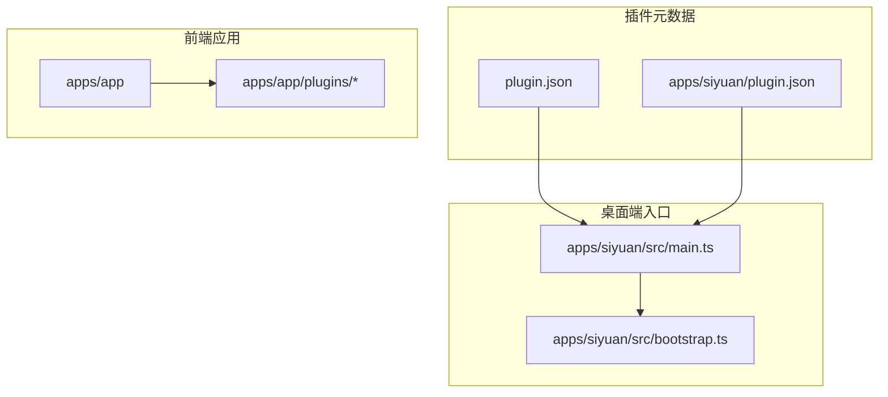
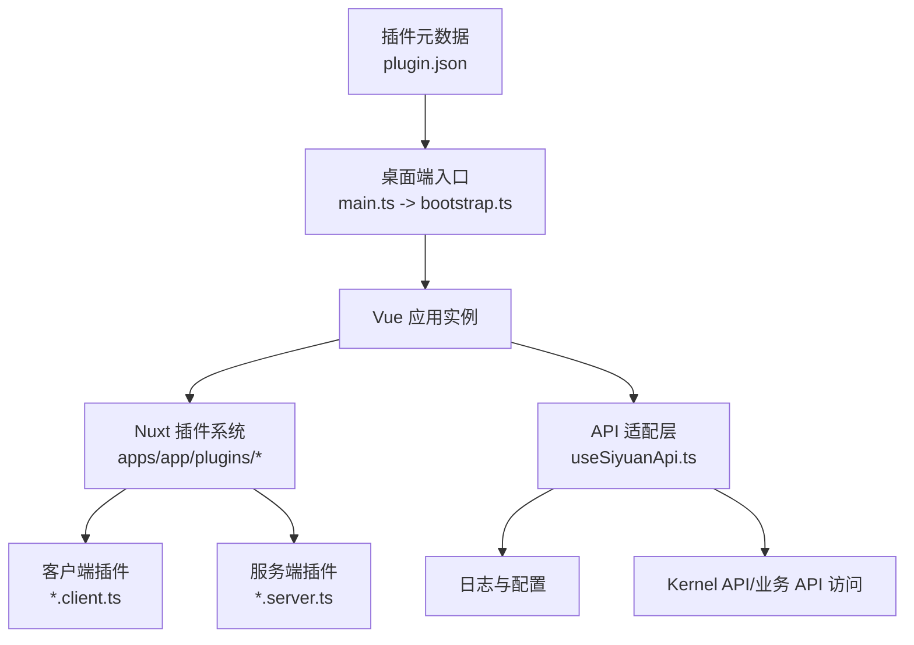
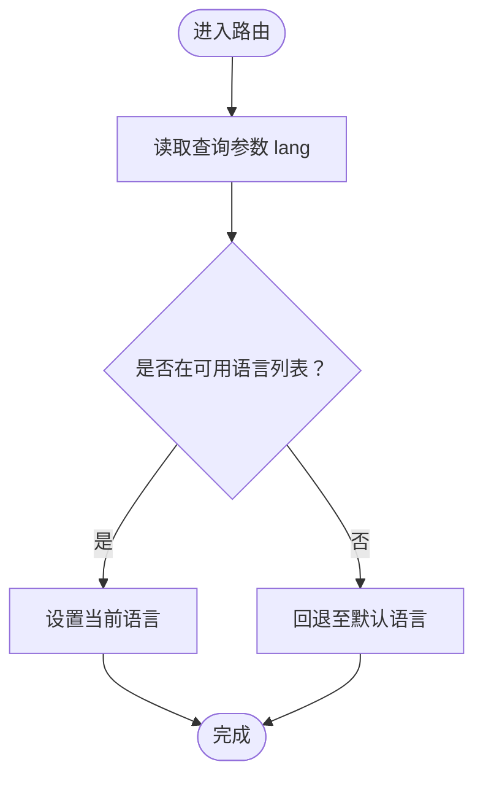
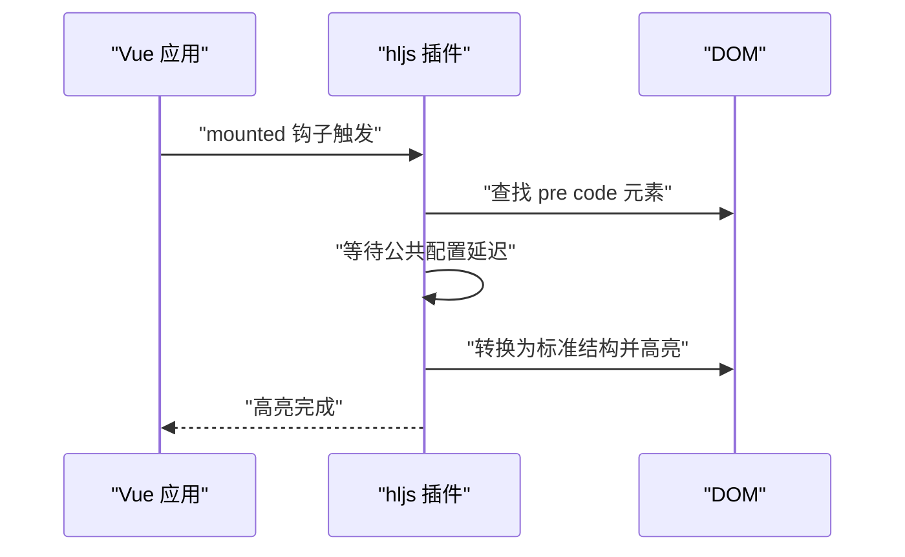
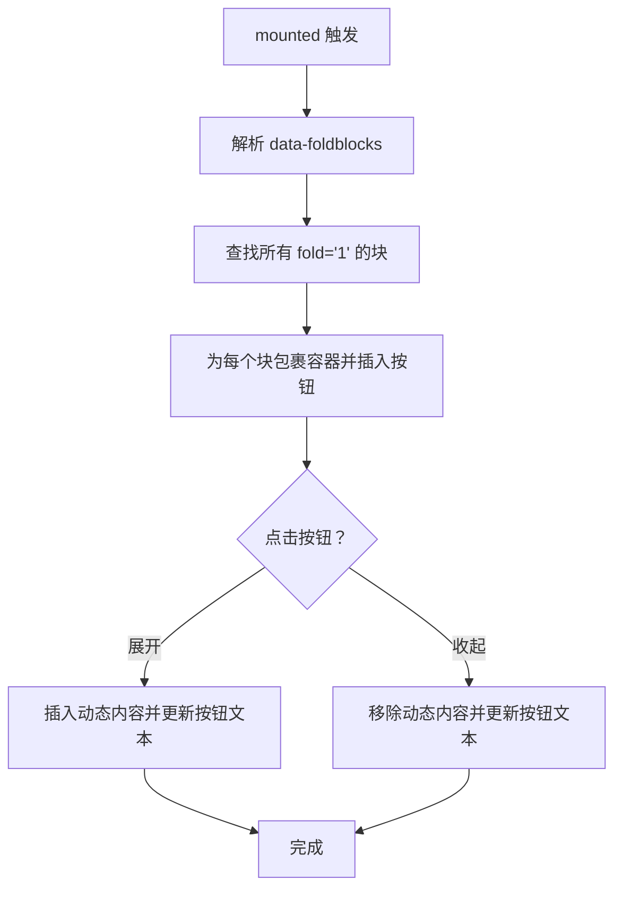
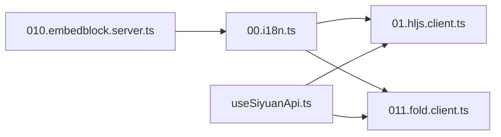

# 插件扩展实践

<cite>
**本文引用的文件**
- [plugin.json](file://plugin.json)
- [apps/siyuan/plugin.json](file://apps/siyuan/plugin.json)
- [README.md](file://README.md)
- [DEVELOPMENT.md](file://DEVELOPMENT.md)
- [apps/siyuan/src/main.ts](file://apps/siyuan/src/main.ts)
- [apps/siyuan/src/bootstrap.ts](file://apps/siyuan/src/bootstrap.ts)
- [apps/siyuan/src/composables/useSiyuanApi.ts](file://apps/siyuan/src/composables/useSiyuanApi.ts)
- [apps/app/plugins/00.i18n.ts](file://apps/app/plugins/00.i18n.ts)
- [apps/app/plugins/01.hljs.client.ts](file://apps/app/plugins/01.hljs.client.ts)
- [apps/app/plugins/010.embedblock.server.ts](file://apps/app/plugins/010.embedblock.server.ts)
- [apps/app/plugins/011.fold.client.ts](file://apps/app/plugins/011.fold.client.ts)
</cite>

## 目录
1. [引言](#引言)
2. [项目结构](#项目结构)
3. [核心组件](#核心组件)
4. [架构总览](#架构总览)
5. [详细组件分析](#详细组件分析)
6. [依赖分析](#依赖分析)
7. [性能考虑](#性能考虑)
8. [故障排除指南](#故障排除指南)
9. [结论](#结论)
10. [附录](#附录)

## 引言
本文件面向希望在思源笔记（SiYuan）生态中进行插件扩展与深度定制的开发者，围绕现有插件体系提供可操作的扩展实践指南。内容涵盖：
- 基于现有插件的功能扩展与定制方法
- 插件间协作模式与集成策略
- 第三方插件的集成与兼容性处理
- 性能优化方法与工具
- 故障排除与调试技巧
- 热重载与动态加载机制
- 插件生态建设与社区贡献建议

## 项目结构
该项目采用多包工作区（monorepo），包含桌面端插件应用与前端应用两套入口，分别服务于不同运行环境与构建目标。

- 插件元数据与桌面端入口
  - 插件元数据：通过顶层与 apps/siyuan 目录下的 plugin.json 统一声明插件名称、作者、版本、平台支持、国际化等信息。
  - 桌面端入口：apps/siyuan/src/main.ts 作为 Vue 应用挂载点，调用 apps/siyuan/src/bootstrap.ts 完成应用初始化与挂载。

- 前端应用与插件系统
  - apps/app 为 Nuxt 应用，内置大量以数字前缀命名的插件文件，覆盖国际化、代码高亮、折叠块、嵌入块、服务端渲染适配等能力。
  - 插件命名规范：以两位数字前缀（如 00、01、10、11 等）确保加载顺序可控；客户端/服务端插件按后缀区分（.client.ts/.server.ts）。

- 开发与构建
  - 开发与打包流程由 DEVELOPMENT.md 提供，支持本地开发、Node Provider 模式、Vercel/Cloudflare 等部署场景。
  - README.md 提供快速启动与构建命令示例。

**图表来源**
- [plugin.json:1-43](file://plugin.json#L1-L43)
- [apps/siyuan/plugin.json:1-43](file://apps/siyuan/plugin.json#L1-L43)
- [apps/siyuan/src/main.ts:10-13](file://apps/siyuan/src/main.ts#L10-L13)
- [apps/siyuan/src/bootstrap.ts:12-14](file://apps/siyuan/src/bootstrap.ts#L12-L14)
- [apps/app/plugins/00.i18n.ts:16-27](file://apps/app/plugins/00.i18n.ts#L16-L27)

**章节来源**
- [plugin.json:1-43](file://plugin.json#L1-L43)
- [apps/siyuan/plugin.json:1-43](file://apps/siyuan/plugin.json#L1-L43)
- [apps/siyuan/src/main.ts:10-13](file://apps/siyuan/src/main.ts#L10-L13)
- [apps/siyuan/src/bootstrap.ts:12-14](file://apps/siyuan/src/bootstrap.ts#L12-L14)
- [README.md:1-32](file://README.md#L1-L32)
- [DEVELOPMENT.md:1-114](file://DEVELOPMENT.md#L1-L114)

## 核心组件
- 插件元数据与平台支持
  - 通过 plugin.json 声明插件名称、版本、最小应用版本、前后端平台支持、显示名、描述、国际化资源与资助链接，确保跨平台一致性与可发现性。

- 桌面端入口与初始化
  - main.ts 作为 Vue 应用挂载入口，调用 bootstrap.ts 创建并挂载应用实例，形成统一的初始化流程。

- 前端插件系统
  - apps/app/plugins 下的插件以 Nuxt 插件形式组织，遵循命名与职责分离原则：
    - 国际化插件：根据路由查询参数动态切换语言。
    - 代码高亮插件：在客户端环境下为代码块执行高亮。
    - 折叠块插件：为可折叠块注入交互按钮与动态内容。
    - 嵌入块服务端占位：解决 SSR 场景下特定指令的兼容问题。

- API 适配层
  - useSiyuanApi.ts 封装了对 SiYuan Kernel API 与业务 API 的访问，提供日志记录与配置初始化，便于在插件中统一调用。

**章节来源**
- [plugin.json:1-43](file://plugin.json#L1-L43)
- [apps/siyuan/src/main.ts:10-13](file://apps/siyuan/src/main.ts#L10-L13)
- [apps/siyuan/src/bootstrap.ts:12-14](file://apps/siyuan/src/bootstrap.ts#L12-L14)
- [apps/app/plugins/00.i18n.ts:16-27](file://apps/app/plugins/00.i18n.ts#L16-L27)
- [apps/app/plugins/01.hljs.client.ts:37-79](file://apps/app/plugins/01.hljs.client.ts#L37-L79)
- [apps/app/plugins/011.fold.client.ts:113-121](file://apps/app/plugins/011.fold.client.ts#L113-L121)
- [apps/app/plugins/010.embedblock.server.ts:11-13](file://apps/app/plugins/010.embedblock.server.ts#L11-L13)
- [apps/siyuan/src/composables/useSiyuanApi.ts:17-29](file://apps/siyuan/src/composables/useSiyuanApi.ts#L17-L29)

## 架构总览
整体架构分为三层：
- 元数据与入口层：负责插件标识、平台支持与应用挂载。
- 插件系统层：以 Nuxt 插件机制组织功能模块，按客户端/服务端划分生命周期。
- 适配与集成层：通过 API 适配器对接底层 Kernel 与业务接口，提供日志与配置管理。

**图表来源**
- [plugin.json:1-43](file://plugin.json#L1-L43)
- [apps/siyuan/src/main.ts:10-13](file://apps/siyuan/src/main.ts#L10-L13)
- [apps/siyuan/src/bootstrap.ts:12-14](file://apps/siyuan/src/bootstrap.ts#L12-L14)
- [apps/app/plugins/00.i18n.ts:16-27](file://apps/app/plugins/00.i18n.ts#L16-L27)
- [apps/app/plugins/01.hljs.client.ts:37-79](file://apps/app/plugins/01.hljs.client.ts#L37-L79)
- [apps/app/plugins/011.fold.client.ts:113-121](file://apps/app/plugins/011.fold.client.ts#L113-L121)
- [apps/app/plugins/010.embedblock.server.ts:11-13](file://apps/app/plugins/010.embedblock.server.ts#L11-L13)
- [apps/siyuan/src/composables/useSiyuanApi.ts:17-29](file://apps/siyuan/src/composables/useSiyuanApi.ts#L17-L29)

## 详细组件分析

### 组件一：国际化插件（00.i18n.ts）
- 职责：根据路由查询参数动态切换语言环境，确保用户在不同语言之间无缝切换。
- 关键点：
  - 读取路由查询参数 lang 并校验是否在可用语言列表中。
  - 若合法则更新当前语言，否则回退至默认语言。
- 扩展建议：
  - 支持 Cookie/LocalStorage 记忆语言偏好。
  - 增加语言检测与自动切换逻辑。

**图表来源**
- [apps/app/plugins/00.i18n.ts:16-27](file://apps/app/plugins/00.i18n.ts#L16-L27)

**章节来源**
- [apps/app/plugins/00.i18n.ts:16-27](file://apps/app/plugins/00.i18n.ts#L16-L27)

### 组件二：代码高亮插件（01.hljs.client.ts）
- 职责：在浏览器端为代码块执行高亮，通过自定义指令实现延迟处理与 DOM 结构转换。
- 关键点：
  - 在 mounted 生命周期中遍历代码块并执行高亮。
  - 通过公共配置项控制延迟时间，避免 SSR 与 CSR 不一致导致的闪烁。
- 扩展建议：
  - 支持主题切换与按需加载样式。
  - 增加错误兜底与重试机制。

**图表来源**
- [apps/app/plugins/01.hljs.client.ts:37-79](file://apps/app/plugins/01.hljs.client.ts#L37-L79)

**章节来源**
- [apps/app/plugins/01.hljs.client.ts:37-79](file://apps/app/plugins/01.hljs.client.ts#L37-L79)

### 组件三：折叠块插件（011.fold.client.ts）
- 职责：为可折叠块注入交互按钮，支持展开/收起与动态内容追加。
- 关键点：
  - 从属性中解析折叠块数据，生成按钮并绑定点击事件。
  - 展开时根据数据动态插入内容，收起时清理动态节点。
- 扩展建议：
  - 支持多级折叠与持久化状态。
  - 增加动画与无障碍支持。

**图表来源**
- [apps/app/plugins/011.fold.client.ts:113-121](file://apps/app/plugins/011.fold.client.ts#L113-L121)

**章节来源**
- [apps/app/plugins/011.fold.client.ts:113-121](file://apps/app/plugins/011.fold.client.ts#L113-L121)

### 组件四：嵌入块服务端占位（010.embedblock.server.ts）
- 职责：在服务端渲染场景下为特定指令提供空实现，避免 SSR 获取 props 报错。
- 关键点：
  - 通过 defineNuxtPlugin 注册空指令，保证前后端行为一致。
- 扩展建议：
  - 与客户端插件协同，确保 SSR 与 CSR 的内容一致性。

**章节来源**
- [apps/app/plugins/010.embedblock.server.ts:11-13](file://apps/app/plugins/010.embedblock.server.ts#L11-L13)

### 组件五：API 适配层（useSiyuanApi.ts）
- 职责：封装 SiYuan 配置、Kernel API 与业务 API 的访问，提供日志记录与初始化。
- 关键点：
  - 基于配置对象创建适配器与 Kernel 实例。
  - 在开发模式下输出调试日志，便于定位问题。
- 扩展建议：
  - 增加请求拦截与重试策略。
  - 提供统一错误处理与降级方案。

**章节来源**
- [apps/siyuan/src/composables/useSiyuanApi.ts:17-29](file://apps/siyuan/src/composables/useSiyuanApi.ts#L17-L29)

## 依赖分析
- 插件加载顺序
  - 数字前缀确保加载顺序稳定，例如 00.i18n.ts 先于 01.hljs.client.ts 等执行，避免依赖缺失。
- 客户端/服务端职责分离
  - *.client.ts 仅在浏览器端生效，*.server.ts 仅在服务端生效，避免 SSR/CSSR 不一致。
- 外部依赖
  - 插件系统依赖 Nuxt 插件机制与 Vue 应用生命周期。
  - API 适配层依赖 zhi-siyuan-api 与日志工具。

**图表来源**
- [apps/app/plugins/00.i18n.ts:16-27](file://apps/app/plugins/00.i18n.ts#L16-L27)
- [apps/app/plugins/01.hljs.client.ts:37-79](file://apps/app/plugins/01.hljs.client.ts#L37-L79)
- [apps/app/plugins/010.embedblock.server.ts:11-13](file://apps/app/plugins/010.embedblock.server.ts#L11-L13)
- [apps/app/plugins/011.fold.client.ts:113-121](file://apps/app/plugins/011.fold.client.ts#L113-L121)
- [apps/siyuan/src/composables/useSiyuanApi.ts:17-29](file://apps/siyuan/src/composables/useSiyuanApi.ts#L17-L29)

**章节来源**
- [apps/app/plugins/00.i18n.ts:16-27](file://apps/app/plugins/00.i18n.ts#L16-L27)
- [apps/app/plugins/01.hljs.client.ts:37-79](file://apps/app/plugins/01.hljs.client.ts#L37-L79)
- [apps/app/plugins/010.embedblock.server.ts:11-13](file://apps/app/plugins/010.embedblock.server.ts#L11-L13)
- [apps/app/plugins/011.fold.client.ts:113-121](file://apps/app/plugins/011.fold.client.ts#L113-L121)
- [apps/siyuan/src/composables/useSiyuanApi.ts:17-29](file://apps/siyuan/src/composables/useSiyuanApi.ts#L17-L29)

## 性能考虑
- 插件加载与执行
  - 合理利用数字前缀控制加载顺序，避免不必要的依赖链过长。
  - 将耗时任务（如高亮）延迟到 mounted 或异步执行，减少首屏阻塞。
- SSR 与 CSR 一致性
  - 对于需要 DOM 的插件，优先使用 .client.ts 并在服务端提供占位实现，避免 SSR 报错与闪烁。
- 资源与网络
  - 代码高亮与第三方库按需加载，结合缓存策略降低重复加载成本。
- 日志与监控
  - 在开发模式开启详细日志，生产环境收敛日志级别，避免性能损耗。

[本节为通用指导，无需列出章节来源]

## 故障排除指南
- 插件未生效或报错
  - 检查插件命名与前缀是否符合规范，确认 .client.ts/.server.ts 后缀正确。
  - 核对路由查询参数与语言列表，确保国际化插件正常切换。
- SSR 报错
  - 确认服务端插件已提供占位实现（如嵌入块插件），避免在 SSR 期间访问浏览器专属 API。
- 高亮异常
  - 检查公共配置延迟时间是否合理，确保 DOM 结构转换后再执行高亮。
- API 调用失败
  - 使用 API 适配层提供的日志输出定位问题，核对配置与权限。

**章节来源**
- [apps/app/plugins/00.i18n.ts:16-27](file://apps/app/plugins/00.i18n.ts#L16-L27)
- [apps/app/plugins/010.embedblock.server.ts:11-13](file://apps/app/plugins/010.embedblock.server.ts#L11-L13)
- [apps/app/plugins/01.hljs.client.ts:37-79](file://apps/app/plugins/01.hljs.client.ts#L37-L79)
- [apps/siyuan/src/composables/useSiyuanApi.ts:17-29](file://apps/siyuan/src/composables/useSiyuanApi.ts#L17-L29)

## 结论
本项目通过清晰的元数据定义、稳定的桌面端入口与灵活的前端插件系统，为插件扩展提供了良好的基础。开发者可在不破坏现有结构的前提下，按需扩展新功能、优化性能并提升用户体验。建议在扩展过程中严格遵循命名与职责分离原则，关注 SSR/CSSR 一致性与性能影响，并建立完善的日志与监控体系。

[本节为总结性内容，无需列出章节来源]

## 附录

### 插件扩展与定制实践清单
- 明确职责边界：将功能拆分为独立插件，避免“大而全”的单体插件。
- 控制加载顺序：使用数字前缀确保依赖关系明确。
- 客户端/服务端分离：涉及 DOM 的逻辑放入 .client.ts，SSR 兼容逻辑放入 .server.ts。
- 参数化与配置：通过公共配置项控制行为（如延迟、主题），便于定制。
- 日志与可观测性：在关键路径输出日志，便于调试与排障。

### 插件协作与集成策略
- 依赖声明：在插件内部显式声明对其他插件的依赖，避免隐式耦合。
- 事件与钩子：通过 Nuxt 的插件钩子或自定义事件实现松耦合通信。
- 数据共享：通过全局状态或共享仓库传递数据，避免直接跨插件调用。

### 第三方插件集成与兼容性
- 兼容性测试：在多平台与多版本下验证第三方插件的兼容性。
- 主题与样式：确保第三方样式不会与现有主题冲突，必要时提供覆盖规则。
- 权限与安全：严格限制第三方插件的权限范围，避免越权访问。

### 热重载与动态加载
- 开发模式：利用 Nuxt 的热重载能力，在修改插件后自动刷新。
- 动态注册：在运行时根据条件动态注册插件，实现按需启用/禁用。

### 生态建设与社区贡献
- 文档与示例：提供清晰的使用文档与最小可运行示例。
- 规范与模板：制定插件开发规范与脚手架模板，降低贡献门槛。
- 反馈与迭代：建立反馈渠道，持续改进插件质量与用户体验。

**章节来源**
- [README.md:1-32](file://README.md#L1-L32)
- [DEVELOPMENT.md:1-114](file://DEVELOPMENT.md#L1-L114)