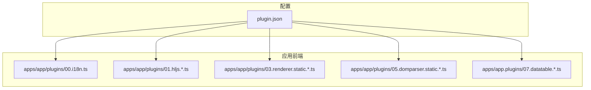
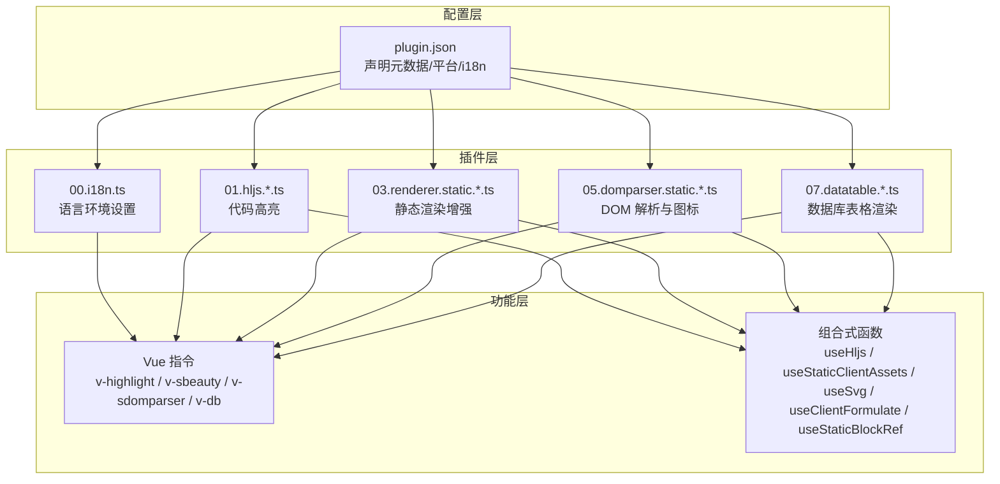
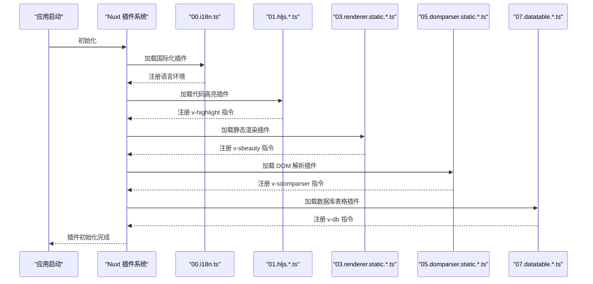
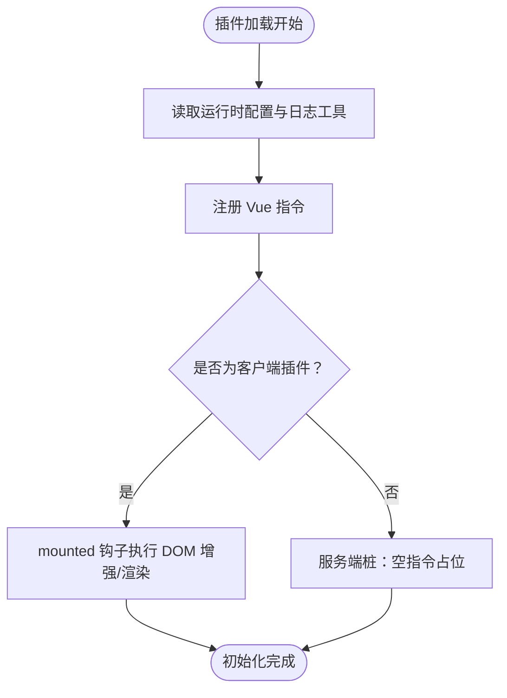
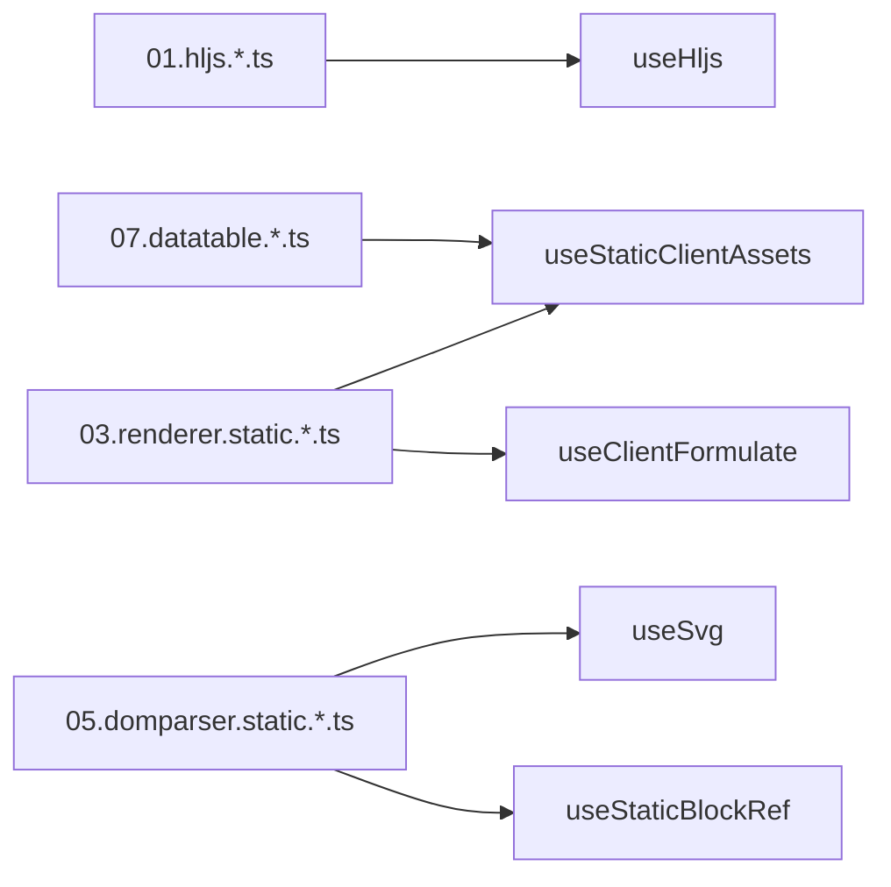

# 插件架构设计

<cite>
**本文引用的文件**
- [plugin.json](file://plugin.json)
- [apps/app/plugins/00.i18n.ts](file://apps/app/plugins/00.i18n.ts)
- [apps/app/plugins/01.hljs.client.ts](file://apps/app/plugins/01.hljs.client.ts)
- [apps/app/plugins/02.hljs.server.ts](file://apps/app/plugins/02.hljs.server.ts)
- [apps/app/plugins/03.renderer.static.client.ts](file://apps/app/plugins/03.renderer.static.client.ts)
- [apps/app/plugins/04.renderer.static.server.ts](file://apps/app/plugins/04.renderer.static.server.ts)
- [apps/app/plugins/05.domparser.static.client.ts](file://apps/app/plugins/05.domparser.static.client.ts)
- [apps/app/plugins/06.domparser.static.server.ts](file://apps/app/plugins/06.domparser.static.server.ts)
- [apps/app/plugins/07.datatable.client.ts](file://apps/app/plugins/07.datatable.client.ts)
- [apps/app/plugins/08.datatable.server.ts](file://apps/app/plugins/08.datatable.server.ts)
</cite>

## 目录
1. [引言](#引言)
2. [项目结构](#项目结构)
3. [核心组件](#核心组件)
4. [架构总览](#架构总览)
5. [详细组件分析](#详细组件分析)
6. [依赖分析](#依赖分析)
7. [性能考虑](#性能考虑)
8. [故障排查指南](#故障排查指南)
9. [结论](#结论)
10. [附录](#附录)

## 引言
本设计文档面向 Siyuan Plugin Blog 的插件系统，系统性阐述插件的分类体系、加载机制、生命周期管理、依赖注入与初始化流程、插件间通信与事件系统、配置文件结构与参数定义、开发基础架构概念与设计原则，以及安全模型与权限控制机制。目标是帮助开发者快速理解并扩展该插件生态。

## 项目结构
插件系统主要位于应用前端目录 apps/app/plugins 下，采用“命名前缀 + 功能分组”的组织方式，便于按加载顺序与功能域进行管理。插件以 Nuxt 插件形式注册，遵循客户端/服务端双份实现的约定，确保 SSR 场景下的兼容性与稳定性。

图表来源
- [apps/app/plugins/00.i18n.ts:16-27](file://apps/app/plugins/00.i18n.ts#L16-L27)
- [apps/app/plugins/01.hljs.client.ts:37-79](file://apps/app/plugins/01.hljs.client.ts#L37-L79)
- [apps/app/plugins/03.renderer.static.client.ts:38-57](file://apps/app/plugins/03.renderer.static.client.ts#L38-L57)
- [apps/app/plugins/05.domparser.static.client.ts:38-78](file://apps/app/plugins/05.domparser.static.client.ts#L38-L78)
- [apps/app/plugins/07.datatable.client.ts:22-295](file://apps/app/plugins/07.datatable.client.ts#L22-L295)
- [plugin.json:1-43](file://plugin.json#L1-L43)

章节来源
- [plugin.json:1-43](file://plugin.json#L1-L43)
- [apps/app/plugins/00.i18n.ts:16-27](file://apps/app/plugins/00.i18n.ts#L16-L27)
- [apps/app/plugins/01.hljs.client.ts:37-79](file://apps/app/plugins/01.hljs.client.ts#L37-L79)
- [apps/app/plugins/03.renderer.static.client.ts:38-57](file://apps/app/plugins/03.renderer.static.client.ts#L38-L57)
- [apps/app/plugins/05.domparser.static.client.ts:38-78](file://apps/app/plugins/05.domparser.static.client.ts#L38-L78)
- [apps/app/plugins/07.datatable.client.ts:22-295](file://apps/app/plugins/07.datatable.client.ts#L22-L295)

## 核心组件
- 插件配置文件：用于声明插件元数据、平台支持、国际化资源与展示信息。
- Nuxt 插件：以 defineNuxtPlugin 形式导出，负责在应用启动时完成依赖注入、指令注册与初始化。
- 客户端/服务端插件对：为 SSR 提供服务端桩实现，避免 SSR 渲染时的运行时错误。
- 指令与工具组合：通过 Vue 指令与组合式函数（composables）封装具体功能，如代码高亮、静态渲染增强、DOM 解析与数据库表格渲染。

章节来源
- [plugin.json:1-43](file://plugin.json#L1-L43)
- [apps/app/plugins/00.i18n.ts:16-27](file://apps/app/plugins/00.i18n.ts#L16-L27)
- [apps/app/plugins/01.hljs.client.ts:37-79](file://apps/app/plugins/01.hljs.client.ts#L37-L79)
- [apps/app/plugins/02.hljs.server.ts:27-29](file://apps/app/plugins/02.hljs.server.ts#L27-L29)
- [apps/app/plugins/03.renderer.static.client.ts:38-57](file://apps/app/plugins/03.renderer.static.client.ts#L38-L57)
- [apps/app/plugins/04.renderer.static.server.ts:27-29](file://apps/app/plugins/04.renderer.static.server.ts#L27-L29)
- [apps/app/plugins/05.domparser.static.client.ts:38-78](file://apps/app/plugins/05.domparser.static.client.ts#L38-L78)
- [apps/app/plugins/06.domparser.static.server.ts:27-29](file://apps/app/plugins/06.domparser.static.server.ts#L27-L29)
- [apps/app/plugins/07.datatable.client.ts:22-295](file://apps/app/plugins/07.datatable.client.ts#L22-L295)
- [apps/app/plugins/08.datatable.server.ts:11-13](file://apps/app/plugins/08.datatable.server.ts#L11-L13)

## 架构总览
插件系统采用“配置驱动 + Nuxt 插件 + 指令/组合式函数”的三层架构：
- 配置层：通过 plugin.json 统一声明插件元数据与平台能力。
- 插件层：以 Nuxt 插件形式注册，按序加载，完成依赖注入与初始化。
- 功能层：通过 Vue 指令与组合式函数在运行时对 DOM 进行增强或渲染。

图表来源
- [plugin.json:1-43](file://plugin.json#L1-L43)
- [apps/app/plugins/00.i18n.ts:16-27](file://apps/app/plugins/00.i18n.ts#L16-L27)
- [apps/app/plugins/01.hljs.client.ts:37-79](file://apps/app/plugins/01.hljs.client.ts#L37-L79)
- [apps/app/plugins/03.renderer.static.client.ts:38-57](file://apps/app/plugins/03.renderer.static.client.ts#L38-L57)
- [apps/app/plugins/05.domparser.static.client.ts:38-78](file://apps/app/plugins/05.domparser.static.client.ts#L38-L78)
- [apps/app/plugins/07.datatable.client.ts:22-295](file://apps/app/plugins/07.datatable.client.ts#L22-L295)

## 详细组件分析

### 插件分类体系与加载机制
- 分类体系
  - 客户端插件：仅在浏览器端运行，如代码高亮、静态渲染增强、DOM 解析与数据库表格渲染等。
  - 服务器端插件：在 SSR 环境提供桩实现，避免 SSR 渲染时的运行时错误。
  - 通用插件：与平台无关的功能，如国际化设置。
- 加载机制
  - 插件按文件名前缀排序加载，前缀数字越小优先级越高。
  - 客户端与服务端插件成对出现，服务端插件以空指令占位，保证 SSR 不报错。

图表来源
- [apps/app/plugins/00.i18n.ts:16-27](file://apps/app/plugins/00.i18n.ts#L16-L27)
- [apps/app/plugins/01.hljs.client.ts:37-79](file://apps/app/plugins/01.hljs.client.ts#L37-L79)
- [apps/app/plugins/02.hljs.server.ts:27-29](file://apps/app/plugins/02.hljs.server.ts#L27-L29)
- [apps/app/plugins/03.renderer.static.client.ts:38-57](file://apps/app/plugins/03.renderer.static.client.ts#L38-L57)
- [apps/app/plugins/04.renderer.static.server.ts:27-29](file://apps/app/plugins/04.renderer.static.server.ts#L27-L29)
- [apps/app/plugins/05.domparser.static.client.ts:38-78](file://apps/app/plugins/05.domparser.static.client.ts#L38-L78)
- [apps/app/plugins/06.domparser.static.server.ts:27-29](file://apps/app/plugins/06.domparser.static.server.ts#L27-L29)
- [apps/app/plugins/07.datatable.client.ts:22-295](file://apps/app/plugins/07.datatable.client.ts#L22-L295)
- [apps/app/plugins/08.datatable.server.ts:11-13](file://apps/app/plugins/08.datatable.server.ts#L11-L13)

章节来源
- [apps/app/plugins/00.i18n.ts:16-27](file://apps/app/plugins/00.i18n.ts#L16-L27)
- [apps/app/plugins/01.hljs.client.ts:37-79](file://apps/app/plugins/01.hljs.client.ts#L37-L79)
- [apps/app/plugins/02.hljs.server.ts:27-29](file://apps/app/plugins/02.hljs.server.ts#L27-L29)
- [apps/app/plugins/03.renderer.static.client.ts:38-57](file://apps/app/plugins/03.renderer.static.client.ts#L38-L57)
- [apps/app/plugins/04.renderer.static.server.ts:27-29](file://apps/app/plugins/04.renderer.static.server.ts#L27-L29)
- [apps/app/plugins/05.domparser.static.client.ts:38-78](file://apps/app/plugins/05.domparser.static.client.ts#L38-L78)
- [apps/app/plugins/06.domparser.static.server.ts:27-29](file://apps/app/plugins/06.domparser.static.server.ts#L27-L29)
- [apps/app/plugins/07.datatable.client.ts:22-295](file://apps/app/plugins/07.datatable.client.ts#L22-L295)
- [apps/app/plugins/08.datatable.server.ts:11-13](file://apps/app/plugins/08.datatable.server.ts#L11-L13)

### 生命周期管理、依赖注入与初始化流程
- 生命周期
  - 插件在 Nuxt 初始化阶段被加载，随后在应用挂载前完成依赖注入与指令注册。
  - 客户端插件在 mounted 阶段执行 DOM 增强逻辑；服务端插件不执行任何运行时操作。
- 依赖注入
  - 通过组合式函数注入工具模块，如代码高亮、静态资源前缀处理、SVG 注入、Formulate 渲染、块引用链接转换等。
- 初始化流程
  - 读取运行时配置与日志工具，输出初始化日志。
  - 在对应指令的 mounted 钩子中执行 DOM 处理与渲染逻辑。

图表来源
- [apps/app/plugins/01.hljs.client.ts:37-79](file://apps/app/plugins/01.hljs.client.ts#L37-L79)
- [apps/app/plugins/03.renderer.static.client.ts:38-57](file://apps/app/plugins/03.renderer.static.client.ts#L38-L57)
- [apps/app/plugins/05.domparser.static.client.ts:38-78](file://apps/app/plugins/05.domparser.static.client.ts#L38-L78)
- [apps/app/plugins/07.datatable.client.ts:22-295](file://apps/app/plugins/07.datatable.client.ts#L22-L295)
- [apps/app/plugins/02.hljs.server.ts:27-29](file://apps/app/plugins/02.hljs.server.ts#L27-L29)
- [apps/app/plugins/04.renderer.static.server.ts:27-29](file://apps/app/plugins/04.renderer.static.server.ts#L27-L29)
- [apps/app/plugins/06.domparser.static.server.ts:27-29](file://apps/app/plugins/06.domparser.static.server.ts#L27-L29)
- [apps/app/plugins/08.datatable.server.ts:11-13](file://apps/app/plugins/08.datatable.server.ts#L11-L13)

章节来源
- [apps/app/plugins/01.hljs.client.ts:37-79](file://apps/app/plugins/01.hljs.client.ts#L37-L79)
- [apps/app/plugins/03.renderer.static.client.ts:38-57](file://apps/app/plugins/03.renderer.static.client.ts#L38-L57)
- [apps/app/plugins/05.domparser.static.client.ts:38-78](file://apps/app/plugins/05.domparser.static.client.ts#L38-L78)
- [apps/app/plugins/07.datatable.client.ts:22-295](file://apps/app/plugins/07.datatable.client.ts#L22-L295)
- [apps/app/plugins/02.hljs.server.ts:27-29](file://apps/app/plugins/02.hljs.server.ts#L27-L29)
- [apps/app/plugins/04.renderer.static.server.ts:27-29](file://apps/app/plugins/04.renderer.static.server.ts#L27-L29)
- [apps/app/plugins/06.domparser.static.server.ts:27-29](file://apps/app/plugins/06.domparser.static.server.ts#L27-L29)
- [apps/app/plugins/08.datatable.server.ts:11-13](file://apps/app/plugins/08.datatable.server.ts#L11-L13)

### 插件间通信机制与事件系统
- 当前实现
  - 插件之间通过 Vue 指令与 DOM 共享状态进行协作，例如静态渲染增强与数据库表格渲染共同作用于同一容器内的 DOM 结构。
  - 国际化插件通过路由查询参数动态切换语言，影响后续渲染行为。
- 扩展建议
  - 引入集中式事件总线或基于上下文的事件发布/订阅机制，降低耦合度。
  - 对跨插件的数据共享引入轻量级 Store 或 Provider 模式，统一状态入口。

章节来源
- [apps/app/plugins/00.i18n.ts:16-27](file://apps/app/plugins/00.i18n.ts#L16-L27)
- [apps/app/plugins/03.renderer.static.client.ts:38-57](file://apps/app/plugins/03.renderer.static.client.ts#L38-L57)
- [apps/app/plugins/07.datatable.client.ts:22-295](file://apps/app/plugins/07.datatable.client.ts#L22-L295)

### 插件配置文件结构说明与参数定义
- 关键字段
  - name：插件名称
  - author：作者
  - url：项目地址
  - version：版本号
  - minAppVersion：最低应用版本要求
  - backends：支持的后端平台列表
  - frontends：支持的前端平台列表
  - displayName/description：多语言显示名称与描述
  - readme：多语言说明文档路径
  - i18n：支持的语言列表
  - funding：资助/打赏链接
- 用途
  - 作为插件生态的元数据入口，驱动安装、更新与兼容性检查。

章节来源
- [plugin.json:1-43](file://plugin.json#L1-L43)

### 开发基础架构概念与设计原则
- 设计原则
  - 单一职责：每个插件聚焦一个明确功能域。
  - 可插拔：通过 Nuxt 插件与指令实现松耦合集成。
  - SSR 友好：服务端提供桩实现，避免运行时异常。
  - 可测试：组合式函数与指令分离，便于单元测试与集成测试。
- 架构概念
  - 插件即 Nuxt 插件：统一的生命周期与依赖注入。
  - 指令即行为：通过指令将渲染增强逻辑与业务解耦。
  - 组合式函数即工具：封装可复用的工具方法与状态。

章节来源
- [apps/app/plugins/00.i18n.ts:16-27](file://apps/app/plugins/00.i18n.ts#L16-L27)
- [apps/app/plugins/01.hljs.client.ts:37-79](file://apps/app/plugins/01.hljs.client.ts#L37-L79)
- [apps/app/plugins/03.renderer.static.client.ts:38-57](file://apps/app/plugins/03.renderer.static.client.ts#L38-L57)
- [apps/app/plugins/05.domparser.static.client.ts:38-78](file://apps/app/plugins/05.domparser.static.client.ts#L38-L78)
- [apps/app/plugins/07.datatable.client.ts:22-295](file://apps/app/plugins/07.datatable.client.ts#L22-L295)

### 安全模型与权限控制机制
- 当前实现
  - 插件在浏览器端运行，遵循浏览器同源策略与 CSP 限制。
  - 无显式的权限声明与访问控制，所有增强逻辑均在客户端 DOM 上执行。
- 建议
  - 引入最小权限原则：仅在必要时访问 DOM 与网络资源。
  - 对外部资源（如 CDN）增加 CSP 策略与来源白名单。
  - 对用户输入与富文本内容进行严格的转义与校验，防止 XSS。

章节来源
- [apps/app/plugins/01.hljs.client.ts:37-79](file://apps/app/plugins/01.hljs.client.ts#L37-L79)
- [apps/app/plugins/03.renderer.static.client.ts:38-57](file://apps/app/plugins/03.renderer.static.client.ts#L38-L57)
- [apps/app/plugins/05.domparser.static.client.ts:38-78](file://apps/app/plugins/05.domparser.static.client.ts#L38-L78)
- [apps/app/plugins/07.datatable.client.ts:22-295](file://apps/app/plugins/07.datatable.client.ts#L22-L295)

## 依赖分析
- 组件内聚与耦合
  - 同一功能域内的客户端与服务端插件保持高内聚，通过指令与组合式函数解耦。
  - 插件间通过 DOM 共享状态协作，建议引入集中式事件或状态管理降低耦合。
- 外部依赖
  - 代码高亮依赖第三方库；静态渲染依赖运行时配置与日志工具；数据库表格渲染依赖 JSON 数据与 DOM 操作。
- 循环依赖
  - 当前未发现循环依赖；若引入集中式事件总线，需避免事件处理器对插件初始化的反向依赖。

图表来源
- [apps/app/plugins/01.hljs.client.ts:26-39](file://apps/app/plugins/01.hljs.client.ts#L26-L39)
- [apps/app/plugins/03.renderer.static.client.ts:26-41](file://apps/app/plugins/03.renderer.static.client.ts#L26-L41)
- [apps/app/plugins/05.domparser.static.client.ts:26-41](file://apps/app/plugins/05.domparser.static.client.ts#L26-L41)
- [apps/app/plugins/07.datatable.client.ts:22-24](file://apps/app/plugins/07.datatable.client.ts#L22-L24)

章节来源
- [apps/app/plugins/01.hljs.client.ts:26-39](file://apps/app/plugins/01.hljs.client.ts#L26-L39)
- [apps/app/plugins/03.renderer.static.client.ts:26-41](file://apps/app/plugins/03.renderer.static.client.ts#L26-L41)
- [apps/app/plugins/05.domparser.static.client.ts:26-41](file://apps/app/plugins/05.domparser.static.client.ts#L26-L41)
- [apps/app/plugins/07.datatable.client.ts:22-24](file://apps/app/plugins/07.datatable.client.ts#L22-L24)

## 性能考虑
- SSR 与 CSR 的平衡
  - 服务端插件提供桩实现，避免 SSR 渲染阻塞；客户端插件在挂载后异步处理 DOM，减少首屏压力。
- 资源加载
  - 代码高亮与静态渲染依赖外部库，建议按需加载与缓存策略，减少重复请求。
- DOM 操作
  - 数据库表格渲染涉及大量 DOM 操作，建议使用虚拟滚动或分页策略，降低内存占用。

## 故障排查指南
- SSR 报错
  - 确认服务端插件已正确提供桩实现，避免在 SSR 期间调用浏览器 API。
- 指令未生效
  - 检查指令注册顺序与 DOM 属性是否正确；确认客户端插件已在 mounted 钩子中执行。
- 资源路径问题
  - 检查静态资源前缀注入逻辑，确保资源 URL 正确拼接。
- 日志定位
  - 利用插件内部日志输出定位问题发生阶段。

章节来源
- [apps/app/plugins/02.hljs.server.ts:27-29](file://apps/app/plugins/02.hljs.server.ts#L27-L29)
- [apps/app/plugins/04.renderer.static.server.ts:27-29](file://apps/app/plugins/04.renderer.static.server.ts#L27-L29)
- [apps/app/plugins/06.domparser.static.server.ts:27-29](file://apps/app/plugins/06.domparser.static.server.ts#L27-L29)
- [apps/app/plugins/08.datatable.server.ts:11-13](file://apps/app/plugins/08.datatable.server.ts#L11-L13)
- [apps/app/plugins/01.hljs.client.ts:37-79](file://apps/app/plugins/01.hljs.client.ts#L37-L79)
- [apps/app/plugins/03.renderer.static.client.ts:38-57](file://apps/app/plugins/03.renderer.static.client.ts#L38-L57)
- [apps/app/plugins/05.domparser.static.client.ts:38-78](file://apps/app/plugins/05.domparser.static.client.ts#L38-L78)
- [apps/app/plugins/07.datatable.client.ts:22-295](file://apps/app/plugins/07.datatable.client.ts#L22-L295)

## 结论
该插件系统以 Nuxt 插件为核心，结合 Vue 指令与组合式函数，实现了对客户端渲染的灵活增强与扩展。通过客户端/服务端插件对与集中式配置，系统具备良好的可维护性与可扩展性。建议在未来引入集中式事件与状态管理，进一步提升插件间的协作效率与安全性。

## 附录
- 插件命名规范：以两位前缀数字 + 功能描述 + 环境标识（client/server）命名，便于排序与职责划分。
- 开发建议：优先使用组合式函数封装可复用逻辑；在客户端插件中谨慎处理 DOM 与异步操作；为每个插件提供服务端桩实现。