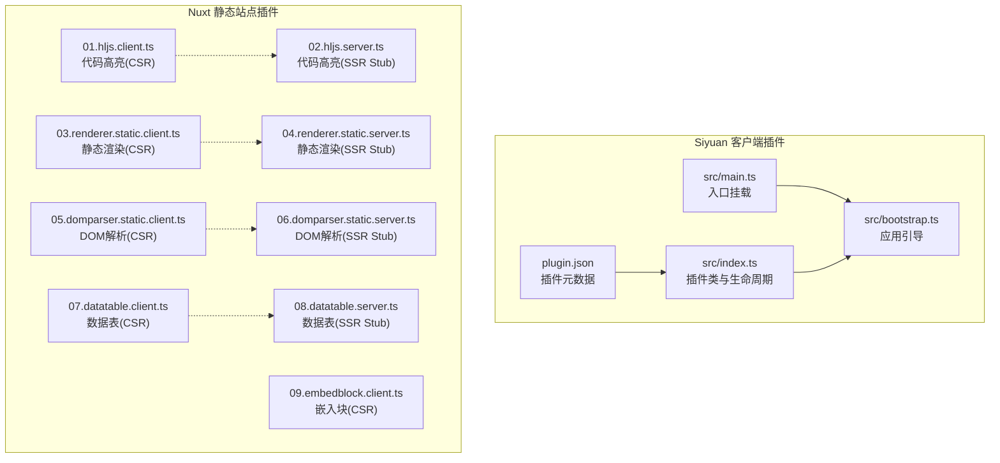
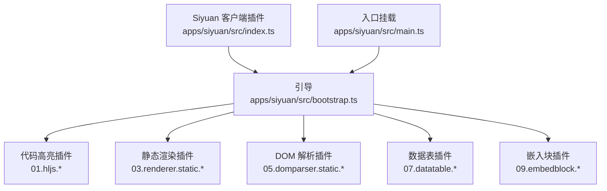
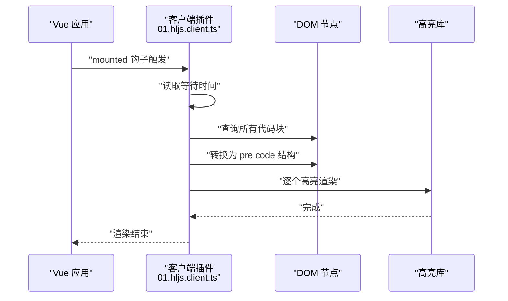
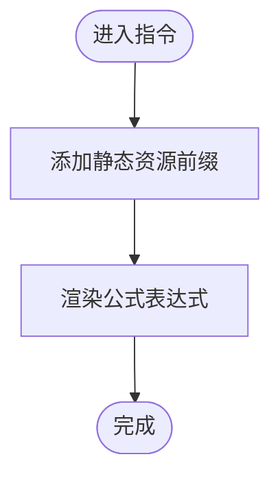
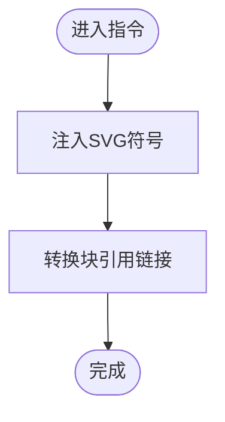
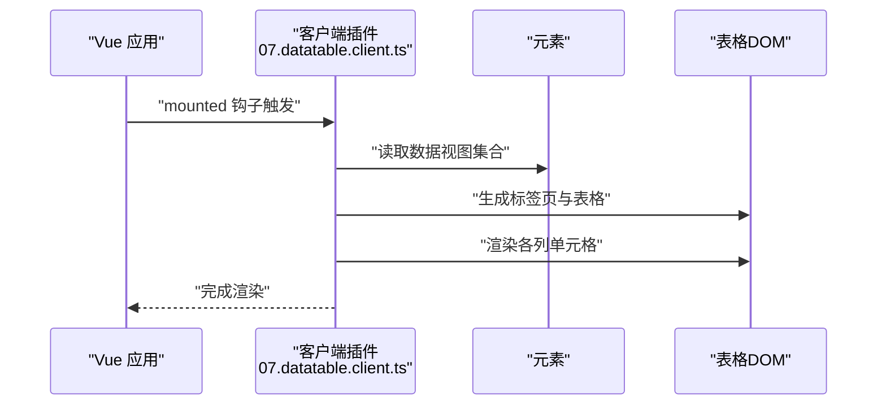
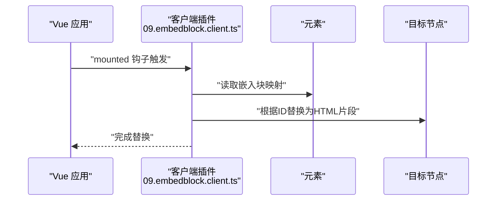
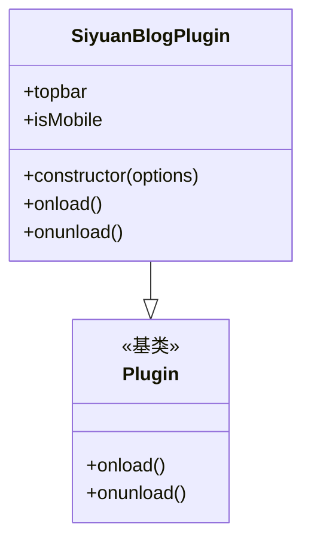
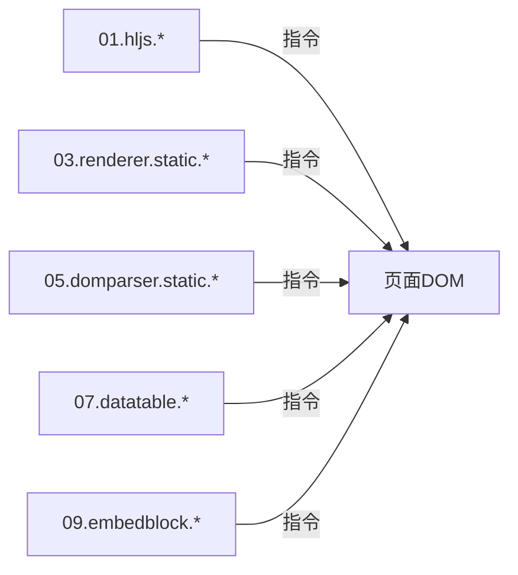

# 插件系统

<cite>
**本文引用的文件**
- [apps/siyuan/plugin.json](file://apps/siyuan/plugin.json)
- [apps/siyuan/src/index.ts](file://apps/siyuan/src/index.ts)
- [apps/siyuan/src/main.ts](file://apps/siyuan/src/main.ts)
- [apps/siyuan/src/bootstrap.ts](file://apps/siyuan/src/bootstrap.ts)
- [apps/app/plugins/01.hljs.client.ts](file://apps/app/plugins/01.hljs.client.ts)
- [apps/app/plugins/02.hljs.server.ts](file://apps/app/plugins/02.hljs.server.ts)
- [apps/app/plugins/03.renderer.static.client.ts](file://apps/app/plugins/03.renderer.static.client.ts)
- [apps/app/plugins/04.renderer.static.server.ts](file://apps/app/plugins/04.renderer.static.server.ts)
- [apps/app/plugins/05.domparser.static.client.ts](file://apps/app/plugins/05.domparser.static.client.ts)
- [apps/app/plugins/06.domparser.static.server.ts](file://apps/app/plugins/06.domparser.static.server.ts)
- [apps/app/plugins/07.datatable.client.ts](file://apps/app/plugins/07.datatable.client.ts)
- [apps/app/plugins/08.datatable.server.ts](file://apps/app/plugins/08.datatable.server.ts)
- [apps/app/plugins/09.embedblock.client.ts](file://apps/app/plugins/09.embedblock.client.ts)
</cite>

## 目录
1. [简介](#简介)
2. [项目结构](#项目结构)
3. [核心组件](#核心组件)
4. [架构总览](#架构总览)
5. [详细组件分析](#详细组件分析)
6. [依赖分析](#依赖分析)
7. [性能考虑](#性能考虑)
8. [故障排查指南](#故障排查指南)
9. [结论](#结论)
10. [附录](#附录)

## 简介
本文件系统性阐述 Siyuan Plugin Blog 的插件体系与扩展机制，覆盖插件分类（客户端插件、服务器端插件）、加载顺序、生命周期钩子、API 接口、内置插件实现原理（语法高亮、代码块渲染、嵌入块、数据表渲染、DOM 解析与 SVG 注入等）、插件间依赖与冲突处理、调试技巧、性能优化、最佳实践与常见陷阱，以及打包、分发与版本管理策略。

## 项目结构
该仓库采用多应用与多插件并存的组织方式：
- 应用层：apps/siyuan 为 Siyuan 客户端插件入口；apps/app 为基于 Nuxt 的静态站点渲染应用，内置大量渲染与解析类插件。
- 插件层：apps/app/plugins 下以编号前缀命名的 Nuxt 插件，按“客户端/服务器端”配对，形成“同名不同实现”的双份插件对，用于在 SSR/CSR 场景分别加载。

**图表来源**
- [apps/siyuan/plugin.json:1-43](file://apps/siyuan/plugin.json#L1-L43)
- [apps/siyuan/src/main.ts:10-14](file://apps/siyuan/src/main.ts#L10-L14)
- [apps/siyuan/src/bootstrap.ts:12-14](file://apps/siyuan/src/bootstrap.ts#L12-L14)
- [apps/siyuan/src/index.ts:22-48](file://apps/siyuan/src/index.ts#L22-L48)
- [apps/app/plugins/01.hljs.client.ts:37-79](file://apps/app/plugins/01.hljs.client.ts#L37-L79)
- [apps/app/plugins/02.hljs.server.ts:27-29](file://apps/app/plugins/02.hljs.server.ts#L27-L29)
- [apps/app/plugins/03.renderer.static.client.ts:38-57](file://apps/app/plugins/03.renderer.static.client.ts#L38-L57)
- [apps/app/plugins/04.renderer.static.server.ts:27-29](file://apps/app/plugins/04.renderer.static.server.ts#L27-L29)
- [apps/app/plugins/05.domparser.static.client.ts:38-78](file://apps/app/plugins/05.domparser.static.client.ts#L38-L78)
- [apps/app/plugins/06.domparser.static.server.ts:27-29](file://apps/app/plugins/06.domparser.static.server.ts#L27-L29)
- [apps/app/plugins/07.datatable.client.ts:22-295](file://apps/app/plugins/07.datatable.client.ts#L22-L295)
- [apps/app/plugins/08.datatable.server.ts:11-13](file://apps/app/plugins/08.datatable.server.ts#L11-L13)
- [apps/app/plugins/09.embedblock.client.ts:21-47](file://apps/app/plugins/09.embedblock.client.ts#L21-L47)

**章节来源**
- [apps/siyuan/plugin.json:1-43](file://apps/siyuan/plugin.json#L1-L43)
- [apps/siyuan/src/main.ts:10-14](file://apps/siyuan/src/main.ts#L10-L14)
- [apps/siyuan/src/bootstrap.ts:12-14](file://apps/siyuan/src/bootstrap.ts#L12-L14)
- [apps/siyuan/src/index.ts:22-48](file://apps/siyuan/src/index.ts#L22-L48)

## 核心组件
- 插件元数据与入口
  - 插件元数据由 [apps/siyuan/plugin.json:1-43](file://apps/siyuan/plugin.json#L1-L43) 提供，声明名称、作者、平台支持、前端适配、国际化等。
  - 客户端入口通过 [apps/siyuan/src/main.ts:10-14](file://apps/siyuan/src/main.ts#L10-L14) 调用引导函数挂载应用。
  - 引导逻辑在 [apps/siyuan/src/bootstrap.ts:12-14](file://apps/siyuan/src/bootstrap.ts#L12-L14) 中实现，负责创建 Vue 应用并挂载到指定容器。
  - 插件类与生命周期在 [apps/siyuan/src/index.ts:22-48](file://apps/siyuan/src/index.ts#L22-L48) 中定义，包含构造函数、onload、onunload 等钩子，以及前端环境判断与工具栏初始化等职责。

- 插件分类与加载顺序
  - 分类：客户端插件（浏览器端）与服务器端插件（SSR 占位/桩）。例如：
    - 代码高亮：01.hljs.client.ts 与 02.hljs.server.ts
    - 静态渲染：03.renderer.static.client.ts 与 04.renderer.static.server.ts
    - DOM 解析与 SVG 注入：05.domparser.static.client.ts 与 06.domparser.static.server.ts
    - 数据表渲染：07.datatable.client.ts 与 08.datatable.server.ts
    - 嵌入块：09.embedblock.client.ts
  - 加载顺序：Nuxt 插件按文件名前缀排序加载，因此以两位数字前缀（01、02、...）保证稳定的执行顺序。客户端插件在 CSR 场景生效，服务器端插件作为 SSR 的占位实现，避免 SSR 期间访问浏览器 API 导致错误。

**章节来源**
- [apps/siyuan/plugin.json:1-43](file://apps/siyuan/plugin.json#L1-L43)
- [apps/siyuan/src/main.ts:10-14](file://apps/siyuan/src/main.ts#L10-L14)
- [apps/siyuan/src/bootstrap.ts:12-14](file://apps/siyuan/src/bootstrap.ts#L12-L14)
- [apps/siyuan/src/index.ts:22-48](file://apps/siyuan/src/index.ts#L22-L48)
- [apps/app/plugins/01.hljs.client.ts:37-79](file://apps/app/plugins/01.hljs.client.ts#L37-L79)
- [apps/app/plugins/02.hljs.server.ts:27-29](file://apps/app/plugins/02.hljs.server.ts#L27-L29)
- [apps/app/plugins/03.renderer.static.client.ts:38-57](file://apps/app/plugins/03.renderer.static.client.ts#L38-L57)
- [apps/app/plugins/04.renderer.static.server.ts:27-29](file://apps/app/plugins/04.renderer.static.server.ts#L27-L29)
- [apps/app/plugins/05.domparser.static.client.ts:38-78](file://apps/app/plugins/05.domparser.static.client.ts#L38-L78)
- [apps/app/plugins/06.domparser.static.server.ts:27-29](file://apps/app/plugins/06.domparser.static.server.ts#L27-L29)
- [apps/app/plugins/07.datatable.client.ts:22-295](file://apps/app/plugins/07.datatable.client.ts#L22-L295)
- [apps/app/plugins/08.datatable.server.ts:11-13](file://apps/app/plugins/08.datatable.server.ts#L11-L13)
- [apps/app/plugins/09.embedblock.client.ts:21-47](file://apps/app/plugins/09.embedblock.client.ts#L21-L47)

## 架构总览
下图展示 Siyuan 客户端插件与 Nuxt 静态站点插件的协作关系：Siyuan 客户端插件负责工具栏与基础能力，Nuxt 插件负责页面渲染、DOM 解析、代码高亮、数据表与嵌入块等前端增强。

**图表来源**
- [apps/siyuan/src/index.ts:22-48](file://apps/siyuan/src/index.ts#L22-L48)
- [apps/siyuan/src/bootstrap.ts:12-14](file://apps/siyuan/src/bootstrap.ts#L12-L14)
- [apps/siyuan/src/main.ts:10-14](file://apps/siyuan/src/main.ts#L10-L14)
- [apps/app/plugins/01.hljs.client.ts:37-79](file://apps/app/plugins/01.hljs.client.ts#L37-L79)
- [apps/app/plugins/03.renderer.static.client.ts:38-57](file://apps/app/plugins/03.renderer.static.client.ts#L38-L57)
- [apps/app/plugins/05.domparser.static.client.ts:38-78](file://apps/app/plugins/05.domparser.static.client.ts#L38-L78)
- [apps/app/plugins/07.datatable.client.ts:22-295](file://apps/app/plugins/07.datatable.client.ts#L22-L295)
- [apps/app/plugins/09.embedblock.client.ts:21-47](file://apps/app/plugins/09.embedblock.client.ts#L21-L47)

## 详细组件分析

### 代码高亮插件（01.hljs.*）
- 客户端实现要点
  - 在 mounted 生命周期中，延迟等待内容稳定后，遍历页面中的代码块节点，将其转换为标准的 pre code 结构并调用高亮库进行渲染。
  - 通过运行时配置读取等待时间，避免 SSR 与 CSR 渲染时机差异导致的闪烁或遗漏。
- 服务器端实现要点
  - 作为 SSR 占位插件，注册一个空指令，避免 SSR 期间访问浏览器 API 抛错。

**图表来源**
- [apps/app/plugins/01.hljs.client.ts:37-79](file://apps/app/plugins/01.hljs.client.ts#L37-L79)

**章节来源**
- [apps/app/plugins/01.hljs.client.ts:37-79](file://apps/app/plugins/01.hljs.client.ts#L37-L79)
- [apps/app/plugins/02.hljs.server.ts:27-29](file://apps/app/plugins/02.hljs.server.ts#L27-L29)

### 静态渲染插件（03.renderer.static.*）
- 客户端实现要点
  - 为静态资源添加客户端前缀，确保资源路径正确。
  - 对公式（Formulate）进行渲染处理，提升静态页面的数学表达式可读性。
- 服务器端实现要点
  - 注册空指令，避免 SSR 访问浏览器 API。

**图表来源**
- [apps/app/plugins/03.renderer.static.client.ts:38-57](file://apps/app/plugins/03.renderer.static.client.ts#L38-L57)

**章节来源**
- [apps/app/plugins/03.renderer.static.client.ts:38-57](file://apps/app/plugins/03.renderer.static.client.ts#L38-L57)
- [apps/app/plugins/04.renderer.static.server.ts:27-29](file://apps/app/plugins/04.renderer.static.server.ts#L27-L29)

### DOM 解析与 SVG 注入插件（05.domparser.static.*）
- 客户端实现要点
  - 将一组 SVG 符号注入到页面，供后续图标使用。
  - 将块引用链接转换为可点击链接，改善阅读体验。
- 服务器端实现要点
  - 注册空指令，避免 SSR 访问浏览器 API。

**图表来源**
- [apps/app/plugins/05.domparser.static.client.ts:38-78](file://apps/app/plugins/05.domparser.static.client.ts#L38-L78)

**章节来源**
- [apps/app/plugins/05.domparser.static.client.ts:38-78](file://apps/app/plugins/05.domparser.static.client.ts#L38-L78)
- [apps/app/plugins/06.domparser.static.server.ts:27-29](file://apps/app/plugins/06.domparser.static.server.ts#L27-L29)

### 数据表渲染插件（07.datatable.*）
- 客户端实现要点
  - 从元素属性中读取数据视图集合，按视图生成标签页与表格，动态渲染单元格内容（文本、日期、多选、附件、URL、电话等），并为每张表注入资源前缀。
  - 支持多视图切换，首次默认激活第一个标签页。
- 服务器端实现要点
  - 注册空指令，避免 SSR 访问浏览器 API。

**图表来源**
- [apps/app/plugins/07.datatable.client.ts:22-295](file://apps/app/plugins/07.datatable.client.ts#L22-L295)

**章节来源**
- [apps/app/plugins/07.datatable.client.ts:22-295](file://apps/app/plugins/07.datatable.client.ts#L22-L295)
- [apps/app/plugins/08.datatable.server.ts:11-13](file://apps/app/plugins/08.datatable.server.ts#L11-L13)

### 嵌入块插件（09.embedblock.*）
- 客户端实现要点
  - 从元素属性中读取嵌入块映射数据，将对应节点替换为渲染后的 HTML 片段，实现块查询嵌入的即时渲染。

**图表来源**
- [apps/app/plugins/09.embedblock.client.ts:21-47](file://apps/app/plugins/09.embedblock.client.ts#L21-L47)

**章节来源**
- [apps/app/plugins/09.embedblock.client.ts:21-47](file://apps/app/plugins/09.embedblock.client.ts#L21-L47)

### Siyuan 客户端插件（apps/siyuan/src/index.ts）
- 职责
  - 继承插件基类，提供图标注册与顶部工具栏初始化。
  - 在构造阶段识别前端类型（移动端/桌面端），以便在不同环境下调整行为。
  - 提供生命周期钩子 onload/onunload，便于在插件启用/禁用时执行清理或初始化逻辑。

**图表来源**
- [apps/siyuan/src/index.ts:22-48](file://apps/siyuan/src/index.ts#L22-L48)

**章节来源**
- [apps/siyuan/src/index.ts:22-48](file://apps/siyuan/src/index.ts#L22-L48)

## 依赖分析
- 插件耦合与分工
  - 客户端插件与服务器端插件成对出现，彼此互不依赖，通过相同的指令名在不同运行时生效，降低耦合度。
  - Nuxt 插件之间无直接依赖，均通过 DOM 指令与运行时配置进行解耦。
- 外部依赖
  - 代码高亮依赖高亮库；静态渲染依赖静态资源前缀工具；数据表渲染依赖日期/字符串/JSON 工具库；嵌入块依赖 JSON 解析工具。
- 潜在循环依赖
  - 当前结构为单向依赖（插件 -> 工具），未见循环依赖迹象。

**图表来源**
- [apps/app/plugins/01.hljs.client.ts:37-79](file://apps/app/plugins/01.hljs.client.ts#L37-L79)
- [apps/app/plugins/03.renderer.static.client.ts:38-57](file://apps/app/plugins/03.renderer.static.client.ts#L38-L57)
- [apps/app/plugins/05.domparser.static.client.ts:38-78](file://apps/app/plugins/05.domparser.static.client.ts#L38-L78)
- [apps/app/plugins/07.datatable.client.ts:22-295](file://apps/app/plugins/07.datatable.client.ts#L22-L295)
- [apps/app/plugins/09.embedblock.client.ts:21-47](file://apps/app/plugins/09.embedblock.client.ts#L21-L47)

**章节来源**
- [apps/app/plugins/01.hljs.client.ts:37-79](file://apps/app/plugins/01.hljs.client.ts#L37-L79)
- [apps/app/plugins/03.renderer.static.client.ts:38-57](file://apps/app/plugins/03.renderer.static.client.ts#L38-L57)
- [apps/app/plugins/05.domparser.static.client.ts:38-78](file://apps/app/plugins/05.domparser.static.client.ts#L38-L78)
- [apps/app/plugins/07.datatable.client.ts:22-295](file://apps/app/plugins/07.datatable.client.ts#L22-L295)
- [apps/app/plugins/09.embedblock.client.ts:21-47](file://apps/app/plugins/09.embedblock.client.ts#L21-L47)

## 性能考虑
- 渲染时机控制
  - 代码高亮插件通过等待时间延迟执行，避免首屏抖动与重复渲染。
- DOM 操作最小化
  - 数据表渲染按需生成标签页与表格，避免一次性渲染过多节点。
- 资源路径规范化
  - 静态渲染插件统一添加资源前缀，减少因路径问题导致的二次请求。
- SSR 与 CSR 的分离
  - 服务器端插件仅注册空指令，避免 SSR 期间不必要的计算与副作用。

[本节为通用指导，无需特定文件引用]

## 故障排查指南
- SSR 报错：若在 SSR 期间访问浏览器 API，检查是否使用了服务器端插件占位（如 02.hljs.server.ts、04.renderer.static.server.ts、06.domparser.static.server.ts、08.datatable.server.ts）。
- 代码高亮失效：确认客户端插件已加载且等待时间足够；检查指令绑定的元素是否包含代码块节点。
- 数据表渲染异常：核对元素属性中的数据视图集合是否正确；检查单元格值类型与转换逻辑。
- 嵌入块未渲染：确认嵌入块映射数据存在且节点 ID 匹配；检查 JSON 解析结果。
- 日志定位：各插件均记录日志，可通过日志输出定位具体步骤与失败原因。

**章节来源**
- [apps/app/plugins/01.hljs.client.ts:37-79](file://apps/app/plugins/01.hljs.client.ts#L37-L79)
- [apps/app/plugins/02.hljs.server.ts:27-29](file://apps/app/plugins/02.hljs.server.ts#L27-L29)
- [apps/app/plugins/03.renderer.static.client.ts:38-57](file://apps/app/plugins/03.renderer.static.client.ts#L38-L57)
- [apps/app/plugins/04.renderer.static.server.ts:27-29](file://apps/app/plugins/04.renderer.static.server.ts#L27-L29)
- [apps/app/plugins/05.domparser.static.client.ts:38-78](file://apps/app/plugins/05.domparser.static.client.ts#L38-L78)
- [apps/app/plugins/06.domparser.static.server.ts:27-29](file://apps/app/plugins/06.domparser.static.server.ts#L27-L29)
- [apps/app/plugins/07.datatable.client.ts:22-295](file://apps/app/plugins/07.datatable.client.ts#L22-L295)
- [apps/app/plugins/08.datatable.server.ts:11-13](file://apps/app/plugins/08.datatable.server.ts#L11-L13)
- [apps/app/plugins/09.embedblock.client.ts:21-47](file://apps/app/plugins/09.embedblock.client.ts#L21-L47)

## 结论
Siyuan Plugin Blog 的插件体系通过“客户端/服务器端”双插件模式与明确的加载顺序，实现了在 SSR/CSR 场景下的稳定渲染与增强功能。内置插件覆盖了代码高亮、静态渲染、DOM 解析、数据表与嵌入块等核心场景，具备良好的可维护性与扩展性。遵循本文的开发规范、调试技巧与性能建议，可有效降低插件间的耦合与冲突风险，提升整体稳定性与用户体验。

[本节为总结，无需特定文件引用]

## 附录

### 插件开发指南（模板与最佳实践）
- 插件结构
  - 采用“编号前缀 + 功能名”的命名方式，确保加载顺序稳定。
  - 同名客户端与服务器端插件配对，服务器端仅注册空指令。
- 生命周期钩子
  - 在 mounted 中进行 DOM 操作；在 beforeUnmount 或 onunload 中清理定时器与事件监听。
- API 接口
  - 使用 Vue 应用实例注册指令；通过运行时配置读取参数；统一记录日志以便排障。
- 最佳实践
  - 避免在 SSR 期间访问浏览器 API；对 DOM 查询与操作进行节流/防抖；对异常进行捕获与降级。
- 常见陷阱
  - 忽略等待时间导致的渲染不一致；未清理副作用导致内存泄漏；指令名冲突导致覆盖。

[本节为通用指导，无需特定文件引用]

### 打包、分发与版本管理策略
- 打包
  - 客户端插件：遵循 Siyuan 插件打包规范，确保 plugin.json 与入口文件正确。
  - Nuxt 插件：保持文件命名与目录结构稳定，避免破坏加载顺序。
- 分发
  - 通过版本号与平台声明（plugin.json）进行发布；提供多语言说明与 README。
- 版本管理
  - 使用语义化版本；在变更日志中记录破坏性更新与修复；结合自动化脚本进行版本号同步与发布。

**章节来源**
- [apps/siyuan/plugin.json:1-43](file://apps/siyuan/plugin.json#L1-L43)