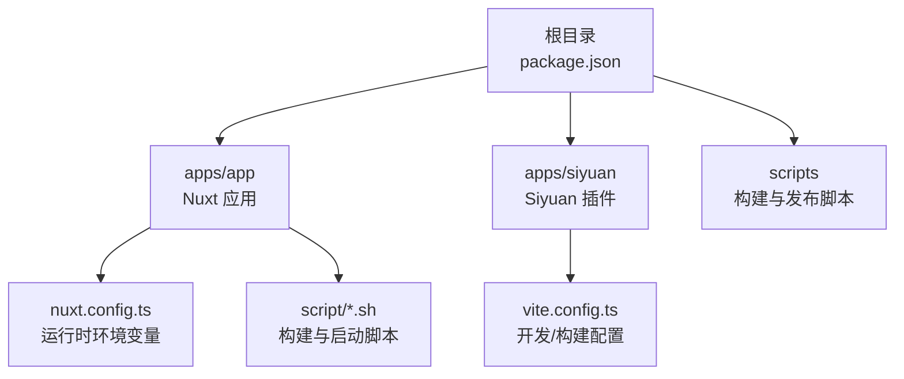
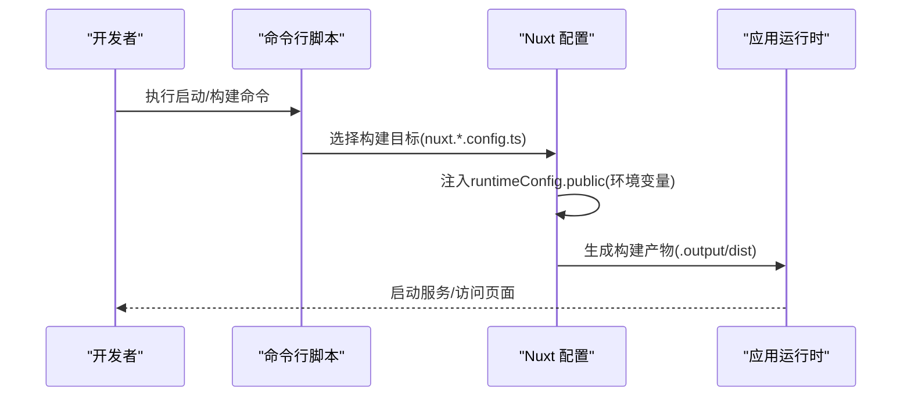
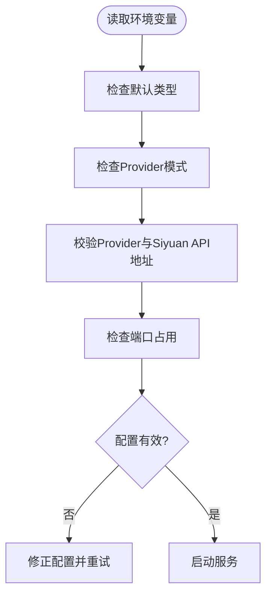
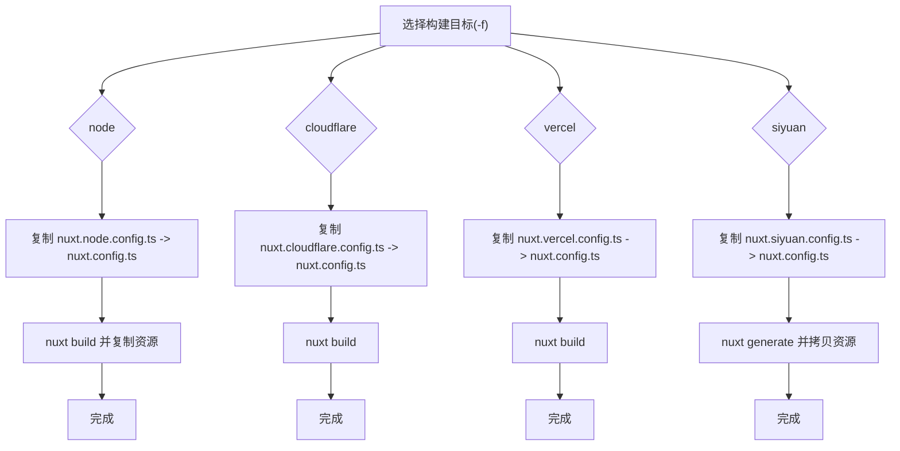
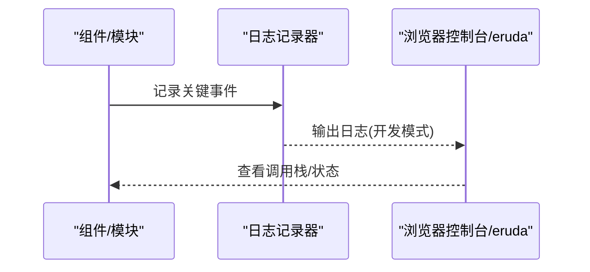
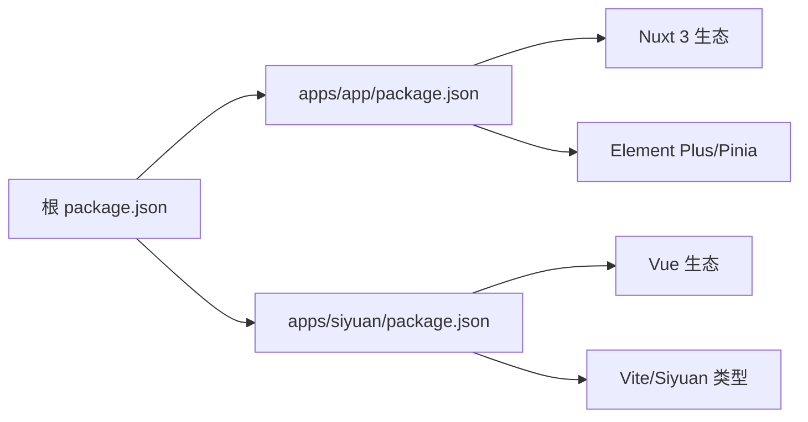

# 故障排除

<cite>
**本文引用的文件**
- [README.md](file://README.md)
- [package.json](file://package.json)
- [plugin.json](file://plugin.json)
- [apps/app/package.json](file://apps/app/package.json)
- [apps/siyuan/package.json](file://apps/siyuan/package.json)
- [apps/app/nuxt.config.ts](file://apps/app/nuxt.config.ts)
- [apps/siyuan/vite.config.ts](file://apps/siyuan/vite.config.ts)
- [apps/app/script/build.sh](file://apps/app/script/build.sh)
- [apps/app/script/dev.sh](file://apps/app/script/dev.sh)
- [apps/app/script/node.sh](file://apps/app/script/node.sh)
- [apps/app/script/cloudflare.sh](file://apps/app/script/cloudflare.sh)
- [apps/app/script/vercel.sh](file://apps/app/script/vercel.sh)
- [apps/app/script/siyuan.sh](file://apps/app/script/siyuan.sh)
- [startup.example.sh](file://startup.example.sh)
- [apps/app/utils/appLogger.ts](file://apps/app/utils/appLogger.ts)
</cite>

## 目录
1. [简介](#简介)
2. [项目结构](#项目结构)
3. [核心组件](#核心组件)
4. [架构总览](#架构总览)
5. [详细组件分析](#详细组件分析)
6. [依赖关系分析](#依赖关系分析)
7. [性能考虑](#性能考虑)
8. [故障排除指南](#故障排除指南)
9. [结论](#结论)
10. [附录](#附录)

## 简介
本指南面向使用者与开发者，系统化梳理该 Siyuan 笔记插件在启动失败、构建错误、运行时异常、日志分析、性能诊断、兼容性问题、网络与权限配置以及问题反馈流程等方面的排错方法。文档基于仓库中的实际配置与脚本进行归纳，帮助快速定位与解决问题。

## 项目结构
该项目采用多包工作区（workspace）组织方式，包含 Web 应用（Nuxt 3）、Siyuan 插件前端与构建脚本。关键目录与职责如下：
- apps/app：Web 应用（Nuxt 3），负责 SSR/SPA/静态导出等多平台构建与运行
- apps/siyuan：Siyuan 插件前端（Vue + Vite），负责桌面端/浏览器端插件功能
- scripts：通用打包与版本管理脚本
- 各个 package.json 与 nuxt.config.ts/vite.config.ts：定义构建与运行配置

图表来源
- [package.json:1-27](file://package.json#L1-L27)
- [apps/app/nuxt.config.ts:114-121](file://apps/app/nuxt.config.ts#L114-L121)
- [apps/siyuan/vite.config.ts:15-136](file://apps/siyuan/vite.config.ts#L15-L136)

章节来源
- [README.md:1-32](file://README.md#L1-L32)
- [package.json:1-27](file://package.json#L1-L27)

## 核心组件
- 运行时环境变量
  - Web 应用通过 Nuxt 的 runtimeConfig.public 注入默认类型、Siyuan API 地址、Provider 模式与 Provider URL 等关键参数
  - 默认值可被环境变量覆盖，若未正确配置可能导致启动或请求失败
- 构建与启动脚本
  - 提供 Node、Cloudflare、Vercel、Siyuan 四种构建目标，分别对应不同的 nuxt.config.ts
  - 开发模式与生产构建脚本分离，便于定位问题来源
- 日志系统
  - 统一使用轻量日志记录器，结合开发/生产模式开关，便于在不同环境下输出调试信息

章节来源
- [apps/app/nuxt.config.ts:114-121](file://apps/app/nuxt.config.ts#L114-L121)
- [apps/app/script/build.sh:46-63](file://apps/app/script/build.sh#L46-L63)
- [apps/app/script/dev.sh:12-15](file://apps/app/script/dev.sh#L12-L15)
- [apps/app/utils/appLogger.ts:20-22](file://apps/app/utils/appLogger.ts#L20-L22)

## 架构总览
下图展示从启动到运行的关键路径，涵盖环境变量注入、构建目标切换与运行时加载。

图表来源
- [apps/app/script/node.sh:14-18](file://apps/app/script/node.sh#L14-L18)
- [apps/app/script/cloudflare.sh:14-15](file://apps/app/script/cloudflare.sh#L14-L15)
- [apps/app/script/vercel.sh:14-15](file://apps/app/script/vercel.sh#L14-L15)
- [apps/app/script/siyuan.sh:14-16](file://apps/app/script/siyuan.sh#L14-L16)
- [apps/app/nuxt.config.ts:114-121](file://apps/app/nuxt.config.ts#L114-L121)

## 详细组件分析

### 环境变量与运行时配置
- 关键变量
  - NUXT_PUBLIC_DEFAULT_TYPE：默认类型（如 node）
  - NUXT_PUBLIC_PROVIDER_MODE：Provider 模式开关
  - NUXT_PUBLIC_PROVIDER_URL：Provider 服务地址
  - NUXT_PUBLIC_SIYUAN_API_URL：本地/远程 Siyuan API 地址
  - PORT：服务端口（示例脚本中使用）
- 常见问题
  - Provider 地址不正确导致文章/资源无法加载
  - API 地址不可达导致数据拉取失败
  - 端口冲突导致启动失败

图表来源
- [apps/app/nuxt.config.ts:114-121](file://apps/app/nuxt.config.ts#L114-L121)
- [startup.example.sh:3-7](file://startup.example.sh#L3-L7)

章节来源
- [apps/app/nuxt.config.ts:114-121](file://apps/app/nuxt.config.ts#L114-L121)
- [startup.example.sh:3-7](file://startup.example.sh#L3-L7)

### 构建与启动脚本
- Node 构建
  - 切换到 Node 配置，执行构建并复制资源至 dist/node
  - 内存限制通过 NODE_OPTIONS 调整，避免大项目打包失败
- Cloudflare/Vercel 构建
  - 切换到对应配置并执行构建，适用于无服务器部署
- Siyuan 构建
  - 使用 generate 导出静态站点，拷贝资源至 dist/siyuan/app
- 开发模式
  - dev.sh 会复制 Node 配置并启动开发服务器，支持 --host

图表来源
- [apps/app/script/build.sh:46-63](file://apps/app/script/build.sh#L46-L63)
- [apps/app/script/node.sh:14-29](file://apps/app/script/node.sh#L14-L29)
- [apps/app/script/cloudflare.sh:14-15](file://apps/app/script/cloudflare.sh#L14-L15)
- [apps/app/script/vercel.sh:14-15](file://apps/app/script/vercel.sh#L14-L15)
- [apps/app/script/siyuan.sh:14-23](file://apps/app/script/siyuan.sh#L14-L23)

章节来源
- [apps/app/script/build.sh:46-63](file://apps/app/script/build.sh#L46-L63)
- [apps/app/script/dev.sh:12-15](file://apps/app/script/dev.sh#L12-L15)
- [apps/app/script/node.sh:14-29](file://apps/app/script/node.sh#L14-L29)
- [apps/app/script/cloudflare.sh:14-15](file://apps/app/script/cloudflare.sh#L14-L15)
- [apps/app/script/vercel.sh:14-15](file://apps/app/script/vercel.sh#L14-L15)
- [apps/app/script/siyuan.sh:14-23](file://apps/app/script/siyuan.sh#L14-L23)

### 日志与调试
- 日志记录器
  - 使用统一的轻量日志接口，按开发/生产模式输出
  - 建议在关键流程（初始化、API 请求、渲染）添加日志点
- 开发工具
  - Nuxt 在开发模式下自动注入 eruda 调试脚本，便于移动端调试
  - 可通过 --host 启动允许外部访问的开发服务器

图表来源
- [apps/app/utils/appLogger.ts:20-22](file://apps/app/utils/appLogger.ts#L20-L22)
- [apps/app/nuxt.config.ts:60-86](file://apps/app/nuxt.config.ts#L60-L86)

章节来源
- [apps/app/utils/appLogger.ts:20-22](file://apps/app/utils/appLogger.ts#L20-L22)
- [apps/app/nuxt.config.ts:60-86](file://apps/app/nuxt.config.ts#L60-L86)

## 依赖关系分析
- 包管理与工作区
  - 根 package.json 定义了跨包脚本与工作区入口
  - apps/app 与 apps/siyuan 各自维护独立的依赖与构建配置
- 关键依赖
  - Nuxt 3、Element Plus、Pinia、Vue 生态用于 Web 应用
  - Vite、VueUse、siyuan 类型与 API 适配用于插件端

图表来源
- [package.json:1-27](file://package.json#L1-L27)
- [apps/app/package.json:12-40](file://apps/app/package.json#L12-L40)
- [apps/siyuan/package.json:14-42](file://apps/siyuan/package.json#L14-L42)

章节来源
- [package.json:1-27](file://package.json#L1-L27)
- [apps/app/package.json:12-40](file://apps/app/package.json#L12-L40)
- [apps/siyuan/package.json:14-42](file://apps/siyuan/package.json#L14-L42)

## 性能考虑
- 构建内存
  - Node 构建脚本通过 NODE_OPTIONS 调整最大堆内存，避免打包过程 OOM
- 构建产物
  - 开发模式保留可读源码映射，生产模式关闭压缩以便更快定位问题
- 运行时资源
  - 动态版本号与延迟加载脚本（如 KaTeX、ECharts）有助于首屏性能
- 建议
  - 大型依赖（如 KaTeX/ECharts）按需加载，减少初始体积
  - 对频繁变更的静态资源启用缓存策略（由部署平台决定）

章节来源
- [apps/app/script/node.sh:15-18](file://apps/app/script/node.sh#L15-L18)
- [apps/siyuan/vite.config.ts:80-88](file://apps/siyuan/vite.config.ts#L80-L88)
- [apps/app/nuxt.config.ts:46-86](file://apps/app/nuxt.config.ts#L46-L86)

## 故障排除指南

### 启动失败
- 症状
  - 无法访问页面或端口被占用
- 排查步骤
  - 检查端口占用与防火墙设置
  - 确认 NUXT_PUBLIC_PROVIDER_URL 与 NUXT_PUBLIC_SIYUAN_API_URL 是否可达
  - 若使用自定义前缀（如 /blog），确保部署层正确转发
- 快速验证
  - 使用示例启动脚本进行最小化复现
  - 在开发模式下开启 --host 并从其他设备访问

章节来源
- [startup.example.sh:3-7](file://startup.example.sh#L3-L7)
- [apps/app/nuxt.config.ts:114-121](file://apps/app/nuxt.config.ts#L114-L121)

### 构建错误
- Node 构建失败（OOM）
  - 现象：打包阶段内存不足
  - 处理：调整 NODE_OPTIONS 最大堆大小；分步清理缓存后重试
- 依赖缺失或版本冲突
  - 现象：安装/构建时报错
  - 处理：确认 pnpm 工作区一致性；更新锁文件后重试
- 平台特定构建失败
  - 现象：Cloudflare/Vercel 构建报错
  - 处理：确认已复制对应 nuxt.*.config.ts；检查部署平台对 Node 版本与特性支持

章节来源
- [apps/app/script/node.sh:15-18](file://apps/app/script/node.sh#L15-L18)
- [apps/app/script/cloudflare.sh:14-15](file://apps/app/script/cloudflare.sh#L14-L15)
- [apps/app/script/vercel.sh:14-15](file://apps/app/script/vercel.sh#L14-L15)
- [apps/app/script/build.sh:46-63](file://apps/app/script/build.sh#L46-L63)

### 运行时异常
- Provider 模式异常
  - 现象：文章/资源加载失败
  - 处理：核对 NUXT_PUBLIC_PROVIDER_MODE 与 NUXT_PUBLIC_PROVIDER_URL；确认 Provider 服务可用
- API 请求失败
  - 现象：数据拉取超时或 4xx/5xx
  - 处理：检查 NUXT_PUBLIC_SIYUAN_API_URL；确认网络连通与鉴权配置
- 主题/资源加载失败
  - 现象：样式缺失或字体/图标不显示
  - 处理：确认静态资源路径与版本号；检查 CDN 或本地资源部署

章节来源
- [apps/app/nuxt.config.ts:114-121](file://apps/app/nuxt.config.ts#L114-L121)

### 日志分析与定位
- 日志位置
  - 浏览器控制台与 eruda（开发模式）
  - 服务器端日志（根据部署平台输出）
- 关键信息
  - 环境变量注入情况
  - 请求 URL 与响应状态
  - 资源加载路径与版本号
- 实操建议
  - 在初始化、路由切换、API 请求前后添加日志点
  - 使用浏览器 Network 面板观察请求耗时与错误码

章节来源
- [apps/app/utils/appLogger.ts:20-22](file://apps/app/utils/appLogger.ts#L20-L22)
- [apps/app/nuxt.config.ts:60-86](file://apps/app/nuxt.config.ts#L60-L86)

### 性能问题诊断与优化
- 诊断
  - 使用浏览器 Performance 面板查看首屏渲染瓶颈
  - 分析资源加载时间，识别慢资源与阻塞脚本
- 优化
  - 延迟加载非关键资源（如 KaTeX、ECharts）
  - 减少打包体积，拆分第三方依赖
  - 启用缓存与 CDN，合理设置静态资源版本号

章节来源
- [apps/app/nuxt.config.ts:46-86](file://apps/app/nuxt.config.ts#L46-L86)

### 兼容性问题
- 平台差异
  - Node/Cloudflare/Vercel/Siyuan 构建目标存在差异，需按目标选择对应配置
- 浏览器与设备
  - 开发模式注入 eruda，便于移动端调试
  - 注意不同部署平台对动态导入与运行时 API 的支持差异

章节来源
- [apps/app/script/build.sh:46-63](file://apps/app/script/build.sh#L46-L63)
- [apps/app/nuxt.config.ts:60-86](file://apps/app/nuxt.config.ts#L60-L86)

### 网络连接与权限配置
- 网络
  - 确保 Provider 与 Siyuan API 可从运行环境中访问
  - 如使用反向代理或自定义前缀，需同步配置转发规则
- 权限
  - Provider 与 API 的鉴权策略需与前端配置一致
  - 部署平台的 CORS 与安全策略需允许前端访问

章节来源
- [apps/app/nuxt.config.ts:114-121](file://apps/app/nuxt.config.ts#L114-L121)

### 配置文件错误
- 常见问题
  - 缺失或错误的 nuxt.*.config.ts
  - 环境变量拼写错误或未导出
- 处理
  - 使用 build.sh 的 -f 参数选择正确目标
  - 严格比对示例启动脚本与实际部署环境

章节来源
- [apps/app/script/build.sh:46-63](file://apps/app/script/build.sh#L46-L63)
- [startup.example.sh:3-7](file://startup.example.sh#L3-L7)

### 社区支持与问题反馈
- 项目信息
  - 作者与仓库地址、最低 App 版本要求、前后端平台支持范围
- 建议流程
  - 提交 Issue 前先复现并收集日志与环境信息
  - 附带最小可复现步骤与期望/实际行为对比

章节来源
- [plugin.json:1-43](file://plugin.json#L1-L43)

## 结论
通过明确环境变量、构建目标与运行时配置，结合统一日志与调试工具，可以高效定位并解决启动、构建与运行期问题。建议在团队内建立标准化的复现流程与问题分级机制，持续优化构建与部署流程，提升稳定性与可维护性。

## 附录

### 常用命令与脚本
- 开发模式
  - 使用 dev.sh 切换 Node 配置并启动开发服务器
- 构建
  - 使用 build.sh 的 -f 参数选择目标（node/cloudflare/vercel/siyuan）
- 启动
  - 使用示例启动脚本设置环境变量并启动服务

章节来源
- [apps/app/script/dev.sh:12-15](file://apps/app/script/dev.sh#L12-L15)
- [apps/app/script/build.sh:46-63](file://apps/app/script/build.sh#L46-L63)
- [startup.example.sh:3-7](file://startup.example.sh#L3-L7)