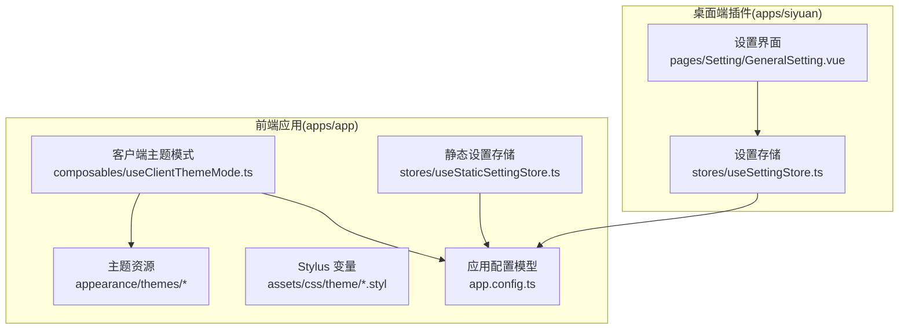
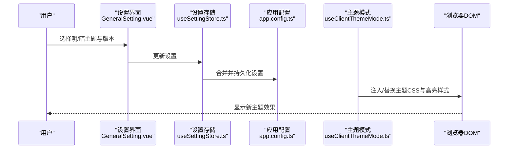
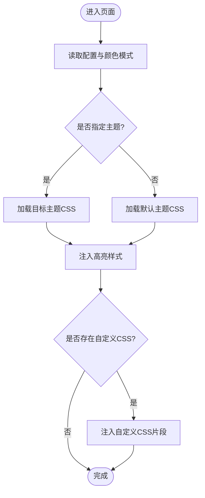
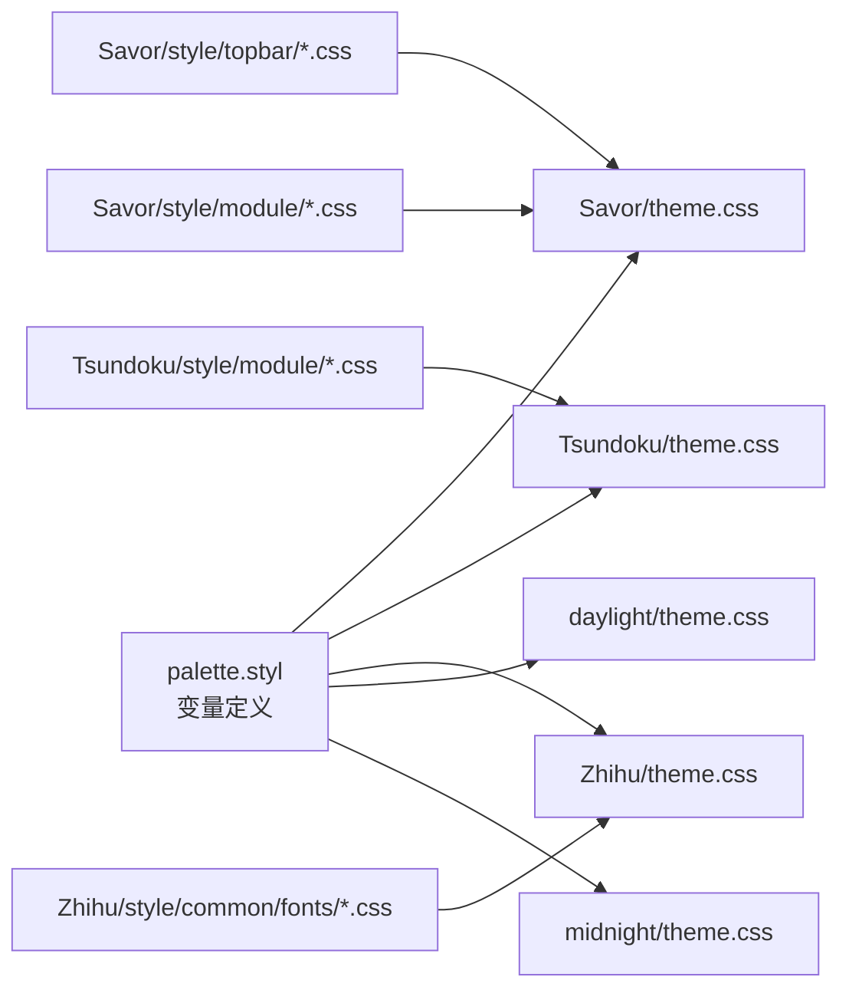
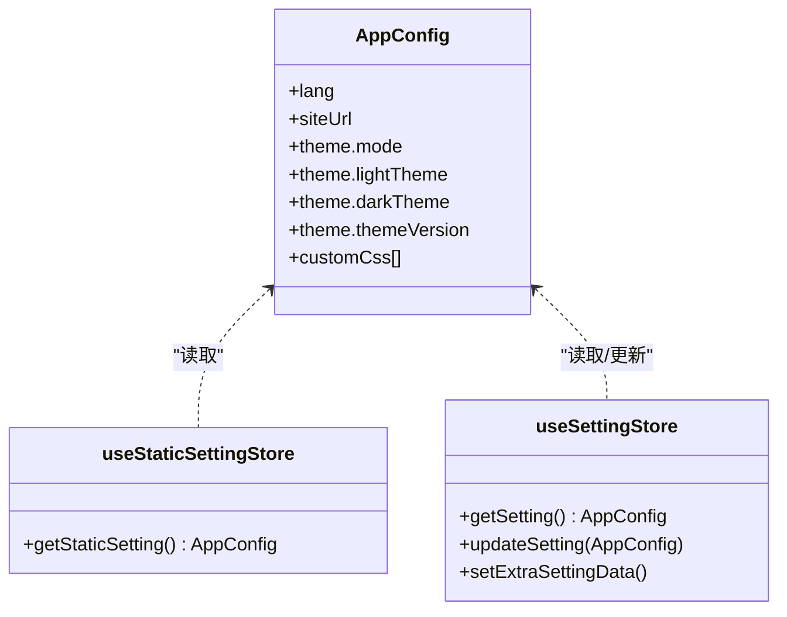
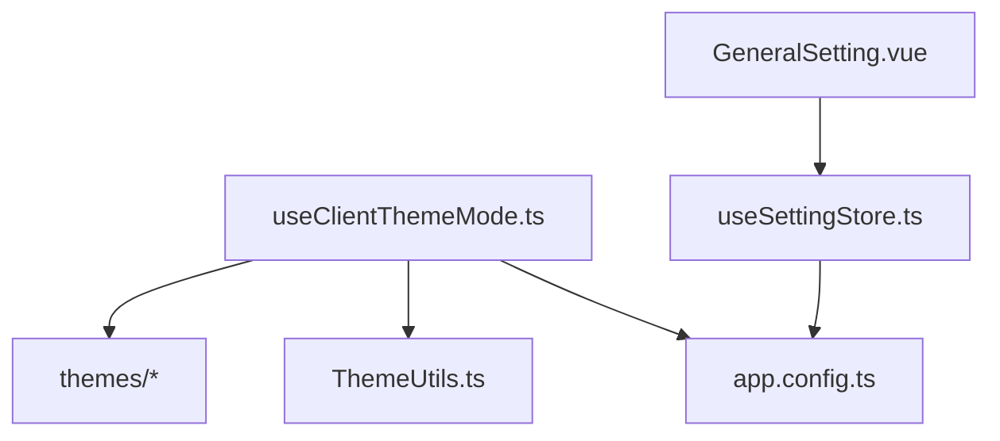
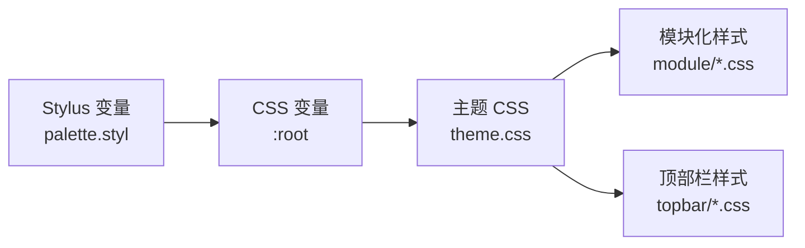

# 主题架构

<cite>
**本文引用的文件**
- [apps/app/assets/css/theme/index.styl](file://apps/app/assets/css/theme/index.styl)
- [apps/app/assets/css/theme/palette.styl](file://apps/app/assets/css/theme/palette.styl)
- [apps/app/utils/ThemeUtils.ts](file://apps/app/utils/ThemeUtils.ts)
- [apps/app/composables/useClientThemeMode.ts](file://apps/app/composables/useClientThemeMode.ts)
- [apps/app/app.config.ts](file://apps/app/app.config.ts)
- [apps/app/stores/useStaticSettingStore.ts](file://apps/app/stores/useStaticSettingStore.ts)
- [apps/app/public/resources/appearance/themes/Savor/theme.css](file://apps/app/public/resources/appearance/themes/Savor/theme.css)
- [apps/app/public/resources/appearance/themes/Tsundoku/theme.css](file://apps/app/public/resources/appearance/themes/Tsundoku/theme.css)
- [apps/app/public/resources/appearance/themes/Zhihu/theme.css](file://apps/app/public/resources/appearance/themes/Zhihu/theme.css)
- [apps/app/public/resources/appearance/themes/daylight/theme.css](file://apps/app/public/resources/appearance/themes/daylight/theme.css)
- [apps/app/public/resources/appearance/themes/midnight/theme.css](file://apps/app/public/resources/appearance/themes/midnight/theme.css)
- [apps/app/public/resources/appearance/themes/Savor/style/topbar/Splugin.css](file://apps/app/public/resources/appearance/themes/Savor/style/topbar/Splugin.css)
- [apps/app/public/resources/appearance/themes/Savor/style/topbar/savor-light.css](file://apps/app/public/resources/appearance/themes/Savor/style/topbar/savor-light.css)
- [apps/app/public/resources/appearance/themes/Savor/style/topbar/savor-dark.css](file://apps/app/public/resources/appearance/themes/Savor/style/topbar/savor-dark.css)
- [apps/siyuan/src/pages/Setting/GeneralSetting.vue](file://apps/siyuan/src/pages/Setting/GeneralSetting.vue)
- [apps/siyuan/src/stores/useSettingStore.ts](file://apps/siyuan/src/stores/useSettingStore.ts)
</cite>

## 目录
1. [简介](#简介)
2. [项目结构](#项目结构)
3. [核心组件](#核心组件)
4. [架构总览](#架构总览)
5. [详细组件分析](#详细组件分析)
6. [依赖分析](#依赖分析)
7. [性能考量](#性能考量)
8. [故障排查指南](#故障排查指南)
9. [结论](#结论)
10. [附录](#附录)

## 简介
本文件系统化阐述 Siyuan Plugin Blog 的主题架构与实现机制，重点覆盖以下方面：
- 主题切换原理：CSS 变量驱动、样式覆盖与动态主题加载
- 主题资源组织：主题目录结构、模块化样式与导入策略
- 主题配置存储与个性化：默认配置、用户设置持久化与自定义 CSS
- 兼容性与性能：多主题版本管理、按需加载与响应式设计
- 架构图与样式继承关系图：帮助开发者快速理解内部机制

## 项目结构
主题系统由“前端应用（Nuxt）+ 桌面端插件（SiYuan）”两部分组成，二者共享一套主题资源与配置模型。

- 前端应用（apps/app）
  - 主题资源集中于 appearance/themes 下，按主题名划分，每个主题包含若干模块化 CSS 与顶层 theme.css
  - 主题变量与调色板通过 Stylus 文件统一管理
  - 客户端主题模式在 composables 中统一处理，动态注入与切换样式表
  - 配置模型在 app.config.ts 中定义，支持主题模式、明暗主题与版本号等字段

- 桌面端插件（apps/siyuan）
  - 设置界面提供主题选择与保存能力
  - 设置存储通过 Pinia Store 与远程 API 协同，支持自定义 CSS 片段注入

图表来源
- [apps/app/composables/useClientThemeMode.ts:23-97](file://apps/app/composables/useClientThemeMode.ts#L23-L97)
- [apps/app/app.config.ts:28-91](file://apps/app/app.config.ts#L28-L91)
- [apps/app/stores/useStaticSettingStore.ts:10-26](file://apps/app/stores/useStaticSettingStore.ts#L10-L26)
- [apps/siyuan/src/pages/Setting/GeneralSetting.vue:25-92](file://apps/siyuan/src/pages/Setting/GeneralSetting.vue#L25-L92)
- [apps/siyuan/src/stores/useSettingStore.ts:35-79](file://apps/siyuan/src/stores/useSettingStore.ts#L35-L79)

章节来源
- [apps/app/composables/useClientThemeMode.ts:23-157](file://apps/app/composables/useClientThemeMode.ts#L23-L157)
- [apps/app/app.config.ts:28-91](file://apps/app/app.config.ts#L28-L91)
- [apps/app/stores/useStaticSettingStore.ts:10-27](file://apps/app/stores/useStaticSettingStore.ts#L10-L27)
- [apps/siyuan/src/pages/Setting/GeneralSetting.vue:25-118](file://apps/siyuan/src/pages/Setting/GeneralSetting.vue#L25-L118)
- [apps/siyuan/src/stores/useSettingStore.ts:35-79](file://apps/siyuan/src/stores/useSettingStore.ts#L35-L79)

## 核心组件
- 主题变量与调色板
  - Stylus 文件集中定义主题变量与布局参数，供主题 CSS 使用
  - 示例：palette.styl 定义颜色、布局与移动端断点等变量
- 客户端主题模式
  - useClientThemeMode 统一处理颜色模式、主题切换与样式注入
  - 动态生成 link/script 标签，按明/暗模式与主题版本号加载对应 CSS
- 主题资源组织
  - 每个主题以 theme.css 为入口，通过 @import 组织模块化样式
  - 顶层 CSS 变量统一声明，覆盖编辑器与 UI 组件的视觉风格
- 配置模型与存储
  - app.config.ts 定义主题相关字段（mode/lightTheme/darkTheme/themeVersion）
  - useStaticSettingStore 与 useSettingStore 分别负责静态配置与用户设置的读取与更新

章节来源
- [apps/app/assets/css/theme/palette.styl:1-52](file://apps/app/assets/css/theme/palette.styl#L1-L52)
- [apps/app/composables/useClientThemeMode.ts:23-157](file://apps/app/composables/useClientThemeMode.ts#L23-L157)
- [apps/app/app.config.ts:28-91](file://apps/app/app.config.ts#L28-L91)
- [apps/app/stores/useStaticSettingStore.ts:10-27](file://apps/app/stores/useStaticSettingStore.ts#L10-L27)
- [apps/siyuan/src/stores/useSettingStore.ts:35-79](file://apps/siyuan/src/stores/useSettingStore.ts#L35-L79)

## 架构总览
主题系统采用“配置驱动 + 动态样式注入”的架构：
- 配置层：默认配置 + 用户设置（含明/暗主题与版本号）
- 渲染层：根据配置与设备颜色模式，动态注入主题 CSS 与代码高亮样式
- 资源层：主题 CSS 通过 @import 组织模块化样式，支持按需覆盖与扩展

图表来源
- [apps/siyuan/src/pages/Setting/GeneralSetting.vue:95-118](file://apps/siyuan/src/pages/Setting/GeneralSetting.vue#L95-L118)
- [apps/siyuan/src/stores/useSettingStore.ts:50-76](file://apps/siyuan/src/stores/useSettingStore.ts#L50-L76)
- [apps/app/app.config.ts:74-91](file://apps/app/app.config.ts#L74-L91)
- [apps/app/composables/useClientThemeMode.ts:57-97](file://apps/app/composables/useClientThemeMode.ts#L57-L97)

章节来源
- [apps/siyuan/src/pages/Setting/GeneralSetting.vue:95-118](file://apps/siyuan/src/pages/Setting/GeneralSetting.vue#L95-L118)
- [apps/siyuan/src/stores/useSettingStore.ts:50-76](file://apps/siyuan/src/stores/useSettingStore.ts#L50-L76)
- [apps/app/composables/useClientThemeMode.ts:57-157](file://apps/app/composables/useClientThemeMode.ts#L57-L157)

## 详细组件分析

### 主题切换与动态加载机制
- 颜色模式与主题映射
  - 通过 useClientThemeMode 读取路由参数与全局配置，决定当前明/暗主题
  - 根据颜色模式选择默认主题（daylight/midnight），再按配置加载目标主题
- 动态样式注入
  - 使用 useHead 注入 link 标签指向主题 CSS 与代码高亮样式
  - 支持运行时替换 href 实现主题热切换
- 自定义 CSS
  - 从远程接口获取自定义 CSS 片段，注入到 head 中，实现最终覆盖

图表来源
- [apps/app/composables/useClientThemeMode.ts:57-157](file://apps/app/composables/useClientThemeMode.ts#L57-L157)

章节来源
- [apps/app/composables/useClientThemeMode.ts:23-157](file://apps/app/composables/useClientThemeMode.ts#L23-L157)

### 主题资源组织与样式编译
- 主题入口与模块化
  - 每个主题以 theme.css 作为入口，内部通过 @import 组织模块样式
  - 示例：Savor/Tsundoku/Zhihu 等主题均采用该模式
- CSS 变量与覆盖
  - 主题在 :root 中声明大量 CSS 变量，覆盖编辑器与 UI 组件的颜色、阴影、滚动条等
  - 通过变量组合实现不同配色方案与交互效果
- Stylus 变量
  - palette.styl 定义布局与颜色变量，供主题 CSS 使用
  - index.styl 可引入 palette 并扩展通用样式（如模糊滤镜）

图表来源
- [apps/app/assets/css/theme/palette.styl:1-52](file://apps/app/assets/css/theme/palette.styl#L1-L52)
- [apps/app/public/resources/appearance/themes/Savor/theme.css:1-791](file://apps/app/public/resources/appearance/themes/Savor/theme.css#L1-L791)
- [apps/app/public/resources/appearance/themes/Tsundoku/theme.css:1-1159](file://apps/app/public/resources/appearance/themes/Tsundoku/theme.css#L1-L1159)
- [apps/app/public/resources/appearance/themes/Zhihu/theme.css:1-319](file://apps/app/public/resources/appearance/themes/Zhihu/theme.css#L1-L319)
- [apps/app/public/resources/appearance/themes/daylight/theme.css:1-224](file://apps/app/public/resources/appearance/themes/daylight/theme.css#L1-L224)
- [apps/app/public/resources/appearance/themes/midnight/theme.css:1-224](file://apps/app/public/resources/appearance/themes/midnight/theme.css#L1-L224)
- [apps/app/assets/css/theme/index.styl:1-4](file://apps/app/assets/css/theme/index.styl#L1-L4)

章节来源
- [apps/app/assets/css/theme/palette.styl:1-52](file://apps/app/assets/css/theme/palette.styl#L1-L52)
- [apps/app/assets/css/theme/index.styl:1-4](file://apps/app/assets/css/theme/index.styl#L1-L4)
- [apps/app/public/resources/appearance/themes/Savor/theme.css:1-791](file://apps/app/public/resources/appearance/themes/Savor/theme.css#L1-L791)
- [apps/app/public/resources/appearance/themes/Tsundoku/theme.css:1-1159](file://apps/app/public/resources/appearance/themes/Tsundoku/theme.css#L1-L1159)
- [apps/app/public/resources/appearance/themes/Zhihu/theme.css:1-319](file://apps/app/public/resources/appearance/themes/Zhihu/theme.css#L1-L319)
- [apps/app/public/resources/appearance/themes/daylight/theme.css:1-224](file://apps/app/public/resources/appearance/themes/daylight/theme.css#L1-L224)
- [apps/app/public/resources/appearance/themes/midnight/theme.css:1-224](file://apps/app/public/resources/appearance/themes/midnight/theme.css#L1-L224)

### 主题配置存储与个性化定制
- 默认配置
  - app.config.ts 定义默认主题模式、明/暗主题与版本号
- 用户设置
  - 桌面端设置界面提供主题选择，保存至设置存储
  - useSettingStore 支持从远程接口获取自定义 CSS 片段并合并到设置中
- 静态配置
  - useStaticSettingStore 从静态配置文件加载初始设置，便于 SSR/静态构建场景

图表来源
- [apps/app/app.config.ts:28-91](file://apps/app/app.config.ts#L28-L91)
- [apps/app/stores/useStaticSettingStore.ts:10-27](file://apps/app/stores/useStaticSettingStore.ts#L10-L27)
- [apps/siyuan/src/stores/useSettingStore.ts:35-79](file://apps/siyuan/src/stores/useSettingStore.ts#L35-L79)

章节来源
- [apps/app/app.config.ts:28-91](file://apps/app/app.config.ts#L28-L91)
- [apps/app/stores/useStaticSettingStore.ts:10-27](file://apps/app/stores/useStaticSettingStore.ts#L10-L27)
- [apps/siyuan/src/pages/Setting/GeneralSetting.vue:95-118](file://apps/siyuan/src/pages/Setting/GeneralSetting.vue#L95-L118)
- [apps/siyuan/src/stores/useSettingStore.ts:35-79](file://apps/siyuan/src/stores/useSettingStore.ts#L35-L79)

### 主题兼容性与响应式设计
- 多主题版本管理
  - 不同主题维护独立版本号，useClientThemeMode 通过 themeVersion 参数控制缓存与加载
- 明/暗主题适配
  - 默认主题（daylight/midnight）与目标主题（如 Zhihu/Savor/Tsundoku）分别提供明/暗配色
  - 通过 data-theme-mode 与 data-light-theme/data-dark-theme 属性标注当前模式与主题
- 响应式与字体
  - 主题 CSS 中包含媒体查询与字体族配置，确保在不同语言与设备下一致显示

章节来源
- [apps/app/composables/useClientThemeMode.ts:57-97](file://apps/app/composables/useClientThemeMode.ts#L57-L97)
- [apps/app/public/resources/appearance/themes/Zhihu/theme.css:302-319](file://apps/app/public/resources/appearance/themes/Zhihu/theme.css#L302-L319)
- [apps/app/public/resources/appearance/themes/daylight/theme.css:204-224](file://apps/app/public/resources/appearance/themes/daylight/theme.css#L204-L224)
- [apps/app/public/resources/appearance/themes/midnight/theme.css:204-224](file://apps/app/public/resources/appearance/themes/midnight/theme.css#L204-L224)

## 依赖分析
- 组件耦合
  - useClientThemeMode 依赖 app.config 与 useAppBase，负责样式注入与主题切换
  - 设置界面与设置存储相互协作，保证用户选择持久化
- 外部依赖
  - highlight.js 样式随主题模式动态切换
  - 自定义 CSS 片段通过远程接口获取，增强个性化能力

图表来源
- [apps/app/composables/useClientThemeMode.ts:23-157](file://apps/app/composables/useClientThemeMode.ts#L23-L157)
- [apps/app/app.config.ts:28-91](file://apps/app/app.config.ts#L28-L91)
- [apps/app/utils/ThemeUtils.ts:18-38](file://apps/app/utils/ThemeUtils.ts#L18-L38)
- [apps/siyuan/src/pages/Setting/GeneralSetting.vue:95-118](file://apps/siyuan/src/pages/Setting/GeneralSetting.vue#L95-L118)
- [apps/siyuan/src/stores/useSettingStore.ts:35-79](file://apps/siyuan/src/stores/useSettingStore.ts#L35-L79)

章节来源
- [apps/app/composables/useClientThemeMode.ts:23-157](file://apps/app/composables/useClientThemeMode.ts#L23-L157)
- [apps/app/utils/ThemeUtils.ts:18-38](file://apps/app/utils/ThemeUtils.ts#L18-L38)
- [apps/siyuan/src/pages/Setting/GeneralSetting.vue:95-118](file://apps/siyuan/src/pages/Setting/GeneralSetting.vue#L95-L118)
- [apps/siyuan/src/stores/useSettingStore.ts:35-79](file://apps/siyuan/src/stores/useSettingStore.ts#L35-L79)

## 性能考量
- 按需加载与缓存
  - 通过版本号参数控制主题 CSS 缓存失效，避免重复下载
- DOM 操作最小化
  - 仅在颜色模式或主题切换时替换 link 的 href，减少重排与重绘
- 自定义 CSS 精准注入
  - 仅注入必要的自定义片段，避免全局样式冲突与体积膨胀

## 故障排查指南
- 主题未生效
  - 检查 data-theme-mode 与 data-light-theme/data-dark-theme 是否正确设置
  - 确认主题 CSS 链接已注入且版本号参数有效
- 明/暗主题不匹配
  - 核对 useClientThemeMode 的颜色模式计算与默认主题映射
  - 确认目标主题与默认主题的明/暗版本均存在
- 自定义 CSS 未覆盖
  - 检查 useSettingStore 是否成功获取并合并自定义 CSS 片段
  - 确认注入顺序与优先级满足预期

章节来源
- [apps/app/composables/useClientThemeMode.ts:103-157](file://apps/app/composables/useClientThemeMode.ts#L103-L157)
- [apps/siyuan/src/stores/useSettingStore.ts:64-76](file://apps/siyuan/src/stores/useSettingStore.ts#L64-L76)

## 结论
Siyuan Plugin Blog 的主题系统以“配置驱动 + 动态样式注入”为核心，结合 Stylus 变量与主题 CSS 的模块化组织，实现了灵活的主题切换、版本管理与个性化定制。通过统一的设置入口与存储机制，开发者与用户可便捷地进行主题选择与微调，同时兼顾性能与兼容性。

## 附录
- 主题变量与样式继承关系（简化示意）
  - Stylus 变量 → 主题 CSS 变量 → 组件样式
  - 顶层 theme.css 覆盖编辑器与 UI 组件，模块化 CSS 负责局部样式

图表来源
- [apps/app/assets/css/theme/palette.styl:1-52](file://apps/app/assets/css/theme/palette.styl#L1-L52)
- [apps/app/public/resources/appearance/themes/Savor/theme.css:1-791](file://apps/app/public/resources/appearance/themes/Savor/theme.css#L1-L791)
- [apps/app/public/resources/appearance/themes/Savor/style/topbar/Splugin.css:1-25](file://apps/app/public/resources/appearance/themes/Savor/style/topbar/Splugin.css#L1-L25)
- [apps/app/public/resources/appearance/themes/Savor/style/topbar/savor-light.css:1-322](file://apps/app/public/resources/appearance/themes/Savor/style/topbar/savor-light.css#L1-L322)
- [apps/app/public/resources/appearance/themes/Savor/style/topbar/savor-dark.css:1-305](file://apps/app/public/resources/appearance/themes/Savor/style/topbar/savor-dark.css#L1-L305)