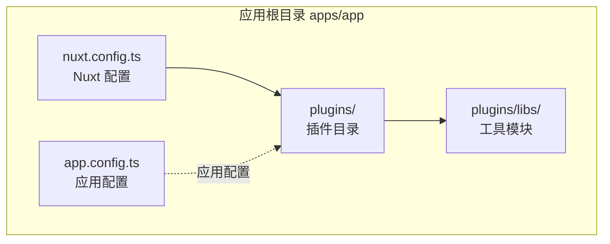
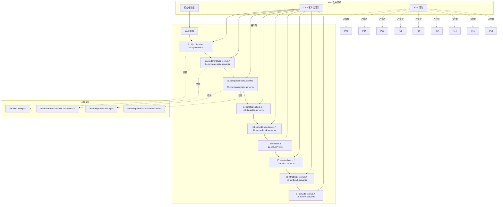
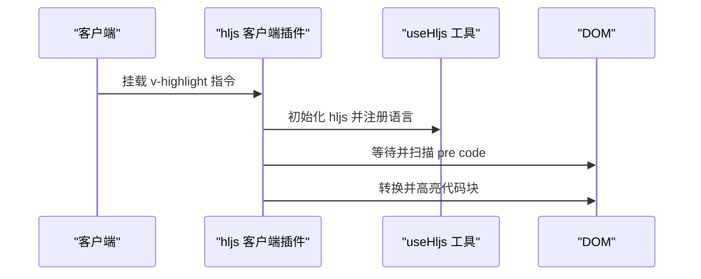
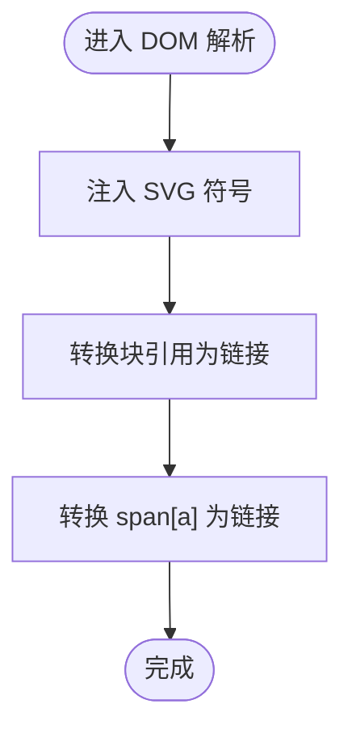
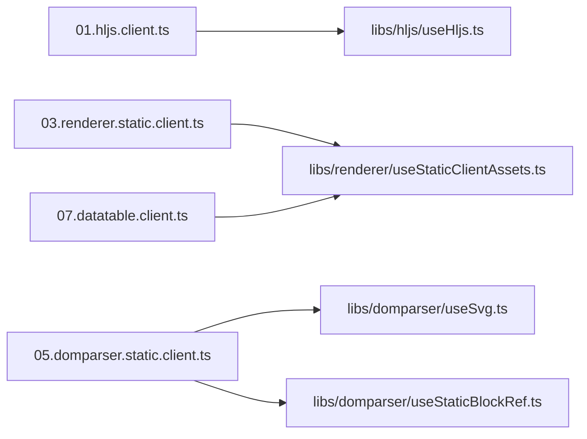

# 插件系统架构

<cite>
**本文引用的文件**
- [apps/app/plugins/00.i18n.ts](file://apps/app/plugins/00.i18n.ts)
- [apps/app/plugins/01.hljs.client.ts](file://apps/app/plugins/01.hljs.client.ts)
- [apps/app/plugins/02.hljs.server.ts](file://apps/app/plugins/02.hljs.server.ts)
- [apps/app/plugins/03.renderer.static.client.ts](file://apps/app/plugins/03.renderer.static.client.ts)
- [apps/app/plugins/04.renderer.static.server.ts](file://apps/app/plugins/04.renderer.static.server.ts)
- [apps/app/plugins/05.domparser.static.client.ts](file://apps/app/plugins/05.domparser.static.client.ts)
- [apps/app/plugins/06.domparser.static.server.ts](file://apps/app/plugins/06.domparser.static.server.ts)
- [apps/app/plugins/07.datatable.client.ts](file://apps/app/plugins/07.datatable.client.ts)
- [apps/app/plugins/08.datatable.server.ts](file://apps/app/plugins/08.datatable.server.ts)
- [apps/app/plugins/09.embedblock.client.ts](file://apps/app/plugins/09.embedblock.client.ts)
- [apps/app/plugins/010.embedblock.server.ts](file://apps/app/plugins/010.embedblock.server.ts)
- [apps/app/plugins/011.fold.client.ts](file://apps/app/plugins/011.fold.client.ts)
- [apps/app/plugins/012.fold.server.ts](file://apps/app/plugins/012.fold.server.ts)
- [apps/app/plugins/013.memo.client.ts](file://apps/app/plugins/013.memo.client.ts)
- [apps/app/plugins/014.memo.server.ts](file://apps/app/plugins/014.memo.server.ts)
- [apps/app/plugins/015.htmlblock.client.ts](file://apps/app/plugins/015.htmlblock.client.ts)
- [apps/app/plugins/016.htmlblock.server.ts](file://apps/app/plugins/016.htmlblock.server.ts)
- [apps/app/plugins/017.echarts.client.ts](file://apps/app/plugins/017.echarts.client.ts)
- [apps/app/plugins/018.echarts.server.ts](file://apps/app/plugins/018.echarts.server.ts)
- [apps/app/plugins/libs/hljs/useHljs.ts](file://apps/app/plugins/libs/hljs/useHljs.ts)
- [apps/app/plugins/libs/renderer/useStaticClientAssets.ts](file://apps/app/plugins/libs/renderer/useStaticClientAssets.ts)
- [apps/app/plugins/libs/domparser/useSvg.ts](file://apps/app/plugins/libs/domparser/useSvg.ts)
- [apps/app/plugins/libs/domparser/useStaticBlockRef.ts](file://apps/app/plugins/libs/domparser/useStaticBlockRef.ts)
- [apps/app/nuxt.config.ts](file://apps/app/nuxt.config.ts)
- [apps/app/app.config.ts](file://apps/app/app.config.ts)
</cite>

## 目录
1. [简介](#简介)
2. [项目结构](#项目结构)
3. [核心组件](#核心组件)
4. [架构总览](#架构总览)
5. [详细组件分析](#详细组件分析)
6. [依赖关系分析](#依赖关系分析)
7. [性能考量](#性能考量)
8. [故障排查指南](#故障排查指南)
9. [结论](#结论)
10. [附录](#附录)

## 简介
本文件面向 Siyuan Plugin Blog 的插件系统，系统化阐述其基于 Nuxt.js 的插件机制与扩展架构，重点包括：
- 插件的加载顺序与命名规则
- 客户端插件与服务端插件的职责划分与使用场景
- 插件注册机制、生命周期钩子与依赖注入
- 插件开发规范、接口定义与最佳实践
- 插件架构图与扩展点说明，帮助开发者快速理解与扩展系统功能

## 项目结构
Siyuan Plugin Blog 的前端应用位于 apps/app，插件集中放置于 apps/app/plugins 目录下，采用“序号前缀 + 功能命名”的命名策略，确保加载顺序稳定可控；同时配套若干工具模块（apps/app/plugins/libs/*）以实现可复用的能力封装。

图表来源
- [apps/app/nuxt.config.ts:1-125](file://apps/app/nuxt.config.ts#L1-L125)
- [apps/app/app.config.ts:1-92](file://apps/app/app.config.ts#L1-L92)

章节来源
- [apps/app/nuxt.config.ts:1-125](file://apps/app/nuxt.config.ts#L1-L125)
- [apps/app/app.config.ts:1-92](file://apps/app/app.config.ts#L1-L92)

## 核心组件
- 插件目录与命名：以两位或三位数字开头（如 00、01、03、10、11 等），确保 Nuxt 按文件名排序加载，便于控制执行先后顺序。
- 插件类型：
  - 客户端插件：以 .client.ts 结尾，仅在浏览器端运行，负责 DOM 操作、指令挂载与交互增强。
  - 服务端插件：以 .server.ts 结尾，仅在服务端运行，通常作为占位桩（stub），避免 SSR 场景下的 getSSRProps 错误。
- 工具模块：位于 plugins/libs 下，提供可复用能力（如代码高亮、静态资源路径处理、SVG 注入、块引用链接转换等）。

章节来源
- [apps/app/plugins/00.i18n.ts:1-28](file://apps/app/plugins/00.i18n.ts#L1-L28)
- [apps/app/plugins/01.hljs.client.ts:1-80](file://apps/app/plugins/01.hljs.client.ts#L1-L80)
- [apps/app/plugins/02.hljs.server.ts:1-30](file://apps/app/plugins/02.hljs.server.ts#L1-L30)
- [apps/app/plugins/03.renderer.static.client.ts:1-58](file://apps/app/plugins/03.renderer.static.client.ts#L1-L58)
- [apps/app/plugins/04.renderer.static.server.ts:1-30](file://apps/app/plugins/04.renderer.static.server.ts#L1-L30)
- [apps/app/plugins/05.domparser.static.client.ts:1-79](file://apps/app/plugins/05.domparser.static.client.ts#L1-L79)
- [apps/app/plugins/06.domparser.static.server.ts:1-30](file://apps/app/plugins/06.domparser.static.server.ts#L1-L30)
- [apps/app/plugins/07.datatable.client.ts:1-296](file://apps/app/plugins/07.datatable.client.ts#L1-L296)
- [apps/app/plugins/08.datatable.server.ts:1-14](file://apps/app/plugins/08.datatable.server.ts#L1-L14)
- [apps/app/plugins/09.embedblock.client.ts:1-48](file://apps/app/plugins/09.embedblock.client.ts#L1-L48)
- [apps/app/plugins/010.embedblock.server.ts:1-14](file://apps/app/plugins/010.embedblock.server.ts#L1-L14)
- [apps/app/plugins/011.fold.client.ts:1-122](file://apps/app/plugins/011.fold.client.ts#L1-L122)
- [apps/app/plugins/012.fold.server.ts:1-30](file://apps/app/plugins/012.fold.server.ts#L1-L30)
- [apps/app/plugins/013.memo.client.ts:1-30](file://apps/app/plugins/013.memo.client.ts#L1-L30)
- [apps/app/plugins/014.memo.server.ts:1-30](file://apps/app/plugins/014.memo.server.ts#L1-L30)
- [apps/app/plugins/015.htmlblock.client.ts:1-30](file://apps/app/plugins/015.htmlblock.client.ts#L1-L30)
- [apps/app/plugins/016.htmlblock.server.ts:1-30](file://apps/app/plugins/016.htmlblock.server.ts#L1-L30)
- [apps/app/plugins/017.echarts.client.ts:1-30](file://apps/app/plugins/017.echarts.client.ts#L1-L30)
- [apps/app/plugins/018.echarts.server.ts:1-30](file://apps/app/plugins/018.echarts.server.ts#L1-L30)

## 架构总览
下图展示了插件系统在 Nuxt 生命周期中的加载与执行关系，以及与工具模块的协作：

图表来源
- [apps/app/plugins/00.i18n.ts:1-28](file://apps/app/plugins/00.i18n.ts#L1-L28)
- [apps/app/plugins/01.hljs.client.ts:1-80](file://apps/app/plugins/01.hljs.client.ts#L1-L80)
- [apps/app/plugins/02.hljs.server.ts:1-30](file://apps/app/plugins/02.hljs.server.ts#L1-L30)
- [apps/app/plugins/03.renderer.static.client.ts:1-58](file://apps/app/plugins/03.renderer.static.client.ts#L1-L58)
- [apps/app/plugins/04.renderer.static.server.ts:1-30](file://apps/app/plugins/04.renderer.static.server.ts#L1-L30)
- [apps/app/plugins/05.domparser.static.client.ts:1-79](file://apps/app/plugins/05.domparser.static.client.ts#L1-L79)
- [apps/app/plugins/06.domparser.static.server.ts:1-30](file://apps/app/plugins/06.domparser.static.server.ts#L1-L30)
- [apps/app/plugins/07.datatable.client.ts:1-296](file://apps/app/plugins/07.datatable.client.ts#L1-L296)
- [apps/app/plugins/08.datatable.server.ts:1-14](file://apps/app/plugins/08.datatable.server.ts#L1-L14)
- [apps/app/plugins/09.embedblock.client.ts:1-48](file://apps/app/plugins/09.embedblock.client.ts#L1-L48)
- [apps/app/plugins/010.embedblock.server.ts:1-14](file://apps/app/plugins/010.embedblock.server.ts#L1-L14)
- [apps/app/plugins/011.fold.client.ts:1-122](file://apps/app/plugins/011.fold.client.ts#L1-L122)
- [apps/app/plugins/012.fold.server.ts:1-30](file://apps/app/plugins/012.fold.server.ts#L1-L30)
- [apps/app/plugins/013.memo.client.ts:1-30](file://apps/app/plugins/013.memo.client.ts#L1-L30)
- [apps/app/plugins/014.memo.server.ts:1-30](file://apps/app/plugins/014.memo.server.ts#L1-L30)
- [apps/app/plugins/015.htmlblock.client.ts:1-30](file://apps/app/plugins/015.htmlblock.client.ts#L1-L30)
- [apps/app/plugins/016.htmlblock.server.ts:1-30](file://apps/app/plugins/016.htmlblock.server.ts#L1-L30)
- [apps/app/plugins/017.echarts.client.ts:1-30](file://apps/app/plugins/017.echarts.client.ts#L1-L30)
- [apps/app/plugins/018.echarts.server.ts:1-30](file://apps/app/plugins/018.echarts.server.ts#L1-L30)
- [apps/app/plugins/libs/hljs/useHljs.ts:1-58](file://apps/app/plugins/libs/hljs/useHljs.ts#L1-L58)
- [apps/app/plugins/libs/renderer/useStaticClientAssets.ts:1-70](file://apps/app/plugins/libs/renderer/useStaticClientAssets.ts#L1-L70)
- [apps/app/plugins/libs/domparser/useSvg.ts:1-29](file://apps/app/plugins/libs/domparser/useSvg.ts#L1-L29)
- [apps/app/plugins/libs/domparser/useStaticBlockRef.ts:1-82](file://apps/app/plugins/libs/domparser/useStaticBlockRef.ts#L1-L82)

## 详细组件分析

### 国际化插件（00.i18n.ts）
- 作用：根据路由查询参数动态切换语言环境，确保 SSR 与 CSR 场景下语言一致。
- 关键点：
  - 读取路由 query.lang 并校验是否在可用语言列表中。
  - 若不在则回退到默认语言。
- 适用场景：多语言站点的动态语言切换。

章节来源
- [apps/app/plugins/00.i18n.ts:1-28](file://apps/app/plugins/00.i18n.ts#L1-L28)

### 代码高亮插件（01.hljs.client.ts / 02.hljs.server.ts）
- 作用：为代码块提供高亮渲染；客户端插件挂载 v-highlight 指令，服务端插件提供占位桩。
- 客户端逻辑要点：
  - 延迟处理（通过等待时间参数）以保证 DOM 已就绪。
  - 将 div.hlj 同步转换为 pre code 结构后调用高亮。
  - 通过工具模块 useHljs 注册多种语言，按需加载。
- 服务端逻辑要点：
  - 提供空指令占位，避免 SSR 场景 getSSRProps 报错。

图表来源
- [apps/app/plugins/01.hljs.client.ts:1-80](file://apps/app/plugins/01.hljs.client.ts#L1-L80)
- [apps/app/plugins/libs/hljs/useHljs.ts:1-58](file://apps/app/plugins/libs/hljs/useHljs.ts#L1-L58)

章节来源
- [apps/app/plugins/01.hljs.client.ts:1-80](file://apps/app/plugins/01.hljs.client.ts#L1-L80)
- [apps/app/plugins/02.hljs.server.ts:1-30](file://apps/app/plugins/02.hljs.server.ts#L1-L30)
- [apps/app/plugins/libs/hljs/useHljs.ts:1-58](file://apps/app/plugins/libs/hljs/useHljs.ts#L1-L58)

### 静态渲染增强（03.renderer.static.client.ts / 04.renderer.static.server.ts）
- 作用：对静态页面进行客户端增强，包括资源路径补全与公式渲染。
- 客户端逻辑要点：
  - 通过 useStaticClientAssets 为图片等资源添加前缀。
  - 通过 Formulate 渲染公式等富文本元素。
- 服务端逻辑要点：
  - 提供空指令占位，避免 SSR 场景 getSSRProps 报错。

章节来源
- [apps/app/plugins/03.renderer.static.client.ts:1-58](file://apps/app/plugins/03.renderer.static.client.ts#L1-L58)
- [apps/app/plugins/04.renderer.static.server.ts:1-30](file://apps/app/plugins/04.renderer.static.server.ts#L1-L30)
- [apps/app/plugins/libs/renderer/useStaticClientAssets.ts:1-70](file://apps/app/plugins/libs/renderer/useStaticClientAssets.ts#L1-L70)

### DOM 解析与 SVG 注入（05.domparser.static.client.ts / 06.domparser.static.server.ts）
- 作用：将特定标记转换为可交互元素，注入常用 SVG 符号，提升视觉一致性。
- 客户端逻辑要点：
  - 注入一组常用 symbol，统一图标来源。
  - 将块引用与链接标记转换为可点击的 a 元素。
- 服务端逻辑要点：
  - 提供空指令占位，避免 SSR 场景 getSSRProps 报错。

图表来源
- [apps/app/plugins/05.domparser.static.client.ts:1-79](file://apps/app/plugins/05.domparser.static.client.ts#L1-L79)
- [apps/app/plugins/06.domparser.static.server.ts:1-30](file://apps/app/plugins/06.domparser.static.server.ts#L1-L30)
- [apps/app/plugins/libs/domparser/useSvg.ts:1-29](file://apps/app/plugins/libs/domparser/useSvg.ts#L1-L29)
- [apps/app/plugins/libs/domparser/useStaticBlockRef.ts:1-82](file://apps/app/plugins/libs/domparser/useStaticBlockRef.ts#L1-L82)

章节来源
- [apps/app/plugins/05.domparser.static.client.ts:1-79](file://apps/app/plugins/05.domparser.static.client.ts#L1-L79)
- [apps/app/plugins/06.domparser.static.server.ts:1-30](file://apps/app/plugins/06.domparser.static.server.ts#L1-L30)
- [apps/app/plugins/libs/domparser/useSvg.ts:1-29](file://apps/app/plugins/libs/domparser/useSvg.ts#L1-L29)
- [apps/app/plugins/libs/domparser/useStaticBlockRef.ts:1-82](file://apps/app/plugins/libs/domparser/useStaticBlockRef.ts#L1-L82)

### 数据表插件（07.datatable.client.ts / 08.datatable.server.ts）
- 作用：将数据库视图渲染为带标签页的表格，支持多视图切换与单元格内容格式化。
- 客户端逻辑要点：
  - 从 data- 属性解析数据库数据，动态生成 Tabs 与表格。
  - 对不同字段类型（日期、多选、图片、URL 等）进行格式化输出。
  - 通过工具模块为资源路径添加前缀。
- 服务端逻辑要点：
  - 提供空指令占位，避免 SSR 场景 getSSRProps 报错。

章节来源
- [apps/app/plugins/07.datatable.client.ts:1-296](file://apps/app/plugins/07.datatable.client.ts#L1-L296)
- [apps/app/plugins/08.datatable.server.ts:1-14](file://apps/app/plugins/08.datatable.server.ts#L1-L14)
- [apps/app/plugins/libs/renderer/useStaticClientAssets.ts:1-70](file://apps/app/plugins/libs/renderer/useStaticClientAssets.ts#L1-L70)

### 嵌入块插件（09.embedblock.client.ts / 10.embedblock.server.ts）
- 作用：将嵌入块内容替换为实际渲染结果，提升静态页面的完整性。
- 客户端逻辑要点：
  - 从 data-embedblocks 解析映射，将指定节点替换为对应 HTML。
- 服务端逻辑要点：
  - 提供空指令占位，避免 SSR 场景 getSSRProps 报错。

章节来源
- [apps/app/plugins/09.embedblock.client.ts:1-48](file://apps/app/plugins/09.embedblock.client.ts#L1-L48)
- [apps/app/plugins/010.embedblock.server.ts:1-14](file://apps/app/plugins/010.embedblock.server.ts#L1-L14)

### 折叠块插件（11.fold.client.ts / 12.fold.server.ts）
- 作用：为指定块添加“展开/收起”按钮，动态插入/移除内容。
- 客户端逻辑要点：
  - 从 data-foldblocks 解析映射，为每个目标块包裹容器并插入按钮。
  - 点击按钮切换状态并动态插入/移除内部内容。
- 服务端逻辑要点：
  - 提供空指令占位，避免 SSR 场景 getSSRProps 报错。

章节来源
- [apps/app/plugins/011.fold.client.ts:1-122](file://apps/app/plugins/011.fold.client.ts#L1-L122)
- [apps/app/plugins/012.fold.server.ts:1-30](file://apps/app/plugins/012.fold.server.ts#L1-L30)

### 其他通用插件（memo/htmlblock/echarts）
- memo 与 htmlblock 插件：分别提供静态页面的备忘录与 HTML 块渲染增强。
- echarts 插件：提供图表渲染能力（客户端）与占位桩（服务端）。
- 适用场景：静态博客页面中需要展示图表、备忘录或特殊 HTML 片段的场景。

章节来源
- [apps/app/plugins/013.memo.client.ts:1-30](file://apps/app/plugins/013.memo.client.ts#L1-L30)
- [apps/app/plugins/014.memo.server.ts:1-30](file://apps/app/plugins/014.memo.server.ts#L1-L30)
- [apps/app/plugins/015.htmlblock.client.ts:1-30](file://apps/app/plugins/015.htmlblock.client.ts#L1-L30)
- [apps/app/plugins/016.htmlblock.server.ts:1-30](file://apps/app/plugins/016.htmlblock.server.ts#L1-L30)
- [apps/app/plugins/017.echarts.client.ts:1-30](file://apps/app/plugins/017.echarts.client.ts#L1-L30)
- [apps/app/plugins/018.echarts.server.ts:1-30](file://apps/app/plugins/018.echarts.server.ts#L1-L30)

## 依赖关系分析
- 插件间依赖：
  - 代码高亮依赖 useHljs 工具模块注册语言。
  - 静态渲染与数据表依赖 useStaticClientAssets 进行资源路径处理。
  - DOM 解析依赖 useSvg 与 useStaticBlockRef 提供图标与链接转换。
- 加载顺序：
  - 以文件名数字前缀为准，先国际化，再高亮，再渲染增强，最后 DOM 解析与数据表等。
- SSR 兼容：
  - 所有 .server.ts 插件均提供空指令占位，确保 SSR 场景不会因缺失指令而报错。

图表来源
- [apps/app/plugins/01.hljs.client.ts:1-80](file://apps/app/plugins/01.hljs.client.ts#L1-L80)
- [apps/app/plugins/libs/hljs/useHljs.ts:1-58](file://apps/app/plugins/libs/hljs/useHljs.ts#L1-L58)
- [apps/app/plugins/03.renderer.static.client.ts:1-58](file://apps/app/plugins/03.renderer.static.client.ts#L1-L58)
- [apps/app/plugins/libs/renderer/useStaticClientAssets.ts:1-70](file://apps/app/plugins/libs/renderer/useStaticClientAssets.ts#L1-L70)
- [apps/app/plugins/05.domparser.static.client.ts:1-79](file://apps/app/plugins/05.domparser.static.client.ts#L1-L79)
- [apps/app/plugins/libs/domparser/useSvg.ts:1-29](file://apps/app/plugins/libs/domparser/useSvg.ts#L1-L29)
- [apps/app/plugins/libs/domparser/useStaticBlockRef.ts:1-82](file://apps/app/plugins/libs/domparser/useStaticBlockRef.ts#L1-L82)
- [apps/app/plugins/07.datatable.client.ts:1-296](file://apps/app/plugins/07.datatable.client.ts#L1-L296)

章节来源
- [apps/app/plugins/01.hljs.client.ts:1-80](file://apps/app/plugins/01.hljs.client.ts#L1-L80)
- [apps/app/plugins/libs/hljs/useHljs.ts:1-58](file://apps/app/plugins/libs/hljs/useHljs.ts#L1-L58)
- [apps/app/plugins/03.renderer.static.client.ts:1-58](file://apps/app/plugins/03.renderer.static.client.ts#L1-L58)
- [apps/app/plugins/libs/renderer/useStaticClientAssets.ts:1-70](file://apps/app/plugins/libs/renderer/useStaticClientAssets.ts#L1-L70)
- [apps/app/plugins/05.domparser.static.client.ts:1-79](file://apps/app/plugins/05.domparser.static.client.ts#L1-L79)
- [apps/app/plugins/libs/domparser/useSvg.ts:1-29](file://apps/app/plugins/libs/domparser/useSvg.ts#L1-L29)
- [apps/app/plugins/libs/domparser/useStaticBlockRef.ts:1-82](file://apps/app/plugins/libs/domparser/useStaticBlockRef.ts#L1-L82)
- [apps/app/plugins/07.datatable.client.ts:1-296](file://apps/app/plugins/07.datatable.client.ts#L1-L296)

## 性能考量
- 按需加载与延迟处理：代码高亮插件通过等待时间参数延迟执行，避免过早触发导致 DOM 未就绪。
- 资源懒加载：静态资源处理模块为图片启用异步与懒加载属性，减少首屏压力。
- 语言注册优化：代码高亮按需注册语言，避免打包体积膨胀。
- SSR 占位桩：服务端插件提供空指令占位，避免 SSR 场景的额外计算与错误。

## 故障排查指南
- SSR 报错（getSSRProps）：确认对应 .server.ts 插件存在且提供空指令占位。
- 代码未高亮：检查 v-highlight 指令是否挂载、等待时间是否足够、DOM 是否包含 pre code。
- 图片路径异常：检查 useStaticClientAssets 的资源路径拼接逻辑与 providerMode 配置。
- 链接未转换：确认 DOM 中存在相应 data-type 标记，且 useStaticBlockRef 的转换逻辑生效。
- 数据表不显示：检查 data- 属性与视图映射是否正确，以及 Tabs 切换逻辑是否触发。

章节来源
- [apps/app/plugins/02.hljs.server.ts:1-30](file://apps/app/plugins/02.hljs.server.ts#L1-L30)
- [apps/app/plugins/04.renderer.static.server.ts:1-30](file://apps/app/plugins/04.renderer.static.server.ts#L1-L30)
- [apps/app/plugins/06.domparser.static.server.ts:1-30](file://apps/app/plugins/06.domparser.static.server.ts#L1-L30)
- [apps/app/plugins/08.datatable.server.ts:1-14](file://apps/app/plugins/08.datatable.server.ts#L1-L14)
- [apps/app/plugins/010.embedblock.server.ts:1-14](file://apps/app/plugins/010.embedblock.server.ts#L1-L14)
- [apps/app/plugins/012.fold.server.ts:1-30](file://apps/app/plugins/012.fold.server.ts#L1-L30)
- [apps/app/plugins/014.memo.server.ts:1-30](file://apps/app/plugins/014.memo.server.ts#L1-L30)
- [apps/app/plugins/016.htmlblock.server.ts:1-30](file://apps/app/plugins/016.htmlblock.server.ts#L1-L30)
- [apps/app/plugins/018.echarts.server.ts:1-30](file://apps/app/plugins/018.echarts.server.ts#L1-L30)
- [apps/app/plugins/01.hljs.client.ts:1-80](file://apps/app/plugins/01.hljs.client.ts#L1-L80)
- [apps/app/plugins/libs/renderer/useStaticClientAssets.ts:1-70](file://apps/app/plugins/libs/renderer/useStaticClientAssets.ts#L1-L70)
- [apps/app/plugins/libs/domparser/useStaticBlockRef.ts:1-82](file://apps/app/plugins/libs/domparser/useStaticBlockRef.ts#L1-L82)
- [apps/app/plugins/07.datatable.client.ts:1-296](file://apps/app/plugins/07.datatable.client.ts#L1-L296)

## 结论
Siyuan Plugin Blog 的插件系统以 Nuxt.js 为基础，通过“序号前缀 + 客户端/服务端分离”的设计，实现了稳定的加载顺序与良好的 SSR 兼容性。工具模块的引入提升了可复用性与可维护性。开发者可依据现有模式扩展新的插件，遵循命名与职责边界，确保系统的一致性与性能表现。

## 附录

### 插件开发规范与最佳实践
- 命名与顺序：以两位或三位数字开头，确保加载顺序稳定；同类功能成对出现（.client.ts 与 .server.ts）。
- 客户端优先：仅在浏览器端执行的逻辑放入 .client.ts，服务端仅保留空指令占位。
- 工具模块化：将可复用逻辑抽象到 plugins/libs 下，避免重复代码。
- SSR 兼容：服务端插件必须提供空指令占位，避免 getSSRProps 报错。
- 日志与错误处理：为关键流程添加日志记录，并对异常进行捕获与降级处理。
- 性能优化：按需加载、延迟处理、懒加载与最小化 DOM 操作。

### 接口定义与扩展点
- 指令扩展点：
  - v-highlight：代码高亮
  - v-sbeauty：静态渲染增强
  - v-sdomparser：DOM 解析与 SVG 注入
  - v-db：数据表渲染
  - v-embedblock：嵌入块替换
  - v-fold：折叠块切换
- 配置扩展点：
  - Nuxt 配置（runtimeConfig、modules、head 等）
  - 应用配置（app.config.ts）

章节来源
- [apps/app/nuxt.config.ts:1-125](file://apps/app/nuxt.config.ts#L1-L125)
- [apps/app/app.config.ts:1-92](file://apps/app/app.config.ts#L1-L92)