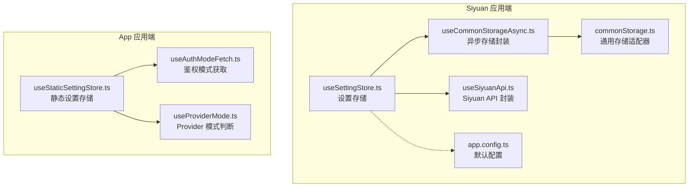
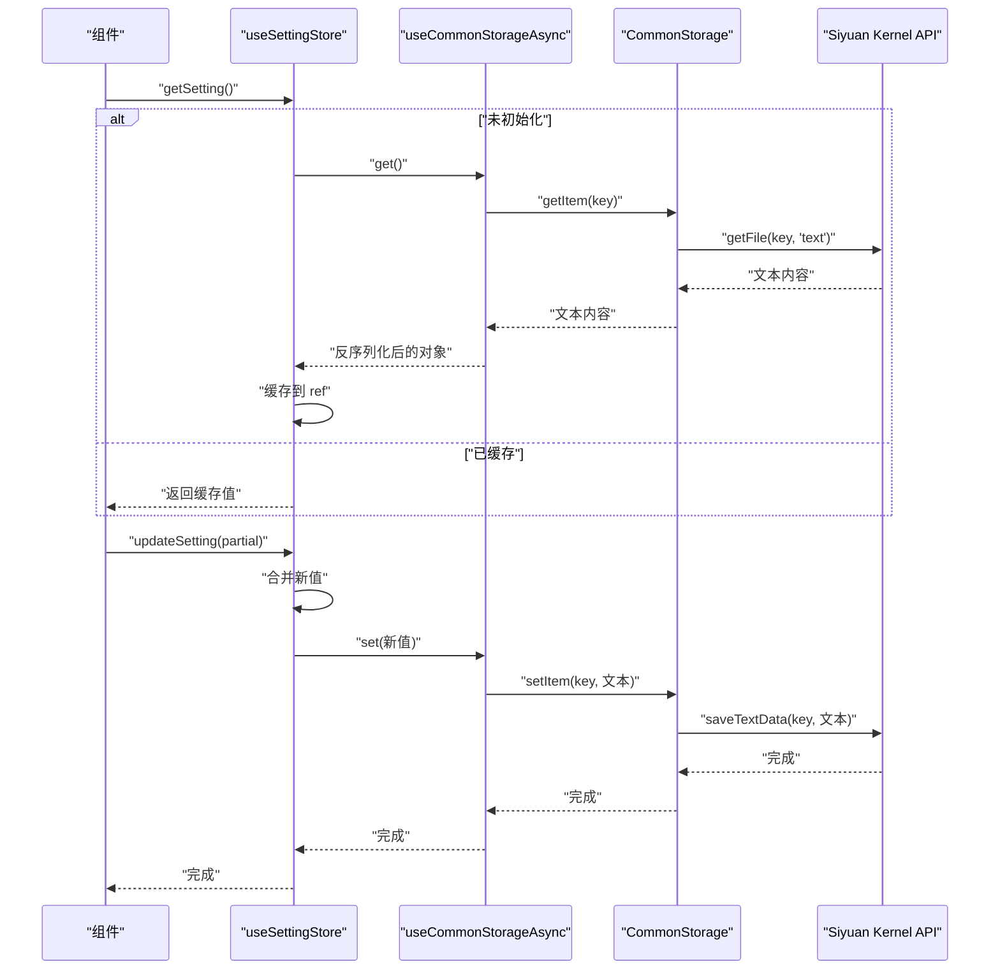
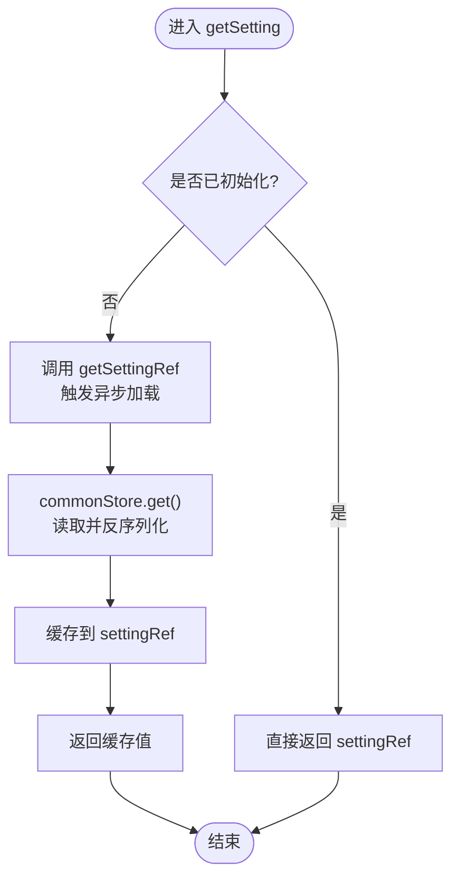
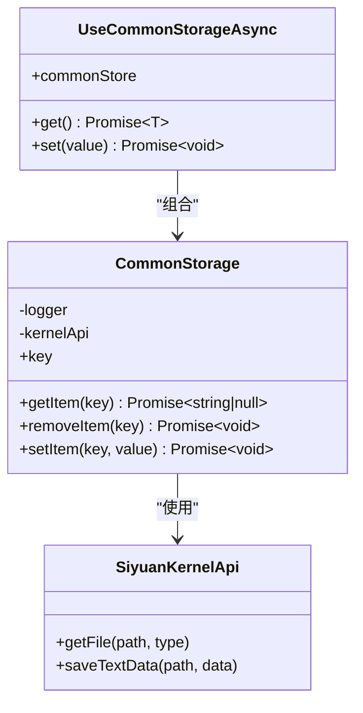
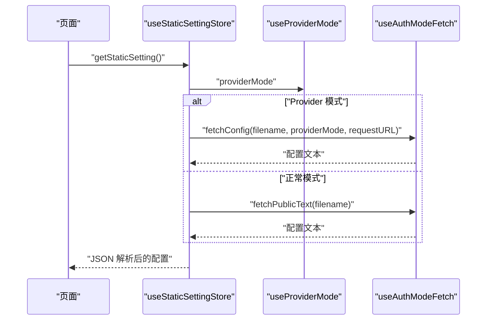
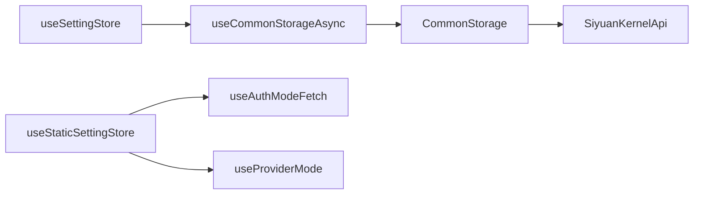
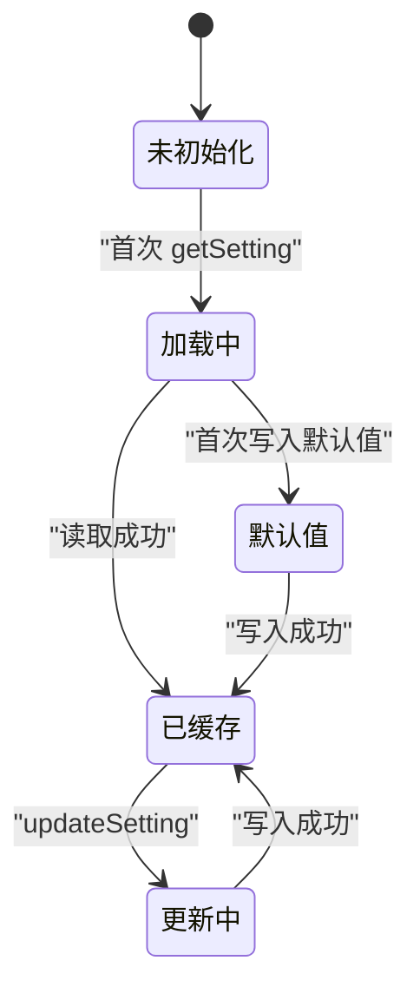

# 数据流架构

<cite>
**本文引用的文件**
- [apps/siyuan/src/stores/useSettingStore.ts](file://apps/siyuan/src/stores/useSettingStore.ts)
- [apps/siyuan/src/stores/common/commonStorage.ts](file://apps/siyuan/src/stores/common/commonStorage.ts)
- [apps/siyuan/src/stores/common/useCommonStorageAsync.ts](file://apps/siyuan/src/stores/common/useCommonStorageAsync.ts)
- [apps/siyuan/src/composables/useSiyuanApi.ts](file://apps/siyuan/src/composables/useSiyuanApi.ts)
- [apps/siyuan/src/utils/appLogger.ts](file://apps/siyuan/src/utils/appLogger.ts)
- [apps/siyuan/src/app.config.ts](file://apps/siyuan/src/app.config.ts)
- [apps/app/stores/useStaticSettingStore.ts](file://apps/app/stores/useStaticSettingStore.ts)
- [apps/app/composables/useAuthModeFetch.ts](file://apps/app/composables/useAuthModeFetch.ts)
- [apps/app/composables/useProviderMode.ts](file://apps/app/composables/useProviderMode.ts)
</cite>

## 目录
1. [简介](#简介)
2. [项目结构](#项目结构)
3. [核心组件](#核心组件)
4. [架构总览](#架构总览)
5. [详细组件分析](#详细组件分析)
6. [依赖关系分析](#依赖关系分析)
7. [性能考量](#性能考量)
8. [故障排查指南](#故障排查指南)
9. [结论](#结论)
10. [附录](#附录)

## 简介
本文件面向开发者，系统性梳理 Siyuan Plugin Blog 的数据流架构与状态管理策略，重点覆盖以下方面：
- Pinia 状态管理：store 设计、状态持久化与异步状态处理
- 从 SiYuan API 获取数据到组件渲染的完整数据流路径
- 本地存储、缓存策略与数据同步机制
- 数据验证、错误处理与性能优化策略
- 提供数据流图与状态转换图，帮助理解数据在系统中的流转过程

## 项目结构
本项目采用多应用分层组织：
- apps/siyuan：Siyuan 插件端（内嵌运行），负责与 Kernel API 交互、本地持久化与设置管理
- apps/app：Nuxt 应用端（可独立部署或通过 Provider 模式运行），负责静态资源拉取、鉴权模式切换与远程配置获取
- packages：共享工具与类型配置
- scripts：构建与发布脚本

图表来源
- [apps/siyuan/src/stores/useSettingStore.ts:1-80](file://apps/siyuan/src/stores/useSettingStore.ts#L1-L80)
- [apps/siyuan/src/stores/common/commonStorage.ts:1-88](file://apps/siyuan/src/stores/common/commonStorage.ts#L1-L88)
- [apps/siyuan/src/stores/common/useCommonStorageAsync.ts:1-91](file://apps/siyuan/src/stores/common/useCommonStorageAsync.ts#L1-L91)
- [apps/siyuan/src/composables/useSiyuanApi.ts:1-30](file://apps/siyuan/src/composables/useSiyuanApi.ts#L1-L30)
- [apps/siyuan/src/app.config.ts:1-59](file://apps/siyuan/src/app.config.ts#L1-L59)
- [apps/app/stores/useStaticSettingStore.ts:1-28](file://apps/app/stores/useStaticSettingStore.ts#L1-L28)
- [apps/app/composables/useAuthModeFetch.ts:1-319](file://apps/app/composables/useAuthModeFetch.ts#L1-L319)
- [apps/app/composables/useProviderMode.ts:1-23](file://apps/app/composables/useProviderMode.ts#L1-L23)

章节来源
- [apps/siyuan/src/stores/useSettingStore.ts:1-80](file://apps/siyuan/src/stores/useSettingStore.ts#L1-L80)
- [apps/app/stores/useStaticSettingStore.ts:1-28](file://apps/app/stores/useStaticSettingStore.ts#L1-L28)

## 核心组件
- Siyuan 设置存储（useSettingStore）
  - 作用：统一读取/更新站点配置，支持远程获取与本地持久化
  - 关键点：基于 useCommonStorageAsync 实现异步读写；通过 useSiyuanApi 访问 Kernel API；支持动态注入自定义 CSS
- 通用存储适配器（CommonStorage）
  - 作用：实现 StorageLikeAsync 接口，将数据持久化到 SiYuan 文件系统
  - 关键点：getItem 使用 kernelApi.getFile 读取文本；setItem 使用 kernelApi.saveTextData 写入
- 异步存储封装（useCommonStorageAsync）
  - 作用：对 CommonStorage 进行二次封装，提供 get/set 方法，并自动处理初始值与序列化
  - 关键点：根据初始值类型推断序列化器；首次访问时写入默认值
- SiYuan API 封装（useSiyuanApi）
  - 作用：统一对外暴露 blogApi/kernelApi，便于在 store 中调用
- App 端静态设置存储（useStaticSettingStore）
  - 作用：在 Nuxt 应用端按鉴权模式拉取静态配置（本地 public 或远端 Provider）
  - 关键点：结合 useAuthModeFetch 与 useProviderMode，支持 SPA 与服务端代理两种拉取路径
- 日志与配置
  - 日志：createAppLogger 输出带模块名的日志，便于定位问题
  - 默认配置：AppConfig 定义站点基础字段与主题配置

章节来源
- [apps/siyuan/src/stores/useSettingStore.ts:20-79](file://apps/siyuan/src/stores/useSettingStore.ts#L20-L79)
- [apps/siyuan/src/stores/common/commonStorage.ts:25-85](file://apps/siyuan/src/stores/common/commonStorage.ts#L25-L85)
- [apps/siyuan/src/stores/common/useCommonStorageAsync.ts:21-63](file://apps/siyuan/src/stores/common/useCommonStorageAsync.ts#L21-L63)
- [apps/siyuan/src/composables/useSiyuanApi.ts:17-29](file://apps/siyuan/src/composables/useSiyuanApi.ts#L17-L29)
- [apps/app/stores/useStaticSettingStore.ts:10-27](file://apps/app/stores/useStaticSettingStore.ts#L10-L27)
- [apps/siyuan/src/utils/appLogger.ts:20-22](file://apps/siyuan/src/utils/appLogger.ts#L20-L22)
- [apps/siyuan/src/app.config.ts:12-58](file://apps/siyuan/src/app.config.ts#L12-L58)

## 架构总览
下图展示从“请求配置”到“组件渲染”的端到端数据流，涵盖鉴权模式、远程/本地获取、持久化与缓存。

图表来源
- [apps/siyuan/src/stores/useSettingStore.ts:28-62](file://apps/siyuan/src/stores/useSettingStore.ts#L28-L62)
- [apps/siyuan/src/stores/common/useCommonStorageAsync.ts:43-59](file://apps/siyuan/src/stores/common/useCommonStorageAsync.ts#L43-L59)
- [apps/siyuan/src/stores/common/commonStorage.ts:43-84](file://apps/siyuan/src/stores/common/commonStorage.ts#L43-L84)
- [apps/siyuan/src/composables/useSiyuanApi.ts:20-28](file://apps/siyuan/src/composables/useSiyuanApi.ts#L20-L28)

## 详细组件分析

### 组件一：Siyuan 设置存储（useSettingStore）
- 设计要点
  - 使用 ref 缓存当前设置，computed 包装异步初始化逻辑，避免重复 IO
  - 通过 useCommonStorageAsync 抽象存储细节，屏蔽底层序列化与默认值写入
  - 支持动态注入自定义 CSS（通过 kernelApi 调用 /api/snippet/getSnippet）
- 状态持久化
  - set 时将对象序列化为 JSON 文本，写入 SiYuan 文件系统
  - 首次访问若无数据，自动写入默认配置（AppConfig）
- 异步状态处理
  - getSettingRef 作为惰性入口，仅在首次访问时触发 IO
  - updateSetting 合并增量更新，再写回存储

图表来源
- [apps/siyuan/src/stores/useSettingStore.ts:28-48](file://apps/siyuan/src/stores/useSettingStore.ts#L28-L48)
- [apps/siyuan/src/stores/common/useCommonStorageAsync.ts:44-55](file://apps/siyuan/src/stores/common/useCommonStorageAsync.ts#L44-L55)

章节来源
- [apps/siyuan/src/stores/useSettingStore.ts:20-79](file://apps/siyuan/src/stores/useSettingStore.ts#L20-L79)

### 组件二：通用存储适配器（CommonStorage）与异步封装（useCommonStorageAsync）
- 设计要点
  - CommonStorage 实现 StorageLikeAsync 接口，统一 getItem/setItem 语义
  - getItem 通过 kernelApi.getFile 读取文本；setItem 通过 kernelApi.saveTextData 写入
  - useCommonStorageAsync 负责：
    - 推断序列化器类型（布尔/数字/字符串/对象/集合/日期等）
    - 首次访问时写入默认值（initialValue）
    - 将原始文本与对象互转（serializer.read/write）

图表来源
- [apps/siyuan/src/stores/common/commonStorage.ts:25-85](file://apps/siyuan/src/stores/common/commonStorage.ts#L25-L85)
- [apps/siyuan/src/stores/common/useCommonStorageAsync.ts:21-63](file://apps/siyuan/src/stores/common/useCommonStorageAsync.ts#L21-L63)
- [apps/siyuan/src/composables/useSiyuanApi.ts:20-28](file://apps/siyuan/src/composables/useSiyuanApi.ts#L20-L28)

章节来源
- [apps/siyuan/src/stores/common/commonStorage.ts:17-85](file://apps/siyuan/src/stores/common/commonStorage.ts#L17-L85)
- [apps/siyuan/src/stores/common/useCommonStorageAsync.ts:15-91](file://apps/siyuan/src/stores/common/useCommonStorageAsync.ts#L15-L91)

### 组件三：App 端静态设置存储（useStaticSettingStore）与鉴权模式
- 设计要点
  - 在 Nuxt 应用端按鉴权模式拉取静态配置：
    - Provider 模式：通过 useAuthModeFetch 从远端接口按作者/文档维度获取
    - 正常模式：通过 useAuthModeFetch 从 /public/siyuan-blog 目录拉取
  - 结合 useProviderMode 判断是否启用 Provider 模式
  - 支持将结果缓存至浏览器 localStorage（非 SSR 环境）
- 数据验证与错误处理
  - Provider 拉取失败时回退到默认配置
  - fetchProviderPostMeta 与 validatePassword 返回结构化错误信息

图表来源
- [apps/app/stores/useStaticSettingStore.ts:10-27](file://apps/app/stores/useStaticSettingStore.ts#L10-L27)
- [apps/app/composables/useAuthModeFetch.ts:181-215](file://apps/app/composables/useAuthModeFetch.ts#L181-L215)
- [apps/app/composables/useProviderMode.ts:16-22](file://apps/app/composables/useProviderMode.ts#L16-L22)

章节来源
- [apps/app/stores/useStaticSettingStore.ts:1-28](file://apps/app/stores/useStaticSettingStore.ts#L1-L28)
- [apps/app/composables/useAuthModeFetch.ts:1-319](file://apps/app/composables/useAuthModeFetch.ts#L1-L319)
- [apps/app/composables/useProviderMode.ts:1-23](file://apps/app/composables/useProviderMode.ts#L1-L23)

### 组件四：日志与默认配置
- 日志：createAppLogger 基于 simpleLogger，输出带模块名与环境开关的日志，便于问题定位
- 默认配置：AppConfig 定义站点语言、标题、描述、首页 ID、主题与自定义 CSS 列表等字段

章节来源
- [apps/siyuan/src/utils/appLogger.ts:20-22](file://apps/siyuan/src/utils/appLogger.ts#L20-L22)
- [apps/siyuan/src/app.config.ts:12-58](file://apps/siyuan/src/app.config.ts#L12-L58)

## 依赖关系分析
- 组件耦合与内聚
  - useSettingStore 与 useCommonStorageAsync 高内聚，职责清晰：前者负责业务逻辑，后者负责存储抽象
  - CommonStorage 与 SiyuanKernelApi 强耦合，但通过封装隔离了外部依赖
  - useStaticSettingStore 与 useAuthModeFetch、useProviderMode 解耦良好，便于在不同运行环境下切换
- 外部依赖与集成点
  - SiYuan Kernel API：用于文件读写与片段获取
  - Provider 服务：用于远程配置与文档元数据拉取
  - 浏览器 localStorage：在 App 端用于短期缓存

图表来源
- [apps/siyuan/src/stores/useSettingStore.ts:24-26](file://apps/siyuan/src/stores/useSettingStore.ts#L24-L26)
- [apps/siyuan/src/stores/common/useCommonStorageAsync.ts:26](file://apps/siyuan/src/stores/common/useCommonStorageAsync.ts#L26)
- [apps/siyuan/src/stores/common/commonStorage.ts:32-34](file://apps/siyuan/src/stores/common/commonStorage.ts#L32-L34)
- [apps/app/stores/useStaticSettingStore.ts:13-14](file://apps/app/stores/useStaticSettingStore.ts#L13-L14)
- [apps/app/composables/useAuthModeFetch.ts:19-21](file://apps/app/composables/useAuthModeFetch.ts#L19-L21)
- [apps/app/composables/useProviderMode.ts:18-19](file://apps/app/composables/useProviderMode.ts#L18-L19)

章节来源
- [apps/siyuan/src/stores/useSettingStore.ts:20-27](file://apps/siyuan/src/stores/useSettingStore.ts#L20-L27)
- [apps/siyuan/src/stores/common/useCommonStorageAsync.ts:21-27](file://apps/siyuan/src/stores/common/useCommonStorageAsync.ts#L21-L27)
- [apps/siyuan/src/stores/common/commonStorage.ts:30-35](file://apps/siyuan/src/stores/common/commonStorage.ts#L30-L35)
- [apps/app/stores/useStaticSettingStore.ts:10-14](file://apps/app/stores/useStaticSettingStore.ts#L10-L14)

## 性能考量
- 首次访问延迟最小化
  - useSettingStore 通过 computed 包装惰性初始化，避免不必要的 IO
  - useCommonStorageAsync 首次访问写入默认值，后续读取走缓存
- 序列化成本控制
  - 根据初始值类型推断序列化器，减少不必要转换
- 网络与 IO 优化
  - App 端在非 SSR 环境将配置缓存至 localStorage，降低重复拉取
  - Provider 模式下优先命中作者白名单，减少跨域与鉴权开销
- 主题与自定义 CSS
  - 动态注入自定义 CSS 时进行异常捕获，避免阻塞主流程

## 故障排查指南
- 常见问题与定位
  - 配置无法读取：检查 useCommonStorageAsync 是否成功写入默认值；确认 Siyuan Kernel API 文件路径正确
  - Provider 拉取失败：查看 useAuthModeFetch 的错误分支与回退逻辑；确认 providerUrl 与接口可用性
  - 自定义 CSS 注入失败：观察 setExtraSettingData 的错误日志，确认 /api/snippet/getSnippet 返回结构
- 日志建议
  - 在关键节点增加日志（如 getSetting、updateSetting、fetchConfig、saveTextData），便于复现问题
- 错误处理策略
  - Provider 拉取失败时回退到默认配置，保证系统可用性
  - fetchProviderPostMeta 与 validatePassword 返回结构化错误，便于前端提示

章节来源
- [apps/siyuan/src/stores/useSettingStore.ts:50-76](file://apps/siyuan/src/stores/useSettingStore.ts#L50-L76)
- [apps/siyuan/src/stores/common/commonStorage.ts:47-53](file://apps/siyuan/src/stores/common/commonStorage.ts#L47-L53)
- [apps/app/composables/useAuthModeFetch.ts:58-79](file://apps/app/composables/useAuthModeFetch.ts#L58-L79)
- [apps/app/composables/useAuthModeFetch.ts:224-258](file://apps/app/composables/useAuthModeFetch.ts#L224-L258)
- [apps/siyuan/src/utils/appLogger.ts:20-22](file://apps/siyuan/src/utils/appLogger.ts#L20-L22)

## 结论
本项目通过清晰的分层设计与 Pinia 状态管理，实现了“配置即数据”的统一治理：
- Siyuan 端以 useSettingStore 为核心，结合通用存储适配器与 Kernel API，确保配置的可靠持久化与快速读取
- App 端以 useStaticSettingStore 为核心，结合鉴权模式与 Provider 服务，实现灵活的部署与数据来源切换
- 通过日志体系与错误回退机制，保障系统在异常场景下的稳定性与可观测性

## 附录
- 关键流程状态图（配置更新）

图表来源
- [apps/siyuan/src/stores/useSettingStore.ts:28-62](file://apps/siyuan/src/stores/useSettingStore.ts#L28-L62)
- [apps/siyuan/src/stores/common/useCommonStorageAsync.ts:44-55](file://apps/siyuan/src/stores/common/useCommonStorageAsync.ts#L44-L55)