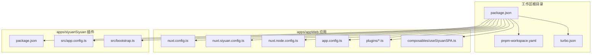
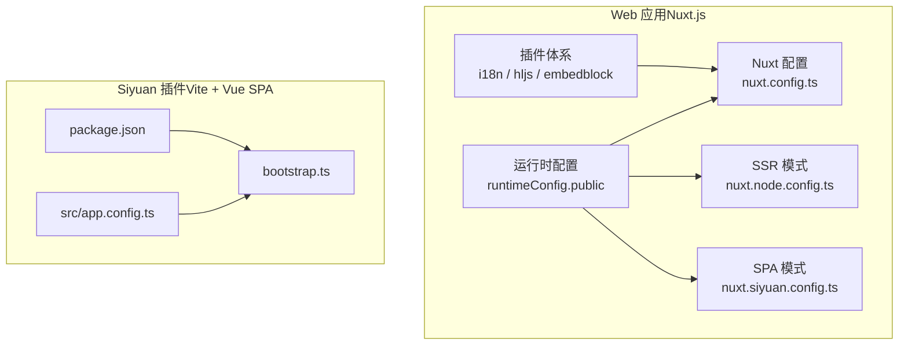
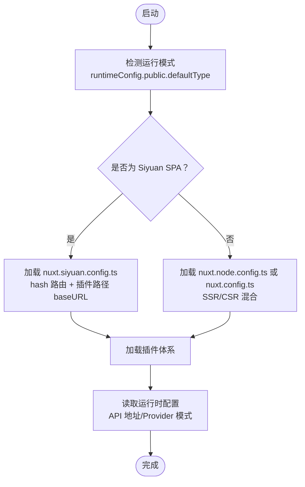
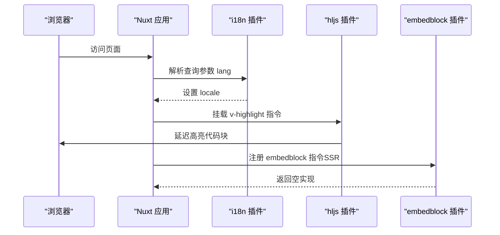
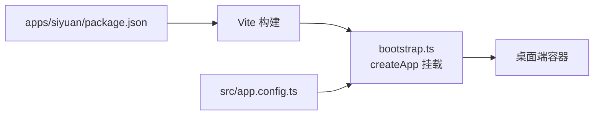
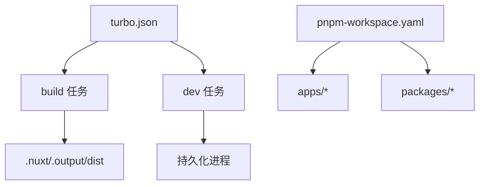

# 整体架构

<cite>
**本文引用的文件**
- [package.json](file://package.json)
- [pnpm-workspace.yaml](file://pnpm-workspace.yaml)
- [turbo.json](file://turbo.json)
- [apps/app/nuxt.config.ts](file://apps/app/nuxt.config.ts)
- [apps/app/nuxt.siyuan.config.ts](file://apps/app/nuxt.siyuan.config.ts)
- [apps/app/nuxt.node.config.ts](file://apps/app/nuxt.node.config.ts)
- [apps/app/app.config.ts](file://apps/app/app.config.ts)
- [apps/app/plugins/00.i18n.ts](file://apps/app/plugins/00.i18n.ts)
- [apps/app/plugins/01.hljs.client.ts](file://apps/app/plugins/01.hljs.client.ts)
- [apps/app/plugins/010.embedblock.server.ts](file://apps/app/plugins/010.embedblock.server.ts)
- [apps/app/composables/useSiyuanSPA.ts](file://apps/app/composables/useSiyuanSPA.ts)
- [apps/siyuan/package.json](file://apps/siyuan/package.json)
- [apps/siyuan/src/app.config.ts](file://apps/siyuan/src/app.config.ts)
- [apps/siyuan/src/bootstrap.ts](file://apps/siyuan/src/bootstrap.ts)
</cite>

## 目录
1. [引言](#引言)
2. [项目结构](#项目结构)
3. [核心组件](#核心组件)
4. [架构总览](#架构总览)
5. [详细组件分析](#详细组件分析)
6. [依赖分析](#依赖分析)
7. [性能考虑](#性能考虑)
8. [故障排查指南](#故障排查指南)
9. [结论](#结论)
10. [附录](#附录)

## 引言
本文件面向开发者与架构师，系统性阐述 Siyuan Plugin Blog 的整体架构设计。该系统采用“Monorepo + 混合前端架构”的组织方式：在 apps 目录下同时提供两类运行形态的应用：
- Web 应用（基于 Nuxt.js 的 SSR/CSR 混合模式）
- Siyuan 插件（基于 Vite 的 SPA，嵌入到思源笔记桌面端）

通过统一的构建与发布管线，实现一套代码在两种运行环境下的复用与协同。

## 项目结构
仓库采用 pnpm workspace + Turbo 的 Monorepo 架构，核心目录与职责如下：
- apps/app：Web 应用（Nuxt.js），支持 SSR/CSR、多环境配置（Cloudflare/Vercel/Node/Siyuan）。
- apps/siyuan：Siyuan 插件（Vue 3 + Vite），以 SPA 形式注入到思源笔记桌面端。
- packages/*：共享工具与类型配置（如 ESLint、TS 配置、UI 组件等）。
- scripts/*：构建、打包、版本管理脚本。
- 顶层 package.json、turbo.json、pnpm-workspace.yaml：统一脚本、缓存与工作区配置。

**图表来源**
- [package.json:1-27](file://package.json#L1-L27)
- [pnpm-workspace.yaml:1-9](file://pnpm-workspace.yaml#L1-L9)
- [turbo.json:1-17](file://turbo.json#L1-L17)
- [apps/app/nuxt.config.ts:1-125](file://apps/app/nuxt.config.ts#L1-L125)
- [apps/app/nuxt.siyuan.config.ts:1-133](file://apps/app/nuxt.siyuan.config.ts#L1-L133)
- [apps/app/nuxt.node.config.ts:1-125](file://apps/app/nuxt.node.config.ts#L1-L125)
- [apps/app/app.config.ts:1-92](file://apps/app/app.config.ts#L1-L92)
- [apps/app/plugins/00.i18n.ts:1-28](file://apps/app/plugins/00.i18n.ts#L1-L28)
- [apps/app/plugins/01.hljs.client.ts:1-80](file://apps/app/plugins/01.hljs.client.ts#L1-L80)
- [apps/app/plugins/010.embedblock.server.ts:1-14](file://apps/app/plugins/010.embedblock.server.ts#L1-L14)
- [apps/app/composables/useSiyuanSPA.ts:1-16](file://apps/app/composables/useSiyuanSPA.ts#L1-L16)
- [apps/siyuan/package.json:1-43](file://apps/siyuan/package.json#L1-L43)
- [apps/siyuan/src/app.config.ts:1-59](file://apps/siyuan/src/app.config.ts#L1-L59)
- [apps/siyuan/src/bootstrap.ts:1-16](file://apps/siyuan/src/bootstrap.ts#L1-L16)

**章节来源**
- [package.json:1-27](file://package.json#L1-L27)
- [pnpm-workspace.yaml:1-9](file://pnpm-workspace.yaml#L1-L9)
- [turbo.json:1-17](file://turbo.json#L1-L17)

## 核心组件
- Nuxt.js 配置体系
  - 通用配置：国际化、UI 组件自动导入、开发工具、Head 注入、静态资源版本戳、运行时环境变量。
  - 多环境配置：nuxt.config.ts（通用）、nuxt.siyuan.config.ts（Siyuan SPA 模式）、nuxt.node.config.ts（Node SSR 模式）。
- 插件体系
  - i18n 插件：根据查询参数动态切换语言。
  - 代码高亮插件：客户端指令驱动的代码高亮。
  - SSR 兼容插件：为 SSR 场景提供占位指令，避免 getSSRProps 报错。
- 组合式函数
  - useSiyuanSPA：判断当前运行模式是否为 Siyuan SPA。
- Siyuan 插件
  - Vite 构建、Vue 应用引导、插件配置与常量。

**章节来源**
- [apps/app/nuxt.config.ts:1-125](file://apps/app/nuxt.config.ts#L1-L125)
- [apps/app/nuxt.siyuan.config.ts:1-133](file://apps/app/nuxt.siyuan.config.ts#L1-L133)
- [apps/app/nuxt.node.config.ts:1-125](file://apps/app/nuxt.node.config.ts#L1-L125)
- [apps/app/plugins/00.i18n.ts:1-28](file://apps/app/plugins/00.i18n.ts#L1-L28)
- [apps/app/plugins/01.hljs.client.ts:1-80](file://apps/app/plugins/01.hljs.client.ts#L1-L80)
- [apps/app/plugins/010.embedblock.server.ts:1-14](file://apps/app/plugins/010.embedblock.server.ts#L1-L14)
- [apps/app/composables/useSiyuanSPA.ts:1-16](file://apps/app/composables/useSiyuanSPA.ts#L1-L16)
- [apps/siyuan/package.json:1-43](file://apps/siyuan/package.json#L1-L43)
- [apps/siyuan/src/app.config.ts:1-59](file://apps/siyuan/src/app.config.ts#L1-L59)
- [apps/siyuan/src/bootstrap.ts:1-16](file://apps/siyuan/src/bootstrap.ts#L1-L16)

## 架构总览
系统采用“双应用、一代码库”的混合架构：
- Web 应用（Nuxt.js）
  - 支持 SSR/CSR 混合渲染，通过多套 nuxt.*.config.ts 实现不同部署目标（Node、Cloudflare、Vercel、Siyuan）。
  - 运行时环境变量控制默认数据源类型（Siyan 或 Node Provider）与 API 地址。
- Siyuan 插件（Vite + Vue SPA）
  - 以 SPA 形式注入到思源笔记桌面端，使用 hash 模式路由，适配桌面端运行环境。
  - 通过组合式函数判断运行模式，按需加载资源与逻辑。

**图表来源**
- [apps/app/nuxt.config.ts:1-125](file://apps/app/nuxt.config.ts#L1-L125)
- [apps/app/nuxt.siyuan.config.ts:1-133](file://apps/app/nuxt.siyuan.config.ts#L1-L133)
- [apps/app/nuxt.node.config.ts:1-125](file://apps/app/nuxt.node.config.ts#L1-L125)
- [apps/app/plugins/00.i18n.ts:1-28](file://apps/app/plugins/00.i18n.ts#L1-L28)
- [apps/app/plugins/01.hljs.client.ts:1-80](file://apps/app/plugins/01.hljs.client.ts#L1-L80)
- [apps/app/plugins/010.embedblock.server.ts:1-14](file://apps/app/plugins/010.embedblock.server.ts#L1-L14)
- [apps/siyuan/package.json:1-43](file://apps/siyuan/package.json#L1-L43)
- [apps/siyuan/src/bootstrap.ts:1-16](file://apps/siyuan/src/bootstrap.ts#L1-L16)
- [apps/siyuan/src/app.config.ts:1-59](file://apps/siyuan/src/app.config.ts#L1-L59)

## 详细组件分析

### Nuxt.js 配置与运行模式
- 通用配置（nuxt.config.ts）
  - 模块：国际化、Element Plus、Pinia。
  - Head 注入：字体、主题基础样式、KaTeX、ECharts 脚本。
  - 运行时配置：defaultType、siyuanApiUrl、providerMode、providerUrl。
- Siyuan SPA 配置（nuxt.siyuan.config.ts）
  - 关闭 SSR，启用 hash 模式路由，baseURL 指向插件路径。
  - 运行时配置默认值覆盖，便于桌面端直接运行。
- Node SSR 配置（nuxt.node.config.ts）
  - 启用 SSR，baseURL 为根路径，适合服务端托管。

**图表来源**
- [apps/app/nuxt.siyuan.config.ts:35-41](file://apps/app/nuxt.siyuan.config.ts#L35-L41)
- [apps/app/nuxt.node.config.ts:34-36](file://apps/app/nuxt.node.config.ts#L34-L36)
- [apps/app/nuxt.config.ts:113-121](file://apps/app/nuxt.config.ts#L113-L121)
- [apps/app/composables/useSiyuanSPA.ts:10-15](file://apps/app/composables/useSiyuanSPA.ts#L10-L15)

**章节来源**
- [apps/app/nuxt.config.ts:1-125](file://apps/app/nuxt.config.ts#L1-L125)
- [apps/app/nuxt.siyuan.config.ts:1-133](file://apps/app/nuxt.siyuan.config.ts#L1-L133)
- [apps/app/nuxt.node.config.ts:1-125](file://apps/app/nuxt.node.config.ts#L1-L125)
- [apps/app/composables/useSiyuanSPA.ts:1-16](file://apps/app/composables/useSiyuanSPA.ts#L1-L16)

### 插件体系与运行时控制
- 国际化插件（00.i18n.ts）
  - 根据查询参数动态切换语言，确保多语言体验一致。
- 代码高亮插件（01.hljs.client.ts）
  - 客户端指令驱动，延迟处理代码块，保证渲染后高亮生效。
- SSR 兼容插件（010.embedblock.server.ts）
  - 在 SSR 场景提供空指令，避免 getSSRProps 报错，保障构建稳定性。

**图表来源**
- [apps/app/plugins/00.i18n.ts:16-27](file://apps/app/plugins/00.i18n.ts#L16-L27)
- [apps/app/plugins/01.hljs.client.ts:37-79](file://apps/app/plugins/01.hljs.client.ts#L37-L79)
- [apps/app/plugins/010.embedblock.server.ts:10-13](file://apps/app/plugins/010.embedblock.server.ts#L10-L13)

**章节来源**
- [apps/app/plugins/00.i18n.ts:1-28](file://apps/app/plugins/00.i18n.ts#L1-L28)
- [apps/app/plugins/01.hljs.client.ts:1-80](file://apps/app/plugins/01.hljs.client.ts#L1-L80)
- [apps/app/plugins/010.embedblock.server.ts:1-14](file://apps/app/plugins/010.embedblock.server.ts#L1-L14)

### Siyuan 插件（Vite + SPA）
- 构建与依赖
  - 使用 Vite 构建，依赖 Vue 3、VueUse、zhi-* 生态与思源官方类型。
- 应用引导
  - 通过 bootstrap.ts 创建 Vue 应用并挂载到容器，适配桌面端运行环境。
- 配置与常量
  - src/app.config.ts 提供站点与主题相关配置项，便于插件侧定制。

**图表来源**
- [apps/siyuan/package.json:1-43](file://apps/siyuan/package.json#L1-L43)
- [apps/siyuan/src/bootstrap.ts:10-14](file://apps/siyuan/src/bootstrap.ts#L10-L14)
- [apps/siyuan/src/app.config.ts:39-58](file://apps/siyuan/src/app.config.ts#L39-L58)

**章节来源**
- [apps/siyuan/package.json:1-43](file://apps/siyuan/package.json#L1-L43)
- [apps/siyuan/src/bootstrap.ts:1-16](file://apps/siyuan/src/bootstrap.ts#L1-L16)
- [apps/siyuan/src/app.config.ts:1-59](file://apps/siyuan/src/app.config.ts#L1-L59)

## 依赖分析
- Monorepo 与构建
  - pnpm-workspace.yaml 声明 apps 与 packages 为工作区，统一安装与构建。
  - turbo.json 定义 build/dev/lint 任务的输入输出与缓存策略，提升构建效率。
- 运行时依赖
  - Web 应用：Nuxt、i18n、Element Plus、Pinia、Vite 插件（AutoImport/Components）。
  - Siyuan 插件：Vue 3、VueUse、zhi-* 工具库、siyuan 类型与 Vite。
- 环境变量与运行模式
  - 通过 runtimeConfig.public.defaultType 切换“Siyan SPA”或“Node Provider”，并配合 API 地址与 Provider 模式进行数据源切换。

**图表来源**
- [turbo.json:3-14](file://turbo.json#L3-L14)
- [pnpm-workspace.yaml:1-9](file://pnpm-workspace.yaml#L1-L9)

**章节来源**
- [turbo.json:1-17](file://turbo.json#L1-L17)
- [pnpm-workspace.yaml:1-9](file://pnpm-workspace.yaml#L1-L9)

## 性能考虑
- 动态版本戳
  - 所有静态资源通过动态版本戳（分钟级）注入，避免缓存污染，同时利于 CDN 缓存策略。
- 延迟高亮
  - 代码高亮在 DOM 渲染完成后延迟执行，减少首屏阻塞。
- SSR/CSR 混合
  - 在 Node 环境优先 SSR 获取首屏内容，结合客户端激活提升交互性能；在 Siyuan SPA 环境使用 CSR，降低服务端复杂度。
- 构建缓存
  - Turbo 任务缓存与仅构建依赖（如 esbuild、vue-demi）策略，缩短二次构建时间。

**章节来源**
- [apps/app/nuxt.config.ts:5-13](file://apps/app/nuxt.config.ts#L5-L13)
- [apps/app/nuxt.siyuan.config.ts:5-13](file://apps/app/nuxt.siyuan.config.ts#L5-L13)
- [apps/app/nuxt.node.config.ts:5-13](file://apps/app/nuxt.node.config.ts#L5-L13)
- [apps/app/plugins/01.hljs.client.ts:43-70](file://apps/app/plugins/01.hljs.client.ts#L43-L70)
- [turbo.json:3-14](file://turbo.json#L3-L14)
- [pnpm-workspace.yaml:5-8](file://pnpm-workspace.yaml#L5-L8)

## 故障排查指南
- SSR 指令报错
  - 现象：SSR 场景 getSSRProps 报错。
  - 处理：确认已加载 embedblock server 插件，确保 SSR 场景下指令存在。
  - 参考：[apps/app/plugins/010.embedblock.server.ts:10-13](file://apps/app/plugins/010.embedblock.server.ts#L10-L13)
- 语言切换无效
  - 现象：访问带 lang 参数的 URL，语言未切换。
  - 处理：检查 i18n 插件是否生效，确认查询参数合法且存在于 locales。
  - 参考：[apps/app/plugins/00.i18n.ts:16-27](file://apps/app/plugins/00.i18n.ts#L16-L27)
- 代码高亮不生效
  - 现象：代码块未高亮。
  - 处理：确认 hljs client 插件已注册 v-highlight 指令，检查延迟等待时间与 DOM 结构。
  - 参考：[apps/app/plugins/01.hljs.client.ts:37-79](file://apps/app/plugins/01.hljs.client.ts#L37-L79)
- 运行模式判断错误
  - 现象：Siyuan SPA 与 Node Provider 混淆。
  - 处理：检查 runtimeConfig.public.defaultType 是否正确，必要时在构建脚本中显式传入。
  - 参考：[apps/app/composables/useSiyuanSPA.ts:10-15](file://apps/app/composables/useSiyuanSPA.ts#L10-L15)

**章节来源**
- [apps/app/plugins/010.embedblock.server.ts:1-14](file://apps/app/plugins/010.embedblock.server.ts#L1-L14)
- [apps/app/plugins/00.i18n.ts:1-28](file://apps/app/plugins/00.i18n.ts#L1-L28)
- [apps/app/plugins/01.hljs.client.ts:1-80](file://apps/app/plugins/01.hljs.client.ts#L1-L80)
- [apps/app/composables/useSiyuanSPA.ts:1-16](file://apps/app/composables/useSiyuanSPA.ts#L1-L16)

## 结论
本架构通过 Monorepo 统一管理 Web 应用与 Siyuan 插件，借助 Nuxt.js 的多环境配置与插件体系，实现了 SSR/CSR 混合渲染与桌面端 SPA 的无缝衔接。运行时配置与构建脚本共同保障了跨平台的一致性与可维护性。建议在后续迭代中持续优化资源加载策略与缓存命中率，并完善自动化测试与发布流程。

## 附录
- 关键配置入口
  - Web 应用：[apps/app/nuxt.config.ts:1-125](file://apps/app/nuxt.config.ts#L1-L125)
  - Siyuan SPA：[apps/app/nuxt.siyuan.config.ts:1-133](file://apps/app/nuxt.siyuan.config.ts#L1-L133)
  - Node SSR：[apps/app/nuxt.node.config.ts:1-125](file://apps/app/nuxt.node.config.ts#L1-L125)
- 插件与组合式函数
  - 国际化：[apps/app/plugins/00.i18n.ts:1-28](file://apps/app/plugins/00.i18n.ts#L1-L28)
  - 代码高亮：[apps/app/plugins/01.hljs.client.ts:1-80](file://apps/app/plugins/01.hljs.client.ts#L1-L80)
  - SSR 兼容：[apps/app/plugins/010.embedblock.server.ts:1-14](file://apps/app/plugins/010.embedblock.server.ts#L1-L14)
  - 运行模式判断：[apps/app/composables/useSiyuanSPA.ts:1-16](file://apps/app/composables/useSiyuanSPA.ts#L1-L16)
- Siyuan 插件
  - 包配置：[apps/siyuan/package.json:1-43](file://apps/siyuan/package.json#L1-L43)
  - 应用引导：[apps/siyuan/src/bootstrap.ts:1-16](file://apps/siyuan/src/bootstrap.ts#L1-L16)
  - 配置常量：[apps/siyuan/src/app.config.ts:1-59](file://apps/siyuan/src/app.config.ts#L1-L59)