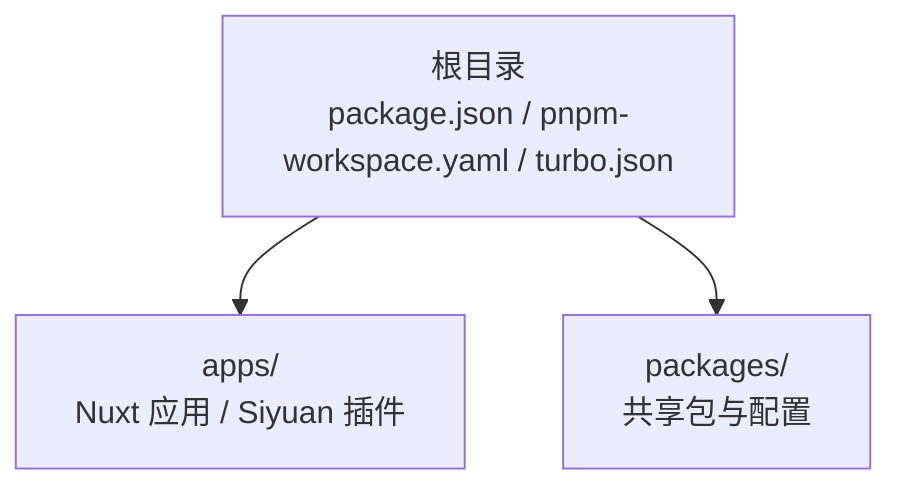
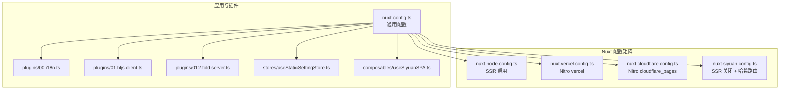
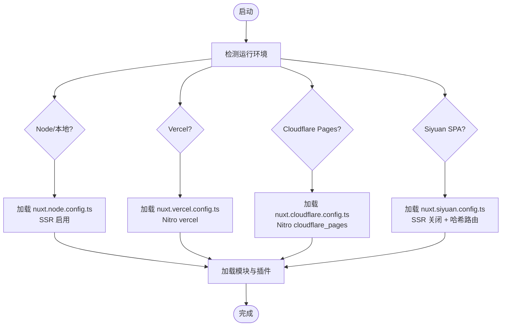
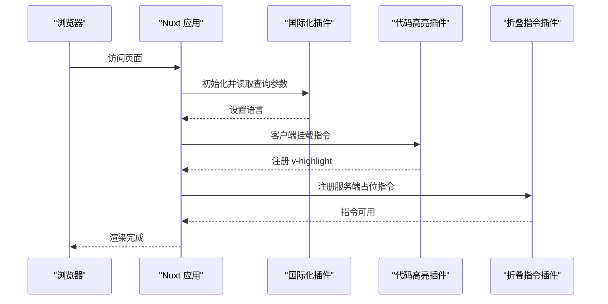
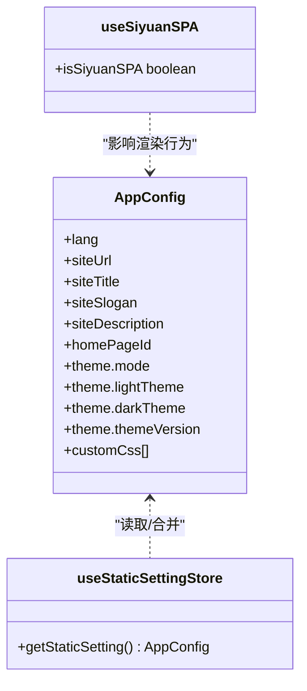
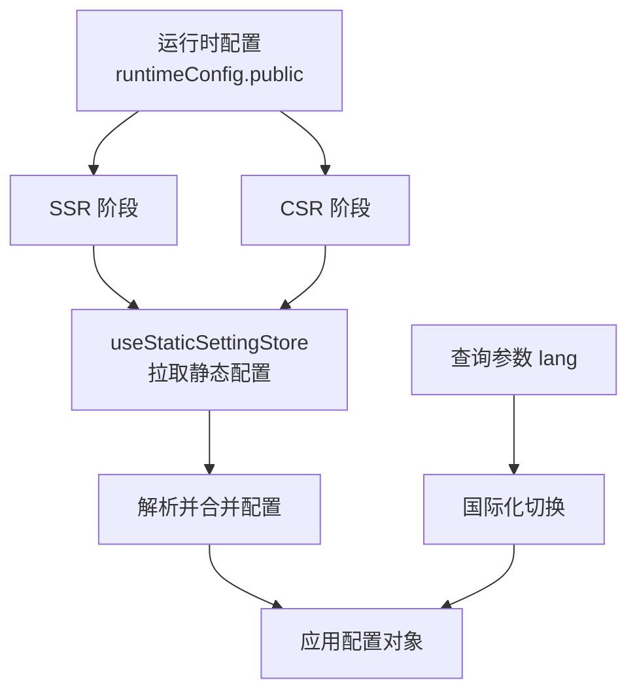
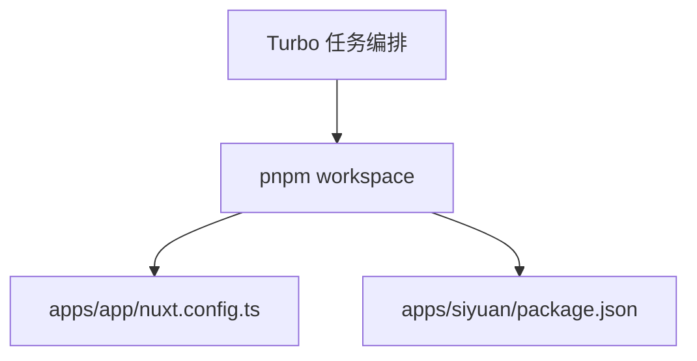

# 架构设计

<cite>
**本文引用的文件**
- [package.json](file://package.json)
- [pnpm-workspace.yaml](file://pnpm-workspace.yaml)
- [turbo.json](file://turbo.json)
- [apps/app/nuxt.config.ts](file://apps/app/nuxt.config.ts)
- [apps/app/nuxt.siyuan.config.ts](file://apps/app/nuxt.siyuan.config.ts)
- [apps/app/nuxt.node.config.ts](file://apps/app/nuxt.node.config.ts)
- [apps/app/nuxt.vercel.config.ts](file://apps/app/nuxt.vercel.config.ts)
- [apps/app/nuxt.cloudflare.config.ts](file://apps/app/nuxt.cloudflare.config.ts)
- [apps/app/app.config.ts](file://apps/app/app.config.ts)
- [apps/app/plugins/00.i18n.ts](file://apps/app/plugins/00.i18n.ts)
- [apps/app/plugins/01.hljs.client.ts](file://apps/app/plugins/01.hljs.client.ts)
- [apps/app/plugins/012.fold.server.ts](file://apps/app/plugins/012.fold.server.ts)
- [apps/app/composables/useSiyuanSPA.ts](file://apps/app/composables/useSiyuanSPA.ts)
- [apps/app/stores/useStaticSettingStore.ts](file://apps/app/stores/useStaticSettingStore.ts)
- [apps/siyuan/package.json](file://apps/siyuan/package.json)
</cite>

## 目录
1. [引言](#引言)
2. [项目结构](#项目结构)
3. [核心组件](#核心组件)
4. [架构总览](#架构总览)
5. [详细组件分析](#详细组件分析)
6. [依赖分析](#依赖分析)
7. [性能考虑](#性能考虑)
8. [故障排查指南](#故障排查指南)
9. [结论](#结论)
10. [附录](#附录)

## 引言
本架构设计文档面向 Siyuan Plugin Blog 的整体设计与实现，重点阐述其基于 Vue 3 与 Nuxt.js 的混合渲染（客户端渲染与服务器端渲染）架构、Monorepo 结构（apps 与 packages 目录）的职责划分、组件层次与状态管理、数据流设计、插件系统与扩展机制，以及在不同部署目标（Node、Vercel、Cloudflare Pages、Siyuan SPA）下的适配策略。文档旨在帮助开发者快速理解系统边界、交互流程与可扩展点。

## 项目结构
该仓库采用 pnpm workspace + Turbo 的 Monorepo 结构，通过 apps 与 packages 目录分层组织：
- apps：应用层，包含 Web 应用（Nuxt）与 Siyuan 插件前端（Vite/Vue），分别负责通用 Web 场景与嵌入 Siyuan 的单页应用场景。
- packages：共享包与工具集，如 ESLint 规则、TypeScript 配置等，供 apps 内部复用。

**图表来源**
- [pnpm-workspace.yaml:1-9](file://pnpm-workspace.yaml#L1-L9)
- [package.json:1-27](file://package.json#L1-L27)
- [turbo.json:1-17](file://turbo.json#L1-L17)

**章节来源**
- [pnpm-workspace.yaml:1-9](file://pnpm-workspace.yaml#L1-L9)
- [package.json:1-27](file://package.json#L1-L27)
- [turbo.json:1-17](file://turbo.json#L1-L17)

## 核心组件
- Nuxt 配置矩阵：针对不同运行环境提供独立配置，覆盖 SSR 开关、路由模式、Nitro 预设、资源注入与运行时配置。
- 插件系统：以 Nuxt 插件形式加载，按客户端/服务端区分执行时机，实现国际化、代码高亮、折叠指令等能力。
- 组合式工具：如 useSiyuanSPA 用于判断当前运行类型；useStaticSettingStore 用于在 SSR/CSR 下统一读取静态配置。
- 应用配置：app.config.ts 提供站点元数据、主题与功能开关等全局配置。

**章节来源**
- [apps/app/nuxt.config.ts:1-125](file://apps/app/nuxt.config.ts#L1-L125)
- [apps/app/nuxt.siyuan.config.ts:1-133](file://apps/app/nuxt.siyuan.config.ts#L1-L133)
- [apps/app/nuxt.node.config.ts:1-125](file://apps/app/nuxt.node.config.ts#L1-L125)
- [apps/app/nuxt.vercel.config.ts:1-134](file://apps/app/nuxt.vercel.config.ts#L1-L134)
- [apps/app/nuxt.cloudflare.config.ts:1-126](file://apps/app/nuxt.cloudflare.config.ts#L1-L126)
- [apps/app/plugins/00.i18n.ts:1-28](file://apps/app/plugins/00.i18n.ts#L1-L28)
- [apps/app/plugins/01.hljs.client.ts:1-80](file://apps/app/plugins/01.hljs.client.ts#L1-L80)
- [apps/app/plugins/012.fold.server.ts:1-14](file://apps/app/plugins/012.fold.server.ts#L1-L14)
- [apps/app/composables/useSiyuanSPA.ts:1-16](file://apps/app/composables/useSiyuanSPA.ts#L1-L16)
- [apps/app/stores/useStaticSettingStore.ts:1-28](file://apps/app/stores/useStaticSettingStore.ts#L1-L28)
- [apps/app/app.config.ts:1-92](file://apps/app/app.config.ts#L1-L92)

## 架构总览
系统采用“多配置 Nuxt 应用 + 插件化扩展”的架构，支持多种运行形态：
- Node/本地：标准 SSR，适合自建服务或本地开发。
- Vercel：Nitro 预设为 vercel，适配边缘计算与无服务器部署。
- Cloudflare Pages：Nitro 预设为 cloudflare_pages，适配 Workers Pages。
- Siyuan SPA：关闭 SSR，使用哈希路由，嵌入到 Siyuan 客户端。

**图表来源**
- [apps/app/nuxt.config.ts:1-125](file://apps/app/nuxt.config.ts#L1-L125)
- [apps/app/nuxt.siyuan.config.ts:1-133](file://apps/app/nuxt.siyuan.config.ts#L1-L133)
- [apps/app/nuxt.node.config.ts:1-125](file://apps/app/nuxt.node.config.ts#L1-L125)
- [apps/app/nuxt.vercel.config.ts:1-134](file://apps/app/nuxt.vercel.config.ts#L1-L134)
- [apps/app/nuxt.cloudflare.config.ts:1-126](file://apps/app/nuxt.cloudflare.config.ts#L1-L126)
- [apps/app/plugins/00.i18n.ts:1-28](file://apps/app/plugins/00.i18n.ts#L1-L28)
- [apps/app/plugins/01.hljs.client.ts:1-80](file://apps/app/plugins/01.hljs.client.ts#L1-L80)
- [apps/app/plugins/012.fold.server.ts:1-14](file://apps/app/plugins/012.fold.server.ts#L1-L14)
- [apps/app/stores/useStaticSettingStore.ts:1-28](file://apps/app/stores/useStaticSettingStore.ts#L1-L28)
- [apps/app/composables/useSiyuanSPA.ts:1-16](file://apps/app/composables/useSiyuanSPA.ts#L1-L16)

## 详细组件分析

### Nuxt 配置与运行模式
- Node/本地：启用 SSR，设置 baseURL、head 注入、Element Plus、Pinia、i18n 等模块，运行时公开默认类型、API 地址与 Provider 模式。
- Vercel：启用 Nitro vercel 预设，适配边缘部署，保持 SSR 与通用模块配置一致。
- Cloudflare Pages：启用 Nitro cloudflare_pages 预设，适配 Pages Workers，保持 SSR 与通用模块配置一致。
- Siyuan SPA：关闭 SSR，启用 hashMode 路由，baseURL 指向插件路径，便于嵌入 Siyuan 客户端。

**图表来源**
- [apps/app/nuxt.node.config.ts:1-125](file://apps/app/nuxt.node.config.ts#L1-L125)
- [apps/app/nuxt.vercel.config.ts:1-134](file://apps/app/nuxt.vercel.config.ts#L1-L134)
- [apps/app/nuxt.cloudflare.config.ts:1-126](file://apps/app/nuxt.cloudflare.config.ts#L1-L126)
- [apps/app/nuxt.siyuan.config.ts:1-133](file://apps/app/nuxt.siyuan.config.ts#L1-L133)

**章节来源**
- [apps/app/nuxt.node.config.ts:1-125](file://apps/app/nuxt.node.config.ts#L1-L125)
- [apps/app/nuxt.vercel.config.ts:1-134](file://apps/app/nuxt.vercel.config.ts#L1-L134)
- [apps/app/nuxt.cloudflare.config.ts:1-126](file://apps/app/nuxt.cloudflare.config.ts#L1-L126)
- [apps/app/nuxt.siyuan.config.ts:1-133](file://apps/app/nuxt.siyuan.config.ts#L1-L133)

### 插件系统与扩展机制
- 国际化插件：根据查询参数动态切换语言，确保多语言体验。
- 代码高亮插件：仅在客户端执行，对代码块进行高亮处理，提升阅读体验。
- 折叠指令插件：在服务端占位，避免 SSR 获取 props 报错，保证跨端一致性。
- 插件加载顺序：以数字前缀命名，确保 i18n 在前，其他插件按需加载。

**图表来源**
- [apps/app/plugins/00.i18n.ts:1-28](file://apps/app/plugins/00.i18n.ts#L1-L28)
- [apps/app/plugins/01.hljs.client.ts:1-80](file://apps/app/plugins/01.hljs.client.ts#L1-L80)
- [apps/app/plugins/012.fold.server.ts:1-14](file://apps/app/plugins/012.fold.server.ts#L1-L14)

**章节来源**
- [apps/app/plugins/00.i18n.ts:1-28](file://apps/app/plugins/00.i18n.ts#L1-L28)
- [apps/app/plugins/01.hljs.client.ts:1-80](file://apps/app/plugins/01.hljs.client.ts#L1-L80)
- [apps/app/plugins/012.fold.server.ts:1-14](file://apps/app/plugins/012.fold.server.ts#L1-L14)

### 组件层次与状态管理
- 组合式工具：useSiyuanSPA 用于识别当前是否为 Siyuan SPA 模式，驱动 UI 与行为差异。
- 静态配置存储：useStaticSettingStore 在 SSR/CSR 下统一拉取静态配置文件，结合鉴权与 Provider 模式，返回应用配置对象。
- 应用配置：app.config.ts 提供站点元数据、主题与功能开关，作为全局默认值。

**图表来源**
- [apps/app/app.config.ts:1-92](file://apps/app/app.config.ts#L1-L92)
- [apps/app/stores/useStaticSettingStore.ts:1-28](file://apps/app/stores/useStaticSettingStore.ts#L1-L28)
- [apps/app/composables/useSiyuanSPA.ts:1-16](file://apps/app/composables/useSiyuanSPA.ts#L1-L16)

**章节来源**
- [apps/app/app.config.ts:1-92](file://apps/app/app.config.ts#L1-L92)
- [apps/app/stores/useStaticSettingStore.ts:1-28](file://apps/app/stores/useStaticSettingStore.ts#L1-L28)
- [apps/app/composables/useSiyuanSPA.ts:1-16](file://apps/app/composables/useSiyuanSPA.ts#L1-L16)

### 数据流设计
- 运行时配置：通过 Nuxt runtimeConfig.public 注入环境变量（默认类型、API 地址、Provider 模式等），在客户端与服务端均可访问。
- 静态配置：在 SSR 阶段通过 useStaticSettingStore 从远端或本地静态资源拉取配置，解析后注入应用。
- 国际化：根据查询参数动态切换语言，避免硬编码导致的不一致。

**图表来源**
- [apps/app/nuxt.config.ts:114-121](file://apps/app/nuxt.config.ts#L114-L121)
- [apps/app/nuxt.siyuan.config.ts:122-129](file://apps/app/nuxt.siyuan.config.ts#L122-L129)
- [apps/app/nuxt.node.config.ts:114-121](file://apps/app/nuxt.node.config.ts#L114-L121)
- [apps/app/nuxt.vercel.config.ts:123-130](file://apps/app/nuxt.vercel.config.ts#L123-L130)
- [apps/app/nuxt.cloudflare.config.ts:115-122](file://apps/app/nuxt.cloudflare.config.ts#L115-L122)
- [apps/app/stores/useStaticSettingStore.ts:10-24](file://apps/app/stores/useStaticSettingStore.ts#L10-L24)
- [apps/app/plugins/00.i18n.ts:16-27](file://apps/app/plugins/00.i18n.ts#L16-L27)

**章节来源**
- [apps/app/nuxt.config.ts:114-121](file://apps/app/nuxt.config.ts#L114-L121)
- [apps/app/nuxt.siyuan.config.ts:122-129](file://apps/app/nuxt.siyuan.config.ts#L122-L129)
- [apps/app/nuxt.node.config.ts:114-121](file://apps/app/nuxt.node.config.ts#L114-L121)
- [apps/app/nuxt.vercel.config.ts:123-130](file://apps/app/nuxt.vercel.config.ts#L123-L130)
- [apps/app/nuxt.cloudflare.config.ts:115-122](file://apps/app/nuxt.cloudflare.config.ts#L115-L122)
- [apps/app/stores/useStaticSettingStore.ts:10-24](file://apps/app/stores/useStaticSettingStore.ts#L10-L24)
- [apps/app/plugins/00.i18n.ts:16-27](file://apps/app/plugins/00.i18n.ts#L16-L27)

### 插件系统架构原理与扩展机制
- 插件生命周期：Nuxt 插件在应用初始化阶段加载，客户端插件仅在浏览器端执行，服务端插件在 SSR 期间注册指令或钩子。
- 扩展点：新增功能可通过新增插件文件（按序号前缀命名）接入；若需 SSR 兼容，需提供服务端占位实现（如折叠指令插件）。
- 依赖与解耦：插件通过 Nuxt 上下文与 $i18n、useRoute、useRuntimeConfig 等 API 交互，避免直接耦合具体实现。

**章节来源**
- [apps/app/plugins/01.hljs.client.ts:1-80](file://apps/app/plugins/01.hljs.client.ts#L1-L80)
- [apps/app/plugins/012.fold.server.ts:1-14](file://apps/app/plugins/012.fold.server.ts#L1-L14)

## 依赖分析
- Monorepo 管理：pnpm workspace 指定 apps 与 packages 为工作区，Turbo 控制构建缓存与任务依赖。
- 应用依赖：apps/app 基于 Nuxt 与 Vue 3，集成 Element Plus、Pinia、i18n 等生态模块；apps/siyuan 基于 Vite 与 Vue 3，面向 Siyuan 插件开发。
- 外部依赖：Nuxt 配置中通过 Nitro 预设适配不同平台，同时进行外部依赖别名映射以兼容特定包。

**图表来源**
- [turbo.json:1-17](file://turbo.json#L1-L17)
- [pnpm-workspace.yaml:1-9](file://pnpm-workspace.yaml#L1-L9)
- [apps/app/nuxt.config.ts:1-125](file://apps/app/nuxt.config.ts#L1-L125)
- [apps/siyuan/package.json:1-43](file://apps/siyuan/package.json#L1-L43)

**章节来源**
- [turbo.json:1-17](file://turbo.json#L1-L17)
- [pnpm-workspace.yaml:1-9](file://pnpm-workspace.yaml#L1-L9)
- [apps/siyuan/package.json:1-43](file://apps/siyuan/package.json#L1-L43)

## 性能考虑
- 动态版本戳：CSS/JS 资源注入带动态版本戳，便于缓存控制与更新。
- 按需脚本：开发模式下注入调试工具与第三方库脚本，生产模式精简加载。
- SSR 与 CSR 并行：Node/本地与 Vercel/Cloudflare Pages 保持一致的模块与资源注入策略，减少差异化带来的性能损耗。
- 插件粒度：将高开销逻辑（如代码高亮）限制在客户端，降低服务端压力。

**章节来源**
- [apps/app/nuxt.config.ts:46-87](file://apps/app/nuxt.config.ts#L46-L87)
- [apps/app/nuxt.siyuan.config.ts:77-118](file://apps/app/nuxt.siyuan.config.ts#L77-L118)
- [apps/app/nuxt.node.config.ts:46-87](file://apps/app/nuxt.node.config.ts#L46-L87)
- [apps/app/nuxt.vercel.config.ts:59-87](file://apps/app/nuxt.vercel.config.ts#L59-L87)
- [apps/app/nuxt.cloudflare.config.ts:59-79](file://apps/app/nuxt.cloudflare.config.ts#L59-L79)
- [apps/app/plugins/01.hljs.client.ts:37-79](file://apps/app/plugins/01.hljs.client.ts#L37-L79)

## 故障排查指南
- SSR 获取 props 错误：服务端插件提供占位指令，避免 SSR 渲染时报错；确认服务端插件已正确注册。
- 语言切换无效：检查查询参数与 i18n 插件逻辑，确保路由参数合法且在允许的语言列表中。
- 静态配置未生效：确认运行时配置与静态配置拉取流程，检查鉴权与 Provider 模式设置。
- 平台部署异常：核对 Nitro 预设与外部依赖别名映射，确保平台兼容性。

**章节来源**
- [apps/app/plugins/012.fold.server.ts:10-13](file://apps/app/plugins/012.fold.server.ts#L10-L13)
- [apps/app/plugins/00.i18n.ts:16-27](file://apps/app/plugins/00.i18n.ts#L16-L27)
- [apps/app/stores/useStaticSettingStore.ts:10-24](file://apps/app/stores/useStaticSettingStore.ts#L10-L24)
- [apps/app/nuxt.vercel.config.ts:90-97](file://apps/app/nuxt.vercel.config.ts#L90-L97)
- [apps/app/nuxt.cloudflare.config.ts:105-112](file://apps/app/nuxt.cloudflare.config.ts#L105-L112)

## 结论
该架构通过多配置 Nuxt 应用与插件化扩展，实现了在 Node、Vercel、Cloudflare Pages 与 Siyuan SPA 多种运行环境下的统一与灵活。Monorepo 结构清晰划分了应用与共享包，配合组合式工具与状态存储，确保了配置的一致性与可维护性。未来可在以下方向持续演进：进一步抽象平台差异、增强插件热插拔能力、完善静态资源与缓存策略。

## 附录
- 运行与构建命令：根目录提供统一的 dev/build/lint 等脚本，交由 Turbo 统一调度。
- 工作区与包管理：pnpm workspace 明确 apps 与 packages 的归属，Turbo 控制任务输入输出与缓存。

**章节来源**
- [package.json:4-21](file://package.json#L4-L21)
- [turbo.json:3-16](file://turbo.json#L3-L16)
- [pnpm-workspace.yaml:1-9](file://pnpm-workspace.yaml#L1-L9)