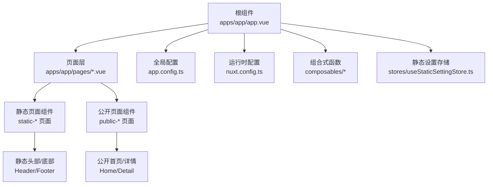
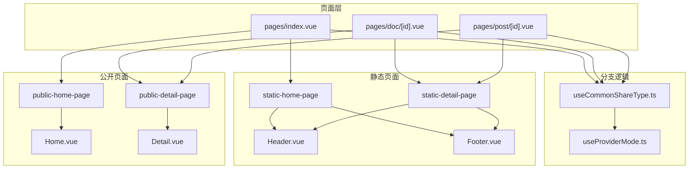
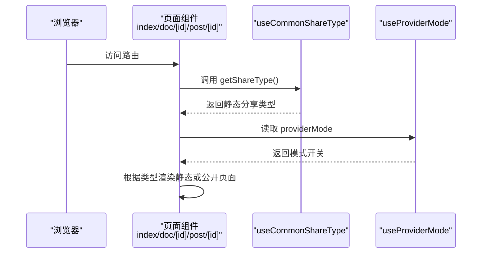
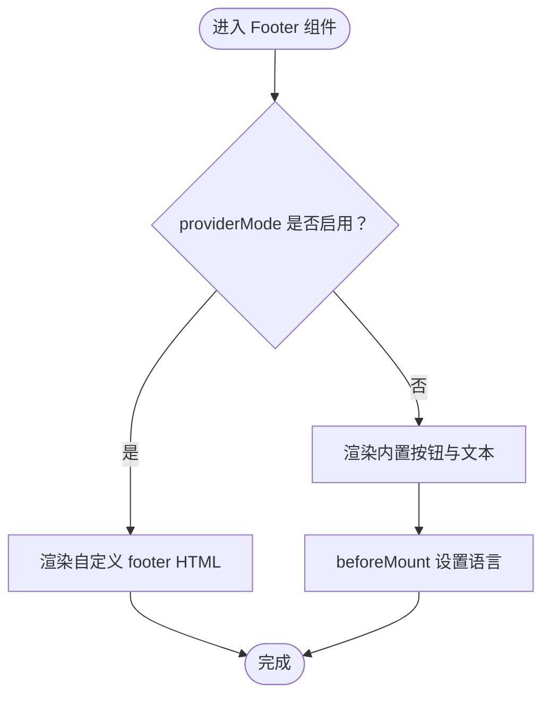
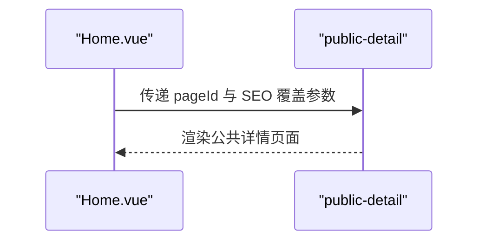
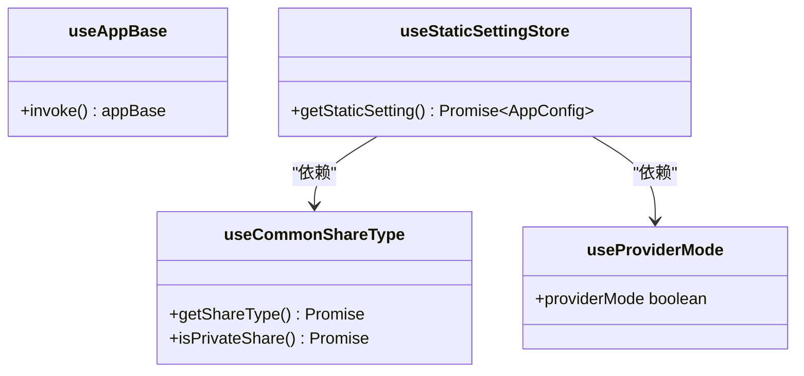
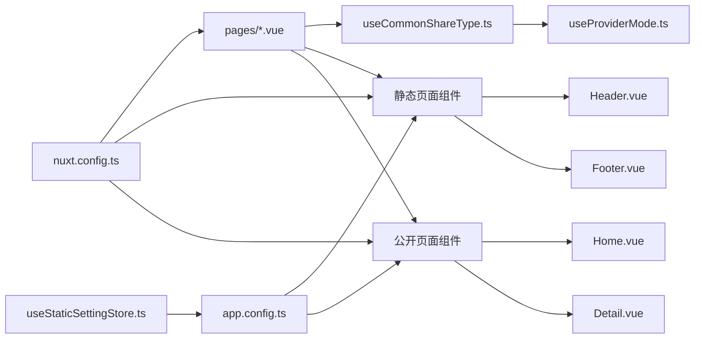

# 组件架构

<cite>
**本文引用的文件**
- [apps/app/app.vue](file://apps/app/app.vue)
- [apps/app/app.config.ts](file://apps/app/app.config.ts)
- [apps/app/nuxt.config.ts](file://apps/app/nuxt.config.ts)
- [apps/app/composables/useAppBase.ts](file://apps/app/composables/useAppBase.ts)
- [apps/app/stores/useStaticSettingStore.ts](file://apps/app/stores/useStaticSettingStore.ts)
- [apps/app/components/static/Header.vue](file://apps/app/components/static/Header.vue)
- [apps/app/components/static/Footer.vue](file://apps/app/components/static/Footer.vue)
- [apps/app/components/public/Home.vue](file://apps/app/components/public/Home.vue)
- [apps/app/components/public/Detail.vue](file://apps/app/components/public/Detail.vue)
- [apps/app/pages/index.vue](file://apps/app/pages/index.vue)
- [apps/app/pages/doc/[id].vue](file://apps/app/pages/doc/[id].vue)
- [apps/app/pages/post/[id].vue](file://apps/app/pages/post/[id].vue)
- [apps/app/composables/useCommonShareType.ts](file://apps/app/composables/useCommonShareType.ts)
- [apps/app/composables/useProviderMode.ts](file://apps/app/composables/useProviderMode.ts)
- [apps/app/utils/Constants.ts](file://apps/app/utils/Constants.ts)
</cite>

## 目录
1. [引言](#引言)
2. [项目结构](#项目结构)
3. [核心组件](#核心组件)
4. [架构总览](#架构总览)
5. [详细组件分析](#详细组件分析)
6. [依赖分析](#依赖分析)
7. [性能考虑](#性能考虑)
8. [故障排查指南](#故障排查指南)
9. [结论](#结论)
10. [附录](#附录)

## 引言
本文件系统性梳理 Siyuan Plugin Blog 的组件架构与设计模式，聚焦 Vue 3 Composition API 的使用、组件间通信机制、静态组件/公共组件/业务组件的分类与职责、生命周期与状态管理、事件处理、组件复用策略、依赖注入以及插槽的最佳实践，并通过多种图示展示组件关系与数据流。

## 项目结构
应用采用 Nuxt 3（SSR）作为前端框架，根组件负责页面渲染与加载态占位；页面层根据路由动态选择“静态分享”或“公开分享”的页面组件；公共与静态组件分别承担通用 UI 与静态站点展示职责；组合式函数（Composables）与 Pinia Store 提供跨组件的状态与逻辑复用；i18n、主题与资源通过 Nuxt 配置注入。

图表来源
- [apps/app/app.vue:10-24](file://apps/app/app.vue#L10-L24)
- [apps/app/pages/index.vue:13-28](file://apps/app/pages/index.vue#L13-L28)
- [apps/app/pages/doc/[id].vue:15-26](file://apps/app/pages/doc/[id].vue#L15-L26)
- [apps/app/pages/post/[id].vue:15-26](file://apps/app/pages/post/[id].vue#L15-L26)
- [apps/app/components/static/Header.vue:10-29](file://apps/app/components/static/Header.vue#L10-L29)
- [apps/app/components/static/Footer.vue:10-70](file://apps/app/components/static/Footer.vue#L10-L70)
- [apps/app/components/public/Home.vue:10-19](file://apps/app/components/public/Home.vue#L10-L19)
- [apps/app/components/public/Detail.vue:10-15](file://apps/app/components/public/Detail.vue#L10-L15)
- [apps/app/app.config.ts:28-91](file://apps/app/app.config.ts#L28-L91)
- [apps/app/nuxt.config.ts:20-124](file://apps/app/nuxt.config.ts#L20-L124)
- [apps/app/stores/useStaticSettingStore.ts:10-27](file://apps/app/stores/useStaticSettingStore.ts#L10-L27)

章节来源
- [apps/app/app.vue:10-24](file://apps/app/app.vue#L10-L24)
- [apps/app/nuxt.config.ts:20-124](file://apps/app/nuxt.config.ts#L20-L124)
- [apps/app/app.config.ts:28-91](file://apps/app/app.config.ts#L28-L91)

## 核心组件
- 根组件与加载态：根组件以 Suspense 包裹 NuxtPage，提供默认与回退视图，确保 SSR/CSR 场景下的稳定渲染与加载指示。
- 页面路由与分支：index、doc/[id]、post/[id] 等页面通过共享组合式函数判断分享类型，动态选择静态或公开页面组件。
- 静态站点组件：Header、Footer 等静态组件负责站点头部导航与页脚信息展示，支持主题与国际化。
- 公共页面组件：Home、Detail 等公共组件封装页面级逻辑，如首页重定向到指定页面 ID。
- 组合式函数与存储：useCommonShareType、useProviderMode、useStaticSettingStore 等提供跨组件共享能力与配置读取。

章节来源
- [apps/app/app.vue:10-24](file://apps/app/app.vue#L10-L24)
- [apps/app/pages/index.vue:13-28](file://apps/app/pages/index.vue#L13-L28)
- [apps/app/pages/doc/[id].vue:15-26](file://apps/app/pages/doc/[id].vue#L15-L26)
- [apps/app/pages/post/[id].vue:15-26](file://apps/app/pages/post/[id].vue#L15-L26)
- [apps/app/components/static/Header.vue:10-29](file://apps/app/components/static/Header.vue#L10-L29)
- [apps/app/components/static/Footer.vue:10-70](file://apps/app/components/static/Footer.vue#L10-L70)
- [apps/app/components/public/Home.vue:10-19](file://apps/app/components/public/Home.vue#L10-L19)
- [apps/app/components/public/Detail.vue:10-15](file://apps/app/components/public/Detail.vue#L10-L15)
- [apps/app/composables/useCommonShareType.ts:12-53](file://apps/app/composables/useCommonShareType.ts#L12-L53)
- [apps/app/composables/useProviderMode.ts:16-22](file://apps/app/composables/useProviderMode.ts#L16-L22)
- [apps/app/stores/useStaticSettingStore.ts:10-27](file://apps/app/stores/useStaticSettingStore.ts#L10-L27)

## 架构总览
整体采用“页面路由 -> 分支组件 -> 静态/公开页面 -> 通用 UI 组件”的分层架构。页面层通过组合式函数进行环境与分享类型判断，决定渲染静态或公开页面；静态页面由静态组件提供统一的头部与页脚；公共页面组件负责页面级行为（如首页跳转）；全局配置与运行时配置贯穿于构建期与运行期，保证主题、国际化、资源与环境变量的一致性。

图表来源
- [apps/app/pages/index.vue:13-28](file://apps/app/pages/index.vue#L13-L28)
- [apps/app/pages/doc/[id].vue:15-26](file://apps/app/pages/doc/[id].vue#L15-L26)
- [apps/app/pages/post/[id].vue:15-26](file://apps/app/pages/post/[id].vue#L15-L26)
- [apps/app/composables/useCommonShareType.ts:12-53](file://apps/app/composables/useCommonShareType.ts#L12-L53)
- [apps/app/composables/useProviderMode.ts:16-22](file://apps/app/composables/useProviderMode.ts#L16-L22)
- [apps/app/components/static/Header.vue:10-29](file://apps/app/components/static/Header.vue#L10-L29)
- [apps/app/components/static/Footer.vue:10-70](file://apps/app/components/static/Footer.vue#L10-L70)
- [apps/app/components/public/Home.vue:10-19](file://apps/app/components/public/Home.vue#L10-L19)
- [apps/app/components/public/Detail.vue:10-15](file://apps/app/components/public/Detail.vue#L10-L15)

## 详细组件分析

### 页面路由与分支逻辑
- 页面路由：index、doc/[id]、post/[id] 均设置 layout:false，直接渲染对应页面组件。
- 分支决策：通过 useCommonShareType 判断分享类型；在新版本中固定返回静态分享类型，从而统一走静态页面分支。
- 环境检测：useProviderMode 从运行时配置读取 providerMode，影响部分 UI 行为（如 Footer 中的主题切换按钮显示）。

图表来源
- [apps/app/pages/index.vue:13-28](file://apps/app/pages/index.vue#L13-L28)
- [apps/app/pages/doc/[id].vue:15-26](file://apps/app/pages/doc/[id].vue#L15-L26)
- [apps/app/pages/post/[id].vue:15-26](file://apps/app/pages/post/[id].vue#L15-L26)
- [apps/app/composables/useCommonShareType.ts:12-53](file://apps/app/composables/useCommonShareType.ts#L12-L53)
- [apps/app/composables/useProviderMode.ts:16-22](file://apps/app/composables/useProviderMode.ts#L16-L22)

章节来源
- [apps/app/pages/index.vue:13-28](file://apps/app/pages/index.vue#L13-L28)
- [apps/app/pages/doc/[id].vue:15-26](file://apps/app/pages/doc/[id].vue#L15-L26)
- [apps/app/pages/post/[id].vue:15-26](file://apps/app/pages/post/[id].vue#L15-L26)
- [apps/app/composables/useCommonShareType.ts:12-53](file://apps/app/composables/useCommonShareType.ts#L12-L53)
- [apps/app/composables/useProviderMode.ts:16-22](file://apps/app/composables/useProviderMode.ts#L16-L22)

### 静态站点组件（Header/ Footer）
- Header：接收全局配置对象，支持自定义 logo 与站点名称；通过国际化与主题工具渲染可变内容。
- Footer：根据 providerMode 决定显示内置按钮或自定义 HTML；在 beforeMount 阶段设置语言；提供主题切换事件回调。

图表来源
- [apps/app/components/static/Footer.vue:10-70](file://apps/app/components/static/Footer.vue#L10-L70)
- [apps/app/components/static/Header.vue:10-29](file://apps/app/components/static/Header.vue#L10-L29)

章节来源
- [apps/app/components/static/Header.vue:10-29](file://apps/app/components/static/Header.vue#L10-L29)
- [apps/app/components/static/Footer.vue:10-70](file://apps/app/components/static/Footer.vue#L10-L70)

### 公共页面组件（Home/ Detail）
- Home：接收 pageId，透传给公共详情页面组件，实现首页重定向到指定页面。
- Detail：当前版本提示公开分享已弃用，保留占位以便后续扩展。

图表来源
- [apps/app/components/public/Home.vue:10-19](file://apps/app/components/public/Home.vue#L10-L19)
- [apps/app/components/public/Detail.vue:10-15](file://apps/app/components/public/Detail.vue#L10-L15)

章节来源
- [apps/app/components/public/Home.vue:10-19](file://apps/app/components/public/Home.vue#L10-L19)
- [apps/app/components/public/Detail.vue:10-15](file://apps/app/components/public/Detail.vue#L10-L15)

### 组合式函数与状态管理
- useAppBase：提供应用基础路径，便于日志与资源定位。
- useCommonShareType：判断分享类型（当前版本固定为静态分享）。
- useProviderMode：读取运行时配置中的 providerMode。
- useStaticSettingStore：按请求 URL 读取静态配置 JSON，解析为全局配置对象，供页面与组件使用。

图表来源
- [apps/app/composables/useAppBase.ts:16-21](file://apps/app/composables/useAppBase.ts#L16-L21)
- [apps/app/composables/useCommonShareType.ts:12-53](file://apps/app/composables/useCommonShareType.ts#L12-L53)
- [apps/app/composables/useProviderMode.ts:16-22](file://apps/app/composables/useProviderMode.ts#L16-L22)
- [apps/app/stores/useStaticSettingStore.ts:10-27](file://apps/app/stores/useStaticSettingStore.ts#L10-L27)

章节来源
- [apps/app/composables/useAppBase.ts:16-21](file://apps/app/composables/useAppBase.ts#L16-L21)
- [apps/app/composables/useCommonShareType.ts:12-53](file://apps/app/composables/useCommonShareType.ts#L12-L53)
- [apps/app/composables/useProviderMode.ts:16-22](file://apps/app/composables/useProviderMode.ts#L16-L22)
- [apps/app/stores/useStaticSettingStore.ts:10-27](file://apps/app/stores/useStaticSettingStore.ts#L10-L27)

## 依赖分析
- 页面到分支：页面组件依赖 useCommonShareType 进行类型判断；类型判断依赖 useProviderMode 读取运行时配置。
- 页面到组件：页面根据类型渲染静态或公开页面；静态页面依赖 Header/Footer；公开页面依赖 Home/Detail。
- 配置与资源：全局配置来自 app.config.ts；运行时配置来自 nuxt.config.ts；静态设置通过 useStaticSettingStore 读取。

图表来源
- [apps/app/pages/index.vue:13-28](file://apps/app/pages/index.vue#L13-L28)
- [apps/app/pages/doc/[id].vue:15-26](file://apps/app/pages/doc/[id].vue#L15-L26)
- [apps/app/pages/post/[id].vue:15-26](file://apps/app/pages/post/[id].vue#L15-L26)
- [apps/app/composables/useCommonShareType.ts:12-53](file://apps/app/composables/useCommonShareType.ts#L12-L53)
- [apps/app/composables/useProviderMode.ts:16-22](file://apps/app/composables/useProviderMode.ts#L16-L22)
- [apps/app/components/static/Header.vue:10-29](file://apps/app/components/static/Header.vue#L10-L29)
- [apps/app/components/static/Footer.vue:10-70](file://apps/app/components/static/Footer.vue#L10-L70)
- [apps/app/components/public/Home.vue:10-19](file://apps/app/components/public/Home.vue#L10-L19)
- [apps/app/components/public/Detail.vue:10-15](file://apps/app/components/public/Detail.vue#L10-L15)
- [apps/app/app.config.ts:28-91](file://apps/app/app.config.ts#L28-L91)
- [apps/app/nuxt.config.ts:20-124](file://apps/app/nuxt.config.ts#L20-L124)
- [apps/app/stores/useStaticSettingStore.ts:10-27](file://apps/app/stores/useStaticSettingStore.ts#L10-L27)

章节来源
- [apps/app/pages/index.vue:13-28](file://apps/app/pages/index.vue#L13-L28)
- [apps/app/pages/doc/[id].vue:15-26](file://apps/app/pages/doc/[id].vue#L15-L26)
- [apps/app/pages/post/[id].vue:15-26](file://apps/app/pages/post/[id].vue#L15-L26)
- [apps/app/composables/useCommonShareType.ts:12-53](file://apps/app/composables/useCommonShareType.ts#L12-L53)
- [apps/app/composables/useProviderMode.ts:16-22](file://apps/app/composables/useProviderMode.ts#L16-L22)
- [apps/app/components/static/Header.vue:10-29](file://apps/app/components/static/Header.vue#L10-L29)
- [apps/app/components/static/Footer.vue:10-70](file://apps/app/components/static/Footer.vue#L10-L70)
- [apps/app/components/public/Home.vue:10-19](file://apps/app/components/public/Home.vue#L10-L19)
- [apps/app/components/public/Detail.vue:10-15](file://apps/app/components/public/Detail.vue#L10-L15)
- [apps/app/app.config.ts:28-91](file://apps/app/app.config.ts#L28-L91)
- [apps/app/nuxt.config.ts:20-124](file://apps/app/nuxt.config.ts#L20-L124)
- [apps/app/stores/useStaticSettingStore.ts:10-27](file://apps/app/stores/useStaticSettingStore.ts#L10-L27)

## 性能考虑
- Suspense 加载态：根组件使用 Suspense 提供回退视图，避免首屏空白，提升感知性能。
- 动态资源版本：构建时生成动态版本号，结合 CDN 与缓存策略减少重复下载。
- 组合式函数与存储：将配置读取与环境判断下沉至 Composables，避免重复计算与副作用，利于测试与复用。
- 主题与国际化：通过全局配置与运行时配置集中管理，减少组件内部硬编码，降低维护成本。

## 故障排查指南
- 分支逻辑异常：检查 useCommonShareType 的返回值与 useProviderMode 的运行时配置，确认 providerMode 与分享类型判定一致。
- 静态设置未生效：确认 useStaticSettingStore 的请求 URL 与静态配置文件名一致，检查网络请求与 JSON 解析结果。
- 主题或国际化不生效：核对 app.config.ts 与 nuxt.config.ts 的 head/link/script 注入顺序与版本号，确保资源加载成功。
- 页脚按钮不可见：Footer 在 providerMode 启用时会隐藏内置按钮并渲染自定义 HTML，请确认 providerMode 与 footer 字段配置。

章节来源
- [apps/app/composables/useCommonShareType.ts:12-53](file://apps/app/composables/useCommonShareType.ts#L12-L53)
- [apps/app/composables/useProviderMode.ts:16-22](file://apps/app/composables/useProviderMode.ts#L16-L22)
- [apps/app/stores/useStaticSettingStore.ts:10-27](file://apps/app/stores/useStaticSettingStore.ts#L10-L27)
- [apps/app/app.config.ts:28-91](file://apps/app/app.config.ts#L28-L91)
- [apps/app/nuxt.config.ts:20-124](file://apps/app/nuxt.config.ts#L20-L124)
- [apps/app/components/static/Footer.vue:10-70](file://apps/app/components/static/Footer.vue#L10-L70)

## 结论
该组件架构以 Nuxt 3 为核心，通过页面路由与组合式函数实现清晰的分支控制，静态组件与公共组件职责分离，配合全局配置与运行时配置，形成高内聚、低耦合的前端体系。Composition API 与 Pinia Store 的使用提升了可维护性与可测试性；Suspense 与资源版本化策略有效改善了用户体验与性能表现。

## 附录
- 关键常量：开发模式与第三方库版本等常量定义，便于在组件中进行条件渲染与调试。
  
章节来源
- [apps/app/utils/Constants.ts:10-17](file://apps/app/utils/Constants.ts#L10-L17)