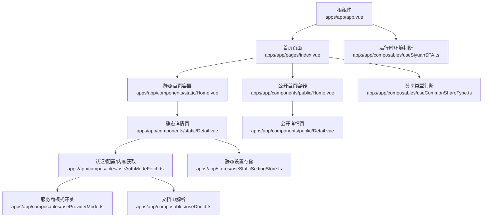
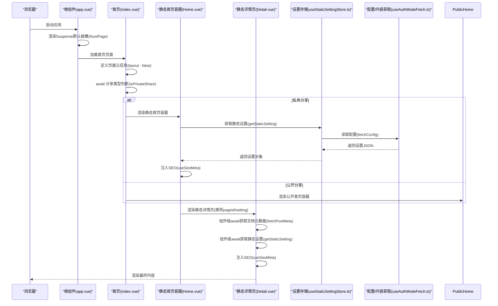
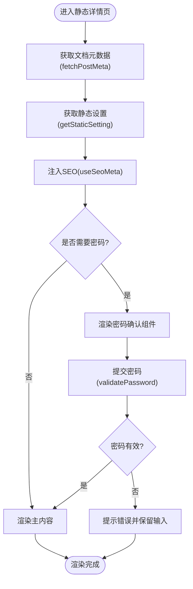
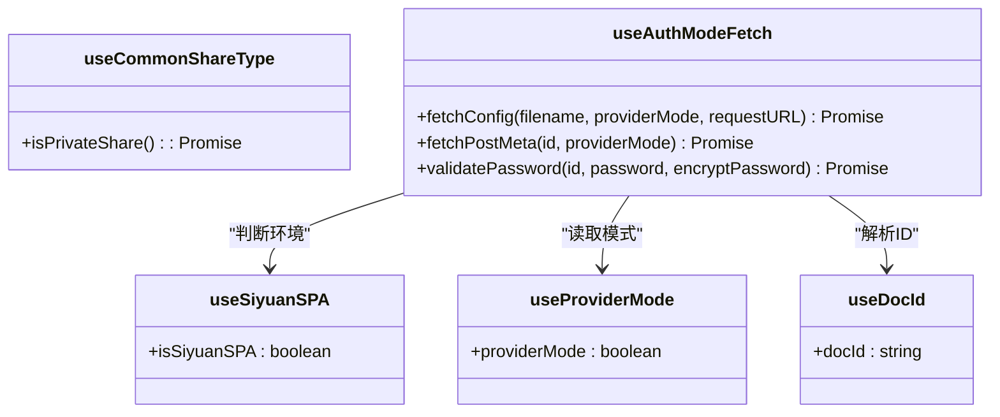
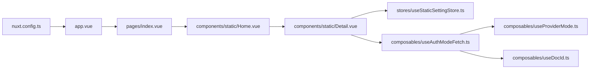

# 组件生命周期管理

<cite>
**本文引用的文件**
- [apps/app/app.vue](file://apps/app/app.vue)
- [apps/app/pages/index.vue](file://apps/app/pages/index.vue)
- [apps/app/components/static/Home.vue](file://apps/app/components/static/Home.vue)
- [apps/app/components/static/HomePage.vue](file://apps/app/components/static/HomePage.vue)
- [apps/app/components/static/Detail.vue](file://apps/app/components/static/Detail.vue)
- [apps/app/composables/useSiyuanSPA.ts](file://apps/app/composables/useSiyuanSPA.ts)
- [apps/app/composables/useCommonShareType.ts](file://apps/app/composables/useCommonShareType.ts)
- [apps/app/composables/useAuthModeFetch.ts](file://apps/app/composables/useAuthModeFetch.ts)
- [apps/app/composables/useProviderMode.ts](file://apps/app/composables/useProviderMode.ts)
- [apps/app/composables/useDocId.ts](file://apps/app/composables/useDocId.ts)
- [apps/app/stores/useStaticSettingStore.ts](file://apps/app/stores/useStaticSettingStore.ts)
- [apps/app/enums/ShareTypeEnum.ts](file://apps/app/enums/ShareTypeEnum.ts)
- [apps/app/utils/appLogger.ts](file://apps/app/utils/appLogger.ts)
- [apps/app/nuxt.config.ts](file://apps/app/nuxt.config.ts)
</cite>

## 目录
1. [引言](#引言)
2. [项目结构](#项目结构)
3. [核心组件](#核心组件)
4. [架构总览](#架构总览)
5. [详细组件分析](#详细组件分析)
6. [依赖关系分析](#依赖关系分析)
7. [性能考量](#性能考量)
8. [故障排查指南](#故障排查指南)
9. [结论](#结论)
10. [附录](#附录)

## 引言
本文件围绕 Vue 3 组件生命周期管理展开，结合项目中的 Nuxt 应用与静态分享场景，系统阐述应用启动流程、组件挂载与卸载过程、内存管理策略、Suspense 异步组件处理、错误边界与性能优化技巧，并给出生命周期钩子在具体场景中的应用、常见陷阱与解决方案，以及可复用的调试技巧。

## 项目结构
该项目基于 Nuxt 3 构建，采用按页面组织的路由结构，配合组合式 API（composables）与 Pinia Store 实现数据与逻辑的模块化。关键入口为根组件与页面级组件，通过 Suspense 提供异步加载占位，组件内部通过组合式函数完成环境判断、文档 ID 解析、配置与内容获取等生命周期阶段的工作。

图表来源
- [apps/app/app.vue:10-24](file://apps/app/app.vue#L10-L24)
- [apps/app/pages/index.vue:10-28](file://apps/app/pages/index.vue#L10-L28)
- [apps/app/components/static/Home.vue:10-17](file://apps/app/components/static/Home.vue#L10-L17)
- [apps/app/components/static/Detail.vue:10-130](file://apps/app/components/static/Detail.vue#L10-L130)
- [apps/app/composables/useSiyuanSPA.ts:10-15](file://apps/app/composables/useSiyuanSPA.ts#L10-L15)
- [apps/app/composables/useCommonShareType.ts:12-53](file://apps/app/composables/useCommonShareType.ts#L12-L53)
- [apps/app/composables/useAuthModeFetch.ts:15-318](file://apps/app/composables/useAuthModeFetch.ts#L15-L318)
- [apps/app/stores/useStaticSettingStore.ts:10-27](file://apps/app/stores/useStaticSettingStore.ts#L10-L27)
- [apps/app/composables/useProviderMode.ts:16-22](file://apps/app/composables/useProviderMode.ts#L16-L22)
- [apps/app/composables/useDocId.ts:13-28](file://apps/app/composables/useDocId.ts#L13-L28)

章节来源
- [apps/app/app.vue:10-24](file://apps/app/app.vue#L10-L24)
- [apps/app/pages/index.vue:10-28](file://apps/app/pages/index.vue#L10-L28)
- [apps/app/nuxt.config.ts:15-124](file://apps/app/nuxt.config.ts#L15-L124)

## 核心组件
- 根组件与 Suspense：根组件包裹 NuxtPage 于 Suspense 下，提供默认加载态占位，体现应用启动阶段的异步渲染与用户体验保障。
- 首页页面：根据分享类型决定渲染静态或公开首页容器。
- 静态首页容器：承载首页 SEO 与设置注入，负责页面级生命周期的初始化与资源准备。
- 静态详情页：在组件级完成文档元数据与设置的异步获取、SEO 注入、密码校验与内容渲染，是生命周期异步处理的典型范例。
- 组合式函数：统一处理环境判断、分享类型、服务商模式、文档 ID、配置与内容获取等，降低页面复杂度并提升可维护性。
- 配置存储：以 Store 形式封装静态设置的获取与缓存逻辑，便于跨组件共享。

章节来源
- [apps/app/app.vue:10-24](file://apps/app/app.vue#L10-L24)
- [apps/app/pages/index.vue:10-28](file://apps/app/pages/index.vue#L10-L28)
- [apps/app/components/static/HomePage.vue:10-45](file://apps/app/components/static/HomePage.vue#L10-L45)
- [apps/app/components/static/Detail.vue:10-130](file://apps/app/components/static/Detail.vue#L10-L130)
- [apps/app/composables/useSiyuanSPA.ts:10-15](file://apps/app/composables/useSiyuanSPA.ts#L10-L15)
- [apps/app/composables/useCommonShareType.ts:12-53](file://apps/app/composables/useCommonShareType.ts#L12-L53)
- [apps/app/composables/useAuthModeFetch.ts:15-318](file://apps/app/composables/useAuthModeFetch.ts#L15-L318)
- [apps/app/stores/useStaticSettingStore.ts:10-27](file://apps/app/stores/useStaticSettingStore.ts#L10-L27)

## 架构总览
下图展示从应用启动到页面渲染的关键路径：根组件 Suspense 包裹页面，页面根据分享类型选择静态或公开容器；静态容器进一步加载详情页，详情页在组件级完成异步数据获取、SEO 注入与渲染控制。

图表来源
- [apps/app/app.vue:10-24](file://apps/app/app.vue#L10-L24)
- [apps/app/pages/index.vue:10-28](file://apps/app/pages/index.vue#L10-L28)
- [apps/app/components/static/Home.vue:10-17](file://apps/app/components/static/Home.vue#L10-L17)
- [apps/app/components/static/HomePage.vue:10-45](file://apps/app/components/static/HomePage.vue#L10-L45)
- [apps/app/components/static/Detail.vue:10-130](file://apps/app/components/static/Detail.vue#L10-L130)
- [apps/app/stores/useStaticSettingStore.ts:10-27](file://apps/app/stores/useStaticSettingStore.ts#L10-L27)
- [apps/app/composables/useAuthModeFetch.ts:15-318](file://apps/app/composables/useAuthModeFetch.ts#L15-L318)

## 详细组件分析

### 根组件与 Suspense 生命周期
- 角色与职责：根组件作为应用入口，负责顶层异步渲染的兜底显示，避免首屏空白或闪烁。
- 生命周期要点：
  - 挂载阶段：根组件渲染 Suspense，默认插槽承载 NuxtPage；fallback 插槽提供加载指示器。
  - 更新阶段：当路由切换导致页面异步资源加载时，Suspense 内部会自动切换默认与 fallback 视图。
  - 卸载阶段：离开页面时，Suspense 对应的页面实例被销毁，资源释放由 Nuxt/框架层处理。
- 最佳实践：
  - 使用语义化的 fallback 提示，避免空洞的骨架。
  - 将耗时任务下沉至页面级或组件级，减少根 Suspense 的压力。
  - 在页面级使用更细粒度的 Suspense，提升交互体验。

章节来源
- [apps/app/app.vue:10-24](file://apps/app/app.vue#L10-L24)

### 首页页面与页面元信息
- 角色与职责：首页页面负责根据分享类型决定渲染静态或公开首页容器，并通过页面元信息关闭布局以减少不必要的渲染。
- 生命周期要点：
  - 挂载阶段：在脚本阶段执行异步逻辑（如分享类型判断），随后根据结果渲染对应容器。
  - 更新阶段：分享类型一旦确定，页面内容稳定，无需额外更新。
  - 卸载阶段：离开页面时，容器与子组件按常规生命周期销毁。
- 最佳实践：
  - 将“仅一次”的异步判断放在页面脚本阶段，避免在模板中进行昂贵计算。
  - 页面级布局关闭后，确保子组件不再依赖全局布局样式，避免额外重排。

章节来源
- [apps/app/pages/index.vue:10-28](file://apps/app/pages/index.vue#L10-L28)

### 静态首页容器与 SEO 注入
- 角色与职责：静态首页容器负责获取站点设置并注入 SEO 元信息，保证首屏 SEO 与标题描述一致。
- 生命周期要点：
  - 挂载阶段：await 获取静态设置，随后调用 SEO 注入接口，确保在组件渲染前完成。
  - 更新阶段：设置变更需触发重新注入，建议在设置变化时显式刷新。
  - 卸载阶段：页面卸载时，SEO 注入由框架清理。
- 最佳实践：
  - 将 SEO 注入前置到组件级生命周期早期，避免闪烁。
  - 对于频繁变动的设置，考虑缓存与失效策略，减少重复请求。

章节来源
- [apps/app/components/static/HomePage.vue:10-45](file://apps/app/components/static/HomePage.vue#L10-L45)
- [apps/app/stores/useStaticSettingStore.ts:10-27](file://apps/app/stores/useStaticSettingStore.ts#L10-L27)

### 静态详情页：组件级异步生命周期
- 角色与职责：静态详情页承担文档元数据与设置的获取、SEO 注入、密码校验与内容渲染，是生命周期异步处理的集中体现。
- 生命周期要点：
  - 挂载阶段：在组件脚本阶段并发或串行执行“获取文档元数据”和“获取静态设置”，随后注入 SEO。
  - 更新阶段：根据分享状态、过期状态与密码输入动态切换渲染分支。
  - 卸载阶段：离开详情页时，释放与页面相关的事件监听与定时器（如有）。
- 最佳实践：
  - 将“不可变”的初始化逻辑置于组件脚本阶段，确保渲染前完成。
  - 对外部 API 调用进行错误捕获与降级处理，避免阻塞渲染。
  - 对于可能长时间运行的任务，提供进度反馈或分段加载。

图表来源
- [apps/app/components/static/Detail.vue:10-130](file://apps/app/components/static/Detail.vue#L10-L130)
- [apps/app/composables/useAuthModeFetch.ts:15-318](file://apps/app/composables/useAuthModeFetch.ts#L15-L318)
- [apps/app/stores/useStaticSettingStore.ts:10-27](file://apps/app/stores/useStaticSettingStore.ts#L10-L27)

章节来源
- [apps/app/components/static/Detail.vue:10-130](file://apps/app/components/static/Detail.vue#L10-L130)

### 组合式函数与运行时环境
- useSiyuanSPA：用于判断当前是否处于 Siyuan SPA 环境，影响资源访问策略。
- useCommonShareType：统一返回分享类型（当前版本固定为静态分享），简化页面逻辑。
- useProviderMode：读取运行时配置，判断是否启用服务商模式。
- useDocId：解析路由参数中的文档 ID，兼容不同后缀。
- useAuthModeFetch：封装配置与内容获取、密码校验、服务商模式下的远程调用等，是组件级生命周期异步任务的核心。

图表来源
- [apps/app/composables/useSiyuanSPA.ts:10-15](file://apps/app/composables/useSiyuanSPA.ts#L10-L15)
- [apps/app/composables/useCommonShareType.ts:12-53](file://apps/app/composables/useCommonShareType.ts#L12-L53)
- [apps/app/composables/useProviderMode.ts:16-22](file://apps/app/composables/useProviderMode.ts#L16-L22)
- [apps/app/composables/useDocId.ts:13-28](file://apps/app/composables/useDocId.ts#L13-L28)
- [apps/app/composables/useAuthModeFetch.ts:15-318](file://apps/app/composables/useAuthModeFetch.ts#L15-L318)

章节来源
- [apps/app/composables/useSiyuanSPA.ts:10-15](file://apps/app/composables/useSiyuanSPA.ts#L10-L15)
- [apps/app/composables/useCommonShareType.ts:12-53](file://apps/app/composables/useCommonShareType.ts#L12-L53)
- [apps/app/composables/useProviderMode.ts:16-22](file://apps/app/composables/useProviderMode.ts#L16-L22)
- [apps/app/composables/useDocId.ts:13-28](file://apps/app/composables/useDocId.ts#L13-L28)
- [apps/app/composables/useAuthModeFetch.ts:15-318](file://apps/app/composables/useAuthModeFetch.ts#L15-L318)

### 配置存储与静态设置
- 角色与职责：以 Store 形式封装静态设置的获取与解析，避免重复请求与跨组件重复解析。
- 生命周期要点：
  - 初始化：在组件首次需要时获取设置。
  - 缓存：在客户端可利用本地存储缓存配置文本，减少重复请求。
  - 更新：当配置发生变更时，需提供刷新机制或失效策略。
- 最佳实践：
  - 将 Store 设计为按需懒加载，避免首屏负担。
  - 对于频繁访问的设置项，考虑在 Store 内部做二次缓存。

章节来源
- [apps/app/stores/useStaticSettingStore.ts:10-27](file://apps/app/stores/useStaticSettingStore.ts#L10-L27)

### 错误边界与异常处理
- 页面级异常：在获取文档元数据与设置时进行 try/catch，失败时降级为“未分享”或“已过期”等友好提示。
- 组件级异常：密码校验失败时提示用户并保留输入，避免强制刷新。
- 日志与可观测性：通过统一日志工厂输出关键信息，便于定位问题。

章节来源
- [apps/app/components/static/Detail.vue:79-82](file://apps/app/components/static/Detail.vue#L79-L82)
- [apps/app/components/static/Detail.vue:126-128](file://apps/app/components/static/Detail.vue#L126-L128)
- [apps/app/utils/appLogger.ts:20-22](file://apps/app/utils/appLogger.ts#L20-L22)

## 依赖关系分析
- 组件耦合：页面与容器之间通过 props 传递数据，容器与详情页之间通过 props 与 Store 共享设置，组合式函数作为横切关注点贯穿各层。
- 外部依赖：Nuxt 生态（路由、SSR、Head 管理）、第三方库（Element Plus、Pinia、国际化等）。
- 运行时配置：通过 Nuxt runtimeConfig 提供环境变量，影响资源访问与模式切换。

图表来源
- [apps/app/pages/index.vue:10-28](file://apps/app/pages/index.vue#L10-L28)
- [apps/app/components/static/Home.vue:10-17](file://apps/app/components/static/Home.vue#L10-L17)
- [apps/app/components/static/Detail.vue:10-130](file://apps/app/components/static/Detail.vue#L10-L130)
- [apps/app/stores/useStaticSettingStore.ts:10-27](file://apps/app/stores/useStaticSettingStore.ts#L10-L27)
- [apps/app/composables/useAuthModeFetch.ts:15-318](file://apps/app/composables/useAuthModeFetch.ts#L15-L318)
- [apps/app/composables/useProviderMode.ts:16-22](file://apps/app/composables/useProviderMode.ts#L16-L22)
- [apps/app/composables/useDocId.ts:13-28](file://apps/app/composables/useDocId.ts#L13-L28)
- [apps/app/app.vue:10-24](file://apps/app/app.vue#L10-L24)
- [apps/app/nuxt.config.ts:15-124](file://apps/app/nuxt.config.ts#L15-L124)

章节来源
- [apps/app/nuxt.config.ts:15-124](file://apps/app/nuxt.config.ts#L15-L124)

## 性能考量
- 首屏渲染：将 SEO 注入与静态设置获取前置到组件脚本阶段，减少二次渲染。
- 异步资源：对耗时任务进行分组与并发控制，避免阻塞主线程。
- 缓存策略：利用本地存储缓存配置文本，降低重复请求成本。
- Suspense 使用：在根组件与页面级分别使用 Suspense，提升交互体验。
- SSR 与 CSR：区分服务端与客户端行为，避免重复执行与状态污染。

## 故障排查指南
- 页面空白或闪烁：检查根组件 Suspense 是否正确包裹页面，fallback 是否合理。
- 首页 SEO 未生效：确认静态设置获取成功且在组件脚本阶段完成 SEO 注入。
- 文档未分享或已过期：检查获取文档元数据的返回值与过期判断逻辑。
- 密码校验失败：核对密码校验接口返回与前端提示逻辑。
- 日志定位：通过统一日志工厂输出关键步骤，结合浏览器开发者工具 Network 面板与 Console 定位问题。

章节来源
- [apps/app/app.vue:10-24](file://apps/app/app.vue#L10-L24)
- [apps/app/components/static/HomePage.vue:10-45](file://apps/app/components/static/HomePage.vue#L10-L45)
- [apps/app/components/static/Detail.vue:79-82](file://apps/app/components/static/Detail.vue#L79-L82)
- [apps/app/components/static/Detail.vue:126-128](file://apps/app/components/static/Detail.vue#L126-L128)
- [apps/app/utils/appLogger.ts:20-22](file://apps/app/utils/appLogger.ts#L20-L22)

## 结论
本项目通过根组件 Suspense、页面级生命周期与组合式函数，构建了清晰的异步渲染与资源加载路径。静态详情页作为生命周期异步处理的典型代表，展示了如何在组件级完成数据获取、SEO 注入与渲染控制。遵循本文的最佳实践与故障排查建议，可在保证用户体验的同时提升系统的稳定性与可维护性。

## 附录
- 分享类型枚举：用于标识分享模式（当前版本固定为静态分享）。
- 运行时配置：提供默认类型、API 地址与服务商模式等关键参数，影响组件行为与资源访问策略。

章节来源
- [apps/app/enums/ShareTypeEnum.ts:13-25](file://apps/app/enums/ShareTypeEnum.ts#L13-L25)
- [apps/app/nuxt.config.ts:114-121](file://apps/app/nuxt.config.ts#L114-L121)