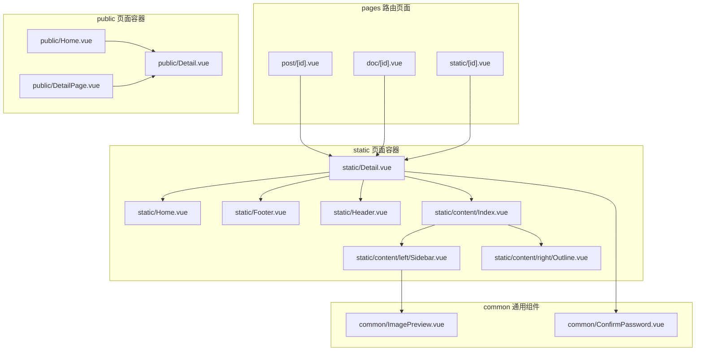
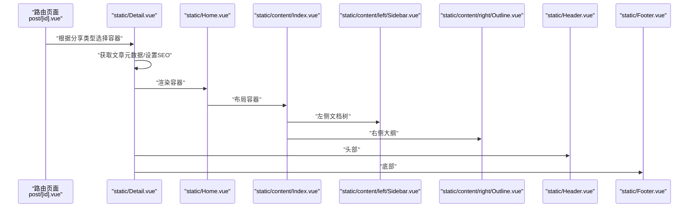
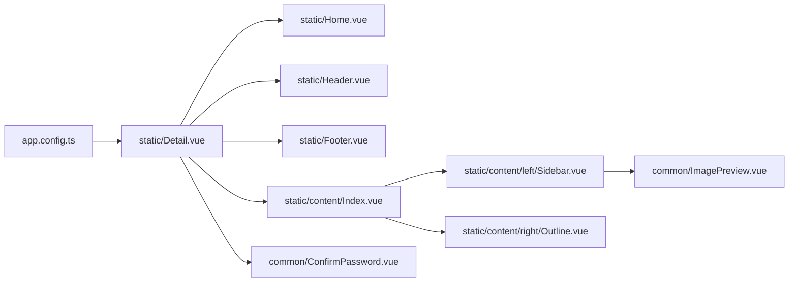

# 组件类型与分类

<cite>
**本文引用的文件**
- [apps/app/components/static/Home.vue](file://apps/app/components/static/Home.vue)
- [apps/app/components/public/Home.vue](file://apps/app/components/public/Home.vue)
- [apps/app/components/static/Detail.vue](file://apps/app/components/static/Detail.vue)
- [apps/app/components/public/Detail.vue](file://apps/app/components/public/Detail.vue)
- [apps/app/components/public/DetailPage.vue](file://apps/app/components/public/DetailPage.vue)
- [apps/app/components/common/ImagePreview.vue](file://apps/app/components/common/ImagePreview.vue)
- [apps/app/components/common/ConfirmPassword.vue](file://apps/app/components/common/ConfirmPassword.vue)
- [apps/app/components/static/Footer.vue](file://apps/app/components/static/Footer.vue)
- [apps/app/components/static/Header.vue](file://apps/app/components/static/Header.vue)
- [apps/app/components/static/content/Index.vue](file://apps/app/components/static/content/Index.vue)
- [apps/app/components/static/content/left/Sidebar.vue](file://apps/app/components/static/content/left/Sidebar.vue)
- [apps/app/components/static/content/right/Outline.vue](file://apps/app/components/static/content/right/Outline.vue)
- [apps/app/pages/post/[id].vue](file://apps/app/pages/post/[id].vue)
- [apps/app/pages/doc/[id].vue](file://apps/app/pages/doc/[id].vue)
- [apps/app/pages/static/[id].vue](file://apps/app/pages/static/[id].vue)
- [apps/app/app.config.ts](file://apps/app/app.config.ts)
</cite>

## 目录
1. [引言](#引言)
2. [项目结构](#项目结构)
3. [核心组件](#核心组件)
4. [架构总览](#架构总览)
5. [详细组件分析](#详细组件分析)
6. [依赖分析](#依赖分析)
7. [性能考虑](#性能考虑)
8. [故障排查指南](#故障排查指南)
9. [结论](#结论)
10. [附录](#附录)

## 引言
本文件系统性梳理 Siyuan Plugin Blog 中“静态组件”“公共组件”“业务组件”的类型划分、职责边界、命名规范、文件组织与依赖关系，并提供最佳实践与选型建议，帮助开发者在扩展或维护时快速定位组件角色与使用场景。

## 项目结构
围绕组件分类，项目采用按“类型 + 功能域”分层组织：
- components/static：面向“静态分享页”的页面级容器与布局组件，负责静态内容渲染、SEO、主题与导航等。
- components/public：面向“公开分享页”的页面级容器与布局组件，当前公开分享能力已标记弃用。
- components/common：跨页面复用的通用交互组件，如图片预览、密码确认等。
- pages：路由级页面，依据分享类型动态选择 static 或 public 容器组件。

图表来源
- [apps/app/pages/post/[id].vue](file://apps/app/pages/post/[id].vue#L1-L27)
- [apps/app/pages/doc/[id].vue](file://apps/app/pages/doc/[id].vue#L1-L27)
- [apps/app/pages/static/[id].vue](file://apps/app/pages/static/[id].vue#L1-L27)
- [apps/app/components/static/Home.vue:1-18](file://apps/app/components/static/Home.vue#L1-L18)
- [apps/app/components/static/Detail.vue:1-173](file://apps/app/components/static/Detail.vue#L1-L173)
- [apps/app/components/static/Footer.vue:1-115](file://apps/app/components/static/Footer.vue#L1-L115)
- [apps/app/components/static/Header.vue:1-131](file://apps/app/components/static/Header.vue#L1-L131)
- [apps/app/components/static/content/Index.vue:1-43](file://apps/app/components/static/content/Index.vue#L1-L43)
- [apps/app/components/static/content/left/Sidebar.vue:1-154](file://apps/app/components/static/content/left/Sidebar.vue#L1-L154)
- [apps/app/components/static/content/right/Outline.vue:1-130](file://apps/app/components/static/content/right/Outline.vue#L1-L130)
- [apps/app/components/public/Home.vue:1-20](file://apps/app/components/public/Home.vue#L1-L20)
- [apps/app/components/public/Detail.vue:1-18](file://apps/app/components/public/Detail.vue#L1-L18)
- [apps/app/components/public/DetailPage.vue:1-20](file://apps/app/components/public/DetailPage.vue#L1-L20)
- [apps/app/components/common/ImagePreview.vue:1-64](file://apps/app/components/common/ImagePreview.vue#L1-L64)
- [apps/app/components/common/ConfirmPassword.vue:1-181](file://apps/app/components/common/ConfirmPassword.vue#L1-L181)

章节来源
- [apps/app/pages/post/[id].vue](file://apps/app/pages/post/[id].vue#L1-L27)
- [apps/app/pages/doc/[id].vue](file://apps/app/pages/doc/[id].vue#L1-L27)
- [apps/app/pages/static/[id].vue](file://apps/app/pages/static/[id].vue#L1-L27)

## 核心组件
- 静态组件（static）：以“静态分享”为核心目标，负责文章详情页的完整渲染、SEO 元信息注入、主题与导航、目录与侧边文档树等。
- 公共组件（public）：以“公开分享”为核心目标，当前公开分享能力已标记弃用，仅保留页面容器以便兼容。
- 通用组件（common）：跨页面复用的交互组件，如图片预览、密码确认等。

章节来源
- [apps/app/components/static/Detail.vue:1-173](file://apps/app/components/static/Detail.vue#L1-L173)
- [apps/app/components/public/Detail.vue:1-18](file://apps/app/components/public/Detail.vue#L1-L18)
- [apps/app/components/common/ConfirmPassword.vue:1-181](file://apps/app/components/common/ConfirmPassword.vue#L1-L181)

## 架构总览
静态分享页的典型调用链：路由页面根据分享类型选择 static 或 public；static 容器加载文章元数据、设置 SEO、渲染头部/主内容/底部，并通过布局组件组合侧边文档树与右侧大纲。

图表来源
- [apps/app/pages/post/[id].vue](file://apps/app/pages/post/[id].vue#L1-L27)
- [apps/app/components/static/Detail.vue:1-173](file://apps/app/components/static/Detail.vue#L1-L173)
- [apps/app/components/static/Home.vue:1-18](file://apps/app/components/static/Home.vue#L1-L18)
- [apps/app/components/static/content/Index.vue:1-43](file://apps/app/components/static/content/Index.vue#L1-L43)
- [apps/app/components/static/content/left/Sidebar.vue:1-154](file://apps/app/components/static/content/left/Sidebar.vue#L1-L154)
- [apps/app/components/static/content/right/Outline.vue:1-130](file://apps/app/components/static/content/right/Outline.vue#L1-L130)
- [apps/app/components/static/Header.vue:1-131](file://apps/app/components/static/Header.vue#L1-L131)
- [apps/app/components/static/Footer.vue:1-115](file://apps/app/components/static/Footer.vue#L1-L115)

## 详细组件分析

### 静态组件（static）
- static/Detail.vue
  - 职责：加载文章元数据、处理分享权限与过期校验、注入 SEO、按需展示密码输入与渲染主体布局。
  - 使用场景：静态分享页的核心容器，承载头部、主内容、底部三大区域。
  - 关键点：支持私有分享与公开分享两种模式，自动注入 SEO 元信息，暴露密码提交回调。
- static/Home.vue
  - 职责：作为静态分享页的页面级容器，接收 pageId 并透传给静态详情容器。
  - 使用场景：路由层选择 static 容器时的入口。
- static/Footer.vue / static/Header.vue
  - 职责：渲染站点页脚与头部，支持主题切换、国际化与首页跳转。
  - 使用场景：静态分享页的通用头部与页脚。
- static/content/Index.vue
  - 职责：三栏布局容器，组合左侧文档树、中间主内容、右侧大纲。
  - 使用场景：静态分享页的页面骨架。
- static/content/left/Sidebar.vue
  - 职责：基于文档树生成可展开的导航菜单，支持从文档树跳转并高亮当前项。
  - 使用场景：长文档或知识库场景下的导航与跳转。
- static/content/right/Outline.vue
  - 职责：解析标题层级并渲染右侧大纲，支持固定定位与深色模式适配。
  - 使用场景：移动端或窄屏下提供快速导航。

章节来源
- [apps/app/components/static/Detail.vue:1-173](file://apps/app/components/static/Detail.vue#L1-L173)
- [apps/app/components/static/Home.vue:1-18](file://apps/app/components/static/Home.vue#L1-L18)
- [apps/app/components/static/Footer.vue:1-115](file://apps/app/components/static/Footer.vue#L1-L115)
- [apps/app/components/static/Header.vue:1-131](file://apps/app/components/static/Header.vue#L1-L131)
- [apps/app/components/static/content/Index.vue:1-43](file://apps/app/components/static/content/Index.vue#L1-L43)
- [apps/app/components/static/content/left/Sidebar.vue:1-154](file://apps/app/components/static/content/left/Sidebar.vue#L1-L154)
- [apps/app/components/static/content/right/Outline.vue:1-130](file://apps/app/components/static/content/right/Outline.vue#L1-L130)

### 公共组件（public）
- public/Detail.vue
  - 职责：公开分享页的详情容器，当前版本提示公开分享已弃用。
  - 使用场景：兼容旧版本或保留接口。
- public/Home.vue
  - 职责：公开分享页的页面级容器，接收 pageId 并透传给详情容器。
  - 使用场景：路由层选择 public 容器时的入口。
- public/DetailPage.vue
  - 职责：包装公开详情容器，作为页面级组件。
  - 使用场景：路由层选择 public 容器时的入口。

章节来源
- [apps/app/components/public/Detail.vue:1-18](file://apps/app/components/public/Detail.vue#L1-L18)
- [apps/app/components/public/Home.vue:1-20](file://apps/app/components/public/Home.vue#L1-L20)
- [apps/app/components/public/DetailPage.vue:1-20](file://apps/app/components/public/DetailPage.vue#L1-L20)

### 通用组件（common）
- common/ConfirmPassword.vue
  - 职责：提供密码输入表单与校验，支持外部触发重置与赋值，暴露提交事件。
  - 使用场景：静态分享页的密码授权流程。
- common/ImagePreview.vue
  - 职责：封装图片弹窗预览，支持多图切换与索引控制，暴露 show 方法。
  - 使用场景：静态分享页的图片查看与预览。

章节来源
- [apps/app/components/common/ConfirmPassword.vue:1-181](file://apps/app/components/common/ConfirmPassword.vue#L1-L181)
- [apps/app/components/common/ImagePreview.vue:1-64](file://apps/app/components/common/ImagePreview.vue#L1-L64)

### 页面级路由与选择逻辑
- post/[id].vue、doc/[id].vue、static/[id].vue
  - 职责：根据分享类型判断是否私有分享，动态选择 static 或 public 容器。
  - 使用场景：统一入口，屏蔽分享类型差异。

章节来源
- [apps/app/pages/post/[id].vue](file://apps/app/pages/post/[id].vue#L1-L27)
- [apps/app/pages/doc/[id].vue](file://apps/app/pages/doc/[id].vue#L1-L27)
- [apps/app/pages/static/[id].vue](file://apps/app/pages/static/[id].vue#L1-L27)

## 依赖分析
- 组件耦合与内聚
  - static/Detail.vue 对 app.config.ts 的配置强依赖，用于控制主题、导航、目录等行为。
  - static/content/Index.vue 内部组合 static/content/left/Sidebar.vue 与 static/content/right/Outline.vue，形成稳定的页面骨架。
  - static/Detail.vue 依赖 common/ConfirmPassword.vue 实现密码授权流程。
- 外部依赖
  - Element Plus、Vue i18n、zhi-common 等第三方库被广泛使用于静态组件与通用组件中。
- 循环依赖
  - 当前结构未见明显循环依赖，组件间通过 props 与事件进行解耦。

图表来源
- [apps/app/app.config.ts:1-92](file://apps/app/app.config.ts#L1-L92)
- [apps/app/components/static/Detail.vue:1-173](file://apps/app/components/static/Detail.vue#L1-L173)
- [apps/app/components/static/Home.vue:1-18](file://apps/app/components/static/Home.vue#L1-L18)
- [apps/app/components/static/Header.vue:1-131](file://apps/app/components/static/Header.vue#L1-L131)
- [apps/app/components/static/Footer.vue:1-115](file://apps/app/components/static/Footer.vue#L1-L115)
- [apps/app/components/static/content/Index.vue:1-43](file://apps/app/components/static/content/Index.vue#L1-L43)
- [apps/app/components/static/content/left/Sidebar.vue:1-154](file://apps/app/components/static/content/left/Sidebar.vue#L1-L154)
- [apps/app/components/static/content/right/Outline.vue:1-130](file://apps/app/components/static/content/right/Outline.vue#L1-L130)
- [apps/app/components/common/ConfirmPassword.vue:1-181](file://apps/app/components/common/ConfirmPassword.vue#L1-L181)
- [apps/app/components/common/ImagePreview.vue:1-64](file://apps/app/components/common/ImagePreview.vue#L1-L64)

章节来源
- [apps/app/app.config.ts:1-92](file://apps/app/app.config.ts#L1-L92)

## 性能考虑
- 按需渲染与懒加载
  - static/Detail.vue 中对头部、主内容、底部采用容器化拆分，有利于按需渲染与缓存。
  - static/content/left/Sidebar.vue 与 static/content/right/Outline.vue 采用滚动条与固定定位，减少重排。
- 数据获取与缓存
  - static/Detail.vue 在首次进入时拉取文章元数据，避免重复请求；建议结合缓存策略降低后端压力。
- 图片预览
  - common/ImagePreview.vue 仅在触发时显示，避免不必要的 DOM 与资源占用。

## 故障排查指南
- 密码授权失败
  - 现象：输入密码后提示不匹配。
  - 排查：检查 static/Detail.vue 中密码校验流程与 common/ConfirmPassword.vue 的表单校验规则。
- 分享过期或未开放
  - 现象：页面显示“未分享”或“已过期”。
  - 排查：确认 static/Detail.vue 中的过期校验逻辑与分享状态字段。
- SEO 元信息异常
  - 现象：页面标题或描述不符合预期。
  - 排查：检查 static/Detail.vue 中 useSeoMeta 的注入逻辑与 app.config.ts 的站点配置。
- 主题与导航不生效
  - 现象：头部 logo、站点名称或导航不显示。
  - 排查：核对 app.config.ts 的 themeConfig 与 header 字段，以及 static/Header.vue 的渲染逻辑。

章节来源
- [apps/app/components/static/Detail.vue:1-173](file://apps/app/components/static/Detail.vue#L1-L173)
- [apps/app/components/common/ConfirmPassword.vue:1-181](file://apps/app/components/common/ConfirmPassword.vue#L1-L181)
- [apps/app/app.config.ts:1-92](file://apps/app/app.config.ts#L1-L92)
- [apps/app/components/static/Header.vue:1-131](file://apps/app/components/static/Header.vue#L1-L131)

## 结论
- 静态组件（static）适用于“静态分享”场景，强调页面骨架、SEO、主题与导航的统一管理。
- 公共组件（public）当前已标记弃用，建议迁移至静态组件体系。
- 通用组件（common）提供跨页面复用能力，应保持低耦合与高内聚。
- 建议在新增组件时明确其类型与职责，遵循“单一职责”“按需加载”“可测试性”原则，确保长期可维护性。

## 附录

### 组件命名规范与文件组织
- 命名规范
  - 静态组件：static/*，如 static/Detail.vue、static/Footer.vue。
  - 公共组件：public/*，如 public/Detail.vue、public/DetailPage.vue。
  - 通用组件：common/*，如 common/ConfirmPassword.vue、common/ImagePreview.vue。
- 文件组织
  - 按功能域分层：components/static/content/left、components/static/content/right 下进一步细分左右侧与大纲。
  - 页面容器与通用组件分离，避免页面容器承担过多业务逻辑。

章节来源
- [apps/app/components/static/Home.vue:1-18](file://apps/app/components/static/Home.vue#L1-L18)
- [apps/app/components/public/Home.vue:1-20](file://apps/app/components/public/Home.vue#L1-L20)
- [apps/app/components/common/ImagePreview.vue:1-64](file://apps/app/components/common/ImagePreview.vue#L1-L64)
- [apps/app/components/common/ConfirmPassword.vue:1-181](file://apps/app/components/common/ConfirmPassword.vue#L1-L181)
- [apps/app/components/static/content/left/Sidebar.vue:1-154](file://apps/app/components/static/content/left/Sidebar.vue#L1-L154)
- [apps/app/components/static/content/right/Outline.vue:1-130](file://apps/app/components/static/content/right/Outline.vue#L1-L130)