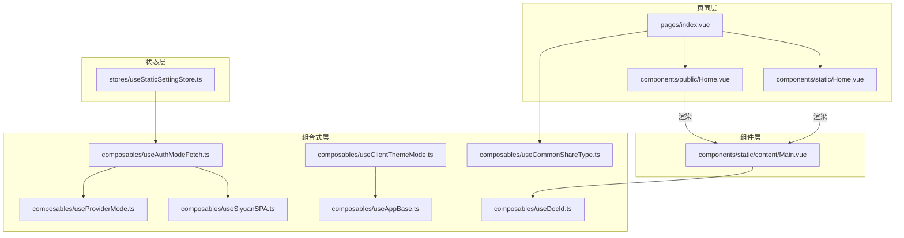
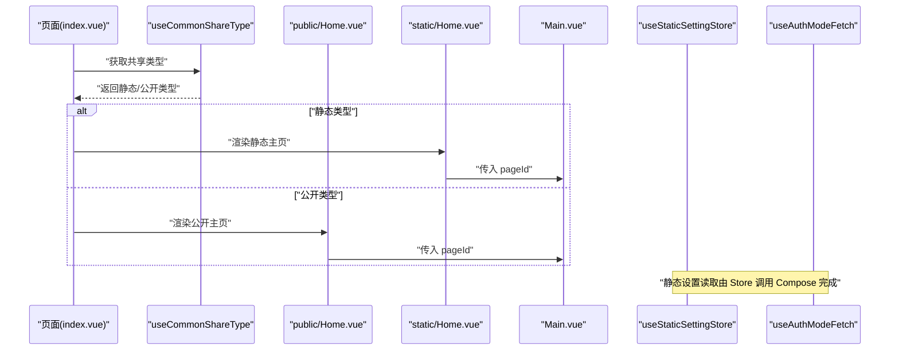
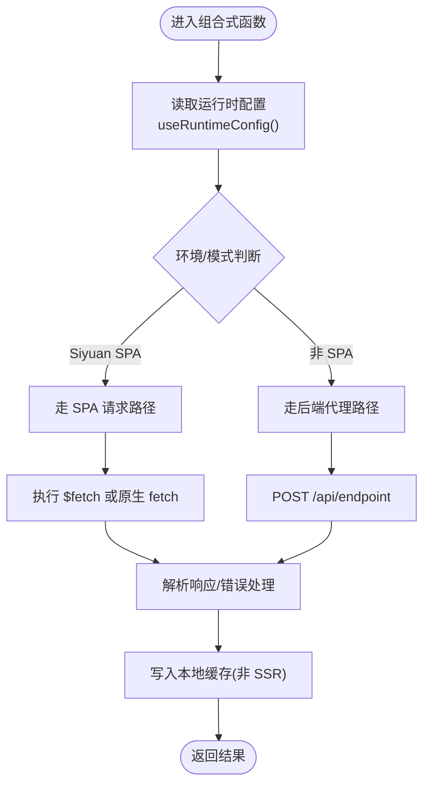
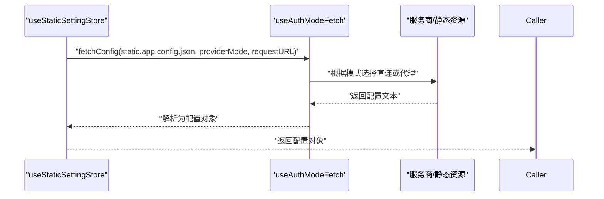
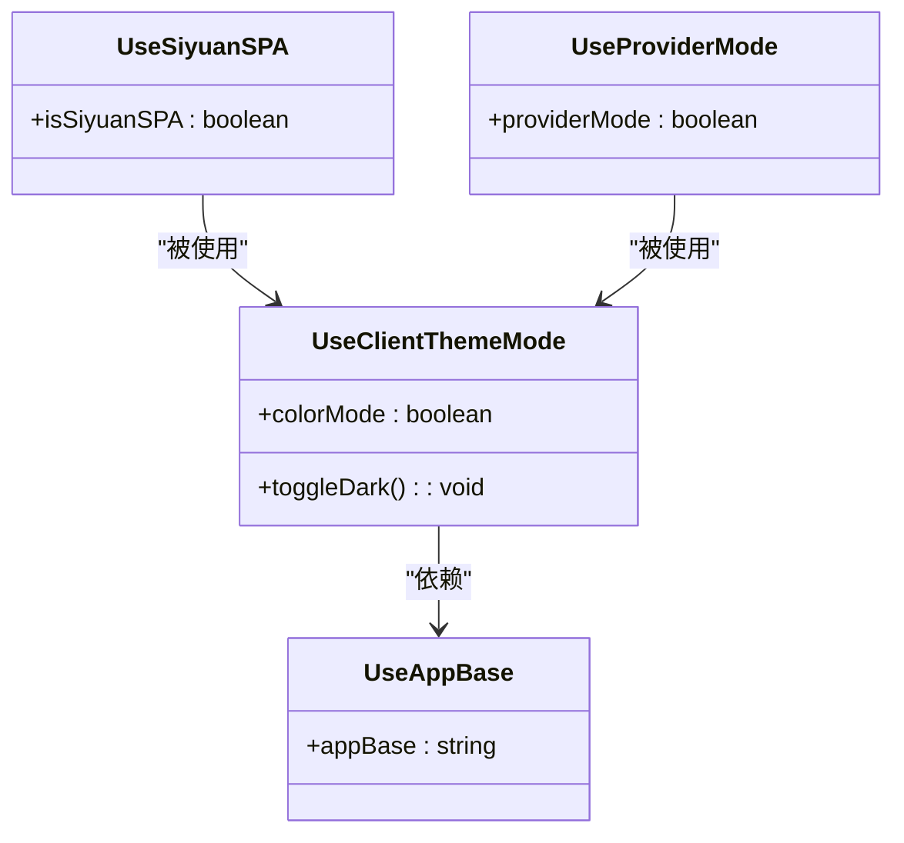
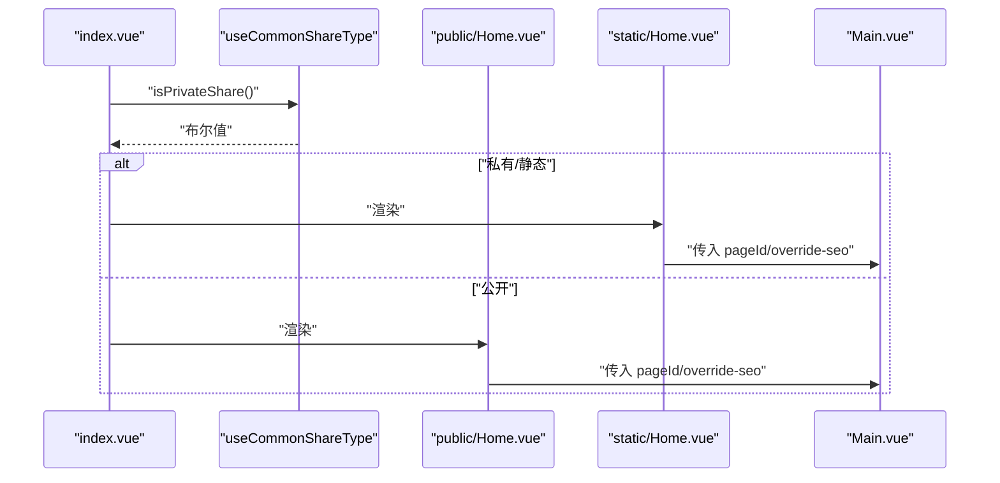
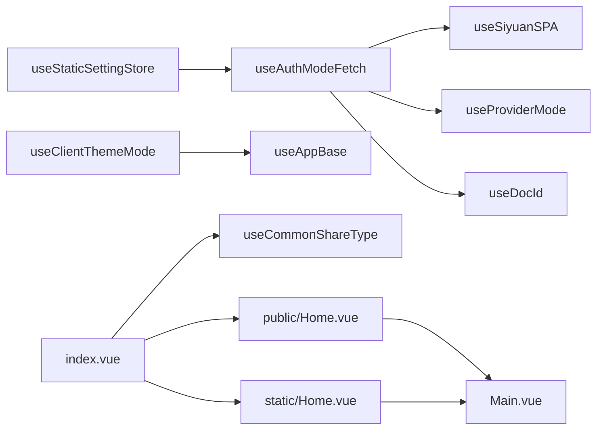

# 组件设计模式

<cite>
**本文引用的文件**
- [apps/app/composables/useAppBase.ts](file://apps/app/composables/useAppBase.ts)
- [apps/app/composables/useAuthModeFetch.ts](file://apps/app/composables/useAuthModeFetch.ts)
- [apps/app/composables/useClientThemeMode.ts](file://apps/app/composables/useClientThemeMode.ts)
- [apps/app/composables/useProviderMode.ts](file://apps/app/composables/useProviderMode.ts)
- [apps/app/composables/useDocId.ts](file://apps/app/composables/useDocId.ts)
- [apps/app/composables/useSiyuanSPA.ts](file://apps/app/composables/useSiyuanSPA.ts)
- [apps/app/stores/useStaticSettingStore.ts](file://apps/app/stores/useStaticSettingStore.ts)
- [apps/app/components/static/content/Main.vue](file://apps/app/components/static/content/Main.vue)
- [apps/app/pages/index.vue](file://apps/app/pages/index.vue)
- [apps/app/components/public/Home.vue](file://apps/app/components/public/Home.vue)
- [apps/app/components/static/Home.vue](file://apps/app/components/static/Home.vue)
- [apps/app/composables/useCommonShareType.ts](file://apps/app/composables/useCommonShareType.ts)
</cite>

## 目录
1. [引言](#引言)
2. [项目结构](#项目结构)
3. [核心组件](#核心组件)
4. [架构总览](#架构总览)
5. [详细组件分析](#详细组件分析)
6. [依赖关系分析](#依赖关系分析)
7. [性能考量](#性能考量)
8. [故障排查指南](#故障排查指南)
9. [结论](#结论)
10. [附录](#附录)

## 引言
本文件系统性梳理 Siyuan Plugin Blog 在前端应用层所采用的组件设计模式与工程化实践，重点覆盖以下主题：
- 组合式 API 模式：如何通过可复用的 composable 抽象业务与平台能力（如环境检测、主题切换、文档 ID 解析等）。
- 状态管理模式：如何在 Nuxt/Pinia 生态下组织静态配置与运行时状态，确保 SSR 与 CSR 场景的一致性。
- 依赖注入模式：通过 useRuntimeConfig、useRoute、useHead 等机制实现“运行时注入”，解耦配置与组件。
- 插槽模式：通过动态组件与条件渲染实现内容分发与布局复用。

同时，文档提供模式对比、接口设计原则、复用策略与最佳实践建议，帮助读者在保持可维护性的前提下扩展功能。

## 项目结构
前端应用位于 apps/app，采用 Nuxt 13（App）与 Siyuan 插件（siyuan）双入口。围绕“页面-组件-组合式函数-状态存储”的层次化组织，形成清晰的职责边界：
- pages：页面路由与入口，负责根据共享类型决定渲染静态或公开主页。
- components：页面级与内容级组件，承担视图与交互；内容组件常通过插槽/动态组件进行内容分发。
- composables：跨页面/组件的可复用逻辑，封装环境探测、网络请求、主题与路由等。
- stores：基于 Pinia 的静态设置存储，统一读取与解析静态配置。
- server：后端代理端点与工具，用于安全地访问受保护资源。

图表来源
- [apps/app/pages/index.vue:10-28](file://apps/app/pages/index.vue#L10-L28)
- [apps/app/components/public/Home.vue:10-16](file://apps/app/components/public/Home.vue#L10-L16)
- [apps/app/components/static/Home.vue:10-16](file://apps/app/components/static/Home.vue#L10-L16)
- [apps/app/components/static/content/Main.vue:10-27](file://apps/app/components/static/content/Main.vue#L10-L27)
- [apps/app/composables/useDocId.ts:13-27](file://apps/app/composables/useDocId.ts#L13-L27)
- [apps/app/composables/useSiyuanSPA.ts:10-14](file://apps/app/composables/useSiyuanSPA.ts#L10-L14)
- [apps/app/composables/useProviderMode.ts:16-21](file://apps/app/composables/useProviderMode.ts#L16-L21)
- [apps/app/composables/useAuthModeFetch.ts:15-318](file://apps/app/composables/useAuthModeFetch.ts#L15-L318)
- [apps/app/composables/useClientThemeMode.ts:23-156](file://apps/app/composables/useClientThemeMode.ts#L23-L156)
- [apps/app/composables/useAppBase.ts:16-21](file://apps/app/composables/useAppBase.ts#L16-L21)
- [apps/app/composables/useCommonShareType.ts:12-53](file://apps/app/composables/useCommonShareType.ts#L12-L53)
- [apps/app/stores/useStaticSettingStore.ts:10-26](file://apps/app/stores/useStaticSettingStore.ts#L10-L26)

章节来源
- [apps/app/pages/index.vue:10-28](file://apps/app/pages/index.vue#L10-L28)
- [apps/app/components/public/Home.vue:10-16](file://apps/app/components/public/Home.vue#L10-L16)
- [apps/app/components/static/Home.vue:10-16](file://apps/app/components/static/Home.vue#L10-L16)
- [apps/app/components/static/content/Main.vue:10-27](file://apps/app/components/static/content/Main.vue#L10-L27)
- [apps/app/composables/useDocId.ts:13-27](file://apps/app/composables/useDocId.ts#L13-L27)
- [apps/app/composables/useSiyuanSPA.ts:10-14](file://apps/app/composables/useSiyuanSPA.ts#L10-L14)
- [apps/app/composables/useProviderMode.ts:16-21](file://apps/app/composables/useProviderMode.ts#L16-L21)
- [apps/app/composables/useAuthModeFetch.ts:15-318](file://apps/app/composables/useAuthModeFetch.ts#L15-L318)
- [apps/app/composables/useClientThemeMode.ts:23-156](file://apps/app/composables/useClientThemeMode.ts#L23-L156)
- [apps/app/composables/useAppBase.ts:16-21](file://apps/app/composables/useAppBase.ts#L16-L21)
- [apps/app/composables/useCommonShareType.ts:12-53](file://apps/app/composables/useCommonShareType.ts#L12-L53)
- [apps/app/stores/useStaticSettingStore.ts:10-26](file://apps/app/stores/useStaticSettingStore.ts#L10-L26)

## 核心组件
- 页面入口与路由决策：index.vue 基于共享类型判断渲染公开主页还是静态主页，体现“按类型注入”的依赖注入思想。
- 内容主组件：Main.vue 作为内容容器，通过动态 VNode 与指令集渲染富文本内容，并以 client-only 包裹图片预览，展示插槽/延迟渲染的组合使用。
- 配置与状态：useStaticSettingStore 聚合静态配置读取流程，统一返回应用配置对象，体现状态管理的集中化与可测试性。
- 主题与环境：useClientThemeMode 与 useAppBase 结合，通过 useHead 注入样式与属性，实现主题模式切换与版本控制。
- 网络与模式：useAuthModeFetch 抽象“认证模式/服务商模式”下的配置与文档元数据获取，屏蔽环境差异。

章节来源
- [apps/app/pages/index.vue:10-28](file://apps/app/pages/index.vue#L10-L28)
- [apps/app/components/static/content/Main.vue:10-68](file://apps/app/components/static/content/Main.vue#L10-L68)
- [apps/app/stores/useStaticSettingStore.ts:10-26](file://apps/app/stores/useStaticSettingStore.ts#L10-L26)
- [apps/app/composables/useClientThemeMode.ts:23-156](file://apps/app/composables/useClientThemeMode.ts#L23-L156)
- [apps/app/composables/useAppBase.ts:16-21](file://apps/app/composables/useAppBase.ts#L16-L21)
- [apps/app/composables/useAuthModeFetch.ts:15-318](file://apps/app/composables/useAuthModeFetch.ts#L15-L318)

## 架构总览
整体采用“页面-组件-组合式-状态-服务器代理”的分层架构。页面负责路由与类型判定；组件负责视图与交互；组合式函数负责跨域、环境与平台能力；状态存储负责静态配置的统一读取；服务器代理提供安全访问与跨域兜底。

图表来源
- [apps/app/pages/index.vue:10-28](file://apps/app/pages/index.vue#L10-L28)
- [apps/app/composables/useCommonShareType.ts:12-53](file://apps/app/composables/useCommonShareType.ts#L12-L53)
- [apps/app/components/public/Home.vue:10-16](file://apps/app/components/public/Home.vue#L10-L16)
- [apps/app/components/static/Home.vue:10-16](file://apps/app/components/static/Home.vue#L10-L16)
- [apps/app/components/static/content/Main.vue:10-17](file://apps/app/components/static/content/Main.vue#L10-L17)
- [apps/app/stores/useStaticSettingStore.ts:10-26](file://apps/app/stores/useStaticSettingStore.ts#L10-L26)
- [apps/app/composables/useAuthModeFetch.ts:15-318](file://apps/app/composables/useAuthModeFetch.ts#L15-L318)

## 详细组件分析

### 组合式 API 模式
- 设计要点
  - 将可复用逻辑封装为独立函数，返回响应式状态与方法，便于多组件共享。
  - 通过 useRuntimeConfig、useRoute、useHead 等运行时注入，隔离平台差异。
  - 通过 useDocId、useSiyuanSPA、useProviderMode 等组合式函数，统一环境探测与参数解析。
- 实现方式
  - useDocId：从路由参数中提取文档 ID，并做后缀清理，保证下游调用一致性。
  - useSiyuanSPA：读取运行时配置，判断是否处于 Siyuan SPA 环境，影响后续网络请求策略。
  - useProviderMode：判断是否启用服务商模式，驱动配置与文档元数据的获取分支。
  - useAuthModeFetch：在不同模式下选择直连 public 资源或经后端代理访问，统一错误处理与缓存策略。
  - useClientThemeMode：结合 useAppBase 与 useColorMode，动态注入主题样式与版本号，支持暗色/亮色切换。
  - useAppBase：提供应用基础路径，避免硬编码，提升部署灵活性。
- 优势
  - 低耦合：组合式函数仅暴露必要接口，内部细节可演进。
  - 易测试：纯函数式组合式易于单元测试。
  - 可复用：跨页面/组件共享同一套逻辑，减少重复代码。

图表来源
- [apps/app/composables/useSiyuanSPA.ts:10-14](file://apps/app/composables/useSiyuanSPA.ts#L10-L14)
- [apps/app/composables/useAuthModeFetch.ts:15-318](file://apps/app/composables/useAuthModeFetch.ts#L15-L318)

章节来源
- [apps/app/composables/useDocId.ts:13-27](file://apps/app/composables/useDocId.ts#L13-L27)
- [apps/app/composables/useSiyuanSPA.ts:10-14](file://apps/app/composables/useSiyuanSPA.ts#L10-L14)
- [apps/app/composables/useProviderMode.ts:16-21](file://apps/app/composables/useProviderMode.ts#L16-L21)
- [apps/app/composables/useAuthModeFetch.ts:15-318](file://apps/app/composables/useAuthModeFetch.ts#L15-L318)
- [apps/app/composables/useClientThemeMode.ts:23-156](file://apps/app/composables/useClientThemeMode.ts#L23-L156)
- [apps/app/composables/useAppBase.ts:16-21](file://apps/app/composables/useAppBase.ts#L16-L21)

### 状态管理模式
- 设计要点
  - 使用 Pinia 存储静态设置，避免在组件中直接处理配置读取细节。
  - 通过 useStaticSettingStore 统一入口，集中解析与调试日志。
- 实现方式
  - useStaticSettingStore：调用 useAuthModeFetch 获取配置文本，解析为配置对象并返回。
  - 该 store 以工厂函数形式接收 requestURL，确保 SSR 场景下的 URL 可控。
- 优势
  - 单一可信源：所有页面/组件共享同一份静态配置。
  - SSR 友好：通过工厂函数注入 URL，避免运行时不确定性。

图表来源
- [apps/app/stores/useStaticSettingStore.ts:10-26](file://apps/app/stores/useStaticSettingStore.ts#L10-L26)
- [apps/app/composables/useAuthModeFetch.ts:15-318](file://apps/app/composables/useAuthModeFetch.ts#L15-L318)

章节来源
- [apps/app/stores/useStaticSettingStore.ts:10-26](file://apps/app/stores/useStaticSettingStore.ts#L10-L26)
- [apps/app/composables/useAuthModeFetch.ts:15-318](file://apps/app/composables/useAuthModeFetch.ts#L15-L318)

### 依赖注入模式
- 设计要点
  - 通过 useRuntimeConfig 注入环境变量（如 providerUrl、defaultType、providerMode），在组合式函数中统一读取。
  - 通过 useHead 动态注入样式与属性，实现主题与版本控制的“运行时注入”。
- 实现方式
  - useSiyuanSPA：读取 defaultType，判断是否为 siyuan 类型，影响请求策略。
  - useProviderMode：读取 providerMode，决定配置与文档元数据的获取分支。
  - useClientThemeMode：读取 lightTheme/darkTheme/themeVersion 等参数，动态拼接样式链接。
- 优势
  - 配置与组件解耦：组件无需关心具体配置值，只需消费注入的运行时参数。
  - 部署灵活：通过环境变量即可切换模式与主题，无需修改代码。

图表来源
- [apps/app/composables/useSiyuanSPA.ts:10-14](file://apps/app/composables/useSiyuanSPA.ts#L10-L14)
- [apps/app/composables/useProviderMode.ts:16-21](file://apps/app/composables/useProviderMode.ts#L16-L21)
- [apps/app/composables/useClientThemeMode.ts:23-156](file://apps/app/composables/useClientThemeMode.ts#L23-L156)
- [apps/app/composables/useAppBase.ts:16-21](file://apps/app/composables/useAppBase.ts#L16-L21)

章节来源
- [apps/app/composables/useSiyuanSPA.ts:10-14](file://apps/app/composables/useSiyuanSPA.ts#L10-L14)
- [apps/app/composables/useProviderMode.ts:16-21](file://apps/app/composables/useProviderMode.ts#L16-L21)
- [apps/app/composables/useClientThemeMode.ts:23-156](file://apps/app/composables/useClientThemeMode.ts#L23-L156)
- [apps/app/composables/useAppBase.ts:16-21](file://apps/app/composables/useAppBase.ts#L16-L21)

### 插槽模式
- 设计要点
  - 通过动态组件与条件渲染实现内容分发：页面根据共享类型选择公开或静态主页。
  - 内容组件通过 props 接收数据，内部以动态 VNode 渲染富文本，并通过 client-only 延迟挂载重型子组件（如图片预览）。
- 实现方式
  - index.vue：根据 isPrivateShare 决定渲染 public-home-page 或 static-home-page。
  - public/Home.vue 与 static/Home.vue：均向子组件传递 pageId，并可关闭 SEO 或标题装饰。
  - Main.vue：接收 post 与 setting，通过 h 动态生成内容节点，并在客户端挂载图片预览。
- 优势
  - 视图解耦：页面只负责类型判定，具体渲染由子组件完成。
  - 性能友好：client-only 降低首屏渲染压力，提升交互体验。

图表来源
- [apps/app/pages/index.vue:10-28](file://apps/app/pages/index.vue#L10-L28)
- [apps/app/composables/useCommonShareType.ts:12-53](file://apps/app/composables/useCommonShareType.ts#L12-L53)
- [apps/app/components/public/Home.vue:10-16](file://apps/app/components/public/Home.vue#L10-L16)
- [apps/app/components/static/Home.vue:10-16](file://apps/app/components/static/Home.vue#L10-L16)
- [apps/app/components/static/content/Main.vue:10-17](file://apps/app/components/static/content/Main.vue#L10-L17)

章节来源
- [apps/app/pages/index.vue:10-28](file://apps/app/pages/index.vue#L10-L28)
- [apps/app/components/public/Home.vue:10-16](file://apps/app/components/public/Home.vue#L10-L16)
- [apps/app/components/static/Home.vue:10-16](file://apps/app/components/static/Home.vue#L10-L16)
- [apps/app/components/static/content/Main.vue:10-68](file://apps/app/components/static/content/Main.vue#L10-L68)
- [apps/app/composables/useCommonShareType.ts:12-53](file://apps/app/composables/useCommonShareType.ts#L12-L53)

## 依赖关系分析
- 组合式函数之间的依赖
  - useAuthModeFetch 依赖 useSiyuanSPA、useProviderMode、useDocId，用于在不同运行时与模式下选择请求路径。
  - useClientThemeMode 依赖 useAppBase、useColorMode、useRoute，用于动态注入样式与主题切换。
- 页面与组件的依赖
  - index.vue 依赖 useCommonShareType，决定渲染公开或静态主页。
  - public/Home.vue 与 static/Home.vue 依赖 Main.vue，后者承载富文本渲染与图片预览。
- 状态存储与组合式的依赖
  - useStaticSettingStore 依赖 useAuthModeFetch 与 useProviderMode，统一静态配置读取。

图表来源
- [apps/app/composables/useAuthModeFetch.ts:15-318](file://apps/app/composables/useAuthModeFetch.ts#L15-L318)
- [apps/app/composables/useSiyuanSPA.ts:10-14](file://apps/app/composables/useSiyuanSPA.ts#L10-L14)
- [apps/app/composables/useProviderMode.ts:16-21](file://apps/app/composables/useProviderMode.ts#L16-L21)
- [apps/app/composables/useDocId.ts:13-27](file://apps/app/composables/useDocId.ts#L13-L27)
- [apps/app/composables/useClientThemeMode.ts:23-156](file://apps/app/composables/useClientThemeMode.ts#L23-L156)
- [apps/app/composables/useAppBase.ts:16-21](file://apps/app/composables/useAppBase.ts#L16-L21)
- [apps/app/stores/useStaticSettingStore.ts:10-26](file://apps/app/stores/useStaticSettingStore.ts#L10-L26)
- [apps/app/pages/index.vue:10-28](file://apps/app/pages/index.vue#L10-L28)
- [apps/app/components/public/Home.vue:10-16](file://apps/app/components/public/Home.vue#L10-L16)
- [apps/app/components/static/Home.vue:10-16](file://apps/app/components/static/Home.vue#L10-L16)
- [apps/app/components/static/content/Main.vue:10-17](file://apps/app/components/static/content/Main.vue#L10-L17)

章节来源
- [apps/app/composables/useAuthModeFetch.ts:15-318](file://apps/app/composables/useAuthModeFetch.ts#L15-L318)
- [apps/app/composables/useSiyuanSPA.ts:10-14](file://apps/app/composables/useSiyuanSPA.ts#L10-L14)
- [apps/app/composables/useProviderMode.ts:16-21](file://apps/app/composables/useProviderMode.ts#L16-L21)
- [apps/app/composables/useDocId.ts:13-27](file://apps/app/composables/useDocId.ts#L13-L27)
- [apps/app/composables/useClientThemeMode.ts:23-156](file://apps/app/composables/useClientThemeMode.ts#L23-L156)
- [apps/app/composables/useAppBase.ts:16-21](file://apps/app/composables/useAppBase.ts#L16-L21)
- [apps/app/stores/useStaticSettingStore.ts:10-26](file://apps/app/stores/useStaticSettingStore.ts#L10-L26)
- [apps/app/pages/index.vue:10-28](file://apps/app/pages/index.vue#L10-L28)
- [apps/app/components/public/Home.vue:10-16](file://apps/app/components/public/Home.vue#L10-L16)
- [apps/app/components/static/Home.vue:10-16](file://apps/app/components/static/Home.vue#L10-L16)
- [apps/app/components/static/content/Main.vue:10-17](file://apps/app/components/static/content/Main.vue#L10-L17)

## 性能考量
- 按需加载与延迟渲染
  - 使用 client-only 包裹重型子组件（如图片预览），减少首屏渲染负担。
  - 通过 useHead 动态注入样式，避免一次性加载过多主题资源。
- 缓存策略
  - 在非 SSR 场景下将配置文本写入 localStorage，降低重复请求成本。
- 网络路径优化
  - 在 Siyuan SPA 环境优先直连，否则走后端代理，兼顾安全性与性能。
- 主题切换
  - 通过 data-* 属性与动态链接切换主题与代码高亮样式，避免全量重绘。

## 故障排查指南
- 配置读取失败
  - 确认 providerMode 与 defaultType 是否正确，检查 useProviderMode 与 useSiyuanSPA 的返回值。
  - 若走代理路径，确认 /api/endpoint 可用且返回格式符合预期。
- 主题样式异常
  - 检查 useClientThemeMode 注入的 data-theme-mode、data-light-theme、data-dark-theme 是否正确。
  - 确认 appBase 与版本号参数有效，避免样式链接 404。
- 文档 ID 解析问题
  - 检查 useDocId 的路由参数与后缀清理逻辑，确保最终 ID 合法。
- 密码校验失败
  - 核对 validatePassword 的请求参数与后端接口返回，关注错误日志输出。

章节来源
- [apps/app/composables/useAuthModeFetch.ts:15-318](file://apps/app/composables/useAuthModeFetch.ts#L15-L318)
- [apps/app/composables/useClientThemeMode.ts:23-156](file://apps/app/composables/useClientThemeMode.ts#L23-L156)
- [apps/app/composables/useDocId.ts:13-27](file://apps/app/composables/useDocId.ts#L13-L27)
- [apps/app/composables/useSiyuanSPA.ts:10-14](file://apps/app/composables/useSiyuanSPA.ts#L10-L14)
- [apps/app/composables/useProviderMode.ts:16-21](file://apps/app/composables/useProviderMode.ts#L16-L21)

## 结论
本项目通过组合式 API、状态管理、依赖注入与插槽模式，构建了高内聚、低耦合且具备良好扩展性的前端架构。其关键价值在于：
- 将平台差异与网络策略抽象为组合式函数，组件层保持纯净。
- 通过 Pinia 与运行时注入实现配置与主题的集中化管理。
- 通过插槽与动态组件实现内容分发与性能优化。
建议在后续迭代中持续完善错误边界与日志体系，增强可观测性与可维护性。

## 附录
- 最佳实践建议
  - 将“环境探测/网络请求/主题注入”等横切关注点收敛至组合式函数，避免在组件中分散处理。
  - 对外部依赖（如后端代理）增加统一的错误包装与降级策略。
  - 对动态样式注入与 client-only 组件进行性能监控，避免过度渲染。
  - 对配置读取增加缓存与失效策略，平衡实时性与性能。
- 模式对比
  - 组合式 API vs Mixins：组合式更易测试与复用，推荐优先使用。
  - 依赖注入 vs 硬编码：通过 useRuntimeConfig 注入配置，提升部署灵活性。
  - 插槽 vs 继承：优先使用插槽进行内容分发，减少层级过深的继承关系。