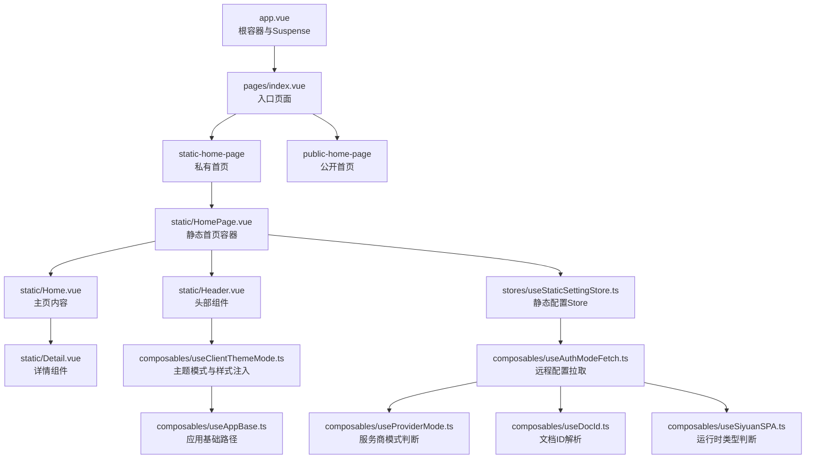
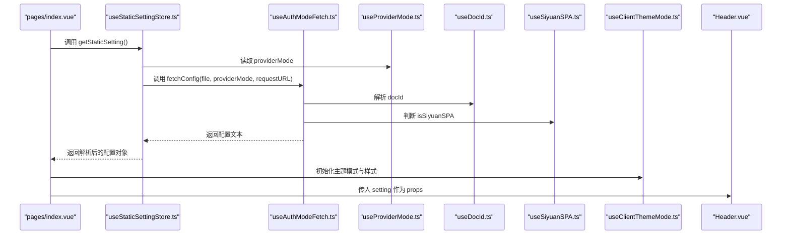
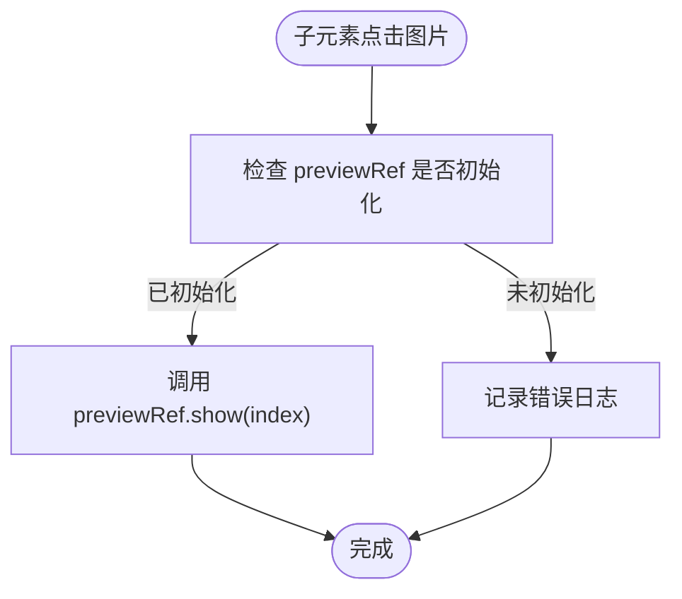
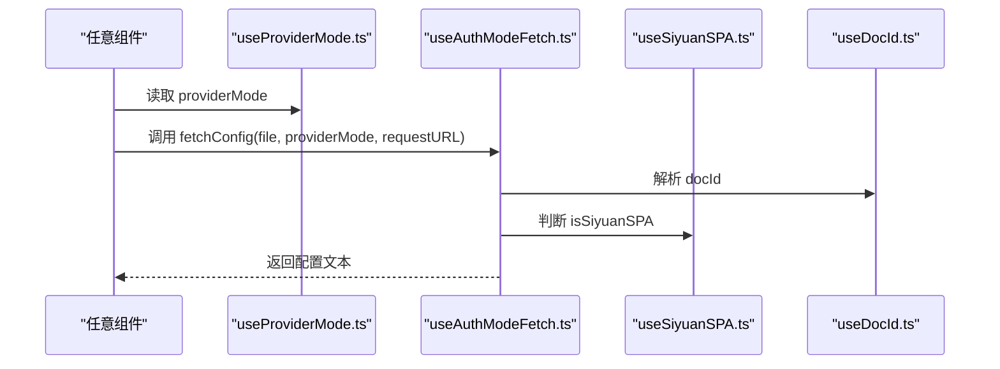
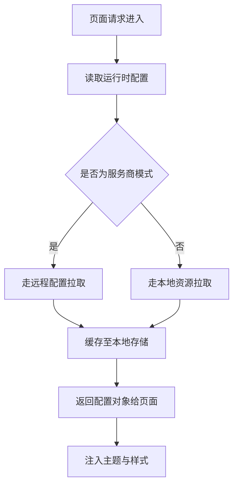
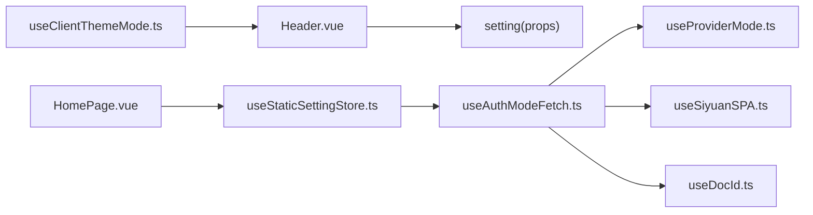

# 组件通信机制

<cite>
**本文引用的文件**
- [apps/app/composables/useAppBase.ts](file://apps/app/composables/useAppBase.ts)
- [apps/app/composables/useAuthModeFetch.ts](file://apps/app/composables/useAuthModeFetch.ts)
- [apps/app/composables/useClientThemeMode.ts](file://apps/app/composables/useClientThemeMode.ts)
- [apps/app/composables/useProviderMode.ts](file://apps/app/composables/useProviderMode.ts)
- [apps/app/composables/useDocId.ts](file://apps/app/composables/useDocId.ts)
- [apps/app/composables/useSiyuanSPA.ts](file://apps/app/composables/useSiyuanSPA.ts)
- [apps/app/composables/useCommonShareType.ts](file://apps/app/composables/useCommonShareType.ts)
- [apps/app/composables/useImagePreview.ts](file://apps/app/composables/useImagePreview.ts)
- [apps/app/stores/useStaticSettingStore.ts](file://apps/app/stores/useStaticSettingStore.ts)
- [apps/app/components/static/Header.vue](file://apps/app/components/static/Header.vue)
- [apps/app/components/static/HomePage.vue](file://apps/app/components/static/HomePage.vue)
- [apps/app/components/static/Home.vue](file://apps/app/components/static/Home.vue)
- [apps/app/components/public/Detail.vue](file://apps/app/components/public/Detail.vue)
- [apps/app/pages/index.vue](file://apps/app/pages/index.vue)
- [apps/app/app.vue](file://apps/app/app.vue)
</cite>

## 目录
1. [引言](#引言)
2. [项目结构](#项目结构)
3. [核心组件](#核心组件)
4. [架构总览](#架构总览)
5. [详细组件分析](#详细组件分析)
6. [依赖关系分析](#依赖关系分析)
7. [性能考虑](#性能考虑)
8. [故障排查指南](#故障排查指南)
9. [结论](#结论)
10. [附录](#附录)

## 引言
本文件系统性梳理该仓库中基于 Vue 3 Composition API 的组件通信机制与数据流管理，重点覆盖以下方面：
- 父子组件通信：props 传递、事件触发（通过模板引用与组合式函数）
- 兄弟组件通信：通过共享 Composable 或 Pinia Store
- 跨层级组件通信：通过 Composable 提供能力、环境配置注入
- 异步通信与状态共享：远程配置拉取、主题模式切换、图片预览等场景
- 最佳实践：可复用、可测试、可维护的数据流设计

## 项目结构
该项目采用 Nuxt 3 应用结构，前端组件位于 apps/app 下，核心通信与状态由 Composable 与 Store 提供，页面通过 Suspense 渲染主内容。

图表来源
- [apps/app/app.vue:10-24](file://apps/app/app.vue#L10-L24)
- [apps/app/pages/index.vue:10-29](file://apps/app/pages/index.vue#L10-L29)
- [apps/app/components/static/HomePage.vue:10-49](file://apps/app/components/static/HomePage.vue#L10-L49)
- [apps/app/components/static/Header.vue:10-53](file://apps/app/components/static/Header.vue#L10-L53)
- [apps/app/components/static/Home.vue:10-18](file://apps/app/components/static/Home.vue#L10-L18)
- [apps/app/components/static/Detail.vue:10-18](file://apps/app/components/public/Detail.vue#L10-L18)
- [apps/app/stores/useStaticSettingStore.ts:10-28](file://apps/app/stores/useStaticSettingStore.ts#L10-L28)
- [apps/app/composables/useAuthModeFetch.ts:15-319](file://apps/app/composables/useAuthModeFetch.ts#L15-L319)
- [apps/app/composables/useProviderMode.ts:16-23](file://apps/app/composables/useProviderMode.ts#L16-L23)
- [apps/app/composables/useDocId.ts:13-29](file://apps/app/composables/useDocId.ts#L13-L29)
- [apps/app/composables/useSiyuanSPA.ts:10-16](file://apps/app/composables/useSiyuanSPA.ts#L10-L16)
- [apps/app/composables/useClientThemeMode.ts:23-158](file://apps/app/composables/useClientThemeMode.ts#L23-L158)
- [apps/app/composables/useAppBase.ts:16-22](file://apps/app/composables/useAppBase.ts#L16-L22)

章节来源
- [apps/app/app.vue:10-24](file://apps/app/app.vue#L10-L24)
- [apps/app/pages/index.vue:10-29](file://apps/app/pages/index.vue#L10-L29)
- [apps/app/components/static/HomePage.vue:10-49](file://apps/app/components/static/HomePage.vue#L10-L49)
- [apps/app/components/static/Header.vue:10-53](file://apps/app/components/static/Header.vue#L10-L53)
- [apps/app/components/static/Home.vue:10-18](file://apps/app/components/static/Home.vue#L10-L18)
- [apps/app/components/public/Detail.vue:10-18](file://apps/app/components/public/Detail.vue#L10-L18)
- [apps/app/stores/useStaticSettingStore.ts:10-28](file://apps/app/stores/useStaticSettingStore.ts#L10-L28)
- [apps/app/composables/useAuthModeFetch.ts:15-319](file://apps/app/composables/useAuthModeFetch.ts#L15-L319)
- [apps/app/composables/useProviderMode.ts:16-23](file://apps/app/composables/useProviderMode.ts#L16-L23)
- [apps/app/composables/useDocId.ts:13-29](file://apps/app/composables/useDocId.ts#L13-L29)
- [apps/app/composables/useSiyuanSPA.ts:10-16](file://apps/app/composables/useSiyuanSPA.ts#L10-L16)
- [apps/app/composables/useClientThemeMode.ts:23-158](file://apps/app/composables/useClientThemeMode.ts#L23-L158)
- [apps/app/composables/useAppBase.ts:16-22](file://apps/app/composables/useAppBase.ts#L16-L22)

## 核心组件
- 配置与环境注入
  - useProviderMode：读取运行时配置，判断是否为服务商模式
  - useSiyuanSPA：判断运行时类型（如 siyuan）
  - useAppBase：提供应用基础路径
- 异步数据拉取
  - useAuthModeFetch：封装远程配置与文档元数据拉取、密码校验等异步流程
- 状态与主题
  - useClientThemeMode：主题模式切换、样式注入、自定义 CSS 应用
  - useStaticSettingStore：静态配置 Store，统一获取站点配置
- 页面与路由
  - pages/index.vue：根据分享类型决定渲染私有或公开首页
  - components/static/HomePage.vue：首页容器，负责 SEO 元信息与布局
  - components/static/Home.vue：主页内容，接收 pageId 并渲染详情
  - components/static/Header.vue：头部组件，接收 setting 并渲染
- 工具与共享行为
  - useDocId：统一解析路由中的文档 ID
  - useCommonShareType：判断分享类型（静态/公开）
  - useImagePreview：图片预览工具（单例实例）

章节来源
- [apps/app/composables/useProviderMode.ts:16-23](file://apps/app/composables/useProviderMode.ts#L16-L23)
- [apps/app/composables/useSiyuanSPA.ts:10-16](file://apps/app/composables/useSiyuanSPA.ts#L10-L16)
- [apps/app/composables/useAppBase.ts:16-22](file://apps/app/composables/useAppBase.ts#L16-L22)
- [apps/app/composables/useAuthModeFetch.ts:15-319](file://apps/app/composables/useAuthModeFetch.ts#L15-L319)
- [apps/app/composables/useClientThemeMode.ts:23-158](file://apps/app/composables/useClientThemeMode.ts#L23-L158)
- [apps/app/stores/useStaticSettingStore.ts:10-28](file://apps/app/stores/useStaticSettingStore.ts#L10-L28)
- [apps/app/pages/index.vue:10-29](file://apps/app/pages/index.vue#L10-L29)
- [apps/app/components/static/HomePage.vue:10-49](file://apps/app/components/static/HomePage.vue#L10-L49)
- [apps/app/components/static/Home.vue:10-18](file://apps/app/components/static/Home.vue#L10-L18)
- [apps/app/components/static/Header.vue:10-53](file://apps/app/components/static/Header.vue#L10-L53)
- [apps/app/composables/useDocId.ts:13-29](file://apps/app/composables/useDocId.ts#L13-L29)
- [apps/app/composables/useCommonShareType.ts:12-54](file://apps/app/composables/useCommonShareType.ts#L12-L54)
- [apps/app/composables/useImagePreview.ts:18-72](file://apps/app/composables/useImagePreview.ts#L18-L72)

## 架构总览
下图展示从页面到组件再到 Composable/Store 的数据流与通信路径：

图表来源
- [apps/app/pages/index.vue:10-29](file://apps/app/pages/index.vue#L10-L29)
- [apps/app/stores/useStaticSettingStore.ts:10-28](file://apps/app/stores/useStaticSettingStore.ts#L10-L28)
- [apps/app/composables/useAuthModeFetch.ts:15-319](file://apps/app/composables/useAuthModeFetch.ts#L15-L319)
- [apps/app/composables/useProviderMode.ts:16-23](file://apps/app/composables/useProviderMode.ts#L16-L23)
- [apps/app/composables/useDocId.ts:13-29](file://apps/app/composables/useDocId.ts#L13-L29)
- [apps/app/composables/useSiyuanSPA.ts:10-16](file://apps/app/composables/useSiyuanSPA.ts#L10-L16)
- [apps/app/composables/useClientThemeMode.ts:23-158](file://apps/app/composables/useClientThemeMode.ts#L23-L158)
- [apps/app/components/static/Header.vue:10-53](file://apps/app/components/static/Header.vue#L10-L53)

## 详细组件分析

### 父子组件通信：props 与事件
- 父到子：父组件通过 props 向子组件传递只读数据（如 setting），子组件仅消费，不直接修改父状态
  - 示例路径：[apps/app/components/static/HomePage.vue:21](file://apps/app/components/static/HomePage.vue#L21)，[apps/app/components/static/Header.vue:16](file://apps/app/components/static/Header.vue#L16)
- 子到父：通过模板引用与组合式函数协作，例如图片预览组件通过 ref 暴露 show 方法，子元素点击后调用
  - 示例路径：[apps/app/composables/useImagePreview.ts:43-52](file://apps/app/composables/useImagePreview.ts#L43-L52)

图表来源
- [apps/app/composables/useImagePreview.ts:28-63](file://apps/app/composables/useImagePreview.ts#L28-L63)

章节来源
- [apps/app/components/static/HomePage.vue:21](file://apps/app/components/static/HomePage.vue#L21)
- [apps/app/components/static/Header.vue:16](file://apps/app/components/static/Header.vue#L16)
- [apps/app/composables/useImagePreview.ts:28-63](file://apps/app/composables/useImagePreview.ts#L28-L63)

### 兄弟组件通信：通过共享 Composable
- 共享行为：useImagePreview 以单例形式提供图片收集与预览控制，兄弟组件可通过相同实例进行交互
  - 示例路径：[apps/app/composables/useImagePreview.ts:66-72](file://apps/app/composables/useImagePreview.ts#L66-L72)

章节来源
- [apps/app/composables/useImagePreview.ts:66-72](file://apps/app/composables/useImagePreview.ts#L66-L72)

### 跨层级组件通信：Composable 注入与环境配置
- 环境注入：useProviderMode、useSiyuanSPA、useAppBase 通过运行时配置提供全局能力，任意层级组件均可直接使用
  - 示例路径：[apps/app/composables/useProviderMode.ts:16-23](file://apps/app/composables/useProviderMode.ts#L16-L23)，[apps/app/composables/useSiyuanSPA.ts:10-16](file://apps/app/composables/useSiyuanSPA.ts#L10-L16)，[apps/app/composables/useAppBase.ts:16-22](file://apps/app/composables/useAppBase.ts#L16-L22)
- 数据拉取：useAuthModeFetch 在不同模式下选择不同的远程拉取策略，并将结果缓存至本地存储
  - 示例路径：[apps/app/composables/useAuthModeFetch.ts:181-215](file://apps/app/composables/useAuthModeFetch.ts#L181-L215)

图表来源
- [apps/app/composables/useProviderMode.ts:16-23](file://apps/app/composables/useProviderMode.ts#L16-L23)
- [apps/app/composables/useAuthModeFetch.ts:15-319](file://apps/app/composables/useAuthModeFetch.ts#L15-L319)
- [apps/app/composables/useSiyuanSPA.ts:10-16](file://apps/app/composables/useSiyuanSPA.ts#L10-L16)
- [apps/app/composables/useDocId.ts:13-29](file://apps/app/composables/useDocId.ts#L13-L29)

章节来源
- [apps/app/composables/useProviderMode.ts:16-23](file://apps/app/composables/useProviderMode.ts#L16-L23)
- [apps/app/composables/useAuthModeFetch.ts:15-319](file://apps/app/composables/useAuthModeFetch.ts#L15-L319)
- [apps/app/composables/useSiyuanSPA.ts:10-16](file://apps/app/composables/useSiyuanSPA.ts#L10-L16)
- [apps/app/composables/useDocId.ts:13-29](file://apps/app/composables/useDocId.ts#L13-L29)

### 异步通信与状态共享最佳实践
- 使用 Composable 封装异步逻辑：useAuthModeFetch 将“服务商模式/普通模式”“SPA/非 SPA”“文档ID解析”等复杂分支收敛为统一接口
  - 示例路径：[apps/app/composables/useAuthModeFetch.ts:181-215](file://apps/app/composables/useAuthModeFetch.ts#L181-L215)
- Store 作为单一事实源：useStaticSettingStore 仅负责“获取配置”，避免在组件中分散逻辑
  - 示例路径：[apps/app/stores/useStaticSettingStore.ts:18-24](file://apps/app/stores/useStaticSettingStore.ts#L18-L24)
- 主题与样式注入：useClientThemeMode 在挂载阶段注入 head/link/style，确保全局一致性
  - 示例路径：[apps/app/composables/useClientThemeMode.ts:57-97](file://apps/app/composables/useClientThemeMode.ts#L57-L97)

图表来源
- [apps/app/composables/useAuthModeFetch.ts:181-215](file://apps/app/composables/useAuthModeFetch.ts#L181-L215)
- [apps/app/composables/useClientThemeMode.ts:57-97](file://apps/app/composables/useClientThemeMode.ts#L57-L97)

章节来源
- [apps/app/composables/useAuthModeFetch.ts:181-215](file://apps/app/composables/useAuthModeFetch.ts#L181-L215)
- [apps/app/composables/useClientThemeMode.ts:57-97](file://apps/app/composables/useClientThemeMode.ts#L57-L97)
- [apps/app/stores/useStaticSettingStore.ts:18-24](file://apps/app/stores/useStaticSettingStore.ts#L18-L24)

### 实际应用场景
- 首页渲染与条件切换
  - pages/index.vue 根据分享类型决定渲染私有或公开首页
  - 示例路径：[apps/app/pages/index.vue:18-28](file://apps/app/pages/index.vue#L18-L28)
- 静态首页容器
  - HomePage.vue 负责 SEO 元信息与布局，向 Header 传递 setting
  - 示例路径：[apps/app/components/static/HomePage.vue:21-29](file://apps/app/components/static/HomePage.vue#L21-L29)，[apps/app/components/static/Header.vue:16](file://apps/app/components/static/Header.vue#L16)
- 主页内容与详情
  - Home.vue 接收 pageId 并渲染详情组件
  - 示例路径：[apps/app/components/static/Home.vue:12](file://apps/app/components/static/Home.vue#L12)，[apps/app/components/static/Detail.vue:10-18](file://apps/app/components/public/Detail.vue#L10-L18)

章节来源
- [apps/app/pages/index.vue:18-28](file://apps/app/pages/index.vue#L18-L28)
- [apps/app/components/static/HomePage.vue:21-29](file://apps/app/components/static/HomePage.vue#L21-L29)
- [apps/app/components/static/Header.vue:16](file://apps/app/components/static/Header.vue#L16)
- [apps/app/components/static/Home.vue:12](file://apps/app/components/static/Home.vue#L12)
- [apps/app/components/public/Detail.vue:10-18](file://apps/app/components/public/Detail.vue#L10-L18)

## 依赖关系分析
- 组件耦合度
  - Header 仅依赖 setting（props），低耦合
  - HomePage 依赖 Store 与 Composable，但职责清晰（仅负责容器与 SEO）
- 外部依赖
  - 运行时配置（Nuxt runtime config）用于模式判断与资源路径
  - 浏览器环境用于 DOM 操作（如图片预览）

图表来源
- [apps/app/components/static/Header.vue:16](file://apps/app/components/static/Header.vue#L16)
- [apps/app/components/static/HomePage.vue:19](file://apps/app/components/static/HomePage.vue#L19)
- [apps/app/stores/useStaticSettingStore.ts:13-14](file://apps/app/stores/useStaticSettingStore.ts#L13-L14)
- [apps/app/composables/useAuthModeFetch.ts:17-21](file://apps/app/composables/useAuthModeFetch.ts#L17-L21)
- [apps/app/composables/useProviderMode.ts:18-19](file://apps/app/composables/useProviderMode.ts#L18-L19)
- [apps/app/composables/useSiyuanSPA.ts:11-12](file://apps/app/composables/useSiyuanSPA.ts#L11-L12)
- [apps/app/composables/useDocId.ts:14](file://apps/app/composables/useDocId.ts#L14)
- [apps/app/composables/useClientThemeMode.ts:25-27](file://apps/app/composables/useClientThemeMode.ts#L25-L27)

章节来源
- [apps/app/components/static/Header.vue:16](file://apps/app/components/static/Header.vue#L16)
- [apps/app/components/static/HomePage.vue:19](file://apps/app/components/static/HomePage.vue#L19)
- [apps/app/stores/useStaticSettingStore.ts:13-14](file://apps/app/stores/useStaticSettingStore.ts#L13-L14)
- [apps/app/composables/useAuthModeFetch.ts:17-21](file://apps/app/composables/useAuthModeFetch.ts#L17-L21)
- [apps/app/composables/useProviderMode.ts:18-19](file://apps/app/composables/useProviderMode.ts#L18-L19)
- [apps/app/composables/useSiyuanSPA.ts:11-12](file://apps/app/composables/useSiyuanSPA.ts#L11-L12)
- [apps/app/composables/useDocId.ts:14](file://apps/app/composables/useDocId.ts#L14)
- [apps/app/composables/useClientThemeMode.ts:25-27](file://apps/app/composables/useClientThemeMode.ts#L25-L27)

## 性能考虑
- 异步缓存：useAuthModeFetch 在客户端将配置文本缓存至本地存储，减少重复请求
  - 示例路径：[apps/app/composables/useAuthModeFetch.ts:211-214](file://apps/app/composables/useAuthModeFetch.ts#L211-L214)
- SSR 安全：在服务端判断与 DOM 操作前需检查运行时环境，避免在服务端执行客户端 API
  - 示例路径：[apps/app/composables/useImagePreview.ts:26-32](file://apps/app/composables/useImagePreview.ts#L26-L32)
- 主题注入最小化：useClientThemeMode 仅在浏览器端更新样式链接与自定义样式，避免不必要的重绘
  - 示例路径：[apps/app/composables/useClientThemeMode.ts:105-111](file://apps/app/composables/useClientThemeMode.ts#L105-L111)

章节来源
- [apps/app/composables/useAuthModeFetch.ts:211-214](file://apps/app/composables/useAuthModeFetch.ts#L211-L214)
- [apps/app/composables/useImagePreview.ts:26-32](file://apps/app/composables/useImagePreview.ts#L26-L32)
- [apps/app/composables/useClientThemeMode.ts:105-111](file://apps/app/composables/useClientThemeMode.ts#L105-L111)

## 故障排查指南
- 远程配置拉取失败
  - 现象：抛出异常或返回默认值
  - 排查点：网络连通性、providerUrl 配置、文档ID解析正确性
  - 参考路径：[apps/app/composables/useAuthModeFetch.ts:181-205](file://apps/app/composables/useAuthModeFetch.ts#L181-L205)，[apps/app/composables/useDocId.ts:16-25](file://apps/app/composables/useDocId.ts#L16-L25)
- 主题样式未生效
  - 现象：页面未按预期显示主题或代码高亮样式
  - 排查点：useClientThemeMode 是否在浏览器端执行；head/link/style 注入是否成功
  - 参考路径：[apps/app/composables/useClientThemeMode.ts:103-141](file://apps/app/composables/useClientThemeMode.ts#L103-L141)
- 图片预览不可用
  - 现象：点击图片无反应
  - 排查点：previewRef 是否初始化；元素内是否存在图片；事件绑定是否成功
  - 参考路径：[apps/app/composables/useImagePreview.ts:43-52](file://apps/app/composables/useImagePreview.ts#L43-L52)

章节来源
- [apps/app/composables/useAuthModeFetch.ts:181-205](file://apps/app/composables/useAuthModeFetch.ts#L181-L205)
- [apps/app/composables/useDocId.ts:16-25](file://apps/app/composables/useDocId.ts#L16-L25)
- [apps/app/composables/useClientThemeMode.ts:103-141](file://apps/app/composables/useClientThemeMode.ts#L103-L141)
- [apps/app/composables/useImagePreview.ts:43-52](file://apps/app/composables/useImagePreview.ts#L43-L52)

## 结论
本项目通过 Composable 与 Store 将“配置拉取、运行时模式判断、主题注入、图片预览”等横切关注点抽象为可复用能力，配合 props 与模板引用实现父子与兄弟组件间的简洁通信。整体架构具备良好的可维护性与扩展性，适合在复杂前端场景中推广使用。

## 附录
- 关键 Composable 一览
  - useProviderMode：服务商模式判断
  - useSiyuanSPA：运行时类型判断
  - useAppBase：应用基础路径
  - useAuthModeFetch：远程配置与文档元数据拉取
  - useClientThemeMode：主题模式与样式注入
  - useStaticSettingStore：静态配置 Store
  - useDocId：文档 ID 解析
  - useCommonShareType：分享类型判断
  - useImagePreview：图片预览工具（单例）