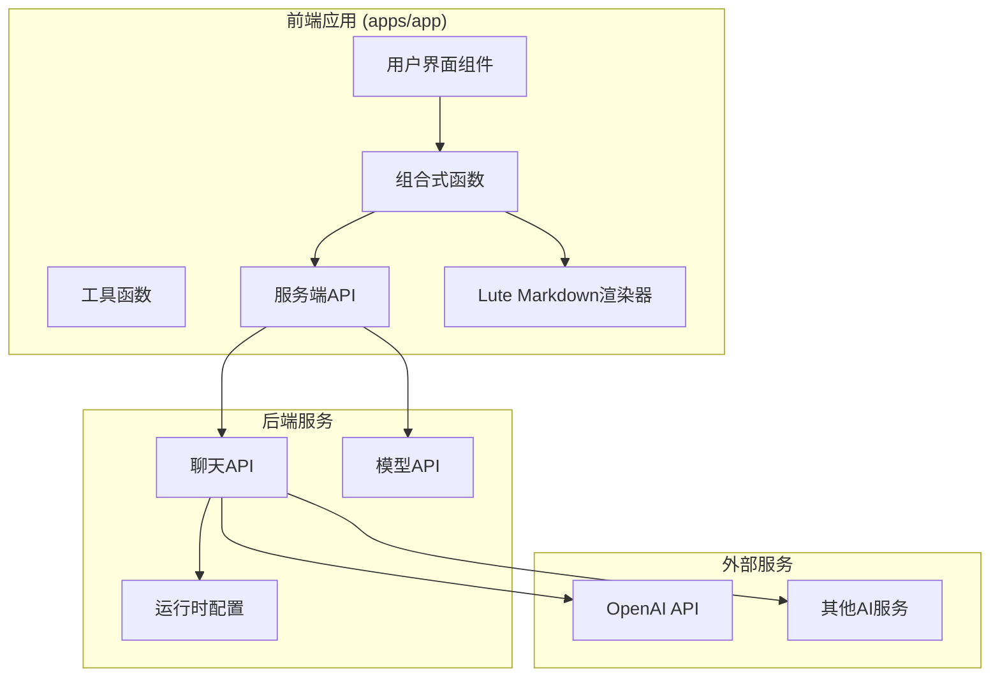
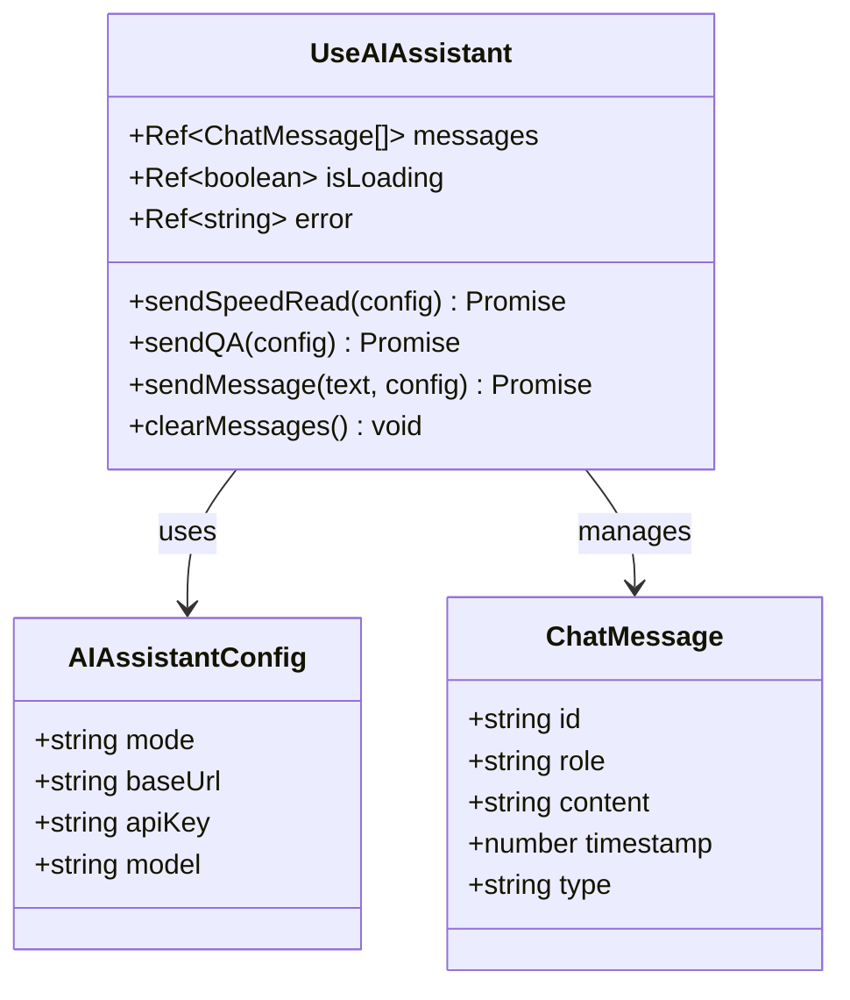
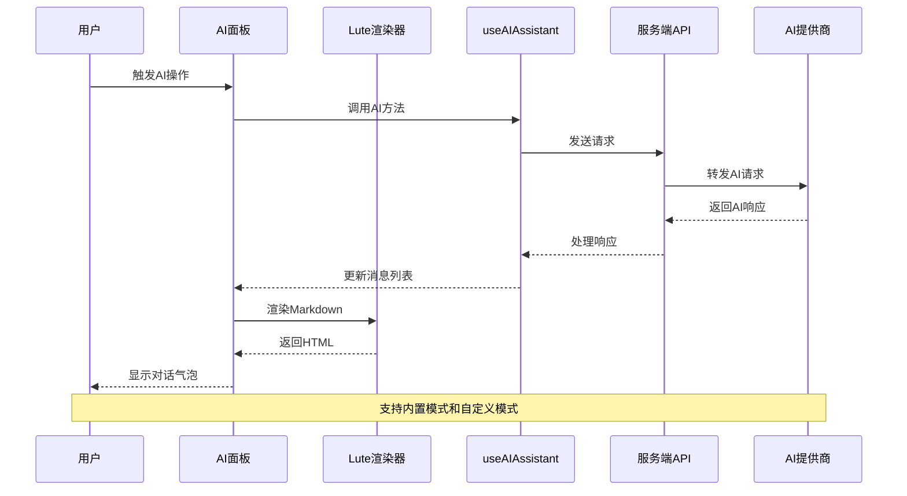
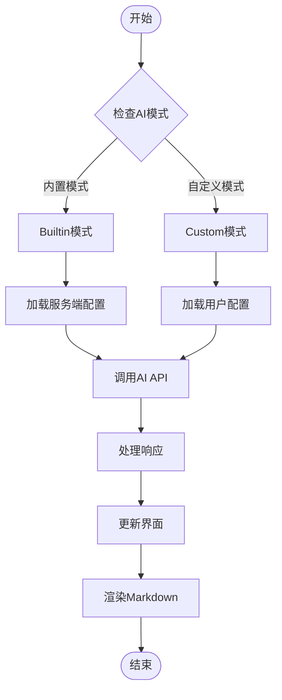
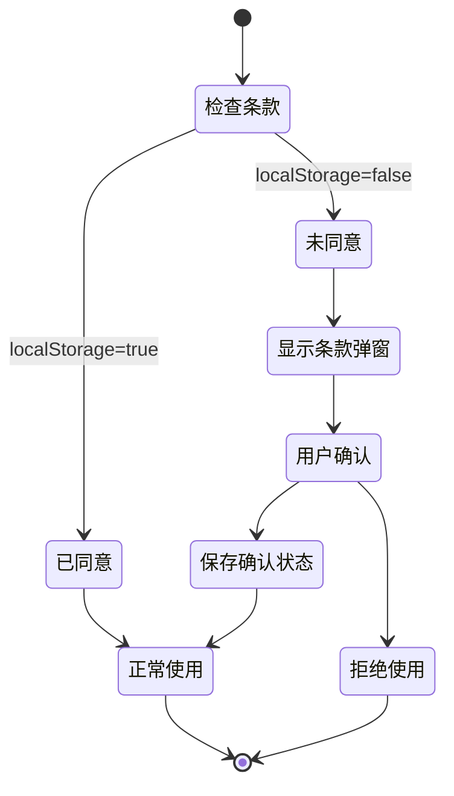
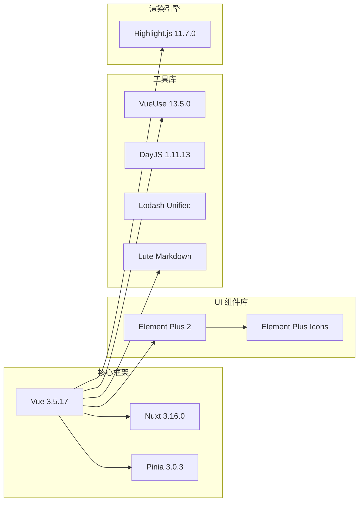
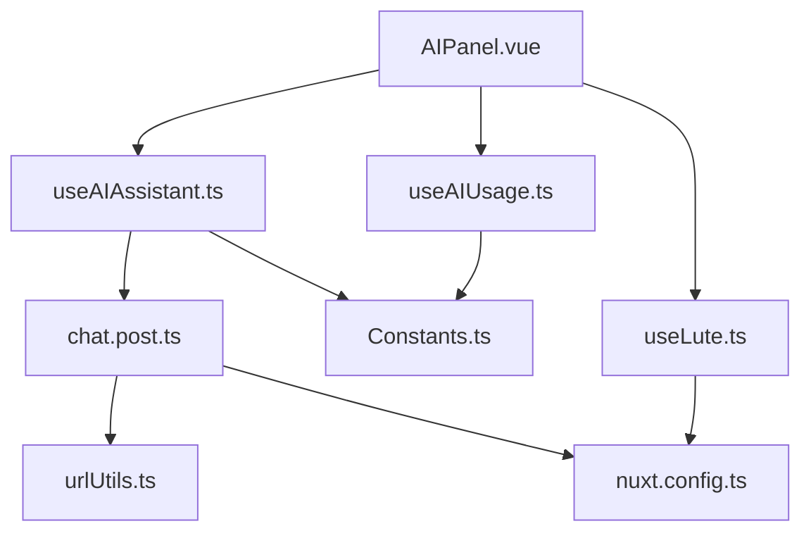

# AI 助手系统

<cite>
**本文档引用的文件**
- [AIPanel.vue](file://apps/app/components/ai-assistant/AIPanel.vue)
- [useAIAssistant.ts](file://apps/app/composables/useAIAssistant.ts)
- [useLute.ts](file://apps/app/composables/useLute.ts)
- [useAIUsage.ts](file://apps/app/composables/useAIUsage.ts)
- [chat.post.ts](file://apps/app/server/api/ai/chat.post.ts)
- [models.get.ts](file://apps/app/server/api/ai/models.get.ts)
- [Constants.ts](file://apps/app/utils/Constants.ts)
- [ai-terms.txt](file://apps/app/public/ai-terms.txt)
- [zh_CN.json](file://apps/app/i18n/locales/zh_CN.json)
- [nuxt.config.ts](file://apps/app/nuxt.config.ts)
- [urlUtils.ts](file://apps/app/server/utils/urlUtils.ts)
- [package.json](file://apps/app/package.json)
</cite>

## 更新摘要
**变更内容**
- 统一AI助手系统架构，实现单一会话流和聊天气泡界面
- 新增useLute.ts组件，专门处理Markdown渲染
- 重构useAIAssistant.ts，提供统一的AI交互逻辑
- 新增AI聊天和模型发现API端点
- 增强条款确认机制和使用次数管理

## 目录
1. [简介](#简介)
2. [项目结构](#项目结构)
3. [核心组件](#核心组件)
4. [架构概览](#架构概览)
5. [详细组件分析](#详细组件分析)
6. [依赖关系分析](#依赖关系分析)
7. [性能考虑](#性能考虑)
8. [故障排除指南](#故障排除指南)
9. [结论](#结论)

## 简介

AI 助手系统是一个集成化的智能文档处理解决方案，专为 Siyuan 笔记应用设计。该系统提供了统一的AI交互体验，所有功能都围绕单一会话流和聊天气泡界面实现，支持AI速读、智能问答和自由对话三种模式。

### 主要特性

- **统一聊天界面**：所有 AI 交互都以对话气泡的形式呈现，支持单一会话流
- **多模式支持**：内置模式（服务端配置）和自定义模式（用户配置）
- **智能内容处理**：自动提取文档标题和正文内容，优化AI处理效果
- **流式响应**：支持实时的流式 AI 响应，提供流畅的用户体验
- **使用次数管理**：内置使用限制和计数机制
- **条款确认**：用户隐私和数据使用的条款确认机制
- **Markdown渲染**：专门的Lute组件处理Markdown到HTML的渲染

## 项目结构

该项目采用模块化架构，主要分为前端应用和后端服务两大部分：

**图表来源**
- [AIPanel.vue:1-800](file://apps/app/components/ai-assistant/AIPanel.vue#L1-L800)
- [useAIAssistant.ts:1-488](file://apps/app/composables/useAIAssistant.ts#L1-L488)
- [useLute.ts:1-84](file://apps/app/composables/useLute.ts#L1-L84)
- [chat.post.ts:1-153](file://apps/app/server/api/ai/chat.post.ts#L1-L153)

**章节来源**
- [AIPanel.vue:1-800](file://apps/app/components/ai-assistant/AIPanel.vue#L1-L800)
- [useAIAssistant.ts:1-488](file://apps/app/composables/useAIAssistant.ts#L1-L488)
- [nuxt.config.ts:1-149](file://apps/app/nuxt.config.ts#L1-L149)

## 核心组件

### AI 助手面板 (AIPanel.vue)

AI 助手面板是整个系统的核心用户界面组件，提供了完整的 AI 交互体验，实现了统一的单一会话流和聊天气泡界面。

#### 主要功能

- **统一聊天界面**：所有消息以对话气泡形式展示，支持单一会话流
- **快捷操作**：速读本文和提出问题两个快速按钮
- **配置管理**：内置和自定义模式切换
- **使用统计**：每日使用次数显示
- **条款确认**：隐私和数据使用条款
- **Markdown渲染**：使用Lute组件处理AI响应的Markdown渲染

#### 界面元素

| 元素 | 功能描述 | 实现方式 |
|------|----------|----------|
| 聊天列表 | 显示所有消息和AI响应 | Vue.js 3 Composition API + Lute渲染 |
| 快速按钮 | 速读本文、提出问题 | 组件事件绑定 |
| 输入区域 | 用户自定义问题输入 | textarea + 键盘事件 |
| 模型选择器 | 自定义模式下的模型选择 | El-Select 组件 |
| 使用统计 | 今日剩余次数显示 | 计算属性和本地存储 |
| 配置面板 | AI 模式和参数设置 | Teleport 传送门 |
| 条款弹窗 | 服务协议确认 | 模态对话框 |

**章节来源**
- [AIPanel.vue:450-677](file://apps/app/components/ai-assistant/AIPanel.vue#L450-L677)

### AI 助手组合式函数 (useAIAssistant.ts)

统一的 AI 助手逻辑封装，提供核心的 AI 交互能力，实现了单一会话流的完整支持。

#### 核心功能

- **内容预处理**：HTML 内容清理和格式化，优化AI处理效果
- **消息管理**：统一的消息结构和生命周期，支持单一会话流
- **流式处理**：实时响应更新，支持完整的流式对话体验
- **错误处理**：完整的错误状态管理
- **上下文保持**：维护完整的对话上下文

#### 数据结构

**图表来源**
- [useAIAssistant.ts:24-47](file://apps/app/composables/useAIAssistant.ts#L24-L47)

**章节来源**
- [useAIAssistant.ts:243-482](file://apps/app/composables/useAIAssistant.ts#L243-L482)

### Lute Markdown 渲染器 (useLute.ts)

专门的Markdown渲染组件，负责将AI生成的Markdown内容转换为HTML。

#### 核心功能

- **Markdown渲染**：将Markdown文本转换为HTML
- **Lute集成**：使用Lute库进行高质量的Markdown渲染
- **错误处理**：Lute不可用时的降级处理
- **HTML转义**：防止XSS攻击的安全处理

**章节来源**
- [useLute.ts:1-84](file://apps/app/composables/useLute.ts#L1-L84)

### 使用次数管理 (useAIUsage.ts)

负责管理用户的 AI 使用次数，实现每日限制机制。

#### 核心特性

- **本地存储**：使用 localStorage 持久化存储
- **日期重置**：自动按天重置使用次数
- **默认限制**：每日 30 次使用限制
- **实时计算**：动态计算剩余次数

**章节来源**
- [useAIUsage.ts:62-115](file://apps/app/composables/useAIUsage.ts#L62-L115)

## 架构概览

系统采用前后端分离架构，前端负责用户界面和交互，后端提供 AI 服务代理。新架构实现了统一的单一会话流和聊天气泡界面。

**图表来源**
- [AIPanel.vue:253-338](file://apps/app/components/ai-assistant/AIPanel.vue#L253-L338)
- [useAIAssistant.ts:94-194](file://apps/app/composables/useAIAssistant.ts#L94-L194)
- [useLute.ts:44-62](file://apps/app/composables/useLute.ts#L44-L62)

### 模式切换流程

**图表来源**
- [AIPanel.vue:137-185](file://apps/app/components/ai-assistant/AIPanel.vue#L137-L185)
- [useAIAssistant.ts:94-194](file://apps/app/composables/useAIAssistant.ts#L94-L194)

## 详细组件分析

### AI 聊天 API (chat.post.ts)

服务端代理 API，负责安全地处理 AI 请求，支持流式响应。

#### 核心功能

- **模式验证**：区分内置和自定义模式
- **配置管理**：动态配置 AI 服务参数
- **流式响应**：支持 SSE 流式传输
- **错误处理**：完整的错误状态码
- **URL规范化**：自动处理API端点格式

#### API 参数

| 参数 | 类型 | 必需 | 描述 |
|------|------|------|------|
| mode | string | 是 | AI 模式 ('builtin' 或 'custom') |
| messages | array | 是 | 消息数组 |
| customConfig | object | 否 | 自定义配置对象 |
| stream | boolean | 否 | 是否启用流式响应 |

**章节来源**
- [chat.post.ts:14-152](file://apps/app/server/api/ai/chat.post.ts#L14-L152)

### 模型列表 API (models.get.ts)

动态获取可用 AI 模型列表的 API，支持两种模式。

#### 功能特性

- **动态获取**：从用户配置的 API 端点获取模型
- **格式标准化**：统一模型信息格式
- **错误处理**：API 调用失败时的错误处理
- **模式支持**：同时支持内置和自定义模式

**章节来源**
- [models.get.ts:9-99](file://apps/app/server/api/ai/models.get.ts#L9-L99)

### 内容预处理机制

系统对 HTML 内容进行智能预处理，优化 AI 处理效果。

#### 处理步骤

1. **标题提取**：将 h1-h3 标签转换为 Markdown 标题
2. **列表处理**：将 li 标签转换为 Markdown 列表
3. **格式保留**：保留 strong 等重要格式标签
4. **内容清理**：移除多余标签和空白字符
5. **长度控制**：限制最大内容长度防止 Token 超限

**章节来源**
- [useAIAssistant.ts:50-78](file://apps/app/composables/useAIAssistant.ts#L50-L78)

### 条款确认机制

为了确保用户了解 AI 服务的使用条款，系统实现了强制性的条款确认机制。

#### 流程设计

**图表来源**
- [AIPanel.vue:200-251](file://apps/app/components/ai-assistant/AIPanel.vue#L200-L251)

**章节来源**
- [AIPanel.vue:200-251](file://apps/app/components/ai-assistant/AIPanel.vue#L200-L251)
- [ai-terms.txt:1-19](file://apps/app/public/ai-terms.txt#L1-L19)

### Markdown 渲染机制

系统使用专门的Lute组件处理AI生成内容的Markdown渲染。

#### 渲染流程

1. **内容接收**：从AI助手组件获取Markdown内容
2. **Lute实例**：获取或创建Lute渲染实例
3. **Markdown转换**：使用Lute的MarkdownStr方法转换
4. **HTML包装**：将渲染结果包装在markdown-content容器中
5. **错误处理**：Lute不可用时的降级处理

**章节来源**
- [useLute.ts:44-62](file://apps/app/composables/useLute.ts#L44-L62)

## 依赖关系分析

### 外部依赖

系统使用了多个现代化的前端框架和技术栈：

**图表来源**
- [package.json:13-34](file://apps/app/package.json#L13-L34)

### 内部模块依赖

**图表来源**
- [AIPanel.vue:22-25](file://apps/app/components/ai-assistant/AIPanel.vue#L22-L25)
- [useAIAssistant.ts:24-35](file://apps/app/composables/useAIAssistant.ts#L24-L35)
- [useLute.ts:18-37](file://apps/app/composables/useLute.ts#L18-L37)

**章节来源**
- [package.json:13-41](file://apps/app/package.json#L13-L41)

## 性能考虑

### 流式响应优化

系统实现了高效的流式响应处理，提供更好的用户体验：

- **实时更新**：AI 响应内容实时显示，无需等待完整响应
- **内存管理**：及时释放流式读取器资源
- **错误恢复**：流式过程中出现错误时的优雅降级
- **上下文保持**：完整的对话上下文在流式过程中保持

### 缓存策略

- **内容缓存**：预处理后的文档内容在会话期间缓存
- **配置缓存**：用户配置和模型列表缓存在本地存储
- **使用统计**：每日使用次数在本地持久化
- **Lute实例**：Lute渲染器实例单例模式，避免重复创建

### 网络优化

- **预连接**：对 CDN 进行 DNS 预连接减少延迟
- **资源预加载**：关键字体和脚本的预加载
- **压缩传输**：AI 响应的流式传输减少网络开销
- **URL规范化**：自动处理API端点格式，避免重复请求

## 故障排除指南

### 常见问题及解决方案

#### 1. AI 服务不可用

**症状**：收到 "AI 服务不可用" 或类似错误

**可能原因**：
- 服务端 AI 配置缺失
- 网络连接问题
- API 密钥无效

**解决方案**：
- 检查服务端环境变量配置
- 验证网络连接状态
- 确认 API 密钥有效性

#### 2. 使用次数耗尽

**症状**：显示 "今日次数已用完"

**解决方案**：
- 等待到下一天
- 切换到自定义模式使用自己的 API Key
- 检查本地存储中的使用记录

#### 3. 模型选择问题

**症状**：自定义模式下无法获取模型列表

**可能原因**：
- API Key 未正确配置
- 网络访问受限
- API 端点配置错误

**解决方案**：
- 验证 API Key 和 Base URL
- 检查网络连通性
- 确认 API 端点支持模型查询

#### 4. 条款确认问题

**症状**：无法通过条款确认或重复弹窗

**解决方案**：
- 检查浏览器本地存储
- 清除相关 localStorage 项
- 确认浏览器 Cookie 设置

#### 5. Markdown渲染问题

**症状**：AI响应内容显示为纯文本而非格式化内容

**可能原因**：
- Lute库未正确加载
- Markdown内容格式不正确
- 渲染过程发生错误

**解决方案**：
- 检查Lute库的CDN加载
- 验证Markdown内容格式
- 查看浏览器控制台错误信息

**章节来源**
- [AIPanel.vue:360-375](file://apps/app/components/ai-assistant/AIPanel.vue#L360-L375)
- [useAIUsage.ts:84-101](file://apps/app/composables/useAIUsage.ts#L84-L101)

## 结论

AI 助手系统是一个设计精良的智能文档处理解决方案，经过重构后具有以下优势：

### 技术优势

- **统一架构**：所有 AI 功能统一在一个聊天界面中，实现单一会话流
- **安全设计**：敏感的 API 密钥只在服务端处理
- **灵活配置**：支持内置和自定义两种使用模式
- **用户体验**：流式响应和实时更新提供流畅体验
- **专业渲染**：专门的Lute组件提供高质量的Markdown渲染

### 功能特色

- **多模式支持**：满足不同用户的需求和使用场景
- **智能处理**：自动处理文档内容，优化 AI 处理效果
- **使用管理**：完善的使用次数管理和限制机制
- **合规保障**：严格的条款确认和隐私保护
- **错误处理**：全面的错误状态管理和降级处理

### 扩展性

系统采用模块化设计，易于扩展新的 AI 功能和服务提供商。通过标准化的 API 接口和配置管理，可以轻松集成其他 AI 服务。新增的useLute.ts组件为未来的Markdown处理功能提供了良好的基础。

该系统为 Siyuan 笔记应用提供了强大的智能化增强，显著提升了文档处理和知识获取的效率，特别是在统一聊天界面和流式响应方面的改进，为用户带来了更加自然和高效的AI交互体验。