# AI助手系统

<cite>
**本文档引用的文件**
- [AIPanel.vue](file://apps/app/components/ai-assistant/AIPanel.vue)
- [useAIAssistant.ts](file://apps/app/composables/useAIAssistant.ts)
- [useAIUsage.ts](file://apps/app/composables/useAIUsage.ts)
- [useLute.ts](file://apps/app/composables/useLute.ts)
- [models.get.ts](file://apps/app/server/api/ai/models.get.ts)
- [chat.post.ts](file://apps/app/server/api/ai/chat.post.ts)
- [Constants.ts](file://apps/app/utils/Constants.ts)
- [zh_CN.json](file://apps/app/i18n/locales/zh_CN.json)
- [en_US.json](file://apps/app/i18n/locales/en_US.json)
- [package.json](file://apps/app/package.json)
- [plugin.json](file://apps/siyuan/plugin.json)
- [index.vue](file://apps/app/pages/index.vue)
- [nuxt.config.ts](file://apps/app/nuxt.config.ts)
- [Index.vue](file://apps/app/components/static/content/right/Index.vue)
- [Sidebar.vue](file://apps/app/components/static/content/left/Sidebar.vue)
- [SidebarButton.vue](file://apps/app/components/static/content/left/SidebarButton.vue)
- [PostMeta.vue](file://apps/app/components/static/content/PostMeta.vue)
</cite>

## 更新摘要
**变更内容**
- AI助手系统已从PostMeta组件迁移至侧边栏模块，采用全新的垂直按钮组设计
- 新增统一的模块化管理架构，支持outline和ai两个功能模块
- 实现垂直按钮组设计，提供统一的快速切换功能
- 完善模块激活状态管理和按钮样式系统
- 新增collapsed-buttons组件，支持固定定位和垂直排列

## 目录
1. [项目概述](#项目概述)
2. [项目结构](#项目结构)
3. [核心组件](#核心组件)
4. [架构概览](#架构概览)
5. [详细组件分析](#详细组件分析)
6. [依赖关系分析](#依赖关系分析)
7. [性能考虑](#性能考虑)
8. [故障排除指南](#故障排除指南)
9. [结论](#结论)

## 项目概述

AI助手系统是一个集成化的智能阅读辅助工具，专为SiYuan笔记系统设计。经过重大架构升级后，系统提供了更加完善和用户友好的AI交互体验，实现了真正的"阅读助手"功能。

### 主要特性

- **统一对话设计**：所有AI交互都以聊天气泡的形式呈现，保持上下文连续性
- **多模式支持**：内置模型（无次数限制）和自定义模型（客户端计数限制）
- **智能内容处理**：自动提取文档标题和内容，优化Token使用效率
- **使用次数管理**：每日30次免费使用限制，支持localStorage持久化
- **服务条款确认**：首次使用时的用户同意机制
- **流式响应支持**：实时显示AI生成过程，提升用户体验
- **动态模型选择**：自定义模式下可实时获取和选择AI模型
- **下拉配置面板**：直观的弹出式配置界面，支持模式切换和参数设置
- **独立加载状态**：每个操作都有精确的加载状态反馈
- **错误消息本地化**：完整的多语言错误提示系统
- **Lute Markdown渲染**：高质量的Markdown到HTML转换系统
- **完整暗色主题支持**：200多行CSS样式实现深色模式适配
- **模块化管理**：统一的模块化架构，支持多个功能模块的扩展
- **垂直按钮组**：全新的垂直按钮组设计，提供统一的快速切换功能

## 项目结构

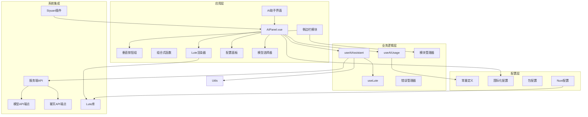

**图表来源**
- [AIPanel.vue:1-687](file://apps/app/components/ai-assistant/AIPanel.vue#L1-L687)
- [useAIAssistant.ts:1-560](file://apps/app/composables/useAIAssistant.ts#L1-L560)
- [useAIUsage.ts:1-115](file://apps/app/composables/useAIUsage.ts#L1-L115)
- [useLute.ts:1-84](file://apps/app/composables/useLute.ts#L1-L84)
- [models.get.ts:1-102](file://apps/app/server/api/ai/models.get.ts#L1-L102)
- [Index.vue:18-35](file://apps/app/components/static/content/right/Index.vue#L18-L35)

**章节来源**
- [AIPanel.vue:1-687](file://apps/app/components/ai-assistant/AIPanel.vue#L1-L687)
- [useAIAssistant.ts:1-560](file://apps/app/composables/useAIAssistant.ts#L1-L560)
- [useAIUsage.ts:1-115](file://apps/app/composables/useAIUsage.ts#L1-L115)
- [useLute.ts:1-84](file://apps/app/composables/useLute.ts#L1-L84)

## 核心组件

### AI助手面板组件

AIPanel.vue是整个AI助手系统的核心UI组件，经过重大升级后，提供了更加完善的用户界面和交互逻辑。

#### 主要功能模块

1. **统一消息管理**：维护统一的消息列表，支持用户消息和AI响应
2. **快速操作**：提供速读和问答两个快捷按钮，每个按钮都有独立的加载状态
3. **输入处理**：支持键盘事件和自动滚动功能
4. **使用计数**：显示剩余使用次数和状态
5. **条款确认**：首次使用的用户同意机制
6. **配置管理**：支持内置和自定义AI模型模式切换
7. **下拉配置面板**：弹出式配置界面，支持模式切换和参数设置
8. **动态模型选择**：自定义模式下可实时获取和选择AI模型
9. **Lute Markdown渲染**：高质量的Markdown到HTML转换
10. **暗色主题适配**：完整的深色模式样式支持

#### 界面布局

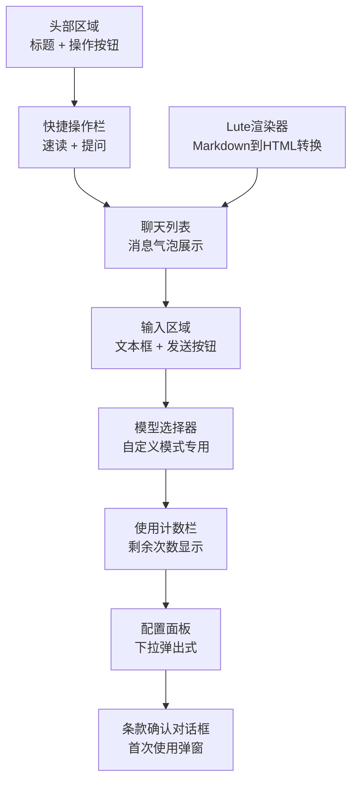

**图表来源**
- [AIPanel.vue:182-325](file://apps/app/components/ai-assistant/AIPanel.vue#L182-L325)

**章节来源**
- [AIPanel.vue:11-180](file://apps/app/components/ai-assistant/AIPanel.vue#L11-L180)

### 侧边栏模块系统

系统现已集成到统一的侧边栏模块架构中，支持多个功能模块的动态管理。

#### 模块化架构

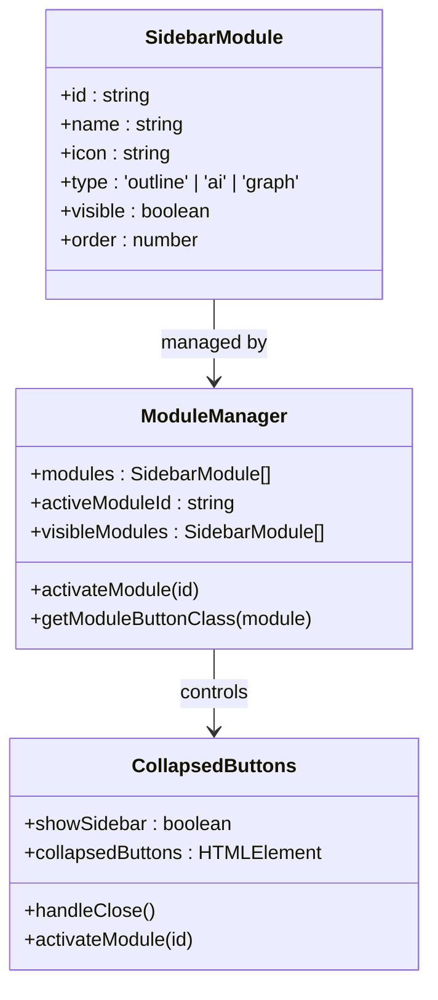

**图表来源**
- [Index.vue:18-35](file://apps/app/components/static/content/right/Index.vue#L18-L35)
- [Index.vue:37-38](file://apps/app/components/static/content/right/Index.vue#L37-L38)

#### 模块配置

| 模块ID | 类型 | 可见性 | 顺序 | 功能描述 |
|--------|------|--------|------|----------|
| outline | outline | true | 1 | 文档大纲功能 |
| ai | ai | true | 2 | AI助手功能 |
| graph | graph | false | 3 | 知识图谱功能（预留） |

**章节来源**
- [Index.vue:18-35](file://apps/app/components/static/content/right/Index.vue#L18-L35)

### 垂直按钮组设计

新的collapsed-buttons组件提供了统一的垂直按钮组界面，支持固定定位和垂直排列。

#### 按钮组架构

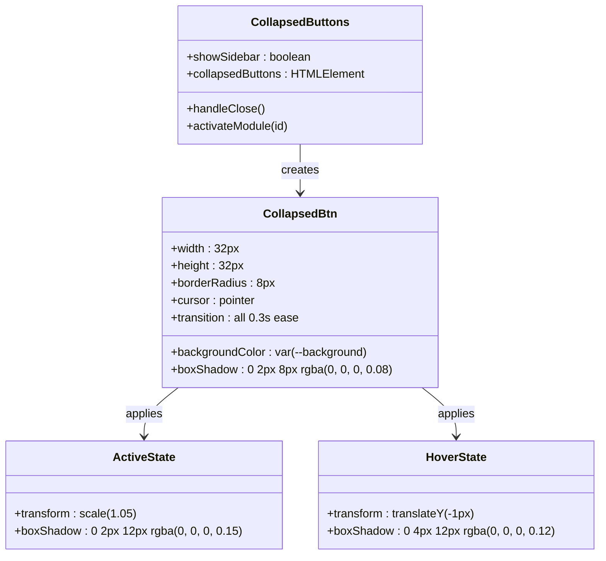

**图表来源**
- [Index.vue:682-762](file://apps/app/components/static/content/right/Index.vue#L682-L762)

#### 按钮样式系统

| 状态 | 样式属性 | 值 | 效果 |
|------|----------|----|------|
| 默认 | width/height | 32px | 标准尺寸 |
| 默认 | backgroundColor | var(--background) | 背景继承 |
| 默认 | borderRadius | 8px | 圆角设计 |
| 默认 | boxShadow | 0 2px 8px rgba(0, 0, 0, 0.08) | 阴影效果 |
| 悬停 | transform | translateY(-1px) | 上移效果 |
| 悬停 | boxShadow | 0 4px 12px rgba(0, 0, 0, 0.12) | 增强阴影 |
| 激活 | transform | scale(1.05) | 放大效果 |
| 激活 | boxShadow | 0 2px 12px rgba(0, 0, 0, 0.15) | 最强阴影 |

**章节来源**
- [Index.vue:682-762](file://apps/app/components/static/content/right/Index.vue#L682-L762)

### Lute Markdown渲染系统

useLute.ts提供了完整的Lute Markdown渲染功能，这是系统的重要组成部分。

#### 核心功能

1. **Lute实例管理**：单例模式管理Lute实例
2. **Markdown渲染**：将Markdown文本转换为HTML
3. **错误处理**：优雅处理渲染失败的情况
4. **HTML转义**：防止XSS攻击的安全处理

#### 渲染流程

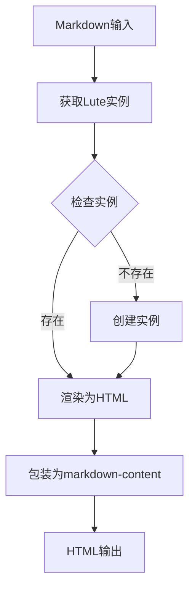

**图表来源**
- [useLute.ts:44-62](file://apps/app/composables/useLute.ts#L44-L62)

**章节来源**
- [useLute.ts:1-84](file://apps/app/composables/useLute.ts#L1-L84)

### 统一AI助手组合式函数

useAIAssistant.ts提供了完整的AI助手业务逻辑，经过重构后，它整合了原本分离的聊天、问答和摘要功能，实现了统一的AI交互体验。

#### 核心架构

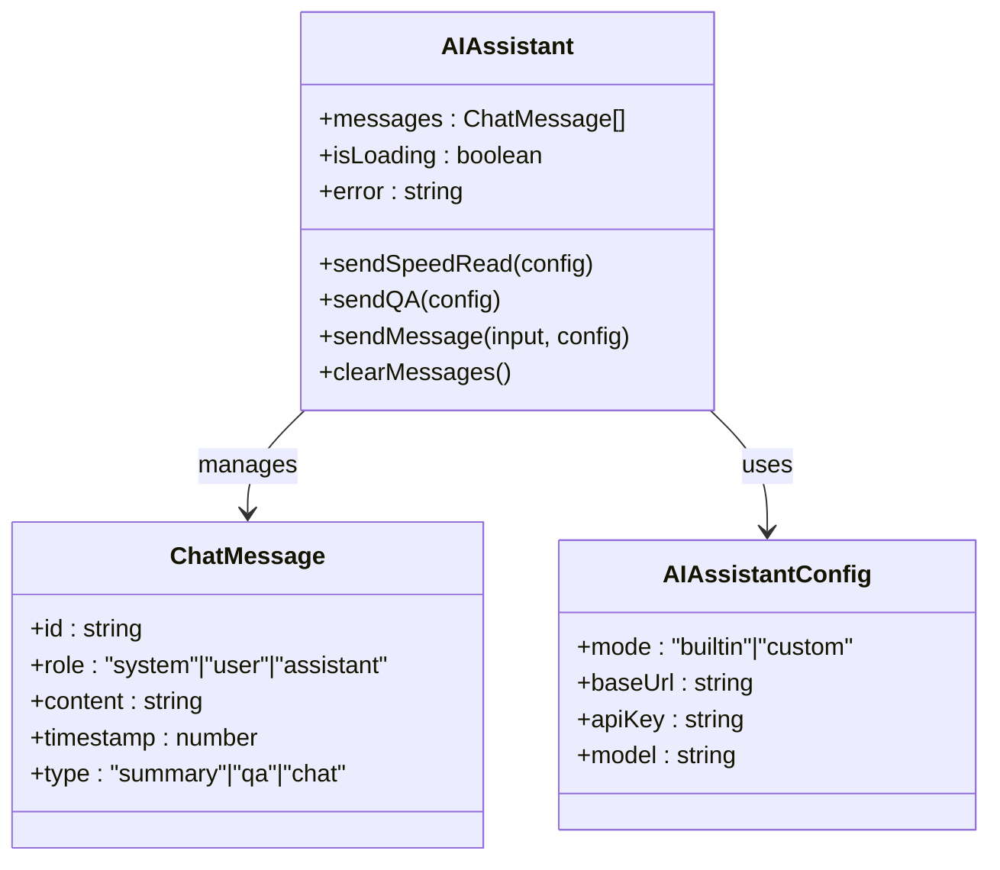

**图表来源**
- [useAIAssistant.ts:24-560](file://apps/app/composables/useAIAssistant.ts#L24-L560)

**章节来源**
- [useAIAssistant.ts:296-501](file://apps/app/composables/useAIAssistant.ts#L296-L501)

### 使用次数管理

useAIUsage.ts实现了客户端的使用次数控制机制，确保API调用的合理使用。

#### 计数策略

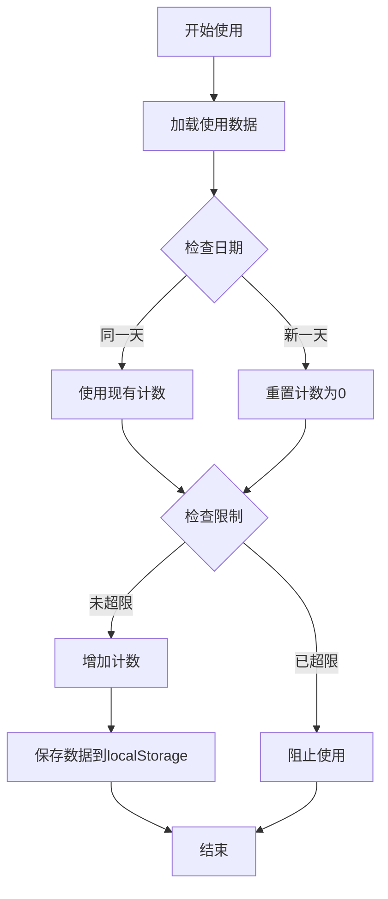

**图表来源**
- [useAIUsage.ts:62-115](file://apps/app/composables/useAIUsage.ts#L62-L115)

**章节来源**
- [useAIUsage.ts:62-115](file://apps/app/composables/useAIUsage.ts#L62-L115)

## 架构概览

AI助手系统采用分层架构设计，经过重大升级后实现了前端UI、业务逻辑、数据持久化和Lute渲染系统的完全统一。系统现已集成到统一的侧边栏模块架构中。

### 系统架构图

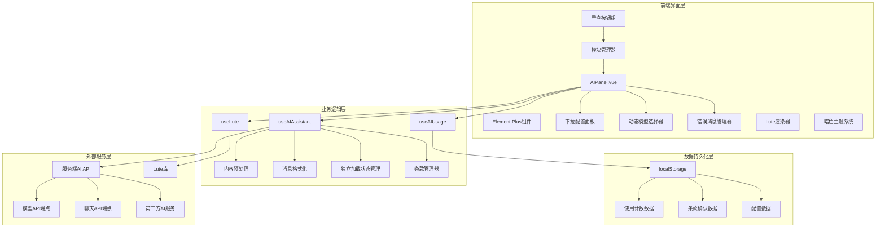

**图表来源**
- [AIPanel.vue:11-51](file://apps/app/components/ai-assistant/AIPanel.vue#L11-L51)
- [useAIAssistant.ts:102-157](file://apps/app/composables/useAIAssistant.ts#L102-L157)
- [useAIUsage.ts:50-58](file://apps/app/composables/useAIUsage.ts#L50-L58)
- [useLute.ts:18-37](file://apps/app/composables/useLute.ts#L18-L37)
- [Index.vue:427-445](file://apps/app/components/static/content/right/Index.vue#L427-L445)

### 数据流分析

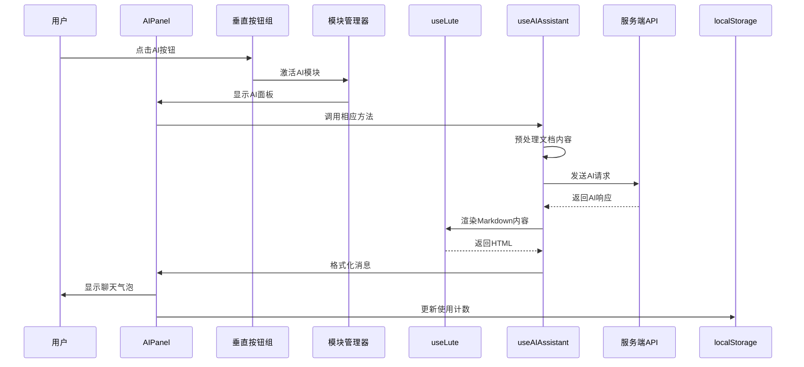

**图表来源**
- [AIPanel.vue:71-133](file://apps/app/components/ai-assistant/AIPanel.vue#L71-L133)
- [useAIAssistant.ts:320-485](file://apps/app/composables/useAIAssistant.ts#L320-L485)
- [useLute.ts:44-62](file://apps/app/composables/useLute.ts#L44-L62)
- [Index.vue:407-412](file://apps/app/components/static/content/right/Index.vue#L407-L412)

## 详细组件分析

### Lute Markdown渲染器

Lute渲染器是系统的重要组成部分，提供了高质量的Markdown到HTML转换功能。

#### 渲染流程

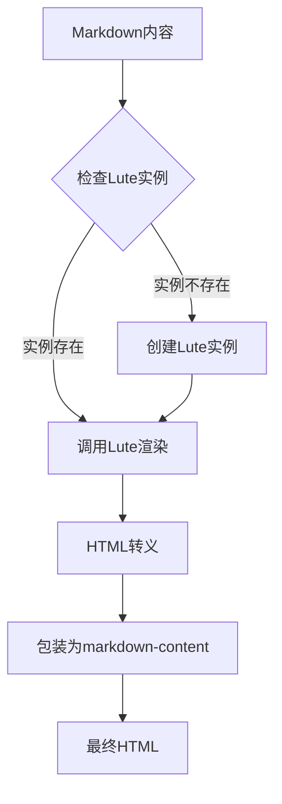

**图表来源**
- [useLute.ts:18-62](file://apps/app/composables/useLute.ts#L18-L62)

#### 渲染选项

| 选项 | 设置值 | 说明 |
|------|--------|------|
| SoftBreak2HardBreak | true | 将软换行转换为硬换行 |
| AutoSpace | true | 自动添加空格 |
| FixTermTypo | true | 修复术语拼写错误 |

**章节来源**
- [useLute.ts:22-30](file://apps/app/composables/useLute.ts#L22-L30)

### 内容预处理模块

内容预处理是AI助手系统的重要组成部分，负责将HTML格式的文档内容转换为AI友好的文本格式。

#### 预处理流程

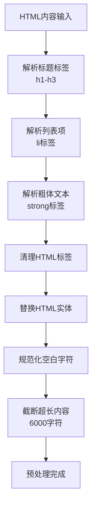

**图表来源**
- [useAIAssistant.ts:59-87](file://apps/app/composables/useAIAssistant.ts#L59-L87)

#### 预处理规则

| 处理类型 | 输入示例 | 输出示例 | 说明 |
|---------|---------|---------|------|
| 标题处理 | `<h2>核心概念</h2>` | `## 核心概念` | 转换为Markdown标题 |
| 列表处理 | `<li>要点一</li>` | `- 要点一` | 转换为Markdown列表 |
| 粗体处理 | `<strong>重要</strong>` | `**重要**` | 保留强调格式 |
| HTML清理 | `<p>段落内容</p>` | `段落内容` | 移除标签结构 |
| 实体替换 | `&amp;` | `&` | 转换单个字符实体 |

**章节来源**
- [useAIAssistant.ts:59-87](file://apps/app/composables/useAIAssistant.ts#L59-L87)

### AI API调用机制

AI助手系统通过服务端代理机制调用AI服务，确保API密钥的安全性和请求的稳定性。经过重大升级后，API端点从多端点架构整合为单一AI聊天端点，并新增了模型API端点。

#### API调用流程

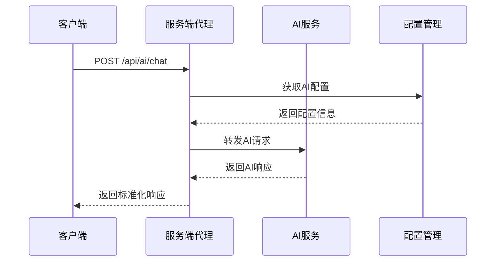

**图表来源**
- [useAIAssistant.ts:102-157](file://apps/app/composables/useAIAssistant.ts#L102-L157)

#### 新增模型API端点

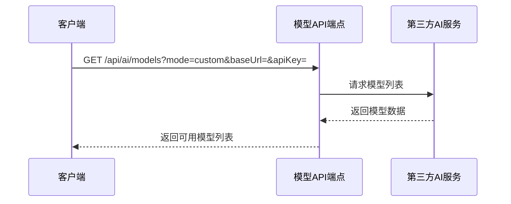

**图表来源**
- [models.get.ts:1-102](file://apps/app/server/api/ai/models.get.ts#L1-L102)

#### 配置模式

| 模式 | 特点 | 限制 | 使用场景 |
|------|------|------|----------|
| builtin | 服务端内置配置 | 无次数限制 | 日常使用、测试 |
| custom | 用户自定义配置 | 客户端计数限制 | 高级用户、批量处理 |
| proxy | 代理模式 | 无次数限制 | 安全考虑、企业环境 |

**章节来源**
- [useAIAssistant.ts:102-157](file://apps/app/composables/useAIAssistant.ts#L102-L157)

### 消息格式化系统

AI助手系统支持多种消息类型的格式化输出，经过重构后实现了统一的消息格式化系统。

#### 消息类型定义

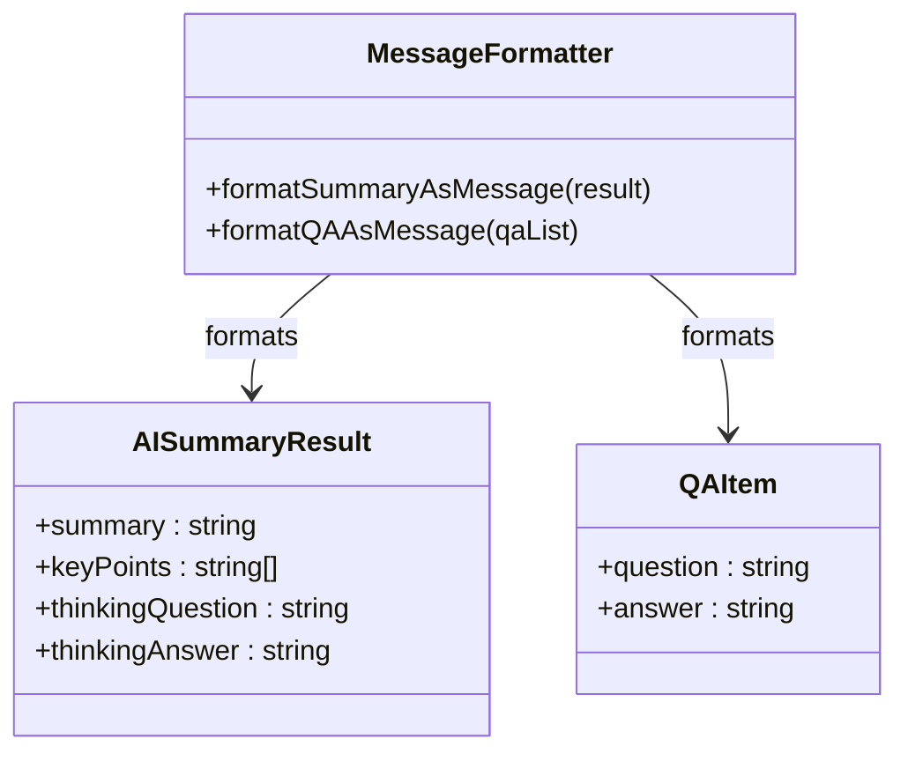

**图表来源**
- [useAIAssistant.ts:508-559](file://apps/app/composables/useAIAssistant.ts#L508-L559)

#### 格式化输出

| 消息类型 | 输出结构 | 特殊功能 |
|----------|----------|----------|
| summary | 核心摘要 + 关键要点 + 延伸思考 | 可展开详情 |
| qa | 文档问答列表 | 逐项展开答案 |
| chat | 标准聊天消息 | 支持富文本 |

**章节来源**
- [useAIAssistant.ts:508-559](file://apps/app/composables/useAIAssistant.ts#L508-L559)

### 国际化支持

AI助手系统提供了完整的国际化支持，目前支持中文和英文两种语言。

#### 本地化配置

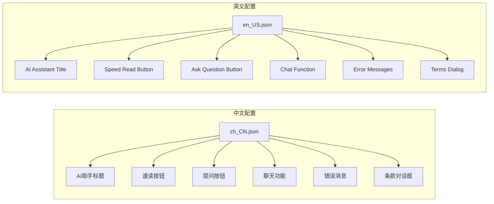

**图表来源**
- [zh_CN.json:124-144](file://apps/app/i18n/locales/zh_CN.json#L124-L144)

**章节来源**
- [zh_CN.json:124-144](file://apps/app/i18n/locales/zh_CN.json#L124-L144)

### 独立加载状态管理

系统实现了独立的加载状态管理，为每个按钮和操作提供精确的状态反馈。

#### 加载状态架构

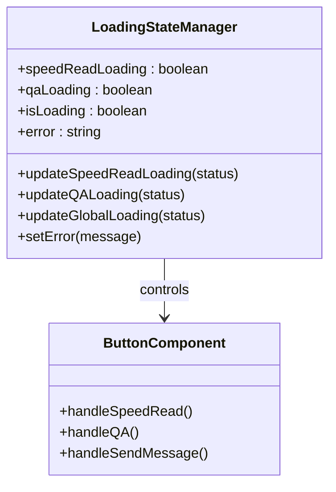

**图表来源**
- [AIPanel.vue:59-62](file://apps/app/components/ai-assistant/AIPanel.vue#L59-L62)

#### 状态同步机制

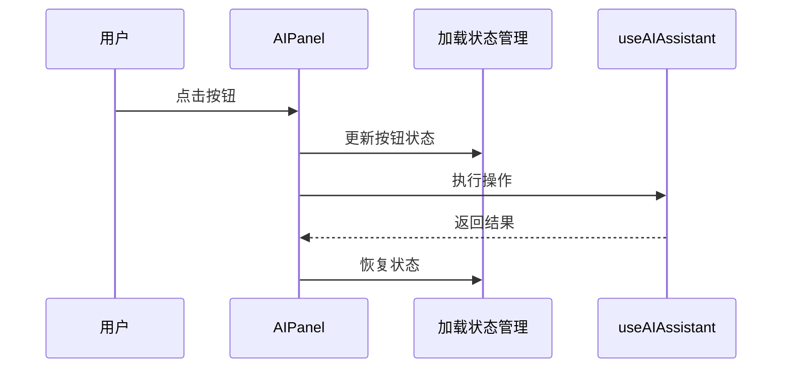

**图表来源**
- [AIPanel.vue:240-330](file://apps/app/components/ai-assistant/AIPanel.vue#L240-L330)

**章节来源**
- [AIPanel.vue:59-62](file://apps/app/components/ai-assistant/AIPanel.vue#L59-L62)

### 下拉弹出式配置面板

系统引入了下拉弹出式配置面板，替代原有的折叠面板设计，提供更好的用户体验。

#### 配置面板架构

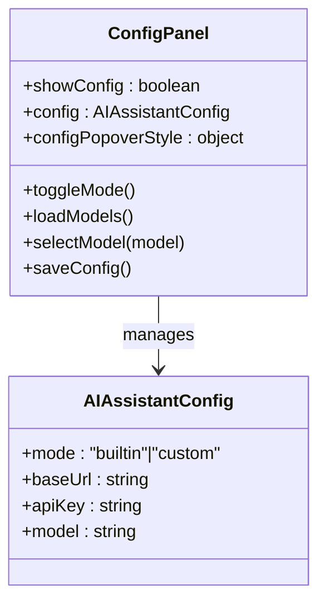

**图表来源**
- [AIPanel.vue:68-135](file://apps/app/components/ai-assistant/AIPanel.vue#L68-L135)

#### 配置面板功能

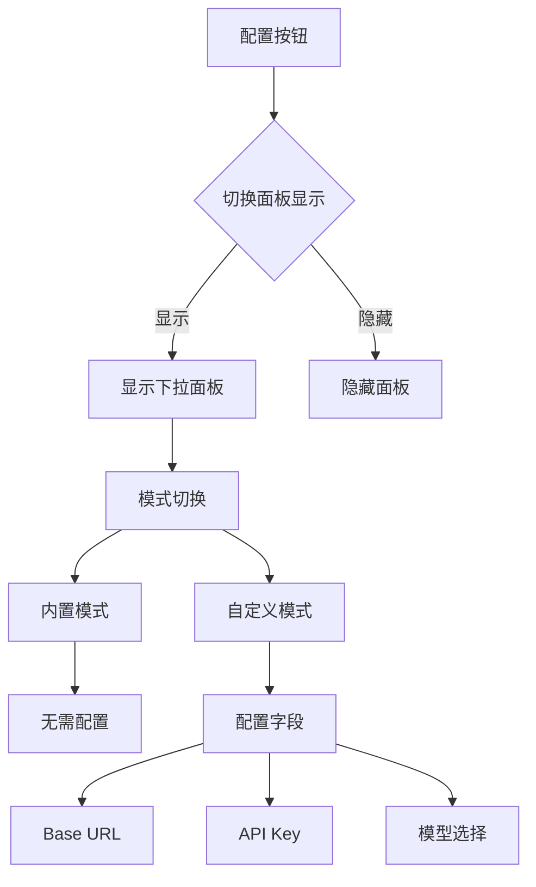

**图表来源**
- [AIPanel.vue:552-609](file://apps/app/components/ai-assistant/AIPanel.vue#L552-L609)

**章节来源**
- [AIPanel.vue:68-135](file://apps/app/components/ai-assistant/AIPanel.vue#L68-L135)

### 动态模型选择功能

在自定义模式下，系统支持动态获取和选择AI模型，提供更灵活的配置选项。

#### 模型选择流程

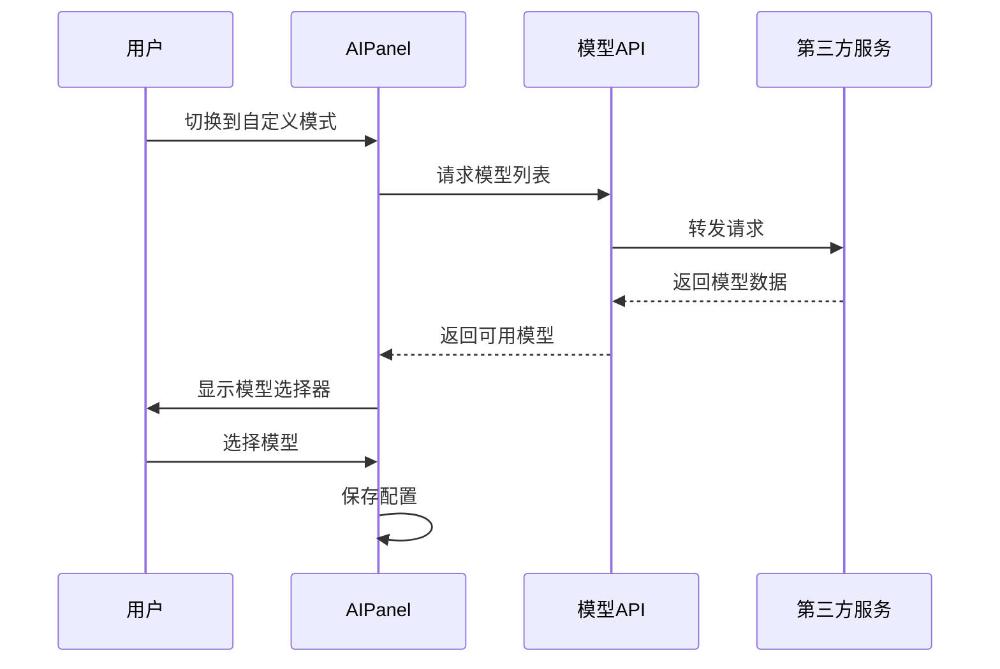

**图表来源**
- [AIPanel.vue:142-178](file://apps/app/components/ai-assistant/AIPanel.vue#L142-L178)

#### 模型API端点

```mermaid
flowchart TD
Request[API请求] --> ValidateParams{验证参数}
ValidateParams --> |自定义模式| CheckAPIKey{检查API Key}
ValidateParams --> |内置模式| CheckBuiltin{检查内置配置}
CheckAPIKey --> |缺失| ReturnError[返回错误]
CheckAPIKey --> |存在| FetchModels[获取模型列表]
CheckBuiltin --> |缺失| ReturnError
CheckBuiltin --> |存在| FetchModels
FetchModels --> CallThirdParty[调用第三方API]
CallThirdParty --> ProcessResponse[处理响应]
ProcessResponse --> ReturnSuccess[返回成功]
ReturnError --> ReturnFailure[返回失败]
```

**图表来源**
- [models.get.ts:9-99](file://apps/app/server/api/ai/models.get.ts#L9-L99)

**章节来源**
- [AIPanel.vue:142-178](file://apps/app/components/ai-assistant/AIPanel.vue#L142-L178)

### 错误消息本地化

系统实现了完整的错误消息本地化系统，提供多语言的错误提示。

#### 错误消息映射

```mermaid
classDiagram
class ErrorMessageManager {
+errorMap : object
+getErrorMessage(code) string
}
class ErrorCodes {
+EMPTY_CONTENT : string
+EMPTY_MESSAGE : string
+GENERATE_FAILED : string
+INVALID_FORMAT : string
+SEND_FAILED : string
+NETWORK_ERROR : string
+EMPTY_AI_RESPONSE : string
}
ErrorMessageManager --> ErrorCodes : uses
```

**图表来源**
- [AIPanel.vue:351-366](file://apps/app/components/ai-assistant/AIPanel.vue#L351-L366)

#### 错误处理流程

```mermaid
flowchart TD
ErrorOccur[错误发生] --> GetErrorCode[获取错误代码]
GetErrorCode --> CheckLocalize{检查本地化}
CheckLocalize --> |有本地化| LocalizedMsg[获取本地化消息]
CheckLocalize --> |无本地化| DefaultMsg[使用默认消息]
LocalizedMsg --> DisplayError[显示错误]
DefaultMsg --> DisplayError
DisplayError --> ShowRetry[显示重试按钮]
```

**图表来源**
- [AIPanel.vue:459-468](file://apps/app/components/ai-assistant/AIPanel.vue#L459-L468)

**章节来源**
- [AIPanel.vue:351-366](file://apps/app/components/ai-assistant/AIPanel.vue#L351-L366)

### 暗色主题支持

系统实现了完整的暗色主题支持，包含200多行CSS样式，确保在深色模式下的良好用户体验。

#### 暗色主题架构

```mermaid
classDiagram
class DarkThemeSystem {
+html[data-theme-mode="dark"] : applies
+panelBackground : var(--b3-theme-background)
+panelBorder : var(--b3-border-color)
+buttonStyles : var(--b3-theme-on-background)
+inputStyles : var(--b3-theme-on-background)
+messageStyles : var(--b3-theme-on-background)
}
class CSSVariables {
+--b3-theme-background : #1e1e1e
+--b3-theme-on-background : #d1d5db
+--b3-border-color : rgba(255, 255, 255, 0.15)
+--b3-theme-primary : #409eff
}
DarkThemeSystem --> CSSVariables : uses
```

**图表来源**
- [AIPanel.vue:650-652](file://apps/app/components/ai-assistant/AIPanel.vue#L650-L652)

#### 暗色主题覆盖范围

| 组件 | 暗色样式 | 适配效果 |
|------|----------|----------|
| 面板容器 | background: var(--b3-theme-background) | 深色背景 |
| 头部区域 | border-bottom-color: rgba(255, 255, 255, 0.08) | 浅色边框 |
| 快捷按钮 | hover状态深色背景 | 优雅悬停效果 |
| 输入区域 | border-top-color: rgba(255, 255, 255, 0.08) | 透明边框 |
| 模型选择器 | background: rgba(255, 255, 255, 0.03) | 深色背景 |
| 使用计数栏 | background: rgba(255, 255, 255, 0.05) | 半透明背景 |
| 配置弹窗 | background: var(--b3-theme-background) | 深色弹窗 |
| 条款对话框 | background: var(--b3-theme-background) | 深色对话框 |

**章节来源**
- [AIPanel.vue:650-1571](file://apps/app/components/ai-assistant/AIPanel.vue#L650-L1571)

### 模块化管理架构

系统现已实现统一的模块化管理架构，支持多个功能模块的动态扩展和管理。

#### 模块管理器

```mermaid
classDiagram
class ModuleManager {
+modules : SidebarModule[]
+activeModuleId : string
+visibleModules : SidebarModule[]
+activateModule(id)
+getModuleButtonClass(module)
+addModule(module)
+removeModule(id)
+toggleVisibility(id)
}
class SidebarModule {
+id : string
+name : string
+icon : string
+type : 'outline' | 'ai' | 'graph'
+visible : boolean
+order : number
}
class CollapsedButtons {
+collapsedButtons : HTMLElement
+handleClose()
+activateModule(id)
}
ModuleManager --> SidebarModule : manages
ModuleManager --> CollapsedButtons : controls
```

**图表来源**
- [Index.vue:18-35](file://apps/app/components/static/content/right/Index.vue#L18-L35)
- [Index.vue:37-38](file://apps/app/components/static/content/right/Index.vue#L37-L38)

#### 模块激活状态

```mermaid
sequenceDiagram
participant User as 用户
participant CollapsedButtons as 垂直按钮组
participant ModuleManager as 模块管理器
participant ActiveModule as 激活模块
User->>CollapsedButtons : 点击模块按钮
CollapsedButtons->>ModuleManager : activateModule(id)
ModuleManager->>ModuleManager : 更新activeModuleId
ModuleManager->>ActiveModule : 切换显示状态
ActiveModule-->>User : 显示对应内容
```

**图表来源**
- [Index.vue:427-445](file://apps/app/components/static/content/right/Index.vue#L427-L445)

**章节来源**
- [Index.vue:18-35](file://apps/app/components/static/content/right/Index.vue#L18-L35)

### 垂直按钮组样式系统

新的collapsed-buttons组件提供了统一的垂直按钮组样式系统，支持固定定位和垂直排列。

#### 按钮组定位

```mermaid
flowchart TD
FixedPosition[固定定位] --> Top60px[top: 60px]
FixedPosition --> Right16px[right: 16px]
FixedPosition --> ZIndex101[z-index: 101]
Top60px --> VerticalLayout[垂直排列]
VerticalLayout --> Gap8px[gap: 8px]
Right16px --> AlwaysVisible[始终可见]
ZIndex101 --> Clickable[始终可点击]
```

**图表来源**
- [Index.vue:682-686](file://apps/app/components/static/content/right/Index.vue#L682-L686)

#### 按钮激活样式

```mermaid
classDiagram
class ActiveButton {
+transform : scale(1.05)
+boxShadow : 0 2px 12px rgba(0, 0, 0, 0.15)
+background : var(--el-color-primary-light-9, rgba(64, 158, 255, 0.1))
+color : var(--el-color-primary, #409eff)
+borderColor : var(--el-color-primary, #409eff)
}
class HoverButton {
+transform : translateY(-1px)
+boxShadow : 0 4px 12px rgba(0, 0, 0, 0.12)
}
class NormalButton {
+width : 32px
+height : 32px
+borderRadius : 8px
+backgroundColor : var(--background)
+boxShadow : 0 2px 8px rgba(0, 0, 0, 0.08)
}
ActiveButton --> HoverButton : hover状态
HoverButton --> NormalButton : normal状态
```

**图表来源**
- [Index.vue:724-739](file://apps/app/components/static/content/right/Index.vue#L724-L739)

**章节来源**
- [Index.vue:682-762](file://apps/app/components/static/content/right/Index.vue#L682-L762)

## 依赖关系分析

### 技术栈依赖

AI助手系统基于现代前端技术栈构建，采用了Vue 3 Composition API和Nuxt 3框架。

#### 核心依赖

```mermaid
graph TB
subgraph "Vue生态"
Vue[Vue 3.5.17]
Nuxt[Nuxt 3.16.0]
Pinia[Pinia 3.0.3]
VueUse[@vueuse/core 13.5.0]
ElementPlus[Element Plus 2+]
Icons[Element Plus Icons]
Lute[Lute 3.0+]
end
subgraph "工具库"
Lodash[Lodash Unified]
Dayjs[Dayjs 1.11.13]
Cheerio[Cheap 1.1.1]
end
subgraph "构建工具"
Vite[Vite 5.4.19]
Stylus[Stylus 0.64.0]
end
Vue --> Nuxt
Vue --> Pinia
Vue --> VueUse
ElementPlus --> Icons
Nuxt --> Vite
Vite --> Stylus
Lute --> Nuxt
```

**图表来源**
- [package.json:13-33](file://apps/app/package.json#L13-L33)

### 插件集成

AI助手系统作为SiYuan笔记的插件运行，需要与主应用进行集成。

#### 插件配置

```mermaid
graph TB
subgraph "插件元数据"
Name[插件名称]
Version[版本号]
Author[作者]
MinAppVersion[最低版本要求]
end
subgraph "平台支持"
Desktop[桌面端]
Mobile[移动端]
Browser[浏览器]
Docker[Docker]
end
subgraph "本地化"
English[英文支持]
Chinese[中文支持]
end
Name --> Version
Version --> Author
Author --> MinAppVersion
MinAppVersion --> Desktop
Desktop --> Mobile
Mobile --> Browser
Browser --> Docker
English --> Chinese
```

**图表来源**
- [plugin.json:1-43](file://apps/siyuan/plugin.json#L1-L43)

**章节来源**
- [plugin.json:1-43](file://apps/siyuan/plugin.json#L1-L43)

### Lute库集成

系统通过Nuxt配置集成了Lute库，提供了高质量的Markdown渲染功能。

#### Lute集成配置

```mermaid
flowchart TD
NuxtConfig[Nuxt配置] --> HeadScript[head.script配置]
HeadScript --> DevMode{开发模式}
DevMode --> |开发| DevScripts[开发脚本]
DevMode --> |生产| ProdScripts[生产脚本]
DevScripts --> LuteLib[libs/lute/lute.min.js]
ProdScripts --> LuteLib
LuteLib --> WindowLute[window.Lute]
WindowLute --> useLute[useLute组合式函数]
useLute --> RenderFunction[renderMarkdown函数]
```

**图表来源**
- [nuxt.config.ts:71-105](file://apps/app/nuxt.config.ts#L71-L105)

**章节来源**
- [nuxt.config.ts:71-105](file://apps/app/nuxt.config.ts#L71-L105)

### 侧边栏模块集成

系统现已集成到统一的侧边栏模块架构中，支持多个功能模块的动态管理。

#### 模块集成架构

```mermaid
flowchart TD
MainLayout[主布局] --> LeftSidebar[左侧侧边栏]
MainLayout --> RightSidebar[右侧侧边栏]
LeftSidebar --> SidebarMenu[文档树菜单]
RightSidebar --> CollapsedButtons[垂直按钮组]
CollapsedButtons --> ModuleManager[模块管理器]
ModuleManager --> OutlineModule[大纲模块]
ModuleManager --> AIModule[AI模块]
AIModule --> AIPanel[AI面板]
AIPanel --> useAIAssistant[AI助手组合式函数]
```

**图表来源**
- [Index.vue:427-445](file://apps/app/components/static/content/right/Index.vue#L427-L445)
- [Sidebar.vue:10-23](file://apps/app/components/static/content/left/Sidebar.vue#L10-L23)

**章节来源**
- [Index.vue:427-445](file://apps/app/components/static/content/right/Index.vue#L427-L445)
- [Sidebar.vue:10-23](file://apps/app/components/static/content/left/Sidebar.vue#L10-L23)

## 性能考虑

### Token优化策略

AI助手系统通过智能的内容预处理和缓存机制，有效优化了Token使用效率。

#### 性能优化措施

1. **内容截断**：预处理后的内容限制在6000字符以内
2. **缓存机制**：处理后的文档内容在组件生命周期内缓存
3. **增量处理**：只发送必要的系统提示和用户输入
4. **响应过滤**：移除AI模型的思维链输出，减少冗余内容
5. **Lute渲染优化**：单例模式管理Lute实例，避免重复创建
6. **暗色主题CSS**：使用CSS变量实现快速主题切换
7. **模块化加载**：AI面板采用client-only按需加载
8. **垂直按钮组优化**：固定定位避免重排重绘
9. **模块状态缓存**：激活状态在组件间共享
10. **滚动性能优化**：独立滚动容器避免影响正文滚动

### 内存管理

```mermaid
flowchart TD
Mount[组件挂载] --> CacheContent[缓存预处理内容]
CacheContent --> InitMessages[初始化消息数组]
InitMessages --> InitLute[初始化Lute实例]
InitLute --> InitModules[初始化模块状态]
InitModules --> UserAction[用户操作]
UserAction --> AddMessage[添加消息到数组]
AddMessage --> MemoryCheck{内存检查}
MemoryCheck --> |正常| Continue[继续使用]
MemoryCheck --> |过载| Cleanup[清理旧消息]
Cleanup --> Continue
Continue --> UserAction
```

**图表来源**
- [useAIAssistant.ts:304-314](file://apps/app/composables/useAIAssistant.ts#L304-L314)

### 网络请求优化

1. **请求合并**：将多个操作合并为单个API调用
2. **错误重试**：实现智能的错误处理和重试机制
3. **超时控制**：设置合理的请求超时时间
4. **状态管理**：实时更新加载状态和错误信息
5. **流式响应**：支持实时流式响应，提升用户体验
6. **模型缓存**：动态获取的模型列表进行本地缓存
7. **配置持久化**：用户配置自动保存到localStorage
8. **Lute实例复用**：避免重复创建Lute实例
9. **暗色主题CSS缓存**：CSS变量实现快速主题切换
10. **模块懒加载**：AI面板按需加载，减少初始开销

## 故障排除指南

### 常见问题及解决方案

#### 使用次数耗尽

**问题现象**：按钮变灰，无法使用AI功能

**解决方案**：
1. 等待次日自动重置
2. 检查localStorage中的使用数据
3. 清除浏览器缓存重新登录

#### API调用失败

**问题现象**：出现错误提示，无法获得AI响应

**排查步骤**：
1. 检查网络连接状态
2. 验证AI服务配置
3. 查看浏览器开发者工具的网络请求
4. 确认服务端API可用性

#### 内容格式异常

**问题现象**：AI返回格式不符合预期

**处理方法**：
1. 检查文档内容的HTML结构
2. 确保文档包含有效的标题和正文
3. 验证内容预处理逻辑
4. 查看AI模型的响应格式

#### 模型选择问题

**问题现象**：自定义模式下无法获取模型列表

**排查步骤**：
1. 检查API Key是否正确配置
2. 验证Base URL格式
3. 确认第三方AI服务可用性
4. 查看模型API端点的响应

#### 配置面板问题

**问题现象**：配置面板无法显示或操作异常

**处理方法**：
1. 检查弹出式定位逻辑
2. 验证配置数据的保存和加载
3. 确认模式切换功能正常
4. 查看控制台是否有JavaScript错误

#### Lute渲染问题

**问题现象**：Markdown内容无法正确渲染

**排查步骤**：
1. 检查Lute库是否正确加载
2. 验证Markdown语法格式
3. 确认Lute实例创建状态
4. 查看渲染错误日志

#### 暗色主题问题

**问题现象**：深色模式样式不生效

**处理方法**：
1. 检查CSS变量是否正确设置
2. 验证data-theme-mode属性
3. 确认暗色主题CSS优先级
4. 查看浏览器开发者工具的样式应用

#### 模块激活问题

**问题现象**：垂直按钮组无法切换模块

**排查步骤**：
1. 检查模块管理器状态
2. 验证collapsed-buttons组件
3. 确认模块激活逻辑
4. 查看控制台JavaScript错误

#### AI面板加载问题

**问题现象**：AI面板无法显示或加载缓慢

**处理方法**：
1. 检查client-only懒加载
2. 验证AIPanel组件状态
3. 确认模块激活状态
4. 查看浏览器开发者工具的网络请求

### 调试工具

```mermaid
flowchart LR
subgraph "开发工具"
Console[浏览器控制台]
Network[网络面板]
Storage[存储面板]
Components[组件面板]
LuteDebug[Lute调试]
ThemeDebug[主题调试]
ModuleDebug[模块调试]
ButtonDebug[按钮调试]
end
subgraph "调试场景"
Error[错误调试]
Performance[性能调试]
DataFlow[数据流调试]
UIState[UI状态调试]
ConfigPanel[配置面板调试]
ModelSelection[模型选择调试]
LuteRendering[Lute渲染调试]
DarkTheme[暗色主题调试]
ModuleActivation[模块激活调试]
AIPanelLoading[AI面板加载调试]
end
Console --> Error
Network --> Performance
Storage --> DataFlow
Components --> UIState
Components --> ConfigPanel
Components --> ModelSelection
Components --> LuteRendering
Components --> DarkTheme
Components --> ModuleActivation
Components --> AIPanelLoading
ModuleDebug --> ModuleActivation
ButtonDebug --> AIPanelLoading
```

**图表来源**
- [AIPanel.vue:66-96](file://apps/app/components/ai-assistant/AIPanel.vue#L66-L96)
- [Index.vue:682-762](file://apps/app/components/static/content/right/Index.vue#L682-L762)

**章节来源**
- [AIPanel.vue:66-96](file://apps/app/components/ai-assistant/AIPanel.vue#L66-L96)

## 结论

AI助手系统通过重大架构升级，为用户提供了更加完善和易用的智能阅读辅助功能。系统经过重构后的主要优势包括：

### 核心优势

1. **统一设计**：所有AI功能都集成在同一个对话面板中，提供一致的用户体验
2. **智能优化**：通过内容预处理和缓存机制，显著提升性能和效率
3. **安全可靠**：采用服务端代理机制，确保API密钥的安全性
4. **灵活配置**：支持内置和自定义两种AI模型模式
5. **持久化管理**：实现使用次数的智能管理和用户同意机制
6. **流式响应**：实时显示AI生成过程，提升用户体验
7. **动态模型选择**：自定义模式下可实时获取和选择AI模型
8. **下拉配置面板**：直观的弹出式配置界面，提升用户体验
9. **独立加载状态**：每个操作都有精确的状态反馈
10. **错误消息本地化**：完整的多语言错误提示系统
11. **Lute Markdown渲染**：高质量的Markdown到HTML转换系统
12. **完整暗色主题支持**：200多行CSS样式实现深色模式适配
13. **模块化管理**：统一的模块化架构，支持多个功能模块的扩展
14. **垂直按钮组**：全新的垂直按钮组设计，提供统一的快速切换功能

### 技术亮点

- **现代化架构**：基于Vue 3 Composition API和Nuxt 3框架
- **国际化支持**：完整的多语言本地化机制
- **组件化设计**：高度模块化的组件结构，便于维护和扩展
- **性能优化**：多项性能优化策略，确保流畅的用户体验
- **API整合**：从多端点架构整合为单一AI聊天端点
- **动态配置**：支持运行时的配置更新和模型选择
- **状态管理**：精确的加载状态和错误状态管理
- **Lute集成**：高质量的Markdown渲染系统
- **暗色主题**：完整的深色模式适配
- **模块化架构**：统一的模块化管理，支持功能扩展

### 发展方向

未来可以考虑的功能增强包括：
- 支持更多AI模型和服务提供商
- 增强内容理解和语义分析能力
- 添加更多的个性化配置选项
- 实现更丰富的消息类型和格式
- 优化移动端的用户体验
- 增加语音交互功能
- 实现模型性能监控和优化
- 添加AI助手使用统计和分析功能
- 扩展Lute渲染器的功能支持
- 增强暗色主题的自定义选项
- 优化垂直按钮组的交互体验
- 增加模块间的通信机制
- 实现模块的热插拔功能

AI助手系统为SiYuan笔记用户提供了强大的智能化阅读体验，经过重大架构升级后的统一架构为未来的功能扩展奠定了坚实的基础。新的Lute Markdown渲染系统、动态模型选择、完整的暗色主题支持和全新的垂直按钮组设计等功能，显著提升了用户体验和系统的易用性。200多行CSS暗色主题样式的实现，确保了在各种主题下的良好视觉效果，而新增的模块化管理和垂直按钮组设计则提供了更加直观和高效的用户界面，这些改进共同构成了一个更加完善和专业的AI助手系统。