# AI助手系统

<cite>
**本文档引用的文件**
- [AIPanel.vue](file://apps/app/components/ai-assistant/AIPanel.vue)
- [useAIAssistant.ts](file://apps/app/composables/useAIAssistant.ts)
- [useAIUsage.ts](file://apps/app/composables/useAIUsage.ts)
- [Constants.ts](file://apps/app/utils/Constants.ts)
- [zh_CN.json](file://apps/app/i18n/locales/zh_CN.json)
- [package.json](file://apps/app/package.json)
- [plugin.json](file://apps/siyuan/plugin.json)
- [index.vue](file://apps/app/pages/index.vue)
</cite>

## 目录
1. [项目概述](#项目概述)
2. [项目结构](#项目结构)
3. [核心组件](#核心组件)
4. [架构概览](#架构概览)
5. [详细组件分析](#详细组件分析)
6. [依赖关系分析](#依赖关系分析)
7. [性能考虑](#性能考虑)
8. [故障排除指南](#故障排除指南)
9. [结论](#结论)

## 项目概述

AI助手系统是一个集成化的智能阅读辅助工具，专为SiYuan笔记系统设计。该系统提供了三种核心功能：AI速读、智能问答和自由聊天，所有功能都统一在一个对话面板中，实现了真正的"阅读助手"体验。

### 主要特性

- **统一对话设计**：所有AI交互都以聊天气泡的形式呈现，保持上下文连续性
- **多模式支持**：内置模型（无次数限制）和自定义模型（客户端计数限制）
- **智能内容处理**：自动提取文档标题和内容，优化Token使用效率
- **使用次数管理**：每日30次免费使用限制，支持localStorage持久化
- **服务条款确认**：首次使用时的用户同意机制

## 项目结构

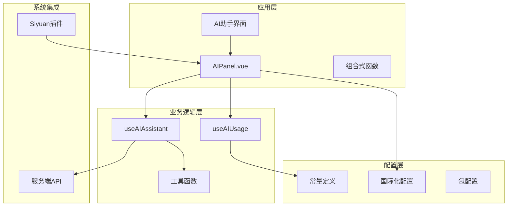

**图表来源**
- [AIPanel.vue:1-687](file://apps/app/components/ai-assistant/AIPanel.vue#L1-L687)
- [useAIAssistant.ts:1-560](file://apps/app/composables/useAIAssistant.ts#L1-L560)
- [useAIUsage.ts:1-115](file://apps/app/composables/useAIUsage.ts#L1-L115)

**章节来源**
- [AIPanel.vue:1-687](file://apps/app/components/ai-assistant/AIPanel.vue#L1-L687)
- [useAIAssistant.ts:1-560](file://apps/app/composables/useAIAssistant.ts#L1-L560)
- [useAIUsage.ts:1-115](file://apps/app/composables/useAIUsage.ts#L1-L115)

## 核心组件

### AI助手面板组件

AIPanel.vue是整个AI助手系统的核心UI组件，负责提供用户界面和交互逻辑。

#### 主要功能模块

1. **消息管理**：维护统一的消息列表，支持用户消息和AI响应
2. **快速操作**：提供速读和问答两个快捷按钮
3. **输入处理**：支持键盘事件和自动滚动功能
4. **使用计数**：显示剩余使用次数和状态
5. **条款确认**：首次使用的用户同意机制

#### 界面布局

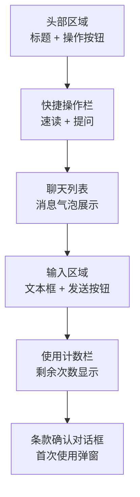

**图表来源**
- [AIPanel.vue:182-325](file://apps/app/components/ai-assistant/AIPanel.vue#L182-L325)

**章节来源**
- [AIPanel.vue:11-180](file://apps/app/components/ai-assistant/AIPanel.vue#L11-L180)

### AI助手组合式函数

useAIAssistant.ts提供了完整的AI助手业务逻辑，包括消息处理、API调用和内容格式化。

#### 核心架构

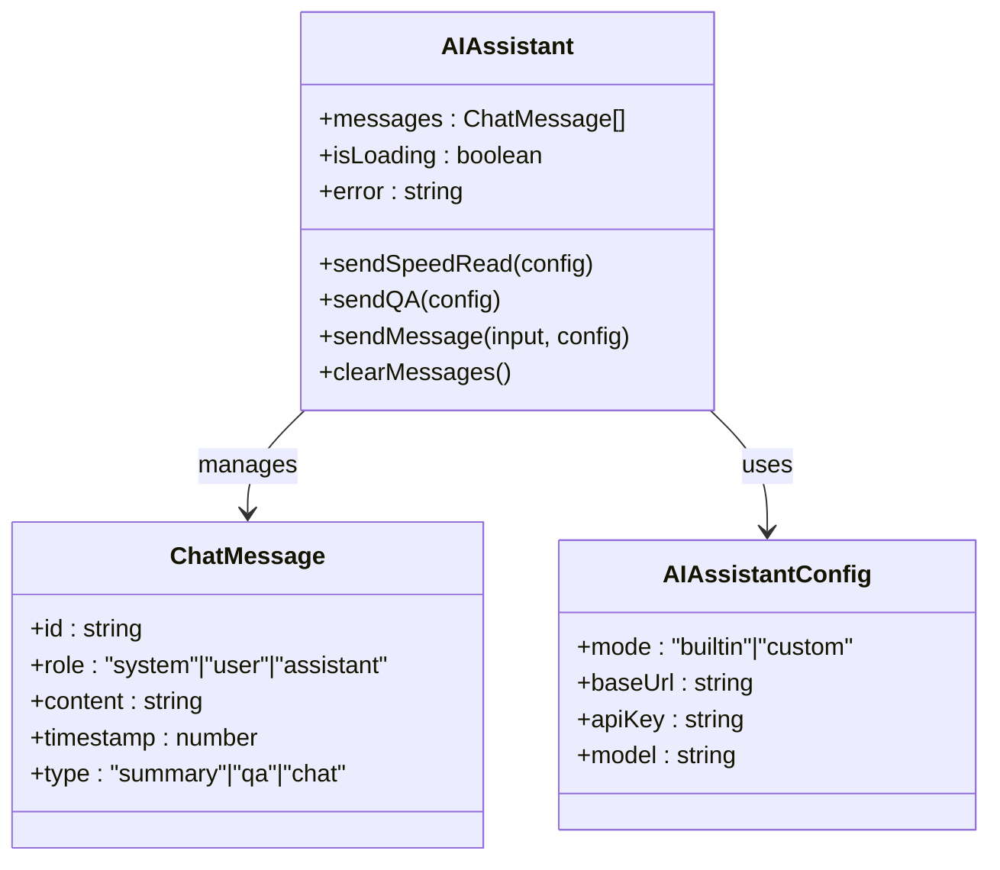

**图表来源**
- [useAIAssistant.ts:24-560](file://apps/app/composables/useAIAssistant.ts#L24-L560)

**章节来源**
- [useAIAssistant.ts:296-501](file://apps/app/composables/useAIAssistant.ts#L296-L501)

### 使用次数管理

useAIUsage.ts实现了客户端的使用次数控制机制，确保API调用的合理使用。

#### 计数策略

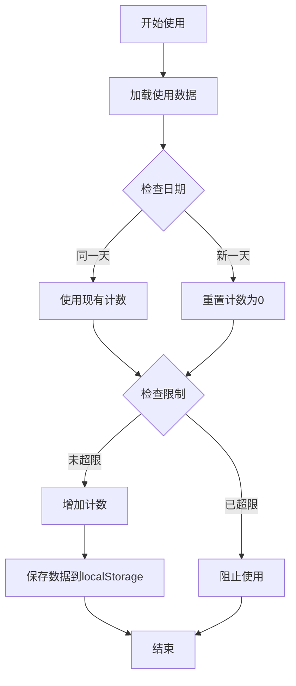

**图表来源**
- [useAIUsage.ts:62-115](file://apps/app/composables/useAIUsage.ts#L62-L115)

**章节来源**
- [useAIUsage.ts:62-115](file://apps/app/composables/useAIUsage.ts#L62-L115)

## 架构概览

AI助手系统采用分层架构设计，实现了前端UI、业务逻辑和数据持久化的分离。

### 系统架构图

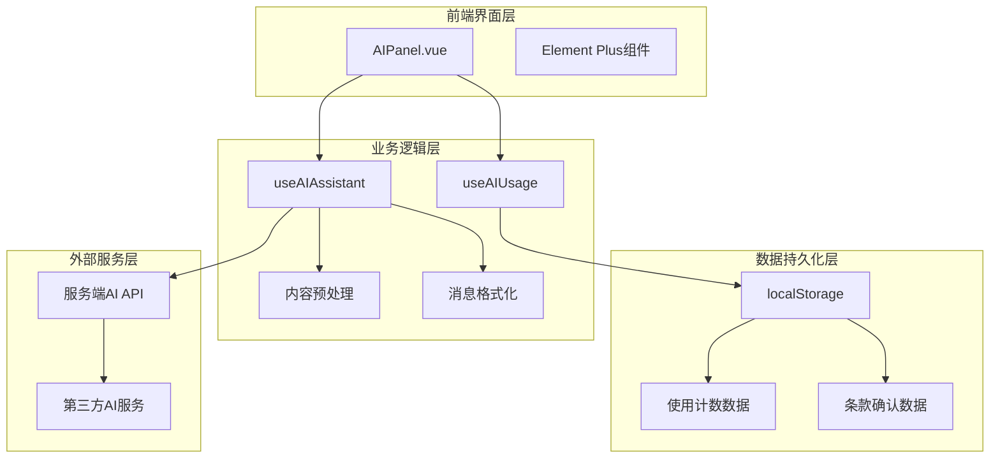

**图表来源**
- [AIPanel.vue:11-51](file://apps/app/components/ai-assistant/AIPanel.vue#L11-L51)
- [useAIAssistant.ts:102-157](file://apps/app/composables/useAIAssistant.ts#L102-L157)
- [useAIUsage.ts:50-58](file://apps/app/composables/useAIUsage.ts#L50-L58)

### 数据流分析

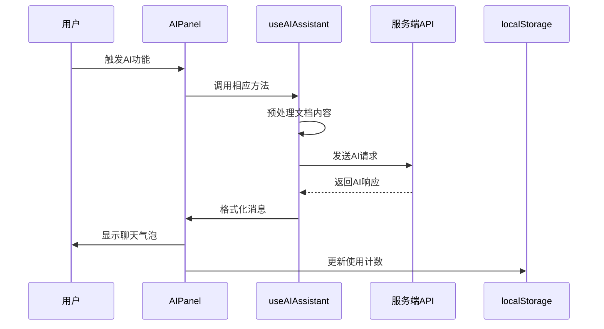

**图表来源**
- [AIPanel.vue:71-133](file://apps/app/components/ai-assistant/AIPanel.vue#L71-L133)
- [useAIAssistant.ts:320-485](file://apps/app/composables/useAIAssistant.ts#L320-L485)

## 详细组件分析

### 内容预处理模块

内容预处理是AI助手系统的重要组成部分，负责将HTML格式的文档内容转换为AI友好的文本格式。

#### 预处理流程

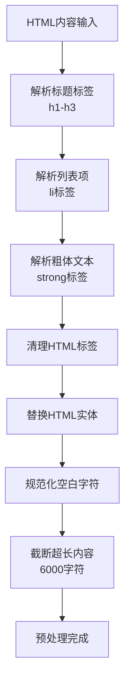

**图表来源**
- [useAIAssistant.ts:59-87](file://apps/app/composables/useAIAssistant.ts#L59-L87)

#### 预处理规则

| 处理类型 | 输入示例 | 输出示例 | 说明 |
|---------|---------|---------|------|
| 标题处理 | `<h2>核心概念</h2>` | `## 核心概念` | 转换为Markdown标题 |
| 列表处理 | `<li>要点一</li>` | `- 要点一` | 转换为Markdown列表 |
| 粗体处理 | `<strong>重要</strong>` | `**重要**` | 保留强调格式 |
| HTML清理 | `<p>段落内容</p>` | `段落内容` | 移除标签结构 |
| 实体替换 | `&amp;` | `&` | 转换单个字符实体 |

**章节来源**
- [useAIAssistant.ts:59-87](file://apps/app/composables/useAIAssistant.ts#L59-L87)

### AI API调用机制

AI助手系统通过服务端代理机制调用AI服务，确保API密钥的安全性和请求的稳定性。

#### API调用流程

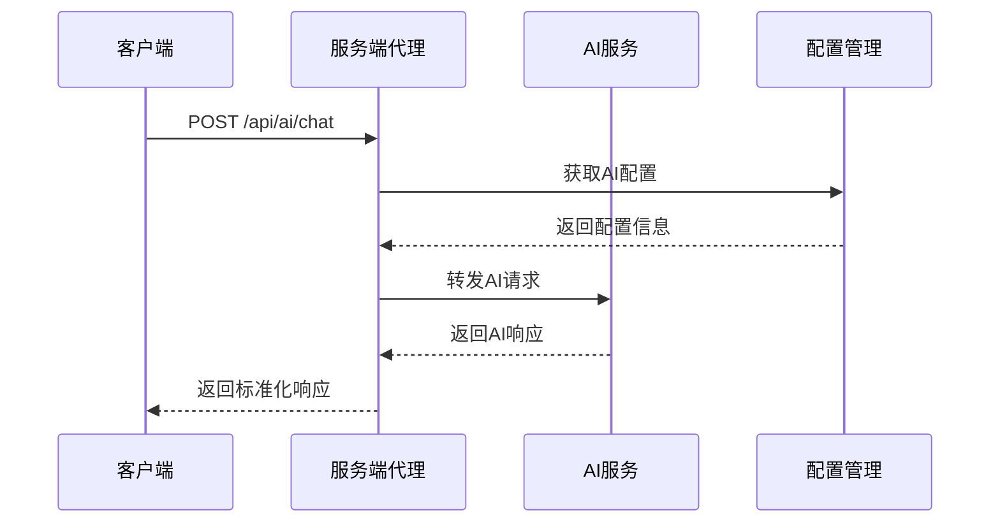

**图表来源**
- [useAIAssistant.ts:102-157](file://apps/app/composables/useAIAssistant.ts#L102-L157)

#### 配置模式

| 模式 | 特点 | 限制 | 使用场景 |
|------|------|------|----------|
| builtin | 服务端内置配置 | 无次数限制 | 日常使用、测试 |
| custom | 用户自定义配置 | 客户端计数限制 | 高级用户、批量处理 |
| proxy | 代理模式 | 无次数限制 | 安全考虑、企业环境 |

**章节来源**
- [useAIAssistant.ts:102-157](file://apps/app/composables/useAIAssistant.ts#L102-L157)

### 消息格式化系统

AI助手系统支持多种消息类型的格式化输出，提供丰富的用户体验。

#### 消息类型定义

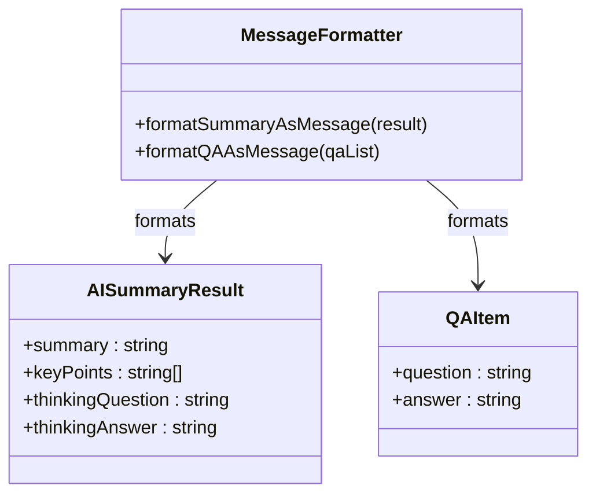

**图表来源**
- [useAIAssistant.ts:508-559](file://apps/app/composables/useAIAssistant.ts#L508-L559)

#### 格式化输出

| 消息类型 | 输出结构 | 特殊功能 |
|----------|----------|----------|
| summary | 核心摘要 + 关键要点 + 延伸思考 | 可展开详情 |
| qa | 文档问答列表 | 逐项展开答案 |
| chat | 标准聊天消息 | 支持富文本 |

**章节来源**
- [useAIAssistant.ts:508-559](file://apps/app/composables/useAIAssistant.ts#L508-L559)

### 国际化支持

AI助手系统提供了完整的国际化支持，目前支持中文和英文两种语言。

#### 本地化配置

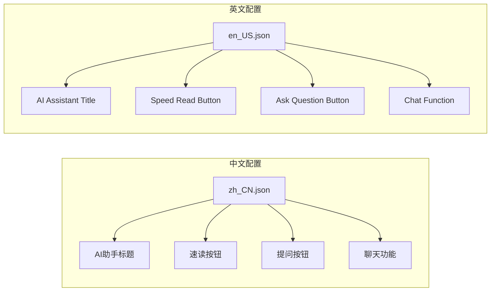

**图表来源**
- [zh_CN.json:124-144](file://apps/app/i18n/locales/zh_CN.json#L124-L144)

**章节来源**
- [zh_CN.json:124-144](file://apps/app/i18n/locales/zh_CN.json#L124-L144)

## 依赖关系分析

### 技术栈依赖

AI助手系统基于现代前端技术栈构建，采用了Vue 3 Composition API和Nuxt 3框架。

#### 核心依赖

```mermaid
graph TB
subgraph "Vue生态"
Vue[Vue 3.5.17]
Nuxt[Nuxt 3.16.0]
Pinia[Pinia 3.0.3]
VueUse[@vueuse/core 13.5.0]
end
subgraph "UI组件"
ElementPlus[Element Plus 2+]
Icons[Element Plus Icons]
end
subgraph "工具库"
Lodash[Lodash Unified]
Dayjs[Dayjs 1.11.13]
Cheerio[Cheap 1.1.1]
end
subgraph "构建工具"
Vite[Vite 5.4.19]
Stylus[Stylus 0.64.0]
end
Vue --> Nuxt
Vue --> Pinia
Vue --> VueUse
ElementPlus --> Icons
Nuxt --> Vite
Vite --> Stylus
```

**图表来源**
- [package.json:13-33](file://apps/app/package.json#L13-L33)

### 插件集成

AI助手系统作为SiYuan笔记的插件运行，需要与主应用进行集成。

#### 插件配置

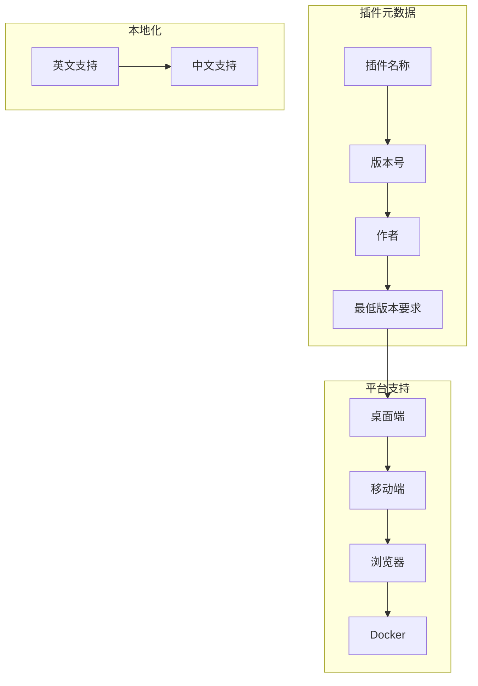

**图表来源**
- [plugin.json:1-43](file://apps/siyuan/plugin.json#L1-L43)

**章节来源**
- [plugin.json:1-43](file://apps/siyuan/plugin.json#L1-L43)

## 性能考虑

### Token优化策略

AI助手系统通过智能的内容预处理和缓存机制，有效优化了Token使用效率。

#### 性能优化措施

1. **内容截断**：预处理后的内容限制在6000字符以内
2. **缓存机制**：处理后的文档内容在组件生命周期内缓存
3. **增量处理**：只发送必要的系统提示和用户输入
4. **响应过滤**：移除AI模型的思维链输出，减少冗余内容

### 内存管理

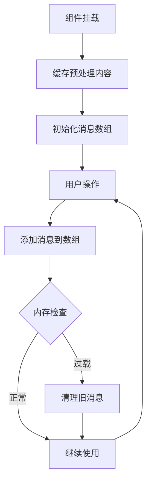

**图表来源**
- [useAIAssistant.ts:304-314](file://apps/app/composables/useAIAssistant.ts#L304-L314)

### 网络请求优化

1. **请求合并**：将多个操作合并为单个API调用
2. **错误重试**：实现智能的错误处理和重试机制
3. **超时控制**：设置合理的请求超时时间
4. **状态管理**：实时更新加载状态和错误信息

## 故障排除指南

### 常见问题及解决方案

#### 使用次数耗尽

**问题现象**：按钮变灰，无法使用AI功能

**解决方案**：
1. 等待次日自动重置
2. 检查localStorage中的使用数据
3. 清除浏览器缓存重新登录

#### API调用失败

**问题现象**：出现错误提示，无法获得AI响应

**排查步骤**：
1. 检查网络连接状态
2. 验证AI服务配置
3. 查看浏览器开发者工具的网络请求
4. 确认服务端API可用性

#### 内容格式异常

**问题现象**：AI返回格式不符合预期

**处理方法**：
1. 检查文档内容的HTML结构
2. 确保文档包含有效的标题和正文
3. 验证内容预处理逻辑
4. 查看AI模型的响应格式

### 调试工具

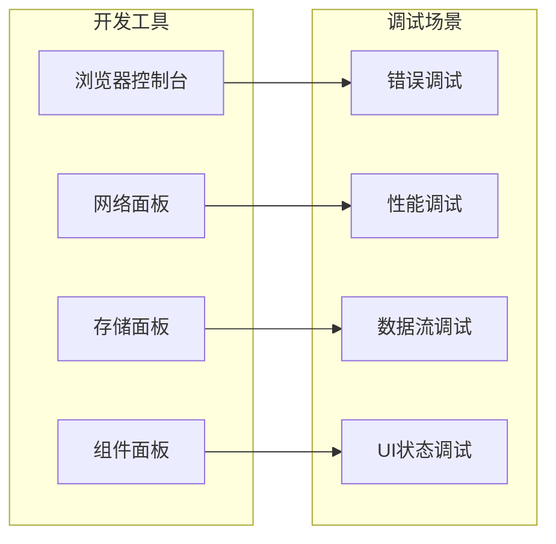

**图表来源**
- [AIPanel.vue:66-96](file://apps/app/components/ai-assistant/AIPanel.vue#L66-L96)

**章节来源**
- [AIPanel.vue:66-96](file://apps/app/components/ai-assistant/AIPanel.vue#L66-L96)

## 结论

AI助手系统通过精心设计的架构和实现，为用户提供了强大而易用的智能阅读辅助功能。系统的主要优势包括：

### 核心优势

1. **统一设计**：所有AI功能都集成在同一个对话面板中，提供一致的用户体验
2. **智能优化**：通过内容预处理和缓存机制，显著提升性能和效率
3. **安全可靠**：采用服务端代理机制，确保API密钥的安全性
4. **灵活配置**：支持内置和自定义两种AI模型模式
5. **持久化管理**：实现使用次数的智能管理和用户同意机制

### 技术亮点

- **现代化架构**：基于Vue 3 Composition API和Nuxt 3框架
- **国际化支持**：完整的多语言本地化机制
- **组件化设计**：高度模块化的组件结构，便于维护和扩展
- **性能优化**：多项性能优化策略，确保流畅的用户体验

### 发展方向

未来可以考虑的功能增强包括：
- 支持更多AI模型和服务提供商
- 增强内容理解和语义分析能力
- 添加更多的个性化配置选项
- 实现更丰富的消息类型和格式
- 优化移动端的用户体验

AI助手系统为SiYuan笔记用户提供了强大的智能化阅读体验，是现代知识管理工具的重要补充。