# UI 组件系统

<cite>
**本文引用的文件**
- [apps/app/components/static/Header.vue](file://apps/app/components/static/Header.vue)
- [apps/app/components/static/Footer.vue](file://apps/app/components/static/Footer.vue)
- [apps/app/components/static/Buttons.vue](file://apps/app/components/static/Buttons.vue)
- [apps/app/components/static/content/left/Sidebar.vue](file://apps/app/components/static/content/left/Sidebar.vue)
- [apps/app/components/static/content/left/MenuItem.vue](file://apps/app/components/static/content/left/MenuItem.vue)
- [apps/app/components/static/content/left/SidebarMenu.vue](file://apps/app/components/static/content/left/SidebarMenu.vue)
- [apps/app/components/static/content/right/Index.vue](file://apps/app/components/static/content/right/Index.vue)
- [apps/app/components/static/content/right/Outline.vue](file://apps/app/components/static/content/right/Outline.vue)
- [apps/app/components/static/content/right/OutlineItem.vue](file://apps/app/components/static/content/right/OutlineItem.vue)
- [apps/app/components/static/content/Main.vue](file://apps/app/components/static/content/Main.vue)
- [apps/siyuan/src/components/Tab.vue](file://apps/siyuan/src/components/Tab.vue)
- [apps/app/components/common/ConfirmPassword.vue](file://apps/app/components/common/ConfirmPassword.vue)
- [apps/app/components/static/Detail.vue](file://apps/app/components/static/Detail.vue)
- [apps/app/composables/useClientThemeMode.ts](file://apps/app/composables/useClientThemeMode.ts)
- [apps/app/composables/useAuthModeFetch.ts](file://apps/app/composables/useAuthModeFetch.ts)
- [apps/app/composables/useAppBase.ts](file://apps/app/composables/useAppBase.ts)
- [apps/app/utils/TreeUtils.ts](file://apps/app/utils/TreeUtils.ts)
- [apps/app/utils/ThemeUtils.ts](file://apps/app/utils/ThemeUtils.ts)
- [apps/app/utils/appLogger.ts](file://apps/app/utils/appLogger.ts)
- [apps/siyuan/src/stores/common/useCommonStorageAsync.ts](file://apps/siyuan/src/stores/common/useCommonStorageAsync.ts)
- [apps/siyuan/src/stores/common/commonStorage.ts](file://apps/siyuan/src/stores/common/commonStorage.ts)
- [apps/app/plugins/libs/domparser/useStaticBlockRef.ts](file://apps/app/plugins/libs/domparser/useStaticBlockRef.ts)
- [apps/app/app.config.ts](file://apps/app/app.config.ts)
- [apps/app/i18n/locales/en_US.json](file://apps/app/i18n/locales/en_US.json)
- [apps/app/i18n/locales/zh_CN.json](file://apps/app/i18n/locales/zh_CN.json)
- [apps/app/assets/css/theme/palette.styl](file://apps/app/assets/css/theme/palette.styl)
- [apps/app/assets/css/fold.styl](file://apps/app/assets/css/fold.styl)
- [apps/app/assets/css/index.styl](file://apps/app/assets/css/index.styl)
- [apps/app/public/resources/appearance/themes/Savor/style/module/menu.css](file://apps/app/public/resources/appearance/themes/Savor/style/module/menu.css)
- [apps/app/public/resources/appearance/themes/pink-room/部件修改/尺寸调节滑杠.css](file://apps/app/public/resources/appearance/themes/pink-room/部件修改/尺寸调节滑杠.css)
- [apps/app/public/resources/appearance/themes/pink-room/部件修改/滚动条.css](file://apps/app/public/resources/appearance/themes/pink-room/部件修改/滚动条.css)
- [apps/app/public/resources/appearance/themes/Savor/style/topbar/salt.css](file://apps/app/public/resources/appearance/themes/Savor/style/topbar/salt.css)
- [apps/app/public/resources/appearance/themes/Savor/style/topbar/sugar.css](file://apps/app/public/resources/appearance/themes/Savor/style/topbar/sugar.css)
- [apps/app/public/resources/appearance/themes/Savor/style/topbar/savor-dark.css](file://apps/app/public/resources/appearance/themes/Savor/style/topbar/savor-dark.css)
- [apps/app/public/resources/appearance/themes/Savor/style/topbar/vinegar.css](file://apps/app/public/resources/appearance/themes/Savor/style/topbar/vinegar.css)
- [apps/app/public/resources/appearance/themes/Savor/theme.css](file://apps/app/public/resources/appearance/themes/Savor/theme.css)
</cite>

## 更新摘要
**所做更改**
- 更新侧边栏和菜单系统样式优化，包括更淡的rgba边框、菜单项高度调整、字体大小优化、内边距调整和自定义滚动条样式
- 新增菜单系统样式优化章节，详细介绍侧边栏边框、菜单项尺寸、字体规格和悬停效果的改进
- 更新智能滚动功能，增强大纲激活状态检测和滚动到章节功能
- 新增大纲面板性能优化和用户体验改进说明
- 新增大纲宽度调整和固定状态的本地存储机制
- **新增分享状态管理功能**：MenuItem组件现在支持分享状态、密码保护和过期检查，提供完整的文档访问控制机制

## 目录
1. [简介](#简介)
2. [项目结构](#项目结构)
3. [核心组件](#核心组件)
4. [架构总览](#架构总览)
5. [组件详解](#组件详解)
6. [菜单系统样式优化](#菜单系统样式优化)
7. [智能自动滚动功能](#智能自动滚动功能)
8. [大纲标题栏系统](#大纲标题栏系统)
9. [状态管理存储系统](#状态管理存储系统)
10. [分享状态管理系统](#分享状态管理系统)
11. [依赖关系分析](#依赖关系分析)
12. [性能与可维护性](#性能与可维护性)
13. [故障排查指南](#故障排查指南)
14. [结论](#结论)
15. [附录](#附录)

## 简介
本文件面向 UI 组件系统，系统化梳理 Vue 组件架构与使用方法，覆盖通用组件、静态组件、公共组件的设计模式与最佳实践；重点解读 Tab 组件、Header、Footer、Detail 等核心组件的功能特性、API 接口与配置项；阐述响应式设计、主题适配与国际化支持；并提供使用示例与集成指南，帮助开发者快速理解与扩展。

**更新** 本次更新重点关注侧边栏和菜单系统的重大样式优化，包括更淡的rgba边框、菜单项高度从40px减少到36px、字体大小从16px减少到12.5px、内边距从20px调整到16px、引入自定义滚动条样式、优化激活状态背景透明度和改进悬停效果。**新增分享状态管理功能**，为文档访问提供完整的权限控制机制。

## 项目结构
UI 组件主要分布在以下目录：
- apps/app/components/static：静态布局与交互组件（Header、Footer、Buttons、Sidebar、Outline 等）
- apps/app/components/static/content/left：左侧菜单系统（Sidebar、MenuItem、SidebarMenu）
- apps/app/components/static/content/right：右侧大纲系统（Index、Outline、OutlineItem）
- apps/app/components/common：跨页面复用的通用组件（ConfirmPassword、ImagePreview）
- apps/app/components/public：公开分享相关组件（Detail 等）
- apps/siyuan/src/components：SiYuan 环境下的通用组件（Tab）
- apps/app/composables：组合式逻辑（主题模式、路由、鉴权等）
- apps/siyuan/src/stores/common：通用状态管理存储（useCommonStorageAsync、commonStorage）
- apps/app/utils：工具类（TreeUtils、ThemeUtils、appLogger）
- apps/app/app.config.ts：全局配置类型与默认值
- apps/app/i18n/locales：国际化词条（中英文）
- apps/app/assets/css：核心样式文件（theme、fold、index）
- apps/app/public/resources/appearance/themes：主题样式文件
- apps/app/public/resources/appearance/themes/pink-room/部件修改：尺寸调节滑杠样式
- apps/app/public/resources/appearance/themes/pink-room/部件修改：滚动条样式

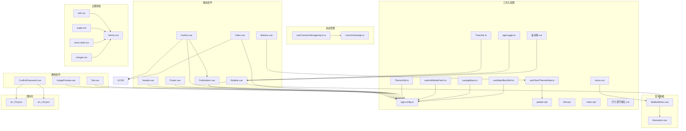

**图表来源**
- [apps/app/components/static/Header.vue:1-131](file://apps/app/components/static/Header.vue#L1-L131)
- [apps/app/components/static/Footer.vue:1-115](file://apps/app/components/static/Footer.vue#L1-L115)
- [apps/app/components/static/Buttons.vue:1-240](file://apps/app/components/static/Buttons.vue#L1-L240)
- [apps/app/components/static/content/left/Sidebar.vue:1-291](file://apps/app/components/static/content/left/Sidebar.vue#L1-L291)
- [apps/app/components/static/content/left/MenuItem.vue:1-175](file://apps/app/components/static/content/left/MenuItem.vue#L1-L175)
- [apps/app/components/static/content/left/SidebarMenu.vue:1-91](file://apps/app/components/static/content/left/SidebarMenu.vue#L1-L91)
- [apps/app/components/static/content/right/Outline.vue:1-154](file://apps/app/components/static/content/right/Outline.vue#L1-L154)
- [apps/app/components/static/content/right/OutlineItem.vue:1-275](file://apps/app/components/static/content/right/OutlineItem.vue#L1-L275)
- [apps/app/components/static/content/right/Index.vue:1-484](file://apps/app/components/static/content/right/Index.vue#L1-L484)
- [apps/siyuan/src/components/Tab.vue:1-147](file://apps/siyuan/src/components/Tab.vue#L1-L147)
- [apps/app/components/common/ConfirmPassword.vue:1-181](file://apps/app/components/common/ConfirmPassword.vue#L1-L181)
- [apps/app/components/static/Detail.vue:1-173](file://apps/app/components/static/Detail.vue#L1-L173)
- [apps/siyuan/src/stores/common/useCommonStorageAsync.ts:1-91](file://apps/siyuan/src/stores/common/useCommonStorageAsync.ts#L1-L91)
- [apps/siyuan/src/stores/common/commonStorage.ts:1-88](file://apps/siyuan/src/stores/common/commonStorage.ts#L1-L88)
- [apps/app/composables/useClientThemeMode.ts:1-158](file://apps/app/composables/useClientThemeMode.ts#L1-L158)
- [apps/app/composables/useAuthModeFetch.ts:200-319](file://apps/app/composables/useAuthModeFetch.ts#L200-L319)
- [apps/app/composables/useAppBase.ts:1-21](file://apps/app/composables/useAppBase.ts#L1-L21)
- [apps/app/utils/TreeUtils.ts:1-59](file://apps/app/utils/TreeUtils.ts#L1-L59)
- [apps/app/utils/ThemeUtils.ts:1-38](file://apps/app/utils/ThemeUtils.ts#L1-L38)
- [apps/app/utils/appLogger.ts:1-22](file://apps/app/utils/appLogger.ts#L1-L22)
- [apps/app/plugins/libs/domparser/useStaticBlockRef.ts:15-82](file://apps/app/plugins/libs/domparser/useStaticBlockRef.ts#L15-L82)
- [apps/app/app.config.ts:1-92](file://apps/app/app.config.ts#L1-L92)
- [apps/app/i18n/locales/zh_CN.json:1-100](file://apps/app/i18n/locales/zh_CN.json#L1-L100)
- [apps/app/i18n/locales/en_US.json:1-100](file://apps/app/i18n/locales/en_US.json#L1-L100)
- [apps/app/assets/css/theme/palette.styl:1-52](file://apps/app/assets/css/theme/palette.styl#L1-L52)
- [apps/app/assets/css/fold.styl:1-29](file://apps/app/assets/css/fold.styl#L1-L29)
- [apps/app/assets/css/index.styl:1-39](file://apps/app/assets/css/index.styl#L1-L39)
- [apps/app/public/resources/appearance/themes/Savor/style/module/menu.css:1-514](file://apps/app/public/resources/appearance/themes/Savor/style/module/menu.css#L1-L514)
- [apps/app/public/resources/appearance/themes/pink-room/部件修改/尺寸调节滑杠.css:1-27](file://apps/app/public/resources/appearance/themes/pink-room/部件修改/尺寸调节滑杠.css#L1-L27)
- [apps/app/public/resources/appearance/themes/pink-room/部件修改/滚动条.css:1-15](file://apps/app/public/resources/appearance/themes/pink-room/部件修改/滚动条.css#L1-L15)
- [apps/app/public/resources/appearance/themes/Savor/style/topbar/salt.css:1-46](file://apps/app/public/resources/appearance/themes/Savor/style/topbar/salt.css#L1-L46)
- [apps/app/public/resources/appearance/themes/Savor/style/topbar/sugar.css:1-44](file://apps/app/public/resources/appearance/themes/Savor/style/topbar/sugar.css#L1-L44)
- [apps/app/public/resources/appearance/themes/Savor/style/topbar/savor-dark.css:1-45](file://apps/app/public/resources/appearance/themes/Savor/style/topbar/savor-dark.css#L1-L45)
- [apps/app/public/resources/appearance/themes/Savor/style/topbar/vinegar.css:1-46](file://apps/app/public/resources/appearance/themes/Savor/style/topbar/vinegar.css#L1-L46)
- [apps/app/public/resources/appearance/themes/Savor/theme.css:110-151](file://apps/app/public/resources/appearance/themes/Savor/theme.css#L110-L151)

**章节来源**
- [apps/app/components/static/Header.vue:1-131](file://apps/app/components/static/Header.vue#L1-L131)
- [apps/app/components/static/Footer.vue:1-115](file://apps/app/components/static/Footer.vue#L1-L115)
- [apps/app/components/static/Buttons.vue:1-240](file://apps/app/components/static/Buttons.vue#L1-L240)
- [apps/app/components/static/content/left/Sidebar.vue:1-291](file://apps/app/components/static/content/left/Sidebar.vue#L1-L291)
- [apps/app/components/static/content/left/MenuItem.vue:1-175](file://apps/app/components/static/content/left/MenuItem.vue#L1-L175)
- [apps/app/components/static/content/left/SidebarMenu.vue:1-91](file://apps/app/components/static/content/left/SidebarMenu.vue#L1-L91)
- [apps/app/components/static/content/right/Outline.vue:1-154](file://apps/app/components/static/content/right/Outline.vue#L1-L154)
- [apps/app/components/static/content/right/OutlineItem.vue:1-275](file://apps/app/components/static/content/right/OutlineItem.vue#L1-L275)
- [apps/app/components/static/content/right/Index.vue:1-484](file://apps/app/components/static/content/right/Index.vue#L1-L484)
- [apps/siyuan/src/components/Tab.vue:1-147](file://apps/siyuan/src/components/Tab.vue#L1-L147)
- [apps/app/components/common/ConfirmPassword.vue:1-181](file://apps/app/components/common/ConfirmPassword.vue#L1-L181)
- [apps/app/components/static/Detail.vue:1-173](file://apps/app/components/static/Detail.vue#L1-L173)
- [apps/siyuan/src/stores/common/useCommonStorageAsync.ts:1-91](file://apps/siyuan/src/stores/common/useCommonStorageAsync.ts#L1-L91)
- [apps/siyuan/src/stores/common/commonStorage.ts:1-88](file://apps/siyuan/src/stores/common/commonStorage.ts#L1-L88)
- [apps/app/composables/useClientThemeMode.ts:1-158](file://apps/app/composables/useClientThemeMode.ts#L1-L158)
- [apps/app/composables/useAuthModeFetch.ts:200-319](file://apps/app/composables/useAuthModeFetch.ts#L200-L319)
- [apps/app/composables/useAppBase.ts:1-21](file://apps/app/composables/useAppBase.ts#L1-L21)
- [apps/app/utils/TreeUtils.ts:1-59](file://apps/app/utils/TreeUtils.ts#L1-L59)
- [apps/app/utils/ThemeUtils.ts:1-38](file://apps/app/utils/ThemeUtils.ts#L1-L38)
- [apps/app/utils/appLogger.ts:1-22](file://apps/app/utils/appLogger.ts#L1-L22)
- [apps/app/plugins/libs/domparser/useStaticBlockRef.ts:15-82](file://apps/app/plugins/libs/domparser/useStaticBlockRef.ts#L15-L82)
- [apps/app/app.config.ts:1-92](file://apps/app/app.config.ts#L1-L92)
- [apps/app/i18n/locales/zh_CN.json:1-100](file://apps/app/i18n/locales/zh_CN.json#L1-L100)
- [apps/app/i18n/locales/en_US.json:1-100](file://apps/app/i18n/locales/en_US.json#L1-L100)
- [apps/app/assets/css/theme/palette.styl:1-52](file://apps/app/assets/css/theme/palette.styl#L1-L52)
- [apps/app/assets/css/fold.styl:1-29](file://apps/app/assets/css/fold.styl#L1-L29)
- [apps/app/assets/css/index.styl:1-39](file://apps/app/assets/css/index.styl#L1-L39)
- [apps/app/public/resources/appearance/themes/Savor/style/module/menu.css:1-514](file://apps/app/public/resources/appearance/themes/Savor/style/module/menu.css#L1-L514)
- [apps/app/public/resources/appearance/themes/pink-room/部件修改/尺寸调节滑杠.css:1-27](file://apps/app/public/resources/appearance/themes/pink-room/部件修改/尺寸调节滑杠.css#L1-L27)
- [apps/app/public/resources/appearance/themes/pink-room/部件修改/滚动条.css:1-15](file://apps/app/public/resources/appearance/themes/pink-room/部件修改/滚动条.css#L1-L15)
- [apps/app/public/resources/appearance/themes/Savor/style/topbar/salt.css:1-46](file://apps/app/public/resources/appearance/themes/Savor/style/topbar/salt.css#L1-L46)
- [apps/app/public/resources/appearance/themes/Savor/style/topbar/sugar.css:1-44](file://apps/app/public/resources/appearance/themes/Savor/style/topbar/sugar.css#L1-L44)
- [apps/app/public/resources/appearance/themes/Savor/style/topbar/savor-dark.css:1-45](file://apps/app/public/resources/appearance/themes/Savor/style/topbar/savor-dark.css#L1-L45)
- [apps/app/public/resources/appearance/themes/Savor/style/topbar/vinegar.css:1-46](file://apps/app/public/resources/appearance/themes/Savor/style/topbar/vinegar.css#L1-L46)
- [apps/app/public/resources/appearance/themes/Savor/theme.css:110-151](file://apps/app/public/resources/appearance/themes/Savor/theme.css#L110-L151)

## 核心组件
- Header：站点导航与品牌展示，支持 Logo、站点名称与自定义头部 HTML 片段
- Footer：版权信息、版本号、跳转入口与主题模式切换
- Buttons：返回顶部、主题模式弹窗选择等交互按钮集合
- Sidebar：基于文档树的左侧导航菜单，支持展开、高亮、层级控制和智能自动滚动
- MenuItem：菜单项组件，支持文本截断、工具提示和点击区域优化，**新增分享状态管理功能**
- SidebarMenu：菜单容器组件，支持嵌套菜单和激活状态管理
- Index：右侧大纲容器，支持标题栏、固定显示、宽度调整和智能滚动
- Outline：右侧大纲内容组件，支持固定定位、宽度控制和智能滚动
- OutlineItem：大纲项组件，支持层级缩进、激活状态和滚动到章节
- Main：正文内容容器，支持图片预览和富文本渲染
- Tab：标签页容器，支持横向/纵向、动态内容渲染与事件回调
- ConfirmPassword：密码确认表单，内置校验与加载态
- ImagePreview：图片预览弹层，基于第三方库封装
- Detail：**新增分享状态管理组件**，支持文档分享状态检查、密码验证和过期检查

**更新** 新增大纲标题栏系统和状态管理存储系统，显著提升了用户体验和界面灵活性。**新增分享状态管理系统**，提供完整的文档访问控制机制。

**章节来源**
- [apps/app/components/static/Header.vue:1-131](file://apps/app/components/static/Header.vue#L1-L131)
- [apps/app/components/static/Footer.vue:1-115](file://apps/app/components/static/Footer.vue#L1-L115)
- [apps/app/components/static/Buttons.vue:1-240](file://apps/app/components/static/Buttons.vue#L1-L240)
- [apps/app/components/static/content/left/Sidebar.vue:1-291](file://apps/app/components/static/content/left/Sidebar.vue#L1-L291)
- [apps/app/components/static/content/left/MenuItem.vue:1-175](file://apps/app/components/static/content/left/MenuItem.vue#L1-L175)
- [apps/app/components/static/content/left/SidebarMenu.vue:1-91](file://apps/app/components/static/content/left/SidebarMenu.vue#L1-L91)
- [apps/app/components/static/content/right/Index.vue:1-484](file://apps/app/components/static/content/right/Index.vue#L1-L484)
- [apps/app/components/static/content/right/Outline.vue:1-154](file://apps/app/components/static/content/right/Outline.vue#L1-L154)
- [apps/app/components/static/content/right/OutlineItem.vue:1-275](file://apps/app/components/static/content/right/OutlineItem.vue#L1-L275)
- [apps/app/components/static/content/Main.vue:1-80](file://apps/app/components/static/content/Main.vue#L1-L80)
- [apps/siyuan/src/components/Tab.vue:1-147](file://apps/siyuan/src/components/Tab.vue#L1-L147)
- [apps/app/components/common/ConfirmPassword.vue:1-181](file://apps/app/components/common/ConfirmPassword.vue#L1-L181)
- [apps/app/components/common/ImagePreview.vue:1-64](file://apps/app/components/common/ImagePreview.vue#L1-L64)
- [apps/app/components/static/Detail.vue:1-173](file://apps/app/components/static/Detail.vue#L1-L173)

## 架构总览
组件系统采用"静态布局 + 通用组件 + 组合式逻辑 + 状态管理"的分层设计：
- 配置驱动：通过 app.config.ts 的 AppConfig 类型统一管理站点、主题、导航等配置
- 主题适配：useClientThemeMode.ts 动态注入主题样式与代码高亮样式，支持明/暗模式切换
- 国际化：i18n 词条按模块组织，组件通过 useI18n 获取文案
- 工具支撑：ThemeUtils 提供资源路径拼接，TreeUtils 处理树形数据结构，appLogger 提供日志记录
- 菜单系统：Sidebar 作为主容器，SidebarMenu 和 MenuItem 提供细粒度的菜单功能，支持智能自动滚动和**分享状态管理**
- 大纲系统：Index 作为右侧容器，Outline 和 OutlineItem 提供层级化的大纲功能，支持标题栏、固定显示和智能滚动
- 状态管理：useCommonStorageAsync 和 commonStorage 提供统一的状态存储和管理机制
- **分享状态管理**：Detail 组件提供完整的文档分享状态检查、密码验证和过期检查功能

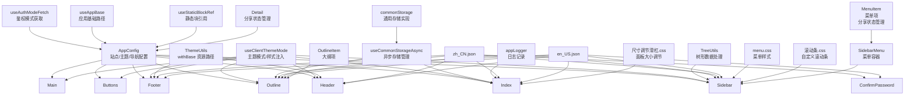

**图表来源**
- [apps/app/app.config.ts:1-92](file://apps/app/app.config.ts#L1-L92)
- [apps/app/composables/useClientThemeMode.ts:1-158](file://apps/app/composables/useClientThemeMode.ts#L1-L158)
- [apps/siyuan/src/stores/common/useCommonStorageAsync.ts:1-91](file://apps/siyuan/src/stores/common/useCommonStorageAsync.ts#L1-L91)
- [apps/siyuan/src/stores/common/commonStorage.ts:1-88](file://apps/siyuan/src/stores/common/commonStorage.ts#L1-L88)
- [apps/app/composables/useAuthModeFetch.ts:200-319](file://apps/app/composables/useAuthModeFetch.ts#L200-L319)
- [apps/app/composables/useAppBase.ts:1-21](file://apps/app/composables/useAppBase.ts#L1-L21)
- [apps/app/utils/ThemeUtils.ts:1-38](file://apps/app/utils/ThemeUtils.ts#L1-L38)
- [apps/app/utils/TreeUtils.ts:1-59](file://apps/app/utils/TreeUtils.ts#L1-L59)
- [apps/app/utils/appLogger.ts:1-22](file://apps/app/utils/appLogger.ts#L1-L22)
- [apps/app/plugins/libs/domparser/useStaticBlockRef.ts:15-82](file://apps/app/plugins/libs/domparser/useStaticBlockRef.ts#L15-L82)
- [apps/app/i18n/locales/zh_CN.json:1-100](file://apps/app/i18n/locales/zh_CN.json#L1-L100)
- [apps/app/i18n/locales/en_US.json:1-100](file://apps/app/i18n/locales/en_US.json#L1-L100)
- [apps/app/public/resources/appearance/themes/Savor/style/module/menu.css:1-514](file://apps/app/public/resources/appearance/themes/Savor/style/module/menu.css#L1-L514)
- [apps/app/public/resources/appearance/themes/pink-room/部件修改/尺寸调节滑杠.css:1-27](file://apps/app/public/resources/appearance/themes/pink-room/部件修改/尺寸调节滑杠.css#L1-L27)
- [apps/app/public/resources/appearance/themes/pink-room/部件修改/滚动条.css:1-15](file://apps/app/public/resources/appearance/themes/pink-room/部件修改/滚动条.css#L1-L15)

## 组件详解

### Header 组件
- 功能要点
  - 展示站点 Logo 与标题，支持隐藏标题
  - 支持注入自定义头部 HTML（header 字段）
  - 响应式布局：窄屏下标题隐藏，移动端进一步简化
- 关键属性
  - setting: AppConfig（包含 siteTitle、themeConfig.logo、header 等）
- 国际化
  - 使用 useI18n 获取文案上下文
- 主题适配
  - 通过 ThemeUtils.withBase 拼接带 base 的资源路径
- 响应式
  - 媒体查询控制不同屏幕下的显示策略


**图表来源**
- [apps/app/components/static/Header.vue:1-131](file://apps/app/components/static/Header.vue#L1-L131)
- [apps/app/utils/ThemeUtils.ts:1-38](file://apps/app/utils/ThemeUtils.ts#L1-L38)

**章节来源**
- [apps/app/components/static/Header.vue:1-131](file://apps/app/components/static/Header.vue#L1-L131)
- [apps/app/utils/ThemeUtils.ts:1-38](file://apps/app/utils/ThemeUtils.ts#L1-L38)

### Footer 组件
- 功能要点
  - 显示版权年份、版本号、跳转入口（首页、关于、GitHub）
  - 主题模式切换按钮委托 Buttons 组件
  - 支持注入自定义底部 HTML（footer 字段）
  - 默认语言初始化
- 关键属性
  - setting: AppConfig
- 交互流程
  - 点击事件触发跳转或主题切换
  - onBeforeMount 设置语言


**图表来源**
- [apps/app/components/static/Footer.vue:1-115](file://apps/app/components/static/Footer.vue#L1-L115)
- [apps/app/components/static/Buttons.vue:1-240](file://apps/app/components/static/Buttons.vue#L1-L240)
- [apps/app/composables/useClientThemeMode.ts:1-158](file://apps/app/composables/useClientThemeMode.ts#L1-L158)

**章节来源**
- [apps/app/components/static/Footer.vue:1-115](file://apps/app/components/static/Footer.vue#L1-L115)
- [apps/app/components/static/Buttons.vue:1-240](file://apps/app/components/static/Buttons.vue#L1-L240)
- [apps/app/composables/useClientThemeMode.ts:1-158](file://apps/app/composables/useClientThemeMode.ts#L1-L158)

### Buttons 组件
- 功能要点
  - 返回顶部：滚动超过阈值显示
  - 主题模式选择：悬浮弹窗，支持 light/dark
  - 评论入口（预留）
- 关键属性
  - defaultMode: "auto" | "light" | "dark"
- 交互细节
  - 滚动节流监听，避免高频计算
  - 鼠标进入/离开控制弹窗显隐

**章节来源**
- [apps/app/components/static/Buttons.vue:1-240](file://apps/app/components/static/Buttons.vue#L1-L240)

### Sidebar 组件
- 功能要点
  - 基于 docTree 构建树形菜单
  - 默认展开至当前文档父链
  - 支持从文档树来源的高亮与展开
  - **智能自动滚动**：自动滚动到激活菜单项，支持重试机制、边界检查和平滑滚动
  - **分享状态管理**：支持文档分享状态、密码保护和过期检查
- 关键属性
  - post: 包含 docTree、postid、docTreeLevel 等
  - setting: AppConfig（docPath）
- 数据处理
  - TreeUtils.addParentIds 补全父子关系
  - 递归构建树结构，生成链接
  - **传递分享状态属性：isShared、hasPassword、isExpired**
- 交互优化
  - 滚动到激活菜单项，确保可见性
  - 支持从文档树来源的特殊处理
  - **智能滚动算法**：包含重试机制、边界检查、平滑滚动和日志记录

**更新** 新增智能自动滚动功能，显著提升了用户体验。**新增分享状态管理功能**，支持文档访问控制。

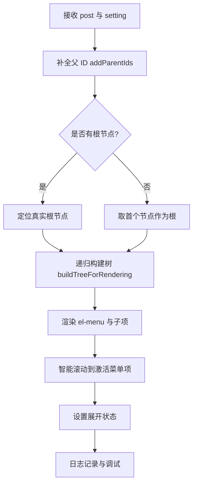

**图表来源**
- [apps/app/components/static/content/left/Sidebar.vue:24-109](file://apps/app/components/static/content/left/Sidebar.vue#L24-L109)
- [apps/app/components/static/content/left/Sidebar.vue:24-109](file://apps/app/components/static/content/left/Sidebar.vue#L24-L109)

**章节来源**
- [apps/app/components/static/content/left/Sidebar.vue:1-291](file://apps/app/components/static/content/left/Sidebar.vue#L1-L291)

### Index 组件（新增大纲容器）
- 功能要点
  - 作为右侧大纲的主容器，支持标题栏、固定显示、宽度调整和智能滚动
  - 使用 useState 确保 SSR 和客户端状态一致性，避免闪烁
  - 支持大纲的展开/收起、固定显示和宽度拖拽调整
  - 集成滚动监听，实时更新激活的大纲项
- 关键属性
  - post: 文章数据，包含 outline 和 outlineLevel
  - setting: AppConfig
- 状态管理
  - showOutline: 控制大纲显示状态（useState 确保一致性）
  - isPinned: 控制大纲固定显示状态（useState 确保一致性）
  - outlineWidth: 大纲宽度状态，支持拖拽调整
- 本地存储
  - 使用 localStorage 保存大纲宽度和固定状态
  - 支持跨会话状态持久化
- 交互功能
  - 标题栏按钮：图钉（固定/取消固定）、关闭（收起大纲）
  - 拖拽调整：鼠标拖拽调整大纲宽度
  - hover 展开：鼠标悬停时自动展开大纲
  - 滚动监听：监听页面滚动，更新激活的大纲项

**更新** 新增大纲标题栏系统，显著提升了用户体验和界面灵活性。

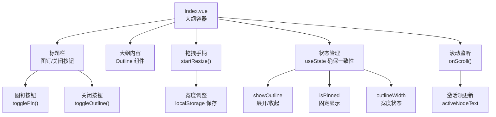

**图表来源**
- [apps/app/components/static/content/right/Index.vue:231-255](file://apps/app/components/static/content/right/Index.vue#L231-L255)
- [apps/app/components/static/content/right/Index.vue:95-123](file://apps/app/components/static/content/right/Index.vue#L95-L123)
- [apps/app/components/static/content/right/Index.vue:204-219](file://apps/app/components/static/content/right/Index.vue#L204-L219)

**章节来源**
- [apps/app/components/static/content/right/Index.vue:1-484](file://apps/app/components/static/content/right/Index.vue#L1-L484)

### Outline 组件
- 功能要点
  - 渲染右侧大纲内容，支持固定定位和宽度控制
  - 自动推断根层级与最大层级
  - 支持激活文本高亮和智能滚动
- 关键属性
  - outlineData: 标题数组
  - maxDepth: 最大层级
  - activeText: 激活文本
  - width: 大纲面板宽度，默认 280px
- 样式适配
  - 暗色模式下自动切换背景与边框
  - 固定定位确保在滚动时保持可见
  - 内联样式覆盖默认宽度

**更新** 新增大纲面板可调整大小功能，支持固定定位和宽度控制。

```mermaid
flowchart TD
A["接收 outlineData, activeText, width"] --> B["计算根层级 getRootLevel()"]
B --> C["渲染大纲项 OutlineItem"]
C --> D["监听 activeText 变化"]
D --> E["智能滚动到激活项 scrollToActiveItem()"]
E --> F["固定定位 position: fixed"]
F --> G["宽度控制 :style=\"{ width: width + 'px' }\""]
```

**图表来源**
- [apps/app/components/static/content/right/Outline.vue:35-48](file://apps/app/components/static/content/right/Outline.vue#L35-L48)
- [apps/app/components/static/content/right/Outline.vue:55-90](file://apps/app/components/static/content/right/Outline.vue#L55-L90)

**章节来源**
- [apps/app/components/static/content/right/Outline.vue:1-154](file://apps/app/components/static/content/right/Outline.vue#L1-L154)

### OutlineItem 组件
- 功能要点
  - 渲染单个大纲项，支持层级缩进
  - 激活状态高亮和父级半激活状态
  - 滚动到对应章节内容
  - 文本清理和标题提取
- 关键属性
  - item: 大纲项数据
  - maxDepth: 最大层级
  - isRoot: 是否为根节点
  - rootLevel: 根层级
  - activeText: 激活文本
  - containerWidth: 容器宽度
- 样式优化
  - 递减缩进策略，提升可读性
  - 悬停效果和激活状态样式
  - 暗色模式适配

**更新** 新增层级缩进优化和激活状态增强功能。

**章节来源**
- [apps/app/components/static/content/right/OutlineItem.vue:1-275](file://apps/app/components/static/content/right/OutlineItem.vue#L1-L275)

### Main 组件
- 功能要点
  - 渲染正文内容，支持富文本
  - 图片预览功能集成
  - 内容可编辑属性控制
- 关键属性
  - post: 文章数据
  - setting: 应用配置
- 性能优化
  - 内联样式移除，提升渲染性能
  - 客户端渲染图片预览组件

**章节来源**
- [apps/app/components/static/content/Main.vue:1-80](file://apps/app/components/static/content/Main.vue#L1-L80)

### Tab 组件
- 功能要点
  - 支持横向/纵向标签页
  - 动态内容渲染（组件或文本）
  - tabChange 事件回调
- 关键属性
  - tabs: 数组，每项包含 label、content、props
  - activeTab: 当前激活索引
  - vertical: 是否纵向
- 事件
  - tabChange(index)

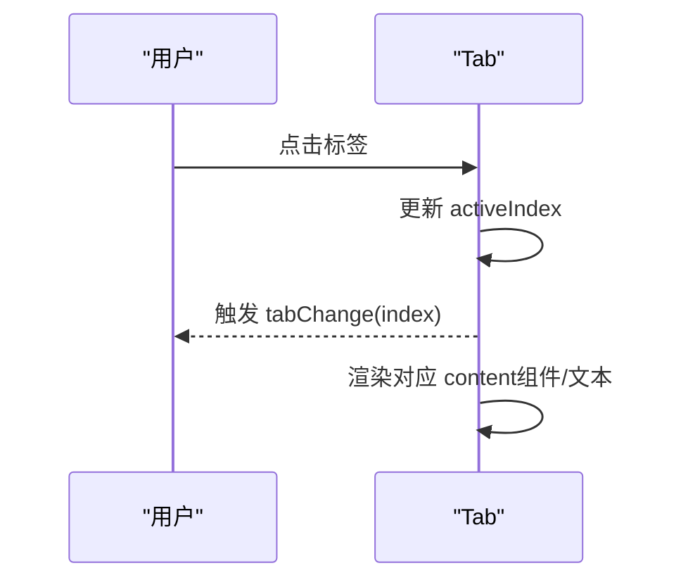

**图表来源**
- [apps/siyuan/src/components/Tab.vue:1-147](file://apps/siyuan/src/components/Tab.vue#L1-L147)

**章节来源**
- [apps/siyuan/src/components/Tab.vue:1-147](file://apps/siyuan/src/components/Tab.vue#L1-L147)

### ConfirmPassword 组件
- 功能要点
  - 密码输入表单，内置校验规则
  - 支持重置与外部赋值
  - 提交时触发事件并携带密码
- 关键属性
  - title/description/placeholder/submitText/hint/initialValue
- 事件
  - submit(password)
  - cancel()

**章节来源**
- [apps/app/components/common/ConfirmPassword.vue:1-181](file://apps/app/components/common/ConfirmPassword.vue#L1-L181)

### ImagePreview 组件
- 功能要点
  - 基于第三方库的图片预览弹层
  - 暴露 show(index) 方法以供外部调用
- 关键属性
  - images: 图片数组
  - index: 默认索引
- 事件
  - hide

**章节来源**
- [apps/app/components/common/ImagePreview.vue:1-64](file://apps/app/components/common/ImagePreview.vue#L1-L64)

### Detail 组件（新增分享状态管理）
- 功能要点
  - **文档分享状态检查**：检查文档是否已分享、是否已过期
  - **密码验证**：支持密码保护的文档访问
  - **过期检查**：自动检测文档过期状态
  - **SEO 优化**：动态设置页面标题、描述和图片
  - **权限控制**：根据分享状态显示相应的内容或提示
- 关键属性
  - showTitleSign: 是否显示标题后缀
  - overrideSeo: 是否覆盖 SEO 设置
  - pageId: 页面 ID
  - setting: AppConfig
- 状态管理
  - formData.isShared: 文档分享状态
  - formData.isExpires: 文档过期状态
  - formData.shareOptions.passwordEnabled: 密码保护开关
  - formData.shareOptions.password: 存储的密码
- 交互功能
  - **密码提交**：validatePassword API 验证密码
  - **URL 参数更新**：验证成功后更新 key 参数
  - **状态切换**：根据分享状态显示不同内容

**更新** 新增完整的分享状态管理功能，提供文档访问控制机制。

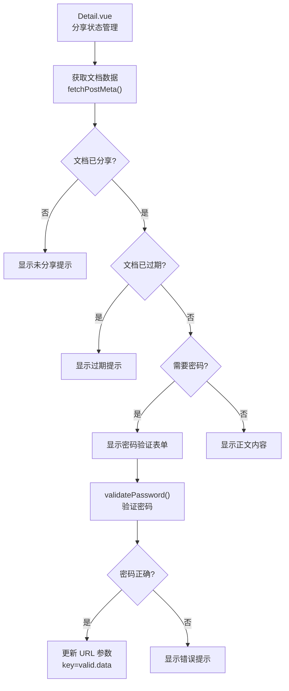

**图表来源**
- [apps/app/components/static/Detail.vue:49-83](file://apps/app/components/static/Detail.vue#L49-L83)
- [apps/app/components/static/Detail.vue:116-129](file://apps/app/components/static/Detail.vue#L116-L129)

**章节来源**
- [apps/app/components/static/Detail.vue:1-173](file://apps/app/components/static/Detail.vue#L1-L173)

## 菜单系统样式优化

### 侧边栏样式优化
侧边栏经过重大样式优化，采用更淡的rgba边框替代实线边框，提升视觉层次感：

- **边框优化**：使用 `rgba(0, 0, 0, 0.06)` 替代传统实线边框，提供更柔和的视觉效果
- **滚动条定制**：引入更精致的滚动条样式，宽度从默认的6px调整为3px，拇指高度2px，提供更好的滚动体验
- **激活状态优化**：激活菜单项背景使用 `rgba(24, 144, 255, 0.06)` 的更淡透明度，提升视觉层次
- **悬停效果改进**：悬停时使用 `rgba(24, 144, 255, 0.04)` 的浅色背景，提供更细腻的交互反馈

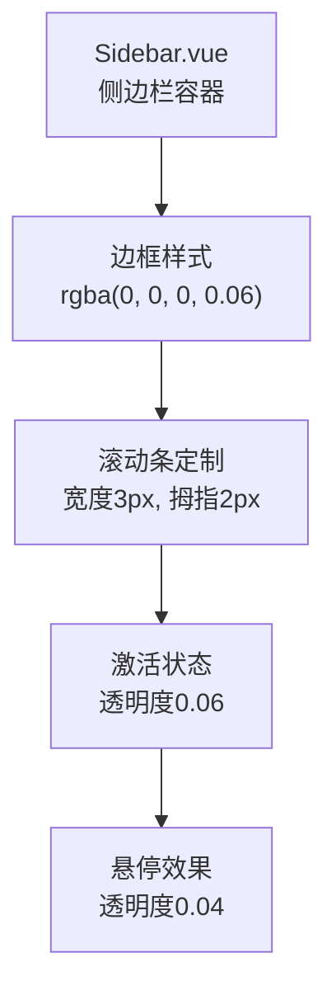

**图表来源**
- [apps/app/components/static/content/left/Sidebar.vue:223-291](file://apps/app/components/static/content/left/Sidebar.vue#L223-L291)

### 菜单项尺寸优化
菜单项经过精心的尺寸调整，提升整体视觉效果和用户体验：

- **高度调整**：菜单项高度从40px减少到36px，提供更紧凑的视觉效果
- **字体优化**：字体大小从16px减少到12.5px，提升信息密度
- **内边距调整**：内边距从20px调整到16px，优化视觉平衡
- **最小高度优化**：菜单项最小高度设置为36px，确保点击区域充足
- **行高匹配**：行高与高度保持一致，确保文本垂直居中

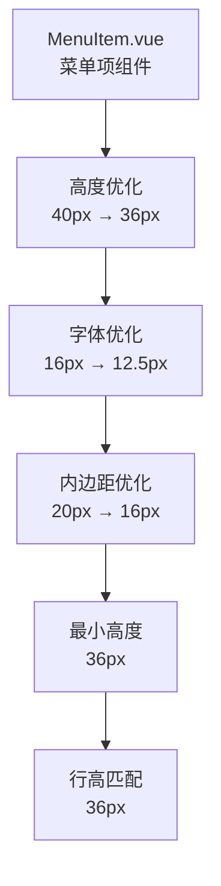

**图表来源**
- [apps/app/components/static/content/left/MenuItem.vue:74-96](file://apps/app/components/static/content/left/MenuItem.vue#L74-L96)

### 悬停效果改进
菜单系统的悬停效果经过优化，提供更细腻的交互体验：

- **激活状态**：使用 `rgba(24, 144, 255, 0.06)` 的背景色，提供微妙的高亮效果
- **悬停状态**：使用 `rgba(24, 144, 255, 0.04)` 的浅色背景，确保视觉层次清晰
- **文本颜色**：悬停时文本颜色变为 `#1890ff`，提供明确的视觉引导
- **子菜单优化**：子菜单标题的悬停效果与主菜单保持一致的透明度级别

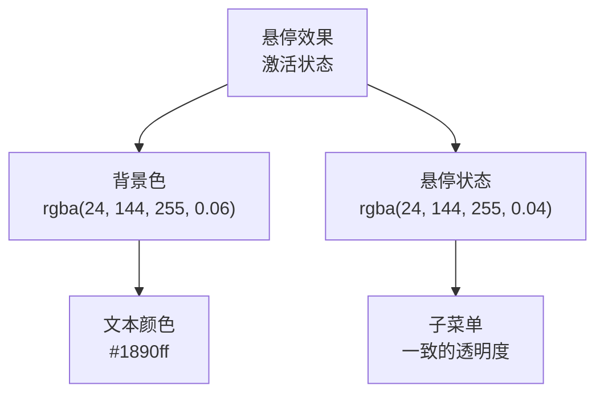

**图表来源**
- [apps/app/components/static/content/left/Sidebar.vue:271-284](file://apps/app/components/static/content/left/Sidebar.vue#L271-L284)

### 标题栏样式优化
侧边栏标题栏经过优化，提升整体视觉效果：

- **字体调整**：标题字体大小从16px调整为13px，提供更紧凑的视觉效果
- **字重优化**：标题字重设置为600，确保视觉层次清晰
- **间距优化**：顶部间距从20px调整为16px，提供更紧凑的布局
- **内边距调整**：内边距从12px调整为8px，优化视觉平衡
- **字间距优化**：字间距设置为-0.01em，提升文本可读性

**章节来源**
- [apps/app/components/static/content/left/Sidebar.vue:245-252](file://apps/app/components/static/content/left/Sidebar.vue#L245-L252)
- [apps/app/components/static/content/left/MenuItem.vue:93-95](file://apps/app/components/static/content/left/MenuItem.vue#L93-L95)

## 智能自动滚动功能

### 滚动算法概述
Sidebar 组件新增了智能自动滚动功能，通过复杂的算法确保激活菜单项始终处于可视区域的中心位置。该功能包含重试机制、边界检查和平滑滚动等高级特性。

### 核心算法实现
智能滚动功能的核心实现包含以下关键步骤：

1. **元素定位**：优先查找 `.el-menu-item.is-active`，如果不存在则回退到任意 `.is-active` 元素
2. **位置计算**：获取元素相对于滚动容器的位置信息
3. **可视区域判断**：检查元素是否已在可视区域内且接近中心
4. **目标滚动计算**：计算使元素居中的目标滚动位置
5. **边界检查**：确保滚动位置在有效范围内
6. **平滑滚动**：使用 Element Plus 的 `scrollTo` 方法进行平滑滚动
7. **重试机制**：验证滚动结果，必要时进行重试

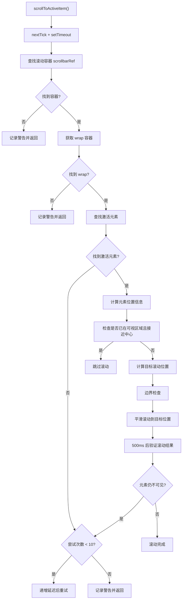

**图表来源**
- [apps/app/components/static/content/left/Sidebar.vue:24-109](file://apps/app/components/static/content/left/Sidebar.vue#L24-L109)

### 重试机制设计
智能滚动功能包含完善的重试机制：

- **最大尝试次数**：最多尝试 10 次
- **递增延迟**：每次重试增加 100ms 延迟，最长 1000ms
- **条件检查**：只有在元素未找到或滚动后仍不可见时才重试
- **日志记录**：详细记录每次尝试的结果和原因

### 边界检查机制
为了确保滚动行为的稳定性，系统实现了严格的边界检查：

- **最小值检查**：确保滚动位置不小于 0
- **最大值检查**：确保滚动位置不超过最大滚动高度
- **容器尺寸验证**：检查容器的高度和滚动高度有效性
- **元素尺寸验证**：验证元素的高度和相对位置

### 平滑滚动实现
使用 Element Plus 的原生滚动方法实现平滑滚动：

- **behavior: 'smooth'**：启用平滑滚动动画
- **精确控制**：通过 `scrollTo` 方法精确控制滚动位置
- **性能优化**：避免使用 jQuery 或第三方库，直接调用原生 API

### 日志记录与调试
智能滚动功能集成了完整的日志记录系统：

- **开发模式**：在开发环境下输出详细的调试信息
- **生产模式**：在生产环境下保持静默
- **关键信息**：记录滚动目标、元素位置、容器尺寸等关键信息
- **错误追踪**：记录警告和错误信息，便于问题排查

**章节来源**
- [apps/app/components/static/content/left/Sidebar.vue:24-109](file://apps/app/components/static/content/left/Sidebar.vue#L24-L109)
- [apps/app/utils/appLogger.ts:1-22](file://apps/app/utils/appLogger.ts#L1-L22)

## 大纲标题栏系统

### 大纲标题栏架构
大纲标题栏系统是本次更新的重要组成部分，提供了全新的用户交互体验：

- **Index.vue**：作为大纲的主容器，集成标题栏、固定显示、宽度调整等功能
- **Outline.vue**：大纲内容组件，支持固定定位和宽度控制
- **OutlineItem.vue**：大纲项组件，支持层级缩进、激活状态和滚动到章节

### 标题栏功能特性
- **标题显示**：显示大纲标题和图标，支持国际化
- **按钮组**：包含图钉按钮（固定显示）和关闭按钮（收起大纲）
- **状态反馈**：图钉按钮在固定状态下显示激活样式
- **工具提示**：提供清晰的按钮功能说明

### 固定显示功能
- **状态管理**：使用 useState 确保 SSR 和客户端状态一致性
- **本地存储**：通过 localStorage 保存固定状态，支持跨会话持久化
- **自动展开**：固定状态下自动展开大纲，避免闪烁
- **样式适配**：固定状态下改变按钮样式，提供视觉反馈

### 宽度调整功能
- **拖拽控制**：鼠标拖拽调整大纲宽度，支持实时预览
- **范围限制**：限制宽度范围（200-500px），确保可用性
- **状态保存**：拖拽结束后自动保存宽度到 localStorage
- **视觉反馈**：拖拽过程中禁用过渡动画，提供流畅体验

### 滚动监听功能
- **激活检测**：监听页面滚动，实时检测当前激活的大纲项
- **文本清理**：统一清理标题文本，去除 HTML 标签和特殊字符
- **距离计算**：计算标题与视口顶部的距离，确定激活项
- **偏移调整**：考虑大纲位置的偏移量，提高准确性

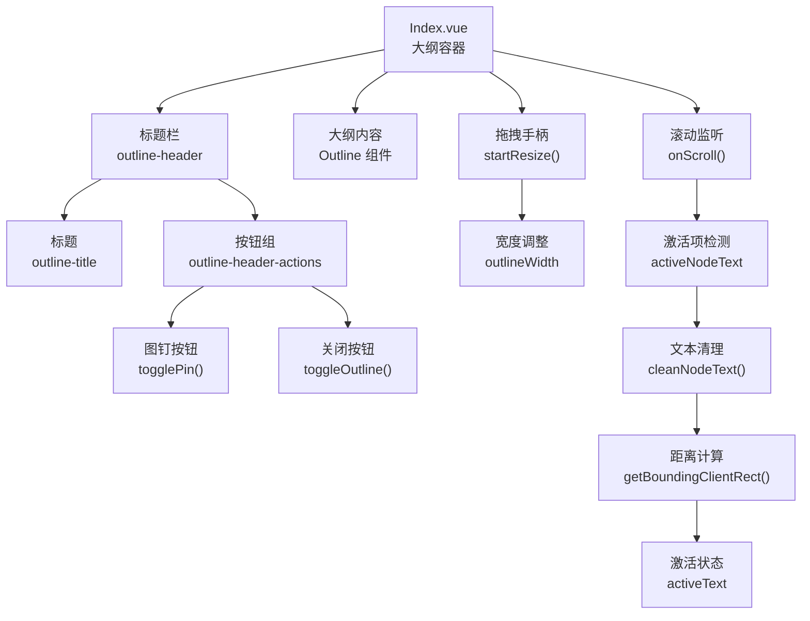

**图表来源**
- [apps/app/components/static/content/right/Index.vue:231-255](file://apps/app/components/static/content/right/Index.vue#L231-L255)
- [apps/app/components/static/content/right/Index.vue:84-92](file://apps/app/components/static/content/right/Index.vue#L84-L92)
- [apps/app/components/static/content/right/Index.vue:95-123](file://apps/app/components/static/content/right/Index.vue#L95-L123)
- [apps/app/components/static/content/right/Index.vue:172-202](file://apps/app/components/static/content/right/Index.vue#L172-L202)

### 大纲容器布局
- **Flex 布局**：使用 Flex 布局替代固定定位，提供更好的响应式支持
- **粘性定位**：使用 `position: sticky` 确保容器在页面滚动时保持位置
- **高度控制**：设置 `height: 100vh` 占满视窗高度
- **过渡动画**：宽度变化时提供平滑的过渡动画

### 收起状态处理
- **占位显示**：收起状态下显示宽度为 0 的占位
- **展开按钮**：收起状态下显示展开按钮，支持 hover 展开
- **粘性定位**：展开按钮使用粘性定位，固定在页面右侧
- **样式优化**：提供阴影和边框，增强视觉层次

**章节来源**
- [apps/app/components/static/content/right/Index.vue:1-484](file://apps/app/components/static/content/right/Index.vue#L1-L484)
- [apps/app/components/static/content/right/Outline.vue:1-154](file://apps/app/components/static/content/right/Outline.vue#L1-L154)
- [apps/app/components/static/content/right/OutlineItem.vue:1-275](file://apps/app/components/static/content/right/OutlineItem.vue#L1-L275)

## 状态管理存储系统

### 通用存储架构
状态管理存储系统提供了统一的状态持久化解决方案，支持多种数据类型的存储和管理：

- **useCommonStorageAsync**：异步存储管理器，提供 get/set 方法
- **commonStorage**：通用存储实现，基于 StorageLikeAsync 接口
- **Siyuan Kernel API**：在思源笔记环境中使用 Kernel API 进行数据存储

### 存储实现机制
- **类型检测**：自动检测初始值的数据类型，选择合适的序列化器
- **序列化处理**：支持字符串、数字、布尔值、对象等多种数据类型
- **默认值处理**：当存储为空时自动设置初始值
- **异步操作**：所有存储操作都是异步的，确保数据一致性

### 数据类型支持
系统支持以下数据类型的自动序列化和反序列化：

- **字符串**：直接存储和读取
- **数字**：数值类型自动识别和处理
- **布尔值**：布尔类型自动识别和处理
- **对象**：JSON 序列化和反序列化
- **数组**：JSON 序列化和反序列化
- **日期**：Date 对象的序列化和反序列化

### 思源笔记集成
在思源笔记环境中，存储系统通过 Kernel API 实现：

- **文件存储**：使用 `getFile` 和 `saveTextData` 方法进行文件读写
- **错误处理**：捕获存储异常，提供错误日志
- **本地适配**：在本地环境中提供存储适配器
- **日志记录**：详细记录存储操作的执行过程

### 状态持久化应用
状态管理存储系统在大纲系统中的应用：

- **大纲宽度**：保存和恢复大纲的宽度设置
- **固定状态**：保存和恢复大纲的固定显示状态
- **滚动位置**：保存和恢复页面的滚动位置
- **用户偏好**：保存用户的界面偏好设置

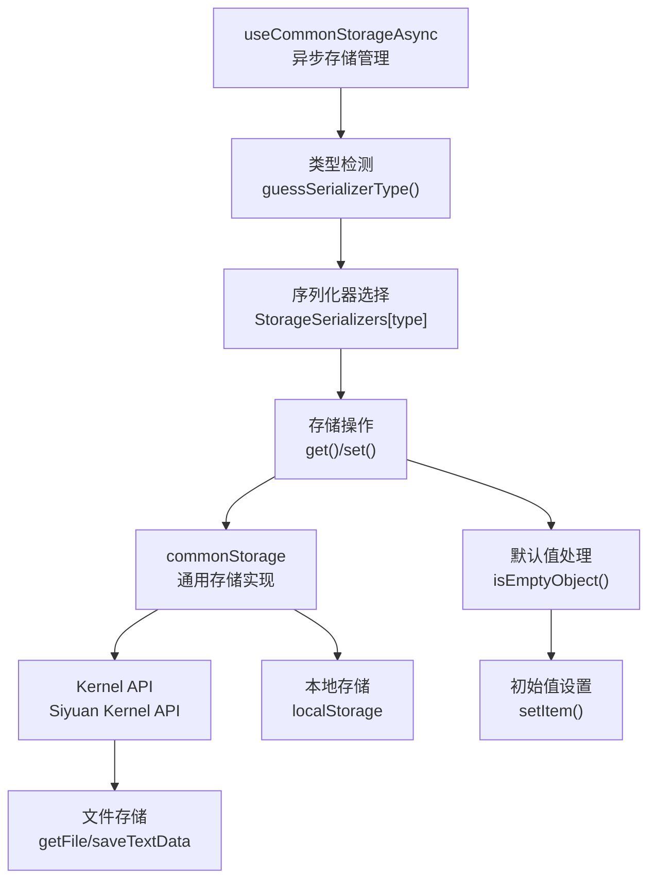

**图表来源**
- [apps/siyuan/src/stores/common/useCommonStorageAsync.ts:21-63](file://apps/siyuan/src/stores/common/useCommonStorageAsync.ts#L21-L63)
- [apps/siyuan/src/stores/common/commonStorage.ts:43-84](file://apps/siyuan/src/stores/common/commonStorage.ts#L43-L84)

### 存储序列化机制
- **类型推断**：通过 `guessSerializerType` 函数自动推断数据类型
- **序列化器映射**：根据数据类型映射到相应的序列化器
- **读取处理**：从存储中读取数据时进行反序列化处理
- **写入处理**：向存储中写入数据时进行序列化处理

### 错误处理和日志记录
- **异常捕获**：存储操作中的异常会被捕获和记录
- **日志输出**：详细的日志信息帮助调试和问题排查
- **降级处理**：在存储失败时提供降级处理方案
- **状态监控**：监控存储系统的健康状态

**章节来源**
- [apps/siyuan/src/stores/common/useCommonStorageAsync.ts:1-91](file://apps/siyuan/src/stores/common/useCommonStorageAsync.ts#L1-L91)
- [apps/siyuan/src/stores/common/commonStorage.ts:1-88](file://apps/siyuan/src/stores/common/commonStorage.ts#L1-L88)

## 分享状态管理系统

### 分享状态管理架构
分享状态管理系统是本次更新的重要功能，为文档访问提供完整的权限控制机制：

- **MenuItem.vue**：菜单项组件，支持分享状态、密码保护和过期检查
- **Sidebar.vue**：侧边栏组件，传递分享状态属性给菜单项
- **SidebarMenu.vue**：菜单容器组件，整合分享状态管理
- **Detail.vue**：详情组件，提供完整的分享状态检查和密码验证

### 分享状态属性
MenuItem 组件支持以下分享状态属性：

- **isShared**：文档是否已分享（boolean）
- **hasPassword**：文档是否有密码保护（boolean）
- **isExpired**：文档是否已过期（boolean）
- **fromDocTree**：是否从文档树来源（boolean）

### 状态徽章系统
系统提供可视化状态徽章，帮助用户快速识别文档状态：

- **密码徽章**：显示 `(有密码)`，用于标识需要密码验证的文档
- **过期徽章**：显示 `(已过期)`，用于标识已过期的文档
- **徽章样式**：使用不同的颜色区分不同状态（橙色表示密码，红色表示过期）

### 状态样式类
系统提供状态样式类，用于改变文本颜色和视觉效果：

- **text-warning**：用于密码保护的文档，显示橙色文本
- **text-danger**：用于过期的文档，显示红色文本
- **状态样式**：根据分享状态动态应用相应的样式类

### 点击交互逻辑
MenuItem 组件实现了完整的点击交互逻辑：

1. **未分享文档处理**：直接返回，不执行任何操作
2. **过期文档处理**：显示错误提示，阻止跳转
3. **密码保护文档处理**：显示确认对话框，用户确认后继续跳转
4. **普通文档处理**：添加查询参数并跳转到目标页面

### 文档树集成
分享状态管理与文档树系统无缝集成：

- **状态传递**：Sidebar 组件将分享状态属性传递给菜单项
- **占位节点**：未分享的文档显示为占位节点（...）
- **链接处理**：从文档树来源的链接自动添加查询参数
- **激活状态**：支持从文档树来源的特殊激活处理

### 国际化支持
分享状态管理系统支持多语言国际化：

- **状态提示**：密码徽章和过期徽章使用国际化词条
- **错误消息**：过期提示和密码错误消息支持多语言
- **确认对话框**：密码验证对话框支持多语言显示

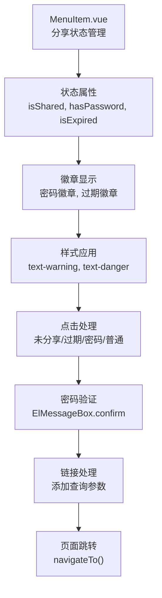

**图表来源**
- [apps/app/components/static/content/left/MenuItem.vue:24-31](file://apps/app/components/static/content/left/MenuItem.vue#L24-L31)
- [apps/app/components/static/content/left/MenuItem.vue:67-75](file://apps/app/components/static/content/left/MenuItem.vue#L67-L75)
- [apps/app/components/static/content/left/MenuItem.vue:81-122](file://apps/app/components/static/content/left/MenuItem.vue#L81-L122)

### 分享状态检查流程
系统提供完整的分享状态检查流程：

1. **状态获取**：从文档树数据获取分享状态信息
2. **状态验证**：检查文档的分享状态、密码保护和过期状态
3. **状态显示**：根据状态显示相应的徽章和样式
4. **交互处理**：根据状态执行相应的交互逻辑
5. **权限控制**：确保用户只能访问有权限的文档

### 密码验证机制
系统实现了安全的密码验证机制：

- **确认对话框**：密码保护的文档访问前显示确认对话框
- **密码校验**：调用 validatePassword API 验证用户输入的密码
- **参数更新**：验证成功后更新 URL 参数，确保后续访问
- **错误处理**：密码错误时显示错误提示并阻止访问

**章节来源**
- [apps/app/components/static/content/left/MenuItem.vue:1-175](file://apps/app/components/static/content/left/MenuItem.vue#L1-L175)
- [apps/app/components/static/content/left/Sidebar.vue:148-163](file://apps/app/components/static/content/left/Sidebar.vue#L148-L163)
- [apps/app/components/static/content/left/SidebarMenu.vue:14-23](file://apps/app/components/static/content/left/SidebarMenu.vue#L14-L23)
- [apps/app/components/static/Detail.vue:36-48](file://apps/app/components/static/Detail.vue#L36-L48)

## 依赖关系分析
- 配置依赖
  - Header/Footer/Sidebar/Index/Outline/Buttons 均依赖 AppConfig（站点信息、主题配置、导航路径等）
- 主题依赖
  - useClientThemeMode 注入主题样式与代码高亮样式，Buttons 通过其提供的 colorMode 控制 UI
- 国际化依赖
  - 大量组件通过 useI18n 获取文案，zh_CN.json 与 en_US.json 提供词条
- 工具依赖
  - ThemeUtils.withBase 用于拼接带 base 的资源路径
  - TreeUtils.addParentIds 用于处理树形数据结构
  - **appLogger.createAppLogger 用于智能滚动功能的日志记录**
  - **useAppBase 用于获取应用基础路径**
  - **useAuthModeFetch 用于鉴权模式下的配置获取**
- 组件间耦合
  - Footer 与 Buttons 解耦，Footer 仅负责展示与事件转发
  - Tab 与业务内容解耦，通过 content/props 动态渲染
  - 菜单系统通过 ref 实现组件间通信
  - **Sidebar 与 Element Plus 的 el-scrollbar 组件紧密集成**
  - **Index 与 Outline 组件通过 props 传递状态和配置**
  - **大纲系统通过 localStorage 实现状态持久化**
  - **MenuItem 与分享状态管理紧密集成**
- 状态管理依赖
  - **useCommonStorageAsync 依赖 commonStorage 实现存储功能**
  - **commonStorage 依赖 Siyuan Kernel API 进行数据存储**
  - **Index 组件使用 useState 确保状态一致性**
- 样式依赖
  - **Sidebar 组件依赖自定义滚动条样式**
  - **菜单系统依赖主题变量和CSS变量**
  - **OutlineItem 组件依赖暗色模式样式**
  - **MenuItem 组件依赖状态样式类**

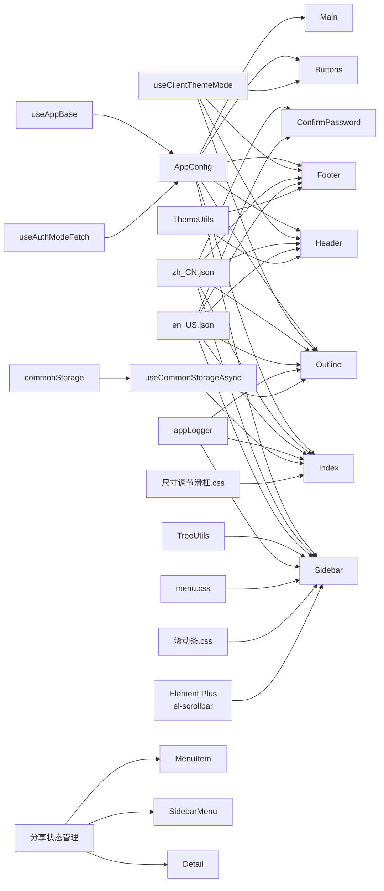

**图表来源**
- [apps/app/app.config.ts:1-92](file://apps/app/app.config.ts#L1-L92)
- [apps/app/composables/useClientThemeMode.ts:1-158](file://apps/app/composables/useClientThemeMode.ts#L1-L158)
- [apps/app/composables/useAppBase.ts:1-21](file://apps/app/composables/useAppBase.ts#L1-L21)
- [apps/app/composables/useAuthModeFetch.ts:200-319](file://apps/app/composables/useAuthModeFetch.ts#L200-L319)
- [apps/app/utils/ThemeUtils.ts:1-38](file://apps/app/utils/ThemeUtils.ts#L1-L38)
- [apps/app/utils/TreeUtils.ts:1-59](file://apps/app/utils/TreeUtils.ts#L1-L59)
- [apps/app/utils/appLogger.ts:1-22](file://apps/app/utils/appLogger.ts#L1-L22)
- [apps/siyuan/src/stores/common/useCommonStorageAsync.ts:1-91](file://apps/siyuan/src/stores/common/useCommonStorageAsync.ts#L1-L91)
- [apps/siyuan/src/stores/common/commonStorage.ts:1-88](file://apps/siyuan/src/stores/common/commonStorage.ts#L1-L88)
- [apps/app/i18n/locales/zh_CN.json:1-100](file://apps/app/i18n/locales/zh_CN.json#L1-L100)
- [apps/app/i18n/locales/en_US.json:1-100](file://apps/app/i18n/locales/en_US.json#L1-L100)
- [apps/app/public/resources/appearance/themes/Savor/style/module/menu.css:1-514](file://apps/app/public/resources/appearance/themes/Savor/style/module/menu.css#L1-L514)
- [apps/app/public/resources/appearance/themes/pink-room/部件修改/尺寸调节滑杠.css:1-27](file://apps/app/public/resources/appearance/themes/pink-room/部件修改/尺寸调节滑杠.css#L1-L27)
- [apps/app/public/resources/appearance/themes/pink-room/部件修改/滚动条.css:1-15](file://apps/app/public/resources/appearance/themes/pink-room/部件修改/滚动条.css#L1-L15)

**章节来源**
- [apps/app/app.config.ts:1-92](file://apps/app/app.config.ts#L1-L92)
- [apps/app/composables/useClientThemeMode.ts:1-158](file://apps/app/composables/useClientThemeMode.ts#L1-L158)
- [apps/app/composables/useAppBase.ts:1-21](file://apps/app/composables/useAppBase.ts#L1-L21)
- [apps/app/composables/useAuthModeFetch.ts:200-319](file://apps/app/composables/useAuthModeFetch.ts#L200-L319)
- [apps/app/utils/ThemeUtils.ts:1-38](file://apps/app/utils/ThemeUtils.ts#L1-L38)
- [apps/app/utils/TreeUtils.ts:1-59](file://apps/app/utils/TreeUtils.ts#L1-L59)
- [apps/app/utils/appLogger.ts:1-22](file://apps/app/utils/appLogger.ts#L1-L22)
- [apps/siyuan/src/stores/common/useCommonStorageAsync.ts:1-91](file://apps/siyuan/src/stores/common/useCommonStorageAsync.ts#L1-L91)
- [apps/siyuan/src/stores/common/commonStorage.ts:1-88](file://apps/siyuan/src/stores/common/commonStorage.ts#L1-L88)
- [apps/app/i18n/locales/zh_CN.json:1-100](file://apps/app/i18n/locales/zh_CN.json#L1-L100)
- [apps/app/i18n/locales/en_US.json:1-100](file://apps/app/i18n/locales/en_US.json#L1-L100)

## 性能与可维护性
- 性能
  - Buttons 对滚动事件使用节流，降低频繁计算
  - Sidebar 构建树时使用 Map 与递归，避免重复遍历
  - Outline 使用固定宽度与滚动容器，减少重排
  - 菜单系统通过 ref 优化组件间通信，减少事件冒泡
  - **智能滚动功能使用 nextTick 和 setTimeout 优化 DOM 查询时机**
  - **重试机制采用递增延迟，避免频繁重试影响性能**
  - **Outline 的智能滚动使用 getBoundingClientRect 优化性能**
  - **尺寸调节滑杠使用原生 CSS 变量，避免 JavaScript 操作**
  - **Index 组件使用 useState 确保状态一致性，避免闪烁**
  - **大纲滚动监听使用防抖处理，减少频繁计算**
  - **localStorage 操作异步化，避免阻塞主线程**
  - **自定义滚动条样式使用 CSS 变量，提升渲染性能**
  - **菜单项尺寸优化减少不必要的重绘**
  - **分享状态管理使用计算属性，避免重复计算**
  - **密码验证使用异步处理，避免阻塞用户交互**
- 可维护性
  - 组件职责单一，事件与属性清晰
  - 配置集中于 AppConfig，便于统一管理
  - 主题注入集中在 useClientThemeMode，便于扩展新主题
  - 菜单系统采用分层设计，便于功能扩展和维护
  - **大纲系统支持宽度属性，便于定制化配置**
  - **日志记录系统便于问题排查和性能监控**
  - **状态管理存储系统提供统一的状态持久化解决方案**
  - **异步存储机制确保数据一致性和可靠性**
  - **样式优化采用CSS变量，便于主题定制**
  - **分享状态管理提供清晰的状态分离和逻辑组织**
  - **国际化支持完整的多语言词条管理**
- 用户体验
  - **智能滚动确保激活菜单项始终可见且居中**
  - **平滑滚动动画提升视觉体验**
  - **重试机制保证在复杂页面结构下的可靠性**
  - **边界检查防止滚动异常**
  - **可调整大小的大纲面板提升界面灵活性**
  - **固定显示功能提升常用场景的便利性**
  - **标题栏按钮提供直观的操作反馈**
  - **状态持久化确保用户偏好的持续性**
  - **更淡的边框提供更柔和的视觉效果**
  - **紧凑的菜单项尺寸提升信息密度**
  - **优化的悬停效果提供更细腻的交互体验**
  - **分享状态徽章提供清晰的视觉提示**
  - **密码验证对话框提供安全的访问控制**
  - **过期文档的明确提示提升用户体验**

**更新** 新增大纲标题栏系统、状态管理存储系统、智能滚动功能和菜单系统样式优化相关的性能优化说明，以及分享状态管理系统的性能提升。

## 故障排查指南
- 主题未生效
  - 检查 useClientThemeMode 是否正确注入主题样式与代码高亮样式
  - 确认 data-theme-mode 与 data-light/dark-theme 属性是否写入 htmlAttrs
- 资源路径异常
  - 使用 ThemeUtils.withBase 拼接 base 路径，避免相对路径问题
- 国际化文案缺失
  - 确认 key 是否存在于 zh_CN.json 或 en_US.json
- 密码校验失败
  - 查看 ConfirmPassword 的校验规则与错误提示文案
- 图片预览不显示
  - 确认传入 images 数组与 index 正确，检查第三方库依赖
- 菜单点击无效
  - 检查 MenuItem 的点击处理逻辑，确认事件委派是否正常
  - 验证 SidebarMenu 的 ref 调用是否成功
  - 确认菜单项的链接格式是否正确
- **智能滚动功能异常**
  - **检查浏览器控制台是否有日志输出，确认 appLogger 是否正常工作**
  - **验证 Element Plus 的 el-scrollbar 组件是否正确渲染**
  - **确认激活元素的选择器是否匹配实际的 DOM 结构**
  - **检查重试机制是否被正确触发，尝试次数是否达到最大值**
  - **验证边界检查逻辑，确认滚动位置是否在有效范围内**
- **大纲标题栏功能异常**
  - **检查 Index 组件的 useState 是否正确初始化状态**
  - **验证 localStorage 是否正常工作，检查存储权限**
  - **确认拖拽事件是否正确绑定，检查鼠标事件处理**
  - **检查标题栏按钮的点击事件是否正常触发**
  - **验证滚动监听是否正确绑定，检查滚动事件处理**
- **状态管理存储异常**
  - **检查 useCommonStorageAsync 是否正确初始化**
  - **验证 commonStorage 的 Kernel API 调用是否成功**
  - **确认序列化器是否正确选择，检查数据类型推断**
  - **检查异步存储操作是否正确处理，避免竞态条件**
- **大纲宽度调整失效**
  - **检查尺寸调节滑杠主题样式是否正确加载**
  - **确认 CSS 变量 `--room-surface-lightcolor` 是否定义**
  - **验证 Outline 组件的 width 属性是否正确传递**
  - **检查固定定位是否被其他样式覆盖**
- **菜单系统样式异常**
  - **检查自定义滚动条样式是否正确加载**
  - **确认 CSS 变量是否正确设置**
  - **验证菜单项的尺寸和字体设置**
  - **检查激活状态和悬停效果的样式覆盖**
- **分享状态管理异常**
  - **检查分享状态属性是否正确传递给 MenuItem 组件**
  - **验证 isShared、hasPassword、isExpired 属性的值**
  - **确认密码徽章和过期徽章的显示逻辑**
  - **检查密码验证对话框是否正确显示**
  - **验证密码验证 API 调用是否成功**
  - **确认 URL 参数更新逻辑是否正常工作**

**更新** 新增大纲标题栏系统、状态管理存储系统、智能滚动功能、菜单系统样式优化和分享状态管理系统的故障排查指导。

**章节来源**
- [apps/app/composables/useClientThemeMode.ts:1-158](file://apps/app/composables/useClientThemeMode.ts#L1-L158)
- [apps/app/utils/ThemeUtils.ts:1-38](file://apps/app/utils/ThemeUtils.ts#L1-L38)
- [apps/app/i18n/locales/zh_CN.json:1-100](file://apps/app/i18n/locales/zh_CN.json#L1-L100)
- [apps/app/i18n/locales/en_US.json:1-100](file://apps/app/i18n/locales/en_US.json#L1-L100)
- [apps/app/components/common/ConfirmPassword.vue:1-181](file://apps/app/components/common/ConfirmPassword.vue#L1-L181)
- [apps/app/components/common/ImagePreview.vue:1-64](file://apps/app/components/common/ImagePreview.vue#L1-L64)
- [apps/app/components/static/content/left/MenuItem.vue:55-66](file://apps/app/components/static/content/left/MenuItem.vue#L55-L66)
- [apps/app/components/static/content/left/SidebarMenu.vue:32-36](file://apps/app/components/static/content/left/SidebarMenu.vue#L32-L36)
- [apps/app/utils/appLogger.ts:1-22](file://apps/app/utils/appLogger.ts#L1-L22)
- [apps/app/components/static/content/right/Index.vue:1-484](file://apps/app/components/static/content/right/Index.vue#L1-L484)
- [apps/siyuan/src/stores/common/useCommonStorageAsync.ts:1-91](file://apps/siyuan/src/stores/common/useCommonStorageAsync.ts#L1-L91)
- [apps/siyuan/src/stores/common/commonStorage.ts:1-88](file://apps/siyuan/src/stores/common/commonStorage.ts#L1-L88)
- [apps/app/public/resources/appearance/themes/pink-room/部件修改/尺寸调节滑杠.css:1-27](file://apps/app/public/resources/appearance/themes/pink-room/部件修改/尺寸调节滑杠.css#L1-L27)
- [apps/app/public/resources/appearance/themes/pink-room/部件修改/滚动条.css:1-15](file://apps/app/public/resources/appearance/themes/pink-room/部件修改/滚动条.css#L1-L15)

## 结论
该 UI 组件系统以配置驱动为核心，结合组合式逻辑、国际化、主题工具和状态管理存储，形成清晰的静态布局与通用组件体系。各组件职责明确、接口简洁，具备良好的扩展性与可维护性。通过统一的主题注入与资源路径工具，实现了跨环境的一致体验。

**更新** 菜单系统样式优化显著提升了视觉层次感和用户体验，包括更淡的rgba边框、紧凑的菜单项尺寸、优化的字体规格和改进的悬停效果；大纲标题栏系统的新增进一步增强了界面灵活性；状态管理存储系统的完善确保了用户偏好的持续性和可靠性；智能滚动功能的增强改善了用户在大型文档树中的导航体验；**分享状态管理系统的新增为文档访问提供了完整的权限控制机制**。这些优化共同构成了更加现代化、高效、用户友好和安全的UI组件系统。

## 附录

### 组件 API 速查
- Header
  - 属性：setting(AppConfig)
  - 行为：渲染 Logo/标题/自定义头部 HTML
- Footer
  - 属性：setting(AppConfig)
  - 事件：toggle-theme-mode(key)
  - 行为：版权/版本/跳转入口/主题切换
- Buttons
  - 属性：defaultMode("auto"|"light"|"dark")
  - 事件：toggle-theme-mode(key)
  - 行为：返回顶部/主题模式弹窗
- Sidebar
  - 属性：post(AppConfig), setting(AppConfig)
  - 行为：根据 docTree 渲染菜单，自动展开当前文档父链，**智能滚动到激活菜单项**
- SidebarMenu
  - 属性：menu(MenuData), activeIndex(string)
  - 行为：渲染菜单容器，支持嵌套菜单和激活状态管理
- MenuItem
  - 属性：link(string), text(string), fromDocTree(boolean), isShared(boolean), hasPassword(boolean), isExpired(boolean)
  - 方法：handleItemClick()
  - 行为：渲染菜单项，支持文本截断、工具提示、点击区域优化和**分享状态管理**
- Index（新增）
  - 属性：post(AppConfig), setting(AppConfig)
  - 行为：右侧大纲容器，支持标题栏、固定显示、宽度调整和智能滚动
- Outline
  - 属性：outlineData(Array), maxDepth(Number), activeText(String), width(Number)
  - 行为：右侧大纲内容，支持固定定位、宽度控制和智能滚动
- OutlineItem
  - 属性：item(Object), maxDepth(Number), isRoot(Boolean), rootLevel(Number), activeText(String), containerWidth(Number)
  - 行为：渲染大纲项，支持层级缩进、激活状态和滚动到章节
- Main
  - 属性：post(any), setting(any)
  - 行为：渲染正文内容，支持图片预览
- Tab
  - 属性：tabs(Array), activeTab(Number), vertical(Boolean)
  - 事件：tabChange(index)
  - 行为：标签页切换与动态内容渲染
- ConfirmPassword
  - 属性：title/description/placeholder/submitText/hint/initialValue
  - 事件：submit(password), cancel()
  - 行为：密码表单与校验
- ImagePreview
  - 属性：images(String[]), index(Number)
  - 事件：hide
  - 行为：图片预览弹层，暴露 show(index)
- Detail（新增）
  - 属性：showTitleSign(Boolean), overrideSeo(Boolean), pageId(String), setting(AppConfig)
  - 行为：**文档分享状态检查、密码验证和过期检查**

**更新** 新增大纲标题栏系统、状态管理存储系统、智能滚动功能、菜单系统样式优化和分享状态管理系统的 API 说明。

**章节来源**
- [apps/app/components/static/Header.vue:1-131](file://apps/app/components/static/Header.vue#L1-L131)
- [apps/app/components/static/Footer.vue:1-115](file://apps/app/components/static/Footer.vue#L1-L115)
- [apps/app/components/static/Buttons.vue:1-240](file://apps/app/components/static/Buttons.vue#L1-L240)
- [apps/app/components/static/content/left/Sidebar.vue:1-291](file://apps/app/components/static/content/left/Sidebar.vue#L1-L291)
- [apps/app/components/static/content/left/SidebarMenu.vue:1-91](file://apps/app/components/static/content/left/SidebarMenu.vue#L1-L91)
- [apps/app/components/static/content/left/MenuItem.vue:1-175](file://apps/app/components/static/content/left/MenuItem.vue#L1-L175)
- [apps/app/components/static/content/right/Index.vue:1-484](file://apps/app/components/static/content/right/Index.vue#L1-L484)
- [apps/app/components/static/content/right/Outline.vue:1-154](file://apps/app/components/static/content/right/Outline.vue#L1-L154)
- [apps/app/components/static/content/right/OutlineItem.vue:1-275](file://apps/app/components/static/content/right/OutlineItem.vue#L1-L275)
- [apps/app/components/static/content/Main.vue:1-80](file://apps/app/components/static/content/Main.vue#L1-L80)
- [apps/siyuan/src/components/Tab.vue:1-147](file://apps/siyuan/src/components/Tab.vue#L1-L147)
- [apps/app/components/common/ConfirmPassword.vue:1-181](file://apps/app/components/common/ConfirmPassword.vue#L1-L181)
- [apps/app/components/common/ImagePreview.vue:1-64](file://apps/app/components/common/ImagePreview.vue#L1-L64)
- [apps/app/components/static/Detail.vue:1-173](file://apps/app/components/static/Detail.vue#L1-L173)

### 响应式与主题适配
- 响应式
  - Header/Footer/Buttons 在窄屏与移动端调整布局与可见元素
  - 菜单系统支持响应式布局，在窄屏下优化显示效果
  - **智能滚动功能在不同屏幕尺寸下自动适应**
  - **大纲面板支持固定定位，在滚动时保持可见**
  - **Index 组件使用粘性定位，提供更好的响应式支持**
  - **菜单项尺寸优化提升移动端显示效果**
  - **分享状态徽章在小屏幕上自动隐藏，提升可读性**
- 主题适配
  - useClientThemeMode 注入默认与当前主题样式，设置 data-theme-mode 属性
  - 暗色模式下 Outline 等组件自动切换背景与边框
  - 菜单系统样式通过 menu.css 进行主题适配
  - **智能滚动功能与主题样式完全兼容**
  - **尺寸调节滑杠样式通过 CSS 变量适配主题颜色**
  - **大纲标题栏支持主题颜色适配**
  - **自定义滚动条样式支持主题变量**
  - **菜单系统样式优化支持主题适配**
  - **分享状态徽章支持主题颜色适配**

**更新** 新增大纲标题栏系统、状态管理存储系统、菜单系统样式优化和分享状态管理系统主题适配说明。

**章节来源**
- [apps/app/components/static/Header.vue:1-131](file://apps/app/components/static/Header.vue#L1-L131)
- [apps/app/components/static/Footer.vue:1-115](file://apps/app/components/static/Footer.vue#L1-L115)
- [apps/app/components/static/Buttons.vue:1-240](file://apps/app/components/static/Buttons.vue#L1-L240)
- [apps/app/components/static/content/right/Index.vue:1-484](file://apps/app/components/static/content/right/Index.vue#L1-L484)
- [apps/app/components/static/content/right/Outline.vue:1-154](file://apps/app/components/static/content/right/Outline.vue#L1-L154)
- [apps/app/composables/useClientThemeMode.ts:1-158](file://apps/app/composables/useClientThemeMode.ts#L1-L158)
- [apps/app/public/resources/appearance/themes/Savor/style/module/menu.css:1-514](file://apps/app/public/resources/appearance/themes/Savor/style/module/menu.css#L1-L514)
- [apps/app/public/resources/appearance/themes/pink-room/部件修改/尺寸调节滑杠.css:1-27](file://apps/app/public/resources/appearance/themes/pink-room/部件修改/尺寸调节滑杠.css#L1-L27)
- [apps/app/public/resources/appearance/themes/pink-room/部件修改/滚动条.css:1-15](file://apps/app/public/resources/appearance/themes/pink-room/部件修改/滚动条.css#L1-L15)
- [apps/app/public/resources/appearance/themes/Savor/theme.css:110-151](file://apps/app/public/resources/appearance/themes/Savor/theme.css#L110-L151)

### 国际化支持
- 词条来源：zh_CN.json 与 en_US.json
- 组件使用：通过 useI18n 获取文案，如静态菜单标题、按钮文案等
- 菜单系统：支持多语言菜单项显示
- **智能滚动功能：日志记录使用英文描述，便于国际用户理解**
- **大纲面板：标题使用国际化词条，支持多语言显示**
- **大纲标题栏：按钮提示使用国际化词条**
- **菜单系统：支持多语言菜单项显示**
- **分享状态管理：密码徽章、过期徽章和错误消息支持多语言**
- **密码验证对话框：支持多语言显示**

**更新** 大纲标题栏系统支持国际化，智能滚动功能的日志使用英文描述，菜单系统支持多语言显示，**分享状态管理系统支持完整的多语言国际化**。

**章节来源**
- [apps/app/i18n/locales/zh_CN.json:1-100](file://apps/app/i18n/locales/zh_CN.json#L1-L100)
- [apps/app/i18n/locales/en_US.json:1-100](file://apps/app/i18n/locales/en_US.json#L1-L100)

### 集成指南
- 在页面中引入静态组件
  - Header/Footer/Buttons/Sidebar/Index/Outline：传入 setting/AppConfig
  - Tab：传入 tabs、activeTab、vertical
  - ConfirmPassword：传入初始值与回调
  - ImagePreview：传入图片数组，调用暴露的 show(index)
- 菜单系统集成
  - Sidebar：传入 post 和 setting，自动渲染菜单树，**智能滚动功能自动启用**
  - SidebarMenu：传入 menu 和 activeIndex，支持嵌套菜单
  - MenuItem：传入 link、text 和 fromDocTree 属性，**支持分享状态管理**
- 大纲系统集成
  - Index：传入 post 和 setting，支持标题栏、固定显示、宽度调整
  - Outline：传入 outlineData、maxDepth、activeText 和 width 属性
  - OutlineItem：传入 item、maxDepth、isRoot、rootLevel、activeText 和 containerWidth
  - 支持固定定位和宽度控制
- 主题与国际化
  - 在入口处初始化 useClientThemeMode
  - 确保 i18n 语言与词条可用
  - 配置 menu.css 和尺寸调节滑杠样式文件
  - **配置自定义滚动条样式文件**
- **智能滚动功能集成**
  - **无需额外配置，Sidebar 组件自动启用智能滚动功能**
  - **确保 Element Plus 的 el-scrollbar 组件正确安装和配置**
  - **在开发环境中可查看详细的滚动日志信息**
- **大纲标题栏集成**
  - **Index 组件自动集成标题栏功能，无需额外配置**
  - **确保大纲数据结构正确，包含 outline 和 outlineLevel**
  - **固定显示功能通过 useState 确保状态一致性**
  - **宽度调整功能通过 localStorage 实现状态持久化**
- **状态管理存储集成**
  - **useCommonStorageAsync 自动处理数据类型序列化**
  - **commonStorage 通过 Kernel API 实现数据持久化**
  - **在思源笔记环境中自动适配存储方式**
  - **提供异步存储操作，确保数据一致性**
- **菜单系统样式集成**
  - **Sidebar 组件自动应用样式优化**
  - **确保 CSS 变量正确设置**
  - **自定义滚动条样式自动加载**
  - **菜单项尺寸和字体自动适配**
- **分享状态管理集成**
  - **MenuItem 组件自动支持分享状态管理**
  - **确保文档树数据包含 isShared、hasPassword、isExpired 属性**
  - **密码验证对话框自动显示和处理**
  - **过期文档的明确提示自动显示**
  - **URL 参数更新自动处理**

**更新** 新增大纲标题栏系统、状态管理存储系统、智能滚动功能、菜单系统样式优化和分享状态管理系统的集成指南。

**章节来源**
- [apps/app/composables/useClientThemeMode.ts:1-158](file://apps/app/composables/useClientThemeMode.ts#L1-L158)
- [apps/app/i18n/locales/zh_CN.json:1-100](file://apps/app/i18n/locales/zh_CN.json#L1-L100)
- [apps/app/i18n/locales/en_US.json:1-100](file://apps/app/i18n/locales/en_US.json#L1-L100)
- [apps/app/components/static/content/left/Sidebar.vue:1-291](file://apps/app/components/static/content/left/Sidebar.vue#L1-L291)
- [apps/app/components/static/content/left/SidebarMenu.vue:1-91](file://apps/app/components/static/content/left/SidebarMenu.vue#L1-L91)
- [apps/app/components/static/content/left/MenuItem.vue:1-175](file://apps/app/components/static/content/left/MenuItem.vue#L1-L175)
- [apps/app/components/static/content/right/Index.vue:1-484](file://apps/app/components/static/content/right/Index.vue#L1-L484)
- [apps/app/components/static/content/right/Outline.vue:1-154](file://apps/app/components/static/content/right/Outline.vue#L1-L154)
- [apps/app/components/static/content/right/OutlineItem.vue:1-275](file://apps/app/components/static/content/right/OutlineItem.vue#L1-L275)
- [apps/siyuan/src/stores/common/useCommonStorageAsync.ts:1-91](file://apps/siyuan/src/stores/common/useCommonStorageAsync.ts#L1-L91)
- [apps/siyuan/src/stores/common/commonStorage.ts:1-88](file://apps/siyuan/src/stores/common/commonStorage.ts#L1-L88)
- [apps/app/public/resources/appearance/themes/pink-room/部件修改/尺寸调节滑杠.css:1-27](file://apps/app/public/resources/appearance/themes/pink-room/部件修改/尺寸调节滑杠.css#L1-L27)
- [apps/app/public/resources/appearance/themes/pink-room/部件修改/滚动条.css:1-15](file://apps/app/public/resources/appearance/themes/pink-room/部件修改/滚动条.css#L1-L15)