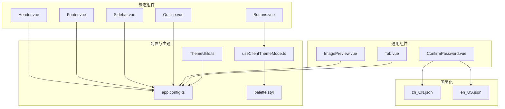
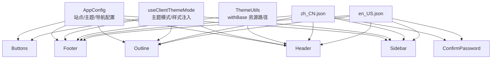
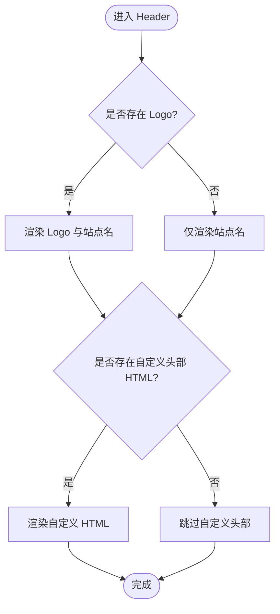
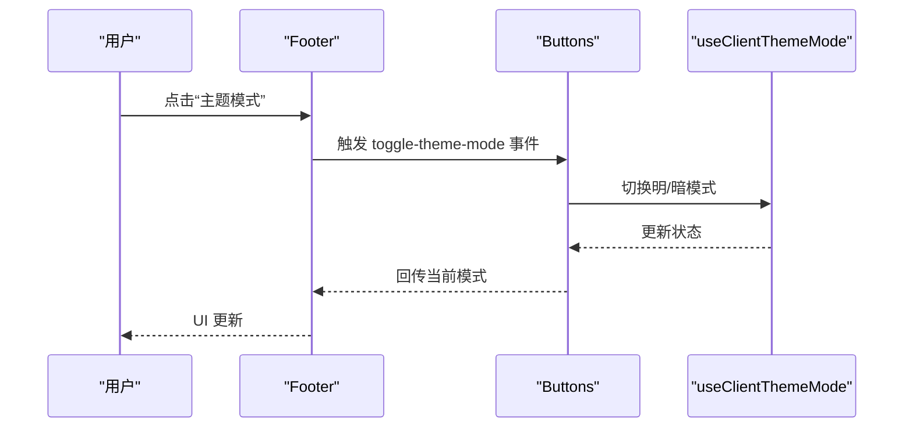
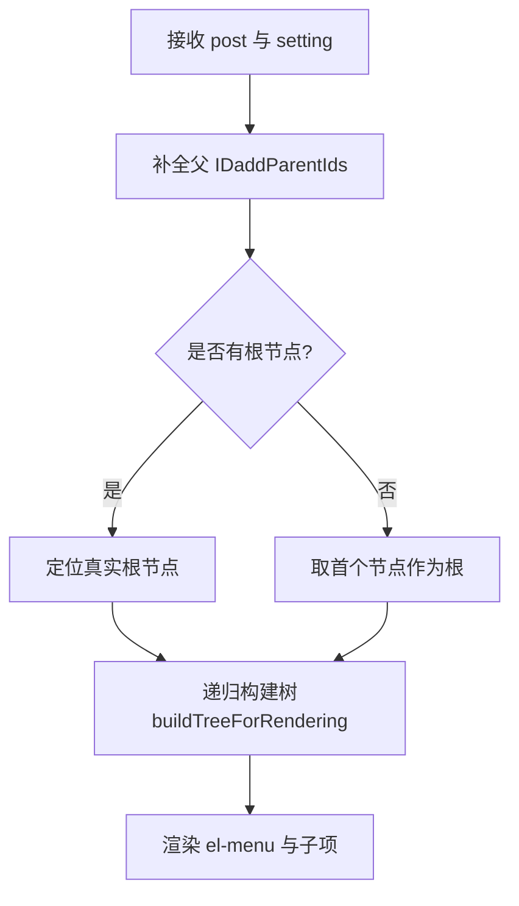
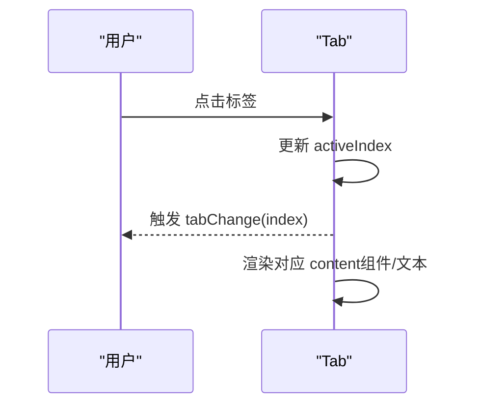
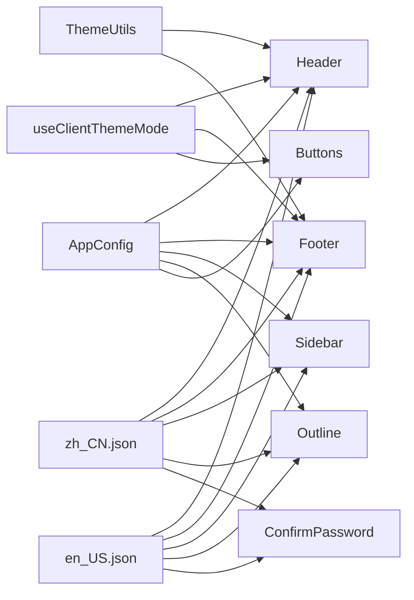

# UI 组件系统

<cite>
**本文引用的文件**
- [apps/app/components/static/Header.vue](file://apps/app/components/static/Header.vue)
- [apps/app/components/static/Footer.vue](file://apps/app/components/static/Footer.vue)
- [apps/app/components/static/Buttons.vue](file://apps/app/components/static/Buttons.vue)
- [apps/app/components/static/content/left/Sidebar.vue](file://apps/app/components/static/content/left/Sidebar.vue)
- [apps/app/components/static/content/right/Outline.vue](file://apps/app/components/static/content/right/Outline.vue)
- [apps/siyuan/src/components/Tab.vue](file://apps/siyuan/src/components/Tab.vue)
- [apps/app/components/common/ConfirmPassword.vue](file://apps/app/components/common/ConfirmPassword.vue)
- [apps/app/components/common/ImagePreview.vue](file://apps/app/components/common/ImagePreview.vue)
- [apps/app/composables/useClientThemeMode.ts](file://apps/app/composables/useClientThemeMode.ts)
- [apps/app/utils/ThemeUtils.ts](file://apps/app/utils/ThemeUtils.ts)
- [apps/app/app.config.ts](file://apps/app/app.config.ts)
- [apps/app/i18n/locales/en_US.json](file://apps/app/i18n/locales/en_US.json)
- [apps/app/i18n/locales/zh_CN.json](file://apps/app/i18n/locales/zh_CN.json)
- [apps/app/assets/css/theme/palette.styl](file://apps/app/assets/css/theme/palette.styl)
</cite>

## 目录
1. [简介](#简介)
2. [项目结构](#项目结构)
3. [核心组件](#核心组件)
4. [架构总览](#架构总览)
5. [组件详解](#组件详解)
6. [依赖关系分析](#依赖关系分析)
7. [性能与可维护性](#性能与可维护性)
8. [故障排查指南](#故障排查指南)
9. [结论](#结论)
10. [附录](#附录)

## 简介
本文件面向 UI 组件系统，系统化梳理 Vue 组件架构与使用方法，覆盖通用组件、静态组件、公共组件的设计模式与最佳实践；重点解读 Tab 组件、Header、Footer、Detail 等核心组件的功能特性、API 接口与配置项；阐述响应式设计、主题适配与国际化支持；并提供使用示例与集成指南，帮助开发者快速理解与扩展。

## 项目结构
UI 组件主要分布在以下目录：
- apps/app/components/static：静态布局与交互组件（Header、Footer、Buttons、Sidebar、Outline 等）
- apps/app/components/common：跨页面复用的通用组件（ConfirmPassword、ImagePreview）
- apps/app/components/public：公开分享相关组件（Detail 等）
- apps/siyuan/src/components：SiYuan 环境下的通用组件（Tab）
- apps/app/composables：组合式逻辑（主题模式、路由、鉴权等）
- apps/app/utils：工具类（ThemeUtils）
- apps/app/app.config.ts：全局配置类型与默认值
- apps/app/i18n/locales：国际化词条（中英文）

图表来源
- [apps/app/components/static/Header.vue:1-131](file://apps/app/components/static/Header.vue#L1-L131)
- [apps/app/components/static/Footer.vue:1-115](file://apps/app/components/static/Footer.vue#L1-L115)
- [apps/app/components/static/Buttons.vue:1-240](file://apps/app/components/static/Buttons.vue#L1-L240)
- [apps/app/components/static/content/left/Sidebar.vue:1-154](file://apps/app/components/static/content/left/Sidebar.vue#L1-L154)
- [apps/app/components/static/content/right/Outline.vue:1-130](file://apps/app/components/static/content/right/Outline.vue#L1-L130)
- [apps/siyuan/src/components/Tab.vue:1-147](file://apps/siyuan/src/components/Tab.vue#L1-L147)
- [apps/app/components/common/ConfirmPassword.vue:1-181](file://apps/app/components/common/ConfirmPassword.vue#L1-L181)
- [apps/app/components/common/ImagePreview.vue:1-64](file://apps/app/components/common/ImagePreview.vue#L1-L64)
- [apps/app/composables/useClientThemeMode.ts:1-158](file://apps/app/composables/useClientThemeMode.ts#L1-L158)
- [apps/app/utils/ThemeUtils.ts:1-38](file://apps/app/utils/ThemeUtils.ts#L1-L38)
- [apps/app/app.config.ts:1-92](file://apps/app/app.config.ts#L1-L92)
- [apps/app/i18n/locales/zh_CN.json:1-100](file://apps/app/i18n/locales/zh_CN.json#L1-L100)
- [apps/app/i18n/locales/en_US.json:1-100](file://apps/app/i18n/locales/en_US.json#L1-L100)
- [apps/app/assets/css/theme/palette.styl:1-52](file://apps/app/assets/css/theme/palette.styl#L1-L52)

章节来源
- [apps/app/components/static/Header.vue:1-131](file://apps/app/components/static/Header.vue#L1-L131)
- [apps/app/components/static/Footer.vue:1-115](file://apps/app/components/static/Footer.vue#L1-L115)
- [apps/app/components/static/Buttons.vue:1-240](file://apps/app/components/static/Buttons.vue#L1-L240)
- [apps/app/components/static/content/left/Sidebar.vue:1-154](file://apps/app/components/static/content/left/Sidebar.vue#L1-L154)
- [apps/app/components/static/content/right/Outline.vue:1-130](file://apps/app/components/static/content/right/Outline.vue#L1-L130)
- [apps/siyuan/src/components/Tab.vue:1-147](file://apps/siyuan/src/components/Tab.vue#L1-L147)
- [apps/app/components/common/ConfirmPassword.vue:1-181](file://apps/app/components/common/ConfirmPassword.vue#L1-L181)
- [apps/app/components/common/ImagePreview.vue:1-64](file://apps/app/components/common/ImagePreview.vue#L1-L64)
- [apps/app/composables/useClientThemeMode.ts:1-158](file://apps/app/composables/useClientThemeMode.ts#L1-L158)
- [apps/app/utils/ThemeUtils.ts:1-38](file://apps/app/utils/ThemeUtils.ts#L1-L38)
- [apps/app/app.config.ts:1-92](file://apps/app/app.config.ts#L1-L92)
- [apps/app/i18n/locales/zh_CN.json:1-100](file://apps/app/i18n/locales/zh_CN.json#L1-L100)
- [apps/app/i18n/locales/en_US.json:1-100](file://apps/app/i18n/locales/en_US.json#L1-L100)
- [apps/app/assets/css/theme/palette.styl:1-52](file://apps/app/assets/css/theme/palette.styl#L1-L52)

## 核心组件
- Header：站点导航与品牌展示，支持 Logo、站点名称与自定义头部 HTML 片段
- Footer：版权信息、版本号、跳转入口与主题模式切换
- Buttons：返回顶部、主题模式弹窗选择等交互按钮集合
- Sidebar：基于文档树的左侧导航菜单，支持展开、高亮与层级控制
- Outline：右侧文档大纲，支持层级与激活文本高亮
- Tab：标签页容器，支持横向/纵向、动态内容渲染与事件回调
- ConfirmPassword：密码确认表单，内置校验与加载态
- ImagePreview：图片预览弹层，基于第三方库封装

章节来源
- [apps/app/components/static/Header.vue:1-131](file://apps/app/components/static/Header.vue#L1-L131)
- [apps/app/components/static/Footer.vue:1-115](file://apps/app/components/static/Footer.vue#L1-L115)
- [apps/app/components/static/Buttons.vue:1-240](file://apps/app/components/static/Buttons.vue#L1-L240)
- [apps/app/components/static/content/left/Sidebar.vue:1-154](file://apps/app/components/static/content/left/Sidebar.vue#L1-L154)
- [apps/app/components/static/content/right/Outline.vue:1-130](file://apps/app/components/static/content/right/Outline.vue#L1-L130)
- [apps/siyuan/src/components/Tab.vue:1-147](file://apps/siyuan/src/components/Tab.vue#L1-L147)
- [apps/app/components/common/ConfirmPassword.vue:1-181](file://apps/app/components/common/ConfirmPassword.vue#L1-L181)
- [apps/app/components/common/ImagePreview.vue:1-64](file://apps/app/components/common/ImagePreview.vue#L1-L64)

## 架构总览
组件系统采用“静态布局 + 通用组件 + 组合式逻辑”的分层设计：
- 配置驱动：通过 app.config.ts 的 AppConfig 类型统一管理站点、主题、导航等配置
- 主题适配：useClientThemeMode.ts 动态注入主题样式与代码高亮样式，支持明/暗模式切换
- 国际化：i18n 词条按模块组织，组件通过 useI18n 获取文案
- 工具支撑：ThemeUtils 提供资源路径拼接，palette.styl 定义主题变量

图表来源
- [apps/app/app.config.ts:1-92](file://apps/app/app.config.ts#L1-L92)
- [apps/app/composables/useClientThemeMode.ts:1-158](file://apps/app/composables/useClientThemeMode.ts#L1-L158)
- [apps/app/utils/ThemeUtils.ts:1-38](file://apps/app/utils/ThemeUtils.ts#L1-L38)
- [apps/app/i18n/locales/zh_CN.json:1-100](file://apps/app/i18n/locales/zh_CN.json#L1-L100)
- [apps/app/i18n/locales/en_US.json:1-100](file://apps/app/i18n/locales/en_US.json#L1-L100)

## 组件详解

### Header 组件
- 功能要点
  - 展示站点 Logo 与标题，支持隐藏标题
  - 支持注入自定义头部 HTML（header 字段）
  - 响应式布局：窄屏下标题隐藏，移动端进一步简化
- 关键属性
  - setting: AppConfig（包含 siteTitle、themeConfig.logo、header 等）
- 国际化
  - 使用 useI18n 获取文案上下文
- 主题适配
  - 通过 ThemeUtils.withBase 拼接带 base 的资源路径
- 响应式
  - 媒体查询控制不同屏幕下的显示策略

图表来源
- [apps/app/components/static/Header.vue:1-131](file://apps/app/components/static/Header.vue#L1-L131)
- [apps/app/utils/ThemeUtils.ts:1-38](file://apps/app/utils/ThemeUtils.ts#L1-L38)

章节来源
- [apps/app/components/static/Header.vue:1-131](file://apps/app/components/static/Header.vue#L1-L131)
- [apps/app/utils/ThemeUtils.ts:1-38](file://apps/app/utils/ThemeUtils.ts#L1-L38)

### Footer 组件
- 功能要点
  - 显示版权年份、版本号、跳转入口（首页、关于、GitHub）
  - 主题模式切换按钮委托 Buttons 组件
  - 支持注入自定义底部 HTML（footer 字段）
  - 默认语言初始化
- 关键属性
  - setting: AppConfig
- 交互流程
  - 点击事件触发跳转或主题切换
  - onBeforeMount 设置语言

图表来源
- [apps/app/components/static/Footer.vue:1-115](file://apps/app/components/static/Footer.vue#L1-L115)
- [apps/app/components/static/Buttons.vue:1-240](file://apps/app/components/static/Buttons.vue#L1-L240)
- [apps/app/composables/useClientThemeMode.ts:1-158](file://apps/app/composables/useClientThemeMode.ts#L1-L158)

章节来源
- [apps/app/components/static/Footer.vue:1-115](file://apps/app/components/static/Footer.vue#L1-L115)
- [apps/app/components/static/Buttons.vue:1-240](file://apps/app/components/static/Buttons.vue#L1-L240)
- [apps/app/composables/useClientThemeMode.ts:1-158](file://apps/app/composables/useClientThemeMode.ts#L1-L158)

### Buttons 组件
- 功能要点
  - 返回顶部：滚动超过阈值显示
  - 主题模式选择：悬浮弹窗，支持 light/dark
  - 评论入口（预留）
- 关键属性
  - defaultMode: "auto" | "light" | "dark"
- 交互细节
  - 滚动节流监听，避免高频计算
  - 鼠标进入/离开控制弹窗显隐

章节来源
- [apps/app/components/static/Buttons.vue:1-240](file://apps/app/components/static/Buttons.vue#L1-L240)

### Sidebar 组件
- 功能要点
  - 基于 docTree 构建树形菜单
  - 默认展开至当前文档父链
  - 支持从文档树来源的高亮与展开
- 关键属性
  - post: 包含 docTree、postid、docTreeLevel 等
  - setting: AppConfig（docPath）
- 数据处理
  - TreeUtils.addParentIds 补全父子关系
  - 递归构建树结构，生成链接

图表来源
- [apps/app/components/static/content/left/Sidebar.vue:1-154](file://apps/app/components/static/content/left/Sidebar.vue#L1-L154)

章节来源
- [apps/app/components/static/content/left/Sidebar.vue:1-154](file://apps/app/components/static/content/left/Sidebar.vue#L1-L154)

### Outline 组件
- 功能要点
  - 渲染右侧文档大纲
  - 自动推断根层级与最大层级
  - 支持激活文本高亮
- 关键属性
  - outlineData: 标题数组
  - maxDepth: 最大层级
  - activeText: 激活文本
- 样式适配
  - 暗色模式下自动切换背景与边框

章节来源
- [apps/app/components/static/content/right/Outline.vue:1-130](file://apps/app/components/static/content/right/Outline.vue#L1-L130)

### Tab 组件
- 功能要点
  - 支持横向/纵向标签页
  - 动态内容渲染（组件或文本）
  - tabChange 事件回调
- 关键属性
  - tabs: 数组，每项包含 label、content、props
  - activeTab: 当前激活索引
  - vertical: 是否纵向
- 事件
  - tabChange(index)

图表来源
- [apps/siyuan/src/components/Tab.vue:1-147](file://apps/siyuan/src/components/Tab.vue#L1-L147)

章节来源
- [apps/siyuan/src/components/Tab.vue:1-147](file://apps/siyuan/src/components/Tab.vue#L1-L147)

### ConfirmPassword 组件
- 功能要点
  - 密码输入表单，内置校验规则
  - 支持重置与外部赋值
  - 提交时触发事件并携带密码
- 关键属性
  - title/description/placeholder/submitText/hint/initialValue
- 事件
  - submit(password)
  - cancel()

章节来源
- [apps/app/components/common/ConfirmPassword.vue:1-181](file://apps/app/components/common/ConfirmPassword.vue#L1-L181)

### ImagePreview 组件
- 功能要点
  - 基于第三方库的图片预览弹层
  - 暴露 show(index) 方法以供外部调用
- 关键属性
  - images: 图片数组
  - index: 默认索引
- 事件
  - hide

章节来源
- [apps/app/components/common/ImagePreview.vue:1-64](file://apps/app/components/common/ImagePreview.vue#L1-L64)

## 依赖关系分析
- 配置依赖
  - Header/Footer/Sidebar/Outline/Buttons 均依赖 AppConfig（站点信息、主题配置、导航路径等）
- 主题依赖
  - useClientThemeMode 注入主题样式与代码高亮样式，Buttons 通过其提供的 colorMode 控制 UI
- 国际化依赖
  - 大量组件通过 useI18n 获取文案，zh_CN.json 与 en_US.json 提供词条
- 工具依赖
  - ThemeUtils.withBase 用于拼接带 base 的资源路径
- 组件间耦合
  - Footer 与 Buttons 解耦，Footer 仅负责展示与事件转发
  - Tab 与业务内容解耦，通过 content/props 动态渲染

图表来源
- [apps/app/app.config.ts:1-92](file://apps/app/app.config.ts#L1-L92)
- [apps/app/composables/useClientThemeMode.ts:1-158](file://apps/app/composables/useClientThemeMode.ts#L1-L158)
- [apps/app/utils/ThemeUtils.ts:1-38](file://apps/app/utils/ThemeUtils.ts#L1-L38)
- [apps/app/i18n/locales/zh_CN.json:1-100](file://apps/app/i18n/locales/zh_CN.json#L1-L100)
- [apps/app/i18n/locales/en_US.json:1-100](file://apps/app/i18n/locales/en_US.json#L1-L100)

章节来源
- [apps/app/app.config.ts:1-92](file://apps/app/app.config.ts#L1-L92)
- [apps/app/composables/useClientThemeMode.ts:1-158](file://apps/app/composables/useClientThemeMode.ts#L1-L158)
- [apps/app/utils/ThemeUtils.ts:1-38](file://apps/app/utils/ThemeUtils.ts#L1-L38)
- [apps/app/i18n/locales/zh_CN.json:1-100](file://apps/app/i18n/locales/zh_CN.json#L1-L100)
- [apps/app/i18n/locales/en_US.json:1-100](file://apps/app/i18n/locales/en_US.json#L1-L100)

## 性能与可维护性
- 性能
  - Buttons 对滚动事件使用节流，降低频繁计算
  - Sidebar 构建树时使用 Map 与递归，避免重复遍历
  - Outline 使用固定宽度与滚动容器，减少重排
- 可维护性
  - 组件职责单一，事件与属性清晰
  - 配置集中于 AppConfig，便于统一管理
  - 主题注入集中在 useClientThemeMode，便于扩展新主题

[本节为通用建议，无需特定文件引用]

## 故障排查指南
- 主题未生效
  - 检查 useClientThemeMode 是否正确注入主题样式与代码高亮样式
  - 确认 data-theme-mode 与 data-light/dark-theme 属性是否写入 htmlAttrs
- 资源路径异常
  - 使用 ThemeUtils.withBase 拼接 base 路径，避免相对路径问题
- 国际化文案缺失
  - 确认 key 是否存在于 zh_CN.json 或 en_US.json
- 密码校验失败
  - 查看 ConfirmPassword 的校验规则与错误提示文案
- 图片预览不显示
  - 确认传入 images 数组与 index 正确，检查第三方库依赖

章节来源
- [apps/app/composables/useClientThemeMode.ts:1-158](file://apps/app/composables/useClientThemeMode.ts#L1-L158)
- [apps/app/utils/ThemeUtils.ts:1-38](file://apps/app/utils/ThemeUtils.ts#L1-L38)
- [apps/app/i18n/locales/zh_CN.json:1-100](file://apps/app/i18n/locales/zh_CN.json#L1-L100)
- [apps/app/i18n/locales/en_US.json:1-100](file://apps/app/i18n/locales/en_US.json#L1-L100)
- [apps/app/components/common/ConfirmPassword.vue:1-181](file://apps/app/components/common/ConfirmPassword.vue#L1-L181)
- [apps/app/components/common/ImagePreview.vue:1-64](file://apps/app/components/common/ImagePreview.vue#L1-L64)

## 结论
该 UI 组件系统以配置驱动为核心，结合组合式逻辑与国际化、主题工具，形成清晰的静态布局与通用组件体系。各组件职责明确、接口简洁，具备良好的扩展性与可维护性。通过统一的主题注入与资源路径工具，实现了跨环境的一致体验。

[本节为总结，无需特定文件引用]

## 附录

### 组件 API 速查
- Header
  - 属性：setting(AppConfig)
  - 行为：渲染 Logo/标题/自定义头部 HTML
- Footer
  - 属性：setting(AppConfig)
  - 事件：toggle-theme-mode(key)
  - 行为：版权/版本/跳转入口/主题切换
- Buttons
  - 属性：defaultMode("auto"|"light"|"dark")
  - 事件：toggle-theme-mode(key)
  - 行为：返回顶部/主题模式弹窗
- Sidebar
  - 属性：post(AppConfig), setting(AppConfig)
  - 行为：根据 docTree 渲染菜单，自动展开当前文档父链
- Outline
  - 属性：outlineData(Array), maxDepth(Number), activeText(String)
  - 行为：右侧大纲，支持层级与激活文本高亮
- Tab
  - 属性：tabs(Array), activeTab(Number), vertical(Boolean)
  - 事件：tabChange(index)
  - 行为：标签页切换与动态内容渲染
- ConfirmPassword
  - 属性：title/description/placeholder/submitText/hint/initialValue
  - 事件：submit(password), cancel()
  - 行为：密码表单与校验
- ImagePreview
  - 属性：images(String[]), index(Number)
  - 事件：hide
  - 行为：图片预览弹层，暴露 show(index)

章节来源
- [apps/app/components/static/Header.vue:1-131](file://apps/app/components/static/Header.vue#L1-L131)
- [apps/app/components/static/Footer.vue:1-115](file://apps/app/components/static/Footer.vue#L1-L115)
- [apps/app/components/static/Buttons.vue:1-240](file://apps/app/components/static/Buttons.vue#L1-L240)
- [apps/app/components/static/content/left/Sidebar.vue:1-154](file://apps/app/components/static/content/left/Sidebar.vue#L1-L154)
- [apps/app/components/static/content/right/Outline.vue:1-130](file://apps/app/components/static/content/right/Outline.vue#L1-L130)
- [apps/siyuan/src/components/Tab.vue:1-147](file://apps/siyuan/src/components/Tab.vue#L1-L147)
- [apps/app/components/common/ConfirmPassword.vue:1-181](file://apps/app/components/common/ConfirmPassword.vue#L1-L181)
- [apps/app/components/common/ImagePreview.vue:1-64](file://apps/app/components/common/ImagePreview.vue#L1-L64)

### 响应式与主题适配
- 响应式
  - Header/Footer/Buttons 在窄屏与移动端调整布局与可见元素
- 主题适配
  - useClientThemeMode 注入默认与当前主题样式，设置 data-theme-mode 属性
  - 暗色模式下 Outline 等组件自动切换背景与边框

章节来源
- [apps/app/components/static/Header.vue:1-131](file://apps/app/components/static/Header.vue#L1-L131)
- [apps/app/components/static/Footer.vue:1-115](file://apps/app/components/static/Footer.vue#L1-L115)
- [apps/app/components/static/Buttons.vue:1-240](file://apps/app/components/static/Buttons.vue#L1-L240)
- [apps/app/components/static/content/right/Outline.vue:1-130](file://apps/app/components/static/content/right/Outline.vue#L1-L130)
- [apps/app/composables/useClientThemeMode.ts:1-158](file://apps/app/composables/useClientThemeMode.ts#L1-L158)

### 国际化支持
- 词条来源：zh_CN.json 与 en_US.json
- 组件使用：通过 useI18n 获取文案，如静态菜单标题、按钮文案等

章节来源
- [apps/app/i18n/locales/zh_CN.json:1-100](file://apps/app/i18n/locales/zh_CN.json#L1-L100)
- [apps/app/i18n/locales/en_US.json:1-100](file://apps/app/i18n/locales/en_US.json#L1-L100)

### 集成指南
- 在页面中引入静态组件
  - Header/Footer/Buttons/Sidebar/Outline：传入 setting/AppConfig
  - Tab：传入 tabs、activeTab、vertical
  - ConfirmPassword：传入初始值与回调
  - ImagePreview：传入图片数组，调用暴露的 show(index)
- 主题与国际化
  - 在入口处初始化 useClientThemeMode
  - 确保 i18n 语言与词条可用

章节来源
- [apps/app/composables/useClientThemeMode.ts:1-158](file://apps/app/composables/useClientThemeMode.ts#L1-L158)
- [apps/app/i18n/locales/zh_CN.json:1-100](file://apps/app/i18n/locales/zh_CN.json#L1-L100)
- [apps/app/i18n/locales/en_US.json:1-100](file://apps/app/i18n/locales/en_US.json#L1-L100)