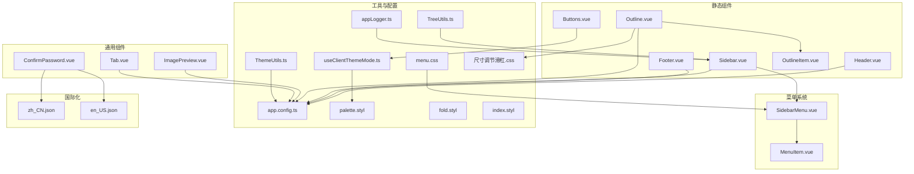
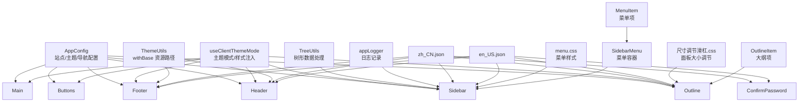
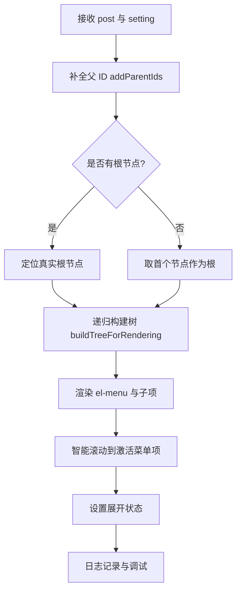
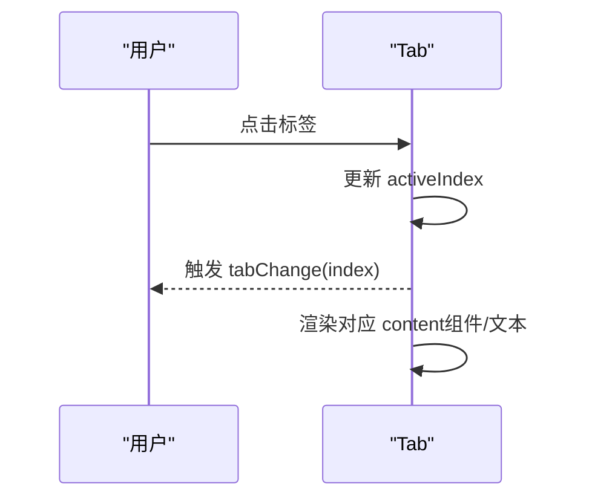
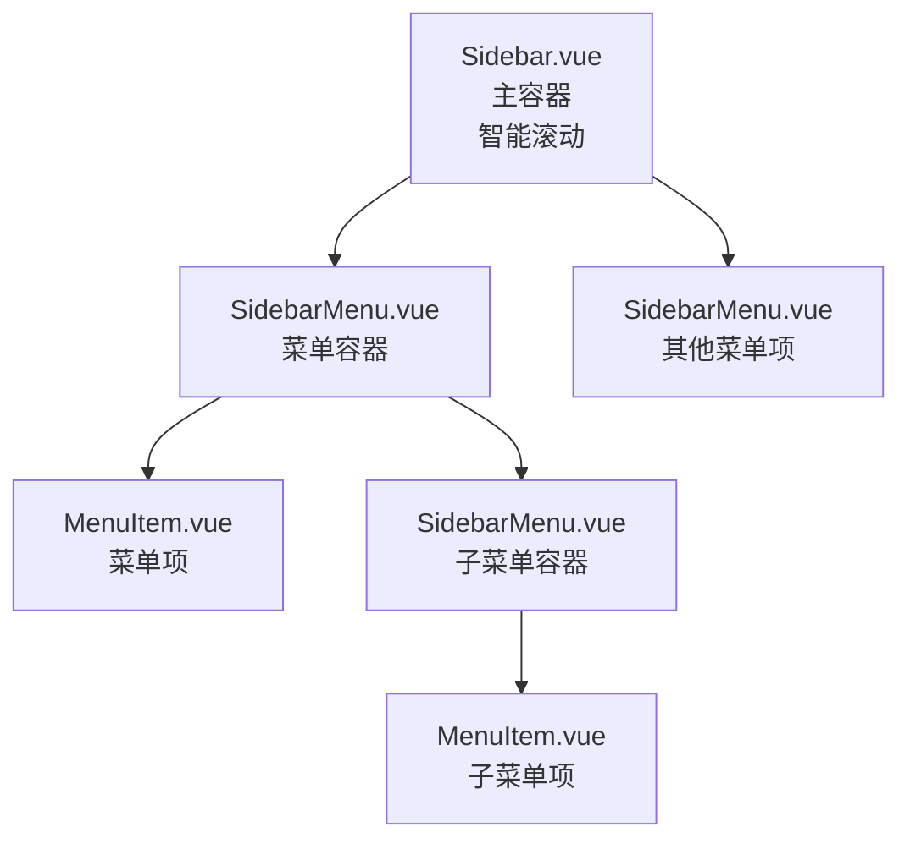
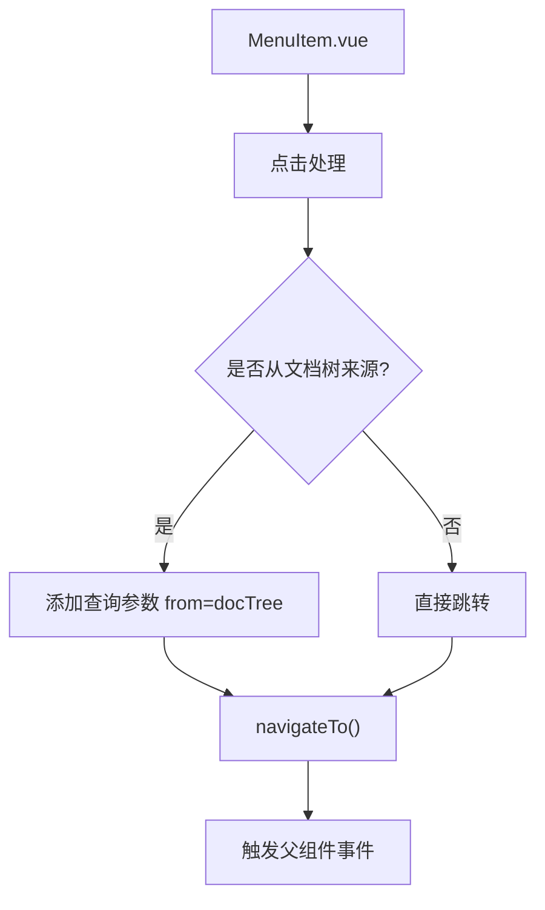
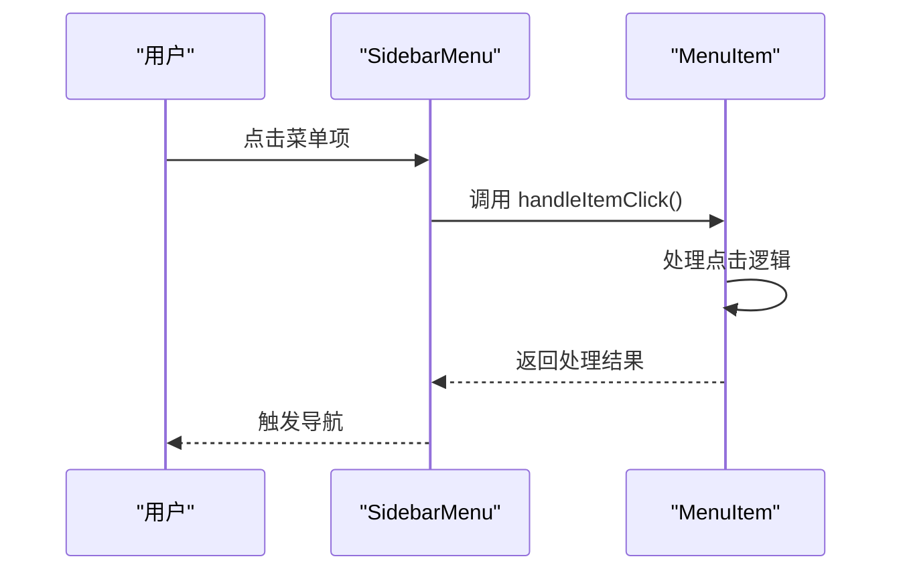
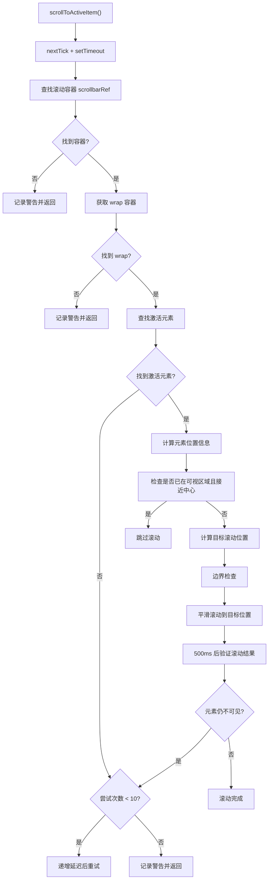
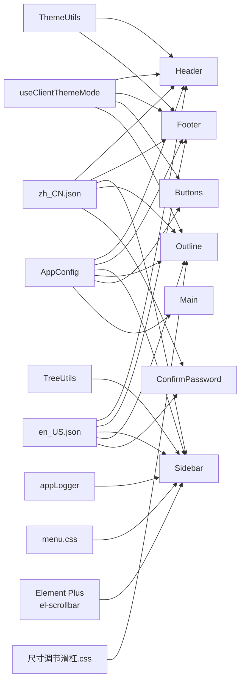

# UI 组件系统

<cite>
**本文引用的文件**
- [apps/app/components/static/Header.vue](file://apps/app/components/static/Header.vue)
- [apps/app/components/static/Footer.vue](file://apps/app/components/static/Footer.vue)
- [apps/app/components/static/Buttons.vue](file://apps/app/components/static/Buttons.vue)
- [apps/app/components/static/content/left/Sidebar.vue](file://apps/app/components/static/content/left/Sidebar.vue)
- [apps/app/components/static/content/left/MenuItem.vue](file://apps/app/components/static/content/left/MenuItem.vue)
- [apps/app/components/static/content/left/SidebarMenu.vue](file://apps/app/components/static/content/left/SidebarMenu.vue)
- [apps/app/components/static/content/right/Outline.vue](file://apps/app/components/static/content/right/Outline.vue)
- [apps/app/components/static/content/right/OutlineItem.vue](file://apps/app/components/static/content/right/OutlineItem.vue)
- [apps/app/components/static/content/Main.vue](file://apps/app/components/static/content/Main.vue)
- [apps/siyuan/src/components/Tab.vue](file://apps/siyuan/src/components/Tab.vue)
- [apps/app/components/common/ConfirmPassword.vue](file://apps/app/components/common/ConfirmPassword.vue)
- [apps/app/components/common/ImagePreview.vue](file://apps/app/components/common/ImagePreview.vue)
- [apps/app/composables/useClientThemeMode.ts](file://apps/app/composables/useClientThemeMode.ts)
- [apps/app/utils/TreeUtils.ts](file://apps/app/utils/TreeUtils.ts)
- [apps/app/utils/ThemeUtils.ts](file://apps/app/utils/ThemeUtils.ts)
- [apps/app/app.config.ts](file://apps/app/app.config.ts)
- [apps/app/i18n/locales/en_US.json](file://apps/app/i18n/locales/en_US.json)
- [apps/app/i18n/locales/zh_CN.json](file://apps/app/i18n/locales/zh_CN.json)
- [apps/app/assets/css/theme/palette.styl](file://apps/app/assets/css/theme/palette.styl)
- [apps/app/assets/css/fold.styl](file://apps/app/assets/css/fold.styl)
- [apps/app/assets/css/index.styl](file://apps/app/assets/css/index.styl)
- [apps/app/public/resources/appearance/themes/Savor/style/module/menu.css](file://apps/app/public/resources/appearance/themes/Savor/style/module/menu.css)
- [apps/app/public/resources/appearance/themes/pink-room/部件修改/尺寸调节滑杠.css](file://apps/app/public/resources/appearance/themes/pink-room/部件修改/尺寸调节滑杠.css)
- [apps/app/utils/appLogger.ts](file://apps/app/utils/appLogger.ts)
</cite>

## 更新摘要
**所做更改**
- 新增大纲面板可调整大小功能章节，详细介绍宽度控制、固定机制和响应式设计
- 更新 Outline 组件架构，反映新增的宽度属性和固定定位功能
- 新增尺寸调节滑杠主题样式说明
- 更新大纲系统交互流程图，包含可调整大小机制
- 新增大纲面板性能优化和用户体验改进说明

## 目录
1. [简介](#简介)
2. [项目结构](#项目结构)
3. [核心组件](#核心组件)
4. [架构总览](#架构总览)
5. [组件详解](#组件详解)
6. [菜单系统重构](#菜单系统重构)
7. [智能自动滚动功能](#智能自动滚动功能)
8. [可调整大小大纲面板](#可调整大小大纲面板)
9. [依赖关系分析](#依赖关系分析)
10. [性能与可维护性](#性能与可维护性)
11. [故障排查指南](#故障排查指南)
12. [结论](#结论)
13. [附录](#附录)

## 简介
本文件面向 UI 组件系统，系统化梳理 Vue 组件架构与使用方法，覆盖通用组件、静态组件、公共组件的设计模式与最佳实践；重点解读 Tab 组件、Header、Footer、Detail 等核心组件的功能特性、API 接口与配置项；阐述响应式设计、主题适配与国际化支持；并提供使用示例与集成指南，帮助开发者快速理解与扩展。

**更新** 本次更新重点关注可调整大小大纲面板功能，显著提升了用户体验和界面灵活性。

## 项目结构
UI 组件主要分布在以下目录：
- apps/app/components/static：静态布局与交互组件（Header、Footer、Buttons、Sidebar、Outline 等）
- apps/app/components/static/content/left：左侧菜单系统（Sidebar、MenuItem、SidebarMenu）
- apps/app/components/static/content/right：右侧大纲系统（Outline、OutlineItem）
- apps/app/components/common：跨页面复用的通用组件（ConfirmPassword、ImagePreview）
- apps/app/components/public：公开分享相关组件（Detail 等）
- apps/siyuan/src/components：SiYuan 环境下的通用组件（Tab）
- apps/app/composables：组合式逻辑（主题模式、路由、鉴权等）
- apps/app/utils：工具类（TreeUtils、ThemeUtils、appLogger）
- apps/app/app.config.ts：全局配置类型与默认值
- apps/app/i18n/locales：国际化词条（中英文）
- apps/app/assets/css：核心样式文件（theme、fold、index）
- apps/app/public/resources/appearance/themes：主题样式文件
- apps/app/public/resources/appearance/themes/pink-room/部件修改：尺寸调节滑杠样式



**图表来源**
- [apps/app/components/static/Header.vue:1-131](file://apps/app/components/static/Header.vue#L1-L131)
- [apps/app/components/static/Footer.vue:1-115](file://apps/app/components/static/Footer.vue#L1-L115)
- [apps/app/components/static/Buttons.vue:1-240](file://apps/app/components/static/Buttons.vue#L1-L240)
- [apps/app/components/static/content/left/Sidebar.vue:1-250](file://apps/app/components/static/content/left/Sidebar.vue#L1-L250)
- [apps/app/components/static/content/left/MenuItem.vue:1-94](file://apps/app/components/static/content/left/MenuItem.vue#L1-L94)
- [apps/app/components/static/content/left/SidebarMenu.vue:1-90](file://apps/app/components/static/content/left/SidebarMenu.vue#L1-L90)
- [apps/app/components/static/content/right/Outline.vue:1-204](file://apps/app/components/static/content/right/Outline.vue#L1-L204)
- [apps/app/components/static/content/right/OutlineItem.vue:1-273](file://apps/app/components/static/content/right/OutlineItem.vue#L1-L273)
- [apps/siyuan/src/components/Tab.vue:1-147](file://apps/siyuan/src/components/Tab.vue#L1-L147)
- [apps/app/components/common/ConfirmPassword.vue:1-181](file://apps/app/components/common/ConfirmPassword.vue#L1-L181)
- [apps/app/components/common/ImagePreview.vue:1-64](file://apps/app/components/common/ImagePreview.vue#L1-L64)
- [apps/app/composables/useClientThemeMode.ts:1-158](file://apps/app/composables/useClientThemeMode.ts#L1-L158)
- [apps/app/utils/TreeUtils.ts:1-59](file://apps/app/utils/TreeUtils.ts#L1-L59)
- [apps/app/utils/ThemeUtils.ts:1-38](file://apps/app/utils/ThemeUtils.ts#L1-L38)
- [apps/app/app.config.ts:1-92](file://apps/app/app.config.ts#L1-L92)
- [apps/app/i18n/locales/zh_CN.json:1-100](file://apps/app/i18n/locales/zh_CN.json#L1-L100)
- [apps/app/i18n/locales/en_US.json:1-100](file://apps/app/i18n/locales/en_US.json#L1-L100)
- [apps/app/assets/css/theme/palette.styl:1-52](file://apps/app/assets/css/theme/palette.styl#L1-L52)
- [apps/app/assets/css/fold.styl:1-29](file://apps/app/assets/css/fold.styl#L1-L29)
- [apps/app/assets/css/index.styl:1-39](file://apps/app/assets/css/index.styl#L1-L39)
- [apps/app/public/resources/appearance/themes/Savor/style/module/menu.css:1-514](file://apps/app/public/resources/appearance/themes/Savor/style/module/menu.css#L1-L514)
- [apps/app/public/resources/appearance/themes/pink-room/部件修改/尺寸调节滑杠.css:1-27](file://apps/app/public/resources/appearance/themes/pink-room/部件修改/尺寸调节滑杠.css#L1-L27)
- [apps/app/utils/appLogger.ts:1-23](file://apps/app/utils/appLogger.ts#L1-L23)

**章节来源**
- [apps/app/components/static/Header.vue:1-131](file://apps/app/components/static/Header.vue#L1-L131)
- [apps/app/components/static/Footer.vue:1-115](file://apps/app/components/static/Footer.vue#L1-L115)
- [apps/app/components/static/Buttons.vue:1-240](file://apps/app/components/static/Buttons.vue#L1-L240)
- [apps/app/components/static/content/left/Sidebar.vue:1-250](file://apps/app/components/static/content/left/Sidebar.vue#L1-L250)
- [apps/app/components/static/content/left/MenuItem.vue:1-94](file://apps/app/components/static/content/left/MenuItem.vue#L1-L94)
- [apps/app/components/static/content/left/SidebarMenu.vue:1-90](file://apps/app/components/static/content/left/SidebarMenu.vue#L1-L90)
- [apps/app/components/static/content/right/Outline.vue:1-204](file://apps/app/components/static/content/right/Outline.vue#L1-L204)
- [apps/app/components/static/content/right/OutlineItem.vue:1-273](file://apps/app/components/static/content/right/OutlineItem.vue#L1-L273)
- [apps/siyuan/src/components/Tab.vue:1-147](file://apps/siyuan/src/components/Tab.vue#L1-L147)
- [apps/app/components/common/ConfirmPassword.vue:1-181](file://apps/app/components/common/ConfirmPassword.vue#L1-L181)
- [apps/app/components/common/ImagePreview.vue:1-64](file://apps/app/components/common/ImagePreview.vue#L1-L64)
- [apps/app/composables/useClientThemeMode.ts:1-158](file://apps/app/composables/useClientThemeMode.ts#L1-L158)
- [apps/app/utils/TreeUtils.ts:1-59](file://apps/app/utils/TreeUtils.ts#L1-L59)
- [apps/app/utils/ThemeUtils.ts:1-38](file://apps/app/utils/ThemeUtils.ts#L1-L38)
- [apps/app/app.config.ts:1-92](file://apps/app/app.config.ts#L1-L92)
- [apps/app/i18n/locales/zh_CN.json:1-100](file://apps/app/i18n/locales/zh_CN.json#L1-L100)
- [apps/app/i18n/locales/en_US.json:1-100](file://apps/app/i18n/locales/en_US.json#L1-L100)
- [apps/app/assets/css/theme/palette.styl:1-52](file://apps/app/assets/css/theme/palette.styl#L1-L52)
- [apps/app/assets/css/fold.styl:1-29](file://apps/app/assets/css/fold.styl#L1-L29)
- [apps/app/assets/css/index.styl:1-39](file://apps/app/assets/css/index.styl#L1-L39)
- [apps/app/public/resources/appearance/themes/Savor/style/module/menu.css:1-514](file://apps/app/public/resources/appearance/themes/Savor/style/module/menu.css#L1-L514)
- [apps/app/public/resources/appearance/themes/pink-room/部件修改/尺寸调节滑杠.css:1-27](file://apps/app/public/resources/appearance/themes/pink-room/部件修改/尺寸调节滑杠.css#L1-L27)
- [apps/app/utils/appLogger.ts:1-23](file://apps/app/utils/appLogger.ts#L1-L23)

## 核心组件
- Header：站点导航与品牌展示，支持 Logo、站点名称与自定义头部 HTML 片段
- Footer：版权信息、版本号、跳转入口与主题模式切换
- Buttons：返回顶部、主题模式弹窗选择等交互按钮集合
- Sidebar：基于文档树的左侧导航菜单，支持展开、高亮、层级控制和智能自动滚动
- MenuItem：菜单项组件，支持文本截断、工具提示和点击区域优化
- SidebarMenu：菜单容器组件，支持嵌套菜单和激活状态管理
- Outline：右侧可调整大小的文档大纲，支持固定定位、宽度控制和智能滚动
- OutlineItem：大纲项组件，支持层级缩进、激活状态和滚动到章节
- Main：正文内容容器，支持图片预览和富文本渲染
- Tab：标签页容器，支持横向/纵向、动态内容渲染与事件回调
- ConfirmPassword：密码确认表单，内置校验与加载态
- ImagePreview：图片预览弹层，基于第三方库封装

**更新** 新增大纲面板可调整大小功能，显著提升了用户体验。

**章节来源**
- [apps/app/components/static/Header.vue:1-131](file://apps/app/components/static/Header.vue#L1-L131)
- [apps/app/components/static/Footer.vue:1-115](file://apps/app/components/static/Footer.vue#L1-L115)
- [apps/app/components/static/Buttons.vue:1-240](file://apps/app/components/static/Buttons.vue#L1-L240)
- [apps/app/components/static/content/left/Sidebar.vue:1-250](file://apps/app/components/static/content/left/Sidebar.vue#L1-L250)
- [apps/app/components/static/content/left/MenuItem.vue:1-94](file://apps/app/components/static/content/left/MenuItem.vue#L1-L94)
- [apps/app/components/static/content/left/SidebarMenu.vue:1-90](file://apps/app/components/static/content/left/SidebarMenu.vue#L1-L90)
- [apps/app/components/static/content/right/Outline.vue:1-204](file://apps/app/components/static/content/right/Outline.vue#L1-L204)
- [apps/app/components/static/content/right/OutlineItem.vue:1-273](file://apps/app/components/static/content/right/OutlineItem.vue#L1-L273)
- [apps/app/components/static/content/Main.vue:1-80](file://apps/app/components/static/content/Main.vue#L1-L80)
- [apps/siyuan/src/components/Tab.vue:1-147](file://apps/siyuan/src/components/Tab.vue#L1-L147)
- [apps/app/components/common/ConfirmPassword.vue:1-181](file://apps/app/components/common/ConfirmPassword.vue#L1-L181)
- [apps/app/components/common/ImagePreview.vue:1-64](file://apps/app/components/common/ImagePreview.vue#L1-L64)

## 架构总览
组件系统采用"静态布局 + 通用组件 + 组合式逻辑"的分层设计：
- 配置驱动：通过 app.config.ts 的 AppConfig 类型统一管理站点、主题、导航等配置
- 主题适配：useClientThemeMode.ts 动态注入主题样式与代码高亮样式，支持明/暗模式切换
- 国际化：i18n 词条按模块组织，组件通过 useI18n 获取文案
- 工具支撑：ThemeUtils 提供资源路径拼接，TreeUtils 处理树形数据结构，appLogger 提供日志记录
- 菜单系统：Sidebar 作为主容器，SidebarMenu 和 MenuItem 提供细粒度的菜单功能，支持智能自动滚动
- 大纲系统：Outline 作为右侧容器，OutlineItem 提供层级化的大纲项功能，支持可调整大小和固定定位



**图表来源**
- [apps/app/app.config.ts:1-92](file://apps/app/app.config.ts#L1-L92)
- [apps/app/composables/useClientThemeMode.ts:1-158](file://apps/app/composables/useClientThemeMode.ts#L1-L158)
- [apps/app/utils/ThemeUtils.ts:1-38](file://apps/app/utils/ThemeUtils.ts#L1-L38)
- [apps/app/utils/TreeUtils.ts:1-59](file://apps/app/utils/TreeUtils.ts#L1-L59)
- [apps/app/utils/appLogger.ts:1-23](file://apps/app/utils/appLogger.ts#L1-L23)
- [apps/app/i18n/locales/zh_CN.json:1-100](file://apps/app/i18n/locales/zh_CN.json#L1-L100)
- [apps/app/i18n/locales/en_US.json:1-100](file://apps/app/i18n/locales/en_US.json#L1-L100)
- [apps/app/public/resources/appearance/themes/Savor/style/module/menu.css:1-514](file://apps/app/public/resources/appearance/themes/Savor/style/module/menu.css#L1-L514)
- [apps/app/public/resources/appearance/themes/pink-room/部件修改/尺寸调节滑杠.css:1-27](file://apps/app/public/resources/appearance/themes/pink-room/部件修改/尺寸调节滑杠.css#L1-L27)

## 组件详解

### Header 组件
- 功能要点
  - 展示站点 Logo 与标题，支持隐藏标题
  - 支持注入自定义头部 HTML（header 字段）
  - 响应式布局：窄屏下标题隐藏，移动端进一步简化
- 关键属性
  - setting: AppConfig（包含 siteTitle、themeConfig.logo、header 等）
- 国际化
  - 使用 useI18n 获取文案上下文
- 主题适配
  - 通过 ThemeUtils.withBase 拼接带 base 的资源路径
- 响应式
  - 媒体查询控制不同屏幕下的显示策略


**图表来源**
- [apps/app/components/static/Header.vue:1-131](file://apps/app/components/static/Header.vue#L1-L131)
- [apps/app/utils/ThemeUtils.ts:1-38](file://apps/app/utils/ThemeUtils.ts#L1-L38)

**章节来源**
- [apps/app/components/static/Header.vue:1-131](file://apps/app/components/static/Header.vue#L1-L131)
- [apps/app/utils/ThemeUtils.ts:1-38](file://apps/app/utils/ThemeUtils.ts#L1-L38)

### Footer 组件
- 功能要点
  - 显示版权年份、版本号、跳转入口（首页、关于、GitHub）
  - 主题模式切换按钮委托 Buttons 组件
  - 支持注入自定义底部 HTML（footer 字段）
  - 默认语言初始化
- 关键属性
  - setting: AppConfig
- 交互流程
  - 点击事件触发跳转或主题切换
  - onBeforeMount 设置语言


**图表来源**
- [apps/app/components/static/Footer.vue:1-115](file://apps/app/components/static/Footer.vue#L1-L115)
- [apps/app/components/static/Buttons.vue:1-240](file://apps/app/components/static/Buttons.vue#L1-L240)
- [apps/app/composables/useClientThemeMode.ts:1-158](file://apps/app/composables/useClientThemeMode.ts#L1-L158)

**章节来源**
- [apps/app/components/static/Footer.vue:1-115](file://apps/app/components/static/Footer.vue#L1-L115)
- [apps/app/components/static/Buttons.vue:1-240](file://apps/app/components/static/Buttons.vue#L1-L240)
- [apps/app/composables/useClientThemeMode.ts:1-158](file://apps/app/composables/useClientThemeMode.ts#L1-L158)

### Buttons 组件
- 功能要点
  - 返回顶部：滚动超过阈值显示
  - 主题模式选择：悬浮弹窗，支持 light/dark
  - 评论入口（预留）
- 关键属性
  - defaultMode: "auto" | "light" | "dark"
- 交互细节
  - 滚动节流监听，避免高频计算
  - 鼠标进入/离开控制弹窗显隐

**章节来源**
- [apps/app/components/static/Buttons.vue:1-240](file://apps/app/components/static/Buttons.vue#L1-L240)

### Sidebar 组件
- 功能要点
  - 基于 docTree 构建树形菜单
  - 默认展开至当前文档父链
  - 支持从文档树来源的高亮与展开
  - **智能自动滚动**：自动滚动到激活菜单项，支持重试机制、边界检查和平滑滚动
- 关键属性
  - post: 包含 docTree、postid、docTreeLevel 等
  - setting: AppConfig（docPath）
- 数据处理
  - TreeUtils.addParentIds 补全父子关系
  - 递归构建树结构，生成链接
- 交互优化
  - 滚动到激活菜单项，确保可见性
  - 支持从文档树来源的特殊处理
  - **智能滚动算法**：包含重试机制、边界检查、平滑滚动和日志记录

**更新** 新增智能自动滚动功能，显著提升了用户体验。



**图表来源**
- [apps/app/components/static/content/left/Sidebar.vue:112-114](file://apps/app/components/static/content/left/Sidebar.vue#L112-L114)
- [apps/app/components/static/content/left/Sidebar.vue:24-109](file://apps/app/components/static/content/left/Sidebar.vue#L24-L109)

**章节来源**
- [apps/app/components/static/content/left/Sidebar.vue:1-250](file://apps/app/components/static/content/left/Sidebar.vue#L1-L250)

### Outline 组件
- 功能要点
  - 渲染右侧可调整大小的文档大纲
  - 支持固定定位和宽度控制
  - 自动推断根层级与最大层级
  - 支持激活文本高亮和智能滚动
- 关键属性
  - outlineData: 标题数组
  - maxDepth: 最大层级
  - activeText: 激活文本
  - width: 大纲面板宽度，默认 280px
- 样式适配
  - 暗色模式下自动切换背景与边框
  - 固定定位确保在滚动时保持可见
  - 内联样式覆盖默认宽度

**更新** 新增大纲面板可调整大小功能，支持固定定位和宽度控制。

```mermaid
flowchart TD
A["接收 outlineData, activeText, width"] --> B["计算根层级 getRootLevel()"]
B --> C["渲染大纲项 OutlineItem"]
C --> D["监听 activeText 变化"]
D --> E["智能滚动到激活项 scrollToActiveItem()"]
E --> F["固定定位 position: fixed"]
F --> G["宽度控制 :style=\"{ width: width + 'px' }\""]
```

**图表来源**
- [apps/app/components/static/content/right/Outline.vue:13-30](file://apps/app/components/static/content/right/Outline.vue#L13-L30)
- [apps/app/components/static/content/right/Outline.vue:55-90](file://apps/app/components/static/content/right/Outline.vue#L55-L90)

**章节来源**
- [apps/app/components/static/content/right/Outline.vue:1-204](file://apps/app/components/static/content/right/Outline.vue#L1-L204)

### OutlineItem 组件
- 功能要点
  - 渲染单个大纲项，支持层级缩进
  - 激活状态高亮和父级半激活状态
  - 滚动到对应章节内容
  - 文本清理和标题提取
- 关键属性
  - item: 大纲项数据
  - maxDepth: 最大层级
  - isRoot: 是否为根节点
  - rootLevel: 根层级
  - activeText: 激活文本
  - containerWidth: 容器宽度
- 样式优化
  - 递减缩进策略，提升可读性
  - 悬停效果和激活状态样式
  - 暗色模式适配

**更新** 新增层级缩进优化和激活状态增强功能。

**章节来源**
- [apps/app/components/static/content/right/OutlineItem.vue:1-273](file://apps/app/components/static/content/right/OutlineItem.vue#L1-L273)

### Main 组件
- 功能要点
  - 渲染正文内容，支持富文本
  - 图片预览功能集成
  - 内容可编辑属性控制
- 关键属性
  - post: 文章数据
  - setting: 应用配置
- 性能优化
  - 内联样式移除，提升渲染性能
  - 客户端渲染图片预览组件

**章节来源**
- [apps/app/components/static/content/Main.vue:1-80](file://apps/app/components/static/content/Main.vue#L1-L80)

### Tab 组件
- 功能要点
  - 支持横向/纵向标签页
  - 动态内容渲染（组件或文本）
  - tabChange 事件回调
- 关键属性
  - tabs: 数组，每项包含 label、content、props
  - activeTab: 当前激活索引
  - vertical: 是否纵向
- 事件
  - tabChange(index)



**图表来源**
- [apps/siyuan/src/components/Tab.vue:1-147](file://apps/siyuan/src/components/Tab.vue#L1-L147)

**章节来源**
- [apps/siyuan/src/components/Tab.vue:1-147](file://apps/siyuan/src/components/Tab.vue#L1-L147)

### ConfirmPassword 组件
- 功能要点
  - 密码输入表单，内置校验规则
  - 支持重置与外部赋值
  - 提交时触发事件并携带密码
- 关键属性
  - title/description/placeholder/submitText/hint/initialValue
- 事件
  - submit(password)
  - cancel()

**章节来源**
- [apps/app/components/common/ConfirmPassword.vue:1-181](file://apps/app/components/common/ConfirmPassword.vue#L1-L181)

### ImagePreview 组件
- 功能要点
  - 基于第三方库的图片预览弹层
  - 暴露 show(index) 方法以供外部调用
- 关键属性
  - images: 图片数组
  - index: 默认索引
- 事件
  - hide

**章节来源**
- [apps/app/components/common/ImagePreview.vue:1-64](file://apps/app/components/common/ImagePreview.vue#L1-L64)

## 菜单系统重构

### 菜单系统架构
菜单系统经过重构，采用分层组件设计，提升用户体验和可访问性：

- **Sidebar**：主容器，负责菜单的整体布局和状态管理，新增智能自动滚动功能
- **SidebarMenu**：菜单容器组件，处理菜单项的渲染和交互
- **MenuItem**：基础菜单项组件，提供点击区域优化和文本处理



**图表来源**
- [apps/app/components/static/content/left/Sidebar.vue:1-250](file://apps/app/components/static/content/left/Sidebar.vue#L1-L250)
- [apps/app/components/static/content/left/SidebarMenu.vue:1-90](file://apps/app/components/static/content/left/SidebarMenu.vue#L1-L90)
- [apps/app/components/static/content/left/MenuItem.vue:1-94](file://apps/app/components/static/content/left/MenuItem.vue#L1-L94)

### MenuItem 组件改进
MenuItem 组件进行了重要优化：

- **点击区域优化**：通过 CSS 扩展点击区域到左侧，覆盖 Element Plus 的 padding 区域
- **文本处理**：智能计算中英文字符长度，支持文本截断和工具提示
- **事件管理**：提供统一的点击处理方法，支持从文档树来源的链接处理



**图表来源**
- [apps/app/components/static/content/left/MenuItem.vue:55-66](file://apps/app/components/static/content/left/MenuItem.vue#L55-L66)

### SidebarMenu 组件改进
SidebarMenu 组件增强了交互体验：

- **嵌套菜单支持**：递归渲染子菜单，支持多级嵌套
- **激活状态管理**：基于 activeIndex 管理当前激活菜单项
- **事件委派**：通过 ref 调用子组件的方法，实现事件委派



**图表来源**
- [apps/app/components/static/content/left/SidebarMenu.vue:32-36](file://apps/app/components/static/content/left/SidebarMenu.vue#L32-L36)

### 菜单系统交互流程
重构后的菜单系统提供了更好的用户体验：

1. **点击区域优化**：菜单项的点击区域扩展到整个行高，提升可访问性
2. **文本截断处理**：长文本自动截断并显示工具提示
3. **事件委派机制**：通过 ref 实现父子组件间的事件传递
4. **激活状态高亮**：当前激活菜单项具有明显的视觉反馈

**章节来源**
- [apps/app/components/static/content/left/MenuItem.vue:1-94](file://apps/app/components/static/content/left/MenuItem.vue#L1-L94)
- [apps/app/components/static/content/left/SidebarMenu.vue:1-90](file://apps/app/components/static/content/left/SidebarMenu.vue#L1-L90)
- [apps/app/components/static/content/left/Sidebar.vue:1-250](file://apps/app/components/static/content/left/Sidebar.vue#L1-L250)

## 智能自动滚动功能

### 滚动算法概述
Sidebar 组件新增了智能自动滚动功能，通过复杂的算法确保激活菜单项始终处于可视区域的中心位置。该功能包含重试机制、边界检查和平滑滚动等高级特性。

### 核心算法实现
智能滚动功能的核心实现包含以下关键步骤：

1. **元素定位**：优先查找 `.el-menu-item.is-active`，如果不存在则回退到任意 `.is-active` 元素
2. **位置计算**：获取元素相对于滚动容器的位置信息
3. **可视区域判断**：检查元素是否已在可视区域内且接近中心
4. **目标滚动计算**：计算使元素居中的目标滚动位置
5. **边界检查**：确保滚动位置在有效范围内
6. **平滑滚动**：使用 Element Plus 的 `scrollTo` 方法进行平滑滚动
7. **重试机制**：验证滚动结果，必要时进行重试



**图表来源**
- [apps/app/components/static/content/left/Sidebar.vue:24-109](file://apps/app/components/static/content/left/Sidebar.vue#L24-L109)

### 重试机制设计
智能滚动功能包含完善的重试机制：

- **最大尝试次数**：最多尝试 10 次
- **递增延迟**：每次重试增加 100ms 延迟，最长 1000ms
- **条件检查**：只有在元素未找到或滚动后仍不可见时才重试
- **日志记录**：详细记录每次尝试的结果和原因

### 边界检查机制
为了确保滚动行为的稳定性，系统实现了严格的边界检查：

- **最小值检查**：确保滚动位置不小于 0
- **最大值检查**：确保滚动位置不超过最大滚动高度
- **容器尺寸验证**：检查容器的高度和滚动高度有效性
- **元素尺寸验证**：验证元素的高度和相对位置

### 平滑滚动实现
使用 Element Plus 的原生滚动方法实现平滑滚动：

- **behavior: 'smooth'**：启用平滑滚动动画
- **精确控制**：通过 `scrollTo` 方法精确控制滚动位置
- **性能优化**：避免使用 jQuery 或第三方库，直接调用原生 API

### 日志记录与调试
智能滚动功能集成了完整的日志记录系统：

- **开发模式**：在开发环境下输出详细的调试信息
- **生产模式**：在生产环境下保持静默
- **关键信息**：记录滚动目标、元素位置、容器尺寸等关键信息
- **错误追踪**：记录警告和错误信息，便于问题排查

**章节来源**
- [apps/app/components/static/content/left/Sidebar.vue:24-109](file://apps/app/components/static/content/left/Sidebar.vue#L24-L109)
- [apps/app/utils/appLogger.ts:1-23](file://apps/app/utils/appLogger.ts#L1-L23)

## 可调整大小大纲面板

### 大纲面板架构
可调整大小的大纲面板系统经过全新设计，提供灵活的界面布局能力：

- **Outline**：主容器，支持固定定位、宽度控制和智能滚动
- **OutlineItem**：大纲项组件，支持层级缩进、激活状态和滚动到章节
- **尺寸调节滑杠**：主题样式支持，实现左右拖拽调整面板宽度

### 大纲面板功能特性
- **固定定位**：使用 `position: fixed` 确保在滚动时保持可见
- **宽度控制**：通过 `width` 属性控制面板宽度，默认 280px
- **智能滚动**：自动滚动到激活的大纲项，确保可见性
- **响应式设计**：配合主题样式实现拖拽调整功能

### 核心实现机制
大纲面板的可调整大小功能通过以下机制实现：

1. **内联样式控制**：使用 `:style="{ width: width + 'px' }"` 动态设置宽度
2. **固定定位**：`position: fixed` 确保面板在页面滚动时保持位置
3. **智能滚动**：监听 `activeText` 变化，自动滚动到激活项
4. **主题集成**：通过 `尺寸调节滑杠.css` 实现拖拽调整功能

```mermaid
flowchart TD
A["Outline.vue"] --> B["width 属性控制"]
B --> C["内联样式 :style=\"{ width: width + 'px' }\""]
C --> D["固定定位 position: fixed"]
D --> E["智能滚动 scrollToActiveItem()"]
E --> F["OutlineItem 渲染"]
F --> G["尺寸调节滑杠主题样式"]
```

**图表来源**
- [apps/app/components/static/content/right/Outline.vue:26-30](file://apps/app/components/static/content/right/Outline.vue#L26-L30)
- [apps/app/components/static/content/right/Outline.vue:94-114](file://apps/app/components/static/content/right/Outline.vue#L94-L114)
- [apps/app/components/static/content/right/Outline.vue:55-90](file://apps/app/components/static/content/right/Outline.vue#L55-L90)

### OutlineItem 组件优化
OutlineItem 组件在可调整大小功能中进行了多项优化：

- **层级缩进优化**：递减缩进策略，提升可读性
- **激活状态增强**：支持精确匹配和父级半激活状态
- **滚动到章节**：点击大纲项自动滚动到对应内容
- **文本清理**：统一的文本处理和标题提取

### 尺寸调节滑杠主题
通过主题样式实现面板大小调节功能：

- **左右调节**：`.layout__resize--lr` 类实现水平拖拽
- **滑杠样式**：`.layout__resize` 类控制滑杠外观
- **颜色适配**：使用 `var(--room-surface-lightcolor)` 适配主题
- **z-index 管理**：防止遮挡内容区域

**章节来源**
- [apps/app/components/static/content/right/Outline.vue:1-204](file://apps/app/components/static/content/right/Outline.vue#L1-L204)
- [apps/app/components/static/content/right/OutlineItem.vue:1-273](file://apps/app/components/static/content/right/OutlineItem.vue#L1-L273)
- [apps/app/public/resources/appearance/themes/pink-room/部件修改/尺寸调节滑杠.css:1-27](file://apps/app/public/resources/appearance/themes/pink-room/部件修改/尺寸调节滑杠.css#L1-L27)

## 依赖关系分析
- 配置依赖
  - Header/Footer/Sidebar/Outline/Buttons 均依赖 AppConfig（站点信息、主题配置、导航路径等）
- 主题依赖
  - useClientThemeMode 注入主题样式与代码高亮样式，Buttons 通过其提供的 colorMode 控制 UI
- 国际化依赖
  - 大量组件通过 useI18n 获取文案，zh_CN.json 与 en_US.json 提供词条
- 工具依赖
  - ThemeUtils.withBase 用于拼接带 base 的资源路径
  - TreeUtils.addParentIds 用于处理树形数据结构
  - **appLogger.createAppLogger 用于智能滚动功能的日志记录**
- 组件间耦合
  - Footer 与 Buttons 解耦，Footer 仅负责展示与事件转发
  - Tab 与业务内容解耦，通过 content/props 动态渲染
  - 菜单系统通过 ref 实现组件间通信
  - **Sidebar 与 Element Plus 的 el-scrollbar 组件紧密集成**
  - **Outline 与尺寸调节滑杠主题样式集成**



**图表来源**
- [apps/app/app.config.ts:1-92](file://apps/app/app.config.ts#L1-L92)
- [apps/app/composables/useClientThemeMode.ts:1-158](file://apps/app/composables/useClientThemeMode.ts#L1-L158)
- [apps/app/utils/ThemeUtils.ts:1-38](file://apps/app/utils/ThemeUtils.ts#L1-L38)
- [apps/app/utils/TreeUtils.ts:1-59](file://apps/app/utils/TreeUtils.ts#L1-L59)
- [apps/app/utils/appLogger.ts:1-23](file://apps/app/utils/appLogger.ts#L1-L23)
- [apps/app/i18n/locales/zh_CN.json:1-100](file://apps/app/i18n/locales/zh_CN.json#L1-L100)
- [apps/app/i18n/locales/en_US.json:1-100](file://apps/app/i18n/locales/en_US.json#L1-L100)
- [apps/app/public/resources/appearance/themes/Savor/style/module/menu.css:1-514](file://apps/app/public/resources/appearance/themes/Savor/style/module/menu.css#L1-L514)
- [apps/app/public/resources/appearance/themes/pink-room/部件修改/尺寸调节滑杠.css:1-27](file://apps/app/public/resources/appearance/themes/pink-room/部件修改/尺寸调节滑杠.css#L1-L27)

**章节来源**
- [apps/app/app.config.ts:1-92](file://apps/app/app.config.ts#L1-L92)
- [apps/app/composables/useClientThemeMode.ts:1-158](file://apps/app/composables/useClientThemeMode.ts#L1-L158)
- [apps/app/utils/ThemeUtils.ts:1-38](file://apps/app/utils/ThemeUtils.ts#L1-L38)
- [apps/app/utils/TreeUtils.ts:1-59](file://apps/app/utils/TreeUtils.ts#L1-L59)
- [apps/app/utils/appLogger.ts:1-23](file://apps/app/utils/appLogger.ts#L1-L23)
- [apps/app/i18n/locales/zh_CN.json:1-100](file://apps/app/i18n/locales/zh_CN.json#L1-L100)
- [apps/app/i18n/locales/en_US.json:1-100](file://apps/app/i18n/locales/en_US.json#L1-L100)

## 性能与可维护性
- 性能
  - Buttons 对滚动事件使用节流，降低频繁计算
  - Sidebar 构建树时使用 Map 与递归，避免重复遍历
  - Outline 使用固定宽度与滚动容器，减少重排
  - 菜单系统通过 ref 优化组件间通信，减少事件冒泡
  - **智能滚动功能使用 nextTick 和 setTimeout 优化 DOM 查询时机**
  - **重试机制采用递增延迟，避免频繁重试影响性能**
  - **Outline 的智能滚动使用 getBoundingClientRect 优化性能**
  - **尺寸调节滑杠使用原生 CSS 变量，避免 JavaScript 操作**
- 可维护性
  - 组件职责单一，事件与属性清晰
  - 配置集中于 AppConfig，便于统一管理
  - 主题注入集中在 useClientThemeMode，便于扩展新主题
  - 菜单系统采用分层设计，便于功能扩展和维护
  - **大纲系统支持宽度属性，便于定制化配置**
  - **日志记录系统便于问题排查和性能监控**
- 用户体验
  - **智能滚动确保激活菜单项始终可见且居中**
  - **平滑滚动动画提升视觉体验**
  - **重试机制保证在复杂页面结构下的可靠性**
  - **边界检查防止滚动异常**
  - **可调整大小的大纲面板提升界面灵活性**
  - **固定定位确保大纲面板始终可用**

**更新** 新增大纲面板可调整大小功能的性能优化和用户体验改进说明。

## 故障排查指南
- 主题未生效
  - 检查 useClientThemeMode 是否正确注入主题样式与代码高亮样式
  - 确认 data-theme-mode 与 data-light/dark-theme 属性是否写入 htmlAttrs
- 资源路径异常
  - 使用 ThemeUtils.withBase 拼接 base 路径，避免相对路径问题
- 国际化文案缺失
  - 确认 key 是否存在于 zh_CN.json 或 en_US.json
- 密码校验失败
  - 查看 ConfirmPassword 的校验规则与错误提示文案
- 图片预览不显示
  - 确认传入 images 数组与 index 正确，检查第三方库依赖
- 菜单点击无效
  - 检查 MenuItem 的点击处理逻辑，确认事件委派是否正常
  - 验证 SidebarMenu 的 ref 调用是否成功
  - 确认菜单项的链接格式是否正确
- **智能滚动功能异常**
  - **检查浏览器控制台是否有日志输出，确认 appLogger 是否正常工作**
  - **验证 Element Plus 的 el-scrollbar 组件是否正确渲染**
  - **确认激活元素的选择器是否匹配实际的 DOM 结构**
  - **检查重试机制是否被正确触发，尝试次数是否达到最大值**
  - **验证边界检查逻辑，确认滚动位置是否在有效范围内**
- **大纲面板调整大小失效**
  - **检查尺寸调节滑杠主题样式是否正确加载**
  - **确认 CSS 变量 `--room-surface-lightcolor` 是否定义**
  - **验证 Outline 组件的 width 属性是否正确传递**
  - **检查固定定位是否被其他样式覆盖**

**更新** 新增大纲面板可调整大小功能相关的故障排查指导。

**章节来源**
- [apps/app/composables/useClientThemeMode.ts:1-158](file://apps/app/composables/useClientThemeMode.ts#L1-L158)
- [apps/app/utils/ThemeUtils.ts:1-38](file://apps/app/utils/ThemeUtils.ts#L1-L38)
- [apps/app/i18n/locales/zh_CN.json:1-100](file://apps/app/i18n/locales/zh_CN.json#L1-L100)
- [apps/app/i18n/locales/en_US.json:1-100](file://apps/app/i18n/locales/en_US.json#L1-L100)
- [apps/app/components/common/ConfirmPassword.vue:1-181](file://apps/app/components/common/ConfirmPassword.vue#L1-L181)
- [apps/app/components/common/ImagePreview.vue:1-64](file://apps/app/components/common/ImagePreview.vue#L1-L64)
- [apps/app/components/static/content/left/MenuItem.vue:55-66](file://apps/app/components/static/content/left/MenuItem.vue#L55-L66)
- [apps/app/components/static/content/left/SidebarMenu.vue:32-36](file://apps/app/components/static/content/left/SidebarMenu.vue#L32-L36)
- [apps/app/utils/appLogger.ts:1-23](file://apps/app/utils/appLogger.ts#L1-L23)
- [apps/app/public/resources/appearance/themes/pink-room/部件修改/尺寸调节滑杠.css:1-27](file://apps/app/public/resources/appearance/themes/pink-room/部件修改/尺寸调节滑杠.css#L1-L27)

## 结论
该 UI 组件系统以配置驱动为核心，结合组合式逻辑与国际化、主题工具，形成清晰的静态布局与通用组件体系。各组件职责明确、接口简洁，具备良好的扩展性与可维护性。通过统一的主题注入与资源路径工具，实现了跨环境的一致体验。

**更新** 菜单系统的重构、智能自动滚动功能的新增和可调整大小大纲面板的实现进一步提升了用户体验和界面灵活性，通过优化点击区域、增强事件管理、改进文本处理和实现面板大小调节，为用户提供了更加流畅、直观和灵活的导航体验。智能滚动功能的引入显著改善了用户在大型文档树中的导航体验，确保激活菜单项始终处于最佳可视位置；可调整大小的大纲面板则提供了更灵活的界面布局能力。

## 附录

### 组件 API 速查
- Header
  - 属性：setting(AppConfig)
  - 行为：渲染 Logo/标题/自定义头部 HTML
- Footer
  - 属性：setting(AppConfig)
  - 事件：toggle-theme-mode(key)
  - 行为：版权/版本/跳转入口/主题切换
- Buttons
  - 属性：defaultMode("auto"|"light"|"dark")
  - 事件：toggle-theme-mode(key)
  - 行为：返回顶部/主题模式弹窗
- Sidebar
  - 属性：post(AppConfig), setting(AppConfig)
  - 行为：根据 docTree 渲染菜单，自动展开当前文档父链，**智能滚动到激活菜单项**
- SidebarMenu
  - 属性：menu(MenuData), activeIndex(string)
  - 行为：渲染菜单容器，支持嵌套菜单和激活状态管理
- MenuItem
  - 属性：link(string), text(string), fromDocTree(boolean)
  - 方法：handleItemClick()
  - 行为：渲染菜单项，支持文本截断、工具提示和点击区域优化
- Outline
  - 属性：outlineData(Array), maxDepth(Number), activeText(String), width(Number)
  - 行为：右侧可调整大小大纲，支持固定定位、宽度控制和智能滚动
- OutlineItem
  - 属性：item(Object), maxDepth(Number), isRoot(Boolean), rootLevel(Number), activeText(String), containerWidth(Number)
  - 行为：渲染大纲项，支持层级缩进、激活状态和滚动到章节
- Main
  - 属性：post(any), setting(any)
  - 行为：渲染正文内容，支持图片预览
- Tab
  - 属性：tabs(Array), activeTab(Number), vertical(Boolean)
  - 事件：tabChange(index)
  - 行为：标签页切换与动态内容渲染
- ConfirmPassword
  - 属性：title/description/placeholder/submitText/hint/initialValue
  - 事件：submit(password), cancel()
  - 行为：密码表单与校验
- ImagePreview
  - 属性：images(String[]), index(Number)
  - 事件：hide
  - 行为：图片预览弹层，暴露 show(index)

**更新** 新增大纲面板可调整大小功能和 Main 组件的 API 说明。

**章节来源**
- [apps/app/components/static/Header.vue:1-131](file://apps/app/components/static/Header.vue#L1-L131)
- [apps/app/components/static/Footer.vue:1-115](file://apps/app/components/static/Footer.vue#L1-L115)
- [apps/app/components/static/Buttons.vue:1-240](file://apps/app/components/static/Buttons.vue#L1-L240)
- [apps/app/components/static/content/left/Sidebar.vue:1-250](file://apps/app/components/static/content/left/Sidebar.vue#L1-L250)
- [apps/app/components/static/content/left/SidebarMenu.vue:1-90](file://apps/app/components/static/content/left/SidebarMenu.vue#L1-L90)
- [apps/app/components/static/content/left/MenuItem.vue:1-94](file://apps/app/components/static/content/left/MenuItem.vue#L1-L94)
- [apps/app/components/static/content/right/Outline.vue:1-204](file://apps/app/components/static/content/right/Outline.vue#L1-L204)
- [apps/app/components/static/content/right/OutlineItem.vue:1-273](file://apps/app/components/static/content/right/OutlineItem.vue#L1-L273)
- [apps/app/components/static/content/Main.vue:1-80](file://apps/app/components/static/content/Main.vue#L1-L80)
- [apps/siyuan/src/components/Tab.vue:1-147](file://apps/siyuan/src/components/Tab.vue#L1-L147)
- [apps/app/components/common/ConfirmPassword.vue:1-181](file://apps/app/components/common/ConfirmPassword.vue#L1-L181)
- [apps/app/components/common/ImagePreview.vue:1-64](file://apps/app/components/common/ImagePreview.vue#L1-L64)

### 响应式与主题适配
- 响应式
  - Header/Footer/Buttons 在窄屏与移动端调整布局与可见元素
  - 菜单系统支持响应式布局，在窄屏下优化显示效果
  - **智能滚动功能在不同屏幕尺寸下自动适应**
  - **大纲面板支持固定定位，在滚动时保持可见**
- 主题适配
  - useClientThemeMode 注入默认与当前主题样式，设置 data-theme-mode 属性
  - 暗色模式下 Outline 等组件自动切换背景与边框
  - 菜单系统样式通过 menu.css 进行主题适配
  - **智能滚动功能与主题样式完全兼容**
  - **尺寸调节滑杠样式通过 CSS 变量适配主题颜色**

**更新** 新增大纲面板固定定位和尺寸调节滑杠主题适配说明。

**章节来源**
- [apps/app/components/static/Header.vue:1-131](file://apps/app/components/static/Header.vue#L1-L131)
- [apps/app/components/static/Footer.vue:1-115](file://apps/app/components/static/Footer.vue#L1-L115)
- [apps/app/components/static/Buttons.vue:1-240](file://apps/app/components/static/Buttons.vue#L1-L240)
- [apps/app/components/static/content/right/Outline.vue:1-204](file://apps/app/components/static/content/right/Outline.vue#L1-L204)
- [apps/app/composables/useClientThemeMode.ts:1-158](file://apps/app/composables/useClientThemeMode.ts#L1-L158)
- [apps/app/public/resources/appearance/themes/Savor/style/module/menu.css:1-514](file://apps/app/public/resources/appearance/themes/Savor/style/module/menu.css#L1-L514)
- [apps/app/public/resources/appearance/themes/pink-room/部件修改/尺寸调节滑杠.css:1-27](file://apps/app/public/resources/appearance/themes/pink-room/部件修改/尺寸调节滑杠.css#L1-L27)

### 国际化支持
- 词条来源：zh_CN.json 与 en_US.json
- 组件使用：通过 useI18n 获取文案，如静态菜单标题、按钮文案等
- 菜单系统：支持多语言菜单项显示
- **智能滚动功能：日志记录使用英文描述，便于国际用户理解**
- **大纲面板：标题使用国际化词条，支持多语言显示**

**更新** 菜单系统支持国际化菜单项，智能滚动功能的日志使用英文描述，大纲面板支持国际化标题。

**章节来源**
- [apps/app/i18n/locales/zh_CN.json:1-100](file://apps/app/i18n/locales/zh_CN.json#L1-L100)
- [apps/app/i18n/locales/en_US.json:1-100](file://apps/app/i18n/locales/en_US.json#L1-L100)

### 集成指南
- 在页面中引入静态组件
  - Header/Footer/Buttons/Sidebar/Outline：传入 setting/AppConfig
  - Tab：传入 tabs、activeTab、vertical
  - ConfirmPassword：传入初始值与回调
  - ImagePreview：传入图片数组，调用暴露的 show(index)
- 菜单系统集成
  - Sidebar：传入 post 和 setting，自动渲染菜单树，**智能滚动功能自动启用**
  - SidebarMenu：传入 menu 和 activeIndex，支持嵌套菜单
  - MenuItem：传入 link、text 和 fromDocTree 属性
- 大纲系统集成
  - Outline：传入 outlineData、maxDepth、activeText 和 width 属性
  - OutlineItem：传入 item、maxDepth、isRoot、rootLevel、activeText 和 containerWidth
  - 支持固定定位和宽度控制
- 主题与国际化
  - 在入口处初始化 useClientThemeMode
  - 确保 i18n 语言与词条可用
  - 配置 menu.css 和尺寸调节滑杠样式文件
- **智能滚动功能集成**
  - **无需额外配置，Sidebar 组件自动启用智能滚动功能**
  - **确保 Element Plus 的 el-scrollbar 组件正确安装和配置**
  - **在开发环境中可查看详细的滚动日志信息**
- **大纲面板集成**
  - **确保尺寸调节滑杠主题样式正确加载**
  - **通过 width 属性控制大纲面板宽度**
  - **固定定位确保大纲面板在滚动时保持可见**

**更新** 新增大纲面板可调整大小功能的集成指南。

**章节来源**
- [apps/app/composables/useClientThemeMode.ts:1-158](file://apps/app/composables/useClientThemeMode.ts#L1-L158)
- [apps/app/i18n/locales/zh_CN.json:1-100](file://apps/app/i18n/locales/zh_CN.json#L1-L100)
- [apps/app/i18n/locales/en_US.json:1-100](file://apps/app/i18n/locales/en_US.json#L1-L100)
- [apps/app/components/static/content/left/Sidebar.vue:1-250](file://apps/app/components/static/content/left/Sidebar.vue#L1-L250)
- [apps/app/components/static/content/left/SidebarMenu.vue:1-90](file://apps/app/components/static/content/left/SidebarMenu.vue#L1-L90)
- [apps/app/components/static/content/left/MenuItem.vue:1-94](file://apps/app/components/static/content/left/MenuItem.vue#L1-L94)
- [apps/app/components/static/content/right/Outline.vue:1-204](file://apps/app/components/static/content/right/Outline.vue#L1-L204)
- [apps/app/components/static/content/right/OutlineItem.vue:1-273](file://apps/app/components/static/content/right/OutlineItem.vue#L1-L273)
- [apps/app/public/resources/appearance/themes/pink-room/部件修改/尺寸调节滑杠.css:1-27](file://apps/app/public/resources/appearance/themes/pink-room/部件修改/尺寸调节滑杠.css#L1-L27)