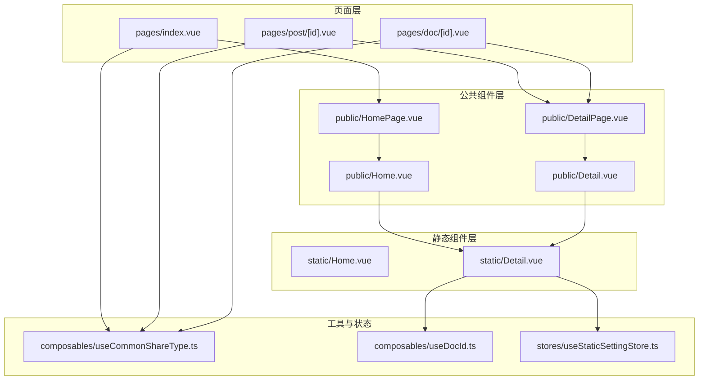
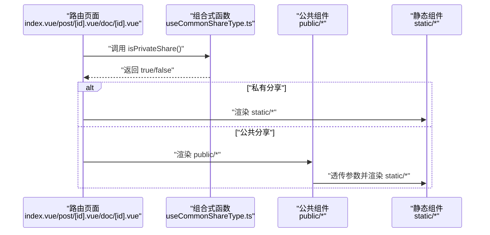
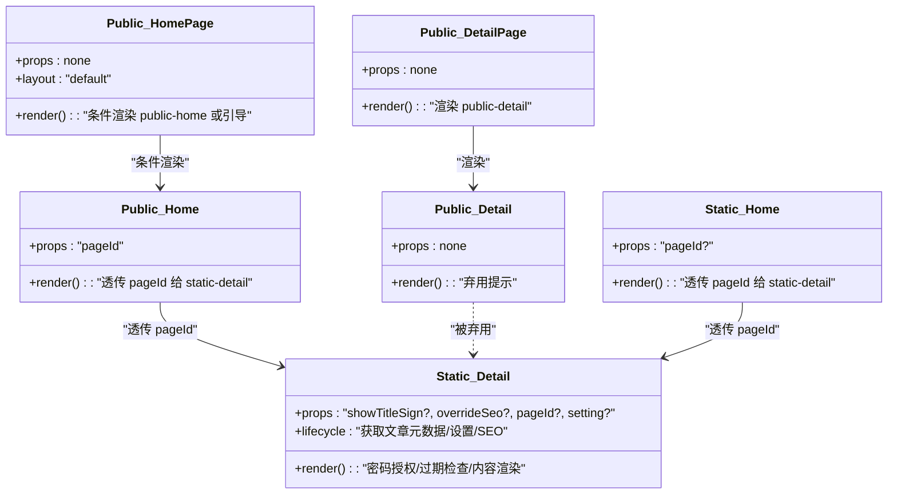
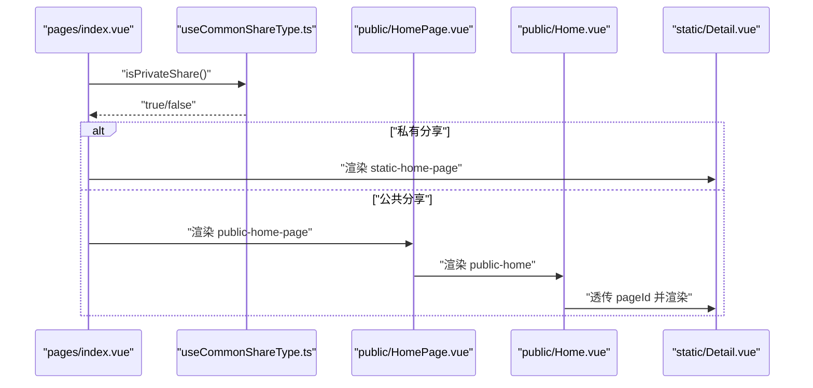
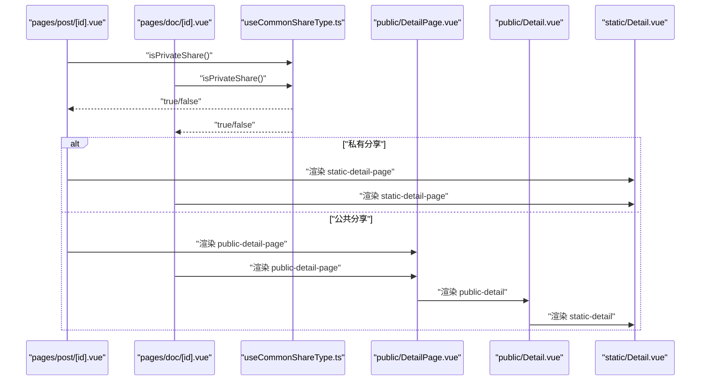
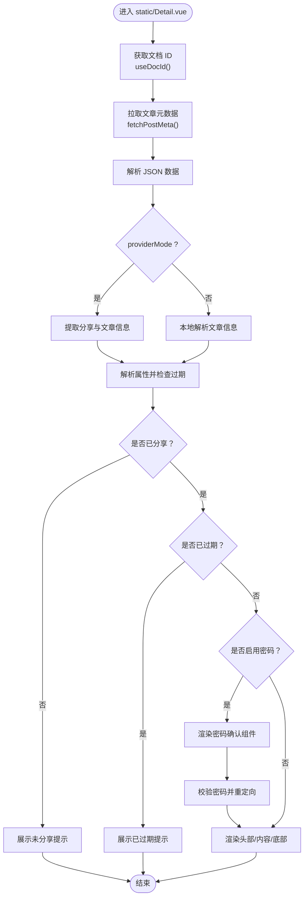
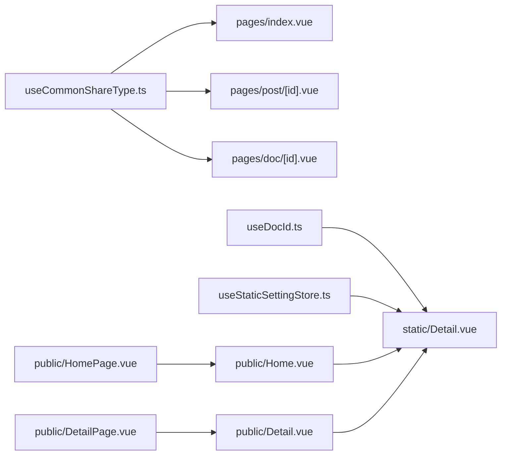

# 公共组件

<cite>
**本文引用的文件**
- [apps/app/components/public/Detail.vue](file://apps/app/components/public/Detail.vue)
- [apps/app/components/public/DetailPage.vue](file://apps/app/components/public/DetailPage.vue)
- [apps/app/components/public/Home.vue](file://apps/app/components/public/Home.vue)
- [apps/app/components/public/HomePage.vue](file://apps/app/components/public/HomePage.vue)
- [apps/app/components/static/Detail.vue](file://apps/app/components/static/Detail.vue)
- [apps/app/components/static/Home.vue](file://apps/app/components/static/Home.vue)
- [apps/app/pages/index.vue](file://apps/app/pages/index.vue)
- [apps/app/pages/post/[id].vue](file://apps/app/pages/post/[id].vue)
- [apps/app/pages/doc/[id].vue](file://apps/app/pages/doc/[id].vue)
- [apps/app/composables/useCommonShareType.ts](file://apps/app/composables/useCommonShareType.ts)
- [apps/app/composables/useDocId.ts](file://apps/app/composables/useDocId.ts)
- [apps/app/stores/useStaticSettingStore.ts](file://apps/app/stores/useStaticSettingStore.ts)
</cite>

## 目录
1. [引言](#引言)
2. [项目结构](#项目结构)
3. [核心组件](#核心组件)
4. [架构总览](#架构总览)
5. [详细组件分析](#详细组件分析)
6. [依赖分析](#依赖分析)
7. [性能考虑](#性能考虑)
8. [故障排查指南](#故障排查指南)
9. [结论](#结论)
10. [附录](#附录)

## 引言
本文件面向“公共组件”模块，系统梳理并说明 Detail、DetailPage、Home、HomePage 等组件的功能定位、使用场景与实现差异，解释它们在不同页面中的角色分工，阐述公共组件的复用机制、参数传递与状态管理方式，并给出生命周期管理与性能优化建议。同时提供可操作的使用示例与集成指南，帮助开发者在不同场景下正确使用这些公共组件，构建一致的用户体验。

## 项目结构
公共组件位于应用前端目录 apps/app/components/public 下，配套有静态版本（apps/app/components/static）以适配静态分享模式；页面入口位于 apps/app/pages 下，通过路由与组合式函数判断当前分享模式（私有/公共），动态渲染对应组件。

图表来源
- [apps/app/pages/index.vue:10-28](file://apps/app/pages/index.vue#L10-L28)
- [apps/app/pages/post/[id].vue](file://apps/app/pages/post/[id].vue#L10-L26)
- [apps/app/pages/doc/[id].vue](file://apps/app/pages/doc/[id].vue#L10-L26)
- [apps/app/components/public/HomePage.vue:10-38](file://apps/app/components/public/HomePage.vue#L10-L38)
- [apps/app/components/public/Home.vue:10-16](file://apps/app/components/public/Home.vue#L10-L16)
- [apps/app/components/public/DetailPage.vue:10-16](file://apps/app/components/public/DetailPage.vue#L10-L16)
- [apps/app/components/public/Detail.vue:10-14](file://apps/app/components/public/Detail.vue#L10-L14)
- [apps/app/components/static/Home.vue:10-16](file://apps/app/components/static/Home.vue#L10-L16)
- [apps/app/components/static/Detail.vue:10-94](file://apps/app/components/static/Detail.vue#L10-L94)
- [apps/app/composables/useCommonShareType.ts:12-50](file://apps/app/composables/useCommonShareType.ts#L12-L50)
- [apps/app/composables/useDocId.ts:13-28](file://apps/app/composables/useDocId.ts#L13-L28)
- [apps/app/stores/useStaticSettingStore.ts:10-26](file://apps/app/stores/useStaticSettingStore.ts#L10-L26)

章节来源
- [apps/app/pages/index.vue:10-28](file://apps/app/pages/index.vue#L10-L28)
- [apps/app/pages/post/[id].vue](file://apps/app/pages/post/[id].vue#L10-L26)
- [apps/app/pages/doc/[id].vue](file://apps/app/pages/doc/[id].vue#L10-L26)
- [apps/app/components/public/HomePage.vue:10-38](file://apps/app/components/public/HomePage.vue#L10-L38)
- [apps/app/components/public/Home.vue:10-16](file://apps/app/components/public/Home.vue#L10-L16)
- [apps/app/components/public/DetailPage.vue:10-16](file://apps/app/components/public/DetailPage.vue#L10-L16)
- [apps/app/components/public/Detail.vue:10-14](file://apps/app/components/public/Detail.vue#L10-L14)
- [apps/app/components/static/Home.vue:10-16](file://apps/app/components/static/Home.vue#L10-L16)
- [apps/app/components/static/Detail.vue:10-94](file://apps/app/components/static/Detail.vue#L10-L94)
- [apps/app/composables/useCommonShareType.ts:12-50](file://apps/app/composables/useCommonShareType.ts#L12-L50)
- [apps/app/composables/useDocId.ts:13-28](file://apps/app/composables/useDocId.ts#L13-L28)
- [apps/app/stores/useStaticSettingStore.ts:10-26](file://apps/app/stores/useStaticSettingStore.ts#L10-L26)

## 核心组件
- Detail（公共）
  - 功能：用于公共分享场景的详情页组件占位，自 v1.9.0 起已弃用，仅提示信息。
  - 使用场景：旧版遗留或兼容性兜底。
  - 关键点：无实际渲染逻辑，仅显示弃用提示。
  
- DetailPage（公共）
  - 功能：公共分享详情页容器，内部直接渲染公共 Detail 组件。
  - 使用场景：作为公共分享详情页的统一入口。
  - 关键点：通过子组件复用公共 Detail 的能力，保持页面结构一致性。
  
- Home（公共）
  - 功能：公共分享首页组件，接收 pageId 并透传给静态详情组件，强制覆盖 SEO。
  - 使用场景：首页入口组件，确保首页 SEO 与静态详情一致。
  - 关键点：通过 override-seo 控制 SEO 注入行为。
  
- HomePage（公共）
  - 功能：公共分享首页页面容器，根据是否为空首页 ID 展示引导或渲染公共 Home。
  - 使用场景：首页页面级路由组件，负责首页 ID 的存在性校验与跳转引导。
  - 关键点：结合国际化文案与按钮交互，引导用户前往设置页配置首页。

章节来源
- [apps/app/components/public/Detail.vue:10-14](file://apps/app/components/public/Detail.vue#L10-L14)
- [apps/app/components/public/DetailPage.vue:10-16](file://apps/app/components/public/DetailPage.vue#L10-L16)
- [apps/app/components/public/Home.vue:10-16](file://apps/app/components/public/Home.vue#L10-L16)
- [apps/app/components/public/HomePage.vue:10-38](file://apps/app/components/public/HomePage.vue#L10-L38)

## 架构总览
公共组件与静态组件分层设计，页面层根据分享模式动态选择渲染路径。公共组件负责页面级容器与参数透传，静态组件负责数据获取、权限校验与内容渲染。

图表来源
- [apps/app/pages/index.vue:10-28](file://apps/app/pages/index.vue#L10-L28)
- [apps/app/pages/post/[id].vue](file://apps/app/pages/post/[id].vue#L10-L26)
- [apps/app/pages/doc/[id].vue](file://apps/app/pages/doc/[id].vue#L10-L26)
- [apps/app/composables/useCommonShareType.ts:47-50](file://apps/app/composables/useCommonShareType.ts#L47-L50)
- [apps/app/components/public/Home.vue:10-16](file://apps/app/components/public/Home.vue#L10-L16)
- [apps/app/components/public/DetailPage.vue:10-16](file://apps/app/components/public/DetailPage.vue#L10-L16)
- [apps/app/components/static/Detail.vue:10-94](file://apps/app/components/static/Detail.vue#L10-L94)

## 详细组件分析

### 组件关系与继承关系
公共组件与静态组件之间存在“容器-内容”关系：公共组件负责页面级布局与参数透传，静态组件负责具体的数据加载、权限处理与内容渲染。

图表来源
- [apps/app/components/public/HomePage.vue:10-38](file://apps/app/components/public/HomePage.vue#L10-L38)
- [apps/app/components/public/Home.vue:10-16](file://apps/app/components/public/Home.vue#L10-L16)
- [apps/app/components/public/DetailPage.vue:10-16](file://apps/app/components/public/DetailPage.vue#L10-L16)
- [apps/app/components/public/Detail.vue:10-14](file://apps/app/components/public/Detail.vue#L10-L14)
- [apps/app/components/static/Home.vue:10-16](file://apps/app/components/static/Home.vue#L10-L16)
- [apps/app/components/static/Detail.vue:26-94](file://apps/app/components/static/Detail.vue#L26-L94)

章节来源
- [apps/app/components/public/HomePage.vue:10-38](file://apps/app/components/public/HomePage.vue#L10-L38)
- [apps/app/components/public/Home.vue:10-16](file://apps/app/components/public/Home.vue#L10-L16)
- [apps/app/components/public/DetailPage.vue:10-16](file://apps/app/components/public/DetailPage.vue#L10-L16)
- [apps/app/components/public/Detail.vue:10-14](file://apps/app/components/public/Detail.vue#L10-L14)
- [apps/app/components/static/Home.vue:10-16](file://apps/app/components/static/Home.vue#L10-L16)
- [apps/app/components/static/Detail.vue:26-94](file://apps/app/components/static/Detail.vue#L26-L94)

### 页面到组件的调用流程（首页）

图表来源
- [apps/app/pages/index.vue:10-28](file://apps/app/pages/index.vue#L10-L28)
- [apps/app/composables/useCommonShareType.ts:47-50](file://apps/app/composables/useCommonShareType.ts#L47-L50)
- [apps/app/components/public/HomePage.vue:10-38](file://apps/app/components/public/HomePage.vue#L10-L38)
- [apps/app/components/public/Home.vue:10-16](file://apps/app/components/public/Home.vue#L10-L16)
- [apps/app/components/static/Detail.vue:10-94](file://apps/app/components/static/Detail.vue#L10-L94)

### 页面到组件的调用流程（详情页）

图表来源
- [apps/app/pages/post/[id].vue](file://apps/app/pages/post/[id].vue#L10-L26)
- [apps/app/pages/doc/[id].vue](file://apps/app/pages/doc/[id].vue#L10-L26)
- [apps/app/composables/useCommonShareType.ts:47-50](file://apps/app/composables/useCommonShareType.ts#L47-L50)
- [apps/app/components/public/DetailPage.vue:10-16](file://apps/app/components/public/DetailPage.vue#L10-L16)
- [apps/app/components/public/Detail.vue:10-14](file://apps/app/components/public/Detail.vue#L10-L14)
- [apps/app/components/static/Detail.vue:10-94](file://apps/app/components/static/Detail.vue#L10-L94)

### 详情页静态组件处理流程（算法与分支）

图表来源
- [apps/app/components/static/Detail.vue:49-129](file://apps/app/components/static/Detail.vue#L49-L129)
- [apps/app/composables/useDocId.ts:13-28](file://apps/app/composables/useDocId.ts#L13-L28)

章节来源
- [apps/app/components/static/Detail.vue:49-129](file://apps/app/components/static/Detail.vue#L49-L129)
- [apps/app/composables/useDocId.ts:13-28](file://apps/app/composables/useDocId.ts#L13-L28)

## 依赖分析
- 分享模式判定
  - useCommonShareType.ts 提供 isPrivateShare 方法，依据配置返回静态分享类型，决定页面层渲染静态或公共组件。
- 文档 ID 解析
  - useDocId.ts 从路由参数中解析文档 ID，并处理 .html/.htm 后缀。
- 静态设置与资源
  - useStaticSettingStore.ts 通过请求 URL 获取静态配置，避免重复请求，供静态组件使用。
- 组件间耦合
  - 公共组件仅承担参数透传与页面级布局职责，降低与静态组件的耦合度；静态组件承担数据与业务逻辑，提升内聚性。

图表来源
- [apps/app/composables/useCommonShareType.ts:12-50](file://apps/app/composables/useCommonShareType.ts#L12-L50)
- [apps/app/composables/useDocId.ts:13-28](file://apps/app/composables/useDocId.ts#L13-L28)
- [apps/app/stores/useStaticSettingStore.ts:10-26](file://apps/app/stores/useStaticSettingStore.ts#L10-L26)
- [apps/app/pages/index.vue:10-28](file://apps/app/pages/index.vue#L10-L28)
- [apps/app/pages/post/[id].vue](file://apps/app/pages/post/[id].vue#L10-L26)
- [apps/app/pages/doc/[id].vue](file://apps/app/pages/doc/[id].vue#L10-L26)
- [apps/app/components/public/HomePage.vue:10-38](file://apps/app/components/public/HomePage.vue#L10-L38)
- [apps/app/components/public/Home.vue:10-16](file://apps/app/components/public/Home.vue#L10-L16)
- [apps/app/components/public/DetailPage.vue:10-16](file://apps/app/components/public/DetailPage.vue#L10-L16)
- [apps/app/components/public/Detail.vue:10-14](file://apps/app/components/public/Detail.vue#L10-L14)
- [apps/app/components/static/Detail.vue:10-94](file://apps/app/components/static/Detail.vue#L10-L94)

章节来源
- [apps/app/composables/useCommonShareType.ts:12-50](file://apps/app/composables/useCommonShareType.ts#L12-L50)
- [apps/app/composables/useDocId.ts:13-28](file://apps/app/composables/useDocId.ts#L13-L28)
- [apps/app/stores/useStaticSettingStore.ts:10-26](file://apps/app/stores/useStaticSettingStore.ts#L10-L26)
- [apps/app/pages/index.vue:10-28](file://apps/app/pages/index.vue#L10-L28)
- [apps/app/pages/post/[id].vue](file://apps/app/pages/post/[id].vue#L10-L26)
- [apps/app/pages/doc/[id].vue](file://apps/app/pages/doc/[id].vue#L10-L26)
- [apps/app/components/public/HomePage.vue:10-38](file://apps/app/components/public/HomePage.vue#L10-L38)
- [apps/app/components/public/Home.vue:10-16](file://apps/app/components/public/Home.vue#L10-L16)
- [apps/app/components/public/DetailPage.vue:10-16](file://apps/app/components/public/DetailPage.vue#L10-L16)
- [apps/app/components/public/Detail.vue:10-14](file://apps/app/components/public/Detail.vue#L10-L14)
- [apps/app/components/static/Detail.vue:10-94](file://apps/app/components/static/Detail.vue#L10-L94)

## 性能考虑
- 配置缓存与去重请求
  - 静态设置通过 useStaticSettingStore 在组件初始化时获取一次，避免重复请求，减少网络开销。
- 数据解析与错误兜底
  - 静态详情组件对元数据解析进行安全处理，异常时快速降级为“未分享/已过期”提示，避免长时间等待。
- SEO 注入控制
  - 公共 Home 组件强制覆盖 SEO，减少重复计算与不必要的 head 更新。
- 路由与布局
  - 页面层通过 definePageMeta 控制 layout 与渲染分支，避免不必要的组件挂载与渲染。

章节来源
- [apps/app/stores/useStaticSettingStore.ts:18-24](file://apps/app/stores/useStaticSettingStore.ts#L18-L24)
- [apps/app/components/static/Detail.vue:49-83](file://apps/app/components/static/Detail.vue#L49-L83)
- [apps/app/components/public/Home.vue:10-16](file://apps/app/components/public/Home.vue#L10-L16)

## 故障排查指南
- 公共详情组件弃用
  - 现象：公共 Detail 仅显示弃用提示。
  - 处理：确认页面层是否仍依赖该组件；如需详情页，请使用公共 DetailPage 或静态 Detail。
  - 参考：[apps/app/components/public/Detail.vue:10-14](file://apps/app/components/public/Detail.vue#L10-L14)
- 首页 ID 为空
  - 现象：HomePage 展示“无首页”提示并引导前往设置。
  - 处理：在设置页配置首页 ID，确保渲染分支走公共 Home -> 静态详情。
  - 参考：[apps/app/components/public/HomePage.vue:18-36](file://apps/app/components/public/HomePage.vue#L18-L36)
- 分享模式误判
  - 现象：页面渲染与预期不符。
  - 处理：检查 useCommonShareType 返回值，确认当前部署是否为静态分享类型。
  - 参考：[apps/app/composables/useCommonShareType.ts:47-50](file://apps/app/composables/useCommonShareType.ts#L47-L50)
- 文档 ID 解析异常
  - 现象：详情页无法正确加载。
  - 处理：确认路由参数 id 是否包含 .html/.htm 后缀，useDocId 会自动去除后缀。
  - 参考：[apps/app/composables/useDocId.ts:13-28](file://apps/app/composables/useDocId.ts#L13-L28)
- 密码授权失败
  - 现象：输入密码后无法进入详情。
  - 处理：核对服务端返回的验证结果与 key 参数更新逻辑。
  - 参考：[apps/app/components/static/Detail.vue:116-129](file://apps/app/components/static/Detail.vue#L116-L129)

章节来源
- [apps/app/components/public/Detail.vue:10-14](file://apps/app/components/public/Detail.vue#L10-L14)
- [apps/app/components/public/HomePage.vue:18-36](file://apps/app/components/public/HomePage.vue#L18-L36)
- [apps/app/composables/useCommonShareType.ts:47-50](file://apps/app/composables/useCommonShareType.ts#L47-L50)
- [apps/app/composables/useDocId.ts:13-28](file://apps/app/composables/useDocId.ts#L13-L28)
- [apps/app/components/static/Detail.vue:116-129](file://apps/app/components/static/Detail.vue#L116-L129)

## 结论
公共组件与静态组件采用清晰的分层设计：公共组件负责页面级容器与参数透传，静态组件负责数据获取、权限与内容渲染。通过组合式函数与状态存储，实现分享模式的动态切换与性能优化。遵循本文的使用示例与集成指南，可在不同页面场景下稳定复用这些组件，保障一致的用户体验。

## 附录

### 使用示例与集成指南
- 首页集成
  - 在页面层引入 useCommonShareType，根据 isPrivateShare 决定渲染 public-home-page 或 static-home-page。
  - HomePage 中若 homePageId 为空，展示引导并跳转至设置页；否则渲染 public-home 并透传 pageId。
  - 参考：[apps/app/pages/index.vue:10-28](file://apps/app/pages/index.vue#L10-L28)、[apps/app/components/public/HomePage.vue:18-36](file://apps/app/components/public/HomePage.vue#L18-L36)、[apps/app/components/public/Home.vue:10-16](file://apps/app/components/public/Home.vue#L10-L16)
- 详情页集成
  - 在 post/[id].vue 与 doc/[id].vue 中同样通过 useCommonShareType 判断，私有分享渲染 static-detail-page，公共分享渲染 public-detail-page。
  - public-detail-page 内部渲染 public-detail，后者再渲染 static-detail，完成参数透传与内容渲染。
  - 参考：[apps/app/pages/post/[id].vue](file://apps/app/pages/post/[id].vue#L10-L26)、[apps/app/pages/doc/[id].vue](file://apps/app/pages/doc/[id].vue#L10-L26)、[apps/app/components/public/DetailPage.vue:10-16](file://apps/app/components/public/DetailPage.vue#L10-L16)、[apps/app/components/public/Detail.vue:10-14](file://apps/app/components/public/Detail.vue#L10-L14)
- 参数与状态
  - pageId 通过路由参数解析，支持 .html/.htm 后缀自动去除。
  - 静态设置通过 useStaticSettingStore 缓存，避免重复请求。
  - 参考：[apps/app/composables/useDocId.ts:13-28](file://apps/app/composables/useDocId.ts#L13-L28)、[apps/app/stores/useStaticSettingStore.ts:10-26](file://apps/app/stores/useStaticSettingStore.ts#L10-L26)
- SEO 与标题
  - 公共 Home 组件强制覆盖 SEO，确保首页标题与描述一致。
  - 参考：[apps/app/components/public/Home.vue:10-16](file://apps/app/components/public/Home.vue#L10-L16)

章节来源
- [apps/app/pages/index.vue:10-28](file://apps/app/pages/index.vue#L10-L28)
- [apps/app/pages/post/[id].vue](file://apps/app/pages/post/[id].vue#L10-L26)
- [apps/app/pages/doc/[id].vue](file://apps/app/pages/doc/[id].vue#L10-L26)
- [apps/app/components/public/HomePage.vue:18-36](file://apps/app/components/public/HomePage.vue#L18-L36)
- [apps/app/components/public/Home.vue:10-16](file://apps/app/components/public/Home.vue#L10-L16)
- [apps/app/components/public/DetailPage.vue:10-16](file://apps/app/components/public/DetailPage.vue#L10-L16)
- [apps/app/components/public/Detail.vue:10-14](file://apps/app/components/public/Detail.vue#L10-L14)
- [apps/app/composables/useDocId.ts:13-28](file://apps/app/composables/useDocId.ts#L13-L28)
- [apps/app/stores/useStaticSettingStore.ts:10-26](file://apps/app/stores/useStaticSettingStore.ts#L10-L26)