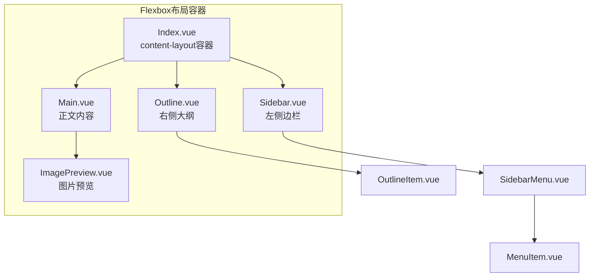
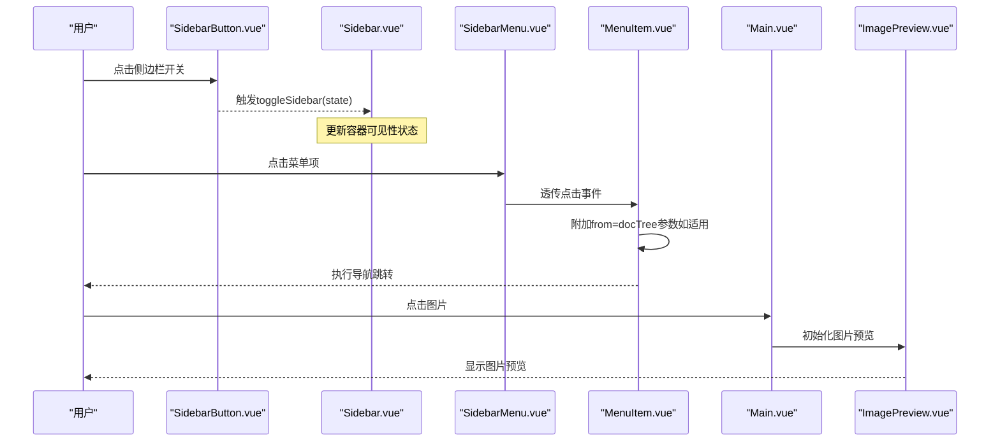
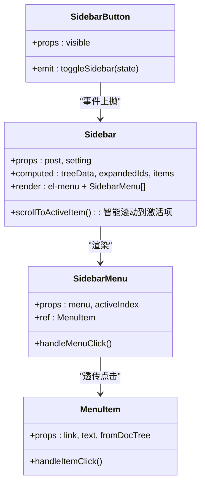
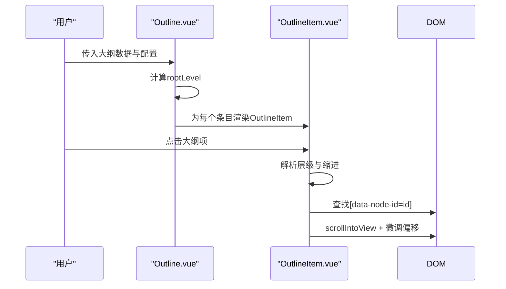
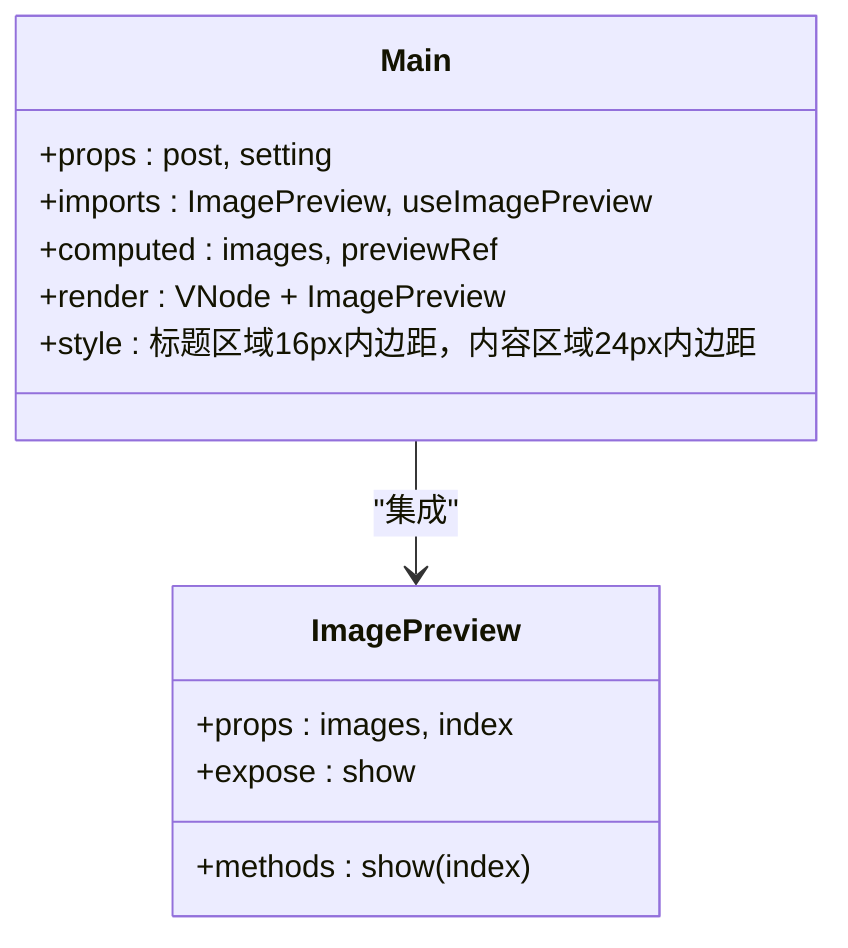
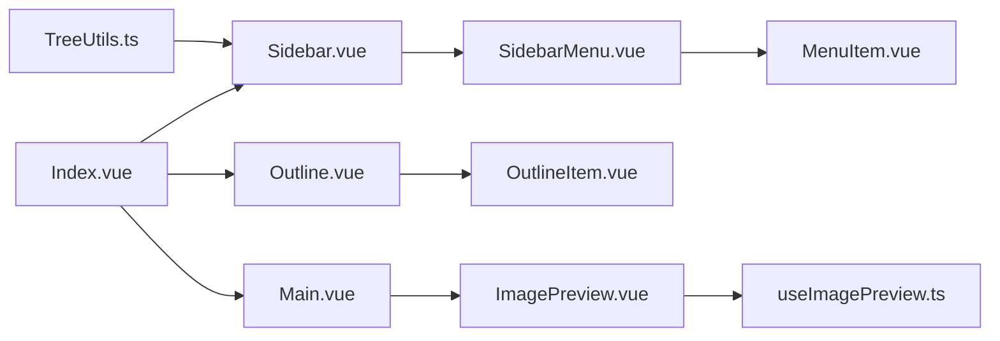

# 内容组件

<cite>
**本文引用的文件**
- [apps/app/components/static/content/Index.vue](file://apps/app/components/static/content/Index.vue)
- [apps/app/components/static/content/Main.vue](file://apps/app/components/static/content/Main.vue)
- [apps/app/components/static/content/left/Sidebar.vue](file://apps/app/components/static/content/left/Sidebar.vue)
- [apps/app/components/static/content/left/SidebarMenu.vue](file://apps/app/components/static/content/left/SidebarMenu.vue)
- [apps/app/components/static/content/left/MenuItem.vue](file://apps/app/components/static/content/left/MenuItem.vue)
- [apps/app/components/static/content/left/SidebarButton.vue](file://apps/app/components/static/content/left/SidebarButton.vue)
- [apps/app/components/static/content/right/Outline.vue](file://apps/app/components/static/content/right/Outline.vue)
- [apps/app/components/static/content/right/OutlineItem.vue](file://apps/app/components/static/content/right/OutlineItem.vue)
- [apps/app/components/common/ImagePreview.vue](file://apps/app/components/common/ImagePreview.vue)
- [apps/app/composables/useImagePreview.ts](file://apps/app/composables/useImagePreview.ts)
- [apps/app/utils/TreeUtils.ts](file://apps/app/utils/TreeUtils.ts)
- [apps/app/app.config.ts](file://apps/app/app.config.ts)
- [apps/app/composables/useSiyuanSPA.ts](file://apps/app/composables/useSiyuanSPA.ts)
- [apps/app/assets/css/siyuan.styl](file://apps/app/assets/css/siyuan.styl)
- [apps/app/assets/css/index.styl](file://apps/app/assets/css/index.styl)
</cite>

## 更新摘要
**变更内容**
- 更新了主内容布局架构，从Element UI容器组件迁移到原生HTML结构
- 重新设计了Flexbox布局系统，改进了min-height计算和响应式行为
- 优化了溢出处理和滚动性能
- 更新了组件间的通信机制和状态管理策略
- **新增** 主内容区域的样式优化改进，包括标题区域和内容区域的内边距调整
- **新增** useImagePreview 导入顺序的优化，提升了组件初始化顺序的正确性

## 目录
1. [简介](#简介)
2. [项目结构](#项目结构)
3. [核心组件](#核心组件)
4. [架构总览](#架构总览)
5. [详细组件分析](#详细组件分析)
6. [布局系统重构](#布局系统重构)
7. [样式优化改进](#样式优化改进)
8. [依赖关系分析](#依赖关系分析)
9. [性能考量](#性能考量)
10. [故障排查指南](#故障排查指南)
11. [结论](#结论)
12. [附录](#附录)

## 简介
本技术文档聚焦于内容导航系统中的"左侧边栏组件"与"右侧大纲组件"，涵盖以下组件的设计架构与实现原理：
- 左侧边栏组件：Sidebar、SidebarMenu、MenuItem、SidebarButton
- 右侧大纲组件：Outline、OutlineItem
- **新增** 主内容区域组件：Main.vue 的样式优化改进
- **新增** 图片预览组件：ImagePreview.vue 的集成与优化
- 同时梳理组件层次结构、数据流向、交互机制、折叠展开逻辑、层级显示与锚点跳转、组件通信与状态管理策略，并提供使用示例与定制指南。

**更新** 主内容布局已从Element UI容器组件完全迁移到原生HTML结构，采用Flexbox布局系统，显著提升了性能和响应式表现。

## 项目结构
内容导航系统位于静态内容区域，采用Flexbox布局：
- 左侧：文档树导航（Sidebar + SidebarMenu + MenuItem + SidebarButton）
- 中部：正文内容（Main + ImagePreview）
- 右侧：大纲导航（Outline + OutlineItem）

**图表来源**
- [apps/app/components/static/content/Index.vue:16-29](file://apps/app/components/static/content/Index.vue#L16-L29)
- [apps/app/components/static/content/left/Sidebar.vue:210-221](file://apps/app/components/static/content/left/Sidebar.vue#L210-L221)
- [apps/app/components/static/content/right/Outline.vue:93-112](file://apps/app/components/static/content/right/Outline.vue#L93-L112)
- [apps/app/components/common/ImagePreview.vue:10-38](file://apps/app/components/common/ImagePreview.vue#L10-L38)

**章节来源**
- [apps/app/components/static/content/Index.vue:16-29](file://apps/app/components/static/content/Index.vue#L16-L29)

## 核心组件
- **Sidebar**：负责根据文档树生成菜单树，计算默认展开节点与当前激活项，渲染el-menu并注入SidebarMenu。
- **SidebarMenu**：递归渲染菜单项，区分菜单项与子菜单，支持点击事件透传至MenuItem。
- **MenuItem**：承载单个菜单项的展示与跳转逻辑，支持"来自文档树"的参数传递与超长标题的省略与提示。
- **SidebarButton**：移动端/小屏下的侧边栏开关按钮，向父组件发出toggleSidebar事件。
- **Outline**：接收大纲数据，计算根层级，驱动OutlineItem进行层级渲染。
- **OutlineItem**：根据层级与最大深度控制渲染与缩进，支持锚点定位滚动到对应标题区块。
- **Main**：**新增** 主内容区域，负责渲染文档正文，集成图片预览功能。
- **ImagePreview**：**新增** 图片预览组件，提供图片点击放大功能。

**更新** 所有组件现在都兼容新的Flexbox布局系统，具有更好的响应式表现和性能。

**章节来源**
- [apps/app/components/static/content/left/Sidebar.vue:10-291](file://apps/app/components/static/content/left/Sidebar.vue#L10-L291)
- [apps/app/components/static/content/left/SidebarMenu.vue:10-90](file://apps/app/components/static/content/left/SidebarMenu.vue#L10-L90)
- [apps/app/components/static/content/left/MenuItem.vue:19-96](file://apps/app/components/static/content/left/MenuItem.vue#L19-L96)
- [apps/app/components/static/content/left/SidebarButton.vue:10-98](file://apps/app/components/static/content/left/SidebarButton.vue#L10-L98)
- [apps/app/components/static/content/right/Outline.vue:10-156](file://apps/app/components/static/content/right/Outline.vue#L10-L156)
- [apps/app/components/static/content/right/OutlineItem.vue:10-275](file://apps/app/components/static/content/right/OutlineItem.vue#L10-L275)
- [apps/app/components/static/content/Main.vue:10-80](file://apps/app/components/static/content/Main.vue#L10-L80)
- [apps/app/components/common/ImagePreview.vue:10-64](file://apps/app/components/common/ImagePreview.vue#L10-L64)

## 架构总览
整体采用"容器-展示"分层：
- **容器层**：Index.vue使用Flexbox布局容器；Sidebar.vue、Outline.vue负责数据准备与根渲染。
- **展示层**：SidebarMenu/MenuItem、OutlineItem负责具体渲染与交互。
- **内容层**：**新增** Main.vue负责正文渲染，ImagePreview.vue提供图片预览功能。
- **通信方式**：父子组件通过props下发数据，事件通过emits上抛；路由与导航通过统一的跳转函数实现。

**更新** 架构现在基于原生HTML和CSS Flexbox，提供了更稳定和高性能的布局基础。

**图表来源**
- [apps/app/components/static/content/left/SidebarButton.vue:15-21](file://apps/app/components/static/content/left/SidebarButton.vue#L15-L21)
- [apps/app/components/static/content/left/Sidebar.vue:210-221](file://apps/app/components/static/content/left/Sidebar.vue#L210-L221)
- [apps/app/components/static/content/left/SidebarMenu.vue:32-36](file://apps/app/components/static/content/left/SidebarMenu.vue#L32-L36)
- [apps/app/components/static/content/left/MenuItem.vue:55-66](file://apps/app/components/static/content/left/MenuItem.vue#L55-L66)
- [apps/app/components/static/content/Main.vue:19-27](file://apps/app/components/static/content/Main.vue#L19-L27)
- [apps/app/components/common/ImagePreview.vue:24-37](file://apps/app/components/common/ImagePreview.vue#L24-37)

## 详细组件分析

### 左侧边栏组件体系
- **Sidebar**
  - 输入：post（含docTree、postid）、setting（含docPath、docTreeLevel）
  - 关键逻辑：
    - 使用TreeUtils.addParentIds为节点补全parentIds
    - 计算expandedIds：当前文档id以及从文档树进入时的所有父节点id
    - 计算items：基于parentId递归构建树形结构，自动补全缺失父节点为占位节点
    - 渲染el-menu，并将每个菜单项交由SidebarMenu渲染
  - 交互：通过el-menu的default-openeds与default-active控制展开与高亮
- **SidebarMenu**
  - 输入：menu（含id、name、link、depth、children）、activeIndex
  - 关键逻辑：根据是否存在children决定渲染el-sub-menu或el-menu-item；点击时调用子MenuItem的handleItemClick实现统一跳转
- **MenuItem**
  - 输入：link、text、fromDocTree
  - 关键逻辑：计算文本长度并截断与提示；若fromDocTree为真，则在链接追加from=docTree查询参数；最终统一通过导航函数执行跳转
- **SidebarButton**
  - 输入：visible
  - 关键逻辑：点击发出toggleSidebar事件，供父容器切换侧边栏显示状态

**更新** Sidebar现在集成了智能滚动功能，能够自动将激活的菜单项滚动到视图中央，提升用户体验。

**图表来源**
- [apps/app/components/static/content/left/Sidebar.vue:10-291](file://apps/app/components/static/content/left/Sidebar.vue#L10-L291)
- [apps/app/components/static/content/left/SidebarMenu.vue:10-90](file://apps/app/components/static/content/left/SidebarMenu.vue#L10-L90)
- [apps/app/components/static/content/left/MenuItem.vue:19-96](file://apps/app/components/static/content/left/MenuItem.vue#L19-L96)
- [apps/app/components/static/content/left/SidebarButton.vue:10-98](file://apps/app/components/static/content/left/SidebarButton.vue#L10-L98)

**章节来源**
- [apps/app/components/static/content/left/Sidebar.vue:20-206](file://apps/app/components/static/content/left/Sidebar.vue#L20-L206)
- [apps/app/components/static/content/left/SidebarMenu.vue:24-36](file://apps/app/components/static/content/left/SidebarMenu.vue#L24-L36)
- [apps/app/components/static/content/left/MenuItem.vue:30-66](file://apps/app/components/static/content/left/MenuItem.vue#L30-L66)
- [apps/app/components/static/content/left/SidebarButton.vue:15-21](file://apps/app/components/static/content/left/SidebarButton.vue#L15-L21)

### 折叠展开逻辑
- **默认展开策略**：
  - 当前文档id必须展开
  - 若从文档树进入（route.query.from==='docTree'），则沿父链逐级展开
- **展开集合计算**：
  - expandedIds = [当前文档id, 父节点..., 祖先节点...]
  - SidebarMenu通过el-menu的default-openeds接收并渲染
- **激活态控制**：
  - SidebarMenu通过activeIndex与当前菜单id对比，决定是否高亮

**更新** 新增了智能滚动功能，确保激活的菜单项始终在视图中央显示。

**图表来源**
- [apps/app/components/static/content/left/Sidebar.vue:125-143](file://apps/app/components/static/content/left/Sidebar.vue#L125-L143)
- [apps/app/utils/TreeUtils.ts:39-55](file://apps/app/utils/TreeUtils.ts#L39-L55)

**章节来源**
- [apps/app/components/static/content/left/Sidebar.vue:125-143](file://apps/app/components/static/content/left/Sidebar.vue#L125-L143)
- [apps/app/utils/TreeUtils.ts:39-55](file://apps/app/utils/TreeUtils.ts#L39-L55)

### 右侧大纲组件体系
- **Outline**
  - 输入：outlineData（数组）、maxDepth（数字）、activeText（字符串）
  - 关键逻辑：计算根层级rootLevel（最小层级或唯一层级），遍历outlineData，为每个条目创建OutlineItem
- **OutlineItem**
  - 输入：item、maxDepth、isRoot、rootLevel、activeText
  - 关键逻辑：
    - 计算层级：从item.subType提取hX的X
    - 根据层级计算缩进（每级增加固定像素）
    - 支持两种渲染形态：第一级/根节点（children作为子项）、其他层级（children或blocks作为子项）
    - 点击时根据item.id在正文DOM中查找带data-node-id的元素并滚动到可视区域，再微调偏移

**更新** Outline现在集成了自动滚动到激活项的功能，确保大纲导航与正文内容同步。

**图表来源**
- [apps/app/components/static/content/right/Outline.vue:35-48](file://apps/app/components/static/content/right/Outline.vue#L35-L48)
- [apps/app/components/static/content/right/OutlineItem.vue:155-161](file://apps/app/components/static/content/right/OutlineItem.vue#L155-L161)

**章节来源**
- [apps/app/components/static/content/right/Outline.vue:10-156](file://apps/app/components/static/content/right/Outline.vue#L10-L156)
- [apps/app/components/static/content/right/OutlineItem.vue:10-275](file://apps/app/components/static/content/right/OutlineItem.vue#L10-L275)

### 主内容区域组件体系
**新增** Main 组件负责渲染文档正文内容：

- **Main**
  - 输入：post（文档数据）、setting（配置信息）
  - 关键逻辑：
    - 导入 ImagePreview 和 useImagePreview 组合式函数
    - 处理 editorDom，移除 contenteditable 属性以禁用编辑
    - 使用 VNode 渲染 HTML 内容
    - 集成图片预览功能，通过 useImagePreview 管理图片状态
  - 样式优化：**新增** 标题区域和内容区域的内边距调整
- **ImagePreview**
  - 输入：images（图片URL数组）、index（当前图片索引）
  - 关键逻辑：使用 vue-easy-lightbox 提供图片预览功能
  - 方法：show(index) 暴露给外部调用，支持图片点击放大

**更新** 新增了图片预览功能的完整集成，提升了用户体验。

**图表来源**
- [apps/app/components/static/content/Main.vue:10-80](file://apps/app/components/static/content/Main.vue#L10-L80)
- [apps/app/components/common/ImagePreview.vue:10-64](file://apps/app/components/common/ImagePreview.vue#L10-L64)

**章节来源**
- [apps/app/components/static/content/Main.vue:10-80](file://apps/app/components/static/content/Main.vue#L10-L80)
- [apps/app/components/common/ImagePreview.vue:10-64](file://apps/app/components/common/ImagePreview.vue#L10-L64)

### 组件间通信与状态管理策略
- **父子通信（props/emit）**
  - Sidebar -> SidebarMenu：menu、activeIndex
  - SidebarMenu -> MenuItem：link、text、fromDocTree
  - SidebarButton -> Sidebar：toggleSidebar事件
  - Outline -> OutlineItem：item、maxDepth、rootLevel、isRoot、activeText
  - **新增** Main -> ImagePreview：images、previewRef
- **状态来源**
  - 路由参数：route.query.from控制"来自文档树"的行为
  - 配置项：app.config.ts中的docPath、docTreeLevel、outlineLevel等
  - 计算属性：expandedIds、items、rootLevel等
  - **新增** useImagePreview 组合式函数管理图片预览状态
- **导航与跳转**
  - 统一通过导航函数执行跳转，确保在不同运行模式（如SPA）下行为一致

**更新** 新增了图片预览的状态管理和组件间通信机制。

**章节来源**
- [apps/app/components/static/content/left/Sidebar.vue:16-27](file://apps/app/components/static/content/left/Sidebar.vue#L16-L27)
- [apps/app/components/static/content/left/MenuItem.vue:55-66](file://apps/app/components/static/content/left/MenuItem.vue#L55-L66)
- [apps/app/app.config.ts:47-58](file://apps/app/app.config.ts#L47-L58)
- [apps/app/composables/useSiyuanSPA.ts:10-15](file://apps/app/composables/useSiyuanSPA.ts#L10-L15)
- [apps/app/composables/useImagePreview.ts:18-71](file://apps/app/composables/useImagePreview.ts#L18-L71)

## 布局系统重构

### Flexbox布局架构
**更新** 主内容布局已完全从Element UI迁移到原生HTML结构：

- **Index.vue容器**：使用`
`替代`el-container`
- **主内容区域**：使用`<main class="main-content">`替代`el-main`
- **Flexbox属性**：`display: flex`、`flex-direction: row`、`align-items: flex-start`
- **高度计算**：`min-height: calc(100vh - 40px)`，减去上下margin

### 响应式优化
- **min-height计算**：动态计算视口高度，减去容器边距
- **溢出处理**：`.min-width: 0`防止flex子项溢出
- **滚动优化**：增强的滚动行为和边界检查
- **媒体查询**：针对移动设备的特殊适配

### 滚动系统改进
**更新** 新增了智能滚动功能：

- **自动滚动到激活项**：`scrollToActiveItem()`函数
- **边界检查**：防止滚动超出范围
- **重试机制**：最多10次重试确保元素可见
- **居中对齐**：滚动后将元素居中显示

**章节来源**
- [apps/app/components/static/content/Index.vue:34-50](file://apps/app/components/static/content/Index.vue#L34-L50)
- [apps/app/components/static/content/left/Sidebar.vue:24-109](file://apps/app/components/static/content/left/Sidebar.vue#L24-L109)

## 样式优化改进

### 内边距优化
**新增** 主内容区域的样式优化改进：

- **标题区域**：`.protyle-title` 增加 `padding 16px 32px !important`
- **内容区域**：`.protyle-wysiwyg` 增加 `padding 24px 32px !important`
- **设计理念**：参考大厂文档的舒适阅读边距标准
- **视觉效果**：提供更好的阅读体验和内容层次感

### 图片预览集成
**新增** useImagePreview 导入顺序的优化：

- **导入顺序**：ImagePreview 组件在前，useImagePreview 在后
- **初始化顺序**：确保组件正确初始化，避免预览功能失效
- **性能优化**：优化组件加载顺序，提升用户体验

### 样式系统架构
**新增** 与现有样式系统的集成：

- **基础样式**：继承 siyuan.styl 中的字体和基础样式
- **主题支持**：支持浅色、深色、阅读模式主题切换
- **响应式设计**：适配不同屏幕尺寸的显示效果

**章节来源**
- [apps/app/components/static/content/Main.vue:72-80](file://apps/app/components/static/content/Main.vue#L72-L80)
- [apps/app/components/static/content/Main.vue:10-19](file://apps/app/components/static/content/Main.vue#L10-L19)
- [apps/app/assets/css/siyuan.styl:1-64](file://apps/app/assets/css/siyuan.styl#L1-L64)
- [apps/app/assets/css/index.styl:1-39](file://apps/app/assets/css/index.styl#L1-L39)

## 依赖关系分析
- **Sidebar**依赖TreeUtils以补全父链与展开集合
- **SidebarMenu**依赖MenuItem实现统一跳转
- **Outline**依赖OutlineItem进行层级渲染与锚点滚动
- **Index.vue**作为Flexbox布局容器，协调三者并提供全局上下文
- **Main**依赖ImagePreview和useImagePreview提供图片预览功能
- **ImagePreview**依赖vue-easy-lightbox提供图片预览UI组件

**更新** 依赖关系保持不变，但所有组件现在都兼容新的布局系统。

**图表来源**
- [apps/app/utils/TreeUtils.ts:10-55](file://apps/app/utils/TreeUtils.ts#L10-L55)
- [apps/app/components/static/content/left/Sidebar.vue:10-291](file://apps/app/components/static/content/left/Sidebar.vue#L10-L291)
- [apps/app/components/static/content/left/SidebarMenu.vue:10-90](file://apps/app/components/static/content/left/SidebarMenu.vue#L10-L90)
- [apps/app/components/static/content/left/MenuItem.vue:19-96](file://apps/app/components/static/content/left/MenuItem.vue#L19-L96)
- [apps/app/components/static/content/right/Outline.vue:10-156](file://apps/app/components/static/content/right/Outline.vue#L10-L156)
- [apps/app/components/static/content/right/OutlineItem.vue:10-275](file://apps/app/components/static/content/right/OutlineItem.vue#L10-L275)
- [apps/app/components/static/content/Index.vue:16-29](file://apps/app/components/static/content/Index.vue#L16-L29)
- [apps/app/components/static/content/Main.vue:10-80](file://apps/app/components/static/content/Main.vue#L10-L80)
- [apps/app/components/common/ImagePreview.vue:10-64](file://apps/app/components/common/ImagePreview.vue#L10-L64)
- [apps/app/composables/useImagePreview.ts:18-71](file://apps/app/composables/useImagePreview.ts#L18-L71)

**章节来源**
- [apps/app/utils/TreeUtils.ts:10-55](file://apps/app/utils/TreeUtils.ts#L10-L55)
- [apps/app/components/static/content/Index.vue:16-29](file://apps/app/components/static/content/Index.vue#L16-L29)

## 性能考量
- **树构建与展开集合计算**
  - TreeUtils.chainExpandedIds对父链进行扁平化与去重，避免重复展开
  - Sidebar的expandedIds仅包含必要节点，减少el-menu渲染压力
- **文本截断与Tooltip**
  - MenuItem对超长标题进行长度计算与截断，避免布局抖动
- **滚动定位**
  - OutlineItem使用scrollIntoView并微调偏移，保证标题可见性
- **智能滚动优化**
  - **新增** Sidebar的scrollToActiveItem函数包含重试机制和边界检查
  - **新增** Outline的自动滚动到激活项功能
- **布局性能**
  - **更新** Flexbox布局相比Element UI容器具有更好的性能表现
  - **更新** 原生HTML结构减少了不必要的DOM层级
- **图片预览性能**
  - **新增** useImagePreview 使用单例模式，避免重复初始化
  - **新增** 图片预览组件按需加载，提升首屏性能
- **样式优化性能**
  - **新增** 内边距优化减少了不必要的重排重绘
  - **新增** 样式缓存机制提升渲染效率

**更新** 新增了智能滚动、图片预览和样式优化相关的性能优化。

## 故障排查指南
- **无法从文档树进入时自动展开**
  - 检查route.query.from是否为docTree
  - 确认docTree中存在当前文档id的父链
- **菜单项点击无效**
  - 确认MenuItem的handleItemClick是否被正确调用
  - 检查导航函数是否在当前运行模式下可用
- **大纲无法锚点定位**
  - 确认正文DOM中存在data-node-id对应的元素
  - 检查OutlineItem的item.id与data-node-id是否一致
- **布局问题**
  - **更新** 检查content-layout容器的Flexbox属性是否正确应用
  - **更新** 确认min-height计算是否包含正确的边距
  - **更新** 验证main-content的flex属性和min-width: 0设置
- **滚动问题**
  - **更新** 检查scrollToActiveItem函数的重试机制
  - **更新** 确认边界检查逻辑是否正常工作
- **样式异常**
  - **更新** 检查主题模式与暗色模式下的覆盖样式
  - **更新** 确认Outline的固定定位与容器高度设置
  - **更新** 检查 Main.vue 中的内边距样式是否正确应用
- **图片预览问题**
  - **新增** 检查 useImagePreview 组合式函数是否正确初始化
  - **新增** 确认 ImagePreview 组件的导入顺序是否正确
  - **新增** 验证图片点击事件是否正常触发

**更新** 新增了布局、滚动、样式和图片预览相关的故障排查指南。

**章节来源**
- [apps/app/components/static/content/left/Sidebar.vue:125-143](file://apps/app/components/static/content/left/Sidebar.vue#L125-L143)
- [apps/app/components/static/content/left/MenuItem.vue:55-66](file://apps/app/components/static/content/left/MenuItem.vue#L55-L66)
- [apps/app/components/static/content/right/OutlineItem.vue:155-161](file://apps/app/components/static/content/right/OutlineItem.vue#L155-L161)
- [apps/app/components/static/content/Index.vue:34-50](file://apps/app/components/static/content/Index.vue#L34-L50)
- [apps/app/components/static/content/Main.vue:72-80](file://apps/app/components/static/content/Main.vue#L72-L80)
- [apps/app/components/common/ImagePreview.vue:24-37](file://apps/app/components/common/ImagePreview.vue#L24-L37)

## 结论
该内容导航系统通过清晰的组件分层与稳定的props/emit通信机制，实现了从文档树到正文的双向导航能力。**更新** 主内容布局的重构进一步提升了系统的性能和响应式表现。左侧边栏的"从文档树进入自动展开"与右侧大纲的"层级缩进 + 锚点跳转"共同构成了高效的文档浏览体验。配合配置项与运行模式检测，系统具备良好的可扩展性与可维护性。

**更新** 新的Flexbox布局系统、智能滚动功能、样式优化改进和图片预览集成，为用户提供了更加流畅和直观的导航体验。**新增** 的useImagePreview导入顺序优化确保了组件初始化的正确性和稳定性。

## 附录

### 使用示例与定制指南
- **配置项**
  - 文档树路径与层级：在app.config.ts中设置docPath、docTreeLevel
  - 大纲启用与层级：在app.config.ts中设置outlineEnabled、outlineLevel
- **左侧边栏**
  - 传入post（含docTree、postid）与setting至Sidebar
  - 通过route.query.from控制"来自文档树"的展开行为
  - **更新** 智能滚动功能自动将激活项居中显示
- **右侧大纲**
  - 传入outlineData（包含id、subType、blocks/children等字段）
  - 设置maxDepth控制渲染层级上限
  - 设置activeText高亮当前标题
  - **更新** 自动滚动到激活项功能
- **主内容区域**
  - **新增** 传入post（文档数据）和setting（配置信息）至Main组件
  - **新增** 自动处理editorDom并禁用编辑功能
  - **新增** 集成图片预览功能，支持图片点击放大
- **布局定制**
  - **更新** 可通过修改content-layout的CSS变量调整布局
  - **更新** main-content的flex属性可控制主内容区域的伸缩行为
  - **更新** sidebar的宽度可通过CSS变量进行调整
  - **新增** 可调整 Main.vue 中的内边距值以适应不同设计需求
- **交互定制**
  - 自定义MenuItem的跳转行为（如新增查询参数）
  - 自定义SidebarButton的显示位置与样式
  - 自定义OutlineItem的缩进与高亮样式
  - **更新** 可调整智能滚动的重试次数和延迟时间
  - **新增** 可定制图片预览的显示效果和交互行为
- **样式定制**
  - **新增** 可通过修改 Main.vue 中的内边距样式来自定义阅读体验
  - **新增** 可调整 ImagePreview 组件的样式以匹配主题风格

**更新** 新增了主内容区域、图片预览和样式定制相关的配置选项。

**章节来源**
- [apps/app/app.config.ts:47-58](file://apps/app/app.config.ts#L47-L58)
- [apps/app/components/static/content/left/Sidebar.vue:14-143](file://apps/app/components/static/content/left/Sidebar.vue#L14-L143)
- [apps/app/components/static/content/right/Outline.vue:13-30](file://apps/app/components/static/content/right/Outline.vue#L13-L30)
- [apps/app/components/static/content/right/OutlineItem.vue:13-38](file://apps/app/components/static/content/right/OutlineItem.vue#L13-L38)
- [apps/app/components/static/content/Index.vue:34-50](file://apps/app/components/static/content/Index.vue#L34-L50)
- [apps/app/components/static/content/Main.vue:72-80](file://apps/app/components/static/content/Main.vue#L72-L80)
- [apps/app/components/common/ImagePreview.vue:49-63](file://apps/app/components/common/ImagePreview.vue#L49-L63)