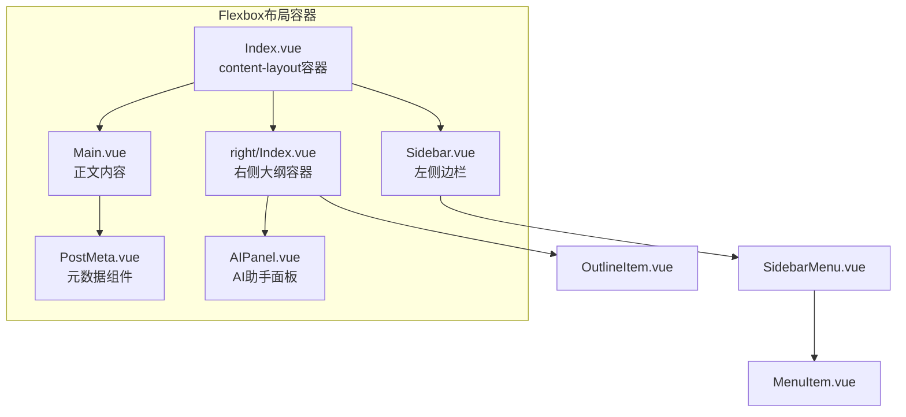
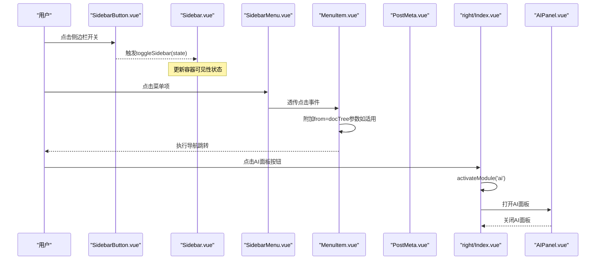
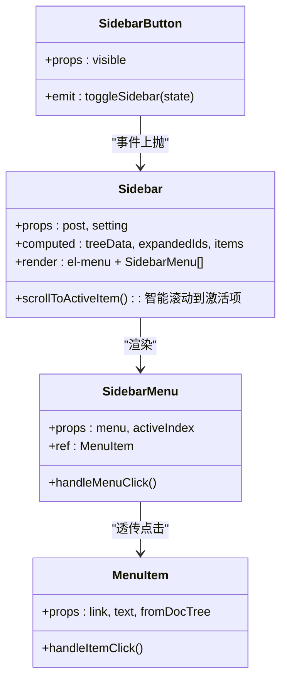
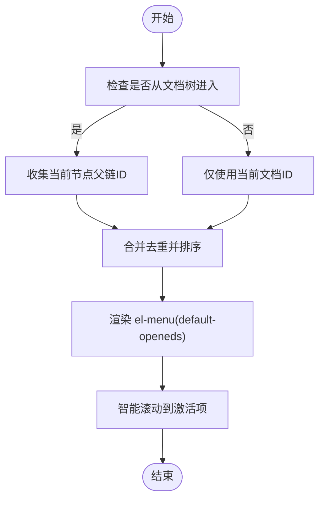
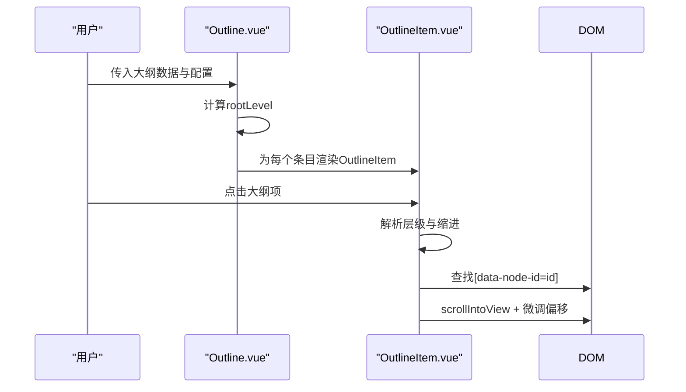
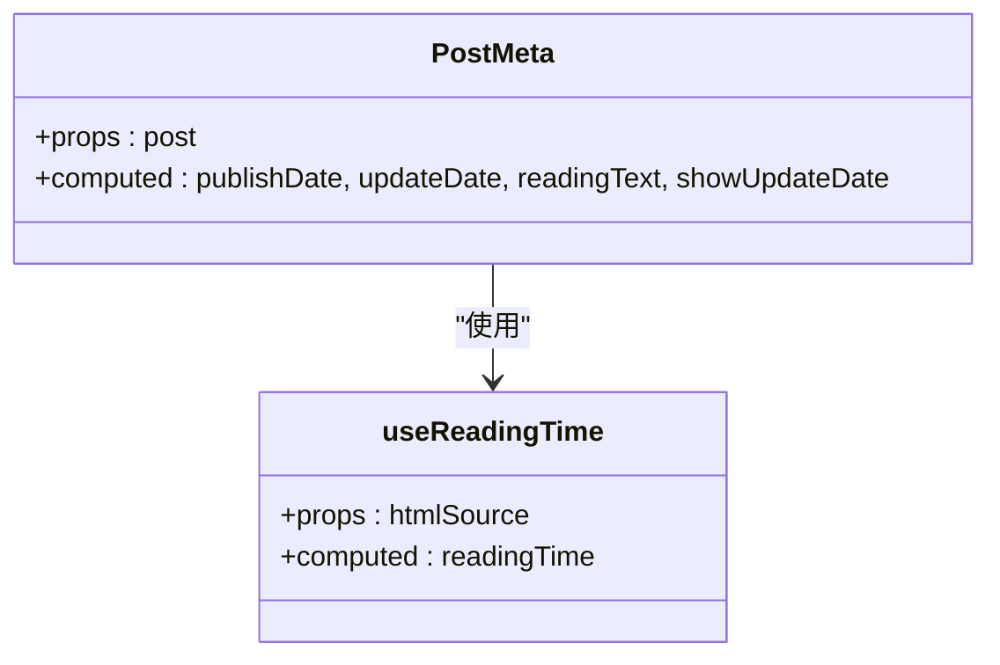
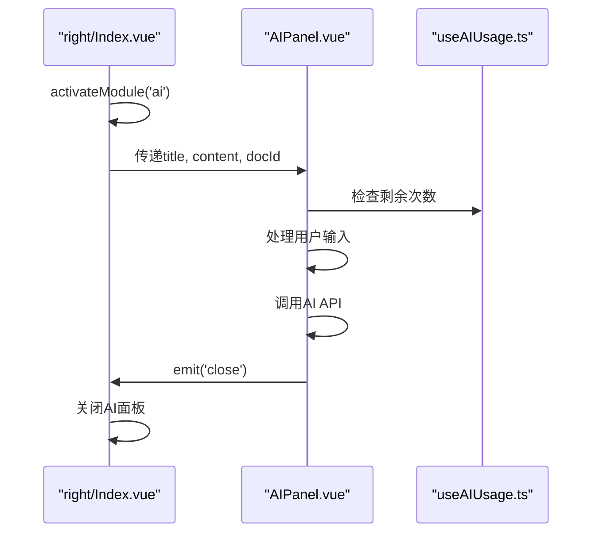
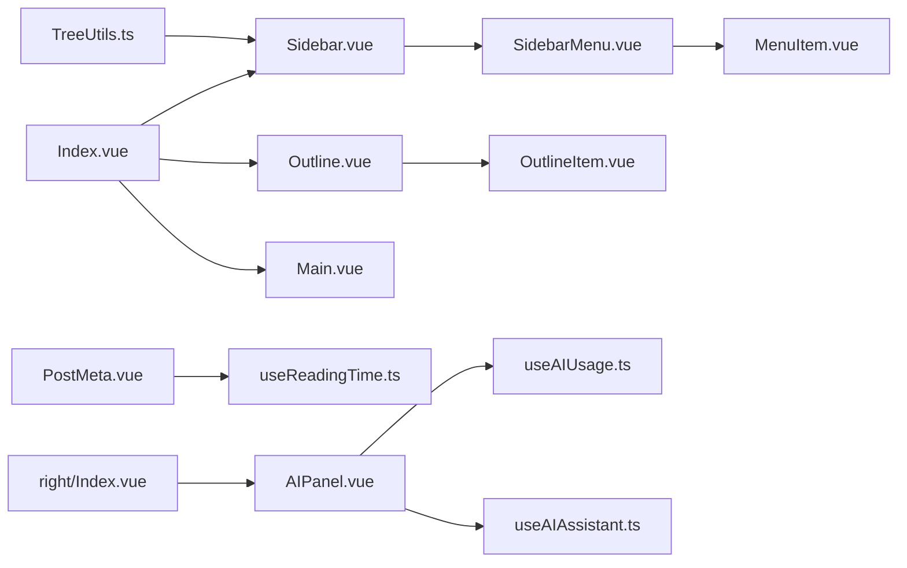

# 内容组件

<cite>
**本文引用的文件**
- [apps/app/components/static/content/Index.vue](file://apps/app/components/static/content/Index.vue)
- [apps/app/components/static/content/Main.vue](file://apps/app/components/static/content/Main.vue)
- [apps/app/components/static/content/left/Sidebar.vue](file://apps/app/components/static/content/left/Sidebar.vue)
- [apps/app/components/static/content/left/SidebarMenu.vue](file://apps/app/components/static/content/left/SidebarMenu.vue)
- [apps/app/components/static/content/left/MenuItem.vue](file://apps/app/components/static/content/left/MenuItem.vue)
- [apps/app/components/static/content/left/SidebarButton.vue](file://apps/app/components/static/content/left/SidebarButton.vue)
- [apps/app/components/static/content/right/Index.vue](file://apps/app/components/static/content/right/Index.vue)
- [apps/app/components/static/content/right/Outline.vue](file://apps/app/components/static/content/right/Outline.vue)
- [apps/app/components/static/content/right/OutlineItem.vue](file://apps/app/components/static/content/right/OutlineItem.vue)
- [apps/app/components/static/content/PostMeta.vue](file://apps/app/components/static/content/PostMeta.vue)
- [apps/app/components/ai-assistant/AIPanel.vue](file://apps/app/components/ai-assistant/AIPanel.vue)
- [apps/app/composables/useReadingTime.ts](file://apps/app/composables/useReadingTime.ts)
- [apps/app/composables/useAIAssistant.ts](file://apps/app/composables/useAIAssistant.ts)
- [apps/app/composables/useAIUsage.ts](file://apps/app/composables/useAIUsage.ts)
- [apps/app/app.config.ts](file://apps/app/app.config.ts)
- [apps/app/composables/useSiyuanSPA.ts](file://apps/app/composables/useSiyuanSPA.ts)
</cite>

## 更新摘要
**变更内容**
- PostMeta组件已简化为仅显示元信息，移除了AI功能入口
- AI功能完全集成到侧边栏模块中，通过右侧大纲组件的AI面板实现
- 更新了组件间的通信机制，从PostMeta直接触发AI改为通过侧边栏模块控制
- 重新设计了AI助手的集成架构，提供更统一的用户体验

## 目录
1. [简介](#简介)
2. [项目结构](#项目结构)
3. [核心组件](#核心组件)
4. [架构总览](#架构总览)
5. [详细组件分析](#详细组件分析)
6. [PostMeta元数据组件](#postmeta元数据组件)
7. [AI助手集成](#ai助手集成)
8. [阅读时间计算](#阅读时间计算)
9. [布局系统重构](#布局系统重构)
10. [依赖关系分析](#依赖关系分析)
11. [性能考量](#性能考量)
12. [故障排查指南](#故障排查指南)
13. [结论](#结论)
14. [附录](#附录)

## 简介
本技术文档聚焦于内容导航系统中的"左侧边栏组件"与"右侧大纲组件"，涵盖以下组件的设计架构与实现原理：
- 左侧边栏组件：Sidebar、SidebarMenu、MenuItem、SidebarButton
- 右侧大纲组件：Outline、OutlineItem
- **更新** 元数据组件：PostMeta（现已简化为仅显示元信息）
- **更新** AI助手功能：已完全集成到侧边栏模块中，通过右侧大纲组件的AI面板提供统一的聊天界面

**更新** 主内容布局已从Element UI容器组件完全迁移到原生HTML结构，采用Flexbox布局系统，显著提升了性能和响应式表现。PostMeta组件现在专注于文档元信息显示，AI助手功能通过侧边栏模块提供统一的用户体验。

## 项目结构
内容导航系统位于静态内容区域，采用Flexbox布局：
- 左侧：文档树导航（Sidebar + SidebarMenu + MenuItem + SidebarButton）
- 中部：正文内容（Main + PostMeta）
- 右侧：大纲导航（Outline + OutlineItem，现包含AI面板）

**图表来源**
- [apps/app/components/static/content/Index.vue:16-29](file://apps/app/components/static/content/Index.vue#L16-L29)
- [apps/app/components/static/content/left/Sidebar.vue:210-221](file://apps/app/components/static/content/left/Sidebar.vue#L210-L221)
- [apps/app/components/static/content/right/Index.vue:372-425](file://apps/app/components/static/content/right/Index.vue#L372-L425)
- [apps/app/components/static/content/PostMeta.vue:1-192](file://apps/app/components/static/content/PostMeta.vue#L1-L192)
- [apps/app/components/ai-assistant/AIPanel.vue:1-200](file://apps/app/components/ai-assistant/AIPanel.vue#L1-L200)

**章节来源**
- [apps/app/components/static/content/Index.vue:16-29](file://apps/app/components/static/content/Index.vue#L16-L29)

## 核心组件
- **Sidebar**：负责根据文档树生成菜单树，计算默认展开节点与当前激活项，渲染el-menu并注入SidebarMenu。
- **SidebarMenu**：递归渲染菜单项，区分菜单项与子菜单，支持点击事件透传至MenuItem。
- **MenuItem**：承载单个菜单项的展示与跳转逻辑，支持"来自文档树"的参数传递与超长标题的省略与提示。
- **SidebarButton**：移动端/小屏下的侧边栏开关按钮，向父组件发出toggleSidebar事件。
- **Outline**：接收大纲数据，计算根层级，驱动OutlineItem进行层级渲染。
- **OutlineItem**：根据层级与最大深度控制渲染与缩进，支持锚点定位滚动到对应标题区块。
- **PostMeta**：**更新** 现已简化为仅显示文档元信息，包括发布/更新日期和阅读时间计算。
- **AIPanel**：**更新** AI助手面板组件，提供统一的聊天界面和AI功能操作，集成在右侧大纲容器中。

**更新** 所有组件现在都兼容新的Flexbox布局系统，具有更好的响应式表现和性能。PostMeta组件专注于元信息显示，AI助手功能通过侧边栏模块提供统一的用户体验。

**章节来源**
- [apps/app/components/static/content/left/Sidebar.vue:10-289](file://apps/app/components/static/content/left/Sidebar.vue#L10-L289)
- [apps/app/components/static/content/left/SidebarMenu.vue:10-91](file://apps/app/components/static/content/left/SidebarMenu.vue#L10-L91)
- [apps/app/components/static/content/left/MenuItem.vue:1-175](file://apps/app/components/static/content/left/MenuItem.vue#L1-L175)
- [apps/app/components/static/content/left/SidebarButton.vue:10-98](file://apps/app/components/static/content/left/SidebarButton.vue#L10-L98)
- [apps/app/components/static/content/right/Outline.vue:10-156](file://apps/app/components/static/content/right/Outline.vue#L10-L156)
- [apps/app/components/static/content/right/OutlineItem.vue:10-275](file://apps/app/components/static/content/right/OutlineItem.vue#L10-L275)
- [apps/app/components/static/content/PostMeta.vue:1-192](file://apps/app/components/static/content/PostMeta.vue#L1-L192)
- [apps/app/components/ai-assistant/AIPanel.vue:1-200](file://apps/app/components/ai-assistant/AIPanel.vue#L1-L200)

## 架构总览
整体采用"容器-展示"分层：
- **容器层**：Index.vue使用Flexbox布局容器；Sidebar.vue、Outline.vue负责数据准备与根渲染。
- **展示层**：SidebarMenu/MenuItem、OutlineItem负责具体渲染与交互。
- **元数据层**：**更新** PostMeta.vue现在专注于文档元信息显示。
- **AI助手层**：**更新** AIPanel.vue集成在右侧大纲容器中，提供统一的聊天界面和AI功能操作。
- **通信方式**：父子组件通过props下发数据，事件通过emits上抛；路由与导航通过统一的跳转函数实现。

**更新** 架构现在基于原生HTML和CSS Flexbox，提供了更稳定和高性能的布局基础。AI助手功能通过侧边栏模块提供统一的用户体验。

**图表来源**
- [apps/app/components/static/content/left/SidebarButton.vue:15-21](file://apps/app/components/static/content/left/SidebarButton.vue#L15-L21)
- [apps/app/components/static/content/left/Sidebar.vue:210-221](file://apps/app/components/static/content/left/Sidebar.vue#L210-L221)
- [apps/app/components/static/content/left/SidebarMenu.vue:32-36](file://apps/app/components/static/content/left/SidebarMenu.vue#L32-L36)
- [apps/app/components/static/content/left/MenuItem.vue:55-66](file://apps/app/components/static/content/left/MenuItem.vue#L55-L66)
- [apps/app/components/static/content/right/Index.vue:292-304](file://apps/app/components/static/content/right/Index.vue#L292-L304)
- [apps/app/components/ai-assistant/AIPanel.vue:30-32](file://apps/app/components/ai-assistant/AIPanel.vue#L30-L32)

## 详细组件分析

### 左侧边栏组件体系
- **Sidebar**
  - 输入：post（含docTree、postid）、setting（含docPath、docTreeLevel）
  - 关键逻辑：
    - 使用TreeUtils.addParentIds为节点补全parentIds
    - 计算expandedIds：当前文档id以及从文档树进入时的所有父节点id
    - 计算items：基于parentId递归构建树形结构，自动补全缺失父节点为占位节点
    - 渲染el-menu，并将每个菜单项交由SidebarMenu渲染
  - 交互：通过el-menu的default-openeds与default-active控制展开与高亮
- **SidebarMenu**
  - 输入：menu（含id、name、link、depth、children）、activeIndex
  - 关键逻辑：根据是否存在children决定渲染el-sub-menu或el-menu-item；点击时调用子MenuItem的handleItemClick实现统一跳转
- **MenuItem**
  - 输入：link、text、fromDocTree
  - 关键逻辑：计算文本长度并截断与提示；若fromDocTree为真，则在链接追加from=docTree查询参数；最终统一通过导航函数执行跳转
- **SidebarButton**
  - 输入：visible
  - 关键逻辑：点击发出toggleSidebar事件，供父容器切换侧边栏显示状态

**更新** Sidebar现在集成了智能滚动功能，能够自动将激活的菜单项滚动到视图中央，提升用户体验。

**图表来源**
- [apps/app/components/static/content/left/Sidebar.vue:10-289](file://apps/app/components/static/content/left/Sidebar.vue#L10-L289)
- [apps/app/components/static/content/left/SidebarMenu.vue:10-91](file://apps/app/components/static/content/left/SidebarMenu.vue#L10-L91)
- [apps/app/components/static/content/left/MenuItem.vue:1-175](file://apps/app/components/static/content/left/MenuItem.vue#L1-L175)
- [apps/app/components/static/content/left/SidebarButton.vue:10-98](file://apps/app/components/static/content/left/SidebarButton.vue#L10-L98)

**章节来源**
- [apps/app/components/static/content/left/Sidebar.vue:20-206](file://apps/app/components/static/content/left/Sidebar.vue#L20-L206)
- [apps/app/components/static/content/left/SidebarMenu.vue:24-36](file://apps/app/components/static/content/left/SidebarMenu.vue#L24-L36)
- [apps/app/components/static/content/left/MenuItem.vue:30-66](file://apps/app/components/static/content/left/MenuItem.vue#L30-L66)
- [apps/app/components/static/content/left/SidebarButton.vue:15-21](file://apps/app/components/static/content/left/SidebarButton.vue#L15-L21)

### 折叠展开逻辑
- **默认展开策略**：
  - 当前文档id必须展开
  - 若从文档树进入（route.query.from==='docTree'），则沿父链逐级展开
- **展开集合计算**：
  - expandedIds = [当前文档id, 父节点..., 祖先节点...]
  - SidebarMenu通过el-menu的default-openeds接收并渲染
- **激活态控制**：
  - SidebarMenu通过activeIndex与当前菜单id对比，决定是否高亮

**更新** 新增了智能滚动功能，确保激活的菜单项始终在视图中央显示。

**图表来源**
- [apps/app/components/static/content/left/Sidebar.vue:125-143](file://apps/app/components/static/content/left/Sidebar.vue#L125-L143)

**章节来源**
- [apps/app/components/static/content/left/Sidebar.vue:125-143](file://apps/app/components/static/content/left/Sidebar.vue#L125-L143)

### 右侧大纲组件体系
- **Outline**
  - 输入：outlineData（数组）、maxDepth（数字）、activeText（字符串）
  - 关键逻辑：计算根层级rootLevel（最小层级或唯一层级），遍历outlineData，为每个条目创建OutlineItem
- **OutlineItem**
  - 输入：item、maxDepth、isRoot、rootLevel、activeText
  - 关键逻辑：
    - 计算层级：从item.subType提取hX的X
    - 根据层级计算缩进（每级增加固定像素）
    - 支持两种渲染形态：第一级/根节点（children作为子项）、其他层级（children或blocks作为子项）
    - 点击时根据item.id在正文DOM中查找带data-node-id的元素并滚动到可视区域，再微调偏移

**更新** Outline现在集成了自动滚动到激活项的功能，确保大纲导航与正文内容同步。

**图表来源**
- [apps/app/components/static/content/right/Outline.vue:35-48](file://apps/app/components/static/content/right/Outline.vue#L35-L48)
- [apps/app/components/static/content/right/OutlineItem.vue:155-161](file://apps/app/components/static/content/right/OutlineItem.vue#L155-L161)

**章节来源**
- [apps/app/components/static/content/right/Outline.vue:10-156](file://apps/app/components/static/content/right/Outline.vue#L10-L156)
- [apps/app/components/static/content/right/OutlineItem.vue:10-275](file://apps/app/components/static/content/right/OutlineItem.vue#L10-L275)

### 组件间通信与状态管理策略
- **父子通信（props/emit）**
  - Sidebar -> SidebarMenu：menu、activeIndex
  - SidebarMenu -> MenuItem：link、text、fromDocTree
  - SidebarButton -> Sidebar：toggleSidebar事件
  - Outline -> OutlineItem：item、maxDepth、rootLevel、isRoot、activeText
  - **更新** PostMeta -> Main.vue：aiPanelActive状态共享
  - **更新** right/Index.vue -> AIPanel.vue：title、content、docId属性传递
- **状态来源**
  - 路由参数：route.query.from控制"来自文档树"的行为
  - 配置项：app.config.ts中的docPath、docTreeLevel、outlineLevel、postMetaEnabled、aiSummaryEnabled等
  - 计算属性：expandedIds、items、rootLevel等
  - **更新** AI面板激活状态：useState('ai-panel-active', () => false)
- **导航与跳转**
  - 统一通过导航函数执行跳转，确保在不同运行模式（如SPA）下行为一致

**更新** 新增了智能滚动状态管理和AI助手面板的状态共享机制。

**章节来源**
- [apps/app/components/static/content/left/Sidebar.vue:16-27](file://apps/app/components/static/content/left/Sidebar.vue#L16-L27)
- [apps/app/components/static/content/left/MenuItem.vue:55-66](file://apps/app/components/static/content/left/MenuItem.vue#L55-L66)
- [apps/app/app.config.ts:47-63](file://apps/app/app.config.ts#L47-L63)
- [apps/app/composables/useSiyuanSPA.ts:10-15](file://apps/app/composables/useSiyuanSPA.ts#L10-L15)
- [apps/app/components/static/content/Main.vue:29-31](file://apps/app/components/static/content/Main.vue#L29-L31)

## PostMeta元数据组件

### 组件概述
PostMeta是已简化的文档元数据显示组件，位于文档标题下方，提供以下核心功能：
- **文档日期显示**：显示发布日期和更新日期（当两者不同时）
- **阅读时间计算**：基于useReadingTime组合式函数计算智能阅读时间
- **AI助手入口**：**已移除** 现已移除AI功能入口按钮
- **响应式设计**：适配桌面和移动端的不同显示需求

### 核心功能实现

#### 日期显示功能
- **发布日期**：从post.date或post.dateCreated获取，格式化为YYYY-MM-DD
- **更新日期**：从post.dateUpdated或post.updated获取，格式化为YYYY-MM-DD
- **条件显示**：只有当更新日期存在且与发布日期不同时才显示更新日期

#### 阅读时间计算
- **数据源**：使用post.editorDom作为HTML源码
- **计算逻辑**：通过useReadingTime组合式函数计算，支持中英文混合文本
- **显示格式**：根据当前语言环境显示中文"约 X 分钟"或英文"X min read"

**图表来源**
- [apps/app/components/static/content/PostMeta.vue:9-44](file://apps/app/components/static/content/PostMeta.vue#L9-L44)
- [apps/app/composables/useReadingTime.ts:121-131](file://apps/app/composables/useReadingTime.ts#L121-L131)

**章节来源**
- [apps/app/components/static/content/PostMeta.vue:1-192](file://apps/app/components/static/content/PostMeta.vue#L1-L192)
- [apps/app/composables/useReadingTime.ts:1-132](file://apps/app/composables/useReadingTime.ts#L1-L132)

## AI助手集成

### 组件架构
**更新** AI助手功能已完全集成到侧边栏模块中，通过右侧大纲组件提供统一的用户体验：

#### 右侧大纲容器中的AI集成
- **模块化设计**：right/Index.vue提供模块化的大纲容器，支持大纲和AI两个模块
- **状态管理**：通过activeModuleId控制当前激活的模块（outline或ai）
- **宽度控制**：支持动态调整大纲和AI面板的宽度
- **固定功能**：支持固定显示侧边栏，便于同时查看大纲和AI面板

#### AIPanel中的完整功能
- **统一聊天界面**：提供统一的聊天气泡设计，支持速读、问答、自由聊天
- **消息管理**：维护完整的对话历史，支持清除和重新发送
- **使用计数**：通过useAIUsage组合式函数管理每日使用次数
- **配置管理**：支持内置模型和自定义模型配置

### AI功能特性
- **速读功能**：自动生成文档摘要、关键要点和延伸思考
- **问答生成**：基于文档内容生成高质量问答对
- **自由聊天**：用户可随时提问，AI基于文档内容回答
- **上下文保持**：整个会话过程保持文档上下文
- **Token优化**：文档内容只发送一次，提高效率

**图表来源**
- [apps/app/components/static/content/right/Index.vue:292-304](file://apps/app/components/static/content/right/Index.vue#L292-L304)
- [apps/app/components/ai-assistant/AIPanel.vue:30-32](file://apps/app/components/ai-assistant/AIPanel.vue#L30-L32)
- [apps/app/composables/useAIUsage.ts:62-114](file://apps/app/composables/useAIUsage.ts#L62-L114)

**章节来源**
- [apps/app/components/static/content/right/Index.vue:275-330](file://apps/app/components/static/content/right/Index.vue#L275-L330)
- [apps/app/components/ai-assistant/AIPanel.vue:1-200](file://apps/app/components/ai-assistant/AIPanel.vue#L1-L200)
- [apps/app/composables/useAIUsage.ts:1-115](file://apps/app/composables/useAIUsage.ts#L1-L115)

## 阅读时间计算

### useReadingTime组合式函数
useReadingTime是独立的阅读时间计算模块，设计原则：
- **完全独立**：无外部依赖，零污染
- **支持中英文混排**：权重精确计算
- **可单独测试和维护**：模块化设计

### 计算算法
- **中文字符**：按300字/分钟计算
- **英文单词**：按200词/分钟计算
- **图片**：每张图片+12秒
- **代码行**：每行+3秒
- **最少时间**：至少1分钟

### 配置选项
- **chineseWordsPerMinute**：默认300
- **englishWordsPerMinute**：默认200
- **secondsPerImage**：默认12秒
- **secondsPerCodeLine**：默认3秒

### 输出结果
- **minutes**：总分钟数（向上取整）
- **seconds**：总秒数（精确）
- **chineseChars**：中文字符数
- **englishWords**：英文单词数
- **imageCount**：图片数量
- **codeLines**：代码行数
- **displayTextZh**：中文显示文本
- **displayTextEn**：英文显示文本

**章节来源**
- [apps/app/composables/useReadingTime.ts:1-132](file://apps/app/composables/useReadingTime.ts#L1-L132)

## 布局系统重构

### Flexbox布局架构
**更新** 主内容布局已完全从Element UI迁移到原生HTML结构：

- **Index.vue容器**：使用`
`替代`el-container`
- **主内容区域**：使用`<main class="main-content">`替代`el-main`
- **Flexbox属性**：`display: flex`、`flex-direction: row`、`align-items: flex-start`
- **高度计算**：`min-height: calc(100vh - 40px)`，减去上下margin

### 响应式优化
- **min-height计算**：动态计算视口高度，减去容器边距
- **溢出处理**：`.min-width: 0`防止flex子项溢出
- **滚动优化**：增强的滚动行为和边界检查
- **媒体查询**：针对移动设备的特殊适配

### 滚动系统改进
**更新** 新增了智能滚动功能：

- **自动滚动到激活项**：`scrollToActiveItem()`函数
- **边界检查**：防止滚动超出范围
- **重试机制**：最多10次重试确保元素可见
- **居中对齐**：滚动后将元素居中显示

### PostMeta布局设计
**更新** PostMeta组件采用了现代化的布局设计：
- **Flexbox容器**：左右两栏布局，右侧功能按钮区域已移除AI按钮
- **响应式间距**：支持桌面和移动端的不同间距
- **暗色模式适配**：完整的暗色模式样式支持
- **图标系统**：使用Element Plus图标库

**章节来源**
- [apps/app/components/static/content/Index.vue:34-50](file://apps/app/components/static/content/Index.vue#L34-L50)
- [apps/app/components/static/content/left/Sidebar.vue:24-109](file://apps/app/components/static/content/left/Sidebar.vue#L24-L109)
- [apps/app/components/static/content/PostMeta.vue:95-192](file://apps/app/components/static/content/PostMeta.vue#L95-L192)

## 依赖关系分析
- **Sidebar**依赖TreeUtils以补全父链与展开集合
- **SidebarMenu**依赖MenuItem实现统一跳转
- **Outline**依赖OutlineItem进行层级渲染与锚点滚动
- **Index.vue**作为Flexbox布局容器，协调三者并提供全局上下文
- **PostMeta**依赖useReadingTime进行阅读时间计算
- **AIPanel**依赖useAIAssistant和useAIUsage进行AI功能实现
- **right/Index.vue**作为侧边栏容器，协调大纲和AI模块

**更新** 依赖关系已简化，AI功能不再通过PostMeta组件传递，而是通过右侧大纲容器统一管理。

**图表来源**
- [apps/app/utils/TreeUtils.ts:10-55](file://apps/app/utils/TreeUtils.ts#L10-L55)
- [apps/app/components/static/content/left/Sidebar.vue:10-289](file://apps/app/components/static/content/left/Sidebar.vue#L10-L289)
- [apps/app/components/static/content/left/SidebarMenu.vue:10-91](file://apps/app/components/static/content/left/SidebarMenu.vue#L10-L91)
- [apps/app/components/static/content/left/MenuItem.vue:1-175](file://apps/app/components/static/content/left/MenuItem.vue#L1-L175)
- [apps/app/components/static/content/right/Outline.vue:10-156](file://apps/app/components/static/content/right/Outline.vue#L10-L156)
- [apps/app/components/static/content/right/OutlineItem.vue:10-275](file://apps/app/components/static/content/right/OutlineItem.vue#L10-L275)
- [apps/app/components/static/content/Index.vue:16-29](file://apps/app/components/static/content/Index.vue#L16-L29)
- [apps/app/components/static/content/PostMeta.vue:9-11](file://apps/app/components/static/content/PostMeta.vue#L9-L11)
- [apps/app/composables/useReadingTime.ts:1-132](file://apps/app/composables/useReadingTime.ts#L1-L132)
- [apps/app/components/ai-assistant/AIPanel.vue:20-22](file://apps/app/components/ai-assistant/AIPanel.vue#L20-L22)
- [apps/app/composables/useAIUsage.ts:9-114](file://apps/app/composables/useAIUsage.ts#L9-L114)
- [apps/app/composables/useAIAssistant.ts:24-560](file://apps/app/composables/useAIAssistant.ts#L24-L560)

**章节来源**
- [apps/app/utils/TreeUtils.ts:10-55](file://apps/app/utils/TreeUtils.ts#L10-L55)
- [apps/app/components/static/content/Index.vue:16-29](file://apps/app/components/static/content/Index.vue#L16-L29)

## 性能考量
- **树构建与展开集合计算**
  - TreeUtils.chainExpandedIds对父链进行扁平化与去重，避免重复展开
  - Sidebar的expandedIds仅包含必要节点，减少el-menu渲染压力
- **文本截断与Tooltip**
  - MenuItem对超长标题进行长度计算与截断，避免布局抖动
- **滚动定位**
  - OutlineItem使用scrollIntoView并微调偏移，保证标题可见性
- **智能滚动优化**
  - **更新** Sidebar的scrollToActiveItem函数包含重试机制和边界检查
  - **更新** Outline的自动滚动到激活项功能
- **阅读时间计算优化**
  - **更新** useReadingTime使用HTML解析和正则表达式优化，避免DOM操作
  - **更新** 支持代码块提取，提高计算准确性
- **AI功能优化**
  - **更新** AIPanel使用消息缓存，避免重复发送文档内容
  - **更新** 使用localStorage持久化AI配置和使用记录
  - **更新** 支持每日使用次数限制，防止滥用
  - **更新** 通过右侧大纲容器统一管理，减少组件间通信开销
- **布局性能**
  - **更新** Flexbox布局相比Element UI容器具有更好的性能表现
  - **更新** 原生HTML结构减少了不必要的DOM层级
- **建议**
  - 大型文档树建议在上游服务端完成层级裁剪与父链补全
  - 大纲数据量较大时，可考虑分页或懒加载子项
  - **更新** AI功能建议合理设置使用限制，避免过度消耗

**更新** 新增了PostMeta组件简化和AI助手功能集成的性能优化。

## 故障排查指南
- **无法从文档树进入时自动展开**
  - 检查route.query.from是否为docTree
  - 确认docTree中存在当前文档id的父链
- **菜单项点击无效**
  - 确认MenuItem的handleItemClick是否被正确调用
  - 检查导航函数是否在当前运行模式下可用
- **大纲无法锚点定位**
  - 确认正文DOM中存在data-node-id对应的元素
  - 检查OutlineItem的item.id与data-node-id是否一致
- **布局问题**
  - **更新** 检查content-layout容器的Flexbox属性是否正确应用
  - **更新** 确认min-height计算是否包含正确的边距
  - **更新** 验证main-content的flex属性和min-width: 0设置
- **滚动问题**
  - **更新** 检查scrollToActiveItem函数的重试机制
  - **更新** 确认边界检查逻辑是否正常工作
- **样式异常**
  - 检查主题模式与暗色模式下的覆盖样式
  - 确认Outline的固定定位与容器高度设置
- **PostMeta显示问题**
  - **更新** 检查post对象是否包含editorDom属性
  - **更新** 确认useReadingTime组合式函数是否正确计算
  - **更新** 验证PostMeta组件的简化功能是否正常
- **AI功能异常**
  - **更新** 检查右侧大纲容器的AI模块是否正确激活
  - **更新** 确认AIPanel组件的属性传递是否正确
  - **更新** 验证localStorage访问权限和AI配置

**更新** 新增了PostMeta组件简化和AI助手功能相关的故障排查指南。

**章节来源**
- [apps/app/components/static/content/left/Sidebar.vue:125-143](file://apps/app/components/static/content/left/Sidebar.vue#L125-L143)
- [apps/app/components/static/content/left/MenuItem.vue:55-66](file://apps/app/components/static/content/left/MenuItem.vue#L55-L66)
- [apps/app/components/static/content/right/OutlineItem.vue:155-161](file://apps/app/components/static/content/right/OutlineItem.vue#L155-L161)
- [apps/app/components/static/content/Index.vue:34-50](file://apps/app/components/static/content/Index.vue#L34-L50)
- [apps/app/components/static/content/PostMeta.vue:27-51](file://apps/app/components/static/content/PostMeta.vue#L27-L51)
- [apps/app/composables/useAIUsage.ts:28-58](file://apps/app/composables/useAIUsage.ts#L28-L58)

## 结论
该内容导航系统通过清晰的组件分层与稳定的props/emit通信机制，实现了从文档树到正文的双向导航能力。**更新** 主内容布局的重构进一步提升了系统的性能和响应式表现。左侧边栏的"从文档树进入自动展开"与右侧大纲的"层级缩进 + 锚点跳转"共同构成了高效的文档浏览体验。

**更新** PostMeta元数据组件的简化专注于文档元信息显示，移除了AI功能入口，提高了组件的专业性和性能。**更新** AI助手功能通过右侧大纲容器的模块化设计，提供了统一的用户体验和更好的性能表现。

配合配置项与运行模式检测，系统具备良好的可扩展性与可维护性。新增的组件间通信机制和状态管理策略确保了各个功能模块的协调工作。

## 附录

### 使用示例与定制指南
- **配置项**
  - 文档树路径与层级：在app.config.ts中设置docPath、docTreeLevel
  - 大纲启用与层级：在app.config.ts中设置outlineEnabled、outlineLevel
  - **更新** PostMeta启用：在app.config.ts中设置postMetaEnabled
  - **更新** AI助手启用：在app.config.ts中设置aiSummaryEnabled
- **左侧边栏**
  - 传入post（含docTree、postid）与setting至Sidebar
  - 通过route.query.from控制"来自文档树"的展开行为
  - **更新** 智能滚动功能自动将激活项居中显示
- **右侧大纲**
  - 传入outlineData（包含id、subType、blocks/children等字段）
  - 设置maxDepth控制渲染层级上限
  - 设置activeText高亮当前标题
  - **更新** 自动滚动到激活项功能
  - **更新** AI模块通过右侧大纲容器统一管理
- **PostMeta组件**
  - **更新** 在Main.vue中通过v-if控制显示
  - **更新** 传入post属性
  - **更新** 专注显示发布/更新日期和阅读时间
  - **更新** 移除了AI功能入口按钮
- **AI助手功能**
  - **更新** 通过右侧大纲容器的AI模块激活
  - **更新** 使用useState实现跨组件状态共享
  - **更新** 支持内置模型和自定义模型配置
  - **更新** 实现每日使用次数限制
  - **更新** 通过模块化设计提供统一的用户体验
- **布局定制**
  - **更新** 可通过修改content-layout的CSS变量调整布局
  - **更新** main-content的flex属性可控制主内容区域的伸缩行为
  - **更新** sidebar的宽度可通过CSS变量进行调整
  - **更新** PostMeta的间距和样式可通过CSS变量定制
- **交互定制**
  - 自定义MenuItem的跳转行为（如新增查询参数）
  - 自定义SidebarButton的显示位置与样式
  - 自定义OutlineItem的缩进与高亮样式
  - **更新** 可调整智能滚动的重试次数和延迟时间
  - **更新** 可定制PostMeta的显示内容和样式
  - **更新** 可配置AI助手的使用限制和功能开关
  - **更新** 可调整右侧大纲容器的模块布局和宽度

**更新** 新增了PostMeta组件简化和AI助手功能集成相关的配置选项和定制指南。

**章节来源**
- [apps/app/app.config.ts:47-63](file://apps/app/app.config.ts#L47-L63)
- [apps/app/components/static/content/left/Sidebar.vue:14-143](file://apps/app/components/static/content/left/Sidebar.vue#L14-L143)
- [apps/app/components/static/content/right/Outline.vue:13-30](file://apps/app/components/static/content/right/Outline.vue#L13-L30)
- [apps/app/components/static/content/right/OutlineItem.vue:13-38](file://apps/app/components/static/content/right/OutlineItem.vue#L13-L38)
- [apps/app/components/static/content/Index.vue:34-50](file://apps/app/components/static/content/Index.vue#L34-L50)
- [apps/app/components/static/content/PostMeta.vue:13-23](file://apps/app/components/static/content/PostMeta.vue#L13-L23)
- [apps/app/components/static/content/Main.vue:33-38](file://apps/app/components/static/content/Main.vue#L33-L38)
- [apps/app/composables/useReadingTime.ts:12-49](file://apps/app/composables/useReadingTime.ts#L12-L49)
- [apps/app/composables/useAIUsage.ts:62-114](file://apps/app/composables/useAIUsage.ts#L62-L114)