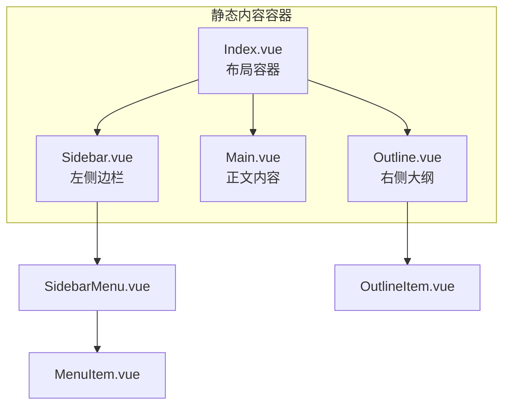
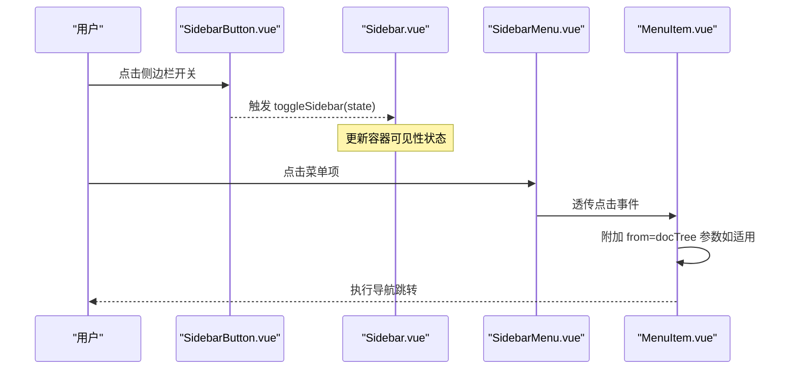
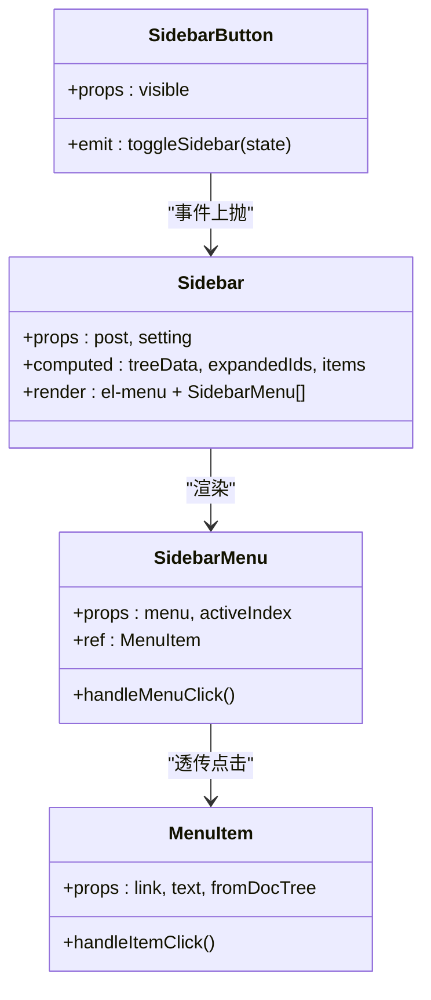
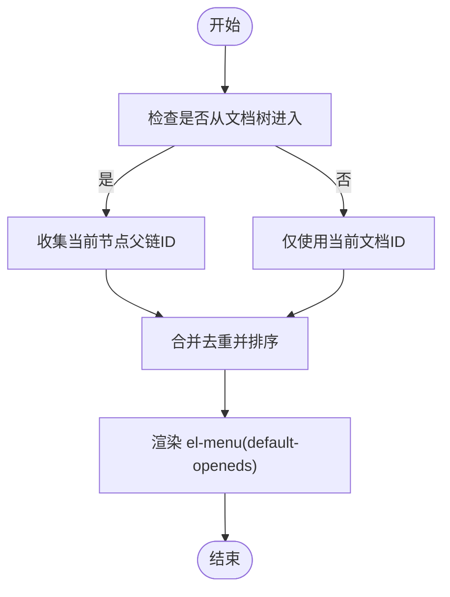
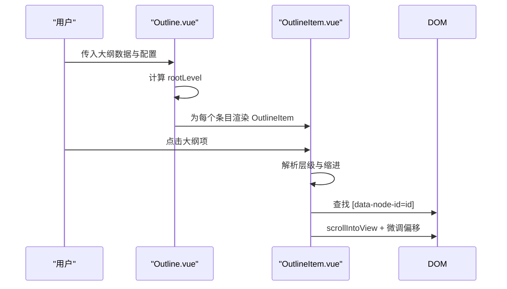
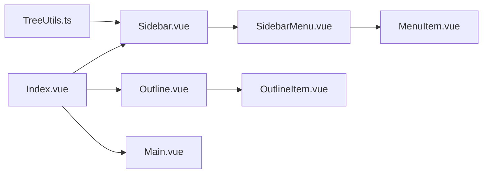

# 内容组件

<cite>
**本文引用的文件**
- [apps/app/components/static/content/left/Sidebar.vue](file://apps/app/components/static/content/left/Sidebar.vue)
- [apps/app/components/static/content/left/SidebarMenu.vue](file://apps/app/components/static/content/left/SidebarMenu.vue)
- [apps/app/components/static/content/left/MenuItem.vue](file://apps/app/components/static/content/left/MenuItem.vue)
- [apps/app/components/static/content/left/SidebarButton.vue](file://apps/app/components/static/content/left/SidebarButton.vue)
- [apps/app/components/static/content/right/Outline.vue](file://apps/app/components/static/content/right/Outline.vue)
- [apps/app/components/static/content/right/OutlineItem.vue](file://apps/app/components/static/content/right/OutlineItem.vue)
- [apps/app/components/static/content/Index.vue](file://apps/app/components/static/content/Index.vue)
- [apps/app/components/static/content/Main.vue](file://apps/app/components/static/content/Main.vue)
- [apps/app/utils/TreeUtils.ts](file://apps/app/utils/TreeUtils.ts)
- [apps/app/app.config.ts](file://apps/app/app.config.ts)
- [apps/app/composables/useSiyuanSPA.ts](file://apps/app/composables/useSiyuanSPA.ts)
</cite>

## 目录
1. [简介](#简介)
2. [项目结构](#项目结构)
3. [核心组件](#核心组件)
4. [架构总览](#架构总览)
5. [详细组件分析](#详细组件分析)
6. [依赖关系分析](#依赖关系分析)
7. [性能考量](#性能考量)
8. [故障排查指南](#故障排查指南)
9. [结论](#结论)
10. [附录](#附录)

## 简介
本技术文档聚焦于内容导航系统中的“左侧边栏组件”与“右侧大纲组件”，涵盖以下组件的设计架构与实现原理：
- 左侧边栏组件：Sidebar、SidebarMenu、MenuItem、SidebarButton
- 右侧大纲组件：Outline、OutlineItem
- 同时梳理组件层次结构、数据流向、交互机制、折叠展开逻辑、层级显示与锚点跳转、组件通信与状态管理策略，并提供使用示例与定制指南。

## 项目结构
内容导航系统位于静态内容区域，采用左右布局：
- 左侧：文档树导航（Sidebar + SidebarMenu + MenuItem + SidebarButton）
- 中部：正文内容（Main）
- 右侧：大纲导航（Outline + OutlineItem）

图表来源
- [apps/app/components/static/content/Index.vue:16-29](file://apps/app/components/static/content/Index.vue#L16-L29)
- [apps/app/components/static/content/left/Sidebar.vue:114-125](file://apps/app/components/static/content/left/Sidebar.vue#L114-L125)
- [apps/app/components/static/content/right/Outline.vue:49-70](file://apps/app/components/static/content/right/Outline.vue#L49-L70)

章节来源
- [apps/app/components/static/content/Index.vue:16-29](file://apps/app/components/static/content/Index.vue#L16-L29)

## 核心组件
- Sidebar：负责根据文档树生成菜单树，计算默认展开节点与当前激活项，渲染 el-menu 并注入 SidebarMenu。
- SidebarMenu：递归渲染菜单项，区分菜单项与子菜单，支持点击事件透传至 MenuItem。
- MenuItem：承载单个菜单项的展示与跳转逻辑，支持“来自文档树”的参数传递与超长标题的省略与提示。
- SidebarButton：移动端/小屏下的侧边栏开关按钮，向父组件发出 toggleSidebar 事件。
- Outline：接收大纲数据，计算根层级，驱动 OutlineItem 进行层级渲染。
- OutlineItem：根据层级与最大深度控制渲染与缩进，支持锚点定位滚动到对应标题区块。

章节来源
- [apps/app/components/static/content/left/Sidebar.vue:10-154](file://apps/app/components/static/content/left/Sidebar.vue#L10-L154)
- [apps/app/components/static/content/left/SidebarMenu.vue:10-86](file://apps/app/components/static/content/left/SidebarMenu.vue#L10-L86)
- [apps/app/components/static/content/left/MenuItem.vue:19-90](file://apps/app/components/static/content/left/MenuItem.vue#L19-L90)
- [apps/app/components/static/content/left/SidebarButton.vue:10-98](file://apps/app/components/static/content/left/SidebarButton.vue#L10-L98)
- [apps/app/components/static/content/right/Outline.vue:10-130](file://apps/app/components/static/content/right/Outline.vue#L10-L130)
- [apps/app/components/static/content/right/OutlineItem.vue:10-142](file://apps/app/components/static/content/right/OutlineItem.vue#L10-L142)

## 架构总览
整体采用“容器-展示”分层：
- 容器层：Index.vue 负责布局；Sidebar.vue、Outline.vue 负责数据准备与根渲染。
- 展示层：SidebarMenu/MenuItem、OutlineItem 负责具体渲染与交互。
- 通信方式：父子组件通过 props 下发数据，事件通过 emits 上抛；路由与导航通过统一的跳转函数实现。

图表来源
- [apps/app/components/static/content/left/SidebarButton.vue:15-21](file://apps/app/components/static/content/left/SidebarButton.vue#L15-L21)
- [apps/app/components/static/content/left/Sidebar.vue:114-125](file://apps/app/components/static/content/left/Sidebar.vue#L114-L125)
- [apps/app/components/static/content/left/SidebarMenu.vue:32-35](file://apps/app/components/static/content/left/SidebarMenu.vue#L32-L35)
- [apps/app/components/static/content/left/MenuItem.vue:55-66](file://apps/app/components/static/content/left/MenuItem.vue#L55-L66)

## 详细组件分析

### 左侧边栏组件体系
- Sidebar
  - 输入：post（含 docTree、postid）、setting（含 docPath、docTreeLevel）
  - 关键逻辑：
    - 使用 TreeUtils.addParentIds 为节点补全 parentIds
    - 计算 expandedIds：当前文档 id 以及从文档树进入时的所有父节点 id
    - 计算 items：基于 parentId 递归构建树形结构，自动补全缺失父节点为占位节点
    - 渲染 el-menu，并将每个菜单项交由 SidebarMenu 渲染
  - 交互：通过 el-menu 的 default-openeds 与 default-active 控制展开与高亮
- SidebarMenu
  - 输入：menu（含 id、name、link、depth、children）、activeIndex
  - 关键逻辑：根据是否存在 children 决定渲染 el-sub-menu 或 el-menu-item；点击时调用子 MenuItem 的 handleItemClick 实现统一跳转
- MenuItem
  - 输入：link、text、fromDocTree
  - 关键逻辑：计算文本长度并截断与提示；若 fromDocTree 为真，则在链接追加 from=docTree 查询参数；最终统一通过导航函数执行跳转
- SidebarButton
  - 输入：visible
  - 关键逻辑：点击发出 toggleSidebar 事件，供父容器切换侧边栏显示状态

图表来源
- [apps/app/components/static/content/left/Sidebar.vue:10-154](file://apps/app/components/static/content/left/Sidebar.vue#L10-L154)
- [apps/app/components/static/content/left/SidebarMenu.vue:10-86](file://apps/app/components/static/content/left/SidebarMenu.vue#L10-L86)
- [apps/app/components/static/content/left/MenuItem.vue:19-90](file://apps/app/components/static/content/left/MenuItem.vue#L19-L90)
- [apps/app/components/static/content/left/SidebarButton.vue:10-98](file://apps/app/components/static/content/left/SidebarButton.vue#L10-L98)

章节来源
- [apps/app/components/static/content/left/Sidebar.vue:20-110](file://apps/app/components/static/content/left/Sidebar.vue#L20-L110)
- [apps/app/components/static/content/left/SidebarMenu.vue:24-35](file://apps/app/components/static/content/left/SidebarMenu.vue#L24-L35)
- [apps/app/components/static/content/left/MenuItem.vue:30-66](file://apps/app/components/static/content/left/MenuItem.vue#L30-L66)
- [apps/app/components/static/content/left/SidebarButton.vue:15-21](file://apps/app/components/static/content/left/SidebarButton.vue#L15-L21)

### 折叠展开逻辑
- 默认展开策略：
  - 当前文档 id 必须展开
  - 若从文档树进入（route.query.from === 'docTree'），则沿父链逐级展开
- 展开集合计算：
  - expandedIds = [当前文档 id, 父节点..., 祖先节点...]
  - SidebarMenu 通过 el-menu 的 default-openeds 接收并渲染
- 激活态控制：
  - SidebarMenu 通过 activeIndex 与当前菜单 id 对比，决定是否高亮

图表来源
- [apps/app/components/static/content/left/Sidebar.vue:25-47](file://apps/app/components/static/content/left/Sidebar.vue#L25-L47)
- [apps/app/utils/TreeUtils.ts:39-55](file://apps/app/utils/TreeUtils.ts#L39-L55)

章节来源
- [apps/app/components/static/content/left/Sidebar.vue:25-47](file://apps/app/components/static/content/left/Sidebar.vue#L25-L47)
- [apps/app/utils/TreeUtils.ts:39-55](file://apps/app/utils/TreeUtils.ts#L39-L55)

### 右侧大纲组件体系
- Outline
  - 输入：outlineData（数组）、maxDepth（数字）、activeText（字符串）
  - 关键逻辑：计算根层级 rootLevel（最小层级或唯一层级），遍历 outlineData，为每个条目创建 OutlineItem
- OutlineItem
  - 输入：item、maxDepth、isRoot、rootLevel、activeText
  - 关键逻辑：
    - 计算层级：从 item.subType 提取 hX 的 X
    - 根据层级计算缩进（每级增加固定像素）
    - 支持两种渲染形态：第一级/根节点（children 作为子项）、其他层级（children 或 blocks 作为子项）
    - 点击时根据 item.id 在正文 DOM 中查找带 data-node-id 的元素并滚动到可视区域，再微调偏移

图表来源
- [apps/app/components/static/content/right/Outline.vue:28-46](file://apps/app/components/static/content/right/Outline.vue#L28-L46)
- [apps/app/components/static/content/right/OutlineItem.vue:57-68](file://apps/app/components/static/content/right/OutlineItem.vue#L57-L68)

章节来源
- [apps/app/components/static/content/right/Outline.vue:10-130](file://apps/app/components/static/content/right/Outline.vue#L10-L130)
- [apps/app/components/static/content/right/OutlineItem.vue:10-142](file://apps/app/components/static/content/right/OutlineItem.vue#L10-L142)

### 组件间通信与状态管理策略
- 父子通信（props/emit）
  - Sidebar -> SidebarMenu：menu、activeIndex
  - SidebarMenu -> MenuItem：link、text、fromDocTree
  - SidebarButton -> Sidebar：toggleSidebar 事件
  - Outline -> OutlineItem：item、maxDepth、rootLevel、isRoot、activeText
- 状态来源
  - 路由参数：route.query.from 控制“来自文档树”的行为
  - 配置项：app.config.ts 中的 docPath、docTreeLevel、outlineLevel 等
  - 计算属性：expandedIds、items、rootLevel 等
- 导航与跳转
  - 统一通过导航函数执行跳转，确保在不同运行模式（如 SPA）下行为一致

章节来源
- [apps/app/components/static/content/left/Sidebar.vue:16-27](file://apps/app/components/static/content/left/Sidebar.vue#L16-L27)
- [apps/app/components/static/content/left/MenuItem.vue:55-66](file://apps/app/components/static/content/left/MenuItem.vue#L55-L66)
- [apps/app/app.config.ts:47-58](file://apps/app/app.config.ts#L47-L58)
- [apps/app/composables/useSiyuanSPA.ts:10-15](file://apps/app/composables/useSiyuanSPA.ts#L10-L15)

## 依赖关系分析
- Sidebar 依赖 TreeUtils 以补全父链与展开集合
- SidebarMenu 依赖 MenuItem 实现统一跳转
- Outline 依赖 OutlineItem 进行层级渲染与锚点滚动
- Index.vue 作为布局容器，协调三者并提供全局上下文

图表来源
- [apps/app/utils/TreeUtils.ts:10-55](file://apps/app/utils/TreeUtils.ts#L10-L55)
- [apps/app/components/static/content/left/Sidebar.vue:10-154](file://apps/app/components/static/content/left/Sidebar.vue#L10-L154)
- [apps/app/components/static/content/left/SidebarMenu.vue:10-86](file://apps/app/components/static/content/left/SidebarMenu.vue#L10-L86)
- [apps/app/components/static/content/left/MenuItem.vue:19-90](file://apps/app/components/static/content/left/MenuItem.vue#L19-L90)
- [apps/app/components/static/content/right/Outline.vue:10-130](file://apps/app/components/static/content/right/Outline.vue#L10-L130)
- [apps/app/components/static/content/right/OutlineItem.vue:10-142](file://apps/app/components/static/content/right/OutlineItem.vue#L10-L142)
- [apps/app/components/static/content/Index.vue:16-29](file://apps/app/components/static/content/Index.vue#L16-L29)

章节来源
- [apps/app/utils/TreeUtils.ts:10-55](file://apps/app/utils/TreeUtils.ts#L10-L55)
- [apps/app/components/static/content/Index.vue:16-29](file://apps/app/components/static/content/Index.vue#L16-L29)

## 性能考量
- 树构建与展开集合计算
  - TreeUtils.chainExpandedIds 对父链进行扁平化与去重，避免重复展开
  - Sidebar 的 expandedIds 仅包含必要节点，减少 el-menu 渲染压力
- 文本截断与 Tooltip
  - MenuItem 对超长标题进行长度计算与截断，避免布局抖动
- 滚动定位
  - OutlineItem 使用 scrollIntoView 并微调偏移，保证标题可见性
- 建议
  - 大型文档树建议在上游服务端完成层级裁剪与父链补全
  - 大纲数据量较大时，可考虑分页或懒加载子项

## 故障排查指南
- 无法从文档树进入时自动展开
  - 检查 route.query.from 是否为 docTree
  - 确认 docTree 中存在当前文档 id 的父链
- 菜单项点击无效
  - 确认 MenuItem 的 handleItemClick 是否被正确调用
  - 检查导航函数是否在当前运行模式下可用
- 大纲无法锚点定位
  - 确认正文 DOM 中存在 data-node-id 对应的元素
  - 检查 OutlineItem 的 item.id 与 data-node-id 是否一致
- 样式异常
  - 检查主题模式与暗色模式下的覆盖样式
  - 确认 Outline 的固定定位与容器高度设置

章节来源
- [apps/app/components/static/content/left/Sidebar.vue:25-47](file://apps/app/components/static/content/left/Sidebar.vue#L25-L47)
- [apps/app/components/static/content/left/MenuItem.vue:55-66](file://apps/app/components/static/content/left/MenuItem.vue#L55-L66)
- [apps/app/components/static/content/right/OutlineItem.vue:62-68](file://apps/app/components/static/content/right/OutlineItem.vue#L62-L68)

## 结论
该内容导航系统通过清晰的组件分层与稳定的 props/emit 通信机制，实现了从文档树到正文的双向导航能力。左侧边栏的“从文档树进入自动展开”与右侧大纲的“层级缩进 + 锚点跳转”共同构成了高效的文档浏览体验。配合配置项与运行模式检测，系统具备良好的可扩展性与可维护性。

## 附录

### 使用示例与定制指南
- 配置项
  - 文档树路径与层级：在 app.config.ts 中设置 docPath、docTreeLevel
  - 大纲启用与层级：在 app.config.ts 中设置 outlineEnabled、outlineLevel
- 左侧边栏
  - 传入 post（含 docTree、postid）与 setting 至 Sidebar
  - 通过 route.query.from 控制“来自文档树”的展开行为
- 右侧大纲
  - 传入 outlineData（包含 id、subType、blocks/children 等字段）
  - 设置 maxDepth 控制渲染层级上限
  - 设置 activeText 高亮当前标题
- 交互定制
  - 自定义 MenuItem 的跳转行为（如新增查询参数）
  - 自定义 SidebarButton 的显示位置与样式
  - 自定义 OutlineItem 的缩进与高亮样式

章节来源
- [apps/app/app.config.ts:47-58](file://apps/app/app.config.ts#L47-L58)
- [apps/app/components/static/content/left/Sidebar.vue:14-49](file://apps/app/components/static/content/left/Sidebar.vue#L14-L49)
- [apps/app/components/static/content/right/Outline.vue:11-24](file://apps/app/components/static/content/right/Outline.vue#L11-L24)
- [apps/app/components/static/content/right/OutlineItem.vue:11-32](file://apps/app/components/static/content/right/OutlineItem.vue#L11-L32)