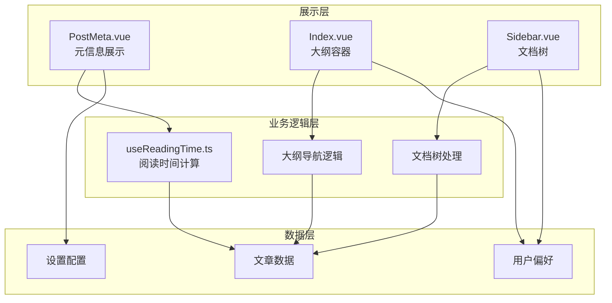
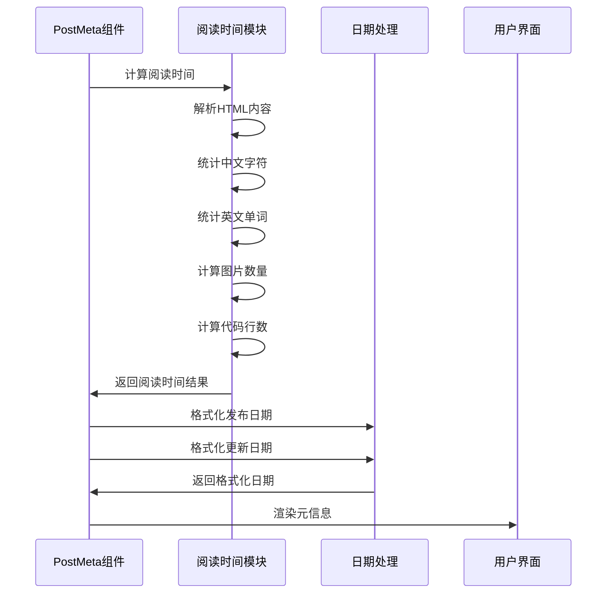
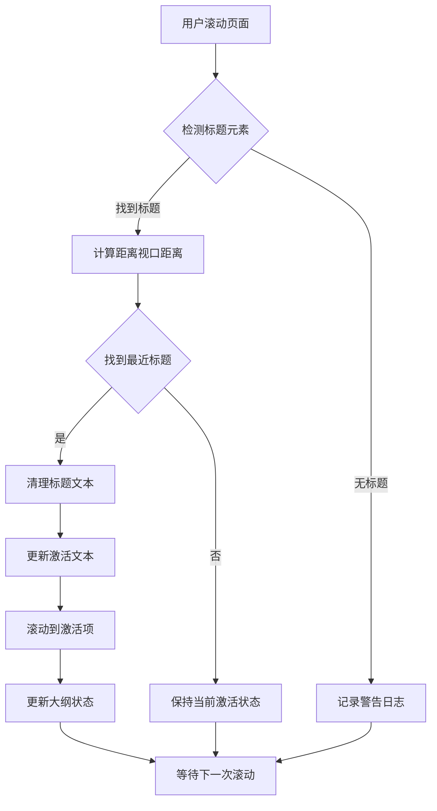
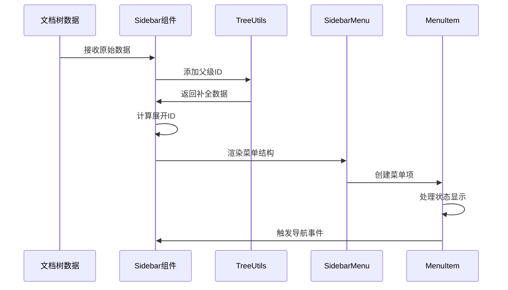
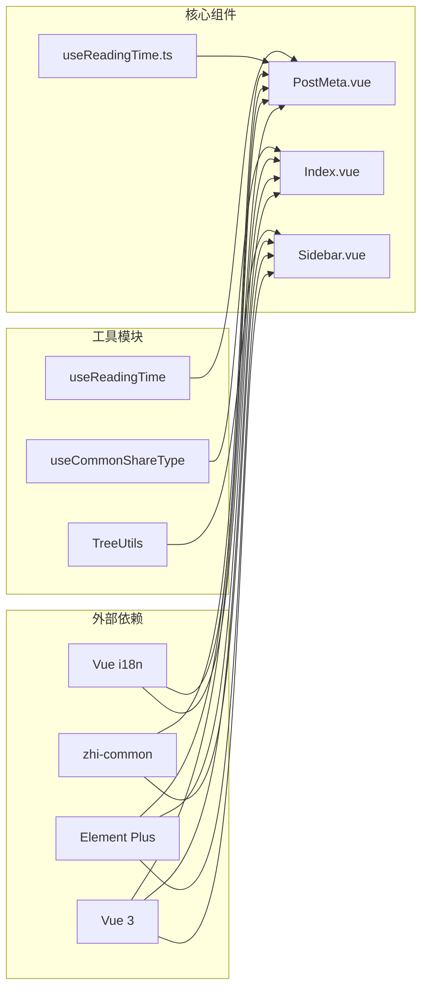

# 文章元数据组件

<cite>
**本文档引用的文件**
- [PostMeta.vue](file://apps/app/components/static/content/PostMeta.vue)
- [useReadingTime.ts](file://apps/app/composables/useReadingTime.ts)
- [Index.vue](file://apps/app/components/static/content/right/Index.vue)
- [Outline.vue](file://apps/app/components/static/content/right/Outline.vue)
- [OutlineItem.vue](file://apps/app/components/static/content/right/OutlineItem.vue)
- [Sidebar.vue](file://apps/app/components/static/content/left/Sidebar.vue)
- [SidebarMenu.vue](file://apps/app/components/static/content/left/SidebarMenu.vue)
- [MenuItem.vue](file://apps/app/components/static/content/left/MenuItem.vue)
- [Header.vue](file://apps/app/components/static/Header.vue)
- [Footer.vue](file://apps/app/components/static/Footer.vue)
- [post/[id].vue](file://apps/app/pages/post/[id].vue)
- [doc/[id].vue](file://apps/app/pages/doc/[id].vue)
</cite>

## 目录
1. [简介](#简介)
2. [项目结构](#项目结构)
3. [核心组件](#核心组件)
4. [架构概览](#架构概览)
5. [详细组件分析](#详细组件分析)
6. [依赖关系分析](#依赖关系分析)
7. [性能考虑](#性能考虑)
8. [故障排除指南](#故障排除指南)
9. [结论](#结论)

## 简介

文章元数据组件是 SiYuan 插件博客系统中的重要组成部分，负责展示文章的基本信息和提供相关的交互功能。该组件集成了多种功能特性，包括文章发布时间和更新时间显示、阅读时长计算、大纲导航、AI 助手集成等。

本组件的设计遵循了现代化前端开发的最佳实践，采用了 Vue 3 Composition API、TypeScript 类型安全、以及响应式编程模型。组件具有高度的可扩展性和可维护性，支持多种主题模式和国际化需求。

## 项目结构

基于分析的代码结构，文章元数据组件主要分布在以下目录中：

```mermaid
graph TB
subgraph "文章元数据组件结构"
A[PostMeta.vue<br/>文章元信息展示]
B[useReadingTime.ts<br/>阅读时间计算]
C[Index.vue<br/>右侧大纲容器]
D[Outline.vue<br/>大纲列表组件]
E[OutlineItem.vue<br/>大纲项组件]
F[Sidebar.vue<br/>左侧文档树]
G[SidebarMenu.vue<br/>菜单项容器]
H[MenuItem.vue<br/>菜单项组件]
end
subgraph "页面层"
I[post/[id].vue<br/>文章页面]
J[doc/[id].vue<br/>文档页面]
end
subgraph "布局组件"
K[Header.vue<br/>头部导航]
L[Footer.vue<br/>底部信息]
end
A --> B
C --> D
D --> E
F --> G
G --> H
I --> A
I --> C
J --> F
K --> I
L --> I
```

**图表来源**
- [PostMeta.vue:1-192](file://apps/app/components/static/content/PostMeta.vue#L1-L192)
- [useReadingTime.ts:1-132](file://apps/app/composables/useReadingTime.ts#L1-L132)
- [Index.vue:1-763](file://apps/app/components/static/content/right/Index.vue#L1-L763)

**章节来源**
- [PostMeta.vue:1-192](file://apps/app/components/static/content/PostMeta.vue#L1-L192)
- [useReadingTime.ts:1-132](file://apps/app/composables/useReadingTime.ts#L1-L132)
- [Index.vue:1-763](file://apps/app/components/static/content/right/Index.vue#L1-L763)

## 核心组件

### PostMeta 组件

PostMeta 组件是文章元数据的核心展示组件，提供了以下主要功能：

- **日期信息显示**：展示文章的发布日期和更新日期
- **阅读时长计算**：基于内容复杂度智能计算阅读时间
- **国际化支持**：支持中英文双语显示
- **响应式设计**：适配不同屏幕尺寸

### 阅读时间计算模块

useReadingTime 模块提供了精确的阅读时间计算算法：

- **多语言支持**：分别计算中文字符和英文单词
- **内容类型识别**：区分文本、图片、代码块等不同类型内容
- **权重分配**：为不同内容类型分配不同的阅读权重
- **最小阅读时间**：确保至少显示 1 分钟的阅读时间

**章节来源**
- [PostMeta.vue:9-44](file://apps/app/components/static/content/PostMeta.vue#L9-L44)
- [useReadingTime.ts:55-109](file://apps/app/composables/useReadingTime.ts#L55-L109)

## 架构概览

文章元数据组件采用分层架构设计，各组件职责明确，耦合度低：



**图表来源**
- [PostMeta.vue:1-192](file://apps/app/components/static/content/PostMeta.vue#L1-L192)
- [useReadingTime.ts:1-132](file://apps/app/composables/useReadingTime.ts#L1-L132)
- [Index.vue:1-763](file://apps/app/components/static/content/right/Index.vue#L1-L763)

## 详细组件分析

### PostMeta 组件详细分析

PostMeta 组件实现了完整的文章元信息展示功能：

#### 数据处理流程



**图表来源**
- [PostMeta.vue:19-44](file://apps/app/components/static/content/PostMeta.vue#L19-L44)
- [useReadingTime.ts:55-109](file://apps/app/composables/useReadingTime.ts#L55-L109)

#### 组件属性和方法

| 属性名 | 类型 | 描述 | 默认值 |
|--------|------|------|--------|
| post | any | 文章数据对象 | 必填 |
| setting | AppConfig | 应用配置 | 可选 |

| 方法名 | 参数 | 返回值 | 描述 |
|--------|------|--------|------|
| formatDate | dateStr: string \| number \| undefined | string | 日期格式化 |
| publishDate | - | ComputedRef<string> | 发布日期计算 |
| updateDate | - | ComputedRef<string> | 更新日期计算 |
| readingText | - | ComputedRef<string> | 阅读时间文本 |

**章节来源**
- [PostMeta.vue:13-44](file://apps/app/components/static/content/PostMeta.vue#L13-L44)

### 大纲导航组件分析

右侧大纲容器组件提供了丰富的导航功能：

#### 大纲交互流程



**图表来源**
- [Index.vue:240-270](file://apps/app/components/static/content/right/Index.vue#L240-L270)

#### 大纲配置选项

| 配置项 | 类型 | 描述 | 默认值 |
|--------|------|------|--------|
| outlineData | Array | 大纲数据 | 必填 |
| outlineLevel | Number | 大纲层级 | 6 |
| aiPanelActive | Boolean | AI面板激活状态 | false |
| showSidebar | Boolean | 侧边栏显示状态 | false |
| isPinned | Boolean | 固定显示状态 | false |

**章节来源**
- [Index.vue:18-145](file://apps/app/components/static/content/right/Index.vue#L18-L145)

### 文档树组件分析

左侧文档树组件提供了完整的文档导航功能：

#### 文档树构建流程



**图表来源**
- [Sidebar.vue:117-210](file://apps/app/components/static/content/left/Sidebar.vue#L117-L210)

#### 菜单项状态管理

| 状态类型 | 属性名 | 描述 | 显示效果 |
|----------|--------|------|----------|
| 分享状态 | isShared | 是否已分享 | 正常显示 |
| 密码保护 | hasPassword | 是否有密码 | 黄色提示 |
| 过期状态 | isExpired | 是否已过期 | 红色提示 |
| 激活状态 | activeIndex | 当前激活项 | 主题色高亮 |

**章节来源**
- [Sidebar.vue:117-210](file://apps/app/components/static/content/left/Sidebar.vue#L117-L210)
- [MenuItem.vue:67-75](file://apps/app/components/static/content/left/MenuItem.vue#L67-L75)

## 依赖关系分析

组件间的依赖关系体现了清晰的分层架构：



**图表来源**
- [PostMeta.vue:1-192](file://apps/app/components/static/content/PostMeta.vue#L1-L192)
- [useReadingTime.ts:1-132](file://apps/app/composables/useReadingTime.ts#L1-L132)
- [Sidebar.vue:1-289](file://apps/app/components/static/content/left/Sidebar.vue#L1-L289)

**章节来源**
- [PostMeta.vue:1-192](file://apps/app/components/static/content/PostMeta.vue#L1-L192)
- [useReadingTime.ts:1-132](file://apps/app/composables/useReadingTime.ts#L1-L132)
- [Sidebar.vue:1-289](file://apps/app/components/static/content/left/Sidebar.vue#L1-L289)

## 性能考虑

### 阅读时间计算优化

useReadingTime 模块采用了多项性能优化策略：

- **惰性计算**：使用 Vue 3 的 computed 属性实现按需计算
- **正则表达式缓存**：避免重复编译相同的正则表达式
- **DOM 操作最小化**：只在必要时进行 DOM 查询和操作
- **内存管理**：及时清理事件监听器和引用

### 大纲滚动性能

Index.vue 组件实现了高效的滚动处理机制：

- **节流处理**：限制滚动事件的触发频率
- **虚拟滚动**：对于大量内容使用虚拟滚动技术
- **CSS 优化**：使用 transform 替代 top/left 属性
- **懒加载**：按需加载和渲染大纲项

## 故障排除指南

### 常见问题及解决方案

#### 阅读时间显示异常

**问题描述**：阅读时间显示为 0 或异常数值

**可能原因**：
1. HTML 内容格式不正确
2. 缺少必要的 DOM 结构
3. 编码问题导致字符统计错误

**解决方案**：
1. 检查文章内容的 HTML 结构
2. 确保包含有效的文本内容
3. 验证字符编码设置

#### 大纲不显示或显示异常

**问题描述**：大纲面板不显示或显示内容不完整

**可能原因**：
1. 文章缺少标题结构
2. 大纲数据格式不正确
3. CSS 样式冲突

**解决方案**：
1. 确保文章包含正确的标题层级
2. 检查大纲数据的结构完整性
3. 调整相关 CSS 样式规则

#### 文档树导航失效

**问题描述**：左侧文档树无法正常导航

**可能原因**：
1. 路由配置错误
2. 权限验证失败
3. 数据加载超时

**解决方案**：
1. 检查路由配置和路径映射
2. 验证用户权限和访问控制
3. 实现适当的错误处理和重试机制

**章节来源**
- [PostMeta.vue:27-44](file://apps/app/components/static/content/PostMeta.vue#L27-L44)
- [Index.vue:240-270](file://apps/app/components/static/content/right/Index.vue#L240-L270)
- [Sidebar.vue:81-122](file://apps/app/components/static/content/left/Sidebar.vue#L81-L122)

## 结论

文章元数据组件展现了现代前端开发的优秀实践，具有以下特点：

**设计优势**：
- **模块化设计**：各组件职责明确，易于维护和扩展
- **类型安全**：全面使用 TypeScript，提供编译时类型检查
- **响应式架构**：充分利用 Vue 3 的响应式系统
- **国际化支持**：内置多语言支持，适应全球化需求

**技术特色**：
- **高性能计算**：阅读时间计算算法经过精心优化
- **用户体验**：提供流畅的交互体验和良好的视觉效果
- **可扩展性**：支持插件化扩展和自定义配置
- **兼容性**：支持多种浏览器和设备

该组件为 SiYuan 插件博客系统提供了坚实的基础，为用户提供了优质的阅读体验和便捷的导航功能。通过持续的优化和改进，该组件将继续为用户提供更好的服务。