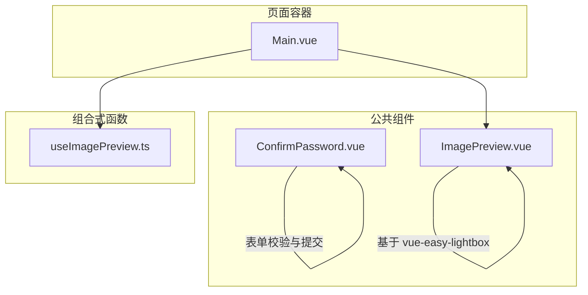
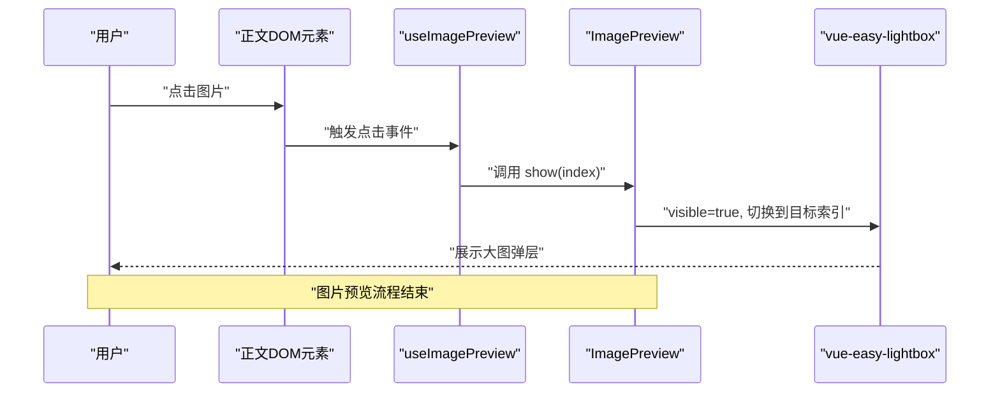
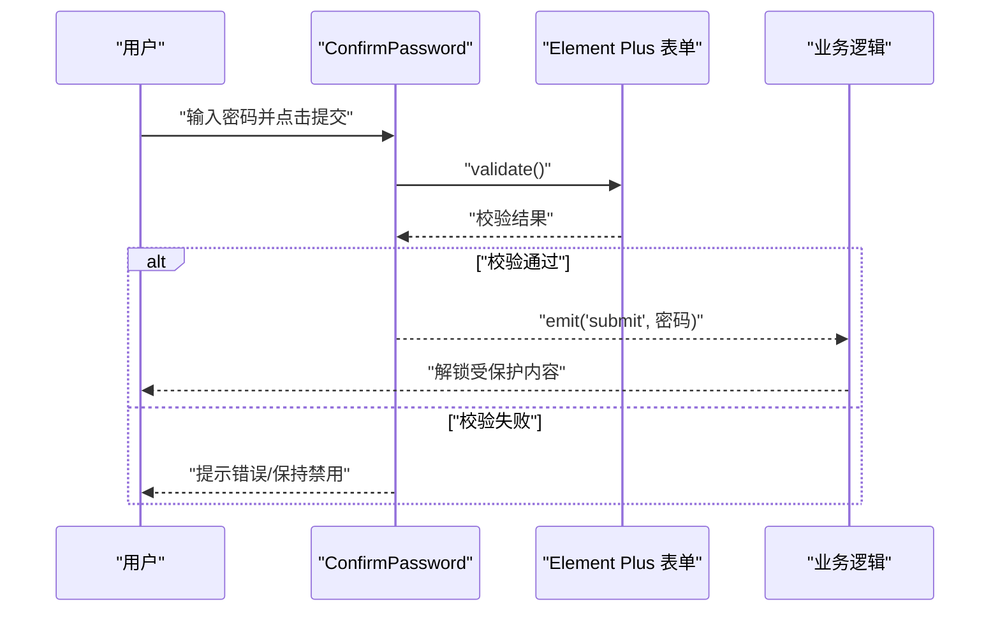
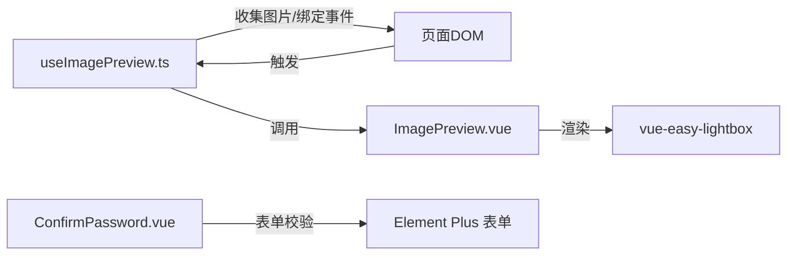

# 通用组件

<cite>
**本文引用的文件**
- [ConfirmPassword.vue](file://apps/app/components/common/ConfirmPassword.vue)
- [ImagePreview.vue](file://apps/app/components/common/ImagePreview.vue)
- [useImagePreview.ts](file://apps/app/composables/useImagePreview.ts)
- [Main.vue](file://apps/app/components/static/content/Main.vue)
- [index.styl](file://apps/app/assets/css/theme/index.styl)
- [en_US.json](file://apps/app/i18n/locales/en_US.json)
- [zh_CN.json](file://apps/app/i18n/locales/zh_CN.json)
</cite>

## 目录
1. [引言](#引言)
2. [项目结构](#项目结构)
3. [核心组件](#核心组件)
4. [架构总览](#架构总览)
5. [详细组件分析](#详细组件分析)
6. [依赖关系分析](#依赖关系分析)
7. [性能考量](#性能考量)
8. [故障排查指南](#故障排查指南)
9. [结论](#结论)
10. [附录](#附录)

## 引言
本文件面向开发者与产品同学，系统化梳理两个通用组件：ConfirmPassword（密码确认）与 ImagePreview（图片预览）的设计理念、实现细节与使用方法。文档将从组件职责、Props 参数、事件与插槽、样式与主题适配、响应式与可扩展性等维度进行深入解析，并结合仓库中的真实使用示例，给出在不同业务场景下的集成思路与最佳实践。

## 项目结构
这两个通用组件位于应用前端工程的公共组件目录下，配合一个轻量的组合式函数完成图片点击预览能力的初始化与状态管理；页面通过客户端仅渲染的方式挂载图片预览组件，确保在 SSR 环境下不产生副作用。

图表来源
- [ConfirmPassword.vue:1-181](file://apps/app/components/common/ConfirmPassword.vue#L1-L181)
- [ImagePreview.vue:1-64](file://apps/app/components/common/ImagePreview.vue#L1-L64)
- [useImagePreview.ts:1-72](file://apps/app/composables/useImagePreview.ts#L1-L72)
- [Main.vue:1-80](file://apps/app/components/static/content/Main.vue#L1-L80)

章节来源
- [ConfirmPassword.vue:1-181](file://apps/app/components/common/ConfirmPassword.vue#L1-L181)
- [ImagePreview.vue:1-64](file://apps/app/components/common/ImagePreview.vue#L1-L64)
- [useImagePreview.ts:1-72](file://apps/app/composables/useImagePreview.ts#L1-L72)
- [Main.vue:1-80](file://apps/app/components/static/content/Main.vue#L1-L80)

## 核心组件
- ConfirmPassword：用于对受保护内容进行密码校验，内置表单校验、加载态与国际化文案，支持外部重置与赋值。
- ImagePreview：基于第三方库实现的图片弹层预览，提供统一的显示控制与样式覆盖，便于在富文本或文章正文场景快速启用点击放大浏览。

章节来源
- [ConfirmPassword.vue:49-118](file://apps/app/components/common/ConfirmPassword.vue#L49-L118)
- [ImagePreview.vue:14-37](file://apps/app/components/common/ImagePreview.vue#L14-L37)

## 架构总览
下面以序列图展示“点击图片 -> 初始化预览 -> 打开弹层”的完整流程，以及“输入密码 -> 校验 -> 提交”的交互流程。

图表来源
- [useImagePreview.ts:28-57](file://apps/app/composables/useImagePreview.ts#L28-L57)
- [ImagePreview.vue:24-32](file://apps/app/components/common/ImagePreview.vue#L24-L32)

图表来源
- [ConfirmPassword.vue:89-101](file://apps/app/components/common/ConfirmPassword.vue#L89-L101)

## 详细组件分析

### ConfirmPassword 组件
- 设计理念
  - 专注“受保护内容访问”这一单一职责，提供简洁一致的密码输入体验。
  - 内置基础校验规则与加载态，避免在父组件重复实现相同逻辑。
  - 通过国际化键值集中管理文案，便于多语言扩展。
- 关键特性
  - 表单校验：必填 + 最小长度限制，使用 Element Plus 的表单实例进行异步校验。
  - 加载态：提交时开启加载，防止重复提交。
  - 可控初始值：支持传入 initialValue，便于复用同一实例。
  - 方法暴露：reset 与 setValue，便于父组件在不同场景下重置或预填。
  - 国际化：标题、描述、占位符、提交文案、提示文案与错误提示均来自 i18n 键值。
- Props 参数
  - title: 标题文案，默认为空字符串
  - description: 描述文案，默认为空字符串
  - placeholder: 输入框占位符，默认为空字符串
  - submitText: 提交按钮文案，默认为空字符串
  - hint: 底部提示文案，默认为空字符串
  - initialValue: 初始密码值，默认为空字符串
- 事件
  - submit(password: string): 校验通过后的回调，携带密码参数
  - cancel(): 用户取消操作时的回调
- 插槽
  - 未提供具名/作用域插槽，采用默认模板结构
- 样式与主题适配
  - 使用 CSS 变量定义主色、文字色、阴影与圆角，便于主题切换
  - 容器采用居中布局与最小高度，保证在不同屏幕尺寸下均有良好视觉效果
  - 与 Element Plus 组件组合使用，保持一致的交互风格
- 使用示例（路径）
  - 在页面中作为独立表单使用，监听 submit/cancel 事件，处理后续逻辑
  - 示例参考：[ConfirmPassword.vue:1-181](file://apps/app/components/common/ConfirmPassword.vue#L1-L181)

章节来源
- [ConfirmPassword.vue:49-118](file://apps/app/components/common/ConfirmPassword.vue#L49-L118)
- [ConfirmPassword.vue:121-181](file://apps/app/components/common/ConfirmPassword.vue#L121-L181)
- [en_US.json:84-98](file://apps/app/i18n/locales/en_US.json#L84-L98)
- [zh_CN.json:84-98](file://apps/app/i18n/locales/zh_CN.json#L84-L98)

### ImagePreview 组件
- 设计理念
  - 将“点击图片打开预览”这一行为抽象为可复用的弹层组件，降低页面耦合度
  - 通过组合式函数收集页面图片并绑定点击事件，实现零侵入接入
- 关键特性
  - 显示控制：对外暴露 show(index) 方法，内部通过 visible 与 index 控制弹层状态与当前图片
  - 图片集合：接收 images 数组，支持指定初始索引
  - 样式覆盖：针对第三方库的类名进行样式定制，统一暗色背景与工具栏外观
- Props 参数
  - images: string[]，图片 URL 数组
  - index: number，可选，初始显示索引，默认为 0
- 事件
  - 未提供显式事件声明，内部通过 hide 事件回调控制关闭
- 插槽
  - 未提供插槽
- 样式与主题适配
  - 通过全局样式覆盖第三方库的 wrapper/img/toolbar/btn 类，统一视觉风格
  - 使用 Stylus 编写，便于与项目主题体系协同
- 使用示例（路径）
  - 页面通过 useImagePreview 初始化图片集合与点击事件，再在客户端仅渲染环境下挂载 ImagePreview
  - 示例参考：[Main.vue:19-69](file://apps/app/components/static/content/Main.vue#L19-L69)

章节来源
- [ImagePreview.vue:14-37](file://apps/app/components/common/ImagePreview.vue#L14-L37)
- [ImagePreview.vue:49-63](file://apps/app/components/common/ImagePreview.vue#L49-L63)
- [useImagePreview.ts:28-57](file://apps/app/composables/useImagePreview.ts#L28-L57)
- [Main.vue:19-69](file://apps/app/components/static/content/Main.vue#L19-L69)

## 依赖关系分析
- 组件间关系
  - ImagePreview 依赖第三方库 vue-easy-lightbox 实现弹层
  - useImagePreview 作为桥梁，负责在客户端扫描并绑定图片点击事件，随后调用 ImagePreview 的 show 方法
  - 页面组件 Main.vue 通过客户端仅渲染指令避免 SSR 渲染该弹层
- 主题与样式
  - ConfirmPassword 使用 CSS 变量实现主题色与阴影的统一管理
  - ImagePreview 通过覆盖第三方库类名实现统一风格
  - 项目主题入口包含模糊滤镜等通用样式，可与组件样式协同

图表来源
- [useImagePreview.ts:28-57](file://apps/app/composables/useImagePreview.ts#L28-L57)
- [ImagePreview.vue:24-32](file://apps/app/components/common/ImagePreview.vue#L24-L32)
- [ConfirmPassword.vue:79-84](file://apps/app/components/common/ConfirmPassword.vue#L79-L84)

章节来源
- [useImagePreview.ts:1-72](file://apps/app/composables/useImagePreview.ts#L1-L72)
- [ImagePreview.vue:1-64](file://apps/app/components/common/ImagePreview.vue#L1-L64)
- [ConfirmPassword.vue:1-181](file://apps/app/components/common/ConfirmPassword.vue#L1-L181)
- [index.styl:1-4](file://apps/app/assets/css/theme/index.styl#L1-L4)

## 性能考量
- 图片预览
  - 仅在客户端执行，避免 SSR 渲染弹层带来的不必要开销
  - 通过单例组合式函数收集图片 URL，减少重复扫描与事件绑定
  - 弹层关闭时及时释放状态，避免内存泄漏
- 密码确认
  - 表单校验采用异步 validate，避免阻塞主线程
  - 提交按钮在加载态禁用，防止重复提交
  - 初始锁定状态在挂载后短暂延迟解锁，避免首次渲染即允许提交

章节来源
- [useImagePreview.ts:26-32](file://apps/app/composables/useImagePreview.ts#L26-L32)
- [ImagePreview.vue:24-32](file://apps/app/components/common/ImagePreview.vue#L24-L32)
- [ConfirmPassword.vue:89-101](file://apps/app/components/common/ConfirmPassword.vue#L89-L101)
- [ConfirmPassword.vue:114-118](file://apps/app/components/common/ConfirmPassword.vue#L114-L118)

## 故障排查指南
- 图片无法点击预览
  - 确认页面已调用 useImagePreview 并传入正确的 DOM 元素
  - 检查是否在 SSR 环境下执行，确保仅在客户端运行
  - 确认图片节点存在且具有 src 属性
- 弹层不显示
  - 检查 ImagePreview 是否被客户端仅渲染包裹
  - 确认传入的 images 数组非空，index 不越界
- 密码校验失败
  - 检查国际化键值是否存在，确保 t 函数能正确解析
  - 确认 Element Plus 表单实例已正确引用
  - 查看日志输出定位具体错误

章节来源
- [useImagePreview.ts:28-57](file://apps/app/composables/useImagePreview.ts#L28-L57)
- [Main.vue:66-69](file://apps/app/components/static/content/Main.vue#L66-L69)
- [ConfirmPassword.vue:89-101](file://apps/app/components/common/ConfirmPassword.vue#L89-L101)
- [ConfirmPassword.vue:58-59](file://apps/app/components/common/ConfirmPassword.vue#L58-L59)

## 结论
ConfirmPassword 与 ImagePreview 两个组件分别解决了“受保护内容访问”和“图片点击预览”两大高频需求。前者通过表单校验与加载态提升安全性与可用性，后者通过组合式函数与第三方库实现低耦合接入。二者均具备良好的可扩展性与主题适配能力，适合在多页面、多主题环境中复用。

## 附录
- 国际化键值（节选）
  - 密码确认相关键值：title/description/placeholder/submitText/hint/rule.* 等
  - 中文与英文键值文件路径如下：
    - [en_US.json:84-98](file://apps/app/i18n/locales/en_US.json#L84-L98)
    - [zh_CN.json:84-98](file://apps/app/i18n/locales/zh_CN.json#L84-L98)
- 主题样式入口
  - [index.styl:1-4](file://apps/app/assets/css/theme/index.styl#L1-L4)