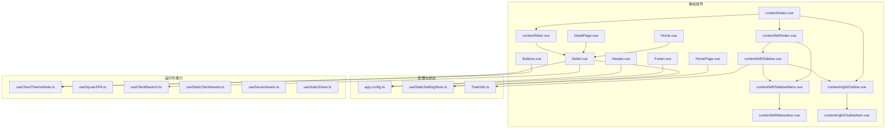
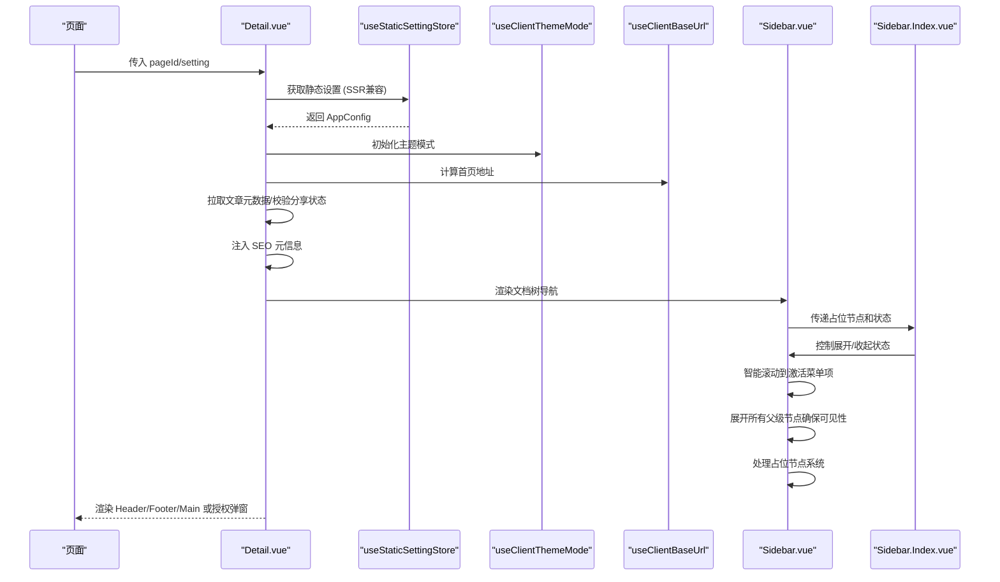
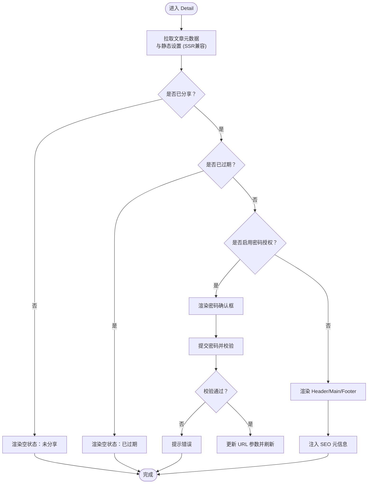
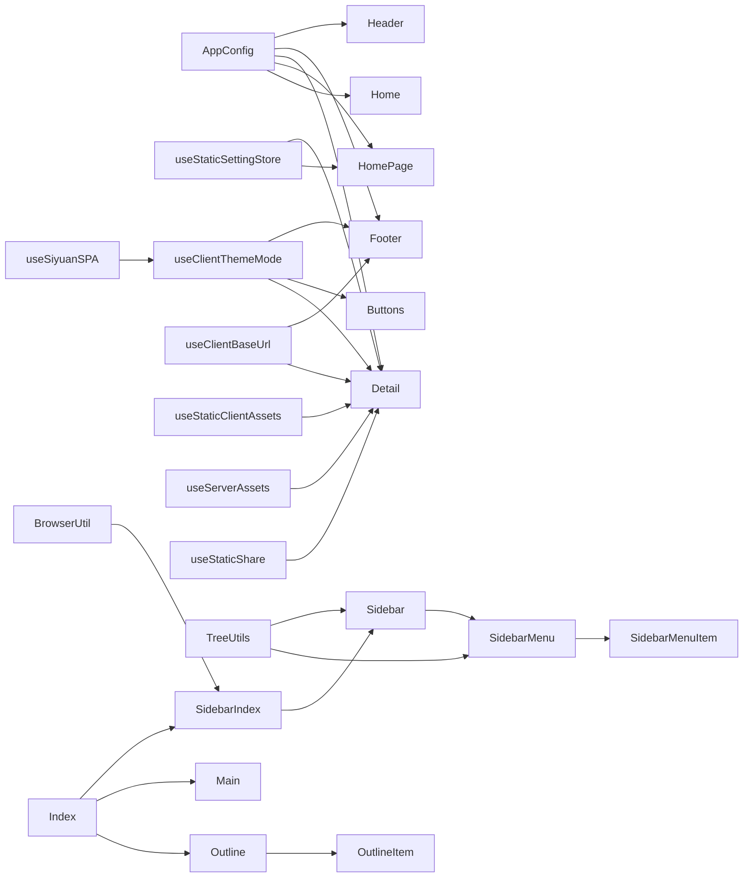

# 静态组件

<cite>
**本文引用的文件**
- [apps/app/components/static/Header.vue](file://apps/app/components/static/Header.vue)
- [apps/app/components/static/Footer.vue](file://apps/app/components/static/Footer.vue)
- [apps/app/components/static/Detail.vue](file://apps/app/components/static/Detail.vue)
- [apps/app/components/static/content/Main.vue](file://apps/app/components/static/content/Main.vue)
- [apps/app/components/static/Buttons.vue](file://apps/app/components/static/Buttons.vue)
- [apps/app/components/static/DetailPage.vue](file://apps/app/components/static/DetailPage.vue)
- [apps/app/components/static/HomePage.vue](file://apps/app/components/static/HomePage.vue)
- [apps/app/components/static/Home.vue](file://apps/app/components/static/Home.vue)
- [apps/app/components/static/content/Index.vue](file://apps/app/components/static/content/Index.vue)
- [apps/app/components/static/content/left/Sidebar.vue](file://apps/app/components/static/content/left/Sidebar.vue)
- [apps/app/components/static/content/left/Index.vue](file://apps/app/components/static/content/left/Index.vue)
- [apps/app/components/static/content/left/MenuItem.vue](file://apps/app/components/static/content/left/MenuItem.vue)
- [apps/app/components/static/content/left/SidebarMenu.vue](file://apps/app/components/static/content/left/SidebarMenu.vue)
- [apps/app/components/static/content/right/Outline.vue](file://apps/app/components/static/content/right/Outline.vue)
- [apps/app/components/static/content/right/OutlineItem.vue](file://apps/app/components/static/content/right/OutlineItem.vue)
- [apps/app/app.config.ts](file://apps/app/app.config.ts)
- [apps/app/stores/useStaticSettingStore.ts](file://apps/app/stores/useStaticSettingStore.ts)
- [apps/app/composables/useClientThemeMode.ts](file://apps/app/composables/useClientThemeMode.ts)
- [apps/app/composables/useSiyuanSPA.ts](file://apps/app/composables/useSiyuanSPA.ts)
- [apps/app/plugins/libs/renderer/useClientBaseUrl.ts](file://apps/app/plugins/libs/renderer/useClientBaseUrl.ts)
- [apps/app/plugins/libs/renderer/useStaticClientAssets.ts](file://apps/app/plugins/libs/renderer/useStaticClientAssets.ts)
- [apps/app/plugins/libs/renderer/useServerAssets.ts](file://apps/app/plugins/libs/renderer/useServerAssets.ts)
- [apps/siyuan/src/composables/useStaticShare.ts](file://apps/siyuan/src/composables/useStaticShare.ts)
- [apps/app/utils/TreeUtils.ts](file://apps/app/utils/TreeUtils.ts)
- [apps/app/assets/css/theme/palette.styl](file://apps/app/assets/css/theme/palette.styl)
- [apps/app/assets/css/theme/index.styl](file://apps/app/assets/css/theme/index.styl)
</cite>

## 更新摘要
**变更内容**
- 侧边栏组件重大增强：修复了文档树展开逻辑，现在无论用户如何导航都能看到完整的父级层次结构，提升了用户体验的一致性
- 新增智能展开机制：expandedIds 计算确保始终展开当前文档的所有父级节点
- 占位节点系统：自动检测并补全缺失的父节点，使用省略号显示占位
- 分享状态传递：在构建树形数据时传递 isShared、hasPassword、isExpired 状态
- 主题感知改进：使用CSS自定义属性实现更好的主题兼容性
- 侧边栏样式优化：使用 var(--el-text-color-regular) 等主题变量

## 目录
1. [简介](#简介)
2. [项目结构](#项目结构)
3. [核心组件](#核心组件)
4. [架构总览](#架构总览)
5. [详细组件分析](#详细组件分析)
6. [依赖分析](#依赖分析)
7. [性能考虑](#性能考虑)
8. [故障排查指南](#故障排查指南)
9. [结论](#结论)
10. [附录](#附录)

## 简介
本文件面向"静态组件"模块，系统性梳理并说明以下组件的功能特性与使用方式：Header、Footer、Home、Detail、Main、Buttons，以及与之配套的 DetailPage、HomePage。文档从模板结构、样式设计、交互逻辑、数据绑定、API 接口（props/events/slots）、组件协作关系、SEO/主题/导航等维度进行深入解析，并提供可操作的使用示例与最佳实践，帮助开发者在不同页面布局中正确集成与定制这些静态组件。

**更新** 本次更新重点关注侧边栏组件的重大增强，包括智能展开逻辑、占位节点系统、分享状态传递和主题感知样式的改进，显著提升了组件的智能化水平和用户体验的一致性。

## 项目结构
静态组件主要位于应用前端工程 apps/app/components/static 及其子目录，配合静态设置存储、主题模式控制、基础路径工具与静态分享能力，形成完整的静态页面渲染与展示体系。

**图表来源**
- [apps/app/components/static/Header.vue:1-131](file://apps/app/components/static/Header.vue#L1-L131)
- [apps/app/components/static/Footer.vue:1-115](file://apps/app/components/static/Footer.vue#L1-L115)
- [apps/app/components/static/Detail.vue:1-173](file://apps/app/components/static/Detail.vue#L1-L173)
- [apps/app/components/static/content/Main.vue:1-80](file://apps/app/components/static/content/Main.vue#L1-L80)
- [apps/app/components/static/Buttons.vue:1-276](file://apps/app/components/static/Buttons.vue#L1-L276)
- [apps/app/components/static/DetailPage.vue:1-21](file://apps/app/components/static/DetailPage.vue#L1-L21)
- [apps/app/components/static/HomePage.vue:1-49](file://apps/app/components/static/HomePage.vue#L1-L49)
- [apps/app/components/static/Home.vue:1-18](file://apps/app/components/static/Home.vue#L1-L18)
- [apps/app/components/static/content/Index.vue:1-51](file://apps/app/components/static/content/Index.vue#L1-L51)
- [apps/app/components/static/content/left/Sidebar.vue:1-288](file://apps/app/components/static/content/left/Sidebar.vue#L1-L288)
- [apps/app/components/static/content/left/Index.vue:1-91](file://apps/app/components/static/content/left/Index.vue#L1-L91)
- [apps/app/components/static/content/left/SidebarMenu.vue:1-91](file://apps/app/components/static/content/left/SidebarMenu.vue#L1-L91)
- [apps/app/components/static/content/left/MenuItem.vue:1-175](file://apps/app/components/static/content/left/MenuItem.vue#L1-L175)
- [apps/app/components/static/content/right/Outline.vue:1-154](file://apps/app/components/static/content/right/Outline.vue#L1-L154)
- [apps/app/components/static/content/right/OutlineItem.vue:1-275](file://apps/app/components/static/content/right/OutlineItem.vue#L1-L275)

**章节来源**
- [apps/app/components/static/Header.vue:1-131](file://apps/app/components/static/Header.vue#L1-L131)
- [apps/app/components/static/Footer.vue:1-115](file://apps/app/components/static/Footer.vue#L1-L115)
- [apps/app/components/static/Detail.vue:1-173](file://apps/app/components/static/Detail.vue#L1-L173)
- [apps/app/components/static/content/Main.vue:1-80](file://apps/app/components/static/content/Main.vue#L1-L80)
- [apps/app/components/static/Buttons.vue:1-276](file://apps/app/components/static/Buttons.vue#L1-L276)
- [apps/app/components/static/DetailPage.vue:1-21](file://apps/app/components/static/DetailPage.vue#L1-L21)
- [apps/app/components/static/HomePage.vue:1-49](file://apps/app/components/static/HomePage.vue#L1-L49)
- [apps/app/components/static/Home.vue:1-18](file://apps/app/components/static/Home.vue#L1-L18)
- [apps/app/components/static/content/Index.vue:1-51](file://apps/app/components/static/content/Index.vue#L1-L51)
- [apps/app/components/static/content/left/Sidebar.vue:1-288](file://apps/app/components/static/content/left/Sidebar.vue#L1-L288)
- [apps/app/components/static/content/left/Index.vue:1-91](file://apps/app/components/static/content/left/Index.vue#L1-L91)
- [apps/app/components/static/content/left/SidebarMenu.vue:1-91](file://apps/app/components/static/content/left/SidebarMenu.vue#L1-L91)
- [apps/app/components/static/content/left/MenuItem.vue:1-175](file://apps/app/components/static/content/left/MenuItem.vue#L1-L175)
- [apps/app/components/static/content/right/Outline.vue:1-154](file://apps/app/components/static/content/right/Outline.vue#L1-L154)
- [apps/app/components/static/content/right/OutlineItem.vue:1-275](file://apps/app/components/static/content/right/OutlineItem.vue#L1-L275)

## 核心组件
- Header：站点顶部导航与品牌展示，支持 Logo、站点名称与自定义 HTML 片段注入，具备智能响应式布局。
- Footer：站点底部信息与主题切换入口，支持自定义 HTML 片段注入与主题模式切换。
- Detail：静态详情页容器，负责拉取文章元数据、处理分享授权、SEO 元信息注入、条件渲染与布局组织。
- Main：静态正文渲染容器，负责标题与富文本内容的渲染、插件化指令与图片预览。
- Buttons：悬浮工具按钮，提供"回到顶部"、"主题模式切换"等交互，具备智能滚动检测和增强的主题模式切换逻辑。
- HomePage：首页入口，根据静态设置决定直接渲染首页内容或提示未配置。
- DetailPage：详情页入口，简化为仅渲染 Detail 组件并关闭标题后缀。
- Home：首页内容容器，委托给 Detail 并覆盖 SEO 与标题显示行为。
- **新增** Sidebar：左侧文档树导航，支持智能滚动定位到激活菜单项、智能展开所有父级节点和占位节点系统。
- **新增** Sidebar.Index：侧边栏容器组件，支持展开/收起状态管理和标题栏适配。
- **新增** Sidebar.Menu：侧边栏菜单组件，支持递归渲染和状态传递。
- **新增** Sidebar.MenuItem：菜单项组件，支持密码保护、过期状态和占位节点显示。
- **新增** Outline：右侧大纲导航，支持自动滚动到激活章节。
- **新增** OutlineItem：大纲项组件，支持层级缩进和激活状态高亮。

**章节来源**
- [apps/app/components/static/Header.vue:1-131](file://apps/app/components/static/Header.vue#L1-L131)
- [apps/app/components/static/Footer.vue:1-115](file://apps/app/components/static/Footer.vue#L1-L115)
- [apps/app/components/static/Detail.vue:1-173](file://apps/app/components/static/Detail.vue#L1-L173)
- [apps/app/components/static/content/Main.vue:1-80](file://apps/app/components/static/content/Main.vue#L1-L80)
- [apps/app/components/static/Buttons.vue:1-276](file://apps/app/components/static/Buttons.vue#L1-L276)
- [apps/app/components/static/HomePage.vue:1-49](file://apps/app/components/static/HomePage.vue#L1-L49)
- [apps/app/components/static/DetailPage.vue:1-21](file://apps/app/components/static/DetailPage.vue#L1-L21)
- [apps/app/components/static/Home.vue:1-18](file://apps/app/components/static/Home.vue#L1-L18)
- [apps/app/components/static/content/left/Sidebar.vue:1-288](file://apps/app/components/static/content/left/Sidebar.vue#L1-L288)
- [apps/app/components/static/content/left/Index.vue:1-91](file://apps/app/components/static/content/left/Index.vue#L1-L91)
- [apps/app/components/static/content/left/SidebarMenu.vue:1-91](file://apps/app/components/static/content/left/SidebarMenu.vue#L1-L91)
- [apps/app/components/static/content/left/MenuItem.vue:1-175](file://apps/app/components/static/content/left/MenuItem.vue#L1-L175)
- [apps/app/components/static/content/right/Outline.vue:1-154](file://apps/app/components/static/content/right/Outline.vue#L1-L154)
- [apps/app/components/static/content/right/OutlineItem.vue:1-275](file://apps/app/components/static/content/right/OutlineItem.vue#L1-L275)

## 架构总览
静态组件围绕"设置驱动 + 运行时能力 + 内容渲染"的三层架构工作，现已增强为"智能交互 + SSR兼容 + 多维度导航 + 主题感知 + 占位节点系统"的综合体系：
- 设置驱动：通过静态设置存储获取全局配置（站点标题、Logo、主题、导航/页脚 HTML 片段等），支持SSR环境下的配置获取。
- 运行时能力：主题模式切换、基础地址计算、静态分享生成与清理、客户端资源处理。
- 内容渲染：Header/Footer/Buttons 提供布局与交互；Detail 聚合数据与条件渲染；Main 负责正文渲染与插件化增强；Sidebar.Index/Sidebar.Sidebar/Sidebar.Menu/Sidebar.MenuItem 提供智能导航，使用CSS自定义属性实现主题感知和占位节点系统。

**图表来源**
- [apps/app/components/static/Detail.vue:1-173](file://apps/app/components/static/Detail.vue#L1-L173)
- [apps/app/stores/useStaticSettingStore.ts:1-28](file://apps/app/stores/useStaticSettingStore.ts#L1-L28)
- [apps/app/composables/useClientThemeMode.ts:1-158](file://apps/app/composables/useClientThemeMode.ts#L1-L158)
- [apps/app/plugins/libs/renderer/useClientBaseUrl.ts:1-42](file://apps/app/plugins/libs/renderer/useClientBaseUrl.ts#L1-L42)
- [apps/app/components/static/content/left/Sidebar.vue:1-288](file://apps/app/components/static/content/left/Sidebar.vue#L1-L288)
- [apps/app/components/static/content/left/Index.vue:1-91](file://apps/app/components/static/content/left/Index.vue#L1-L91)

## 详细组件分析

### Header 组件
- 功能定位：顶部导航与品牌展示，支持 Logo、站点名称与自定义 HTML 片段注入。
- 模板结构：包含品牌链接、Logo、站点名与右侧自定义区域；自定义区域由 VNode 渲染传入的 HTML 字符串。
- 样式设计：固定定位、模糊背景、响应式布局；Logo 与站点名在窄屏下有隐藏策略，具备智能导航栏显示/隐藏效果。
- 交互逻辑：无交互事件，作为纯展示组件。
- 数据绑定：接收 AppConfig，读取站点标题、Logo 与 header HTML 片段。
- API 接口
  - Props
    - setting: AppConfig（必填）
  - Events: 无
  - Slots: 无
- 使用场景
  - 在 Detail/HomePage 中作为页面头部统一展示。
  - 通过 setting.header 注入额外导航或广告位 HTML。
- 最佳实践
  - Logo 与站点名同时存在时，站点名可按需隐藏以节省空间。
  - header 片段建议仅放置轻量 HTML，避免影响首屏渲染。
  - 利用响应式设计在移动设备上优化显示效果。

**更新** Header 组件经过重构，增强了响应式布局和视觉反馈，特别是在窄屏设备上的表现更加优化。

**章节来源**
- [apps/app/components/static/Header.vue:1-131](file://apps/app/components/static/Header.vue#L1-L131)
- [apps/app/app.config.ts:1-92](file://apps/app/app.config.ts#L1-L92)

### Footer 组件
- 功能定位：底部信息与主题切换入口，支持自定义 HTML 片段注入。
- 模板结构：在非 Provider 模式且未配置 footer 片段时，渲染主题切换按钮与版权、版本、跳转等信息；否则渲染自定义 footer 片段。
- 样式设计：居中文字、浅色字体、可点击项高亮。
- 交互逻辑：点击 GitHub/关于/首页等触发外部链接或跳转；主题切换通过事件向上抛出。
- 数据绑定：接收 AppConfig，读取 footer 片段、站点标题、版本号等。
- API 接口
  - Props
    - setting: AppConfig（必填）
  - Events
    - toggle-theme-mode(auto|light|dark): 触发主题模式切换
  - Slots: 无
- 使用场景
  - 在 Detail/HomePage 中作为页面底部统一展示。
  - 通过 setting.footer 注入版权、统计或自定义链接。
- 最佳实践
  - footer 片段为空时，优先使用内置按钮与信息，确保一致性。
  - 主题切换事件应由父组件或全局主题管理器处理。

**章节来源**
- [apps/app/components/static/Footer.vue:1-115](file://apps/app/components/static/Footer.vue#L1-L115)
- [apps/app/plugins/libs/renderer/useClientBaseUrl.ts:1-42](file://apps/app/plugins/libs/renderer/useClientBaseUrl.ts#L1-L42)
- [apps/app/composables/useClientThemeMode.ts:1-158](file://apps/app/composables/useClientThemeMode.ts#L1-L158)

### Detail 组件
- 功能定位：静态详情页容器，负责文章数据获取、分享授权校验、SEO 注入与布局组织。
- 模板结构：根据共享状态、过期状态、是否需要密码授权分别渲染；否则渲染 Header/Main/Footer 的完整布局。
- 交互逻辑：当启用密码授权时，弹出确认框并调用授权验证接口，成功后更新 URL 参数并刷新。
- 数据绑定：接收 pageId/setting/overrideSeo/showTitleSign；内部通过静态设置存储与 Provider 模式开关拉取数据。
- API 接口
  - Props
    - pageId?: string
    - setting?: AppConfig
    - overrideSeo?: boolean
    - showTitleSign?: boolean
  - Events: 无
  - Slots: 无
- 流程图（授权与渲染）

**图表来源**
- [apps/app/components/static/Detail.vue:1-173](file://apps/app/components/static/Detail.vue#L1-L173)

**更新** Detail 组件现在支持更完善的SSR兼容性，useStaticSettingStore 在SSR环境下能够正确获取配置数据。

**章节来源**
- [apps/app/components/static/Detail.vue:1-173](file://apps/app/components/static/Detail.vue#L1-L173)
- [apps/app/stores/useStaticSettingStore.ts:1-28](file://apps/app/stores/useStaticSettingStore.ts#L1-L28)

### Main 组件
- 功能定位：静态正文渲染容器，负责标题与富文本内容的渲染、插件化指令与图片预览。
- 模板结构：标题区域与正文区域分离；正文区域应用多种插件化指令以增强渲染效果。
- 交互逻辑：无交互事件，作为纯展示组件。
- 数据绑定：接收 post（含标题、editorDom 等）与 setting。
- API 接口
  - Props
    - post: any（必填）
    - setting?: any
  - Events: 无
  - Slots: 无
- 使用场景
  - 作为 Detail 的正文渲染器，承载富文本与插件化渲染。
- 最佳实践
  - editorDom 中的 contenteditable 属性会被统一替换为只读，确保静态展示一致性。
  - 图片预览通过独立组件实现，注意资源路径与跨域问题。

**章节来源**
- [apps/app/components/static/content/Main.vue:1-80](file://apps/app/components/static/content/Main.vue#L1-L80)

### Buttons 组件
- 功能定位：悬浮工具按钮，提供"回到顶部"、"主题模式切换"等交互。
- 模板结构：在客户端渲染，包含回到顶部、主题模式切换等按钮；主题模式切换通过事件向上抛出。
- 交互逻辑：监听滚动事件，超过阈值显示"回到顶部"；点击主题按钮展开模式列表，选择后触发事件。
- 数据绑定：接收 defaultMode；内部维护滚动位置、模式列表等状态。
- API 接口
  - Props
    - defaultMode?: "auto"|"light"|"dark"
  - Events
    - toggleThemeMode(auto|light|dark): 触发主题模式切换
  - Slots: 无
- 使用场景
  - 在 Detail/HomePage 中作为全局悬浮工具，提升可访问性。
- 最佳实践
  - 模式切换事件应由全局主题管理器处理，保持一致的主题状态。
  - 使用防抖优化滚动事件性能。

**更新** Buttons 组件经过重大增强，改进了主题模式切换逻辑：
- 增强的自动模式检测：使用 `window.matchMedia("(prefers-color-scheme: dark)")` 检测系统主题偏好
- 系统主题同步：监听系统主题变化，自动同步到当前模式
- 刷新机制：自动模式切换时刷新页面以应用新主题
- 改进的视觉反馈：使用CSS自定义属性 `var(--b3-protyle-inline-link-color)` 实现主题感知的颜色

**章节来源**
- [apps/app/components/static/Buttons.vue:1-276](file://apps/app/components/static/Buttons.vue#L1-L276)
- [apps/app/composables/useClientThemeMode.ts:1-158](file://apps/app/composables/useClientThemeMode.ts#L1-L158)

### HomePage 组件
- 功能定位：首页入口，根据静态设置决定直接渲染首页内容或提示未配置。
- 模板结构：获取静态设置后，若未配置首页 ID，则渲染空状态与警告；否则渲染 Home 组件并传入首页 ID。
- 交互逻辑：无交互事件，作为路由入口组件。
- 数据绑定：接收 AppConfig，读取首页 ID、站点标题与标语等。
- API 接口
  - Props: 无
  - Events: 无
  - Slots: 无
- 使用场景
  - 作为首页路由组件，统一入口与 SEO 元信息注入。
- 最佳实践
  - 首页 ID 未配置时，应引导用户在后台设置中配置。

**章节来源**
- [apps/app/components/static/HomePage.vue:1-49](file://apps/app/components/static/HomePage.vue#L1-L49)

### DetailPage 组件
- 功能定位：详情页入口，简化为仅渲染 Detail 组件并关闭标题后缀。
- 模板结构：包裹 Detail 并传入 showTitleSign=false。
- 交互逻辑：无交互事件，作为路由入口组件。
- 数据绑定：无额外 props。
- API 接口
  - Props: 无
  - Events: 无
  - Slots: 无
- 使用场景
  - 作为详情页路由组件，适合不需要标题后缀的场景。
- 最佳实践
  - 与 HomePage 类似，确保 Detail 的数据流与权限校验正常。

**章节来源**
- [apps/app/components/static/DetailPage.vue:1-21](file://apps/app/components/static/DetailPage.vue#L1-L21)

### Home 组件
- 功能定位：首页内容容器，委托给 Detail 并覆盖 SEO 与标题显示行为。
- 模板结构：渲染 Detail 并传入 pageId 与 overrideSeo=true、showTitleSign=false。
- 交互逻辑：无交互事件，作为内容容器。
- 数据绑定：接收 pageId。
- API 接口
  - Props
    - pageId?: string
  - Events: 无
  - Slots: 无
- 使用场景
  - 作为首页内容展示的轻量封装。
- 最佳实践
  - 首页 ID 由静态设置提供，确保一致性。

**章节来源**
- [apps/app/components/static/Home.vue:1-18](file://apps/app/components/static/Home.vue#L1-L18)

### Sidebar.Index 组件（新增）
- 功能定位：侧边栏容器组件，支持展开/收起状态管理和标题栏适配。
- 模板结构：根据是否有文档树决定是否显示侧边栏；支持动态宽度切换和透明度控制。
- 交互逻辑：提供 toggle-sidebar 事件，控制侧边栏的展开/收起状态；适配标题栏的 marginLeft。
- 数据绑定：接收 post 和 setting，计算 shouldShowSidebar 和 sidebarVisible。
- API 接口
  - Props
    - post: any（必填)
    - setting: typeof AppConfig（必填)
  - Events
    - toggle-sidebar(boolean): 触发侧边栏状态切换
  - Slots: 无
- 状态管理
  - 初始状态在服务端确定，避免客户端闪烁
  - sidebarVisible 控制侧边栏的展开/收起
  - sidebarClass 动态计算 CSS 类名
- 使用场景
  - 作为 Sidebar 组件的外层容器
  - 提供侧边栏的交互控制
- 最佳实践
  - 确保标题栏适配逻辑在浏览器环境中执行
  - 合理设置过渡动画时间

**章节来源**
- [apps/app/components/static/content/left/Index.vue:1-91](file://apps/app/components/static/content/left/Index.vue#L1-L91)

### Sidebar 组件（重大增强）
- 功能定位：左侧文档树导航，支持智能滚动定位到激活菜单项、智能展开所有父级节点和占位节点系统。
- 模板结构：使用 Element Plus 的 el-scrollbar 和 el-menu 组件，支持树形结构展示。
- 交互逻辑：组件挂载后自动滚动到激活的菜单项，支持多级菜单展开和收起；处理占位节点和分享状态。
- 数据绑定：接收 post（包含文档树数据）和 setting。
- API 接口
  - Props
    - post: any（必填)
    - setting: AppConfig（必填)
  - Events: 无
  - Slots: 无
- 智能滚动机制
  - 使用递增延迟和重试机制确保菜单项正确滚动到可视区域中央
  - 支持边界检查和防抖处理
  - 自动展开从文档树跳转过来的路径
- **新增** 智能展开逻辑
  - expandedIds 计算确保始终展开当前文档的所有父级节点
  - 使用 TreeUtils.chainExpandedIds 获取父级ID链
  - 无论用户如何导航都能看到完整的父级层次结构
- **新增** 占位节点系统
  - 自动检测缺失的父节点并创建占位节点
  - 占位节点显示为省略号，isShared=false，hasPassword=false，isExpired=false
  - 支持多层嵌套的占位节点
- **新增** 分享状态传递
  - 在构建树形数据时传递 isShared、hasPassword、isExpired 状态
  - 支持从文档树跳转时的状态保持
- 使用场景
  - 在 Detail 页面中提供文档树导航
  - 支持从文档树直接跳转到对应章节
  - 处理不完整的文档树结构
- 最佳实践
  - 确保文档树数据完整性，处理缺失的父节点
  - 合理设置默认展开层级
  - 利用占位节点系统提升用户体验

**更新** Sidebar 组件经过重大增强，新增了智能展开逻辑、占位节点系统和分享状态传递功能：
- 智能展开逻辑：expandedIds 计算确保始终展开当前文档的所有父级节点
- 占位节点系统：自动检测并补全缺失的父节点，使用省略号显示占位
- 分享状态传递：在菜单项中传递 isShared、hasPassword、isExpired 状态
- 主题感知样式：使用 var(--el-text-color-regular) 等CSS变量实现主题兼容
- 智能展开：从文档树跳转时自动展开相关路径

**章节来源**
- [apps/app/components/static/content/left/Sidebar.vue:1-288](file://apps/app/components/static/content/left/Sidebar.vue#L1-L288)
- [apps/app/utils/TreeUtils.ts:1-59](file://apps/app/utils/TreeUtils.ts#L1-L59)

### Sidebar.Menu 组件（新增）
- 功能定位：侧边栏菜单组件，支持递归渲染和状态传递。
- 模板结构：根据是否有子菜单决定渲染 el-sub-menu 或 el-menu-item；支持激活状态高亮。
- 交互逻辑：处理菜单项点击事件，调用子组件的跳转逻辑；支持递归渲染。
- 数据绑定：接收 menu（菜单数据）和 activeIndex（激活索引）。
- API 接口
  - Props
    - menu: MenuData（必填)
    - activeIndex?: string
  - Events: 无
  - Slots: 无
- 递归渲染机制
  - 有子菜单时渲染 el-sub-menu，支持多级嵌套
  - 无子菜单时渲染 el-menu-item
  - 通过 ref 调用子组件的方法
- 激活状态管理
  - 根据 menu.id 与 activeIndex 比较判断激活状态
  - 支持子菜单标题的激活状态高亮
- 使用场景
  - 作为 Sidebar 组件的子组件
  - 提供递归菜单渲染功能
- 最佳实践
  - 确保菜单数据结构的正确性
  - 合理处理激活状态的传递

**章节来源**
- [apps/app/components/static/content/left/SidebarMenu.vue:1-91](file://apps/app/components/static/content/left/SidebarMenu.vue#L1-L91)

### Sidebar.MenuItem 组件（新增）
- 功能定位：菜单项组件，支持密码保护、过期状态和占位节点显示。
- 模板结构：支持文本截取、工具提示、状态徽章显示；根据分享状态决定可点击性。
- 交互逻辑：处理菜单项点击事件，支持密码验证、过期检查和跳转逻辑；支持从文档树跳转。
- 数据绑定：接收 link、text、fromDocTree、isShared、hasPassword、isExpired 等属性。
- API 接口
  - Props
    - link: string（必填)
    - text: string（必填)
    - fromDocTree?: boolean
    - isShared?: boolean
    - hasPassword?: boolean
    - isExpired?: boolean
  - Events: 无
  - Slots: 无
- 文本处理算法
  - 中文字符计为1，其他字符计为0.5
  - 超过长度限制时显示省略号和工具提示
  - 支持动态文本截取
- 状态管理
  - 未分享文档显示为占位节点（省略号）
  - 有密码文档显示密码徽章（#E6A23C）
  - 已过期文档显示过期徽章（#F56C6C）
  - 不可点击的节点样式调整
- 跳转逻辑
  - 未分享文档：直接返回，不执行跳转
  - 已过期文档：提示错误并阻止跳转
  - 有密码文档：弹出确认框后继续跳转
  - 从文档树跳转：添加 from=docTree 查询参数
- 使用场景
  - 作为 Sidebar.Menu 的子组件
  - 提供完整的菜单项交互功能
- 最佳实践
  - 确保状态数据的准确性
  - 合理处理用户交互反馈

**更新** Sidebar.MenuItem 组件提供了完整的菜单项功能，包括：
- 占位节点显示：未分享文档显示省略号
- 状态徽章：密码保护和过期状态的可视化显示
- 智能文本截取：超长文本的处理和工具提示
- 完整的跳转逻辑：密码验证、过期检查和状态保持

**章节来源**
- [apps/app/components/static/content/left/MenuItem.vue:1-175](file://apps/app/components/static/content/left/MenuItem.vue#L1-L175)

### Outline 组件（新增）
- 功能定位：右侧大纲导航，支持自动滚动到激活章节。
- 模板结构：使用 Element Plus 的 el-scrollbar 组件，支持平滑滚动。
- 交互逻辑：监听激活文本变化，自动滚动到对应的章节项。
- 数据绑定：接收 outlineData（大纲数据）、maxDepth（最大深度）、activeText（激活文本）等。
- API 接口
  - Props
    - outlineData: Array（必填)
    - maxDepth?: Number（默认-1)
    - activeText?: String（默认空字符串)
    - width?: Number（默认280)
  - Events: 无
  - Slots: 无
- 自动滚动机制
  - 使用 nextTick 确保DOM更新后再执行滚动
  - 支持元素可见性检测和居中显示
  - 平滑滚动动画和边界处理
- 使用场景
  - 在 Detail 页面中提供文档大纲导航
  - 与正文内容联动，高亮显示当前章节
- 最佳实践
  - 合理设置大纲深度限制
  - 确保激活文本的准确性

**更新** Outline 组件提供了智能的大纲导航功能，与 Sidebar 形成完整的导航体系。

**章节来源**
- [apps/app/components/static/content/right/Outline.vue:1-154](file://apps/app/components/static/content/right/Outline.vue#L1-L154)

### OutlineItem 组件（新增）
- 功能定位：大纲项组件，支持层级缩进和激活状态高亮。
- 模板结构：递归渲染大纲项，支持嵌套结构。
- 交互逻辑：点击大纲项滚动到对应章节，支持父级半激活状态显示。
- 数据绑定：接收 item（大纲项数据）、maxDepth（最大深度）、activeText（激活文本）等。
- API 接口
  - Props
    - item: Object（必填)
    - maxDepth?: Number（默认-1)
    - isRoot?: Boolean（默认false)
    - rootLevel?: Number（默认1)
    - activeText?: String（默认空字符串)
    - containerWidth?: Number（默认280)
  - Events: 无
  - Slots: 无
- 智能缩进算法
  - 递减缩进策略：H1=0, H2=12, H3=20, H4=28, H5+=8
  - 支持 blocks 和 children 两种数据结构
  - 文本清理和HTML标签过滤
- 使用场景
  - 作为 Outline 组件的子组件
  - 提供精确的章节定位功能
- 最佳 practice
  - 确保大纲数据结构的一致性
  - 处理特殊字符和HTML标签

**更新** OutlineItem 组件提供了精细的大纲项渲染和交互功能。

**章节来源**
- [apps/app/components/static/content/right/OutlineItem.vue:1-275](file://apps/app/components/static/content/right/OutlineItem.vue#L1-L275)

### Index 组件（新增）
- 功能定位：整体布局容器，协调 Sidebar、Main、Outline 三个区域的布局。
- 模板结构：使用 Flex 布局，支持头部布局和内容区域自适应。
- 交互逻辑：无交互事件，作为布局容器。
- 数据绑定：接收 post 和 setting。
- API 接口
  - Props
    - post: any（必填)
    - setting: typeof AppConfig（必填)
  - Events: 无
  - Slots: 无
- 布局特点
  - 支持 headed-layout 类名控制顶部间距
  - 使用 Flex 布局实现自适应内容区域
  - 最小高度计算确保页面完整性
- 使用场景
  - 作为 Detail 页面的整体布局容器
  - 协调左侧导航、主内容、右侧大纲的布局
- 最佳实践
  - 确保各子组件的数据传递完整
  - 处理响应式布局的兼容性

**更新** Index 组件提供了统一的布局管理，整合了新的导航组件。

**章节来源**
- [apps/app/components/static/content/Index.vue:1-51](file://apps/app/components/static/content/Index.vue#L1-L51)

## 依赖分析
- Header/Footer 依赖 AppConfig 与主题模式能力，Footer 还依赖基础地址工具与国际化。
- Detail 依赖静态设置存储、Provider 模式、主题模式、基础地址工具与认证模式能力。
- Main 依赖图片预览与富文本插件化渲染能力。
- Buttons 依赖主题模式能力与滚动事件，使用CSS自定义属性实现主题感知。
- HomePage/DetailPage/Home 依赖静态设置存储与路由参数。
- **新增** Sidebar.Index 依赖 BrowserUtil 和 Element Plus 组件，支持展开/收起状态管理。
- **新增** Sidebar 依赖 TreeUtils 和 Element Plus 组件，支持智能滚动、智能展开逻辑和占位节点系统。
- **新增** Sidebar.Menu 依赖 Sidebar.MenuItem 组件，支持递归渲染。
- **新增** Sidebar.MenuItem 依赖 ElMessageBox、ElMessage 组件，支持状态管理和交互逻辑。
- **新增** Outline/OutlineItem 依赖 Vue 的响应式系统和 Element Plus 组件。
- **新增** TreeUtils 提供树形数据处理能力，支持父节点ID计算和展开ID链生成。

**图表来源**
- [apps/app/app.config.ts:1-92](file://apps/app/app.config.ts#L1-L92)
- [apps/app/stores/useStaticSettingStore.ts:1-28](file://apps/app/stores/useStaticSettingStore.ts#L1-L28)
- [apps/app/composables/useClientThemeMode.ts:1-158](file://apps/app/composables/useClientThemeMode.ts#L1-L158)
- [apps/app/plugins/libs/renderer/useClientBaseUrl.ts:1-42](file://apps/app/plugins/libs/renderer/useClientBaseUrl.ts#L1-L42)
- [apps/app/plugins/libs/renderer/useStaticClientAssets.ts:1-69](file://apps/app/plugins/libs/renderer/useStaticClientAssets.ts#L1-L69)
- [apps/app/plugins/libs/renderer/useServerAssets.ts:1-70](file://apps/app/plugins/libs/renderer/useServerAssets.ts#L1-L70)
- [apps/app/composables/useSiyuanSPA.ts:1-16](file://apps/app/composables/useSiyuanSPA.ts#L1-L16)
- [apps/siyuan/src/composables/useStaticShare.ts:1-97](file://apps/siyuan/src/composables/useStaticShare.ts#L1-L97)
- [apps/app/utils/TreeUtils.ts:1-59](file://apps/app/utils/TreeUtils.ts#L1-L59)

**更新** 依赖关系图反映了新增组件和改进的架构，以及Buttons组件的主题感知增强。

**章节来源**
- [apps/app/app.config.ts:1-92](file://apps/app/app.config.ts#L1-L92)
- [apps/app/stores/useStaticSettingStore.ts:1-28](file://apps/app/stores/useStaticSettingStore.ts#L1-L28)
- [apps/app/composables/useClientThemeMode.ts:1-158](file://apps/app/composables/useClientThemeMode.ts#L1-L158)
- [apps/app/plugins/libs/renderer/useClientBaseUrl.ts:1-42](file://apps/app/plugins/libs/renderer/useClientBaseUrl.ts#L1-L42)
- [apps/app/plugins/libs/renderer/useStaticClientAssets.ts:1-69](file://apps/app/plugins/libs/renderer/useStaticClientAssets.ts#L1-L69)
- [apps/app/plugins/libs/renderer/useServerAssets.ts:1-70](file://apps/app/plugins/libs/renderer/useServerAssets.ts#L1-L70)
- [apps/app/composables/useSiyuanSPA.ts:1-16](file://apps/app/composables/useSiyuanSPA.ts#L1-L16)
- [apps/siyuan/src/composables/useStaticShare.ts:1-97](file://apps/siyuan/src/composables/useStaticShare.ts#L1-L97)
- [apps/app/utils/TreeUtils.ts:1-59](file://apps/app/utils/TreeUtils.ts#L1-L59)

## 性能考虑
- 懒加载与客户端渲染：Buttons 与图片预览采用客户端渲染，减少 SSR 压力。
- 滚动节流：Buttons 对滚动事件使用防抖，降低频繁重绘。
- SEO 注入：Detail 在客户端注入 SEO 元信息，避免 SSR 期间的不确定性。
- 主题切换：主题模式切换通过 DOM 属性与样式链接切换，避免全量重绘。
- 静态设置缓存：静态设置存储对配置文本进行解析缓存，减少重复请求。
- **新增** 智能滚动优化：Sidebar 和 Outline 组件使用递增延迟和重试机制，避免不必要的滚动操作。
- **新增** SSR兼容性：useStaticSettingStore 支持在SSR环境下正确获取配置数据。
- **新增** 响应式布局：Header 组件优化了移动端显示效果，减少不必要的重排。
- **新增** CSS自定义属性：使用CSS变量替代硬编码颜色，提升主题切换性能和一致性。
- **新增** 占位节点优化：Sidebar 的占位节点系统使用 Map 数据结构，提升查找效率。
- **新增** 状态传递优化：通过 props 传递分享状态，避免重复查询。
- **新增** 文本截取优化：使用字符长度计算算法，提升文本处理性能。
- **新增** 智能展开优化：expandedIds 计算使用 while 循环确保所有父级节点都被展开，提升用户体验一致性。

**更新** 性能考虑增加了对新组件、架构改进和CSS自定义属性使用的关注点。

## 故障排查指南
- 未显示首页内容
  - 检查静态设置中的首页 ID 是否配置；若为空，HomePage 会渲染空状态与警告。
  - 参考：[apps/app/components/static/HomePage.vue:34-44](file://apps/app/components/static/HomePage.vue#L34-L44)
- 详情页未显示或提示未分享/已过期
  - 检查文章是否已分享、是否过期；必要时重新生成静态分享。
  - 参考：[apps/app/components/static/Detail.vue:133-138](file://apps/app/components/static/Detail.vue#L133-L138)
- 主题模式切换无效
  - 确认 Buttons 的 toggle-theme-mode 事件被正确处理；检查 useClientThemeMode 的主题链接与属性设置。
  - **更新** 检查系统主题偏好检测是否正常工作，确认 `window.matchMedia("(prefers-color-scheme: dark)")` 返回正确结果。
  - 参考：[apps/app/components/static/Buttons.vue:91-94](file://apps/app/components/static/Buttons.vue#L91-L94)、[apps/app/composables/useClientThemeMode.ts:57-97](file://apps/app/composables/useClientThemeMode.ts#L57-L97)
- 底部链接无法打开
  - 检查 useClientBaseUrl 的 getHome 与 getOrigin 实现，确认环境变量与 origin 配置。
  - 参考：[apps/app/plugins/libs/renderer/useClientBaseUrl.ts:20-24](file://apps/app/plugins/libs/renderer/useClientBaseUrl.ts#L20-L24)
- 静态分享数据异常
  - 使用 useStaticShare 的清理与重建能力，确保 JSON 与附件目录一致。
  - 参考：[apps/siyuan/src/composables/useStaticShare.ts:40-53](file://apps/siyuan/src/composables/useStaticShare.ts#L40-L53)
- **新增** Sidebar 滚动问题
  - 检查菜单项是否正确渲染，确认 scrollbarRef 和 wrapRef 是否可用。
  - 参考：[apps/app/components/static/content/left/Sidebar.vue:24-109](file://apps/app/components/static/content/left/Sidebar.vue#L24-L109)
- **新增** Sidebar 智能展开逻辑异常
  - 检查 expandedIds 计算逻辑，确认 TreeUtils.chainExpandedIds 是否正确返回父级ID链。
  - 参考：[apps/app/components/static/content/left/Sidebar.vue:125-141](file://apps/app/components/static/content/left/Sidebar.vue#L125-L141)
- **新增** Sidebar 占位节点显示异常
  - 检查 TreeUtils 的 addParentIds 是否正确执行，确认 nodeMap 和 missingParents 的处理。
  - 参考：[apps/app/components/static/content/left/Sidebar.vue:166-210](file://apps/app/components/static/content/left/Sidebar.vue#L166-L210)
- **新增** Sidebar 分享状态传递错误
  - 检查 buildTreeForRendering 中的 isShared、hasPassword、isExpired 传递逻辑。
  - 参考：[apps/app/components/static/content/left/Sidebar.vue:146-161](file://apps/app/components/static/content/left/Sidebar.vue#L146-L161)
- **新增** Sidebar.MenuItem 点击事件异常
  - 检查 handleItemClick 中的状态检查和跳转逻辑。
  - 参考：[apps/app/components/static/content/left/MenuItem.vue:81-122](file://apps/app/components/static/content/left/MenuItem.vue#L81-L122)
- **新增** Outline 自动滚动失效
  - 确认 activeText 是否正确传递，检查元素选择器和可见性检测逻辑。
  - 参考：[apps/app/components/static/content/right/Outline.vue:55-90](file://apps/app/components/static/content/right/Outline.vue#L55-L90)
- **新增** SSR配置获取失败
  - 检查 useStaticSettingStore 的 requestURL 参数和 fetchConfig 调用。
  - 参考：[apps/app/stores/useStaticSettingStore.ts:18-24](file://apps/app/stores/useStaticSettingStore.ts#L18-L24)
- **新增** 主题感知样式问题
  - 检查CSS自定义属性是否正确设置，确认 `var(--el-text-color-regular)` 等变量在当前主题下有效。
  - 参考：[apps/app/components/static/content/left/Sidebar.vue:267-273](file://apps/app/components/static/content/left/Sidebar.vue#L267-L273)

**更新** 故障排查指南增加了对新组件、架构改进和主题感知样式的故障排除指导。

**章节来源**
- [apps/app/components/static/HomePage.vue:34-44](file://apps/app/components/static/HomePage.vue#L34-L44)
- [apps/app/components/static/Detail.vue:133-138](file://apps/app/components/static/Detail.vue#L133-L138)
- [apps/app/components/static/Buttons.vue:91-94](file://apps/app/components/static/Buttons.vue#L91-L94)
- [apps/app/composables/useClientThemeMode.ts:57-97](file://apps/app/composables/useClientThemeMode.ts#L57-L97)
- [apps/app/plugins/libs/renderer/useClientBaseUrl.ts:20-24](file://apps/app/plugins/libs/renderer/useClientBaseUrl.ts#L20-L24)
- [apps/siyuan/src/composables/useStaticShare.ts:40-53](file://apps/siyuan/src/composables/useStaticShare.ts#L40-L53)
- [apps/app/components/static/content/left/Sidebar.vue:24-109](file://apps/app/components/static/content/left/Sidebar.vue#L24-L109)
- [apps/app/components/static/content/left/Sidebar.vue:125-141](file://apps/app/components/static/content/left/Sidebar.vue#L125-L141)
- [apps/app/components/static/content/left/Sidebar.vue:166-210](file://apps/app/components/static/content/left/Sidebar.vue#L166-L210)
- [apps/app/components/static/content/left/Sidebar.vue:146-161](file://apps/app/components/static/content/left/Sidebar.vue#L146-L161)
- [apps/app/components/static/content/left/MenuItem.vue:81-122](file://apps/app/components/static/content/left/MenuItem.vue#L81-L122)
- [apps/app/components/static/content/right/Outline.vue:55-90](file://apps/app/components/static/content/right/Outline.vue#L55-L90)
- [apps/app/stores/useStaticSettingStore.ts:18-24](file://apps/app/stores/useStaticSettingStore.ts#L18-L24)

## 结论
静态组件通过"设置驱动 + 运行时能力 + 内容渲染"的分层设计，实现了可配置、可扩展、可维护的静态页面体系。Header/Footer 提供统一布局与品牌信息，Detail/Main 负责内容渲染与 SEO，Buttons 提升交互体验，HomePage/DetailPage/Home 作为入口与容器。结合静态设置存储、主题模式与基础地址工具，开发者可以灵活地在不同页面布局中集成与定制这些组件，满足多样化的静态展示需求。

**更新** 本次架构改进显著提升了组件的智能化水平、主题感知能力和用户体验：Header 组件的界面重构提供了更好的响应式体验，Sidebar 和 Outline 组件的智能滚动功能大幅改善了导航体验，SSR兼容性的提升确保了在各种环境下的一致性表现。特别是Sidebar组件的智能展开逻辑、占位节点系统和分享状态传递功能，以及Buttons组件的主题模式切换逻辑增强和侧边栏样式的CSS自定义属性改进，使得组件系统更加完善，为用户提供了更加流畅、直观和主题一致的浏览体验。

## 附录
- 配置项参考（AppConfig）
  - 基础字段：lang、siteUrl、siteTitle、siteSlogan、siteDescription、homePageId、header、footer、shareTemplate
  - 主题字段：theme.mode、theme.lightTheme、theme.darkTheme、theme.themeVersion
  - 导航字段：themeConfig.logo
  - 自定义 CSS：customCss（数组，包含 name 与 content）
  - 参考：[apps/app/app.config.ts:28-72](file://apps/app/app.config.ts#L28-L72)
- **新增** SSR兼容性配置
  - useStaticSettingStore 支持在SSR环境下获取配置数据
  - useClientThemeMode 在浏览器环境中才执行主题设置
  - useSiyuanSPA 检测SiYuan SPA环境
  - 参考：[apps/app/stores/useStaticSettingStore.ts:18-24](file://apps/app/stores/useStaticSettingStore.ts#L18-L24)、[apps/app/composables/useClientThemeMode.ts:104-111](file://apps/app/composables/useClientThemeMode.ts#L104-L111)、[apps/app/composables/useSiyuanSPA.ts:12-13](file://apps/app/composables/useSiyuanSPA.ts#L12-L13)
- **新增** 智能导航组件配置
  - Sidebar 支持最多10次重试的智能滚动机制
  - Sidebar.Index 支持展开/收起状态管理和标题栏适配
  - Sidebar.Menu 支持递归渲染和激活状态高亮
  - Sidebar.MenuItem 支持文本截取、状态徽章和跳转逻辑
  - Outline 支持平滑滚动和元素可见性检测
  - OutlineItem 支持递减缩进算法和激活状态高亮
  - **新增** Sidebar 智能展开逻辑：expandedIds 计算确保展开所有父级节点
  - **新增** Sidebar 占位节点系统：自动检测和补全缺失的父节点
  - 参考：[apps/app/components/static/content/left/Sidebar.vue:24-109](file://apps/app/components/static/content/left/Sidebar.vue#L24-L109)、[apps/app/components/static/content/left/Index.vue:26-49](file://apps/app/components/static/content/left/Index.vue#L26-L49)、[apps/app/components/static/content/left/SidebarMenu.vue:27-39](file://apps/app/components/static/content/left/SidebarMenu.vue#L27-L39)、[apps/app/components/static/content/left/MenuItem.vue:35-122](file://apps/app/components/static/content/left/MenuItem.vue#L35-L122)、[apps/app/components/static/content/right/Outline.vue:55-90](file://apps/app/components/static/content/right/Outline.vue#L55-L90)、[apps/app/components/static/content/right/OutlineItem.vue:40-118](file://apps/app/components/static/content/right/OutlineItem.vue#L40-L118)
- **新增** 主题感知样式配置
  - Buttons 组件使用CSS自定义属性实现主题感知颜色
  - Sidebar 组件使用 `var(--el-text-color-regular)` 等主题变量
  - 支持亮色/暗色主题的自动适配和颜色同步
  - 参考：[apps/app/components/static/Buttons.vue:223-237](file://apps/app/components/static/Buttons.vue#L223-L237)、[apps/app/components/static/content/left/Sidebar.vue:267-273](file://apps/app/components/static/content/left/Sidebar.vue#L267-L273)
- **新增** CSS自定义属性主题配置
  - palette.styl 中定义了主题变量映射关系
  - index.styl 提供模糊背景等通用样式
  - 支持通过CSS变量实现主题系统的统一管理
  - 参考：[apps/app/assets/css/theme/palette.styl:36](file://apps/app/assets/css/theme/palette.styl#L36)、[apps/app/assets/css/theme/index.styl:3](file://apps/app/assets/css/theme/index.styl#L3)
- **新增** 占位节点系统配置
  - Sidebar 支持自动检测和补全缺失的父节点
  - 占位节点显示为省略号，isShared=false，hasPassword=false，isExpired=false
  - 支持多层嵌套的占位节点处理
  - 参考：[apps/app/components/static/content/left/Sidebar.vue:166-210](file://apps/app/components/static/content/left/Sidebar.vue#L166-L210)
- **新增** TreeUtils 工具类配置
  - addParentIds：为节点添加父级ID链
  - chainExpandedIds：获取展开节点的父级ID链
  - 支持树形数据的完整处理
  - 参考：[apps/app/utils/TreeUtils.ts:10-55](file://apps/app/utils/TreeUtils.ts#L10-L55)